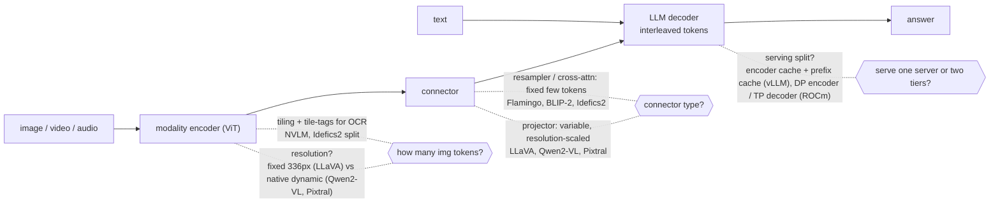
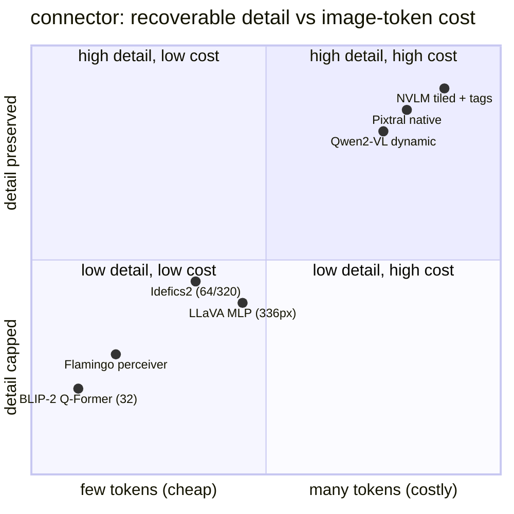

**What they share.** Every vision-language system is the same spine: a modality encoder turns an image into a feature grid, a connector maps those features into the LLM embedding space, and one decoder generates over an interleaved text-plus-image token sequence. They differ almost entirely in the connector and in how many tokens an image is allowed to become.

**The choices, side by side.**

| Decision | Options (who) | What decides it |
| --- | --- | --- |
| projector | `MLP` (LLaVA, Qwen2-VL, Pixtral) vs `cross-attn` (Flamingo, NVLM option) vs `resampler` (BLIP-2 Q-Former, Idefics2, Flamingo perceiver) | MLP passes a variable resolution-scaled block so detail scales with cost; resampler / cross-attn compress to a fixed few so cost is bounded but detail is capped |
| resolution | `fixed` (LLaVA CLIP ViT-L/14 336px) vs `tiling/dynamic` (Qwen2-VL native, Pixtral native, NVLM tiles) | Task detail: OCR and dense docs need high resolution; "what is in this picture" does not |
| image-token budget | `variable, scales with pixels` (Qwen2-VL, Pixtral) vs `fixed cap` (BLIP-2 = 32, Idefics2 = 64 or 320, Flamingo few) | Whether per-request cost/latency must be bounded vs whether fine detail must survive |
| serving split | `one server` vs `separate encoder tier + prefix/embedding cache` (Red Hat vLLM V1) vs `DP encoder + TP decoder` (AMD ROCm) | Encoder is bounded, batchable, cacheable by image hash; decoder is autoregressive and memory-bound; scale each independently and route text-only past the encoder |

**The math that separates them.**

$$\textbf{image tokens} \ =\ \left\lfloor \tfrac{H}{p} \right\rfloor \left\lfloor \tfrac{W}{p} \right\rfloor \quad (\text{Pixtral: } 1024^2, p{=}16 \Rightarrow 4096)$$

$$\textbf{tiled token count} \ =\ T \cdot \tfrac{H_t W_t}{p^2} \ +\ \text{tags} \quad (\text{grows linearly in tiles } T)$$

$$\textbf{prefill compute is quadratic} \ =\ O\big((n_\text{text}+n_\text{img})^2 d\big)$$

$$\textbf{KV bytes} \ =\ 2 \cdot L \cdot (n_\text{text}+n_\text{img}) \cdot d_\text{kv} \cdot b_\text{prec}$$

