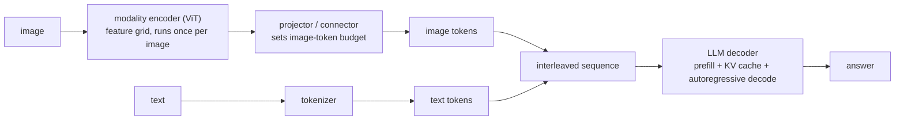
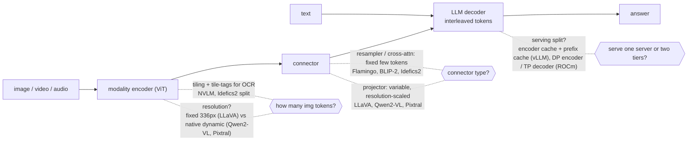
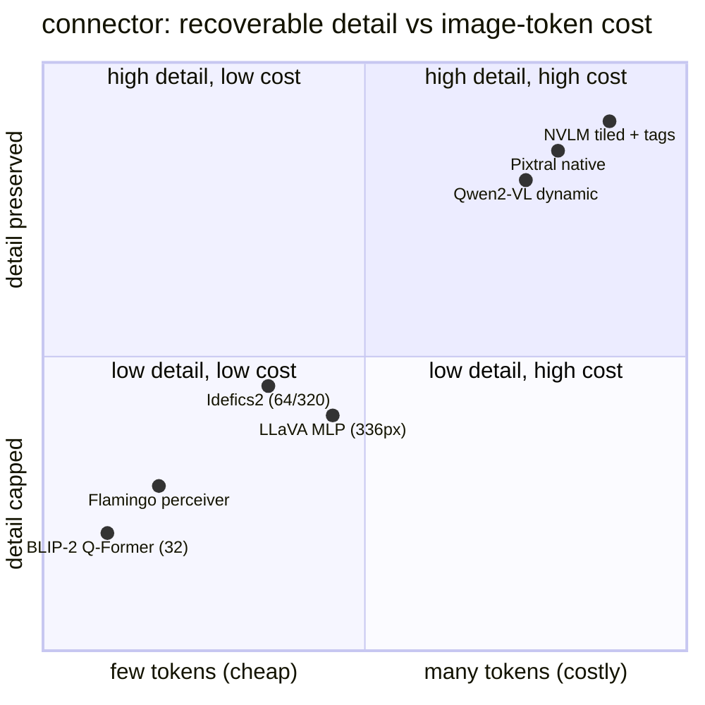

**What they share.** Every vision-language system is the same spine: a modality encoder turns an image into a feature grid, a connector maps those features into the LLM embedding space, and one decoder generates over an interleaved text-plus-image token sequence. They differ almost entirely in the connector and in how many tokens an image is allowed to become.

**The reference pipeline.** Read the spine left to right before arguing about any single design: the encoder is a bounded, batchable pass that runs once per image; the projector is where the token budget is set; the decoder is the autoregressive, memory-bound stage where every image token lands in prefill and the KV cache. Most design decisions are just different answers to "how big is the block the projector hands the decoder."

**The choices, side by side.**

| Decision | Options (who) | What decides it |
| --- | --- | --- |
| projector | `MLP` (LLaVA, Qwen2-VL, Pixtral) vs `cross-attn` (Flamingo, NVLM option) vs `resampler` (BLIP-2 Q-Former, Idefics2, Flamingo perceiver) | MLP passes a variable resolution-scaled block so detail scales with cost; resampler / cross-attn compress to a fixed few so cost is bounded but detail is capped |
| resolution | `fixed` (LLaVA CLIP ViT-L/14 336px) vs `tiling/dynamic` (Qwen2-VL native, Pixtral native, NVLM tiles) | Task detail: OCR and dense docs need high resolution; "what is in this picture" does not |
| image-token budget | `variable, scales with pixels` (Qwen2-VL, Pixtral) vs `fixed cap` (BLIP-2 = 32, Idefics2 = 64 or 320, Flamingo few) | Whether per-request cost/latency must be bounded vs whether fine detail must survive |
| serving split | `one server` vs `separate encoder tier + prefix/embedding cache` (Red Hat vLLM V1) vs `DP encoder + TP decoder` (AMD ROCm) | Encoder is bounded, batchable, cacheable by image hash; decoder is autoregressive and memory-bound; scale each independently and route text-only past the encoder |

**The math that separates them.**

$$\textbf{image tokens} \ =\ \left\lfloor \frac{H}{p} \right\rfloor \left\lfloor \frac{W}{p} \right\rfloor \quad (\text{Pixtral: } 1024^2, \ p{=}16 \ \Rightarrow\ 4096)$$

$$\textbf{tiled token count} \ =\ T \cdot \frac{H_t \, W_t}{p^2} \ +\ \text{tags} \quad (\text{grows linearly in tiles } T)$$

$$\textbf{sequence length} \ =\ n \ =\ n_\text{text} + n_\text{img}, \quad n_\text{img} \ \gg\ n_\text{text} \ \text{ for a high-res image}$$

$$\textbf{prefill compute is quadratic} \ =\ O\big((n_\text{text}+n_\text{img})^2 \, d\big) \quad (\text{image tokens dominate first-token latency})$$

$$\textbf{KV bytes} \ =\ 2 \cdot L \cdot (n_\text{text}+n_\text{img}) \cdot d_\text{kv} \cdot b_\text{prec} \quad (\text{image tokens inflate every layer's cache})$$

$$\textbf{multi-image cost} \ =\ \sum_{i=1}^{k} n_{\text{img},i} \quad (\text{k images stack linearly into prefill and KV})$$

**Interview watch-outs.**

- **Projector design is the whole answer.** MLP passes a variable resolution-scaled block (detail scales with cost); resampler / cross-attn (Q-Former, perceiver) compress to a fixed few (cost bounded, detail capped). Name the tradeoff, do not just name the connector.
- **Image-token budget, not model size, drives cost.** A single 1024x1024 image is 4096 tokens in Pixtral; those tokens hit prefill (quadratic) and the KV cache (every layer). "An image costs many tokens in the priciest stage" is the line that scores.
- **Resolution and tiling are a quality-cost knob, not a default.** Tiling recovers OCR-level detail but multiplies tokens, and unordered tiles need tile-tags (NVLM) to preserve spatial layout. Max resolution only when the task needs it.
- **Fixed-cap connectors bound cost but lose detail.** BLIP-2 (32 tokens) and Idefics2 (64/320) cap per-request cost; call out that dense documents and OCR are exactly where that cap hurts.
- **Serving is two workloads, not one.** The encoder is bounded, batchable, and cacheable by image hash (vLLM V1 embedding + prefix cache; ROCm DP encoder + TP decoder); the decoder is autoregressive and memory-bound. Scale each independently and route text-only requests past the encoder.
- **Variable token counts break naive batching.** Dynamic-resolution models (Qwen2-VL, Pixtral) make requests heterogeneous in size, so continuous batching and KV planning must handle variable-length visual blocks, and worst-case large images still need a cap.
