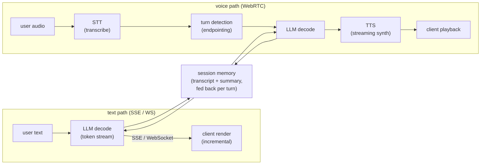
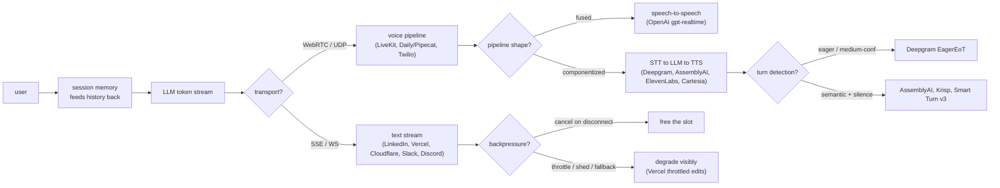
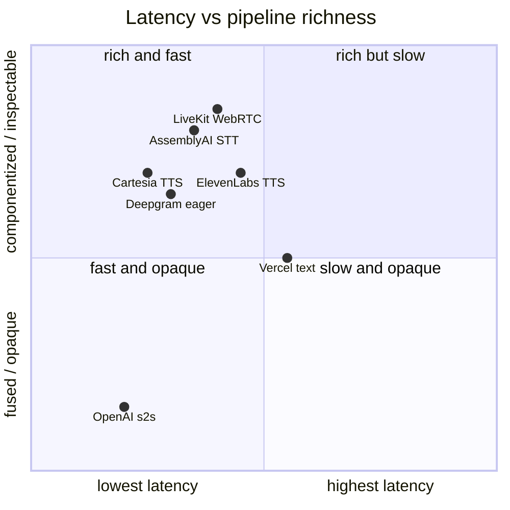

**What they share.** Every system carries the same spine: an LLM emits tokens, a transport streams them out, the client renders incrementally, and session memory feeds history back into the next turn. The forks are transport, whether the medium is text or voice, and how each fights per-hop latency.

**The reference pipeline.** Text chat and voice differ mostly in what wraps the LLM. Text streams tokens straight over SSE or WebSocket to an incremental renderer. Voice bolts an STT front end and a TTS back end onto the same LLM, with a turn-detection stage deciding when the user has stopped so the model can start. Both loops read from and write back to session memory each turn.

**Reading the diagram.** Follow the text path first: the LLM decodes a token stream and pushes it straight to an incremental client renderer over SSE (Vercel, OpenAI text) or a WebSocket (Cloudflare Durable Objects, Slack, Discord), so the only real hop is decode plus transport and the user feels time-to-first-token before the full reply lands. The voice path bolts an STT front end (Deepgram, AssemblyAI) ahead of the LLM and a streaming TTS back end (ElevenLabs, Cartesia) behind it, with a turn-detection stage in between deciding when the user has actually stopped talking. The key transport decision is SSE versus WebSocket for text and WebRTC for voice, because ordered TCP stalls all buffered audio on a single lost packet (head-of-line blocking) while one-directional tokens tolerate it fine. Both loops read and write session memory every turn, which is the central failure mode: the transcript grows, prefill re-reads it, and turn five costs more than turn one unless prefix caching plus sticky routing keep the cached KV warm on the same replica. The other failure mode is backpressure, since each open stream pins an inference slot for its whole generation, so an orphaned or slow consumer silently eats GPU capacity until you cancel on disconnect and bound the buffer. Voice is the tightest budget: componentized STT to LLM to TTS sums every hop, so a conversational feel needs the whole chain under roughly one second, which is where fused speech-to-speech (OpenAI gpt-realtime) trades tunability for a shorter sum. The design leverage is that the same spine serves both media, so you pick transport and pipeline shape per latency budget rather than rebuilding the loop.

**Where they diverge.**

**The choices, side by side.**

| Decision | Options (who) | What decides it |
| --- | --- | --- |
| transport | `SSE` (Vercel/OpenAI text) vs `WebSocket` (Cloudflare DO, Slack, Discord) vs `WebRTC/UDP` (LiveKit, Daily/Pipecat) | Text tolerates ordered TCP; voice cannot, because a 200ms TCP retransmit stalls all buffered audio (head-of-line blocking) |
| pipeline | `text stream` (LinkedIn, Vercel) vs `fused speech-to-speech` (OpenAI gpt-realtime-mini) vs `componentized STT-LLM-TTS` (Deepgram/AssemblyAI/ElevenLabs/Cartesia) | Fused = lowest latency, black-box turn detect, no inspectable transcript; componentized = debuggable, tunable, more hops to add up |
| turn detection | model-side (OpenAI) vs eager medium-confidence (Deepgram) vs semantic+acoustic+silence (AssemblyAI ~300ms, Krisp 6M-weight CPU, Smart Turn v3 12ms CPU) | Silence-only gives awkward pauses; eager cuts latency but misfires on half-utterances; semantic detects true end-of-turn |
| session/memory | shared prompt templates (LinkedIn) vs Durable Object per-connection UUID (Cloudflare) vs Redis/PostgreSQL locks+kv (Vercel) vs stateful channel servers (Slack 500ms, Discord GenServer 5M concurrent) | Sticky routing to the replica holding cached KV; without stickiness every turn is a full-prefill cache miss |
| backpressure/degradation | cancel on disconnect + continuous batching (generic) vs throttled edit-loop fallback (Vercel) vs queue/shed/fall-back-to-smaller-model (generic) | Each stream holds an inference slot for its whole generation, so orphaned streams silently eat capacity |

**The math that separates them.**

$$\textbf{End-to-end text latency:}\quad T_{\text{felt}} = T_{\text{TTFT}} + (N-1)\cdot t_{\text{inter}}$$

where `N` is tokens generated and `t_inter` is the inter-token gap. Users judge `T_TTFT`; the tail rides on the per-token term.

$$\textbf{Inter-token step time:}\quad t_{\text{inter}} = \frac{1}{\text{tok/sec}} = t_{\text{decode}} + t_{\text{transport}}$$

so a stream feels smooth only when the decode step plus one transport hop stays under the human reading rate (roughly 20 to 40 ms per token feels fluid).

$$\textbf{Voice pipeline latency sum:}\quad L_{\text{voice}} = L_{\text{STT}} + L_{\text{turn}} + L_{\text{LLM}} + L_{\text{TTS}} + L_{\text{net}}$$

componentized voice adds every stage, so a 300 ms endpoint plus a 200 ms STT plus a 400 ms first-token plus a 135 ms TTS first-byte already crowds a 1 second conversational budget before network.

$$\textbf{Eager speculation cost tradeoff:}\quad C_{\text{LLM}} = C_{\text{base}}\cdot(1 + p_{\text{resume}}),\quad p_{\text{resume}} \approx 0.5 \text{ to } 0.7$$

$$\textbf{Per-turn prefill grows with history:}\quad T_{\text{prefill}} \propto (1 - h_{\text{cache}})\cdot L_{\text{ctx}}$$

as context `L_ctx` grows each turn, only the prefix-cache hit rate `h_cache` (which needs sticky routing) keeps prefill from climbing with it.

**When to use which.**

Pick the transport, pipeline shape, and turn detection by the medium and the latency budget, then let the latency formulas set where you spend.

| Reach for | When | Instead of |
|---|---|---|
| SSE | One-directional text tokens over plain HTTP (Vercel, OpenAI text) | WebSocket, unless you need duplex signaling |
| WebSocket | Duplex mid-stream signaling: interrupts, multiplexed streams (Cloudflare DO, Slack, Discord) | SSE when the channel is only server to client |
| WebRTC over UDP | Voice audio, to avoid head-of-line blocking (LiveKit, Daily, Pipecat) | Ordered TCP, where one lost packet stalls all buffered audio |
| Fused speech-to-speech | Lowest voice latency and tunability is not required (OpenAI gpt-realtime) | Componentized when you need an inspectable transcript |
| Componentized STT to LLM to TTS | You need debuggable, tunable voice (Deepgram, AssemblyAI, ElevenLabs, Cartesia) | Fused when every hop must be inspectable |
| Eager turn detection (speculation cost) | You can shave hundreds of ms and the LLM call is genuinely cancelable (Deepgram EagerEoT) | Semantic endpointing when resumes waste 50 to 70 percent of calls |
| Semantic plus silence endpointing | You must avoid misfires on half-utterances (AssemblyAI, Krisp, Smart Turn v3) | Silence-only detection that leaves awkward pauses |
| Prefix caching plus sticky routing | Long multi-turn sessions where per-turn prefill climbs with history | Stateless routing, where every turn is a full-prefill cache miss |
| Cancel on disconnect and bounded buffers | Each open stream pins an inference slot for its whole generation | Leaving orphaned or slow streams to silently eat GPU |

**Interview watch-outs.**

- **Transport: SSE vs WebSocket vs WebRTC.** Default to SSE for text (one-directional tokens over plain HTTP); reach for WebSocket only when you need duplex mid-stream signaling (live interrupts, multiplexed streams, auth via subprotocol); switch to WebRTC/UDP for voice, because ordered TCP stalls all buffered audio on a single lost packet (head-of-line blocking). Naming WebSocket for audio is the classic trap.
- **Session memory and the growing-context bill.** Every turn re-processes the whole transcript in prefill, so turn five costs more than turn one. State where memory lives (stateless client transcript vs server session store), then cut cost with prefix caching plus summarization or truncation. If you claim prefix caching, say the sticky-routing requirement in the same breath.
- **Sticky routing or the cache never hits.** Prefix caching only helps if the follow-up turn lands on the replica holding the cached KV. Route sessions consistently, but keep the cache best-effort so a hot session can still migrate under load.
- **Backpressure and cancellation are capacity, not hygiene.** Each stream pins an inference slot for its whole generation. Propagate user cancel and client disconnect to the engine and free the slot immediately; orphaned streams silently eat GPU. Bound buffering for slow consumers.
- **Voice latency budget.** Componentized STT-LLM-TTS sums every hop, so you cannot spend independently; a conversational feel needs the whole chain under roughly one second. Know each stage's floor (AssemblyAI ~300ms endpoint, Cartesia ~135ms TTS first-byte) and where fused speech-to-speech trades tunability for a shorter sum.
- **Eager end-of-turn trades tokens for latency.** Starting the LLM on a medium-confidence transcript shaves hundreds of ms but throws away 50 to 70 percent more calls when the user resumes, so the LLM (and downstream TTS) call must be genuinely cancelable. Graceful degradation under overload (queue, shed, fall back to a smaller model) should degrade visibly, never hang.
