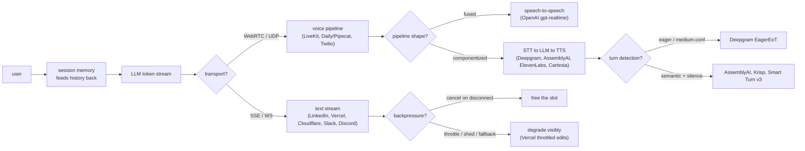
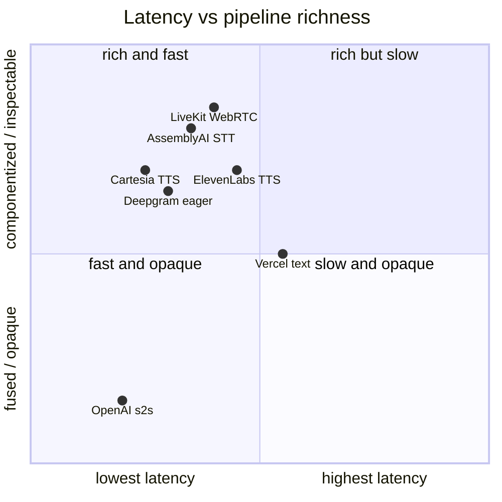

**What they share.** Every system carries the same spine: an LLM emits tokens, a transport streams them out, the client renders incrementally, and session memory feeds history back into the next turn. The forks are transport, whether the medium is text or voice, and how each fights per-hop latency.

**The choices, side by side.**

| Decision | Options (who) | What decides it |
| --- | --- | --- |
| transport | `SSE` (Vercel/OpenAI text) vs `WebSocket` (Cloudflare DO, Slack, Discord) vs `WebRTC/UDP` (LiveKit, Daily/Pipecat) | Text tolerates ordered TCP; voice cannot, because a 200ms TCP retransmit stalls all buffered audio (head-of-line blocking) |
| pipeline | `text stream` (LinkedIn, Vercel) vs `fused speech-to-speech` (OpenAI gpt-realtime-mini) vs `componentized STT-LLM-TTS` (Deepgram/AssemblyAI/ElevenLabs/Cartesia) | Fused = lowest latency, black-box turn detect, no inspectable transcript; componentized = debuggable, tunable, more hops to add up |
| turn detection | model-side (OpenAI) vs eager medium-confidence (Deepgram) vs semantic+acoustic+silence (AssemblyAI ~300ms, Krisp 6M-weight CPU, Smart Turn v3 12ms CPU) | Silence-only gives awkward pauses; eager cuts latency but misfires on half-utterances; semantic detects true end-of-turn |
| session/memory | shared prompt templates (LinkedIn) vs Durable Object per-connection UUID (Cloudflare) vs Redis/PostgreSQL locks+kv (Vercel) vs stateful channel servers (Slack 500ms, Discord GenServer 5M concurrent) | Sticky routing to the replica holding cached KV; without stickiness every turn is a full-prefill cache miss |
| backpressure/degradation | cancel on disconnect + continuous batching (generic) vs throttled edit-loop fallback (Vercel) vs queue/shed/fall-back-to-smaller-model (generic) | Each stream holds an inference slot for its whole generation, so orphaned streams silently eat capacity |

**The math that separates them.**

$$\textbf{End-to-end text latency:}\quad T_{\text{felt}} = T_{\text{TTFT}} + (N-1)\cdot t_{\text{inter}}$$

$$\textbf{Voice pipeline latency sum:}\quad L_{\text{voice}} = L_{\text{STT}} + L_{\text{turn}} + L_{\text{LLM}} + L_{\text{TTS}} + L_{\text{net}}$$

$$\textbf{Eager speculation cost tradeoff:}\quad C_{\text{LLM}} = C_{\text{base}}\cdot(1 + p_{\text{resume}}),\quad p_{\text{resume}} \approx 0.5 \text{ to } 0.7$$

$$\textbf{Per-turn prefill grows with history:}\quad T_{\text{prefill}} \propto (1 - h_{\text{cache}})\cdot L_{\text{ctx}}$$

