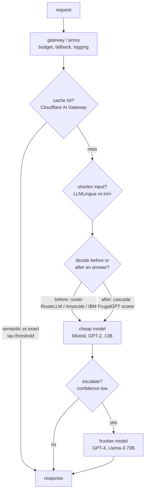
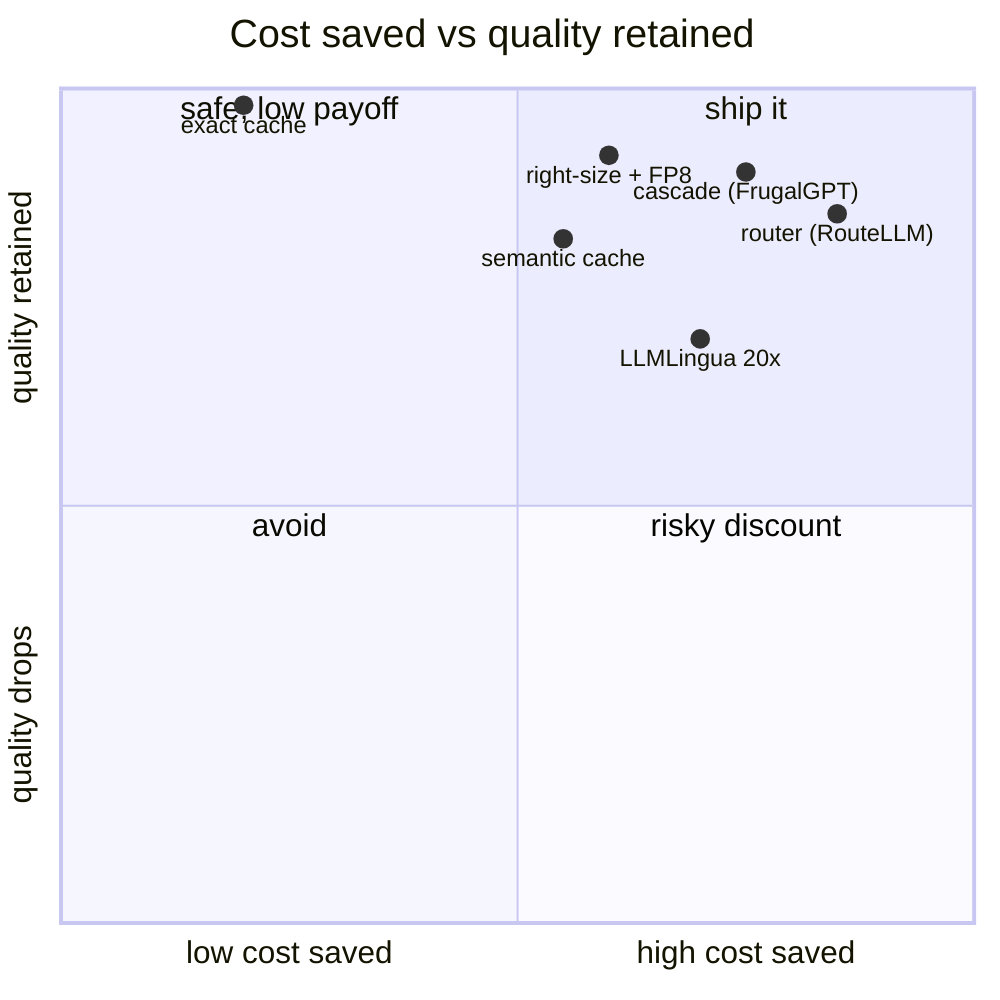

**What they share.** Every lever moves a query left on one quality-cost frontier by matching cheap paths to easy work and reserving the frontier model for the hard tail. All sit upstream of the model call in a gateway, and all live or die on one knob calibrated against a quality eval.

**The choices, side by side.**

| Decision | Options (who) | What decides it |
| --- | --- | --- |
| routing | `difficulty router` blind, pre-call (RouteLLM, Anyscale, IBM) vs `cascade` scores its own answer (FrugalGPT) | Latency budget: a two-model path needs slack; router decides once, cascade catches its own mistake |
| caching | `semantic cache` embed + threshold vs `exact` hash(model, body) (Cloudflare) | Free-text repeats: exact rarely fires, semantic catches paraphrases but a loose tau leaks wrong answers |
| prompt compression | `LLMLingua` perplexity token-drop vs `context trim` top-k rerank vs none | Input tokens must dominate and context be long, verbose, redundant; else the small-LM pass is pure overhead |
| model right-sizing / quant | `fine-tuned small` per task + `FP8` self-host (Anyscale, Baseten) vs one frontier model | Task narrowness and QPS: FP8 helps only models you host above the QPS where fixed GPU beats API price |

**The math that separates them.**

$$\textbf{Cascade expected cost:}\quad \mathbb{E}[C] = c_1 + (1-p_1)\,c_2 + (1-p_1)(1-p_2)\,c_3$$

$$\textbf{Router expected savings:}\quad S = f_{\text{weak}}\,(c_{\text{big}} - c_{\text{small}}) - c_{\text{router}}$$

$$\textbf{Cache serve when:}\quad \max_{k}\ \cos(e_q, e_k) \ge \tau,\quad \tau \in (0,1)$$

$$\textbf{Prompt compression ratio:}\quad \rho = \frac{n_{\text{orig}}}{n_{\text{comp}}},\quad \text{net win iff } c_{\text{big}}\,(n_{\text{orig}}-n_{\text{comp}}) > c_{\text{small}}\,n_{\text{orig}}$$

