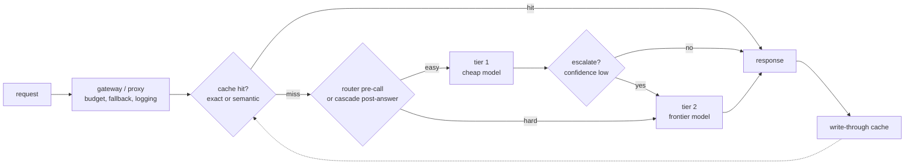
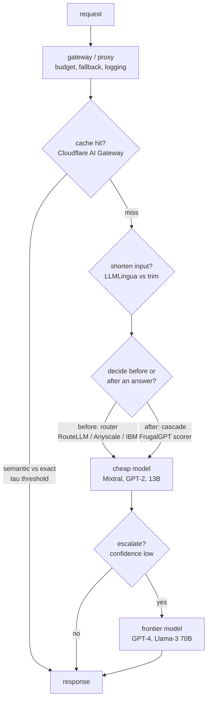
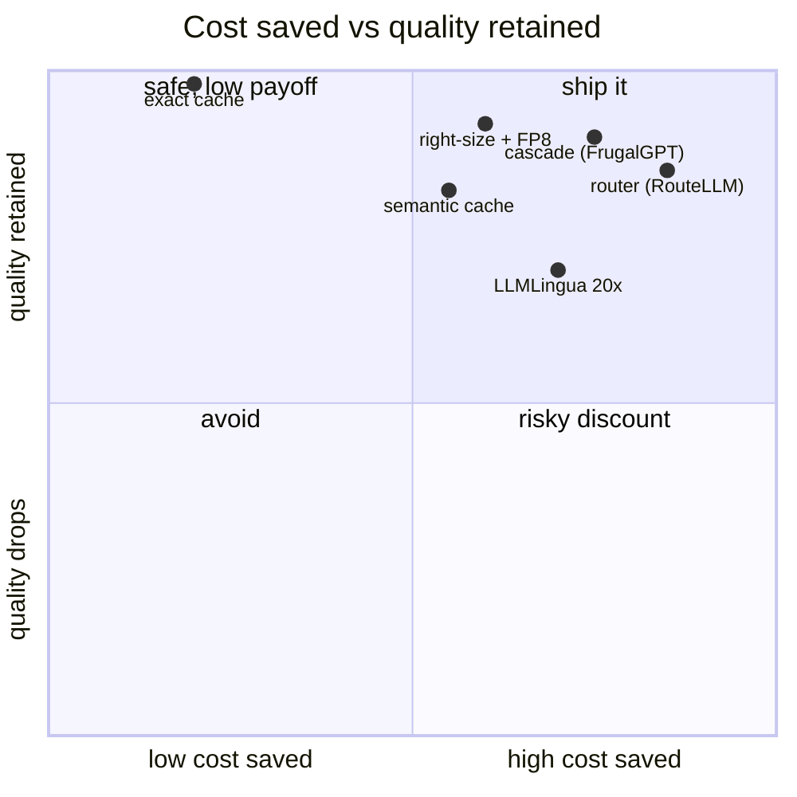

**What they share.** Every lever moves a query left on one quality-cost frontier by matching cheap paths to easy work and reserving the frontier model for the hard tail. All sit upstream of the model call in a gateway, and all live or die on one knob calibrated against a quality eval.

**The reference pipeline.** Every design below is a specialization of one request path: a gateway fronts the providers, a cache short-circuits repeats, a router or cascade picks a tier, and only the surviving hard queries reach the frontier model. Read each teardown as swapping in one box on this spine.

**Reading the diagram.** A request first hits the gateway or proxy, the single control point that enforces budget, fallback, and logging so every downstream lever is observable. It then checks the cache: an exact hash rarely fires on free text, so a semantic lookup catches paraphrases, but a loose similarity threshold (tau too low) is the key failure mode, serving a near-neighbor's answer to a different question, confidently and cheaply wrong, which is why tenant-scoped or personalized replies must never be shared. On a miss the request meets the core fork: a router (RouteLLM, Anyscale, IBM) decides blind and pre-call to fit a tight latency budget but cannot know it mis-routed, while a cascade (FrugalGPT) scores its own answer post-generation and catches its own mistakes at the cost of an extra call, so the choice is a latency trade, not a quality one. Whichever path picks the tier, easy work lands on the cheap tier-1 model and only the hard tail, or a low-confidence tier-1 answer that escalates, reaches the frontier tier-2 model, which keeps each query on the cheapest point of the quality-cost frontier that still clears the bar. The largest lever here is right-sizing, matching model size to task so traffic mass shifts to the small tier rather than shaving a few tokens, and it demands a paired quality number per bucket since a green cost dashboard is the exact signature of a router dumping newly-hard queries on the weak model. Finally the response returns and a write-through step repopulates the cache, closing the loop so future repeats short-circuit before they ever spend a model call.

**Where they diverge.** The same spine forks on four independent choices, each with its own deciding constraint.

**The choices, side by side.**

| Decision | Options (who) | What decides it |
| --- | --- | --- |
| routing | `difficulty router` blind, pre-call (RouteLLM, Anyscale, IBM) vs `cascade` scores its own answer (FrugalGPT) | Latency budget: a two-model path needs slack; router decides once, cascade catches its own mistake |
| caching | `semantic cache` embed + threshold vs `exact` hash(model, body) (Cloudflare) | Free-text repeats: exact rarely fires, semantic catches paraphrases but a loose tau leaks wrong answers |
| prompt compression | `LLMLingua` perplexity token-drop vs `context trim` top-k rerank vs none | Input tokens must dominate and context be long, verbose, redundant; else the small-LM pass is pure overhead |
| model right-sizing / quant | `fine-tuned small` per task + `FP8` self-host (Anyscale, Baseten) vs one frontier model | Task narrowness and QPS: FP8 helps only models you host above the QPS where fixed GPU beats API price |

**The math that separates them.**

$$\textbf{Cascade expected cost:}\quad \mathbb{E}[C] = c_1 + (1-p_1) c_2 + (1-p_1)(1-p_2) c_3$$

where $c_i$ is the cost of stage $i$ and $p_i$ is the probability its answer is accepted.

$$\textbf{Router expected savings:}\quad S = f_{\text{weak}} (c_{\text{big}} - c_{\text{small}}) - c_{\text{router}}$$

where $f_{\text{weak}}$ is the fraction of traffic the weak model handles at bar.

$$\textbf{Cache serve when:}\quad \max_{k}\ \cos(e_q, e_k) \ge \tau,\quad \tau \in (0,1)$$

$$\textbf{Prompt compression ratio:}\quad \rho = \frac{n_{\text{orig}}}{n_{\text{comp}}},\quad \text{net win iff } c_{\text{big}} (n_{\text{orig}}-n_{\text{comp}}) > c_{\text{small}} n_{\text{orig}}$$

$$\textbf{Cache effective cost:}\quad \mathbb{E}[C_{\text{cache}}] = h\, c_{\text{hit}} + (1-h)(c_{\text{embed}} + c_{\text{model}})$$

where $h$ is the hit rate; caching pays only when $h\, (c_{\text{model}} - c_{\text{hit}}) > c_{\text{embed}}$, so the break-even hit rate is:

$$\textbf{Cache-hit break-even:}\quad h^{*} = \frac{c_{\text{embed}}}{c_{\text{model}} - c_{\text{hit}}}$$

$$\textbf{Blended cost across tiers:}\quad \mathbb{E}[C_{\text{route}}] = c_{\text{router}} + \sum_{i} f_i\, c_i,\quad \sum_{i} f_i = 1$$

where $f_i$ is the fraction of traffic sent to tier $i$; right-sizing shifts mass to small $c_i$ without crossing the quality bar.

$$\textbf{Self-host vs API break-even:}\quad Q^{*} = \frac{c_{\text{gpu/hour}}}{3600\, \cdot\, t_{\text{tok}}\, \cdot\, c_{\text{api/tok}}}$$

above QPS $Q^{*}$ the fixed GPU beats per-token API price, where $t_{\text{tok}}$ is tokens per request and $c_{\text{api/tok}}$ is the API price per token.

**When to use which.** Pick the lever by the binding constraint, and pick the formula that proves it paid.

| Reach for | When | Instead of |
|---|---|---|
| Blind pre-call router (RouteLLM, Anyscale, IBM) | Tight latency SLO with no slack for a second call, traffic splits cleanly into easy and hard | A cascade, which spends a first call plus a scorer before it can escalate |
| Cascade scorer (FrugalGPT) | You have latency slack and want the system to catch its own mis-routes by scoring a real answer | A blind router that cannot know it sent a hard query to the weak model |
| Semantic cache (embed plus tau) | Free-text repeats and paraphrases are common and replies are not tenant-scoped or personalized | Exact hashing, which almost never fires on free text |
| Exact hash cache (Cloudflare) | Identical requests recur (fixed prompts, shared system messages) and any wrong-neighbor answer is unacceptable | A loose semantic tau that can leak a near-neighbor's answer |
| LLMLingua compression | Input tokens dominate cost and context is long, verbose, and redundant | Context trim or nothing, when the small-LM pass would be pure overhead |
| Fine-tuned small model plus FP8 self-host (Anyscale, Baseten) | Task is narrow and QPS clears the self-host break-even Q* where fixed GPU beats API price | One frontier model wired in for every classification, extraction, and routing call |
| Cache-hit break-even h* check | Deciding whether a semantic cache pays at all before shipping it | Eyeballing raw hit rate, which hides that embedding cost can exceed the saving |
| Blended-cost formula across tiers | Proving right-sizing shifted traffic mass, cost quoted with per-bucket quality | A single aggregate bill number with no quality attached |

**Interview watch-outs.**

- **Routing vs cascade is a latency trade, not a quality trade.** A router decides once, blind, before any generation, so it fits a tight SLO but cannot know it mis-routed; a cascade sees a real answer before spending more, catching its own mistakes at the cost of a first call plus a scorer. Say which constraint forces the choice; if you have slack, route first then cascade within a bucket.
- **Semantic cache staleness and scope are the silent killers.** A loose $\tau$ returns a near-neighbor's answer to a different question (confidently, cheaply wrong), and no TTL serves a moved fact forever. Never share-cache personalized or tenant-scoped answers; that is a data leak, not a cost win. Tune $\tau$ on labeled should-hit / should-not pairs, not by eyeballing hit rate.
- **A cost number without a paired quality number is meaningless.** "The bill dropped 40%" is unanswerable without per-bucket quality tracking; a green cost dashboard is the exact signature of a router dumping newly-hard queries on the small model. Always quote cost saved and quality retained together, and load the eval set with the hard tail.
- **The right-sizing knob is where the money actually is.** Most bills are one frontier model wired in for simplicity doing classification, routing, extraction, and embeddings it never needed. Match model size to task before reaching for clever caching or compression; the blended-cost formula moves most when you shift traffic mass, not when you shave a few tokens.
- **Compression and quantization only pay in their regime.** LLMLingua nets out only when input tokens dominate and context is redundant; FP8 and batching only help models you host above the break-even QPS. On a per-token API your levers are routing, caching, compression, and right-sizing, nothing that changes tokens-per-GPU.
- **Every knob drifts.** Route threshold, cascade cutoff, cache $\tau$, and compression ratio are all optimal once and wrong later as traffic shifts. Re-sweep the frontier periodically and alert on per-bucket quality, not aggregate spend; the router and the scorer are themselves models that regress.
