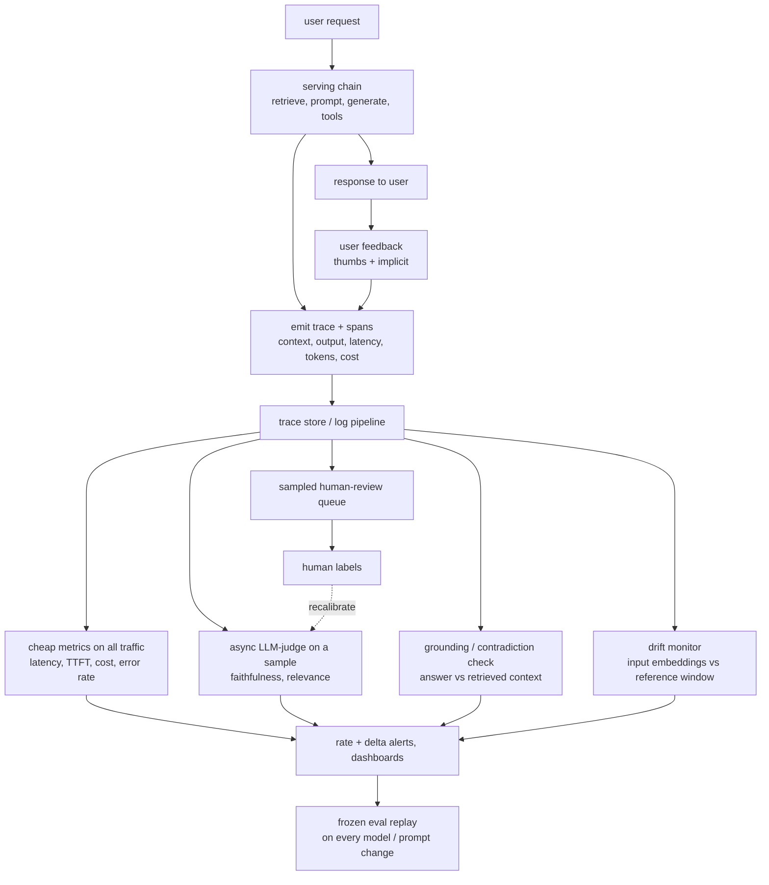
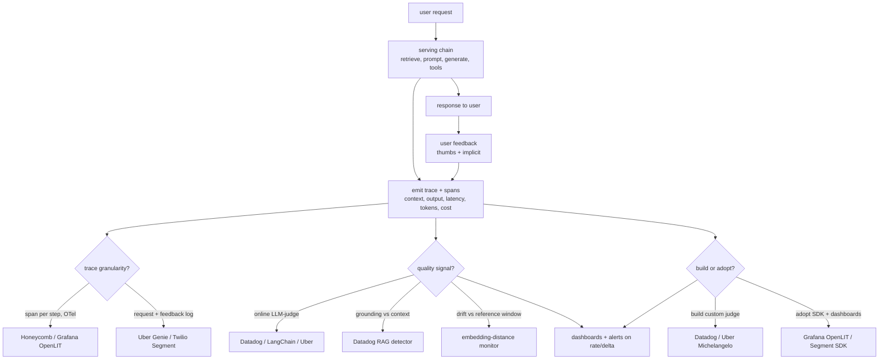
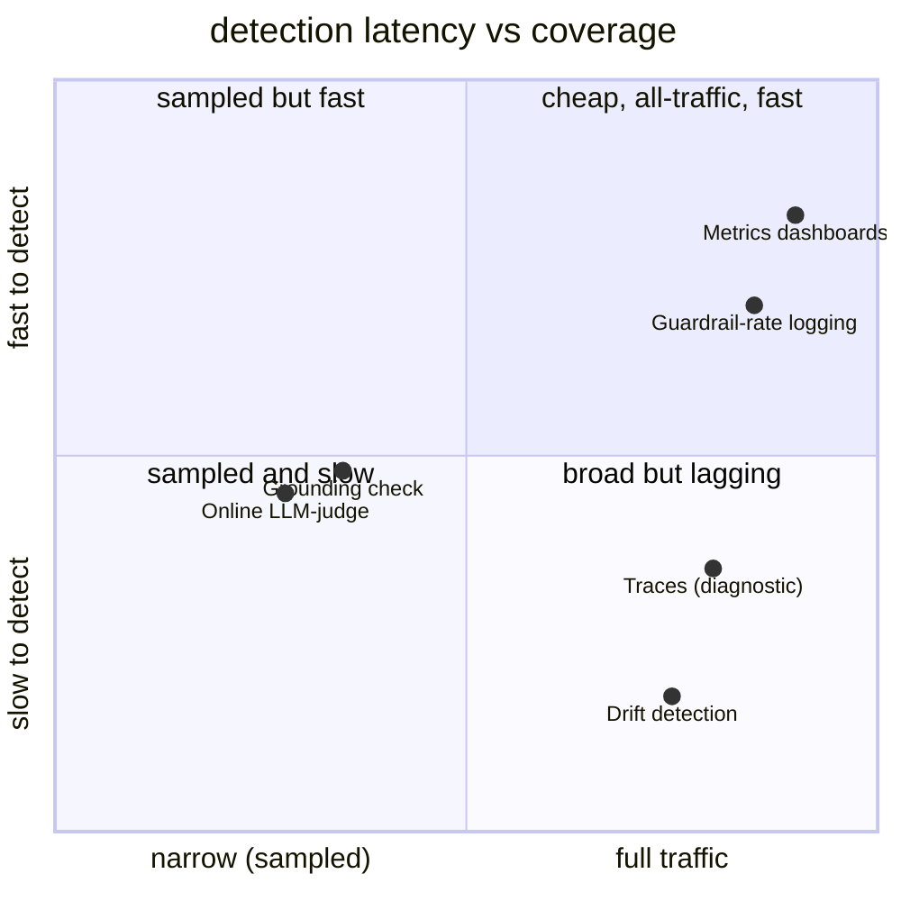

**What they share.** Every system emits a cheap synchronous trace per request (inputs, retrieved context, output, latency, tokens, cost) then fans expensive quality checks off that stream asynchronously and sampled, so serving is never taxed. The dividing lines are what quality signal they trust, how fast it detects, and whether they build the judge or adopt a platform.

**The reference pipeline.** Strip the vendor names and every design is the same loop: serve and answer the user on the hot path, emit a trace with spans off to the side, then run the expensive checks (online judge, grounding, drift) asynchronously on a sample of that stream, roll the results into rates, and alert on the delta after any model or prompt change. Human labels loop back to calibrate the judge rather than dead-ending as an audit.

**Reading the diagram.** Follow one request through the loop: the serving chain retrieves, prompts, generates, and calls tools, returns the response on the hot path, and off to the side emits a trace with a span per step (context, output, latency, tokens, cost) into the trace store, where user feedback (explicit thumbs plus implicit accept/edit/retry signals) is stitched back onto the same trace id. From that one stream the store fans four checks that never tax serving: cheap span-derived metrics on 100 percent of traffic (latency, TTFT, cost, error rate), an async LLM judge on a sample for faithfulness and relevance, a grounding check comparing each claim against the retrieved context, and a drift monitor watching input embeddings against a reference window. The load-bearing decision is that online eval has no labels, so quality is only a proxy that lies until you calibrate the judge against a rolling human sample (report Cohen kappa or F1, as Datadog does on HaluBench) and loop those labels back to recalibrate rather than dead-ending them as an audit. The characteristic failure mode is alerting on a single flagged answer instead of a trended rate: detect a hallucination spike by scoring groundedness per response, computing the z-score of the ungrounded rate versus baseline, and paging on the delta after any retrieval or model change. Tracing granularity is the other real choice, since agents and multi-hop RAG need a span per tool call to localize failure (as Honeycomb and LangChain instrument) while a single-shot copilot can log per message and stitch on a conversation id (Uber Genie via Kafka, Twilio Segment SDK), and dropping the retrieved-context field makes grounding unrecoverable after the fact. Cost is the constraint that shapes the whole design: judging every request roughly doubles the bill, so the expensive checks stay sampled and async while the sample rate itself is the lever, since cost is linear in the sampled fraction but detection latency is inverse in it. The design leverage is that every consumer (dashboards, rate-plus-delta alerts, and a frozen eval replay on each model or prompt change) hangs off the same cheap trace, so one instrumentation point pays for diagnosis, monitoring, regression catching, and judge calibration at once.

**How they diverge.**

**The choices, side by side.**

| Decision | Options (who) | What decides it |
| --- | --- | --- |
| trace granularity | `span/trace` OTel per step (Honeycomb, Grafana OpenLIT) vs `request+feedback log` (Uber Genie via Kafka/Hive, Twilio Segment) | Agents and multi-hop RAG need step-level spans to localize failure; single-shot copilots can log per-message and stitch on a conversation id |
| quality signal | `online LLM-judge` faithfulness/relevance (Datadog, LangChain, Uber) vs `grounding check` answer-vs-context (Datadog RAG) vs `drift` on embeddings | Judge is the workhorse but biased and costly; grounding is exact only when the answer should be grounded; drift predicts but confirms nothing alone |
| detection latency | immediate-but-read (traces) / minutes (metrics, guardrail rates) / minutes-to-hours (judge, grounding, async) / hours-to-days (drift trends) | Cost of a bad answer: a 3am page justifies fast sampled judging; a bland chat reply lives on a weekly drift dashboard |
| build vs adopt | `build` custom two-stage judge + ETL (Datadog GPT-4o judge, Uber Michelangelo) vs `adopt` auto-instrument SDK (Grafana OpenLIT, Twilio Segment SDK) | Domain-specific faithfulness bar and provider-agnostic control push toward build; low-effort coverage and GenAI semantic conventions push toward adopt |
| coverage vs cost | all-traffic cheap (traces, metrics, guardrail logs) vs sampled expensive (judge, grounding, human review) | Whether the check costs an extra model call per request; only cheap span-derived metrics run on 100 percent |

**The math that separates them.**

$$\textbf{judge-human agreement (Cohen kappa):}\quad \kappa=\frac{p_o-p_e}{1-p_e}$$

where p_o is the observed agree rate between judge and human and p_e is the agree rate expected by chance. kappa = 1 is perfect, kappa = 0 is chance; alert only on a judge whose kappa clears your bar.

$$\textbf{judge quality against human labels:}\quad F_1=\frac{2\,P\,R}{P+R},\qquad P=\frac{TP}{TP+FP},\quad R=\frac{TP}{TP+FN}$$

with TP a hallucination the judge and human both flag, FP a clean answer the judge wrongly flags. Datadog reports 0.810 F1 on HaluBench and RAGTruth; the honest number is the human-labeled set, not the synthetic one.

$$\textbf{faithfulness = grounded claim fraction:}\quad G(a)=\frac{1}{|C(a)|}\sum_{c\in C(a)}\mathbf{1}[\,\text{context}\models c\,]$$

C(a) is the set of atomic claims in answer a; the indicator is 1 when the retrieved context entails claim c. Ungrounded rate per response is 1 minus G(a).

$$\textbf{cosine input-drift score:}\quad d_t=1-\frac{\bar{e}_t\cdot \bar{e}_{\text{ref}}}{\lVert \bar{e}_t\rVert\,\lVert \bar{e}_{\text{ref}}\rVert}$$

e-bar_t is the mean embedding of the current window, e-bar_ref the reference window; d_t near 0 is no drift, d_t rising means traffic is moving under you.

$$\textbf{hallucination-spike detection (rate z-score):}\quad z_t=\frac{r_t-r_{\text{ref}}}{\sqrt{\,r_{\text{ref}}(1-r_{\text{ref}})/n_t\,}}$$

r_t is the ungrounded rate in the current window of n_t judged traces, r_ref the baseline rate; page when z_t exceeds your threshold, so you alert on the delta and not a single flagged event. Smaller n_t (heavier sampling) widens the denominator and demands a larger true jump before it is visible.

$$\textbf{sampling rate sets cost and detection latency:}\quad \mathbb{E}[\text{cost}_{\text{obs}}]=s\cdot \lambda\cdot c_{\text{judge}},\qquad t_{\text{detect}}\approx\frac{k}{s\,\lambda\,r_{\text{fail}}}$$

s is the sampled fraction, lambda the request rate, c_judge the per-call judge cost, r_fail the failure rate, and k the count of failures needed for confidence. Cost is linear in s while detection latency is inverse in s: halving the sample halves the bill but doubles the time to catch a regression.

**Interview watch-outs.**

- Online eval has no labels, so quality is estimated from proxies (LLM-judge faithfulness, grounding against retrieved context, implicit user signals); say up front that accuracy the pre-ship way does not exist online, and that any proxy is a number that lies until it is calibrated against a rolling human sample (report kappa or F1, not just a raw score).
- Detect a hallucination spike on a trended rate, never a single event: score groundedness per response against the logged context, compute the z-score of the ungrounded rate versus baseline, and alert on the delta after any retrieval or model change. A single flagged answer is noise; a rate shift is the signal.
- Tracing granularity is a real decision, not a default: agents and multi-hop RAG need a span per tool call (args, result, error) to localize failure, while a single-shot copilot can log per message and stitch on a conversation id. Too coarse and you cannot find where it broke; too fine and log volume and retention explode. The retrieved context is the single load-bearing field, drop it and grounding is unrecoverable after the fact.
- Cost is the constraint that shapes the whole design: judging every request roughly doubles the bill, so expensive checks are sampled and run async off the hot path while only cheap span-derived metrics run on 100 percent of traffic. Be ready to trade sampling rate against detection latency (cost is linear in s, latency is inverse in s) and to reach for a small fine-tuned encoder when an LLM judge is too costly per sampled trace.
- Sample the tail, not uniformly: stratify and oversample the risky slice (negative or no feedback, high edit or retry rate, low judge or retrieval score, guardrail near-misses, new input clusters) plus a uniform baseline. Uniform random spends the human budget on easy common cases and misses the rare failure that is burning.
- Watch the signals quality metrics miss: a rising refusal or block rate is silent degradation because blocked answers never get scored, and a "drop-in better" model that doubles TTFT or triples cost is a regression even if answers improve. Track guardrail firing rates, latency percentiles (p50/p95/p99, not the mean), TTFT, and cost per request as first-class, and remember the observability store is your largest pool of unredacted user data, so redact and gate access.
