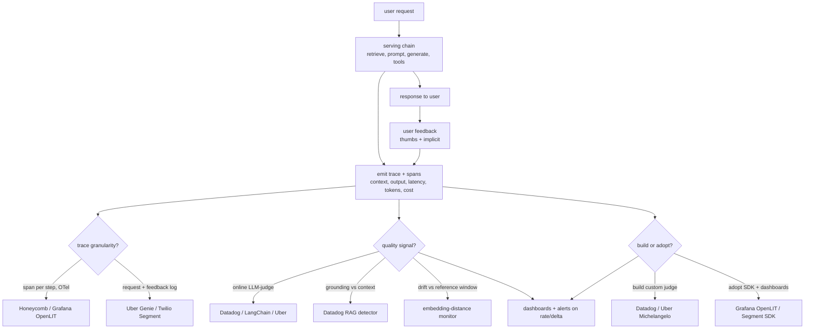
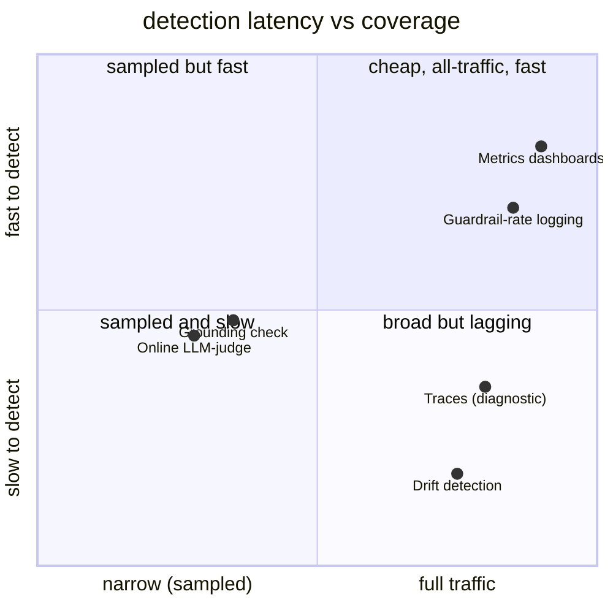

**What they share.** Every system emits a cheap synchronous trace per request (inputs, retrieved context, output, latency, tokens, cost) then fans expensive quality checks off that stream asynchronously and sampled, so serving is never taxed. The dividing lines are what quality signal they trust, how fast it detects, and whether they build the judge or adopt a platform.

**The choices, side by side.**

| Decision | Options (who) | What decides it |
| --- | --- | --- |
| trace granularity | `span/trace` OTel per step (Honeycomb, Grafana OpenLIT) vs `request+feedback log` (Uber Genie via Kafka/Hive, Twilio Segment) | Agents and multi-hop RAG need step-level spans to localize failure; single-shot copilots can log per-message and stitch on a conversation id |
| quality signal | `online LLM-judge` faithfulness/relevance (Datadog, LangChain, Uber) vs `grounding check` answer-vs-context (Datadog RAG) vs `drift` on embeddings | Judge is the workhorse but biased and costly; grounding is exact only when the answer should be grounded; drift predicts but confirms nothing alone |
| detection latency | immediate-but-read (traces) / minutes (metrics, guardrail rates) / minutes-to-hours (judge, grounding, async) / hours-to-days (drift trends) | Cost of a bad answer: a 3am page justifies fast sampled judging; a bland chat reply lives on a weekly drift dashboard |
| build vs adopt | `build` custom two-stage judge + ETL (Datadog GPT-4o judge, Uber Michelangelo) vs `adopt` auto-instrument SDK (Grafana OpenLIT, Twilio Segment SDK) | Domain-specific faithfulness bar and provider-agnostic control push toward build; low-effort coverage and GenAI semantic conventions push toward adopt |
| coverage vs cost | all-traffic cheap (traces, metrics, guardrail logs) vs sampled expensive (judge, grounding, human review) | Whether the check costs an extra model call per request; only cheap span-derived metrics run on 100 percent |

**The math that separates them.**

$$\textbf{judge-human agreement (kappa):}\quad \kappa=\frac{p_o-p_e}{1-p_e}$$

$$\textbf{faithfulness = grounded claim fraction:}\quad G(a)=\frac{1}{|C(a)|}\sum_{c\in C(a)}\mathbf{1}[ \text{context}\models c ]$$

$$\textbf{cosine input-drift score:}\quad d_t=1-\frac{\bar{e}_t\cdot \bar{e}_{\text{ref}}}{\lVert \bar{e}_t\rVert \lVert \bar{e}_{\text{ref}}\rVert}$$

$$\textbf{sampling rate sets observing cost:}\quad \mathbb{E}[\text{cost}_{\text{obs}}]=s\cdot \lambda\cdot c_{\text{judge}},\qquad t_{\text{detect}}\approx \frac{k}{s \lambda r_{\text{fail}}}$$

