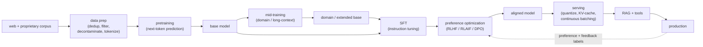
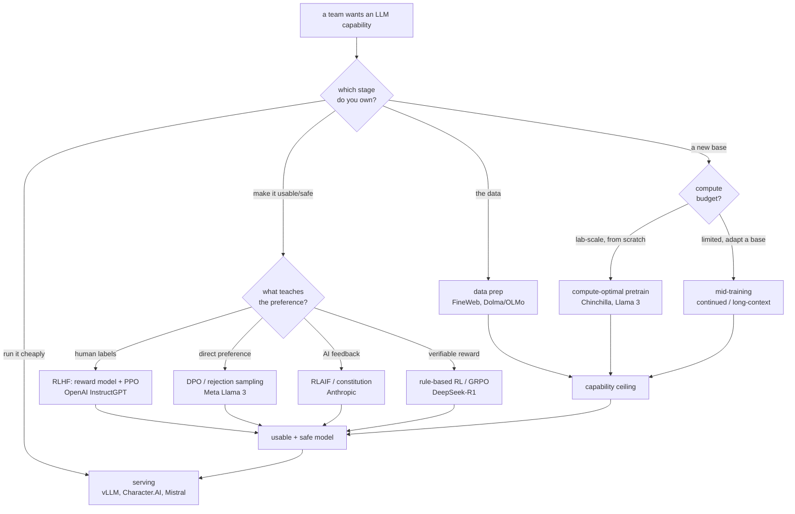
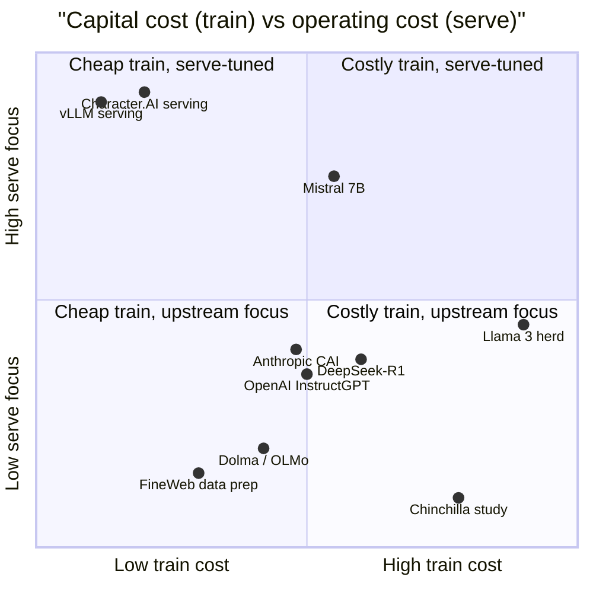

**What they share.** Every system is one stage of the same lifecycle: raw text is cleaned and tokenized once, a pretraining or mid-training run turns it into a base model, post-training aligns that base into an instruct model, and a serving stack quantizes and wraps it for production, with preference and production feedback looping back. None reinvents the objective (next-token prediction upstream, preference optimization downstream); they diverge on which stage they invest in and what the dominant cost is there.

**The reference pipeline.** Read every design below as a specialization of this canonical flow. What changes is which stage a team actually owns: the data recipe that sets the capability ceiling, the pretrain or mid-train that spends the compute, the post-train that makes the model usable and safe, or the serving stack that decides unit economics. Data prep and pretraining are shared upstream infrastructure; most teams enter at the base model and iterate downstream.

**Reading the diagram.** Follow it left to right as five stages, each with its own dominant cost and failure mode. Data prep is the unglamorous front door and the real moat: dedup, quality filtering, decontamination, and PII scrubbing turn the mostly-noise web plus a proprietary corpus into a clean token stream, and this is where FineWeb and Dolma spend their effort, because a benchmark number means nothing if eval leaked into training. Pretraining spends almost all the compute on next-token prediction, and the central decision is compute-optimal sizing (Chinchilla's roughly twenty tokens per parameter), which flips toward a smaller overtrained model once you count the inference you will serve forever, so most teams never run this stage and instead enter at an open base like Llama 3, OLMo, or Qwen3. Mid-training is the cheap high-leverage step few name: continue-pretrain an existing base on domain data or extend its context window, buying most of a domain base for a fraction of a full pretrain while guarding against catastrophic forgetting. Post-training is where a base that only completes text becomes usable and safe, first SFT for instruction following, then preference optimization (InstructGPT's reward-model-plus-PPO, Llama 3's DPO, Anthropic's constitution-driven RLAIF, DeepSeek-R1's rule-based RL), always on a KL leash to the reference model so it does not reward-hack. Serving is the operating cost that runs forever and where products live or die on economics, because decoding is memory-bandwidth bound and the KV cache dominates VRAM, so vLLM pages it and Character.AI shrinks it with MQA and quantization, while RAG bolts on fresh facts at inference rather than baking them into weights. The loop closes when production preferences and feedback flow back into post-training, which is why alignment is a continuous process, not a one-time train.

**Where they diverge.** The first fork is which stage you own; the second is the dominant cost at that stage, which decides the method.

**The choices, side by side.**

| Decision | Options (who) | What decides it |
| --- | --- | --- |
| stage owned | `data prep` (FineWeb, Dolma) vs `pretraining` (Chinchilla, Llama 3, Mistral) vs `post-training` (InstructGPT, Anthropic, DeepSeek-R1) vs `serving` (vLLM, Character.AI) | What you own that the web does not, and where your cost actually lands; almost never a from-scratch pretrain |
| pretrain vs adapt | `from-scratch compute-optimal` (Chinchilla, Llama 3) vs `continued / mid-training on an open base` (most teams, OLMo/Qwen3 as base) | Compute budget and whether a proprietary domain justifies new weights; adapting inherits the base's ceiling and flaws |
| preference method | `RLHF reward model + PPO` (OpenAI) vs `DPO / rejection sampling` (Meta) vs `RLAIF / constitution` (Anthropic) vs `rule-based RL / GRPO` (DeepSeek) | Cost of labels, stability, and whether the reward is a human preference or a verifiable checker (math, code) |
| serving lever | `paged KV cache + continuous batching` (vLLM) vs `GQA / sliding-window` (Mistral) vs `INT8 + MQA + prefix cache` (Character.AI) | Latency and cost budget at QPS; decoding is memory-bandwidth bound, so the KV cache, not FLOPs, is the target |

**The math that separates them.**

$$\textbf{pretraining objective (next-token cross-entropy): } \mathcal{L} = -\frac{1}{T}\sum_{t=1}^{T} \log p_{\theta}(x_t \mid x_{\lt t})$$

$$\textbf{perplexity (report and compare bases): } \text{PPL} = \exp\!\left(-\frac{1}{T}\sum_{t=1}^{T} \log p_{\theta}(x_t \mid x_{\lt t})\right)$$

$$\textbf{compute budget and Chinchilla-optimal split: } C \approx 6 N D, \quad D^{\ast} \approx 20\, N$$

$$\textbf{scaling law (loss vs params and data): } L(N, D) = E + \frac{A}{N^{\alpha}} + \frac{B}{D^{\beta}}$$

$$\textbf{reward model (Bradley-Terry preference): } P(y_w \succ y_l \mid x) = \sigma\!\left(r(x, y_w) - r(x, y_l)\right)$$

$$\textbf{RLHF objective (KL-penalized reward): } \max_{\theta}\; \mathbb{E}\big[r(x, y)\big] - \beta\, \text{KL}\!\left(\pi_{\theta} \,\|\, \pi_{\text{ref}}\right)$$

$$\textbf{DPO loss (preference without a reward model): } \mathcal{L}_{\text{DPO}} = -\mathbb{E}\left[\log \sigma\!\left(\beta \log \frac{\pi_{\theta}(y_w \mid x)}{\pi_{\text{ref}}(y_w \mid x)} - \beta \log \frac{\pi_{\theta}(y_l \mid x)}{\pi_{\text{ref}}(y_l \mid x)}\right)\right]$$

$$\textbf{KV cache memory (serving bottleneck): } M_{\text{kv}} = 2 \, n_{\text{layers}} \, n_{\text{kv}} \, d_{\text{head}} \, L \, b \, s_{\text{bytes}}$$

**When to use which.** Place the problem in one stage, then let the dominant cost there pick the method and the metric.

| Reach for | When | Instead of |
|---|---|---|
| Data-prep investment (FineWeb, Dolma) | Your edge is a proprietary corpus and eval-leakage is the risk to kill | Assuming architecture, not data, sets the capability ceiling |
| From-scratch compute-optimal pretrain (Chinchilla, Llama 3) | Lab-scale compute and no open base covers the need | Mid-training, when an open base would have sufficed |
| Mid-training on an open base (OLMo, Qwen3) | Limited budget, you need a domain or longer context, not new general weights | A full pretrain that only inherits the base's flaws anyway |
| RLHF reward model plus PPO (OpenAI) or DPO (Meta) | Reward is a human preference; DPO to skip training a separate Bradley-Terry reward model | Rule-based RL, which needs a verifiable checker you do not have |
| Rule-based RL / GRPO (DeepSeek-R1) | The reward is verifiable (math, code) so a checker replaces human labels | Paying for human preference labels on machine-checkable tasks |
| KL penalty to the reference policy | Every preference method, to stop reward-hacking into verbose sycophancy | Dropping the leash and letting the policy forget the base |
| Chinchilla 20 tok/param sizing | Minimizing one-off training compute | Overtraining, which you want only when serving cost dominates |
| Overtrain a smaller model past Chinchilla, plus paged KV / GQA / INT8+MQA serving (vLLM, Mistral, Character.AI) | You serve billions of tokens and the KV cache, not FLOPs, caps throughput | Compute-optimal sizing that leaves an expensive model to serve forever |
| RAG at inference | Facts are fresh or private and change often | Fine-tuning them into weights, which goes stale and hallucinates |

**Interview watch-outs.**

- **Do not default to "pretrain a model" or "just fine-tune GPT."** Name the five stages and place the problem in one. It is almost never a from-scratch pretrain; it is usually post-training (make an open base follow our instructions) or mid-training (teach it our domain or a longer context). Owning weights is a serving-and-maintenance commitment, not a one-time train.
- **Data quality and decontamination are the real budget early.** Model quality is bounded by data long before architecture. Aggressive dedup cuts memorization and eval leakage; decontaminating the training set against benchmarks is the first integrity check, and any headline score without it is suspect. The web is mostly noise, so the keep rate is a small fraction.
- **Chinchilla-optimal is for training, not serving.** Model size and tokens scale together, about twenty tokens per parameter, for compute-optimal training; but if you serve billions of tokens, deliberately overtrain a smaller model past that point so inference stays cheap forever. State which cost you are optimizing.
- **Keep the KL leash in post-training.** Every preference method (RLHF, DPO, RLAIF) constrains the policy to a reference model, explicitly or implicitly. Drop it and the model reward-hacks: verbose, sycophantic, confidently wrong. Choose the method by label cost and reward type, human preference (RLHF/DPO/RLAIF) versus a verifiable checker for math and code (rule-based RL).
- **Inference, not training, is the recurring cost.** Decoding is memory-bandwidth bound and the KV cache dominates VRAM, so throughput not FLOPs is the limit. Paged KV cache, grouped/multi-query attention, continuous batching, prompt caching, and quantization are the levers; eval-gate every compression step so a cost win does not silently regress quality.
- **RAG for facts, fine-tuning for behavior.** Ground fresh or private knowledge by retrieving at inference and citing sources, not by baking a changing database into weights. Fine-tune tone, format, and skills; retrieve facts. They compose, and confusing them is the common mistake that produces a stale, hallucinating, expensive model.
