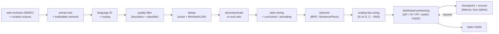
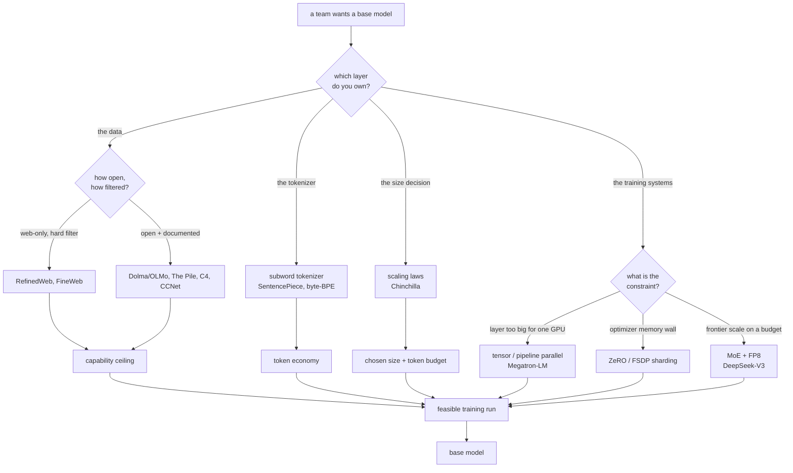
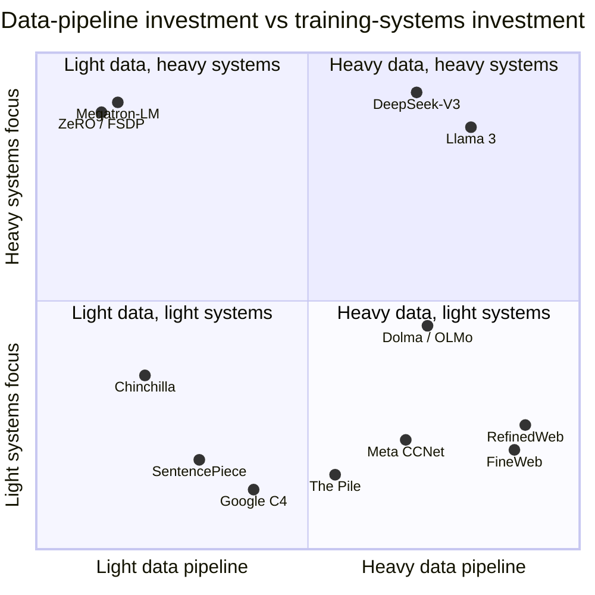

**What they share.** Every system here builds the same thing the same way: raw web archives plus curated corpora go through a filtering funnel (extract, language ID, quality filter, deduplicate, decontaminate, mix, tokenize) that keeps a small fraction, and the resulting clean token stream feeds a distributed next-token-prediction run sized by scaling laws. None reinvents the objective. They diverge on how aggressive the filtering is, whether the pipeline is fully open, how the tokenizer is built, how the compute budget is split between parameters and tokens, and how the training job is parallelized to fit and stay alive.

**The reference pipeline.** Read every design below as a specialization of this canonical funnel-plus-loop. What changes is which stage a team invests in: the extraction and dedup recipe that sets the capability ceiling, the tokenizer that sets the token economy, the scaling decision that sets the size, or the parallelism and fault-tolerance that decide whether the run is feasible at all. Data prep is shared upstream infrastructure; the training systems are shared downstream infrastructure; the differences are the knobs each team actually needed.

**Reading the diagram.** Follow it left to right as two halves, the data funnel and the training loop, each with its own dominant cost and failure mode. Extraction is the unglamorous front door: RefinedWeb's whole thesis is that re-extracting from WARC and filtering hard means web data *alone* can match curated corpora, so garbage extraction upstream poisons every filter downstream. Language ID routes documents so filters and dedup can be tuned per language, which is CCNet's design and what makes a multilingual build work. Quality filtering is where FineWeb spends its effort, choosing a small ablation-validated set of heuristics and then a learned educational classifier (FineWeb-Edu) that shows fewer better tokens beat more tokens on hard benchmarks. Deduplication with MinHash and LSH is the other high-leverage step, cutting memorization and eval leakage and wasted compute, but it is not monotonic: over-dedup strips valid common text, so FineWeb tuned per-dump plus a measured global pass. Decontamination is the integrity gate, because a benchmark number means nothing if the eval leaked into training, which is why Dolma and The Pile document their pipelines as artifacts. Tokenization sets the token economy: SentencePiece makes multilingual and non-whitespace languages tractable, and vocabulary size is a fertility tradeoff, not a free win. Then the scaling-law step splits a fixed compute budget between parameters and tokens (Chinchilla's roughly twenty tokens per parameter), a decision that flips toward a smaller overtrained model once you count inference. Finally the training loop is a distributed-systems problem: Megatron splits matrices across GPUs, ZeRO and FSDP shard the optimizer footprint, and Llama 3-scale runs survive weeks of hardware failures and loss spikes only because checkpointing and elastic restart are built in. The loop closes on the checkpoint edge, which is why fault tolerance is part of the design, not an afterthought.

**Where they diverge.** The first fork is which layer you own; the second is the dominant cost at that layer, which decides the method.

**The choices, side by side.**

| Decision | Options (who) | What decides it |
| --- | --- | --- |
| data source | `web-only, hard-filtered` (RefinedWeb, FineWeb) vs `curated multi-domain mix` (The Pile, Dolma) vs `heuristic-cleaned web` (C4) vs `per-language crawl` (CCNet) | Whether careful web processing suffices, how open the recipe must be, and the target language mix |
| quality filter | `heuristics only` (C4, Gopher rules) vs `heuristics + learned classifier` (FineWeb-Edu, CCNet perplexity) | Cost and transparency versus power; a classifier bakes in reference bias but can beat volume |
| dedup | `exact / suffix-array` vs `MinHash + LSH fuzzy, within and across dumps` (FineWeb, RefinedWeb) | Near-duplicates dominate the web; fuzzy dedup at scale needs LSH banding, and aggressiveness is ablated |
| tokenizer | `byte-level BPE` (GPT-family) vs `SentencePiece BPE / unigram` (multilingual) | Language mix and reversibility; vocab size trades fertility against embedding/softmax cost |
| compute split | `Chinchilla training-optimal (~20 tok/param)` vs `overtrain a smaller model` (Llama 3, ~2000 tok/param) | Whether you minimize training compute or lifetime inference cost |
| architecture | `dense transformer` (Llama 3, OLMo) vs `MoE` (DeepSeek-V3) | Capacity per active FLOP versus VRAM to hold all experts and all-to-all routing cost |
| parallelism | `tensor / pipeline` (Megatron) vs `ZeRO / FSDP sharding` vs `expert parallel` (MoE) | What the constraint is: a layer too big, the optimizer memory wall, or routing traffic |

**The math that separates them.**

$$\textbf{Jaccard similarity (near-duplicate overlap): } J(A, B) = \frac{\lvert A \cap B \rvert}{\lvert A \cup B \rvert}$$

$$\textbf{MinHash estimator (why it is cheap): } \Pr[\min h(A) = \min h(B)] = J(A, B)$$

$$\textbf{LSH banding (candidate S-curve, } b \textbf{ bands of } r \textbf{ rows): } \Pr[\text{candidate}] = 1 - \left(1 - J^{r}\right)^{b}$$

$$\textbf{pretraining objective (next-token cross-entropy): } \mathcal{L} = -\frac{1}{T}\sum_{t=1}^{T} \log p_{\theta}(x_t \mid x_{\lt t})$$

$$\textbf{bits-per-byte (tokenizer-invariant comparison): } \text{BPB} = \frac{\mathcal{L}}{\ln 2} \cdot \frac{n_{\text{tokens}}}{n_{\text{bytes}}}$$

$$\textbf{compute budget and Chinchilla-optimal split: } C \approx 6 N D, \quad D^{\ast} \approx 20 N$$

$$\textbf{scaling law (loss vs params and data): } L(N, D) = E + \frac{A}{N^{\alpha}} + \frac{B}{D^{\beta}}$$

$$\textbf{pipeline bubble fraction (} p \textbf{ stages, } m \textbf{ micro-batches): } \frac{p - 1}{m + p - 1}$$

$$\textbf{sharded per-GPU memory (ZeRO-3 / FSDP, Adam mixed precision): } M_{\text{gpu}} \approx \frac{16 \Psi}{N_d}$$

**When to use which.** Pick the recipe by which layer you own, then let the constraint at that layer pick the method and the comparison metric.

| Reach for | When | Instead of |
|---|---|---|
| Web-only hard-filtered data (RefinedWeb, FineWeb) | Careful web processing alone can hit your quality bar | A curated mix you lack the license or breadth to assemble |
| Curated multi-domain mix (The Pile, Dolma) | You need an open, documented recipe and domain coverage beyond raw web | Web-only, when transparency and domain balance matter more than scale |
| Heuristics plus a learned classifier (FineWeb-Edu, CCNet perplexity) | Fewer better tokens must beat raw volume on hard benchmarks | Heuristics only (C4, Gopher), which cap on transparency, not power |
| MinHash plus LSH fuzzy dedup (FineWeb, RefinedWeb) | Near-duplicates dominate and you dedup within and across dumps at scale, tuning the LSH banding S-curve | Exact or suffix-array dedup, which misses fuzzy near-duplicates |
| SentencePiece BPE / unigram | Multilingual or non-whitespace languages need reversible subwording | Byte-level BPE tuned for a mostly-English mix |
| Bits-per-byte to compare models | Ranking bases built on different tokenizers | Perplexity, which is incomparable once the tokenizer changes |
| Chinchilla 20 tok/param split | Minimizing training compute for the run itself | Overtraining a smaller model, which you want when inference dominates |
| MoE plus FP8 (DeepSeek-V3) | You want frontier capacity per active FLOP on a constrained budget | A dense transformer, when VRAM to hold all experts is the wall |
| Tensor/pipeline (Megatron) or ZeRO/FSDP sharding | The layer is too big for one GPU (Megatron) or the optimizer memory wall binds (ZeRO/FSDP) | Picking a parallelism scheme before naming which constraint binds |

**Interview watch-outs.**

- **Do not skip the data funnel.** Model quality is bounded by data quality long before architecture. Raw Common Crawl is mostly boilerplate, spam, and near-duplicates, so the keep rate is single digits, and extraction plus quality filtering plus dedup are the work, not a preprocessing footnote. RefinedWeb's thesis is that this alone can match curated corpora.
- **Deduplication is a quality control, not a disk saver.** MinHash plus LSH fuzzy dedup within and across dumps cuts memorization (a privacy and copyright control), closes the main eval-leakage vector, and stops wasted compute. But it is not monotonic: over-dedup strips valid common text and can lower scores, so you ablate its aggressiveness on downstream evals.
- **Lead with decontamination.** Any headline benchmark without a decontamination claim is suspect. Remove training documents that overlap the eval sets by n-gram and embedding overlap and report the rate. A sharp interviewer probes leakage first; state it unprompted.
- **The tokenizer is a fertility decision, not a vocab-size race.** A bigger vocabulary shortens sequences but grows the embedding and softmax, undertrains rare tokens, and makes perplexity incomparable across tokenizers. Fit it on the true final mixture and check tokens-per-word per language, and compare models on bits-per-byte, not perplexity.
- **Chinchilla-optimal is for training, not serving.** Scale parameters and tokens together at about twenty tokens per parameter for compute-optimal *training*; if you serve at scale, overtrain a smaller model far past that so inference stays cheap forever. State which cost you are minimizing before quoting a ratio.
- **Pretraining is a distributed-systems problem, not a `.fit()` call.** The objective is one line; the job is fitting and feeding a model that does not fit on one GPU (tensor and pipeline parallelism, ZeRO or FSDP sharding), keeping model-FLOPs utilization high against interconnect limits, and surviving weeks of hardware failures and loss spikes with checkpointing and elastic restart.
</content>
