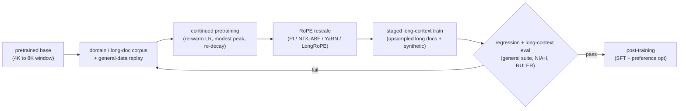
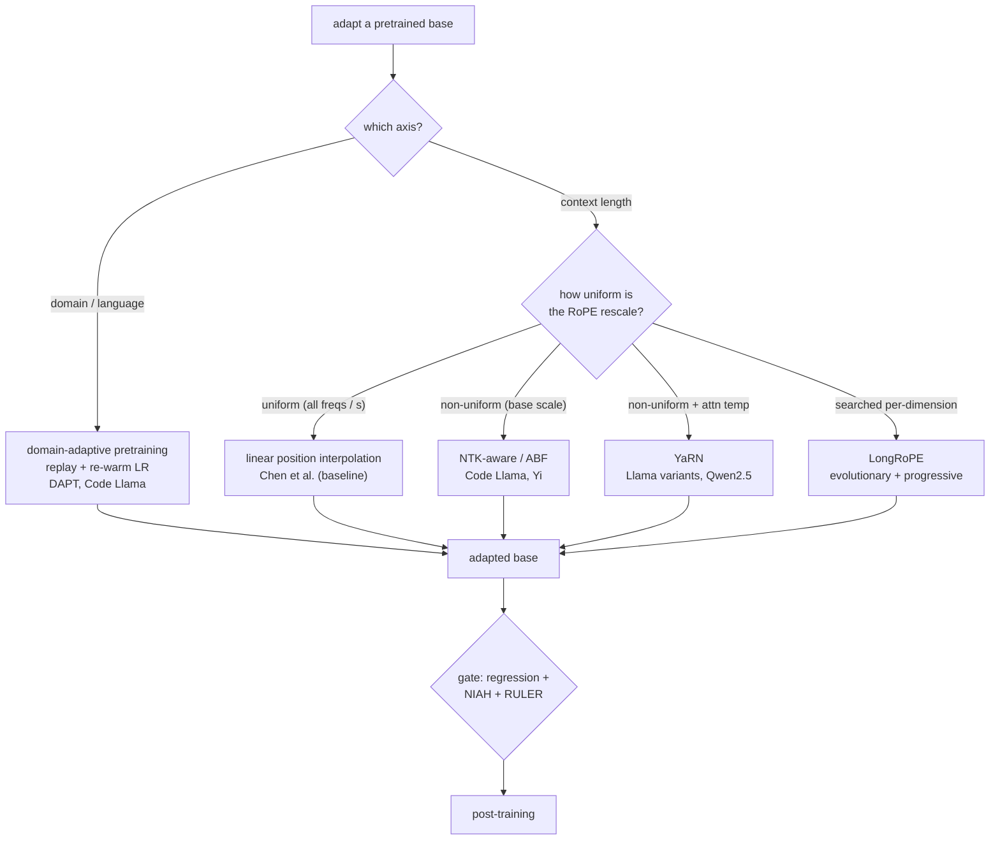
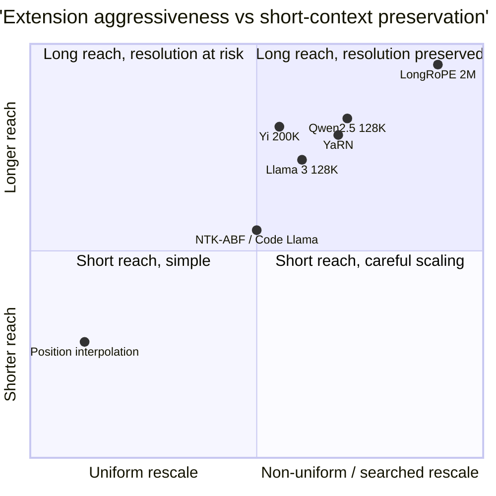

**What they share.** Every system here is the same stage-3 move: take a pretrained base and adapt it, on a domain or to a much longer context, by re-entering the next-token objective under a lowered, re-warmed learning rate, and (for the length axis) rescaling the RoPE positional frequencies before a short continued-training run on long documents. None invents a new loss or a new architecture. They diverge on which axis they push (domain versus length), how they rescale the RoPE frequencies (uniform versus non-uniform versus searched), and how they prove the extended length is real.

**The reference pipeline.** Read every design below as a specialization of this canonical flow. What changes is the rescaling recipe and the data mix, not the skeleton: a base enters, continued pretraining shifts its prior or its length, an eval gates it, and post-training finishes it. Domain adaptation guards against catastrophic forgetting with replay and a modest re-warm; length adaptation guards against short-context regression with non-uniform frequency scaling.

**Reading the diagram.** Follow it left to right as one continued-pretraining phase with two guarded axes. The corpus at the front is where the domain axis lives: mixing a replay fraction of general data into the domain text is what stops catastrophic forgetting, because interleaving the old distribution keeps its minima under gradient pressure while the new distribution is learned. The continued-pretraining box is where the learning-rate schedule lives: the base finished fully decayed near zero, so you must re-warm to a modest peak (a fraction of the original) to make progress, then re-decay, because resuming at zero stalls and resuming at the original peak forgets everything. The RoPE-rescale box is where the length axis lives: RoPE assigns each dimension a frequency, and extending context means dividing the low-frequency (long-wavelength) dimensions toward the trained range while sparing the high-frequency (local) ones, which is the whole difference between uniform position interpolation and everything better. The staged long-context train is where length is actually taught, on upsampled real long documents and synthetic long-range tasks rather than packed short docs, increasing the length in stages so each consolidates before the next. The gate is the integrity check that most teams get wrong: a general-benchmark regression check catches silent forgetting on the domain axis, and a RULER-style eval (not just needle-in-a-haystack) catches an effective context far shorter than the configured one on the length axis. Only then does the adapted base flow into post-training. The costs split cleanly: prefill attention is quadratic in length, the KV cache is linear in length, and the training itself is a tiny fraction of the original pretrain because the frequencies encode relative position cheaply and the model mostly adapts rather than relearns.

**Where they diverge.** The first fork is which axis you adapt; the second, for length, is how non-uniform the frequency rescaling is, which decides how far you can extend before short-context quality breaks.

**The choices, side by side.**

| System | Axis | Rescale mechanism | Reach | Key lever | Watch out |
| --- | --- | --- | --- | --- | --- |
| Meta Llama 3 | length | RoPE rescale + staged continued train | 8K to 128K in 6 stages | staged extension late in pretraining | 405B pretrain is lab-scale |
| Meta Code Llama | domain + length | NTK-ABF, base 10000 to 1000000 | 16K trained, to 100K | continued pretrain a code domain from a general base | code narrows general ability |
| 01.AI Yi | length | continued pretrain on long data | to 200K | data quality over architecture | long-data curation is the constraint |
| Nous YaRN | length | non-uniform freq scale + softmax temperature | 64K to 128K+ | ~0.1% of pretrain tokens | ramp bands and temperature must be tuned |
| Microsoft LongRoPE | length | evolutionary per-dim search + progressive | beyond 2M tokens | searched non-uniform rescale + short recovery | search cost, short-context recovery needed |
| Alibaba Qwen2.5 | domain + length | progressive length + YaRN + Dual Chunk Attention | to 128K (1M turbo) | staged non-uniform scaling | effective length below configured, verify with RULER |

**The math that separates them.** RoPE gives dimension pair `i` (of `d` per head) the frequency and per-position angle below, with base `b` (commonly 10000) and length scale `s = L_{\text{new}} / L_{\text{orig}}`.

$$\textbf{RoPE frequency and angle: } \theta_i = b^{-2i/d}, \qquad \phi_i(m) = m \cdot \theta_i, \qquad i = 0, \dots, \tfrac{d}{2}-1$$

$$\textbf{linear position interpolation (uniform, all freqs by } s\textbf{): } \theta_i^{\text{PI}} = \frac{\theta_i}{s}$$

$$\textbf{NTK-aware / ABF (scale the base, non-uniform in } i\textbf{): } b' = b \cdot s^{d/(d-2)}, \quad \theta_i^{\text{ABF}} = \theta_i \cdot s^{-2i/(d-2)}$$

$$\textbf{YaRN (spare high freqs, interpolate low freqs via ramp } \gamma_i \in [0,1]\textbf{): } \theta_i^{\text{YaRN}} = \gamma_i \cdot \theta_i + (1 - \gamma_i)\cdot \frac{\theta_i}{s}$$

$$\textbf{YaRN attention temperature (entropy correction): } \text{softmax}\left(\frac{q^{\top} k}{t \sqrt{d}}\right), \quad \frac{1}{\sqrt{t}} = 0.1 \ln s + 1$$

$$\textbf{LongRoPE (searched per-dimension rescale): } \theta_i^{\text{LongRoPE}} = \frac{\theta_i}{\lambda_i}, \quad \lbrace \lambda_i \rbrace = \arg\min_{\lambda} \ \text{PPL}\big(\text{model}_\lambda, \ \text{long text}\big)$$

$$\textbf{the cost that scales with length: } \text{prefill attention} \sim O(L^2), \qquad M_{\text{kv}} = 2 \cdot n_{\text{layers}} \cdot n_{\text{kv}} \cdot d_{\text{head}} \cdot L \cdot b \cdot s_{\text{bytes}}$$

**When to use which.** Name the axis first, then let the reach you need pick how non-uniform the rescale must be and how you prove it.

| Reach for | When | Instead of |
|---|---|---|
| Domain-adaptive pretraining with replay plus re-warm (DAPT, Code Llama) | You are shifting the prior to a domain or language, not extending length | Length tools, which do nothing for catastrophic forgetting |
| Re-warm the LR to a modest peak | Continued pretraining from a fully-decayed base | Resuming at zero (stalls) or at the original peak (forgets everything) |
| Linear position interpolation (Chen et al.) | A quick baseline or a tiny extension where local-resolution loss is tolerable | Calling it a real long-context method, it blurs the high-frequency dimensions |
| NTK-aware / ABF base scaling (Code Llama, Yi) | Moderate extension where scaling the base spares local ordering | Uniform PI, which divides every frequency by the same s |
| YaRN ramp plus attention temperature (Qwen2.5) | Larger extension needing entropy correction, roughly 0.1% of pretrain tokens | Plain NTK-ABF, when the softmax-temperature fix is what preserves quality |
| LongRoPE per-dimension search (Microsoft) | Extreme reach beyond 2M tokens justifies the search and short-context recovery cost | Hand-set ramp bands, which cannot find the best per-dim rescale that far out |
| RULER-style multi-hop eval | Proving effective context matches the configured length | A single edge-anchored needle test, which passes while real recall is shorter |
| GQA, KV quantization, paging, sliding-window attention | Prefill is quadratic and the KV cache linear at the target length | Ignoring serving cost, leaving the model prefill-bound and KV-bound at once |
| Long context for one big document, RAG over the corpus | The task is a single long document | Extending length to replace retrieval, where mid-context recall decays |

**Interview watch-outs.**

- **Name the two axes before you design.** Domain and length are independent knobs with different failure modes: domain adaptation risks catastrophic forgetting (fix with replay and a modest re-warm), length adaptation risks short-context regression and KV-cache blowup (fix with non-uniform scaling and GQA). Solving one with the other's tool is the tell of a shallow answer.
- **Uniform interpolation is the baseline, not the goal.** Linear position interpolation (Chen et al. 2023) divides every RoPE frequency by the same `s`, which blurs the high-frequency dimensions that carry local ordering and hurts short prompts. Every better method (NTK-ABF, YaRN, LongRoPE) is a way to scale low frequencies while sparing high ones. Never call uniform interpolation YaRN.
- **Re-warm the learning rate, do not just resume.** The base ended fully decayed; resuming there stalls, resuming at the original peak forgets. Re-warm to a modest peak, re-decay, and replay a general-data fraction. The re-warm peak is the main forgetting-versus-learning knob.
- **The config number is not the capability.** Setting the max position to 128K without rescaling and continued training produces garbage past the real window. Prove the length with RULER-style multi-hop and aggregation tasks and recall-by-depth, not a single edge-anchored needle test, because effective context is routinely far shorter than configured.
- **Long context is a serving-systems cost, not just modeling.** Prefill attention is quadratic in length and the KV cache is linear, so a working long-context model can be prefill-bound on long prompts and KV-bound on batch size at once. Budget both at the target length; GQA, KV quantization, paging, and sliding-window attention are the levers.
- **Long context complements retrieval, it does not replace it.** Quadratic prefill and linear KV cache mean long context handles one big document, not a corpus, and recall decays in the middle. RAG retrieves the few relevant chunks. Compose them: extend for the single long document, retrieve over the corpus.
