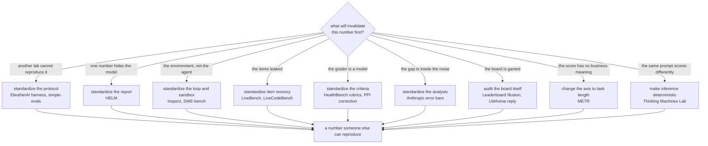
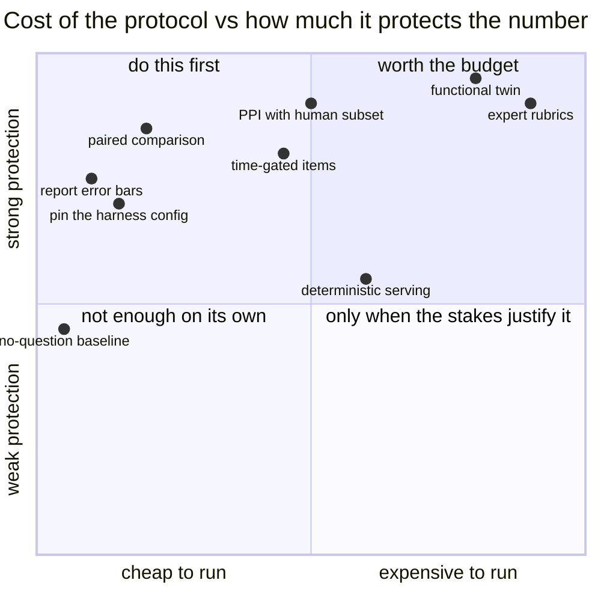

**What they share.** Every system here is the same admission: the number is produced by a pipeline, not by the model, so the pipeline is the thing that has to be specified. Each pins its items, renders prompts from a versioned config, keeps the raw completions, and publishes the protocol next to the score. None of them claims a benchmark measures a capability directly. They diverge on which part of the pipeline they standardize, and on which threat they treat as the one that will invalidate the number.

**The reference pipeline.** Read every system below as a specialization of this flow. What changes is where each one puts its effort, not the skeleton: items enter, a protocol renders them, generation and extraction turn them into verdicts, and a report card carries the score with its interval and its provenance.

```mermaid
flowchart LR
  SEL["benchmark portfolio<br/>(capability + headroom)"] --> ITEMS["pinned items<br/>(version, release window)"]
  ITEMS --> DECON["contamination control<br/>(time split, functional twin)"]
  DECON --> RENDER["prompt render<br/>(chat template, few-shot, format)"]
  RENDER --> GEN["generation<br/>(decode policy, token budget, seeds)"]
  GEN --> PARSE["extraction<br/>(parser / verifier / sandbox)"]
  PARSE --> SCORE["scoring<br/>(exact, matching, rubric, tests)"]
  SCORE --> AGG["aggregate per slice<br/>with intervals"]
  AGG --> CARD["report card<br/>score + CI + cost + config hash"]
  GEN -.-> STORE["run store: every prompt,<br/>completion, verdict"]
  PARSE -.-> STORE
  STORE -.->|"re-score without re-running"| SCORE
```

**Reading the diagram.** Follow it left to right as one measurement instrument. The portfolio at the front is a selection decision and the largest single source of error: a saturated benchmark cannot separate two candidates no matter how carefully the rest is run. Contamination control sits before rendering because it is a property of which items you are allowed to use, not of how you prompt them, and only two mechanisms actually work without the training corpus: a time gate (LiveBench, a LiveCodeBench release window) and a functional twin rebuilt to the same spec. The render and generation boxes are where most disagreements between two labs come from, which is why the harness people version them: chat template, few-shot pool, answer-format instruction, max output tokens, and the decode policy each move the score more than a model change usually does. Extraction is a component with its own error rate, so a parse-failure rate is part of the report or the score silently includes it. The run store is the stage nobody plans for and the one that pays: keeping raw completions is what lets a scoring change be re-run without re-running the models, which separates a parser fix from a model comparison for free. Aggregation must carry an interval because a score is an estimate, and the report card carries cost because two effort settings of one model are two candidates on a frontier, not one model with one number.

**Where they diverge.** The fork is what each system treats as the thing most likely to make the number wrong, and each answer produces a different artifact.

**The choices, side by side.**

| System | Standardizes | Threat it designs against | The artifact | Watch out |
| --- | --- | --- | --- | --- |
| EleutherAI LM Evaluation Harness | Prompt rendering, versioned task configs | Irreproducibility | A task config you can pin and diff | Two harness versions are two protocols |
| Stanford CRFM HELM | A multi-scenario, multi-metric matrix | One number standing in for a model | A reporting grid | Cost per full run is high |
| UK AISI Inspect | The agent loop and the tool sandbox | Uncontrolled environments | A runnable eval framework | An agent score still depends on the scaffold |
| OpenAI simple-evals | Legible prompts and parsers | Protocols nobody can replicate | Readable code, not a spec | Deliberately narrow coverage |
| OpenAI HealthBench | Per-item expert rubric criteria | Holistic judgments that do not reproduce | Physician-written criteria | Rubric authorship is the expensive part |
| Anthropic eval statistics | The analysis | Claiming a gap inside the noise | A method, not a suite | Paired comparison needs per-item verdicts |
| LMArena | Human pairwise preference at scale | Task metrics missing aggregate taste | A live board | Preference is not capability |
| Leaderboard Illusion | Disclosure of what a board hides | Private variants and selective reporting | An audit of a board | Read the operator's response with it |
| LiveBench, LiveCodeBench | Item recency | Contamination | A benchmark with a clock | Comparability across windows is limited |
| Princeton SWE-bench | Real issues with the project's own tests | Toy tasks and self-graded success | An executable benchmark | Weak test suites accept wrong patches |
| METR | Task length with human baselines | Numbers with no business meaning | A capability axis in time units | Human baselines are costly to collect |
| Thinking Machines Lab | Numerical determinism at serving time | The same prompt scoring differently | A serving fix | Determinism costs throughput |

**The math that separates them.** Three quantities decide whether a reported difference means anything, and each system above is buying down one of them.

$$\textbf{a score is an estimate: } \text{SE} = \sqrt{\frac{\hat p (1 - \hat p)}{n}}, \qquad \text{95\% half-width} \approx 1.96 \cdot \text{SE}$$

$$\textbf{compare paired (McNemar), with } b \text{ wins for A and } c \text{ for B: } \hat\Delta = \frac{b - c}{n}, \qquad \text{SE}(\hat\Delta) \approx \frac{\sqrt{b + c}}{n}$$

$$\textbf{sizing for a gap } \delta \text{ at discordance } d: \quad n \gtrsim \frac{7.85\, d}{\delta^{2}}$$

$$\textbf{correct a model grader rather than trusting it (PPI): } \hat\theta_{\text{PPI}} = \frac{1}{N}\sum_{i=1}^{N} f(X_i) + \frac{1}{n}\sum_{j=1}^{n}\bigl(Y_j - f(X_j)\bigr)$$

$$\textbf{coverage is not reliability: } \text{pass}@k = 1 - (1-p)^{k}, \qquad \text{pass}^{k} = p^{k}, \qquad p = 0.9,\, k = 8 \Rightarrow 0.43$$

The first three say that most published gaps on small suites are unresolvable, the fourth says a cheap judge plus a few hundred human labels beats a better judge with none, and the last says an agent number is meaningless until you say which of the two you measured.

**When to use which.** Name the threat first, then take the cheapest control that addresses it.

| Reach for | When | Instead of |
|---|---|---|
| A pinned harness config plus a stored render | Any comparison across candidates or across time | Re-running a benchmark from a paper's description |
| Paired comparison with McNemar | Two candidates on the same items | Comparing two independent proportions, which throws away the pairing |
| Multiple seeds on reasoning suites | Candidates with a thinking budget or temperature above zero | A single run, whose swing routinely exceeds the effect claimed |
| A time-gated benchmark or a release window | You cannot inspect the training corpus | Deduplication, which catches only verbatim contamination |
| A functional twin rebuilt to the same spec | The stakes justify rebuilding the items | Membership-inference statistics alone, which are weak evidence per item |
| Execution or answer matching | The task has a checkable answer | A judge, which adds an error rate you then have to certify |
| Rubric criteria plus PPI correction | Open-ended tasks where only experts can grade | A holistic judge score reported as the headline |
| A sealed slice with a logged query budget | Many rounds of model selection against the same set | Reporting a maximum over many looks as if it were one measurement |
| Task length with human baselines | Someone needs to know what the number means for the business | A percentage on a suite nobody outside the team recognizes |
| Deterministic serving settings | A close call that flips between runs | Averaging more runs, which hides a fixable serving nondeterminism |

**Interview watch-outs.**

- **When two numbers disagree, the prior is protocol, not model.** Chat template, few-shot pool, answer-format instruction, scoring mode, max output tokens and the serving stack each move the score enough to flip a close call. Say this first: it is the single answer that most distinguishes someone who has run evals from someone who has read about them.
- **Deduplication is not contamination control.** Verbatim overlap is one of five kinds. Format leakage, distillation from a contaminated teacher, and selection leakage all leave the corpus clean and the number wrong. Only a time gate or a functional twin addresses the ones you cannot see.
- **Selection leakage is the one you will commit yourself.** Nothing entered training; you simply chose the checkpoint that scored best on the test set, many times. A sealed slice with a logged query budget is what makes that bounded and auditable.
- **A leak-free benchmark still lies if the items are broken.** Run the no-question baseline on any multiple-choice set, and read twenty passing agent trajectories before publishing an agentic number. Both are an hour of work and both routinely find something.
- **pass@k is what you can buy, pass^k is what the user gets.** A 90 percent agent is about 43 percent across eight independent attempts. Quoting coverage as reliability is the most common technical error in agent evaluation.
- **Once a model grades your benchmark, it is part of the instrument.** Certify it against a few hundred expert labels near the decision boundary, report swap consistency, pin its version, then correct with PPI rather than trusting it. A better judge should buy a tighter interval, not a different answer.
- **Report cost with quality.** Two effort settings of one model are two candidates. The reportable unit is a point on a frontier: score, interval, output tokens, dollars, latency.
