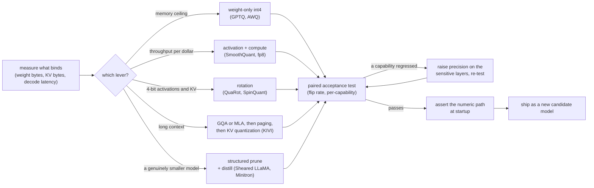
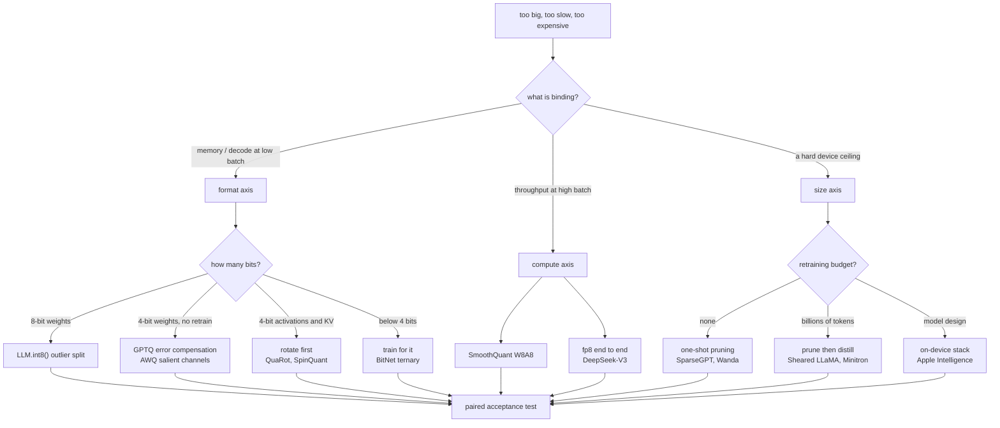
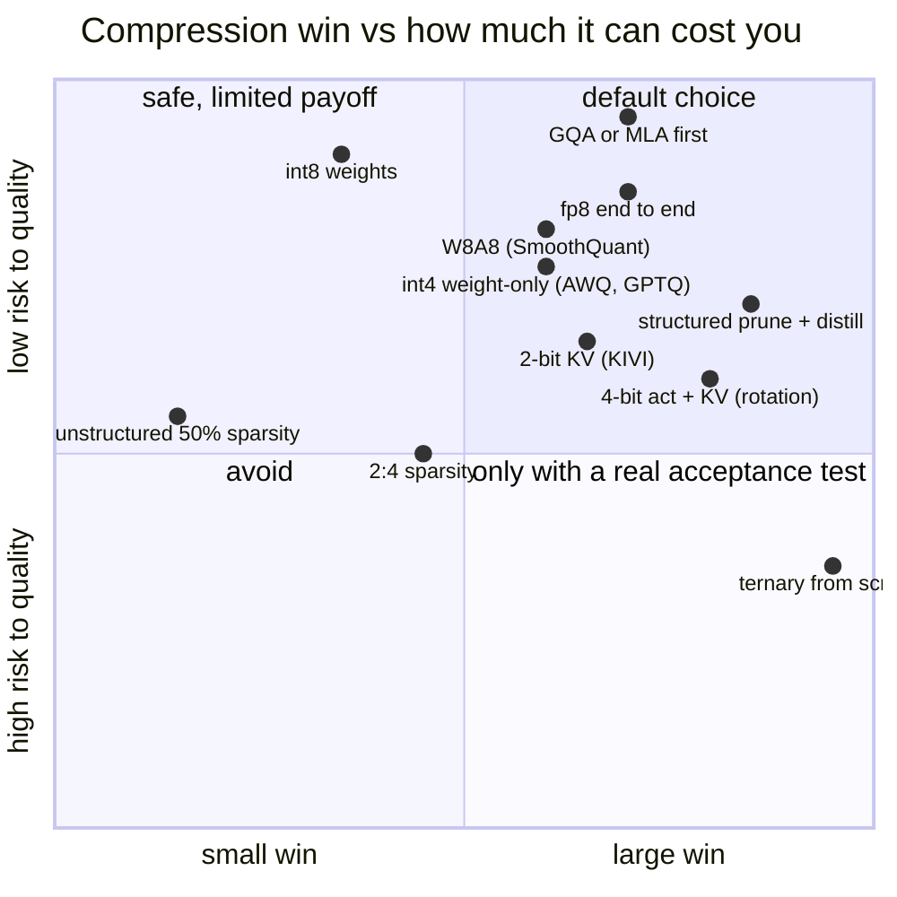

**What they share.** Every system here starts from the same three-line budget: weights, KV cache, activations. Each picks the lever that moves whichever of those is binding, keeps a small set of layers at higher precision because a uniform format always breaks something, and gates on a paired comparison against the uncompressed model rather than on an aggregate score. None of them treats compression as free. They diverge on which resource they are buying back, and on whether they are allowed to retrain.

**The reference pipeline.** Read every system below as a specialization of this flow. What changes is which branch is taken and how much retraining budget exists, not the skeleton: measure what binds, apply the lever that moves it, test in pairs, raise precision where it broke, ship a candidate.

**Reading the diagram.** Follow it left to right as one decision, made once per binding resource. The measurement at the front is what stops the usual mistake of quantizing weights when the KV cache is what filled the card: weight bytes are $N b_w$ and cache bytes are $2 L h_{kv} d_h s B b_{kv}$, and past a few thousand tokens the second term is the one that grows. The lever branch is ordered by what each family actually buys: weight-only int4 buys memory and decode bandwidth and nothing at high batch, activation and compute quantization buys arithmetic and therefore throughput, rotation buys the ability to take activations and the cache to 4 bits at all, and structured pruning plus distillation is the only branch that produces a smaller model rather than a cheaper representation of the same one. The KV branch is ordered on purpose: architectural reduction first, then paging, then quantization, then eviction or windowing last, because each step after the first is lossy in a way the previous one is not. The acceptance test is paired because two checkpoints at the same aggregate accuracy can disagree on half of their answers, so flip rate against the parent is the measurement, not the benchmark delta. The mixed-precision loop is where nearly every shipped recipe ends up: embeddings, the output projection, the first and last blocks, and the norms stay higher. The startup assertion exists because several stacks fall back to a higher-precision kernel silently, which produces no speedup, no error, and a confusing week.

**Where they diverge.** The first fork is what is binding; the second, once you are in the format axis, is how far down you need to go, which decides whether you can stay post-training or must retrain.

**The choices, side by side.**

| System | Axis | Mechanism | Retraining | Buys | Watch out |
| --- | --- | --- | --- | --- | --- |
| LLM.int8() | Format, 8-bit | Split the matmul, outliers stay 16-bit | None | Memory at near-parity quality | The decomposition costs throughput |
| SmoothQuant | Compute, W8A8 | Migrate activation outliers into weights | None to light | Arithmetic, so throughput at batch | Needs a representative calibration set |
| GPTQ | Format, 3 to 4-bit weights | Layer-wise second-order rounding | None | Memory and decode bandwidth | Calibration mismatch shows up as a capability hole |
| AWQ | Format, 4-bit weights | Protect salient channels by activation magnitude | None | The same, with simpler kernels | Weight-only, so no gain at high batch |
| QuaRot, SpinQuant | Format, 4-bit activations and KV | Orthogonal rotation, fused at export | None, or learned rotations | 4-bit inference end to end | Rotation must be fused or it costs more than it saves |
| BitNet b1.58 | Format, ternary | Train with the quantizer in the loop | Full pretraining | Extreme efficiency | Not available as a post-training option |
| KIVI | Format, KV only | Keys per channel, values per token, 2-bit | None | Long-context capacity | Do it after GQA or MLA, not instead |
| SparseGPT, Wanda | Sparsity | One-shot pruning, reconstruction or activation-aware score | None | Memory, or speed on a 2:4 target | Unstructured sparsity buys nothing on dense kernels |
| Sheared LLaMA, Minitron | Size | Structured pruning plus distillation | Billions of tokens | A genuinely smaller model | Skipping the healing run and blaming pruning |
| On-policy distillation | Size | Student generates, teacher scores | Training run | The strongest student per token | The teacher becomes serving infrastructure |
| Apple Intelligence | Size, on device | Small model, device formats, task adapters | Yes, by design | A model that fits a hard ceiling | Format choice is dictated by the NPU |
| DeepSeek-V3 | Compute | fp8 through training and serving | Designed in | Cost across the whole lifecycle | An architecture decision, not a post hoc one |
| Accuracy is Not All You Need | Acceptance | Flip rate against the parent | None | A test that catches what accuracy hides | Needs per-item verdicts from both models |

**The math that separates them.** Four expressions decide which lever is worth pulling and how much of the promised win survives contact with a batch size.

$$\textbf{the budget: } \text{bytes} \approx \underbrace{N b_w}_{\text{weights}} + \underbrace{2 L h_{kv} d_h s B b_{kv}}_{\text{KV cache}} + \text{activations}$$

$$\textbf{symmetric uniform quantization: } s = \frac{\max |w|}{2^{b-1} - 1}, \qquad q = \text{round}\!\left(\frac{w}{s}\right)$$

$$\textbf{group size is why 4-bit is not 4 bits: } b_{\text{eff}} = b + \frac{b_{\text{scale}} + b_{\text{zero}}}{g}, \qquad g = 128 \Rightarrow b_{\text{eff}} \approx 4.125$$

$$\textbf{activation-aware pruning score (Wanda): } S_{ij} = |W_{ij}| \cdot \lVert X_j \rVert_2$$

$$\textbf{what a bandwidth win is worth: } \text{speedup} \approx \frac{\text{bytes read per token before}}{\text{bytes read per token after}} \text{ at batch 1, tending to } 1 \text{ as batch grows}$$

The last one is the line that decides most arguments: weight-only quantization is over 3x at batch one and closer to 1.15x at batch 64 for the same change, because at high batch the weight read is already amortized and you are back to needing fewer FLOPs, not fewer bytes.

**When to use which.** Name the binding resource first, then take the cheapest lever that moves it.

| Reach for | When | Instead of |
|---|---|---|
| GQA or MLA, then paging | Long contexts, before any KV quantization | Quantizing a cache whose shape you never fixed |
| int4 weight-only (AWQ, GPTQ) | A memory ceiling, or decode latency at low batch | Expecting the same win at batch 64, where it nearly vanishes |
| W8A8 (SmoothQuant) or fp8 | Throughput per dollar at high batch | Weight-only quantization, which buys bandwidth and not arithmetic |
| Rotation (QuaRot, SpinQuant) | You need 4-bit activations or KV, not just weights | Pushing weight-only methods into a regime they were not built for |
| KIVI-style 2-bit KV | Context length is what fills the card | Evicting cache entries, which is lossy in a way quantization is not |
| One-shot pruning (SparseGPT, Wanda) | No retraining budget and a sparsity-accelerated target | Unstructured sparsity on dense kernels, which is memory savings only |
| Structured pruning plus distillation | You need a smaller model and have billions of tokens | Pruning without a healing run, then concluding pruning does not work |
| On-policy distillation | You control the teacher and want the strongest student | Offline distillation, where the student never sees its own mistakes |
| QAT | Below 4 bits, where post-training stops holding | More calibration data, which cannot recover a format that is too tight |
| Flip rate against the parent | Accepting any compressed checkpoint | An aggregate benchmark delta, which hides half the answers changing |

**Interview watch-outs.**

- **Say what is binding before you name a method.** Memory ceiling, decode latency, prefill throughput and context length are four different problems, and the standard answer ("quantize to int4") addresses only two of them. Naming the resource first is the whole difference between an engineer and a menu.
- **The outlier problem is the reason all of this exists.** A handful of activation channels carry values orders of magnitude larger than the rest and matter functionally, so a scale wide enough for them starves everything else. Every family below is a different answer to that one fact: keep them high precision, migrate them into the weights, protect the channels they touch, compensate the error, or rotate them away.
- **Weight-only quantization is a bandwidth win, so it evaporates at batch.** Over 3x at batch one and about 1.15x at batch 64 for the same change. If the throughput target is high-batch serving, the lever is compute precision, not weight bits.
- **A sparsity number without a shape is not reproducible.** 50 percent unstructured, 2:4 semi-structured, and structured head or channel removal have completely different quality, speed and memory profiles. Unstructured sparsity buys nothing on dense kernels.
- **Quote the effective bit width.** Group-wise 4-bit with a per-128 scale and zero point is about 4.125 bits. On a 70B model that difference is gigabytes, and it is the first thing a careful interviewer checks.
- **PTQ, QAT and QLoRA are three different things.** PTQ produces a serving artifact in hours from a calibration set. QAT simulates the quantizer during training and is what you escalate to below 4 bits. QLoRA quantizes a base in order to fine-tune it cheaply and is not a serving quantization at all.
- **Assert the numeric path at startup.** Silent fallback to a higher-precision kernel produces no speedup and no error. Log the kernel actually selected, and treat an unfused dequantize-then-matmul path as a regression.
- **Accuracy is not the acceptance test.** Two checkpoints at equal aggregate accuracy can disagree on half their answers. Measure flip rate against the parent, per capability, and keep the raw per-item verdicts so the comparison is paired.
