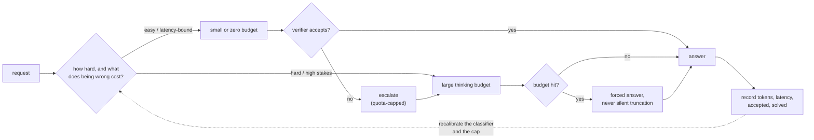
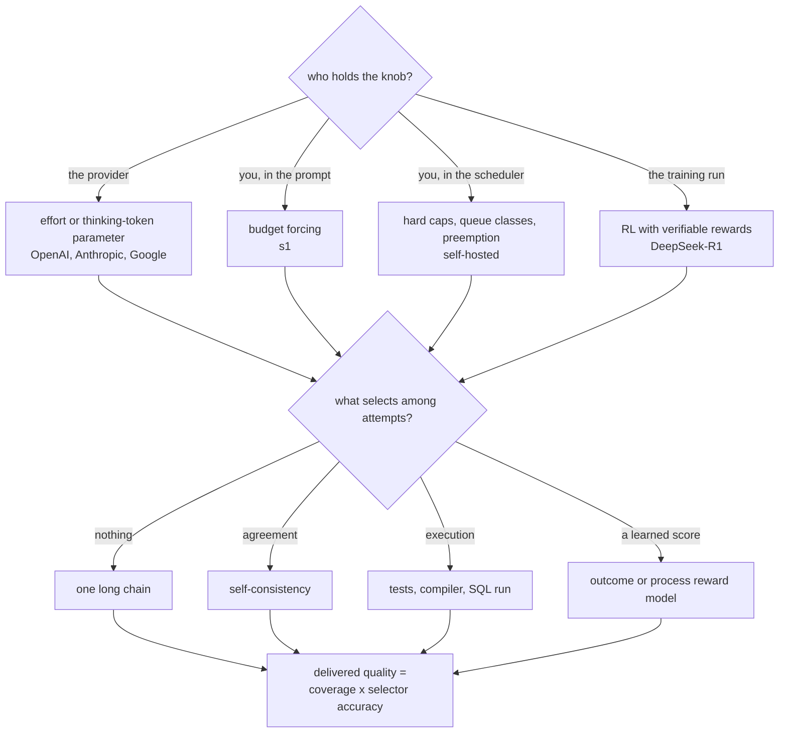
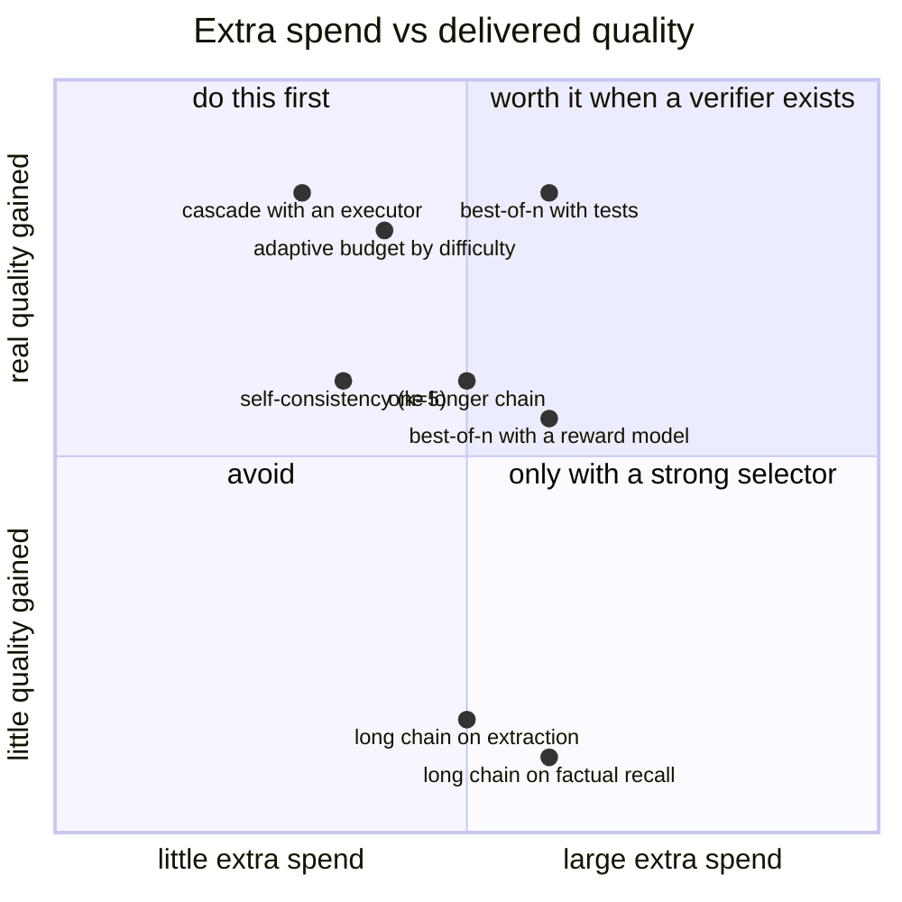

**What they share.** Every system here is the same three parts: a budget knob, a policy that decides who gets how much, and something that says whether the answer was right. The knob is what a provider exposes or what a self-hosted stack enforces, the policy is where the money is actually spent or saved, and the verifier is what converts extra samples into delivered quality instead of extra tokens. None of them claims thinking is uniformly better. They diverge on who holds the knob, and on what the checker is allowed to be.

**The reference pipeline.** Read every system below as a specialization of this flow. What changes is where the budget is decided and how strong the verifier is, not the skeleton: a request is classified, given a budget, generated, checked, and accounted for so the next classification is better.

**Reading the diagram.** Follow it left to right as one request, and note that the two decisions that cost money are made before any tokens are generated. The classifier is the weakest link in most designs, which is why the cheap-path-then-verify branch exists: running the short path and checking it is a better difficulty classifier than any difficulty classifier, because it measures the thing you care about instead of predicting it. The budget cap has to end in a forced answer rather than a truncation, because a silent cut returns malformed output that then scores as a wrong answer and pollutes every measurement downstream. The verifier box is where delivered quality is decided: repeated sampling raises coverage, the chance at least one sample is right, and only a selector converts coverage into a correct delivered answer, so a 0.98 coverage with a 0.6 selector delivers about 0.6. The accounting box is what makes the loop a system rather than a setting: without a per-request record of tokens, latency and whether the task was actually solved, there is no way to compare a thinking model against a non-thinking one on anything but score, and no way to notice that the cost per solved task went up while the cost per request went down. The escalation edge carries a quota because an escalation storm under load is how this design fails in production.

**Where they diverge.** The fork is who holds the budget knob, and each answer changes what you can control and what you can see.

**The choices, side by side.**

| Approach | Budget control | Selection | Buys | Watch out |
| --- | --- | --- | --- | --- |
| Provider effort parameter (OpenAI, Anthropic, Google) | An effort setting or a thinking-token budget | None built in | The knob with no serving work | Little visibility into the tail |
| Prompt-level budget forcing (s1) | Suppress or inject the end-of-thinking marker | Usually self-consistency | A budget on a model that was not trained for one | Forcing a budget the model was not trained for degrades output |
| Self-hosted with a scheduler | Hard caps plus queue policy and preemption | Whatever you build | Control of the tail | Real serving engineering |
| RL with verifiable rewards (DeepSeek-R1) | Set during training, inherited at serving | Whatever you add | Reasoning as a model property | Trace length becomes your cost model |
| Best-of-n with an executor | Fixed k, in parallel | Tests, compiler, SQL | Coverage converted into quality | Sandbox capacity, and weak tests accept wrong answers |
| Cascade with a checker | Cheap path, then escalate | Executor or certified judge | The best cost curve, and two attempts on hard items | Escalation storms under load |
| Process-supervised selection (Let's Verify) | Fixed k, in parallel | Step-level reward model | The strongest selector on math-like tasks | Verification can cost more than generation |
| Adaptive allocation (Scaling Test-Time Compute) | Budget per item by predicted difficulty | Either | The best tokens-per-solved-task | Needs difficulty estimates you can trust |

**The math that separates them.** Four expressions decide whether spending at inference is a good trade, and all four are things an interviewer can ask you to derive on the board.

$$\textbf{coverage from repeated sampling: } \text{pass}@k = 1 - (1 - p)^{k}, \qquad \textbf{delivered} \approx \text{coverage} \times \text{selector accuracy}$$

$$\textbf{reliability is the other metric: } \text{pass}^{k} = p^{k}, \qquad p = 0.9,\ k = 8 \Rightarrow 0.43$$

$$\textbf{when a cascade beats always-thinking: } C_{\text{cascade}} = c_{\text{short}} + c_{\text{verify}} + (1 - a)\, c_{\text{long}} \lt c_{\text{long}} \iff a \gt \frac{c_{\text{short}} + c_{\text{verify}}}{c_{\text{long}}}$$

$$\textbf{why the tail moves before the mean: } E[W] = \frac{\rho}{1 - \rho} \cdot \frac{E[S]\,(1 + C^{2})}{2}, \qquad C^{2} = \frac{\text{Var}(S)}{E[S]^{2}}$$

The third says that at a short path around a tenth the cost of the long one, the cascade wins as soon as the cheap path handles roughly one request in six, and it has a property the alternatives do not: escalated requests get two attempts, so its solve rate can exceed always-thinking. The fourth says a thinking workload with the same mean service time as a non-thinking one has a much worse p99, because the variance term is what the queue is actually sensitive to.

**When to use which.** Decide whether anything can check the answer, then let the latency budget pick sequential or parallel.

| Reach for | When | Instead of |
|---|---|---|
| A cheap attempt plus a verifier | There is any executable or symbolic check | A difficulty classifier, which predicts what the cheap attempt measures |
| Parallel sampling with a selector | Latency matters more than tokens | A longer single chain, which pays the whole cost in serial time |
| A longer single chain | Tokens matter more than latency, and there is no selector | Best-of-n against a weak selector, which delivers coverage you cannot keep |
| Execution as the verifier | Code, SQL, or anything with tests | A rubric judge, which is gameable by verbosity and self-preference |
| Self-consistency | A cheap majority is the only signal available | Treating agreement as correctness, which cannot see confident wrongness |
| A process reward model | Math-like tasks where the steps are checkable | An outcome reward model, which is the classic reward-hacking target |
| Retrieval | The failure is factual recall | A thinking budget, which cannot supply a fact the model does not have |
| A hard cap with a forced answer | Always, on any budget knob | Silent truncation, which returns malformed output and scores as wrong |
| Separate queue classes by budget | You operate the fleet | One queue, where short requests wait behind long traces |
| Cost per solved task | Reporting anything about a reasoning stack | Cost per request, which is minimized by failing faster |

**Interview watch-outs.**

- **Ask what checks the answer before you spend anything.** Repeated sampling raises coverage; only a verifier converts coverage into delivered quality. If nothing can check, the honest answer is that parallel spend does not pay here.
- **Thinking is not uniformly better.** It does not help factual recall (that is retrieval), formatting and extraction (shallow mappings, and long chains drift), latency-bound interactive surfaces, or anything with no checkable signal and no rubric. Say where it does not apply before you say where it does.
- **The tail is the design problem, not the mean.** Long generations hold KV slots, the effective batch collapses, and short requests queue behind them. The controls, in the order to reach for them: hard cap with a forced answer, separate queues by budget class, length prediction, preemption, then admission control that downgrades rather than queues.
- **A cascade can beat always-thinking on quality, not just cost.** Escalated requests effectively get two attempts. That is the non-obvious result in this topic and the one interviewers like.
- **Best-of-n against a learned reward is optimization against the verifier.** Quality can peak and then fall as k grows. Execution-based checks do not have this failure, which is why they are first in the ordering.
- **pass@k is what you can buy, the verifier decides how much you keep.** Quoting pass@k as reliability when the user gets one attempt is the most common mistake in this area.
- **Compare on the frontier, not the score.** A reasoning model against a non-reasoning one on score alone is not a comparison. The reportable unit is score, interval, output tokens, dollars and latency, and two effort settings of one model are two candidates.
