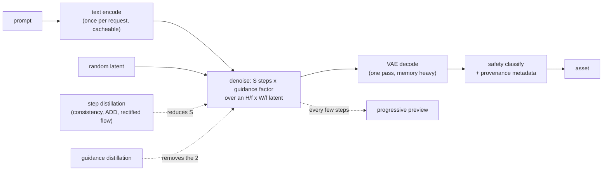
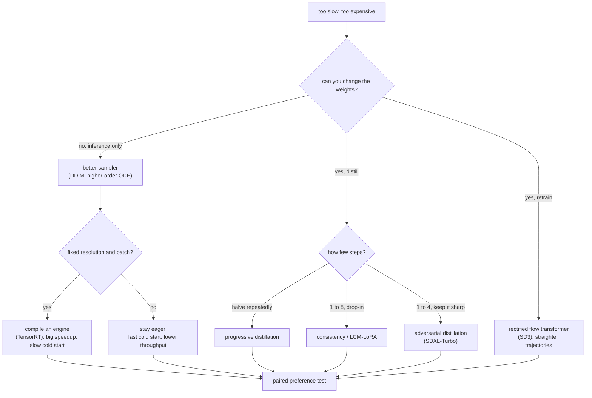
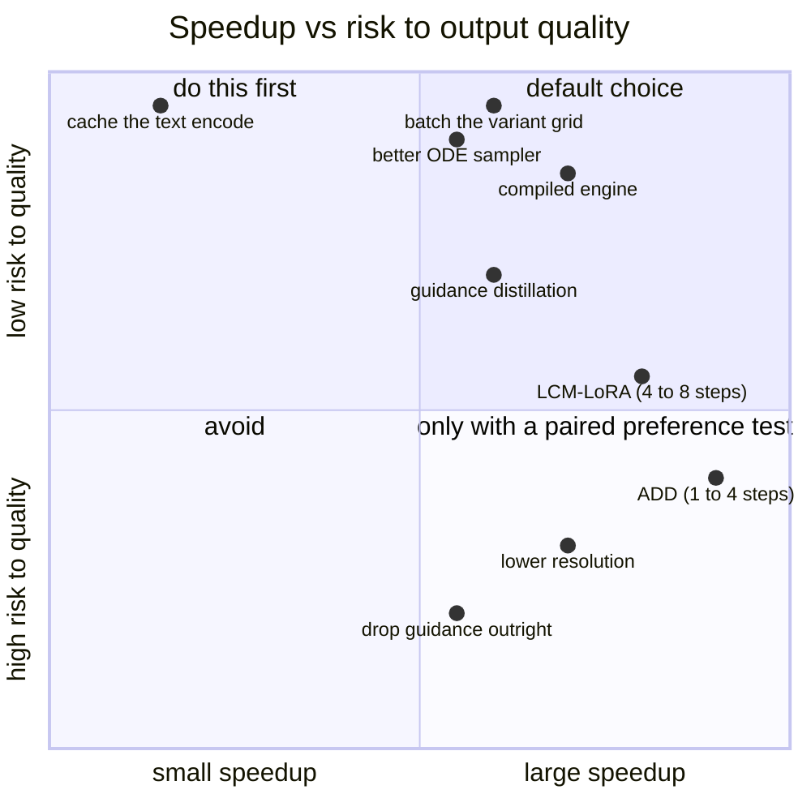

**What they share.** Every system here generates by running a denoiser repeatedly over a compressed latent, decoding once at the end, and paying for the whole thing in forward evaluations rather than in tokens. Each one encodes the prompt once, denoises for as few evaluations as it can get away with, decodes, classifies the output, and attaches provenance. None of them is autoregressive and none has a KV cache, which is why an answer borrowed from LLM serving misses on almost every lever. They diverge on how they buy the step count back, and on what they are willing to compile.

**The reference pipeline.** Read every design below as a specialization of this flow. What changes is where the step count comes from and how much of the graph is frozen into an engine, not the skeleton.

**Reading the diagram.** Follow it left to right as one generation, and note that the cost is decided in exactly one box. The denoising loop runs $S$ times, and classifier-free guidance runs the network twice per step (once conditioned, once not), so the unit you buy is $N_{\text{FE}} = S \cdot c$ with $c = 2$ under guidance. Everything else in the pipeline is a fixed cost paid once: the text encoder is one pass and its output is cacheable across repeated or templated prompts, the VAE decode is one pass whose activation memory, not time, is what fills the card at high resolution, and the safety classifier is a second model that has to fit inside the same latency budget. The latent is where the affordability comes from: an 8x downsample turns a 1024x1024 image into a 128x128 grid, and for a transformer denoiser that grid is patched into tokens, so a patch size of 2 gives 4,096 tokens and the attention arithmetic from the LLM topics applies unchanged. The two dotted edges are the only ways to move the number that matters: distillation lowers $S$ by changing the weights, and guidance distillation removes the factor of two by baking the effect in. The preview edge changes no cost at all and changes perceived latency more than either.

**Where they diverge.** The first fork is whether you are allowed to change the model; the second, if you are not, is how much of the graph you are willing to freeze.

**The choices, side by side.**

| System | Buys speed with | Steps | Gives up | Watch out |
| --- | --- | --- | --- | --- |
| Stability AI SDXL | A larger base plus a refiner stage | 30 to 50 | Cost per image, for quality at 1024px | Two models in the path, not one |
| Stability AI SDXL-Turbo (ADD) | Adversarial distillation | 1 to 4 | Diversity, some prompt adherence | Looks fine on demo prompts, narrow on the tail |
| LCM and LCM-LoRA | Consistency distillation as an adapter | 2 to 8 | Some fine detail | The adapter form is why it spread; quality varies by base |
| OpenAI consistency models | A direct map to the trajectory endpoint | 1 to 4 | Diversity | The formulation everything else descends from |
| Stability AI SD3 | A rectified-flow transformer | few | Nothing at serving time, it is a training decision | You cannot adopt it without changing models |
| Compiled engines (NVIDIA, Baseten) | Fixed shapes and fused kernels | unchanged | Cold start, and one engine per shape | Roughly a minute to load versus about ten seconds eager |
| Google Lumiere | Generating a whole clip in one pass | n/a | Compute per clip | Removes the keyframe-plus-interpolation seam |
| Stable Video Diffusion, Meta Movie Gen | Spatio-temporal attention | n/a | Interactive latency entirely | These are batch jobs with a progress channel |

**The math that separates them.** Four expressions decide what any of these is worth.

$$\textbf{the unit you actually buy: } N_{\text{FE}} = S \cdot c, \qquad c = 2 \text{ under classifier-free guidance}$$

$$\textbf{latency: } t \approx t_{\text{text}} + N_{\text{FE}} \cdot t_{\text{step}} + t_{\text{decode}} + t_{\text{safety}}$$

$$\textbf{why the latent is the whole trick: } \text{tokens} = \left(\frac{\text{image side}}{f \cdot \text{patch}}\right)^{2}, \qquad f = 8,\ \text{patch} = 2,\ 1024\text{px} \Rightarrow 4096$$

$$\textbf{video adds a factor, not a term: } N_{\text{FE}}^{\text{video}} \approx S \cdot c \cdot g(F), \qquad g(F) \text{ superlinear once attention spans time}$$

The first says a 30-step guided generation is 60 network evaluations, so quoting steps without guidance is quoting half the cost. The third says 2048px is four times 1024px in tokens and more than four times in attention. The fourth is why a five-second clip at 24 fps is minutes rather than seconds, and why every product that tried to serve video interactively ended up building a queue.

**When to use which.** Name the constraint first, then take the cheapest lever that moves it.

| Reach for | When | Instead of |
|---|---|---|
| A higher-order ODE sampler | Always, before anything else | Staying on the training-time step count, which nobody serves |
| Caching the text encoding | Templated or repeated prompts | Re-encoding a system prompt on every request |
| Batching the variant grid | The product shows the user four options | Four separate requests, which multiplies the denoising cost |
| Guidance distillation | Guidance is doubling every step and you can change weights | Lowering guidance strength, which changes the outputs users see |
| LCM-LoRA | You need few-step generation without replacing the base | A full distillation program, when an adapter gets most of it |
| Adversarial distillation | Single-digit steps and sharpness both matter | Consistency distillation alone, which softens at one step |
| A compiled engine | Fixed resolution and batch, and a warm pool | Compiling when you need scale-to-zero and many shapes |
| Tiled VAE decode | Resolution above about 1024px | Raising the instance size to survive one decode pass |
| A queue with progress | Video, or anything over a few seconds | A request-response endpoint that will time out |
| A paired preference test | Any change to steps, guidance or model | FID, which does not measure whether this prompt produced a good image |

**Interview watch-outs.**

- **Name the cost unit before anything else.** It is forward evaluations of the denoiser, not tokens and not steps. Guidance doubles it. Candidates who have only served LLMs reach for a KV cache that does not exist here.
- **The grid is one batch.** Generating four variants costs barely more than one, because the batch dimension rides through the same denoising loop. Products offer four for that reason, and an answer that prices them as four requests is wrong by nearly 4x.
- **Every step distillation trades diversity for speed.** Say it out loud, then propose keeping both paths: distilled for the draft grid, full model for the final render.
- **Cold start is the operational decision, not a footnote.** Compiled engines are the big speedup and the reason you may not be able to scale to zero. That tradeoff, in seconds, is what an interviewer is listening for.
- **The memory spike is the VAE decode, not the loop.** At high resolution that pass sets peak memory, and tiled decode is the standard bound.
- **Video is a queued job.** Frames multiply the evaluations and temporal attention makes it superlinear, so quote cost per second of output and offer a low-resolution preview tier.
- **FID is not the product metric.** Use paired human preference on a fixed prompt set plus an automatic prompt-adherence proxy, and keep seeded determinism so two model versions can be diffed on identical inputs.
