## RAG serving

### Ramp: RAG industry classification into NAICS codes ([source](https://builders.ramp.com/post/industry_classification))

Ramp built an online RAG pipeline that classifies businesses into standardized NAICS codes. It embeds business attributes and NAICS-code descriptions, precomputes the knowledge-base embeddings in ClickHouse for fast similarity retrieval, and pulls top-k candidate codes. A two-prompt LLM stage then narrows the shortlist: the first prompt selects among many terse candidates, the second re-scores a smaller set with richer descriptions to pick the final code. They tuned which attributes to embed and which embedding model to use via accuracy@k curves, gaining up to 60% accuracy@k and 5 to 15% fuzzy accuracy.

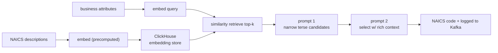

**Interview questions this design invites**
- Why precompute knowledge-base embeddings and store them in a columnar DB rather than embed at query time?
- How does a two-prompt selection stage manage context budget versus a single large prompt?
- What is accuracy@k and why tune the embedding model against it instead of picking the largest model?
- How would you design a "fuzzy accuracy" metric for a hierarchical label space like NAICS?
- How does this classification RAG differ from open-ended question-answering RAG?
- Where do you log intermediate results and why does that matter for debugging retrieval?

**Tricks and gotchas**
- Retrieval over a fixed, enumerable label set (NAICS codes) lets you precompute every candidate embedding once.
- The first prompt deliberately omits long descriptions to fit more candidates; richness is spent only on the finalists.
- accuracy@k curves reveal that a smaller, cheaper encoder can match a larger one on your specific data.
- Hierarchical labels reward partial correctness, so a plain exact-match metric understates real quality.

**Common mistakes and how to fix them**
- Defaulting to the biggest embedding model: profile accuracy@k and pick the cheapest model on the plateau.
- Stuffing all candidate descriptions into one prompt: split into narrow-then-select to control context size and cost.
- Scoring only exact matches: add a hierarchy-aware fuzzy metric so near-misses are visible.
- Embedding the wrong business fields: treat "which attributes to embed" as a tunable hyperparameter, not a given.

### Uber: Enhanced Agentic-RAG for the Genie on-call copilot ([source](https://www.uber.com/blog/enhanced-agentic-rag/))

Uber upgraded Genie, an internal on-call Slack copilot for security and privacy questions, into an agentic RAG (EAg-RAG). The offline path uses a custom Google Docs loader that recursively extracts paragraphs, tables, and the table of contents, with an LLM converting tables into markdown and tagging table-bearing chunks so they are not split badly; each chunk is enriched with an LLM-generated summary, FAQ set, and keywords. Online, a Query Optimizer agent rewrites and decomposes questions and a Source Identifier agent narrows the document scope before hybrid vector plus BM25 retrieval; a Post-Processor agent dedups and reorders chunks by document position. LLM-as-judge (0 to 5) cut eval from weeks to minutes; they report a 27% relative lift in acceptable answers and 60% fewer incorrect answers.

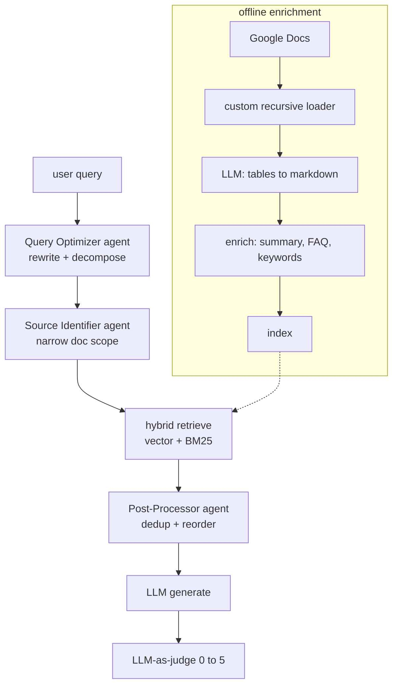

**Interview questions this design invites**
- What does an "agentic" pre-retrieval stage add over embedding the raw user query directly?
- Why enrich chunks with LLM-generated summaries, FAQs, and keywords before indexing?
- How does a Source Identifier agent narrow scope, and what artifact does it read to do so?
- Why does table extraction need special handling in the loader and chunker?
- How do you keep an LLM-as-judge eval trustworthy while running it in minutes?
- What are the failure modes of query decomposition into subqueries?

**Tricks and gotchas**
- Standard PDF loaders lose table structure; a format-aware loader plus LLM markdown conversion preserves it.
- Tagging table-containing chunks prevents the chunker from splitting a table mid-row.
- Metadata enrichment does double duty: it improves both retrieval recall and the source-narrowing agent.
- Reordering retrieved chunks by original document position gives the generator coherent context.

**Common mistakes and how to fix them**
- Feeding raw noisy queries into retrieval: add a query optimizer that rewrites and decomposes first.
- Naive PDF-to-text that flattens tables: build a structural loader and convert tables to markdown.
- Vector-only retrieval missing exact terms: merge vector with BM25 for broader coverage.
- Manual multi-week eval blocking iteration: automate with an LLM judge scored against SME ground truth.

### Microsoft Research: GraphRAG over narrative private data ([source](https://www.microsoft.com/en-us/research/blog/graphrag-unlocking-llm-discovery-on-narrative-private-data/))

GraphRAG replaces vector-only retrieval with a knowledge graph the LLM builds from the corpus: it extracts entities (people, places, organizations) and their relationships, then applies bottom-up hierarchical clustering into semantic communities and pre-summarizes each community. At query time it uses the graph structure and community summaries to populate the context window, which lets it connect disparate facts and answer multi-hop and whole-corpus "what are the themes" questions that baseline RAG misses. Evaluation is qualitative pairwise grading on comprehensiveness, diversity, and human enfranchisement (provision of source material), with SelfCheckGPT for faithfulness and per-response citation links.

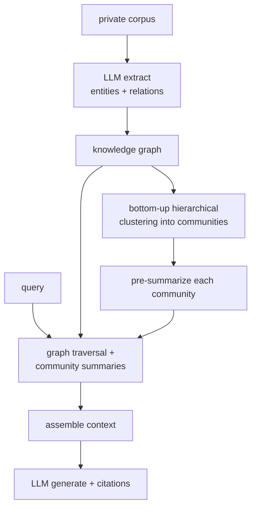

**Interview questions this design invites**
- When does knowledge-graph retrieval beat vector similarity, and when is it overkill?
- How does an LLM build a knowledge graph from unstructured text, and what errors creep in?
- Why does hierarchical community summarization enable whole-corpus (global) questions?
- How would you evaluate comprehensiveness and diversity without gold answers?
- What is SelfCheckGPT measuring here and why measure faithfulness separately?
- What is the offline cost of graph construction and how does it scale with corpus size?

**Tricks and gotchas**
- Multi-hop questions need traversal across shared entities, which flat top-k vector search cannot do.
- Pre-computed community summaries let the system answer "themes across everything" without reading everything at query time.
- Entity extraction quality caps graph quality; a noisy extractor poisons downstream retrieval.
- Pairwise human grading is used because single-answer scoring is unreliable for open-ended questions.

**Common mistakes and how to fix them**
- Using vector-only RAG for global sensemaking questions: build a graph and summarize communities.
- Trusting LLM-extracted entities blindly: add consistency checks and provenance so bad nodes are traceable.
- Reporting a single accuracy number: grade comprehensiveness, diversity, and faithfulness as separate axes.
- Ignoring graph-build cost: budget the offline LLM passes, since construction dominates the compute.

### Dropbox: Dash hybrid RAG for business users ([source](https://dropbox.tech/machine-learning/building-dash-rag-multi-step-ai-agents-business-users))

Dropbox Dash pairs a lexical (IR) search system with embedding-based rerankers and does chunking at query time rather than pre-indexing, so only relevant sections are cut and reranked by a larger embedding model. Freshness is handled with periodic data syncs plus webhooks where available, deliberately avoiding real-time API latency. The team framed the build around explicit tensions (latency vs quality, freshness vs scalability, budget vs UX), landing on hybrid retrieval that hits high quality within 2 seconds for 95% of queries. Evaluation uses LLM judges for answer correctness and completeness plus source precision, recall, and F1.

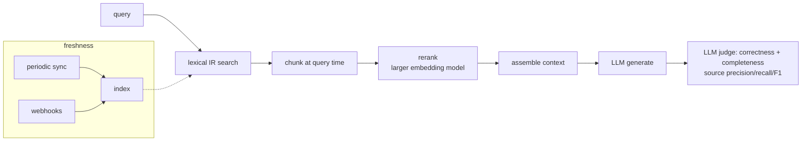

**Interview questions this design invites**
- Why chunk at query time instead of pre-chunking and pre-embedding the whole corpus?
- What does a lexical-first retrieval plus embedding reranker buy over pure semantic search?
- How do you decide between real-time API calls, periodic syncs, and webhooks for freshness?
- What is source F1 and why measure retrieval separately from answer correctness?
- How do you hold a 2-second p95 latency budget while reranking with a large model?
- Which of the stated tensions (latency, freshness, budget) would you relax first and why?

**Tricks and gotchas**
- Query-time chunking means you only ever cut the documents you actually retrieved, saving index cost.
- Webhooks give near-real-time freshness only where the source supports them; syncs cover the rest.
- A larger embedding model is affordable as a reranker because it runs on a short candidate list, not the corpus.
- Source-level precision/recall/F1 catches retrieval regressions that answer-only judging would hide.

**Common mistakes and how to fix them**
- Pre-chunking everything up front: defer chunking to query time to cut index churn and irrelevant splits.
- Polling APIs in real time for freshness: use periodic syncs plus webhooks to avoid the latency penalty.
- Judging only the final answer: add source precision/recall/F1 to isolate retrieval quality.
- Committing to pure lexical or pure semantic: combine them so exact terms and meaning both count.

### Vespa: Embedding tradeoffs quantified ([source](https://blog.vespa.ai/embedding-tradeoffs-quantified/))

Vespa benchmarked embedding quantization and hybrid retrieval to quantify quality-versus-latency-versus-storage tradeoffs. INT8 quantization runs 2.7 to 3.4x faster on CPUs while keeping 94 to 98% quality, but 4 to 5x slower on GPUs (use FP16 there for ~2x speedup at negligible loss). For 100M 768-dim vectors, storage drops from 307 GB (FP32) to 154 GB (bfloat16, zero quality loss) to 9.6 GB (binary, 32x). Binary resilience is model-dependent: GTE ModernBERT holds 98% while E5-small-v2 falls to 87%. Hybrid BM25 plus vector (via RRF or score normalization) beat semantic-only by 3 to 5 points for every model tested.

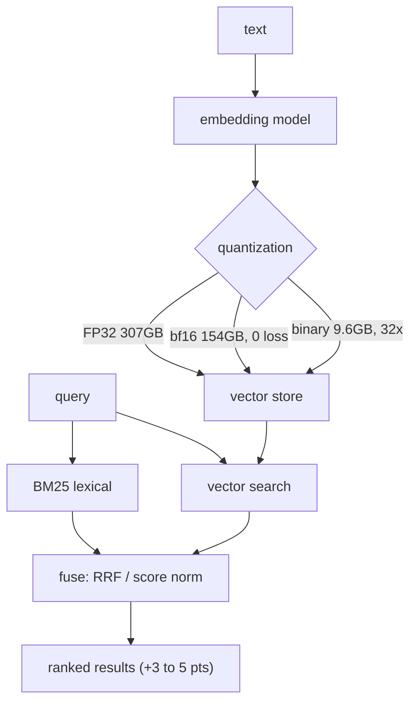

**Interview questions this design invites**
- Why does INT8 speed up CPU inference but slow down GPU inference?
- How do you choose between FP32, bfloat16, and binary vectors for a 100M-vector index?
- Why is binary-quantization quality so model-dependent, and how would you test it before shipping?
- How do RRF and score normalization fuse BM25 and vector scores?
- Given a fixed memory budget, how do quantization and hybrid retrieval interact?
- Where does bfloat16 fit as a "free" optimization and why?

**Tricks and gotchas**
- INT8 is a CPU win but a GPU loss; the right precision depends on the serving hardware.
- bfloat16 halves storage with zero measured quality loss, so it is close to a free win.
- Binary quantization gives 32x storage savings but only some model families survive it (ModernBERT yes, E5 less so).
- Hybrid retrieval adds 3 to 5 points with no architecture change, just a fusion step.

**Common mistakes and how to fix them**
- Applying INT8 uniformly across hardware: use INT8 on CPU, FP16 on GPU.
- Assuming binarization is safe for any encoder: benchmark quality per model before enabling it.
- Storing FP32 vectors by default: switch to bfloat16 for a free 2x storage cut.
- Shipping semantic-only search: add BM25 and fuse for a cheap, consistent quality gain.

### NVIDIA: Reranking microservice for two-stage retrieval ([source](https://developer.nvidia.com/blog/how-using-a-reranking-microservice-can-improve-accuracy-and-costs-of-information-retrieval/))

NVIDIA describes a two-stage retrieve-then-rerank pipeline packaged as NeMo Retriever NIM microservices. Stage one uses an embedding model to narrow millions of passages to tens; stage two uses a cross-encoder reranker that jointly scores each query-passage pair to keep roughly five. Because the reranker costs about 75x less than running Llama 3.1 8B over the same passages, sending fewer, better chunks to the generator cuts LLM token cost while holding or improving accuracy. They outline three operating points (maximize accuracy at net-zero cost, maximize savings, or balanced) and report about 21.5% cost savings from reduced LLM token processing.

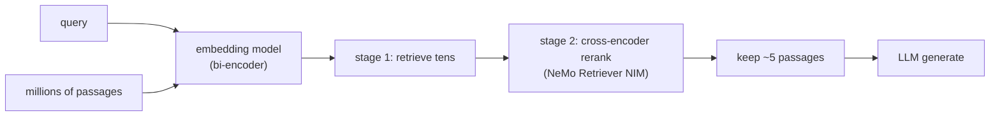

**Interview questions this design invites**
- What is the difference between a bi-encoder retriever and a cross-encoder reranker?
- Why is it cheaper to rerank tens of passages than to let the LLM read all of them?
- How do you set the candidate count for stage one versus the keep count for stage two?
- What are the three cost-accuracy operating points and when would you pick each?
- Why does feeding fewer chunks sometimes improve accuracy, not just cost?
- How would you deploy the reranker as a separate autoscaling microservice?

**Tricks and gotchas**
- The cross-encoder is expensive per pair but only runs on a short shortlist, so total cost stays low.
- Reranking is roughly 75x cheaper than the generator per passage, so it is a cost lever, not just a quality lever.
- You can hold cost flat by swapping one base-retrieval chunk for one reranked chunk.
- Fewer, higher-precision chunks reduce the lost-in-the-middle dilution in the generator.

**Common mistakes and how to fix them**
- Dumping all retrieved chunks into the LLM: add a reranker and trim to the top few.
- Treating reranking as pure accuracy spend: use it to cut generator token cost too.
- Fixing candidate and keep counts arbitrarily: tune them along the accuracy-cost curve.
- Coupling the reranker into the app process: run it as an independent, autoscaled microservice.

### Glean: Hybrid search plus knowledge graph for enterprise RAG ([source](https://www.glean.com/blog/hybrid-vs-rag-vector))

Glean argues vector search alone is insufficient for enterprise RAG and combines it with lexical search to marry precision with semantic understanding. Around that hybrid core they add an enterprise knowledge graph (signals and anchors linking people, docs, and activity), a permission-aware crawler that ingests content with access rules intact, and LLM integration tuned to handle retrieval gaps gracefully. The knowledge graph supplies organizational context that disambiguates queries: a plain RAG system answered "Scholastic" with a book publisher, while Glean correctly resolved it to an internal system. Ranking is multi-signal and permission-aware so results are both relevant and legally visible to the asking user.

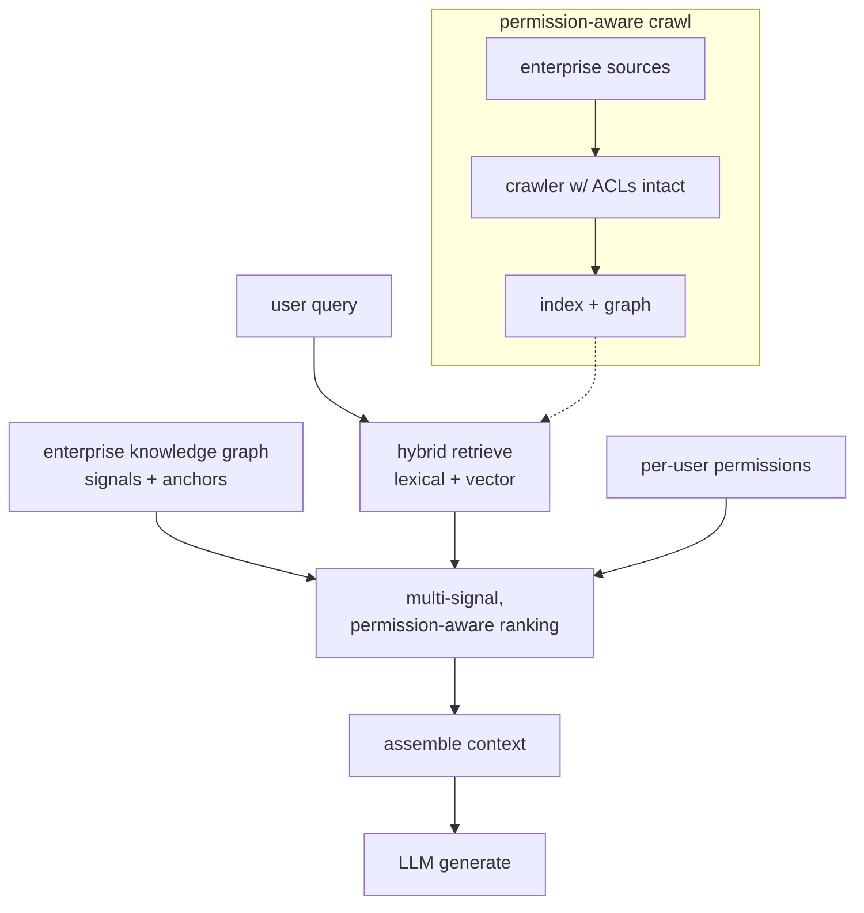

**Interview questions this design invites**
- Why is vector similarity insufficient to disambiguate enterprise-specific terms?
- How does a knowledge graph of signals and anchors add organizational context to ranking?
- What does permission-aware retrieval require, and why enforce access at retrieval time?
- How do you fuse lexical, semantic, and graph signals into one ranking?
- How do you keep the crawler's access rules synchronized with the source systems?
- What happens when retrieval finds nothing, and how should the LLM respond?

**Tricks and gotchas**
- Enterprise jargon collides with public meanings; graph context resolves "Scholastic" to the internal system.
- Permissions must travel with the content through the crawler, or the index leaks documents.
- Multi-signal ranking blends relevance with recency, authorship, and activity, not just cosine similarity.
- The LLM layer must degrade gracefully when retrieval is weak rather than fabricate.

**Common mistakes and how to fix them**
- Relying on embeddings alone in the enterprise: add lexical search and a knowledge graph for context.
- Filtering permissions after retrieval: enforce ACLs inside the search so results are pre-authorized.
- Ranking on similarity only: combine multiple signals for enterprise relevance.
- Ignoring the empty-retrieval case: design graceful gap handling instead of hallucinated answers.

### Company: MongoDB ([source](https://www.mongodb.com/developer/products/atlas/taking-rag-to-production-documentation-ai-chatbot/))

MongoDB moved a documentation AI chatbot from prototype to production on Atlas Vector Search. Retrieval is a two-stage aggregation pipeline: a `$vectorSearch` stage narrows candidates, then `$project` shapes results. Two knobs control recall versus latency: `numCandidates` (how many potential matches to evaluate, with an optional exact-nearest-neighbor mode that scans all documents) and `limit` (how many chunks to return). Chunking offers recursive splitting (paragraph and sentence boundaries, the default) or fixed-token with overlap, with sizes from 40 to 1500 tokens and overlap capped at 50% of chunk size. Embeddings come from Voyage AI, defaulting to `voyage-3-large` with domain variants (`voyage-finance-2`, `voyage-law-2`). The pipeline exposes the search query, retrieved document count, and per-document scores for transparency.

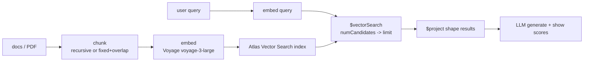

**Interview questions this design invites**
- What is the difference between `numCandidates` and `limit`, and how does each affect recall versus latency?
- When would you enable exact-nearest-neighbor (scan all documents) instead of approximate search?
- How do you choose between recursive and fixed-token-with-overlap chunking for docs?
- Why cap chunk overlap at 50% of chunk size, and what does more overlap buy you?
- When is a domain-tuned embedding model (finance, law) worth it over a general one?
- Why surface the search query and per-document scores in the UI?

**Tricks and gotchas**
- `numCandidates` widens the approximate-search pool before `limit` trims it; they are separate levers for recall and cost.
- Recursive chunking preserves natural structure; fixed-token gives predictable sizes but can split logical units.
- Text-only embeddings mean images inside PDFs are silently dropped from the index.
- Exposing scores and the executed query makes retrieval failures debuggable rather than mysterious.

**Common mistakes and how to fix them**
- Leaving `numCandidates` too low and starving recall: raise it (or use exhaustive mode) and watch the latency tradeoff.
- Fixed-token chunking that cuts mid-paragraph: switch to recursive splitting when structure matters.
- Assuming PDFs with figures are fully indexed: remember text-only embeddings skip images, so curate accordingly.
- Picking the largest embedding model blindly: try a domain-specific variant on your own accuracy numbers first.

### Company: Grab ([source](https://engineering.grab.com/transforming-the-analytics-landscape-with-RAG-powered-LLM))

Grab grounds analyst-facing bots (a Report Summarizer and the A* fraud-investigation bot) with Data-Arks, a Python API middleware that packages frequently used SQL queries and Python functions into vetted, parameterized APIs. Instead of letting the LLM generate SQL, RAG selects the most relevant pre-written query API from the catalog, executes it, and feeds the returned tabular data to the LLM to summarize. This trades open-ended query generation for accuracy: the retrieval unit is a curated query, not a document chunk, so hallucinated SQL is eliminated. The stack combines an internal LLM platform (Spellvault), Data-Arks, a scheduler, and Slack as the interface, with reported savings of 3 to 4 hours per report and fraud investigations cut from hours to minutes.

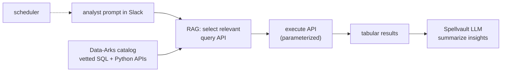

**Interview questions this design invites**
- Why retrieve a pre-written query API instead of having the LLM generate SQL?
- How does grounding on executed tabular data differ from grounding on retrieved text chunks?
- What is the retrieval unit here, and how do you keep the API catalog relevant over time?
- Where does hallucination risk move when the LLM only summarizes results rather than writing queries?
- How would you evaluate a report-summarizer whose inputs are structured tables?
- Why pick Slack as the surface, and what does the scheduler add?

**Tricks and gotchas**
- Most analyst work is the same SQL with parameter tweaks, so packaging queries as APIs captures the pattern cheaply.
- Making the retrieval unit a vetted query removes the entire class of generated-SQL errors.
- The LLM only summarizes trusted numbers, so grounding correctness is decoupled from generation quality.
- Multi-source APIs (Slack, Wiki, JIRA) let one middleware aggregate context beyond the warehouse.

**Common mistakes and how to fix them**
- Letting the LLM author SQL against production data: retrieve a vetted, parameterized query instead.
- Treating RAG as document-only: here the corpus is a catalog of query APIs, so index those.
- Summarizing without provenance: return the underlying table so numbers are auditable.
- Building a bespoke UI: meet analysts in Slack and automate refreshes with a scheduler.

### Company: Thomson Reuters ([source](https://medium.com/tr-labs-ml-engineering-blog/better-customer-support-using-retrieval-augmented-generation-rag-at-thomson-reuters-4d140a6044c3))

Thomson Reuters grounds customer-support answers in a regulated (tax) domain with dense retrieval. Knowledge-base articles and CRM content are chunked and embedded with the `all-MiniLM-L6-v2` sentence transformer, stored in Milvus, and retrieved by cosine or Euclidean similarity. Retrieved passages are concatenated with the prompt and sent to GPT-4 for generation. Because knowledge lives outside the model's parameters, it can be updated post-training without retraining, which matters when compliance guidance evolves. Their worked example (tax error IND-041) shows RAG turning generic GPT-4 guidance into precise product-specific steps, reducing hallucination and adding provenance.

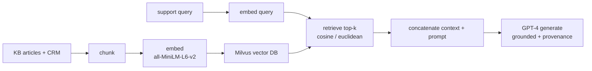

**Interview questions this design invites**
- Why choose dense retrieval over sparse (keyword) retrieval for support content?
- What does a non-parametric knowledge store buy you in a regulated, fast-changing domain?
- Why might `all-MiniLM-L6-v2` be a reasonable choice despite being small?
- How does concatenating retrieved context reduce hallucination, and where can it still fail?
- What does "provenance" mean here and why is it critical in a compliance setting?
- How would you evaluate answer correctness for regulated support beyond anecdotes?

**Tricks and gotchas**
- Keeping knowledge outside model weights lets compliance updates ship without retraining.
- A small sentence-transformer can be enough when the corpus is domain-specific and well curated.
- Provenance (citing the grounding article) is a first-class requirement, not a nicety, in regulated domains.
- Cosine versus Euclidean similarity is a real choice that depends on whether embeddings are normalized.

**Common mistakes and how to fix them**
- Relying on GPT-4 parametric knowledge for product-specific steps: ground on the KB and CRM instead.
- Shipping answers with no source: attach provenance so agents can verify against the cited article.
- Retraining to update guidance: update the vector store, since the knowledge is non-parametric.
- Ignoring the similarity metric: match cosine versus Euclidean to whether your vectors are normalized.

### Company: Mercado Libre ([source](https://medium.com/mercadolibre-tech/beyond-the-hype-real-world-lessons-and-insights-from-working-with-large-language-models-6d637e39f8f8))

Mercado Libre's lessons center on raising the eval bar for practical LLM systems. Their documentation-search RAG (built with LlamaIndex) taught them the model cannot reliably answer beyond its retrieved context, so the fix was improving documentation quality rather than trusting general knowledge. Facing 2000 undocumented database tables, they used LLMs to auto-generate table descriptions and hit 90% stakeholder approval, but only after iterating heavily on prompts for structure, jargon, and format. For ambiguous natural language ("next Thursday", product quantities) they used function calling with defined output schemas to force predictable structured extraction. Recurring principles: ground in domain knowledge, iterate on prompts with QA feedback, offload processing outside the model to cut cost, and start with simpler models before premium ones.

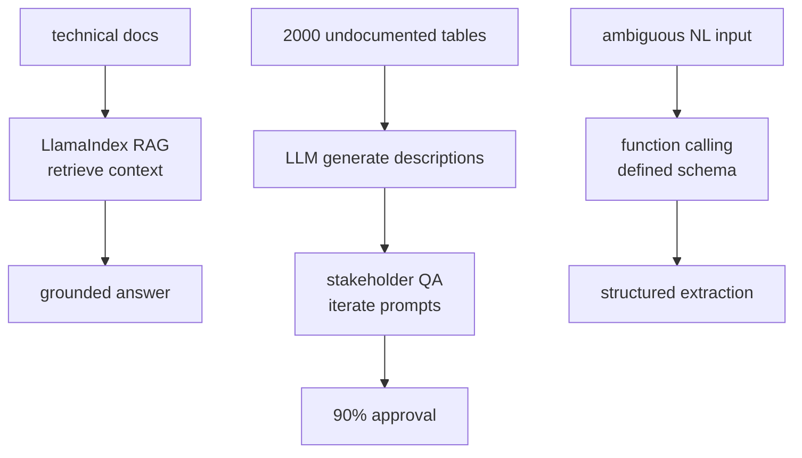

**Interview questions this design invites**
- Why does improving documentation beat prompt-tuning when RAG answers are weak?
- How do you QA thousands of LLM-generated table descriptions efficiently?
- When do you reach for function calling with a fixed schema instead of free-text generation?
- Why start with simpler models before premium ones, and how do you know when to upgrade?
- What does "offload processing outside the model" mean and when does it save cost?
- How would you measure the 90% approval bar objectively across stakeholders?

**Tricks and gotchas**
- If retrieval has no answer, no prompt trick recovers it; fix the corpus, not the prompt.
- Auto-generated metadata (table descriptions) is a force multiplier but needs a human QA loop.
- Function calling with a schema turns messy natural language into predictable, actionable data.
- Cheaper models often clear the bar; reserve premium models for tasks that measurably need them.

**Common mistakes and how to fix them**
- Blaming the model for gaps that are really missing documentation: enrich the corpus first.
- Trusting generated metadata without review: add a stakeholder QA loop and iterate prompts.
- Parsing ambiguous inputs with free text: use function calling with an explicit output schema.
- Defaulting to the most expensive model: start simple and upgrade only when metrics demand it.
_Not reachable: DoorDash_
