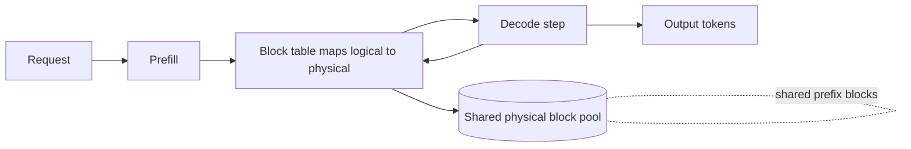
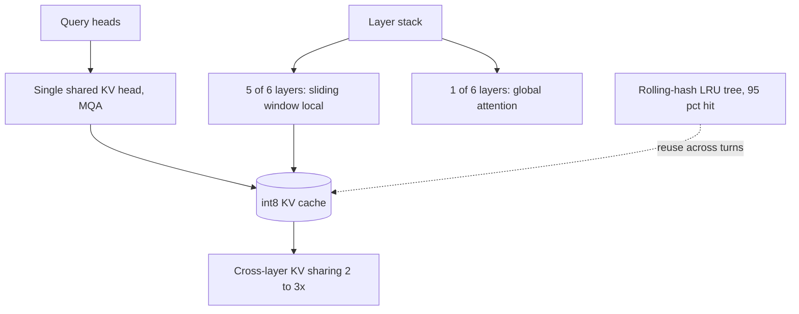
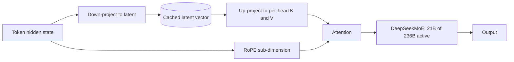
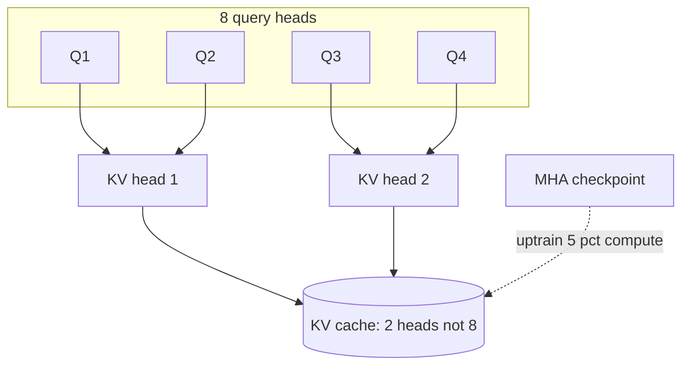
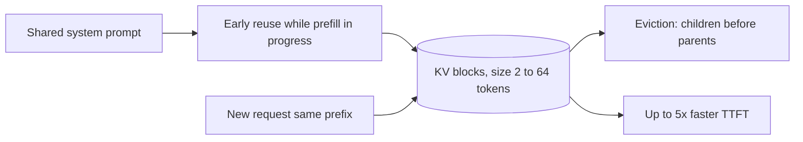
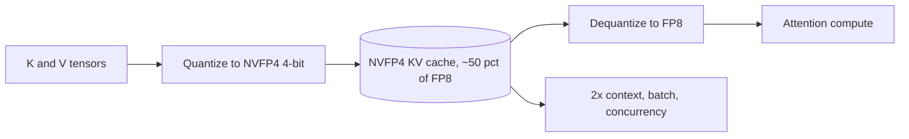
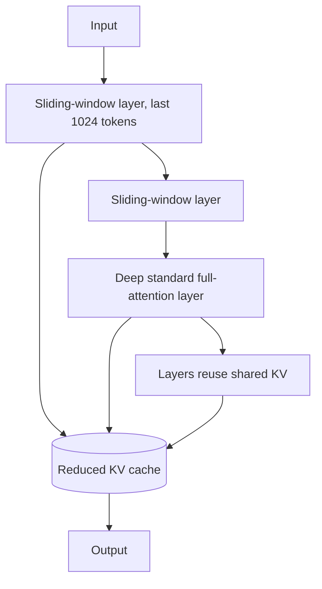
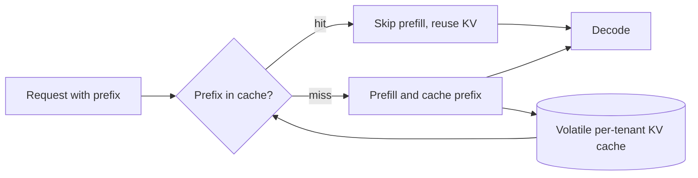

## Long-context and the KV cache

### vLLM (UC Berkeley): OS-style paged KV-cache management ([source](https://arxiv.org/abs/2309.06180))

vLLM is a serving system built around PagedAttention, an attention kernel that manages the KV cache in fixed-size blocks like operating-system virtual-memory pages instead of one contiguous buffer per sequence. Because the cache grows and shrinks dynamically during decode, contiguous allocation wastes memory to internal and external fragmentation; paging drives that toward near-zero waste and lets blocks be shared within and across requests. The extra packing means more concurrent sequences fit in the same GPU memory, delivering 2x to 4x throughput over prior systems like FasterTransformer and Orca at matched latency. The gains are largest for long sequences, big models, and parallel-sampling decode strategies where memory pressure is worst.

**Interview questions this design invites**

- Why does a contiguous per-sequence KV buffer waste memory, and which fragmentation type dominates?
- How does a block table translate logical token positions to physical blocks?
- What block size trades internal fragmentation against table overhead?
- How does copy-on-write let parallel samples share a prompt's KV blocks?
- Why do throughput gains grow with sequence length and batch size?
- What is the memory-versus-latency relationship once you can pack more sequences?

**Tricks and gotchas**

- Paging adds an indirection per attention access, so the kernel must be written to gather non-contiguous blocks without killing bandwidth.
- Block size is a real tuning knob: too large wastes the tail block, too small bloats the block table.
- Sharing blocks across requests needs reference counting and copy-on-write to stay correct when one sequence diverges.
- Throughput wins depend on there being enough queued requests to fill the freed memory.

**Common mistakes and how to fix them**

- Assuming paging speeds up a single request. It raises concurrency and throughput, not per-token latency; measure aggregate tokens per second.
- Forgetting the block-table lookup cost. Fuse it into the attention kernel rather than doing it in Python per step.
- Setting block size by intuition. Sweep it against your real sequence-length distribution.
- Ignoring reference counting on shared prefixes. Leaked or prematurely freed blocks corrupt other sequences; instrument the pool.

### Character.AI: MQA plus hybrid attention, cross-layer KV sharing, and int8 ([source](https://blog.character.ai/optimizing-ai-inference-at-character-ai-2/))

Character.AI cut KV-cache size by more than 20x by stacking three architectural changes: Multi-Query Attention (roughly 8x smaller than GQA), hybrid local/global attention with sliding windows on 5 of every 6 layers, and KV sharing across neighboring layers for another 2x to 3x. They train models natively in int8 (weights, activations, and the KV cache) rather than post-training quantizing, which needs custom matmul and attention kernels. A stateful inter-turn prefix cache, an LRU tree indexed by rolling hash, hits about 95% across the fleet because the average conversation carries 180 messages of history. Together these cut serving cost 33x since late 2022, at over 20,000 queries per second.

**Interview questions this design invites**

- Why does MQA give a larger cache cut than GQA, and what quality risk does it carry?
- How does a 5-of-6 local/global layer pattern preserve long-range information cheaply?
- What makes native int8 training different from post-training quantization for the KV cache?
- How does a rolling hash key the prefix cache across dialogue turns?
- Why does a 95% hit rate matter more when average history is 180 messages?
- Where does cross-layer KV sharing lose quality, and how do you bound it?

**Tricks and gotchas**

- Native int8 requires custom kernels; you cannot bolt it on with a stock stack.
- Sliding-window local layers need at least some global layers or long-range recall collapses.
- Rolling-hash prefix keys must handle turn boundaries and tokenizer edges or hit rate degrades silently.
- Cross-layer sharing couples layers, so a bad share pattern hurts quality unevenly.

**Common mistakes and how to fix them**

- Treating MQA as free. It is aggressive; validate quality on your task before shipping, and fall back to GQA if it regresses.
- Post-quantizing to int8 and expecting Character.AI's numbers. They trained in int8; PTQ needs its own eval and per-channel scales.
- Building a flat prefix cache. Use a tree keyed by hashed prefixes so multi-turn history reuses shared ancestors.
- Sharing KV across arbitrary layers. Place shared and full layers deliberately, keeping enough independent global layers.

### DeepSeek (V2): Multi-head Latent Attention compresses KV into a latent ([source](https://arxiv.org/abs/2405.04434))

DeepSeek-V2 introduces Multi-head Latent Attention, which does not cache full keys and values at all; it down-projects each token into a small latent vector, caches only that latent, and up-projects back to per-head keys and values at attention time. This shrinks the KV cache about 93.3% versus the dense predecessor while keeping quality high. It pairs with DeepSeekMoE, activating only 21B of 236B parameters per token, so both cache memory and per-token compute stay low. RoPE does not commute cleanly with the compression, so DeepSeek splits the head dimension into a positional RoPE-carrying part and a compressed latent part.

**Interview questions this design invites**

- How does MLA differ from GQA in what actually shrinks the cache formula?
- Why can you store a latent and reconstruct K and V instead of caching them?
- Why does RoPE break naive latent compression, and how does splitting the head fix it?
- What compute cost does the up-projection add per decode step?
- How do MLA and MoE attack different terms of the serving bill?
- When would MLA beat GQA despite its extra complexity?

**Tricks and gotchas**

- The RoPE-versus-latent head split is the detail most diagrams get wrong; both parts must be concatenated per head.
- The up-projection matmul is paid every step, so it must be cheap relative to the memory saved.
- MoE keeps all experts resident in memory even though only a few activate, so weight memory rises.
- Latent width is a quality knob: too small and reconstruction loses information.

**Common mistakes and how to fix them**

- Claiming MLA shrinks kv_heads like GQA. It replaces cached K and V with a latent; describe the mechanism, not the head count.
- Applying RoPE to the whole latent. Split the head so only the positional sub-dimension carries RoPE.
- Assuming MoE cuts memory. It cuts active compute per token but needs all experts in HBM; budget for that.
- Picking latent dims by feel. Sweep the down-projection width against quality on long-context evals.

### Google Research (GQA): trade KV heads for speed at near-MHA quality ([source](https://arxiv.org/abs/2305.13245))

Grouped-Query Attention sits between Multi-Head Attention (one KV head per query head) and Multi-Query Attention (a single shared KV head) by using an intermediate number of KV heads, each shared across a group of query heads. This directly shrinks the kv_heads term of the cache formula while keeping quality close to MHA. The paper also gives a recipe to uptrain existing MHA checkpoints into GQA (and MQA) using about 5% of original pre-training compute, so you convert a trained model rather than retrain from scratch. The result reaches quality close to MHA at speed comparable to MQA, which is why GQA is the current default.

**Interview questions this design invites**

- How does GQA interpolate between MHA and MQA, and what does the group size control?
- Why does GQA lose less quality than MQA for the same cache saving?
- How does uptraining convert an MHA checkpoint into GQA cheaply?
- What is the cache-reduction factor for 32 query heads and 8 KV heads?
- Why is GQA the safe default over MLA for most deployments?
- How do you pick the number of KV groups for a target memory budget?

**Tricks and gotchas**

- Uptraining still costs about 5% of pretraining compute; it is cheap, not free.
- Group size is a direct quality-versus-memory dial; too few KV heads approaches MQA's quality risk.
- Mean-pooling the original KV heads when initializing groups matters for uptraining quality.
- GQA shrinks the cache but leaves head_dim and layer count untouched.

**Common mistakes and how to fix them**

- Conflating GQA and MQA. GQA keeps several KV heads; MQA keeps one. State the group count.
- Expecting free conversion. Budget the 5% uptraining compute and re-evaluate quality after.
- Setting one KV head to maximize savings. Keep enough groups to stay near MHA quality on your evals.
- Assuming GQA fixes long-context memory alone. Combine with paging, quantization, or prefix caching.

### NVIDIA: TensorRT-LLM KV-cache early reuse ([source](https://developer.nvidia.com/blog/5x-faster-time-to-first-token-with-nvidia-tensorrt-llm-kv-cache-early-reuse/))

TensorRT-LLM lets shared prefixes (system prompts) be reused as their KV cache is being built rather than only after the whole computation finishes, which cuts redundant prefill during traffic surges. It adds flexible block sizing, letting developers chop KV blocks into sizes from 64 down to 2 tokens so short sequences waste less cache and reuse more precisely. Its eviction algorithm traces dependency trees and evicts dependent (child) blocks before their source (parent) blocks, so reusable prefixes survive under pressure. This yields up to 5x faster time-to-first-token for system-prompt-heavy workloads and about 7% additional speedup from block sizing on LLaMA-70B on H100.

**Interview questions this design invites**

- What does early reuse buy over reuse that waits for full prefill completion?
- How does variable block size reduce wasted cache for short sequences?
- Why must eviction evict dependent blocks before their source blocks?
- Where does the 5x TTFT gain come from, and for which workloads?
- What is the failure mode if a parent prefix block is evicted first?
- How does this compare to vLLM's fixed-block paging?

**Tricks and gotchas**

- Smaller blocks improve reuse granularity but increase block-table and management overhead.
- Early reuse only helps when prefixes genuinely repeat, such as a fixed system prompt under a surge.
- Dependency-aware eviction is essential; naive LRU can evict a shared parent and force recompute for everyone.
- The 7% block-sizing gain is model and shape specific, not universal.

**Common mistakes and how to fix them**

- Using one large block size everywhere. Match block size to your sequence-length distribution.
- Treating eviction as plain LRU. Track block dependencies so shared prefixes are evicted last.
- Expecting TTFT gains without shared prefixes. The win is prefix-reuse; measure your prefix hit rate first.
- Ignoring management overhead of tiny blocks. Profile the crossover where smaller blocks stop helping.

### NVIDIA: NVFP4 4-bit KV cache ([source](https://developer.nvidia.com/blog/optimizing-inference-for-long-context-and-large-batch-sizes-with-nvfp4-kv-cache/))

NVFP4 is a 4-bit floating-point format for the KV cache that cuts KV memory roughly 50% versus an FP8 cache, effectively doubling the context length, batch size, and concurrency that fit in HBM. Values are dequantized from NVFP4 up to FP8 before the attention math to hold accuracy, and its finer block scaling gives about 5% higher accuracy than MXFP4. Measured accuracy loss is under 1% across LiveCodeBench, MMLU-PRO, MBPP, and Ruler 64K. It optimizes for memory bandwidth and long-context/large-batch serving, reporting up to 3x prefill improvement from higher cache-hit rates and freeing HBM for weights and parallelism.

**Interview questions this design invites**

- Why quantize the KV cache rather than only the weights for long-context serving?
- Why dequantize NVFP4 to FP8 before attention instead of computing in 4-bit?
- What does finer block scaling buy over MXFP4?
- How does halving KV memory translate into doubled context or batch?
- How would you gate a 4-bit KV format behind an accuracy eval?
- Why does a smaller cache also help decode bandwidth, not just capacity?

**Tricks and gotchas**

- Block scaling granularity drives the accuracy gap; coarser scales lose more than the headline 1%.
- The dequant-to-FP8 step is what protects accuracy; skipping it to compute in raw 4-bit degrades quality.
- Sub-1% loss is benchmark-dependent; your task may be more sensitive, especially at very long context.
- Freed HBM only helps if you actually raise batch size or context to use it.

**Common mistakes and how to fix them**

- Shipping 4-bit KV on vibes. Gate behind an eval on your own long-context tasks, as the CLAUDE guidance insists.
- Assuming all 4-bit formats are equal. NVFP4's block scaling beats MXFP4 by about 5%; pick the format deliberately.
- Quantizing keys and values identically without checking. Keys are often more sensitive; validate per-tensor behavior.
- Cutting memory but not raising throughput. Deliberately increase batch or context to convert savings into gains.

### Databricks: MixAttention (cross-layer KV sharing plus sliding window) ([source](https://www.databricks.com/blog/mixattention))

MixAttention shrinks the KV cache by combining sliding-window attention (queries attend to only the last 1024 tokens) on most layers, a few retained standard full-attention layers for long-range ability, and KV-cache sharing where multiple layers reuse one layer's KV tensors. Their ablations found that keeping standard attention in the deeper layers matters more for long-context ability than keeping it in the first few layers, and that sharing among sliding-window layers should not be overdone. The best variants (MA-Offset and MA-Pairs) place full-attention layers deep and limit sharing. On a single H100 at 32K context this gives faster inference and larger batch sizes, with quality preserved on commonsense and world knowledge but some regression on reading comprehension.

**Interview questions this design invites**

- Why does placing full-attention layers deep help long context more than placing them early?
- How does a 1024-token sliding window bound the per-layer cache?
- What does cross-layer KV sharing save, and what does it cost in quality?
- Why does MixAttention regress on reading comprehension but not commonsense?
- How would you search the space of which layers are full versus windowed versus shared?
- What is the memory reduction when every l layers share one KV?

**Tricks and gotchas**

- Over-sharing among sliding-window layers hurts quality more than sharing across mixed layers.
- Long-context ability is sensitive to where the full-attention layers sit, not just how many there are.
- Reading-comprehension-style tasks are the canary for too aggressive windowing.
- Gains are reported at 32K on one H100; different context lengths shift the tradeoff.

**Common mistakes and how to fix them**

- Putting the full-attention layers up front. Their ablation says deep placement preserves long context; move them deeper.
- Sharing KV across as many layers as possible. Cap sharing and keep independent full layers.
- Validating only on commonsense benchmarks. Add reading-comprehension and retrieval evals to catch the regression.
- Assuming the window size is free. Sweep window length against your long-range task needs.

### Databricks: automatic prompt (prefix) caching for open models ([source](https://www.databricks.com/blog/accelerating-llm-inference-prompt-caching-open-source-models-databricks))

Databricks added automatic prompt caching that reuses the KV cache whenever an identical prompt prefix reappears across requests, with no user configuration; matching a cached prefix lets the expensive prefill stage be skipped entirely. In production on GPT-OSS models this delivered 2.5x higher per-replica input-token throughput and 3x lower P50 latency, and notably at only a 30% cache hit ratio. Caches are volatile and isolated per tenant, never persisted to storage. It targets repeated-prefix workloads: large shared system prompts, real-time chat, batch document processing, and agent deployments, across GPT-OSS, Gemma 3, and Llama 3.x models.

**Interview questions this design invites**

- Why can matching a prefix skip the entire prefill stage?
- How can a 30% hit rate still yield 2.5x throughput and 3x lower P50?
- What isolation guarantees must a multi-tenant prefix cache enforce?
- Which workloads have naturally high prefix reuse?
- How does automatic prefix matching differ from an explicit prompt-cache API?
- Why report P50 latency here rather than P99?

**Tricks and gotchas**

- Exact-prefix matching means a single differing early token misses the whole cache; prompt structure matters.
- Volatile caches vanish on eviction or restart, so hit rate is workload-dependent, not guaranteed.
- Multi-tenant isolation is mandatory; a leaked prefix cache would cross user boundaries.
- The 30%-hit result is specific to those models and prompts; measure your own reuse.

**Common mistakes and how to fix them**

- Placing variable content before the shared prefix. Put the stable system prompt and shared docs first so the prefix matches.
- Assuming caching helps decode-heavy work. It skips prefill, so it helps long-prompt short-output shapes most.
- Ignoring tenant isolation. Key caches per tenant and never persist them.
- Expecting a fixed hit rate. Instrument real prefix reuse before promising latency numbers.

_Not reachable: none_
