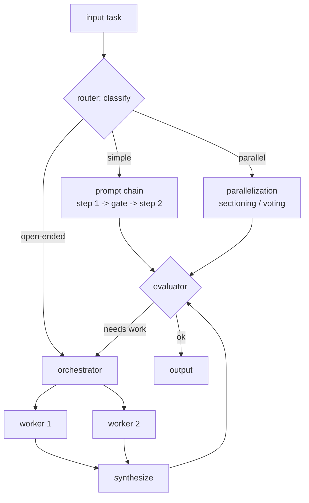
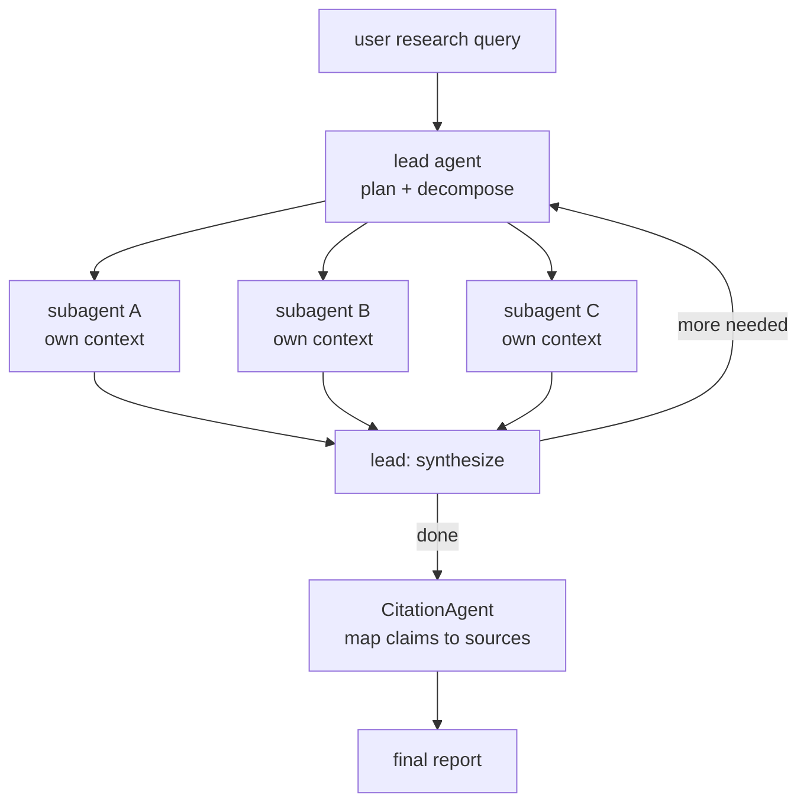
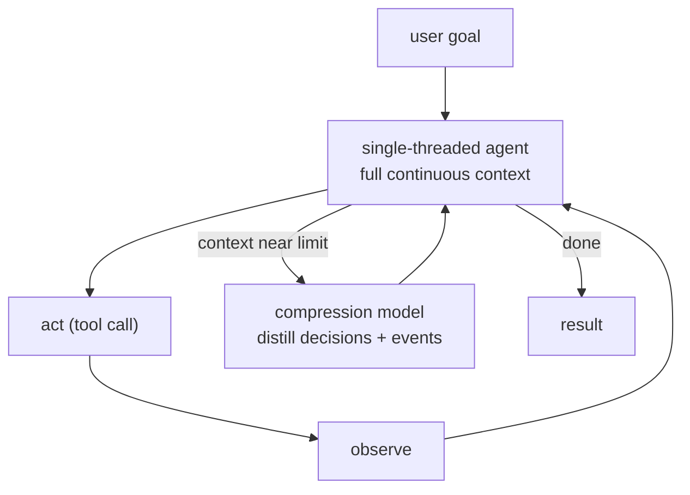
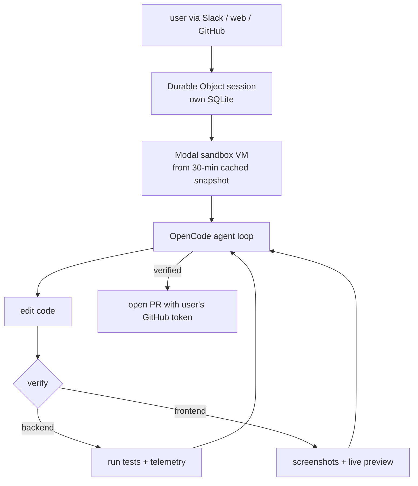
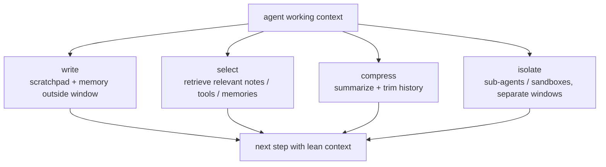
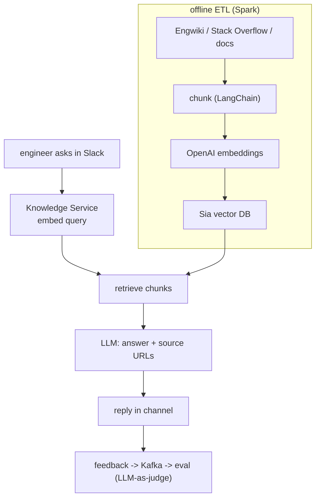
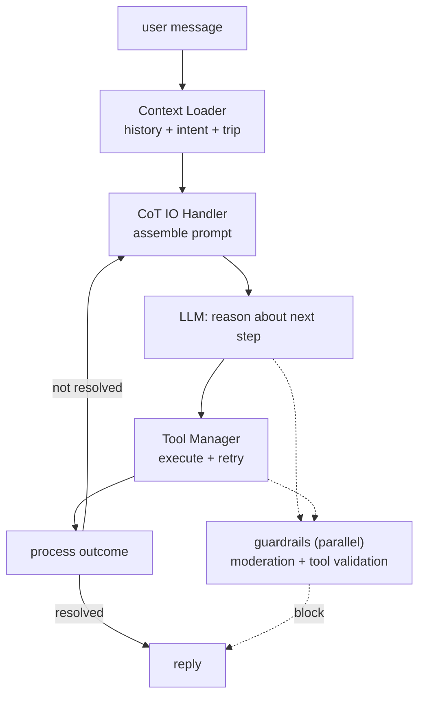
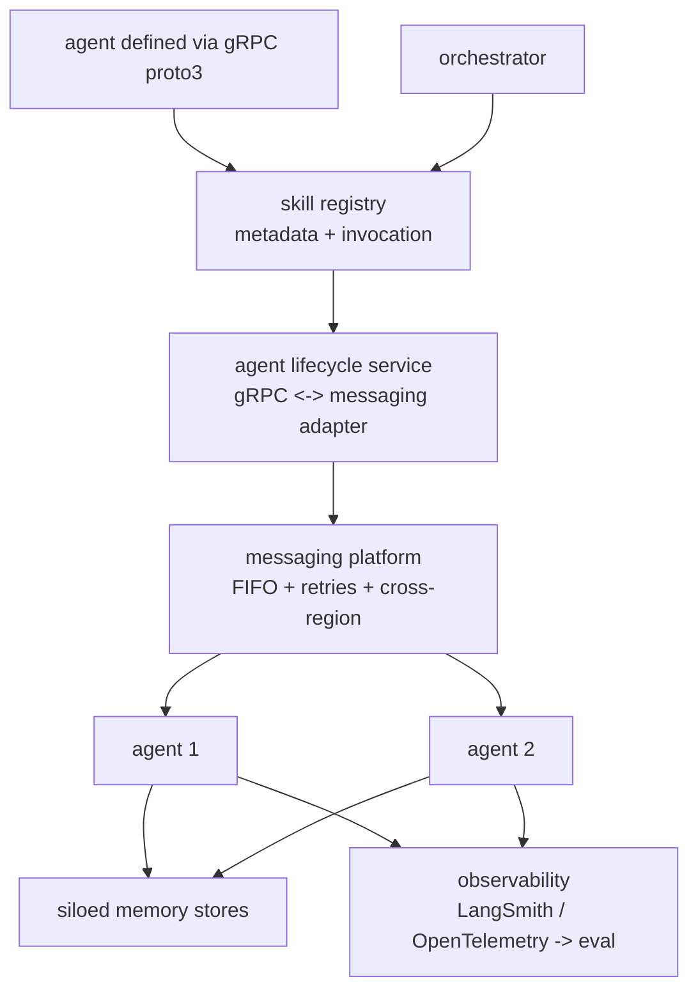

## Agent orchestration

### Anthropic: Building effective agents, five composable orchestration patterns ([source](https://www.anthropic.com/research/building-effective-agents))

Anthropic draws a hard line between workflows (LLMs and tools orchestrated through predefined code paths) and agents (LLMs that dynamically direct their own process and tool use). They recommend starting with the simplest thing that works and only reaching for an autonomous loop when the task genuinely needs it. The writeup catalogs five composable patterns: prompt chaining, routing, parallelization (sectioning and voting), orchestrator-workers, and evaluator-optimizer. They stress that the agent-computer interface (ACI) deserves as much design care as a human-computer interface, with clear tool docs, poka-yoke arguments, and sandboxed testing against explicit success criteria.

**Interview questions this design invites**
- When do you pick a fixed workflow over an autonomous agent, and what signal tips you over?
- How does orchestrator-workers differ from parallelization when both fan out?
- What makes evaluator-optimizer worth the extra calls, and when does it not pay off?
- How do you design a tool so the model cannot misuse it (poka-yoke)?
- Which pattern minimizes latency for a task with independent subtasks?
- How do gates in prompt chaining bound error accumulation across steps?

**Tricks and gotchas**
- Sectioning splits distinct subtasks; voting runs the same task many times for confidence. They look alike but solve different problems.
- Orchestrator subtasks are decided at runtime, not predefined, which is the whole point versus parallelization.
- Evaluator-optimizer only helps when evaluation criteria are crisp enough for an LLM to judge improvement.
- Simplicity first: composing patterns adds calls, latency, and failure surface.

**Common mistakes and how to fix them**
- Reaching for a full agent loop when a chain would do. Fix: default to the least-dynamic pattern that solves it.
- Treating tool docs as an afterthought. Fix: invest in the ACI, add examples, test tool descriptions like prompts.
- Skipping the gate between chain steps. Fix: insert programmatic checkpoints so a bad step does not propagate.
- No sandbox before real tool access. Fix: validate against success criteria in isolation first.

### Anthropic: Multi-agent research system, orchestrator plus parallel subagents ([source](https://www.anthropic.com/engineering/multi-agent-research-system))

A lead agent decomposes a research query, plans an approach using extended thinking, and spawns specialized subagents that search in parallel, each with its own context window. Subagents use interleaved thinking to judge result quality and refine their searches, then return findings to the lead, which synthesizes and decides whether more research is needed. A separate CitationAgent then maps every claim in the report back to its source. The multi-agent shape beat a single agent by 90.2% on their internal eval, but at roughly 15x the tokens of a normal chat, so they gate it behind explicit scaling rules (simple query gets one agent and a few tool calls; complex research gets 10-plus subagents).

**Interview questions this design invites**
- Why give each subagent a separate context window instead of one shared transcript?
- How does the lead agent decide how many subagents to spawn?
- Where does the 15x token cost come from, and when is it justified?
- Why run citation as a separate agent rather than inline in the writer?
- How would you prevent two subagents from redundantly researching the same thing?
- What eval setup lets you claim a 90.2% lift with confidence?

**Tricks and gotchas**
- Parallel fan-out cuts wall-clock latency but multiplies tokens; the win is time, not cost.
- Scaling rules are embedded in the prompt so the lead does not over-spawn on trivial queries.
- Separate context windows keep any one subagent from exhausting the 200k limit.
- Interleaved thinking after tool results is what lets subagents self-correct mid-search.

**Common mistakes and how to fix them**
- Fanning out on every query. Fix: gate multi-agent behind complexity heuristics; single agent for simple asks.
- Letting the lead pass thin instructions to subagents. Fix: give each a clear objective, output format, and boundaries.
- Trusting synthesized claims without provenance. Fix: a dedicated citation pass over the final document.
- Assuming parallel means cheaper. Fix: budget tokens explicitly and cap subagent count.

### Cognition: Don't build multi-agents, single-threaded on purpose ([source](https://cognition.com/blog/dont-build-multi-agents))

Cognition argues that parallel multi-agent systems are fragile in production because subagents make conflicting implicit decisions that the coordinator cannot reconcile. Their two principles: share full context and full agent traces (not just individual messages), and remember that every action carries implicit decisions, so conflicting actions produce incoherent results. A Flappy Bird example shows two subagents building a bird and background in mismatched styles because neither saw the other's choices. Their recommendation is a single-threaded linear agent for most work, and for long tasks a dedicated compression model that distills the history into key decisions and events to stay under the context limit.

**Interview questions this design invites**
- Why do parallel subagents produce conflicting outputs even with the same task text?
- What does share full traces mean beyond copying the original task?
- How does a compression model differ from naive truncation of history?
- When, if ever, would you accept multi-agent fragility for the latency win?
- How do you detect that context compression dropped a load-bearing decision?
- What capability would need to improve before multi-agent collaboration works?

**Tricks and gotchas**
- Copying the task to subagents is not sharing context; the nuance lives in the full trace.
- Conflicts are implicit: no subagent announces its assumption, so the coordinator inherits an impossible merge.
- Compression is a specialized LLM step, not a heuristic trim, so decision coherence survives.
- The argument is about today's models; the author expects it to soften as agents improve.

**Common mistakes and how to fix them**
- Splitting a coherent task across agents for speed. Fix: keep it single-threaded unless context truly cannot hold the job.
- Handing subagents only their slice. Fix: share the full agent trace so decisions stay consistent.
- Letting the transcript overflow. Fix: insert a compression pass that preserves decisions and events.
- Assuming a coordinator can reconcile divergent styles. Fix: prevent divergence upstream, do not patch it downstream.

### Ramp: Inspect background coding agent on sandboxed Modal VMs ([source](https://builders.ramp.com/post/why-we-built-our-background-agent))

Ramp built Inspect so the agent can close the loop on verifying its own work with all the context and tools a Ramp engineer would have. Backend tasks run tests and review telemetry; frontend tasks are visually verified with screenshots and live previews. Sessions run in isolated Modal VMs with a full dev environment, and repo images are pre-built every 30 minutes so sessions launch from cached snapshots instead of cold. OpenCode is the agent backbone, Cloudflare Durable Objects give each session its own SQLite for parallel execution and token streaming, and users drive it from Slack, web, a Chrome extension, or GitHub PRs with multiplayer sessions and per-contributor attribution.

**Interview questions this design invites**
- Why does self-verification matter more than raw model quality for a coding agent?
- What does pre-building repo snapshots every 30 minutes buy you?
- How do per-session SQLite databases enable safe parallel execution?
- Why open PRs with the user's token rather than a service account?
- How would you verify a frontend change automatically and cheaply?
- What isolates one runaway session from affecting others?

**Tricks and gotchas**
- Snapshot caching moves dependency install off the critical path, cutting session start latency.
- The agent is bounded by model intelligence, not missing tools, because the VM has the full toolchain.
- Multiplayer sessions need attribution so changes are traceable to a person.
- Using the user's GitHub token keeps merge authority with humans, not the agent.

**Common mistakes and how to fix them**
- Letting an agent claim done without proof. Fix: give it the tools to test and visually verify, then require it.
- Cold-booting a full dev env per task. Fix: cache repo images on a schedule and launch from snapshot.
- Shared mutable state across sessions. Fix: isolate each session (its own VM and SQLite).
- Auto-merging agent output. Fix: stop at PR, keep a human approval gate.

### LangChain: Context engineering for agents, write / select / compress / isolate ([source](https://www.langchain.com/blog/context-engineering-for-agents))

LangChain frames context engineering as filling the context window with just the right information for the next step, and names four strategies. Write context saves information outside the window (scratchpads within a session, memories across sessions). Select context pulls the relevant pieces back in via retrieval, including using embeddings or a knowledge graph to fetch the right tools out of a large set. Compress context summarizes or trims history, as Claude Code's auto-compact does near the limit, to fight context poisoning and distraction. Isolate context splits work across sub-agents or sandboxes so token-heavy objects and separate subtasks each live in their own window. Together they lower token cost and latency and prevent degradation as context grows.

**Interview questions this design invites**
- What is the difference between writing context and selecting context back in?
- How would you retrieve the right subset of tools when there are hundreds?
- What is context poisoning and which strategy addresses it?
- When does isolation via sub-agents help versus just adding failure surface?
- How do you decide when to compress rather than keep the full transcript?
- Which strategy most directly reduces prefill cost per step, and why?

**Tricks and gotchas**
- Scratchpads are within-session; memories persist across sessions. Do not conflate them.
- Tool selection is itself a retrieval problem once the tool count is large.
- Auto-compact style summarization must preserve decisions, not just recent messages.
- Isolation moves token-heavy blobs (images, audio) out of the window until needed.

**Common mistakes and how to fix them**
- Stuffing everything into one window. Fix: write to external memory and select back only what the step needs.
- Exposing all tools every turn. Fix: retrieve a relevant tool subset per step.
- Truncating oldest messages blindly. Fix: compress with a summarizer that keeps load-bearing facts.
- Over-isolating into many agents. Fix: isolate only when one context genuinely cannot hold the job.

### Uber: Genie, an on-call RAG copilot in Slack ([source](https://www.uber.com/en-US/blog/genie-ubers-gen-ai-on-call-copilot/))

Genie answers roughly 45,000 on-call questions a month across Uber Slack channels using retrieval-augmented generation rather than fine-tuning, to ship fast. An offline ETL built on Spark scrapes internal sources (Engwiki, Stack Overflow, engineering docs), chunks them with LangChain, embeds with OpenAI embeddings, and stores vectors in Sia, Uber's in-house vector database. At serving time a Knowledge Service embeds the user question, retrieves relevant chunks, feeds them as context to the LLM, and returns an answer with source URLs attached to curb hallucination. User feedback (Resolved / Helpful / Not Helpful / Not Relevant) flows through Kafka into eval pipelines with LLM-as-judge scoring for hallucination, relevancy, and document quality.

**Interview questions this design invites**
- Why choose RAG over fine-tuning for an internal-docs copilot?
- How do source URLs on every answer reduce hallucination risk?
- What keeps sensitive internal data from leaking into answers?
- How do you turn thumbs-up/down signals into a real eval loop?
- How would you keep the vector index fresh as docs change daily?
- What does a 48.9% helpfulness rate tell you, and how would you raise it?

**Tricks and gotchas**
- Citations are a product feature and a safety mechanism at once; they let engineers verify.
- Pre-curating widely-accessible sources sidesteps most data-leakage risk before retrieval.
- LLM-as-judge scores hallucination and relevancy so eval scales past manual review.
- Serving in Slack meets engineers where they already ask, driving adoption.

**Common mistakes and how to fix them**
- Answering without provenance. Fix: require the LLM to cite source URLs for every response.
- Indexing sensitive or stale docs. Fix: restrict ingestion to curated, accessible sources and refresh on a schedule.
- No feedback capture. Fix: wire in-channel reactions to a metrics pipeline (Kafka) and eval jobs.
- Treating helpfulness rate as fixed. Fix: use per-answer eval signals to target retrieval and prompt fixes.

### Airbnb: Automation Platform v2, an LLM reasoning engine with CoT tool orchestration ([source](https://medium.com/airbnb-engineering/automation-platform-v2-improving-conversational-ai-at-airbnb-d86c9386e0cb))

Airbnb's v1 ran predefined step-by-step workflows that were inflexible and hard to scale. v2 puts an LLM at the center as the decision-maker while keeping a hybrid design because production still needs low latency and hallucination control. A chain-of-thought engine loops: assemble context and prompt, ask the LLM to reason about the next step, execute the chosen tool or workflow, process the outcome, and repeat until resolution. Supporting pieces include a CoT IO Handler for prompt assembly and preprocessing, a Tool Manager with retry logic, an LLM Adapter for model portability, and a Context Loader pulling history, intent, and trip details. A guardrails layer runs content moderation and tool-validation checks in parallel to catch hallucination and jailbreak attempts.

**Interview questions this design invites**
- Why keep a hybrid of workflows and LLM reasoning instead of going fully agentic?
- Where do guardrails sit so they can block a bad tool call before it runs?
- Why does the Tool Manager own retry logic instead of the LLM?
- What does the LLM Adapter buy you across model vendors?
- How do you bound the CoT loop so it does not run forever?
- How would you keep latency acceptable when each turn is multi-step?

**Tricks and gotchas**
- CoT here is a control loop, not a single prompt: reason, act, observe, repeat.
- Guardrails run in parallel so safety checks do not serialize onto the critical path.
- The Context Loader is what grounds decisions in trip and intent data, not generic memory.
- Keeping v1 workflows for known shapes avoids paying LLM cost where determinism is fine.

**Common mistakes and how to fix them**
- Ripping out all deterministic workflows at once. Fix: hybrid, let the LLM orchestrate but keep workflows for fixed paths.
- Putting retries in the prompt. Fix: handle retry and backoff in the Tool Manager, deterministically.
- Hard-coding one model vendor. Fix: an LLM Adapter layer so models are swappable.
- Trusting the model to police itself. Fix: an independent guardrails layer that can block moderation and tool violations.

### LinkedIn: GenAI tech stack extended for multi-agent orchestration ([source](https://www.linkedin.com/blog/engineering/generative-ai/the-linkedin-generative-ai-application-tech-stack-extending-to-build-ai-agents))

LinkedIn extended its existing GenAI platform to build agents by reusing its messaging infrastructure rather than writing orchestration from scratch. Agents are defined with a standard gRPC proto3 schema and registered in a skill registry, a central service that tracks available agents, their metadata, and how to invoke them for discovery. Orchestration rides on the messaging platform, which gives FIFO delivery, message-history lookup, persistent retries, and cross-region scale; an agent lifecycle service adapts between the gRPC contracts and the messaging layer. Agent-to-agent communication supports synchronous streaming, incremental responses, and async messaging. Memory is siloed by design for privacy, and observability spans LangSmith tracing pre-production and OpenTelemetry in production, linked to eval datasets.

**Interview questions this design invites**
- Why reuse a messaging platform for agent orchestration instead of a new bus?
- What does a skill registry solve that hard-coded agent calls do not?
- Why sit an agent lifecycle service between gRPC contracts and messaging?
- How do FIFO delivery and persistent retries change agent reliability?
- Why silo memory stores by design, and what does policy-driven sharing look like?
- How does linking OpenTelemetry spans to eval datasets close the loop?

**Tricks and gotchas**
- Messaging FIFO plus retries gives durability that a naive request/response loop lacks.
- The registry makes agents discoverable and invocable in a standard way, enabling composition.
- Different response modes (streaming, incremental, async) fit different client needs on one substrate.
- Pre-production tracing and production telemetry are different tools serving one eval story.

**Common mistakes and how to fix them**
- Building bespoke orchestration plumbing. Fix: reuse battle-tested messaging infra for delivery and retries.
- Wiring agents point-to-point. Fix: a registry so agents are discovered and invoked by contract.
- Sharing one memory pool across agents. Fix: silo stores by design with explicit policy-driven sharing.
- Observability only in prod. Fix: trace in pre-production too and link spans to eval datasets.

_Not reachable: OpenAI, A practical guide to building agents (PDF returned as binary)_
