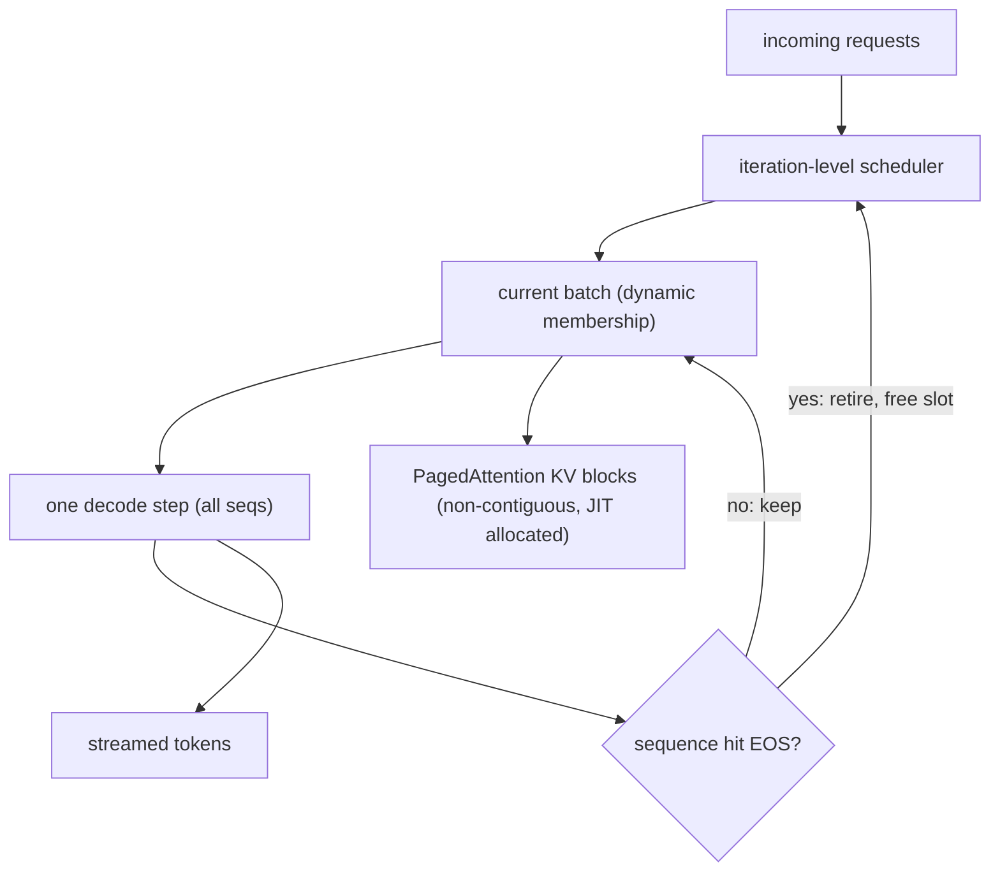
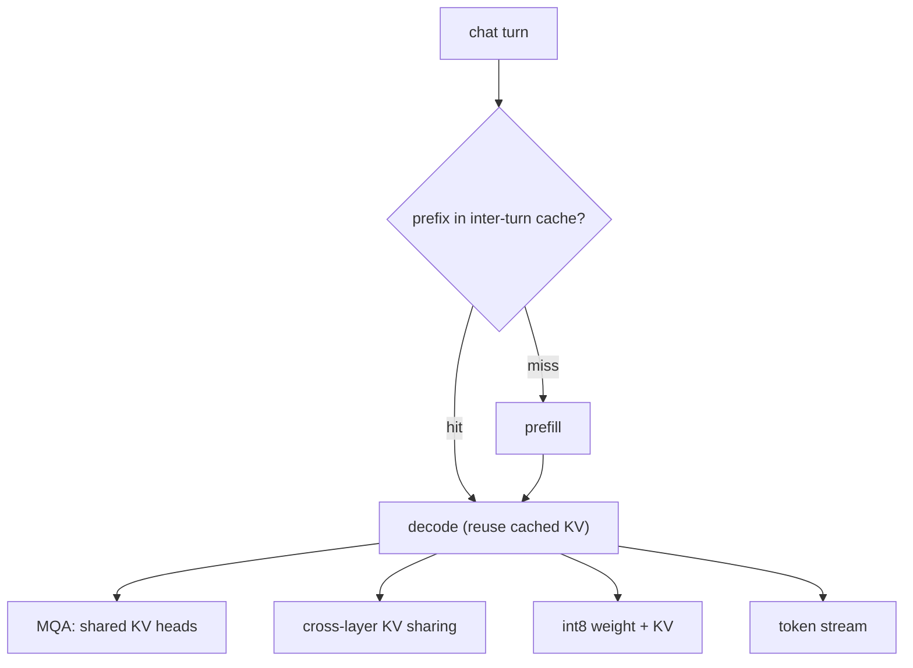
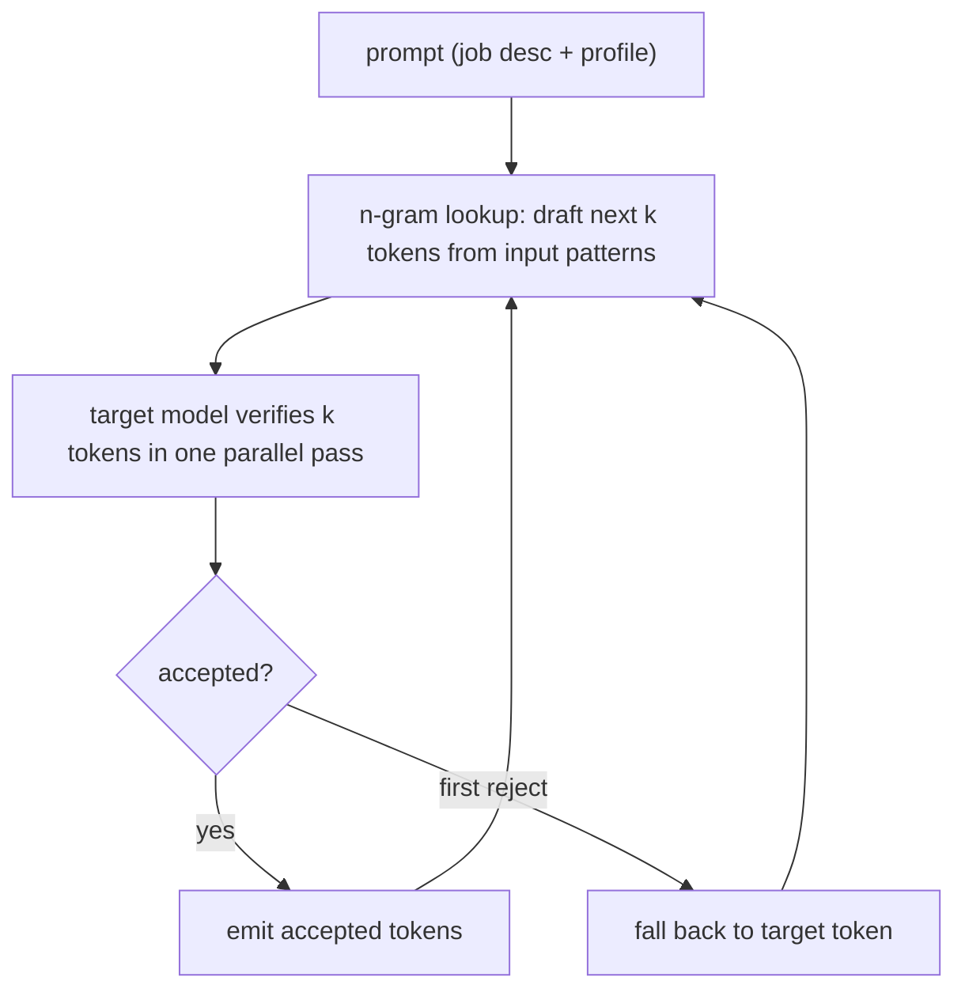
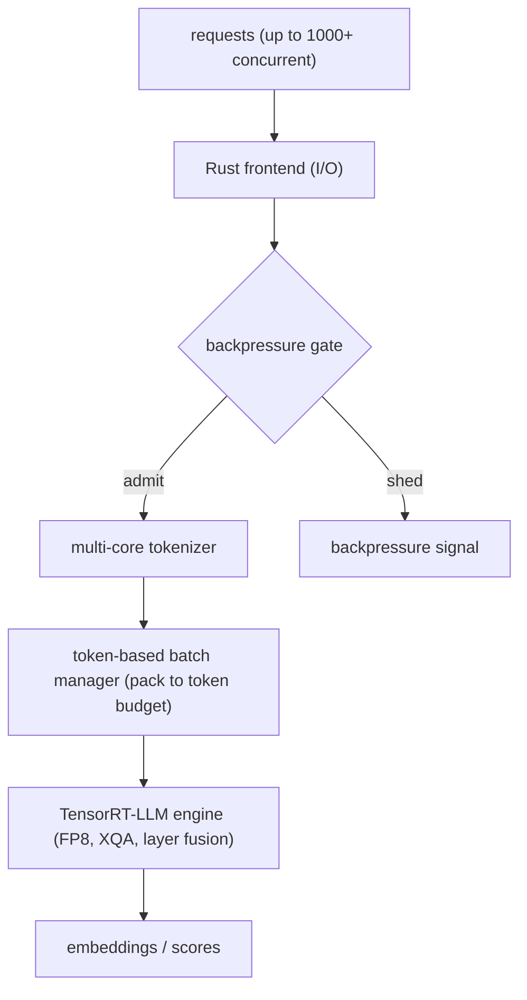
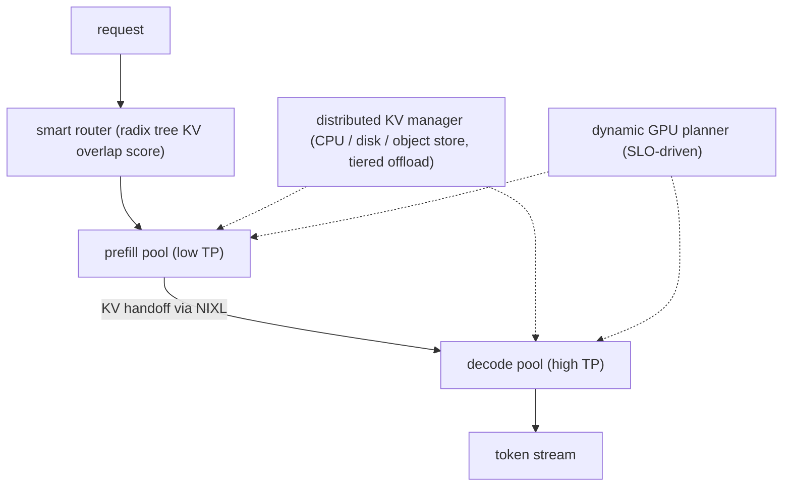
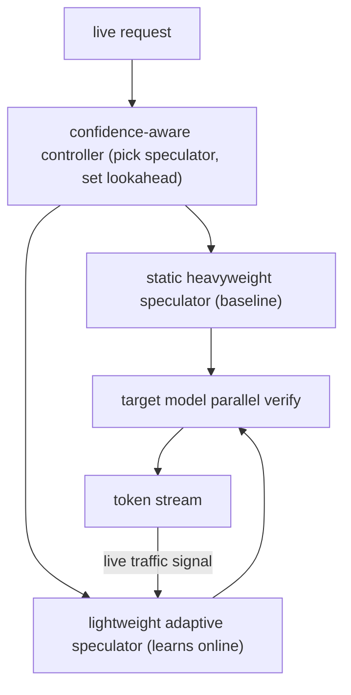
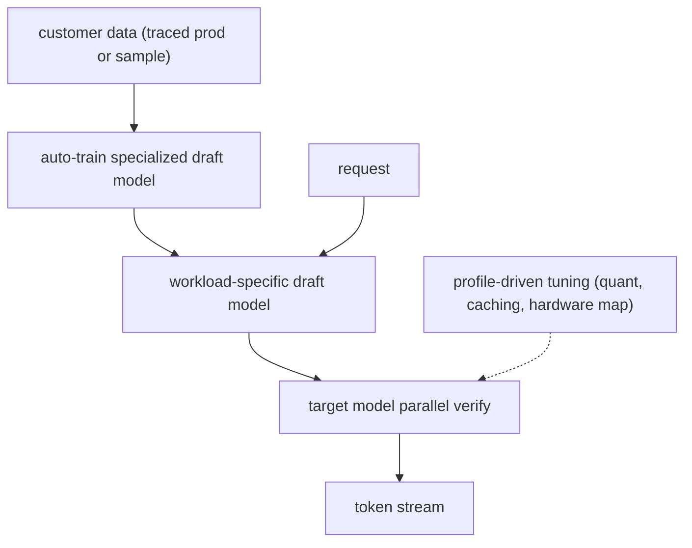
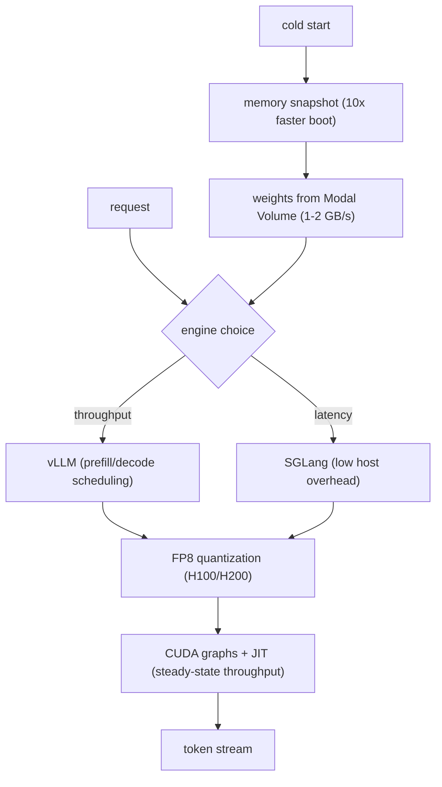

## Inference serving at scale

### Anyscale (vLLM): continuous batching plus PagedAttention for 23x throughput ([source](https://www.anyscale.com/blog/continuous-batching-llm-inference))

Anyscale shows that the throughput wall in LLM serving is static batching, where the whole batch is held hostage by its longest-generating member and the GPU idles as members finish. Continuous batching schedules at the iteration level: when a sequence emits its end-of-sequence token, its slot is freed immediately and a waiting request is admitted. vLLM stacks PagedAttention on top, allocating the KV cache in fixed-size blocks instead of one contiguous buffer, cutting memory waste under 4 percent. On Meta OPT-13B on an A100-40GB, the ladder runs naive static batching at baseline, FasterTransformer at 4x, plain continuous batching at 8x, and vLLM at 23x, with the biggest wins when output lengths vary a lot.

**Interview questions this design invites**
- Why does static batching leave the GPU idle, and how does iteration-level scheduling fix it?
- What problem does PagedAttention solve that continuous batching alone does not?
- Why do high-variance output lengths produce the biggest throughput gain?
- How does block-based KV allocation drive memory waste below 4 percent?
- Where does the waiting_served_ratio knob trade prefill against decode?
- What is the throughput ceiling once the KV cache, not compute, is the bottleneck?

**Tricks and gotchas**
- The 23x is versus naive static batching; the honest comparison against optimized static (FasterTransformer) is closer to 5-6x.
- PagedAttention needs a custom attention kernel; you cannot just bolt it onto a stock attention path.
- Admitting a new sequence still consumes KV blocks, so a full batch can OOM if you do not reserve cache budget.
- Gains are workload-shaped: uniform short outputs see far less than high-variance chat traffic.

**Common mistakes and how to fix them**
- Claiming continuous batching alone gives 23x; separate the scheduling win (8x) from the PagedAttention memory win.
- Assuming bigger batches always help; past the KV-cache limit you thrash, so size batches to the cache budget.
- Forgetting prefill interference; a long prompt still stalls the batch step, so add chunked prefill.
- Treating PagedAttention as free; the block table and kernel add bookkeeping you must account for.

### Character.AI: MQA, cross-layer KV sharing, and int8 for 13.5x cheaper serving ([source](https://blog.character.ai/optimizing-ai-inference-at-character-ai/))

Character.AI serves consumer chat at roughly 20,000 queries per second, about 20 percent of Google Search volume, at under one cent per conversation hour. They attack the KV cache directly: multi-query attention collapses the KV heads, cross-layer KV sharing reuses cache across layers, and int8 quantization shrinks the bytes read per decode step. Inter-turn caching keeps a conversation's prefix resident across turns so repeated chat context is not recomputed. The combined result is serving cost cut at least 33x since 2022 launch and about 13.5x cheaper than using leading commercial APIs. The public post emphasizes the economics; the named attention and quantization details live in their companion technical writeup.

**Interview questions this design invites**
- How does multi-query attention shrink the KV cache, and what quality risk does it carry?
- What is cross-layer KV sharing and why is it safe to reuse cache across layers?
- Why is inter-turn (prefix) caching especially valuable for a chat product?
- How does int8 quantization convert to serving cost, given decode is bandwidth-bound?
- What does 20,000 QPS at under a cent per hour imply about batch sizes per GPU?
- Where does aggressive KV reduction start to hurt output quality?

**Tricks and gotchas**
- MQA and cross-layer sharing both trade model expressivity for cache size; they must be trained in, not switched on at serving.
- The 13.5x is versus commercial APIs, a different baseline than versus their own earlier stack (33x).
- Inter-turn caching needs sticky routing so a returning turn lands on the GPU holding its prefix.
- int8 is only a win if kernels actually read fewer bytes; a dequant-on-load path can erase it.

**Common mistakes and how to fix them**
- Conflating MQA with GQA; state that MQA is the extreme (one KV head) and GQA is the tunable middle.
- Assuming prefix caching is automatic; it requires cache-aware routing and eviction policy.
- Quoting the cost multiple without the baseline; always say versus what.
- Ignoring quality gating; every KV or precision cut goes behind an eval before it ships.

### LinkedIn: n-gram speculative decoding for 4x throughput and 66 percent lower P90 ([source](https://www.linkedin.com/blog/engineering/ai/accelerating-llm-inference-with-speculative-decoding-lessons-from-linkedins-hiring-assistant))

LinkedIn's Hiring Assistant emits text that quotes job descriptions and candidate profiles verbatim, so its output is highly predictable from the prompt. They exploit this with n-gram (prompt-lookup) speculative decoding: instead of hosting a separate draft model, they draft the next few tokens straight from patterns already in the input, then verify them in one parallel pass on the target model. Because scoring several tokens costs about the same as scoring one, high acceptance turns into real speed. They report nearly 4x throughput at the same QPS and latency ceiling and a 66 percent average reduction in P90 end-to-end latency, with no quality loss. It runs on their vLLM stack tuned with num_speculative_tokens, prompt_lookup_max, and prompt_lookup_min.

**Interview questions this design invites**
- Why does n-gram drafting need no separate draft model, and what does it give up?
- What property of the Hiring Assistant workload makes acceptance rate high?
- Why is verifying k tokens roughly as cheap as verifying one?
- How do prompt_lookup_min and prompt_lookup_max trade acceptance against draft waste?
- Why report both throughput (4x) and P90 latency (66 percent) rather than one number?
- When would n-gram speculation actively hurt, and how would you detect it?

**Tricks and gotchas**
- Prompt-lookup only wins when output echoes the prompt; free-form creative generation kills acceptance.
- Setting num_speculative_tokens too high wastes verification compute when drafts miss.
- The latency win concentrates at low-to-moderate batch sizes; at very large batches the GPU is already saturated.
- prompt_lookup_min too low triggers speculation on weak matches, dragging acceptance down.

**Common mistakes and how to fix them**
- Believing speculation changes outputs; correct verification preserves the target distribution exactly, so measure parity.
- Tuning one knob in isolation; min, max, and num_speculative_tokens interact and must be swept together.
- Assuming the technique generalizes; validate acceptance rate per workload before enabling it.
- Enabling it at huge batch sizes; measure that verification overhead does not outweigh the saved steps.

### Baseten (BEI): batching, backpressure, FP8, and TensorRT-LLM for 2x embedding throughput ([source](https://www.baseten.co/blog/how-we-built-bei-high-throughput-embedding-inference/))

Baseten built BEI, a runtime for embedding, reranker, and classifier models, reaching up to 2.05x throughput over vLLM and TEI. The core is NVIDIA TensorRT-LLM (XQA attention, layer fusion) for at least a 15 percent speedup, plus FP8 on H100 for 50 percent-plus more throughput while retaining over 99 percent cosine similarity to the unquantized outputs. The server is four parts: a Rust frontend for I/O, a multi-core tokenizer, a token-based batch manager that packs to a token budget rather than a request count (so variable inputs up to 32K tokens do not OOM), and the C++ TensorRT-LLM engine. Backpressure plus Baseten's traffic-based autoscaling lets it hold 1000-plus concurrent connections.

**Interview questions this design invites**
- Why pack a batch by token budget rather than request count for variable-length inputs?
- How does FP8 give 50 percent throughput while keeping over 99 percent output similarity?
- What role does backpressure play when 1000-plus clients connect at once?
- Why put the frontend in Rust and the engine in C++ rather than one runtime?
- How do XQA and layer fusion contribute the base 15 percent speedup?
- What is different about serving embeddings/rerankers versus autoregressive decode?

**Tricks and gotchas**
- Embedding inference is prefill-only (no decode loop), so the batching math differs from chat serving.
- Token-based packing prevents OOM but needs a max-token cap sized to the 32K input ceiling.
- FP8 must be quality-gated per model; cosine similarity over 99 percent is the eval bar, not an assumption.
- Backpressure without a clear client retry signal just moves the collapse to the caller.

**Common mistakes and how to fix them**
- Batching by request count; switch to token budgets so a few 32K inputs cannot blow memory.
- Assuming a decode-oriented stack fits embeddings; strip the decode loop and optimize the single forward pass.
- Shipping FP8 blind; verify cosine similarity against bf16 before enabling.
- Ignoring the frontend cost; a slow tokenizer or I/O layer caps throughput before the GPU does.

### NVIDIA Dynamo: disaggregated prefill/decode with a KV-aware smart router ([source](https://developer.nvidia.com/blog/introducing-nvidia-dynamo-a-low-latency-distributed-inference-framework-for-scaling-reasoning-ai-models/))

Dynamo is an open-source distributed serving framework built for reasoning models, reporting up to 30x throughput on DeepSeek-R1 671B on GB200 NVL72 and 2x-plus on Llama 70B on Hopper. It disaggregates prefill (compute-bound, low tensor parallelism) from decode (memory-bound, high tensor parallelism) so each phase gets its own parallelism. A Smart Router tracks KV cache across the fleet with a radix tree, scoring prefix overlap to route a request to the worker that already holds the most relevant blocks and minimize recompute. A distributed KV cache manager offloads cold blocks to CPU memory, local disk, or networked object storage (up to petabytes cheaply), a Dynamic GPU Planner shifts capacity between prefill and decode against the SLO, and NIXL provides a uniform data-movement API across the memory tiers.

**Interview questions this design invites**
- Why give prefill low tensor parallelism and decode high tensor parallelism?
- How does a radix tree over KV blocks let the router cut recompute?
- What does the KV handoff cost, and why does it need NIXL / a fast fabric?
- When does disaggregation pay off versus a single pool with chunked prefill?
- How does the Dynamic GPU Planner decide to move a GPU from prefill to decode?
- Why is tiered KV offload (CPU/disk/object) worth petabytes of cheap storage?

**Tricks and gotchas**
- Disaggregation only wins if the prefill-to-decode transfer rides fast interconnect; a slow link becomes the new bottleneck.
- Phase-specific parallelism means two engine configs to tune and keep in sync, not one.
- The 30x headline is on Blackwell NVL72 with fast fabric; commodity nodes will not reproduce it.
- Router prefix scoring helps only when traffic shares prefixes (system prompts, shared docs).

**Common mistakes and how to fix them**
- Disaggregating a small model at moderate QPS; a single pool with chunked prefill is simpler and usually enough.
- Ignoring transfer latency; size the interconnect first or the hand-off eats the win.
- Static prefill/decode split; use an SLO-driven planner so a decode-heavy shift does not starve one pool.
- Offloading hot KV to slow storage; keep active sequences on GPU and only tier cold blocks.

### Together AI (ATLAS): runtime-learning speculative decoding that adapts to live traffic ([source](https://www.together.ai/blog/adaptive-learning-speculator-system-atlas))

ATLAS keeps the speculative-decoding speedup from degrading when traffic drifts. It pairs a static heavyweight speculator that gives a consistent baseline on any workload with a lightweight adaptive speculator that learns from live traffic in real time, and a confidence-aware controller picks between them and tunes lookahead depth, drafting further when confidence is high and pulling back when it drops. Built on Together Turbo, it reports up to 500 TPS on DeepSeek-V3.1 and 460 TPS on Kimi-K2, roughly 4x baseline with no manual configuration, and a 401 percent speedup over the FP8 baseline on DeepSeek (105 to 501 TPS at batch size 1 on 4 B200 GPUs). Because it learns online, it specializes to the current session, for example a specific code file during a development session.

**Interview questions this design invites**
- Why does a static speculator lose acceptance as the workload drifts?
- How does the controller decide between the static and adaptive speculators?
- What signal trains the adaptive speculator online, and what is the feedback loop risk?
- Why does lookahead depth need to track confidence rather than stay fixed?
- How does online specialization help a long coding session specifically?
- What is the baseline behind the 401 percent number (FP8, batch 1, 4 B200)?

**Tricks and gotchas**
- Online learning adds a training loop on the serving path; it must not stall decode.
- Adaptive gains are session-shaped; a cold or highly varied stream sees less than a focused one.
- The big multiples are at batch size 1; at high batch the GPU is already saturated and speculation helps less.
- A confidently wrong adaptive speculator wastes verification, so the confidence estimate itself must be calibrated.

**Common mistakes and how to fix them**
- Assuming a once-trained speculator stays optimal; measure acceptance over time and adapt if it decays.
- Reporting batch-1 speedups as fleet throughput; separate latency wins from aggregate throughput.
- Letting the adaptive model overfit a session and hurt the next; keep the static baseline as a floor.
- Skipping output-parity checks; adaptation changes drafts, never the verified distribution, so prove it.

### Fireworks AI (FireOptimizer): adaptive speculative execution with workload-trained draft models ([source](https://fireworks.ai/blog/fireoptimizer))

FireOptimizer is Fireworks' adaptation engine that tailors inference to a customer's specific traffic, with adaptive speculative execution as the headline giving up to 3x lower latency. Rather than a generic draft model, it automatically trains and deploys a draft model on the customer's own data (traced production traffic or a sample set), because the higher the draft hit rate the larger the latency win. Their case study is the sharp lesson: a generic draft model hit only 29 percent and actually slowed inference 1.5x, while the specialized draft reached 76 percent and delivered a 2x speedup. Beyond speculation it layers customizable quantization, adaptive caching, and hardware mapping, all profile-driven with no manual hyperparameter tuning, currently on enterprise reserved deployments.

**Interview questions this design invites**
- Why does a customized draft model beat a generic one on latency?
- How can a bad draft model (29 percent hit) make inference slower, not faster?
- What hit rate is the rough break-even where speculation starts paying off?
- Why train the draft on traced production data rather than a public corpus?
- How do quantization, caching, and hardware mapping compose with speculation?
- What deployment shape (reserved vs on-demand) does per-workload training imply?

**Tricks and gotchas**
- A low-acceptance draft is net-negative: you pay draft compute and still fall back, so measure before shipping.
- Training on production traces raises data-handling and privacy questions you must answer.
- The 3x is a ceiling; the realized number tracks the customer's actual hit rate.
- Per-workload draft models mean one model per customer to train, deploy, and keep fresh as traffic drifts.

**Common mistakes and how to fix them**
- Reusing one generic draft across workloads; specialize per workload or acceptance collapses.
- Ignoring the slowdown risk; gate any draft behind a measured hit rate before enabling.
- Treating the draft as static; retrain as the customer's traffic distribution shifts.
- Stacking quant and speculation without eval; verify quality after each layer, not just the final stack.

### Modal: engine choice, quantization, CUDA graphs, and snapshots for throughput ([source](https://modal.com/docs/guide/high-performance-llm-inference))

Modal's guide is the serverless-serving angle: pick the engine to the workload (vLLM for throughput thanks to its prefill/decode scheduling, SGLang for latency-sensitive decode because of lower host overhead), then tune precision and cold starts. FP8 on H100/H200 is the default precision win while immature FP4 is avoided, and for cold-start-bound cases aggressive quantization (even integer or ternary) helps by shrinking bytes to load even when it does not speed inference. CUDA graph capture and JIT compilation raise steady-state throughput but are tricky to cache and add tens of seconds per boot. Modal's headline lever is Memory Snapshots, which serialize a warmed container (GPU snapshots claim 10x cold-start reduction), backed by loading weights from Modal Volumes at 1-2 GB/s, roughly a second per gigabyte.

**Interview questions this design invites**
- When do you pick vLLM over SGLang, and what property drives the choice?
- Why can aggressive quantization help cold starts even without a decode speedup?
- What is the tradeoff of CUDA graphs and JIT: throughput up, but what cost?
- How do memory snapshots cut cold-start time by roughly 10x?
- Why does weight-load bandwidth (1-2 GB/s) set a floor on boot time?
- On serverless GPU, when is scale-to-zero acceptable and when is it not?

**Tricks and gotchas**
- CUDA graphs and JIT are hard to cache, so their throughput win can be undone by boot-time penalties on a spiky workload.
- Snapshotting a warmed process needs code changes to the inference server; it is not transparent.
- Weight load is bandwidth-bound at about a second per gigabyte, so a multi-GB model still costs real seconds even snapshotted.
- FP4 support is immature; reaching for it early buys instability, not speed.

**Common mistakes and how to fix them**
- Enabling CUDA graphs on a scale-to-zero hot path; measure boot cost, or keep a warm buffer instead.
- Using scale-to-zero for latency-sensitive traffic; reserve it for cold, rarely-used models.
- Assuming one engine fits all; match vLLM/SGLang to the throughput-vs-latency SLO.
- Ignoring weight-load bandwidth in the cold-start budget; stream from a fast Volume and size the model down.

_Not reachable: none_
