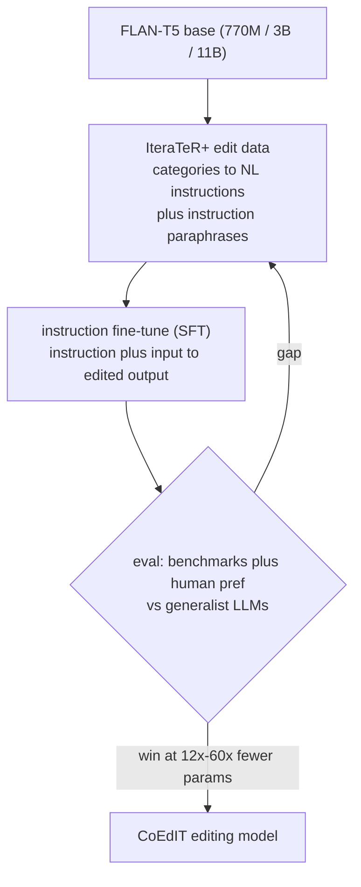
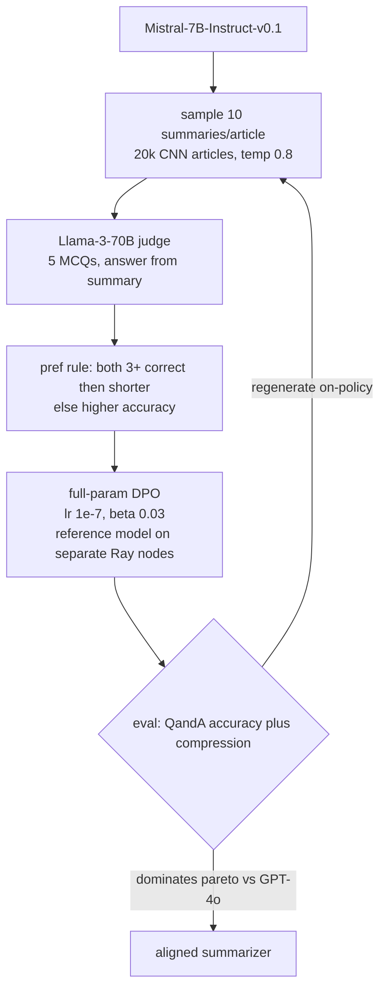
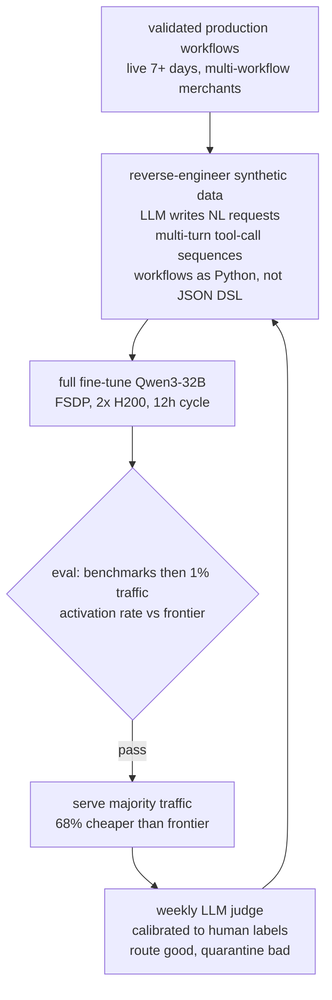
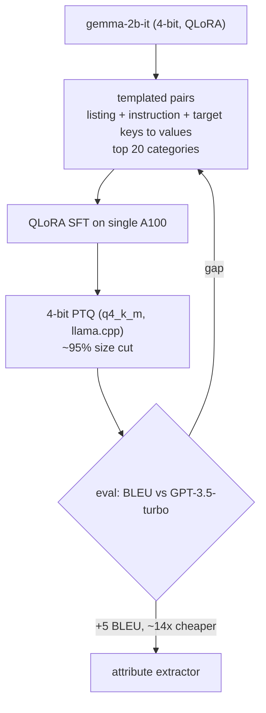
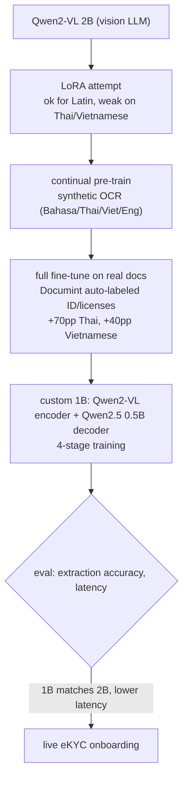
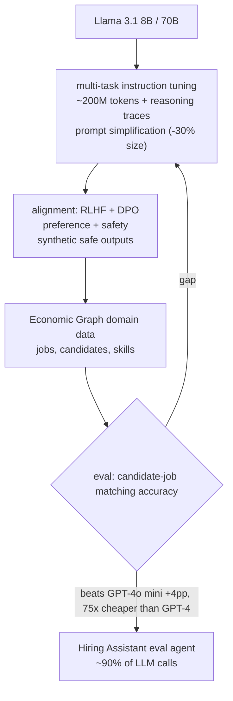
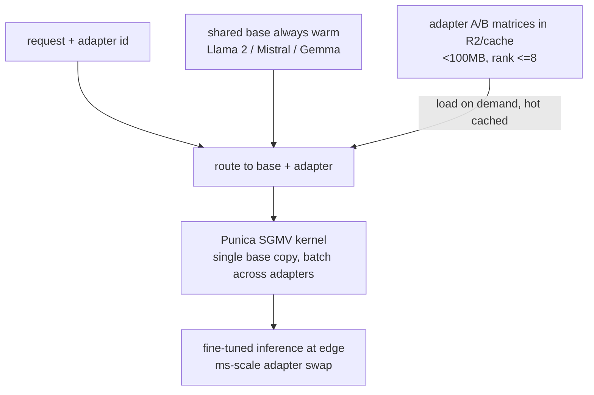
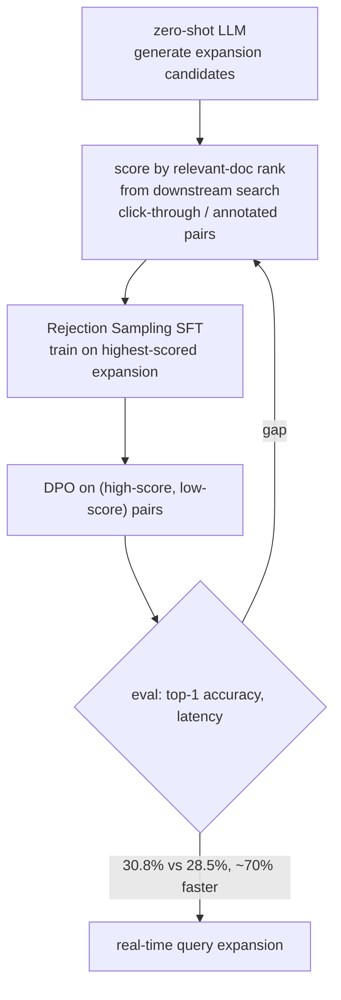

## Post-training pipeline

### Grammarly: CoEdIT, task-specific instruction tuning that beats generalists at a fraction of the params ([source](https://www.grammarly.com/blog/engineering/coedit-text-editing/))

CoEdIT fine-tunes FLAN-T5 (L 770M, XL 3B, XXL 11B) purely with instruction tuning on a dense text-editing dataset. The team took the IteraTeR+ edit corpus, translated its edit categories (Fluency, Coherence, Clarity, Style) into natural-language instructions, and added instruction paraphrases so the model handles varied phrasings of the same intent. No preference tuning is used; SFT alone carries it. Human evaluators preferred CoEdIT-XL (3B) over GPT3-Edit (175B) 64% of the time versus 10%, and CoEdIT-L beats larger instruction-tuned baselines at 12x to 60x fewer parameters while generalizing to unseen adjacent tasks like sentence compression and politeness transfer.

**Interview questions this design invites**
- Why does a dense, single-domain instruction set let a 3B model beat a 175B generalist on editing?
- How do you turn an edit-category taxonomy into instruction data without overfitting to phrasing?
- What role do instruction paraphrases play, and what breaks if you omit them?
- How would you measure "meaning preservation" in an edit task beyond automated metrics?
- When does the small-model-plus-narrow-data bet stop paying off?
- Why choose an encoder-decoder (T5) base for editing rather than a decoder-only LLM?

**Tricks and gotchas**
- Editing is a behavior/format skill, not a knowledge gap, so SFT alone is the correct and sufficient lever.
- Paraphrasing instructions is what buys robustness to real user phrasing; the model learns the template as hard as the content.
- Human preference eval matters here because automated editing metrics under-credit fluency and tone.
- Generalization to adjacent tasks is a signal the model learned the edit operation, not memorized the dataset.

**Common mistakes and how to fix them**
- Reaching for a giant generalist when a small tuned model wins: match model scale to a narrow task and tune it.
- Training on one instruction phrasing per task: add paraphrases so production wording does not fall out of distribution.
- Trusting only benchmark scores: add human pairwise preference to catch meaning-preservation regressions.
- Assuming preference tuning is needed: for a bounded edit task, well-curated SFT is the whole job.

### Anyscale: iterative DPO on synthetic preferences with a judge-aligned objective ([source](https://www.anyscale.com/blog/direct-preference-optimization-with-synthetic-data))

Starting from the weak Mistral-7B-Instruct-v0.1, Anyscale skips heavy human labeling and manufactures preferences: sample 10 summaries per article across 20,000 CNN articles at temperature 0.8, then use Llama-3-70B as an LLM judge that writes five multiple-choice questions per article and answers them from each summary alone. The preference rule ("if both summaries answer 3 or more questions correctly, prefer the shorter one, else prefer the more accurate") makes the training signal identical to the eval axis. Full-parameter DPO (learning rate 1e-7, beta 0.03) beat LoRA rank 64, which drifted out of distribution; a second on-policy round regenerating data with the improved model added a 10-plus-percent win-rate boost. Ray runs the frozen reference model on separate nodes (A10G) from the training GPUs (A100) so reference scoring does not idle training hardware.

**Interview questions this design invites**
- Why does aligning the preference rule to the eval metric matter, and how could it backfire?
- Why did full fine-tune beat LoRA rank 64 for DPO here when LoRA usually suffices?
- What does the beta parameter control in DPO, and why is 0.03 low?
- Why run the reference model on separate nodes, and what does that cost or save?
- What makes a second on-policy DPO round help, and when does iterating stop helping?
- How do you trust an LLM judge as both label source and evaluator without circularity?

**Tricks and gotchas**
- LLM-as-judge replaces human preference labels, but training and eval sharing the judge risks optimizing the judge, not real quality.
- Tiny learning rates (1e-7) are load-bearing for DPO stability; too high yields gibberish and off-topic drift.
- LoRA's constrained parameter space pushed problematic token likelihoods up, causing out-of-distribution outputs.
- Decoupling reference-model scoring onto cheaper GPUs removes idle time on the expensive training node.
- On-policy iteration mimics production multi-round DPO (Llama 3.1 style) but needs stability checks each round.

**Common mistakes and how to fix them**
- Assuming LoRA always matches full fine-tune: for preference tuning on a weak base, validate against full fine-tune before committing.
- Setting an aggressive DPO learning rate: keep it very small and watch for OOD generation.
- SFT on chosen-only data and expecting DPO-level gains: chosen-only discards the rejected-sample signal.
- Reusing one judge for labels and eval without a human-anchored check: periodically calibrate the judge to humans.

### Shopify: a fine-tuned Qwen3-32B Flow agent with a weekly LLM-judge retraining flywheel ([source](https://shopify.engineering/fine-tuning-agent-shopify-flow))

Shopify full-fine-tunes Qwen3-32B with FSDP across two H200 nodes (a 12-hour cycle, enabling weekly retrains). With no pre-launch production conversations, they reverse-engineered training data: sample validated production workflows (live 7-plus days, from merchants with multiple workflows), use stronger LLMs to write plausible natural-language requests, and build multi-turn tool-call sequences of ideal behavior. The key move was representing workflows in Python rather than Flow's native JSON DSL, shifting the task in-distribution and lifting syntactic correctness 22 points and semantic correctness 13 points on identical data. A 1% deployment exposed a 35% activation-rate gap versus synthetic scores, which the flywheel closes: an LLM judge calibrated to human labels and activation rates scores production conversations, routes good ones into training and quarantines bad ones, and retrains weekly. The agent now serves most traffic at 68% lower cost than the frontier model it replaced.

**Interview questions this design invites**
- Why does representing workflows as Python instead of the native JSON DSL move the task in-distribution?
- How do you bootstrap training data for an agent with zero pre-launch production conversations?
- Why did offline benchmarks look ready while 1% traffic showed a 35% activation gap?
- How do you calibrate an LLM judge to human labels and to a product metric like activation rate?
- What quality filters keep the weekly flywheel from ingesting bad conversations?
- Why full fine-tune a 32B model here instead of LoRA?

**Tricks and gotchas**
- Output-format representation (Python vs JSON DSL) can matter more than data volume for correctness.
- The model is sensitive to formatting minutiae: tool naming, ordering, JSON field order, system-prompt alignment; training must mirror production exactly.
- Offline eval overstates readiness; a small live slice is the real gate.
- The flywheel's quarantine step is what prevents low-quality production data from poisoning the next model.

**Common mistakes and how to fix them**
- Training in the native serialization because it is "correct": pick the representation the base model handles best, even if it needs translation at serve time.
- Trusting synthetic-scenario benchmarks as a promotion gate: gate on live activation rate before scaling traffic.
- Letting training and production formatting drift: pin tool naming, field ordering, and prompts identically across both.
- Feeding all production logs back unfiltered: route by a calibrated judge and quarantine low-quality examples.

### Mercari: a QLoRA-tuned 2B model that beats GPT-3.5 on attribute extraction at 14x lower cost ([source](https://engineering.mercari.com/en/blog/entry/20240913-fine-tuning-an-llm-to-extract-dynamically-specified-attributes/))

Mercari fine-tunes gemma-2b-it with QLoRA (4-bit base) on a single A100 to extract dynamically specified attributes from marketplace listings. Data is templated prompt-response pairs (listing description, extraction instruction, target attribute keys, extracted values), focused on the 20 highest-volume product categories. After training they apply 4-bit post-training quantization (q4_k_m via llama.cpp), cutting model size roughly 95% versus the base. The tuned 2B model beats gpt-3.5-turbo-0125 by more than 5 BLEU points, controls hallucination better than prompt engineering alone, and is estimated more than 14x cheaper than the commercial API.

**Interview questions this design invites**
- Why is a 2B QLoRA model a good fit for structured attribute extraction versus a large API model?
- How does templating the prompt-response format improve extraction reliability?
- Is BLEU a sound metric for attribute extraction, and what would you add?
- Why quantize to 4-bit after training, and what accuracy risk does q4_k_m carry?
- Why start with only the top 20 categories, and how do you expand coverage safely?
- Where does fine-tuning beat prompt engineering for hallucination control here?

**Tricks and gotchas**
- QLoRA plus a small base makes single-GPU tuning feasible and serving cheap.
- Templated, consistent formatting is what teaches the extraction skill; the model learns the template hard.
- Post-training 4-bit quantization compounds the cost win but must be eval-checked for quality loss.
- "Dynamically specified attributes" means the instruction carries the target keys at inference; training must reflect that variability.

**Common mistakes and how to fix them**
- Defaulting to a commercial API for a narrow extraction task: a small tuned model can beat it at a fraction of cost.
- Relying on BLEU alone: add exact-match or field-level accuracy for structured outputs.
- Quantizing without re-evaluating: run the eval gate on the quantized artifact, not just the fp checkpoint.
- Inconsistent prompt templates: standardize one template so the model does not learn spurious variation.

### Grab: LoRA then full fine-tune of Qwen2-VL for multilingual document OCR ([source](https://engineering.grab.com/custom-vision-llm-at-grab))

Grab builds a custom vision LLM on Qwen2-VL 2B for OCR and key-information extraction on onboarding documents. LoRA worked for Latin scripts but underperformed on Thai and Vietnamese because open vision encoders lacked non-Latin visual training, so they switched to full fine-tuning in two stages: continual pre-training on synthetic OCR data, then full-parameter fine-tuning on task documents, yielding +70pp accuracy on Thai and +40pp on Vietnamese. To cut cost they then built a 1B model pairing Qwen2-VL's vision encoder with a Qwen2.5 0.5B decoder, trained in four stages (projector alignment, vision enhancement, language-specific visual training, task fine-tuning); the 1B matches the 2B's accuracy at lower latency. Data is synthetic OCR images (Bahasa, Thai, Vietnamese, English from Common Crawl) plus real ID cards and licenses auto-labeled via the internal Documint platform. The models serve live eKYC onboarding for merchants, drivers, and users.

**Interview questions this design invites**
- Why did LoRA fail on Thai and Vietnamese while working on Latin scripts?
- When is continual pre-training justified before task fine-tuning for a vision model?
- How do you build a smaller 1B model that matches a 2B one, and what are the four training stages doing?
- What is the role of synthetic OCR data versus real labeled documents?
- How do you evaluate OCR and key-info extraction accuracy across scripts?
- What privacy and labeling controls does auto-labeling ID documents require?

**Tricks and gotchas**
- LoRA cannot add capability a frozen vision encoder never learned; missing non-Latin visual coverage needs full training or continual pre-training.
- Two-stage (continual pre-train then full fine-tune) separates learning to see the script from learning the extraction task.
- Composing a smaller model from an existing encoder plus a small decoder recovers most accuracy at lower latency.
- Synthetic images from a broad corpus supply script coverage that real document volume alone cannot.

**Common mistakes and how to fix them**
- Assuming LoRA suffices for multimodal domain shift: test per-script and fall back to full fine-tune where the encoder is weak.
- Skipping continual pre-training on new scripts: add it when the base encoder lacks visual coverage.
- Optimizing only the large model: distill or recompose into a smaller model to hit latency and cost targets.
- Labeling sensitive ID docs ad hoc: use a controlled auto-labeling pipeline with privacy handling.

### LinkedIn: EON, Llama-based domain foundation models via instruction tuning plus RLHF/DPO ([source](https://www.linkedin.com/blog/engineering/generative-ai/how-we-built-domain-adapted-foundation-genai-models-to-power-our-platform))

LinkedIn adapts open Llama 3.1 8B and 70B into its EON models through multi-task instruction tuning on roughly 200M tokens of diverse instructions enriched with reasoning traces, plus prompt-simplification strategies that cut prompt size 30%. A second alignment phase applies RLHF and DPO for preference and safety, including synthetically generated safe outputs for harmful-content scenarios. Domain knowledge comes from LinkedIn's proprietary Economic Graph (jobs, candidates, skills, professional interactions). The 8B variant improved candidate-job matching accuracy, beating GPT-4o mini and Llama-3-8B-instruct by 4 and 30 absolute points respectively, and EON-8B is 75x cheaper than GPT-4 and 6x cheaper than GPT-4o. EON powers the Hiring Assistant, where nearly 90% of LLM calls flow through an EON-based evaluation agent scoring candidate-job fit.

**Interview questions this design invites**
- Why layer RLHF and DPO on top of instruction tuning rather than SFT alone here?
- How does a proprietary knowledge graph inject domain adaptation without baking stale facts?
- What does prompt simplification buy, and how does it cut 30% of prompt size?
- Why measure against both a smaller GPT-4o mini and an open Llama baseline?
- How do reasoning traces in the instruction data change model behavior?
- What safety re-evaluation is required after preference tuning?

**Tricks and gotchas**
- Preference and safety alignment can shift what the model will say, so safety eval must re-run after DPO/RLHF, not just task accuracy.
- Synthetic safe outputs for harmful prompts are a deliberate safety-alignment data source.
- A 75x cost gap versus GPT-4 is the business case for domain foundation models over frontier APIs at platform scale.
- Routing 90% of calls through one evaluation agent makes that model's quality and cost the dominant lever.

**Common mistakes and how to fix them**
- Adding RLHF/DPO without a safety regression check: always re-run safety and quality eval after alignment.
- Baking domain facts into weights: keep churny knowledge in a graph or retrieval, tune behavior.
- Benchmarking against only one baseline: compare to both a cheap frontier model and the open base.
- Ignoring prompt bloat: simplify and standardize prompts to cut token cost before scaling.

### Cloudflare: multi-LoRA edge serving of customer adapters on shared bases ([source](https://blog.cloudflare.com/fine-tuned-inference-with-loras/))

Cloudflare's Workers AI keeps base models (Llama 2, Mistral, Gemma) always warm on GPUs and dynamically loads and swaps customer LoRA adapters against them, so many fine-tuned requests run on one foundation copy. It uses the Punica kernel's Segmented Gather Matrix-Vector Multiplication (SGMV) to store a single base copy while batching requests across different adapters. LoRA A and B matrices load on demand from R2 or cache, with hot adapters kept local; switching adapters is a millisecond-scale add/subtract of weight matrices. Four base variants accept LoRAs (llama-2-7b-chat, mistral-7b-instruct-v0.2, gemma-2b-it, gemma-7b-it). In open beta, adapters must be under 100MB and rank at most 8, quantized bases are unsupported, and there is a 30-adapter-per-account limit.

**Interview questions this design invites**
- How does multi-LoRA serving batch requests that use different adapters against one base?
- What does the Punica SGMV kernel solve that naive per-adapter serving does not?
- Why keep the base always warm, and how does that eliminate cold starts?
- What drives the 100MB and rank-8 limits, and how do they affect adapter quality?
- How do you cache hot adapters while loading cold ones on demand without latency spikes?
- Why are quantized bases unsupported in this serving path?

**Tricks and gotchas**
- One warm base plus many small adapters replaces N full model copies; this is the core multi-LoRA economics.
- Adapter swap is a cheap matrix add/subtract, so rollback and A/B are just route changes.
- On-demand adapter loading from object storage needs a hot-cache tier to avoid per-request download latency.
- Rank and size caps bound memory and batching but limit how much behavior an adapter can encode.

**Common mistakes and how to fix them**
- Serving one full model per customer: share a base and load adapters to cut memory and cost dramatically.
- Assuming any LoRA rank serves at the edge: respect rank and size limits or serving degrades.
- Ignoring cold-adapter latency: cache frequently used adapters and load others asynchronously.
- Mixing quantized bases into the multi-LoRA path: use supported precisions for the shared base.

### Spotify: rejection-sampling SFT plus DPO for preference-aligned query expansion ([source](https://research.atspotify.com/2025/7/optimizing-query-expansions-via-llm-preference-alignment))

Spotify's Aligned Query Expansion (AQE) tackles vocabulary mismatch between user queries and documents. A zero-shot LLM generates multiple expansion candidates, and each is scored by the position of the relevant document when that expansion is issued to the downstream search system (higher rank, higher score), using query-document pairs from click-through data or annotation. Two sequential alignment steps follow: Rejection Sampling Fine-Tuning on the single highest-scored expansion, then DPO on (high-score, low-score) expansion pairs. On Natural Questions, AQE reaches 30.8% top-1 accuracy versus 28.5% for a generate-then-filter baseline, and cuts query-generation compute by roughly 70% because it no longer generates many candidates to re-rank at serve time.

**Interview questions this design invites**
- Why does scoring expansions by downstream retrieval rank give a better signal than an intrinsic metric?
- How do RSFT and DPO complement each other, and why run RSFT first?
- Where does the 70% latency win come from versus generate-then-filter?
- How do you source preference pairs from click-through data without amplifying position bias?
- What eval beyond top-1 accuracy would you add for a production search system?
- How do you keep the expansion model aligned as the document corpus and query mix shift?

**Tricks and gotchas**
- Grounding the preference score in the actual downstream search ranking aligns training with the real objective.
- RSFT on the best candidate warms the model before DPO sharpens the preference between good and bad expansions.
- Removing the generate-many-then-rerank step at serve time is what delivers the 70% compute saving.
- Click-through-derived preferences carry position and popularity bias that can leak into the model.

**Common mistakes and how to fix them**
- Filtering many candidates at inference: bake the preference into the model so it emits a good expansion directly.
- Using an intrinsic scorer detached from search: score by downstream retrieval rank instead.
- Jumping straight to DPO: run rejection-sampling SFT first for a stable starting policy.
- Trusting click data uncritically: debias for position and popularity before building preference pairs.

_Not reachable: none_
