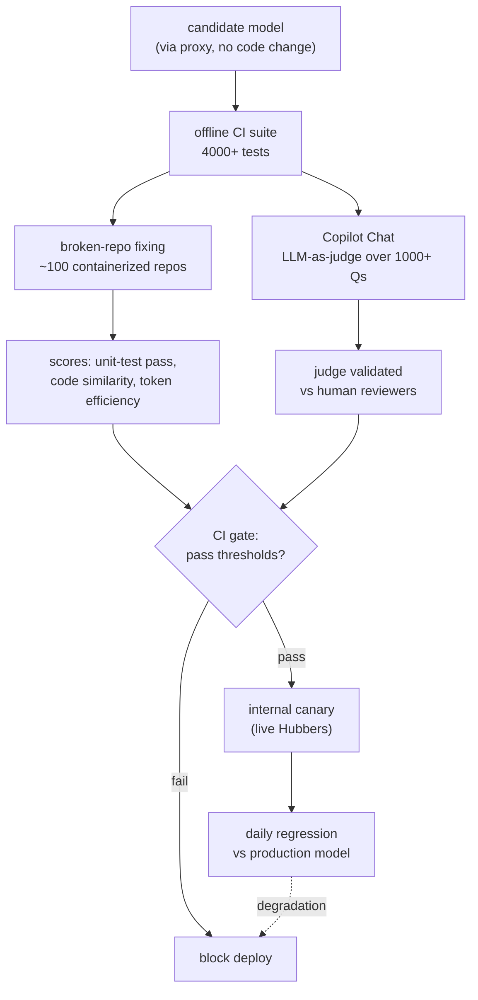
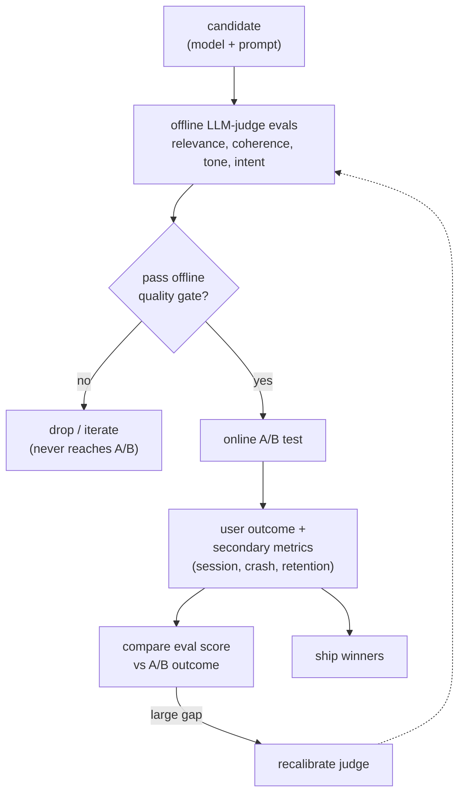
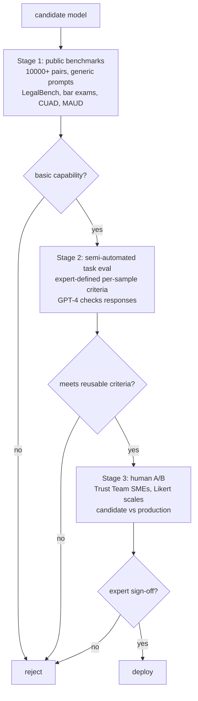
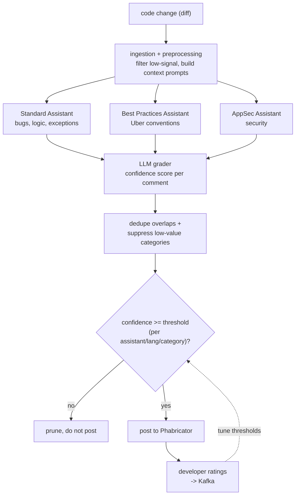
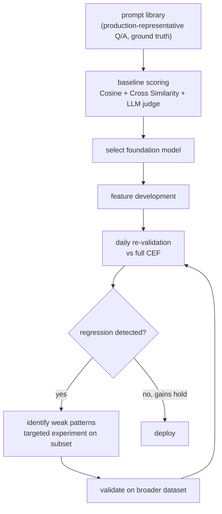
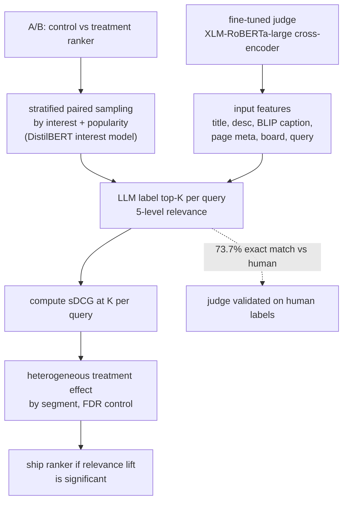

## Evaluation system

### GitHub Copilot: model evaluation with 4000+ offline tests and broken-repo fixing ([source](https://github.blog/ai-and-ml/generative-ai/how-we-evaluate-models-for-github-copilot/))

GitHub runs more than 4,000 offline tests, most inside an automated CI pipeline, before any model change reaches production. A core suite keeps roughly 100 containerized repositories that pass CI, then intentionally breaks them and checks whether a candidate model can fix the failing tests across languages and frameworks, scoring unit-test pass rate, similarity to known-good baselines, and token efficiency. Copilot Chat answers are scored by an LLM-as-judge over 1,000+ technical questions, with the judge validated against human reviewers and audited regularly. New models are wired through a proxy so they can be swapped without code changes, canaried to a set of internal Hubbers, and re-run daily against production to catch regressions.

**Interview questions this design invites**
- Why fix deliberately-broken repos instead of scoring free-text code answers?
- How do you validate the chat LLM-judge against human reviewers, and how often?
- What thresholds turn 4,000 test results into a single pass/fail CI gate?
- How does a proxy that swaps models without code changes affect reproducibility of a score?
- What does a daily regression run against production catch that pre-deploy CI does not?
- How do you weigh a quality gain against a latency increase when deciding adoption?

**Tricks and gotchas**
- Broken-repo fixing yields an unfoolable task metric (does the test pass) instead of a fuzzy judge score.
- The LLM-judge is treated as an instrument that is itself audited, not a trusted oracle.
- A proxy layer lets model ids be swapped as versioned artifacts without shipping code.
- Daily prod regression means judge or model drift is caught continuously, not once per release.

**Common mistakes and how to fix them**
- Scoring generated code by similarity alone: add executable unit-test pass as the primary signal.
- Trusting the chat judge unvalidated: measure judge-vs-human agreement before gating on it.
- Treating a model swap as config not code: route it through the same CI gate as a code change.
- Averaging across languages: score per language/framework so one segment's regression still blocks.

### Spotify: LLM evals as a pre-experiment funnel, not a fork ([source](https://engineering.atspotify.com/2026/5/better-experiments-with-llm-evals-a-funnel-not-a-fork))

Spotify frames offline evals and online A/B tests as a sequential funnel rather than competing options: cheap offline LLM-judge evals run first as an upstream quality gate that filters weak candidates and raises the hit rate of the experiments that follow. LLM judges score dimensions previously unmeasurable at scale (relevance, coherence, tone, intent alignment) on test sets and treatment variants before any experiment budget is spent. Surviving candidates go to an A/B test that measures real user outcomes and secondary metrics evals cannot see, such as session length, crash rate, and retention. Post-experiment, eval scores are compared against the A/B outcome, and a large gap flags judge miscalibration that feeds back to improve the judge: "without offline-online signal calibration, our evals are opinions, not evidence."

**Interview questions this design invites**
- Why run offline evals as a filter before A/B instead of in parallel?
- What does "raising the hit rate of experiments" mean quantitatively for experiment throughput?
- Which secondary metrics can only be measured online, and why can evals never capture them?
- How large an offline-online gap should trigger judge recalibration versus noise?
- How do you keep the judge from rewarding surface patterns disconnected from user value?
- When can a change ship on the offline gate alone versus requiring a full A/B?

**Tricks and gotchas**
- The funnel makes evals cheap gatekeepers so scarce A/B slots go to promising candidates only.
- The most valuable output of the online loop is a calibration check on the offline judge.
- Secondary metrics (crash rate, retention) are guardrails a judge is structurally blind to.
- Each iteration tightens the offline-to-online mapping so future gates predict reality better.

**Common mistakes and how to fix them**
- Treating evals and A/B as either/or: sequence them as a funnel so each does what it is best at.
- Trusting eval scores absolutely: calibrate them against A/B outcomes every cycle.
- Ignoring secondary metrics because the target metric improved: watch guardrails explicitly.
- Letting a miscalibrated judge persist: use the offline-online gap as the recalibration signal.

### Thomson Reuters: three-stage gate for evaluating LLMs on legal tasks ([source](https://legal.thomsonreuters.com/blog/evaluating-llms-legal-tasks/))

Thomson Reuters evaluates LLMs for high-stakes legal work through a three-stage funnel that minimizes human effort while keeping expert oversight. Stage one filters with automated public benchmarks: over 10,000 prompt-response pairs with ground truth using LegalBench, bar exams, hallucination checks, and contract datasets like CUAD and MAUD, run with generic prompts and no optimization. Stage two applies task-specific semi-automated evaluation where human experts define success criteria per sample and GPT-4 then checks whether responses meet them, so once criteria are set they are reused automatically for all future runs; they found sample-level evaluation more robust than task-level. Stage three is a human A/B where the Trust Team of subject-matter experts rates production versus candidate outputs on Likert scales as the definitive sign-off before deployment.

**Interview questions this design invites**
- Why order the gates cheapest-and-broadest first and human-A/B last?
- Why is sample-level evaluation more robust than task-level for legal outputs?
- How does encoding expert criteria once let GPT-4 reuse them without repeated human effort?
- What makes generic un-optimized prompts the right choice for the stage-one filter?
- When is human sign-off non-negotiable versus when can automation stand alone?
- How do you keep the stage-one public benchmarks from being contaminated by training data?

**Tricks and gotchas**
- Human effort is spent once to define per-sample criteria, then amortized across all future runs.
- Public benchmarks are only a coarse capability filter, not the quality bar for legal use.
- Sample-level criteria localize failures better than a single task-level score.
- The human A/B stays the final arbiter because failure cost in law is high.

**Common mistakes and how to fix them**
- Gating high-stakes legal output on public benchmarks alone: add task eval plus human A/B.
- Re-running expensive human review every cycle: capture criteria once and automate the check.
- Using a single task-level metric: score at the sample level to expose which cases fail.
- Optimizing prompts during the capability filter: keep stage one generic to compare models fairly.

### Uber uReview: confidence-gated LLM code-review comments ([source](https://www.uber.com/us/en/blog/ureview/))

uReview is a GenAI second reviewer that analyzes over 90% of Uber's roughly 65,000 weekly code changes across six monorepos, returning feedback in a median of 4 minutes in CI. It uses a prompt-chaining pipeline: ingestion filters low-signal targets and builds context-rich prompts, three specialized assistants (standard bugs, Uber best practices, AppSec) generate comments, and a post-processing stage assigns confidence scores, merges semantically overlapping suggestions, and suppresses historically low-value categories. The best configuration paired Claude-4-Sonnet as the comment generator with o4-mini-high as the review grader, and confidence thresholds are tuned per assistant, language, and category so only high-confidence comments post. Online, engineers mark 75% of posted comments useful and 65% are addressed in the same changeset, above the 51% address rate for human comments.

**Interview questions this design invites**
- Why separate the comment generator model from the grader model?
- How are per-assistant, per-language, per-category confidence thresholds calibrated?
- Why optimize for precision (usefulness) over recall in code review specifically?
- How does developer feedback via Kafka close the loop on threshold tuning?
- What stops overlapping or duplicate comments from flooding a diff?
- How do you measure that AI comments beat human comments (address rate)?

**Tricks and gotchas**
- A separate grader model scoring confidence lets a noisy generator stay useful after filtering.
- Thresholds are sliced by assistant, language, and category, not one global cutoff.
- Address rate versus human baseline is the honest online usefulness metric, not raw volume.
- Suppressing historically low-value comment categories fights reviewer fatigue directly.

**Common mistakes and how to fix them**
- Posting every generated comment: gate on a grader confidence threshold to protect precision.
- One global confidence cutoff: tune per assistant, language, and category from feedback data.
- Same model as generator and judge: risks self-preference; use a different grader family.
- No online usefulness metric: track address/useful rates against the human-comment baseline.

### GitLab Duo: central eval framework with daily regression at scale ([source](https://about.gitlab.com/blog/developing-gitlab-duo-how-we-validate-and-test-ai-models-at-scale/))

GitLab validates Duo features through a Centralized Evaluation Framework (CEF) that runs thousands of prompts across dozens of use cases to find behavior patterns rather than relying on anecdotes. A production-representative prompt library of question-answer pairs serves as ground truth without using customer data, and candidate foundation models are scored against it with Cosine Similarity, Cross Similarity, and an LLM judge to set baselines for model selection. During feature development teams run daily re-validation against the full CEF to ensure changes improve behavior instead of regressing it. Refinement is iterative: identify weak patterns, run targeted experiments on focused subsets, validate on the broader dataset, and deploy only when gains hold across all scenarios.

**Interview questions this design invites**
- Why build a production-representative prompt library instead of using customer data?
- What do Cosine and Cross Similarity add beyond an LLM judge score?
- How does daily regression against the full framework change developer workflow?
- How do you avoid overfitting when iterating on focused weak-pattern subsets?
- What is the deploy criterion when gains on a subset must hold across all scenarios?
- How do you keep thousands of prompts across dozens of use cases version-controlled and comparable?

**Tricks and gotchas**
- A central framework gives every team one comparable score instead of per-team anecdotes.
- Dual datasets: a focused optimization subset plus a broad regression sample guard against overfit.
- Daily automated regression treats eval like unit tests, catching drift during development.
- Ground-truth Q/A pairs are synthesized to avoid depending on customer data.

**Common mistakes and how to fix them**
- Per-team ad hoc evals: centralize into one framework so scores are comparable across features.
- Tuning on the same subset you score on: validate improvements on a broader held-out dataset.
- Running eval only at release: run daily regression against the full suite during development.
- Single similarity metric: combine similarity metrics with an LLM judge for open-ended output.

### Pinterest: fine-tuned LLM judges for search relevance A/B evaluation ([source](https://medium.com/pinterest-engineering/llm-powered-relevance-assessment-for-pinterest-search-b846489e358d))

Pinterest fine-tunes an open-source model as a relevance judge that scores query-Pin pairs on a 5-level scale using a cross-encoder architecture over rich text features (Pin titles, descriptions, BLIP image captions, page metadata, board titles, query tokens). After testing mBERT, T5, mDeBERTa, XLM-RoBERTa, and Llama-3-8B, they picked XLM-RoBERTa-large for balancing accuracy and cost, labeling 150,000 pairs on a single GPU in 30 minutes. To evaluate ranking A/B experiments, they stratify paired query samples by interest category and popularity, LLM-label top-K results, compute sDCG@K per query, and estimate heterogeneous treatment effects with false-discovery-rate control. LLM labels hit 73.7% exact match with humans (91.7% within one point), and variance reduction from stratification cut the minimum detectable effect from 1.3 to 1.5% down to 0.25%.

**Interview questions this design invites**
- Why fine-tune a cross-encoder judge instead of prompting a large general LLM?
- How does stratified sampling by interest and popularity reduce the minimum detectable effect?
- What does 73.7% exact match with humans buy you, and is that enough to gate ranking?
- Why sDCG@K per query rather than a single global relevance average?
- How does FDR control prevent false wins when slicing treatment effects by segment?
- What is the cost tradeoff behind choosing XLM-RoBERTa-large over Llama-3-8B?

**Tricks and gotchas**
- Stratification is a variance-reduction lever that shrinks detectable effect from ~1.4% to 0.25%.
- A small fine-tuned cross-encoder can out-price a big general LLM at 150k labels in 30 min/GPU.
- The judge is explicitly validated against human labels before it scores experiments.
- sDCG@K plus per-segment treatment effects localizes which query types a ranker helps or hurts.

**Common mistakes and how to fix them**
- Using an unvalidated judge to call A/B winners: report exact-match and correlation vs human labels first.
- One global relevance metric: compute per-query sDCG@K and slice effects by query segment.
- Naive random sampling: stratify by interest and popularity to cut variance and detect small lifts.
- Multiple-comparison false wins across segments: apply false-discovery-rate control.

_Not reachable: DoorDash (simulation and evaluation flywheel), Booking.com_
