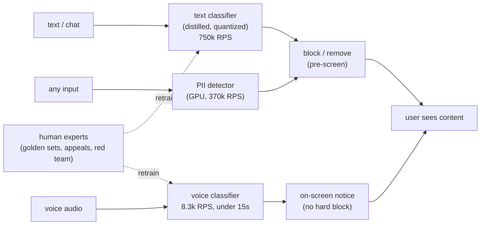
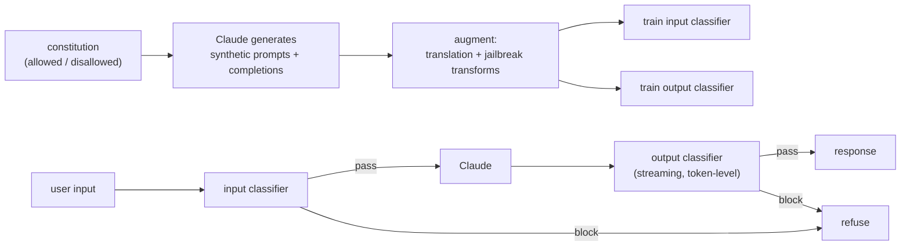
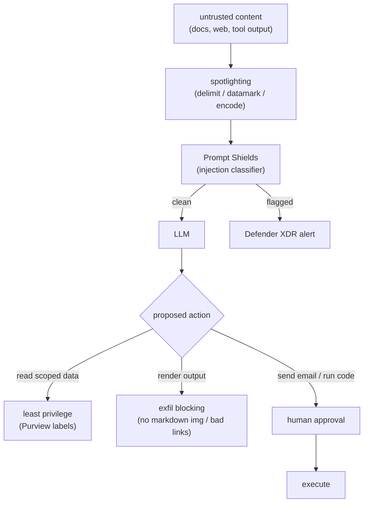
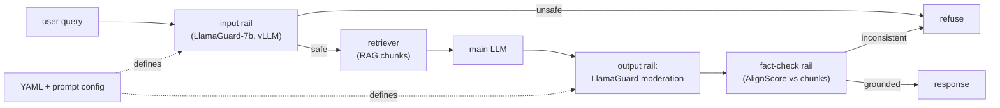
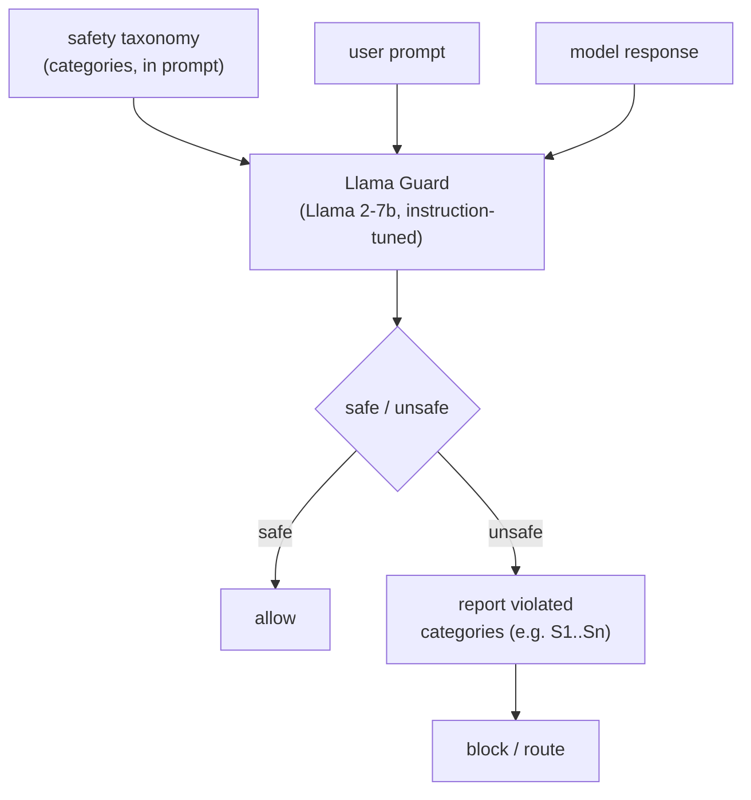
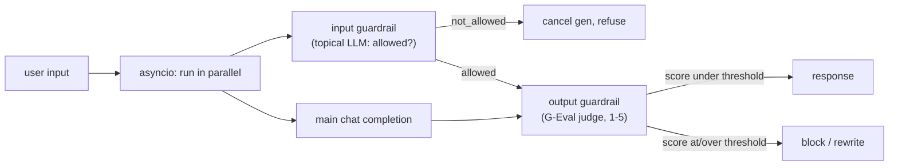
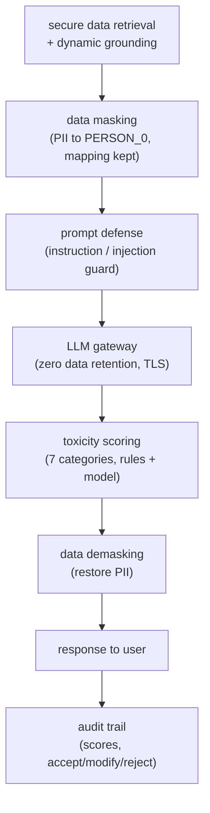
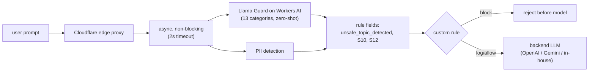

## Safety and guardrails

### Roblox: multi-model text, voice, and PII moderation at massive scale ([source](https://about.roblox.com/newsroom/2025/07/roblox-ai-moderation-massive-scale))

Roblox runs a proactive, layered moderation stack built on distilled and quantized transformer classifiers (not an LLM-judge) so it can screen content before users ever see it. Text filtering peaks at 750k requests per second across 28 languages, PII detection at 370k RPS (moved from CPU to GPU serving), and voice classification at 8.3k RPS, together covering 6.1 billion chat messages per day. Almost all violating content is prescreened and removed, with roughly 0.01% flagged; the latest voice classifier hit 92% higher recall than v1 at a 1% false-positive rate. Thousands of human experts curate golden sets, review appeals, and red-team, feeding labels back into continuous retraining.

**Interview questions this design invites**
- Why distill and quantize classifiers instead of calling a large LLM-judge per message?
- How do you serve a PII detector at 370k RPS, and what forced the CPU-to-GPU move?
- Voice cannot be blocked in real time the way text can; why, and how do you design around a 15-second classification delay?
- How do human appeals feed back into training without creating a labeling bottleneck?
- What false-positive rate is acceptable at 6.1 billion messages per day, and why?
- How do you keep 28 languages at parity rather than English-first?

**Tricks and gotchas**
- Voice is near-real-time (under 15s) but not blocking, so the product uses on-screen notices instead of prevention; latency budget shapes the UX, not just the model.
- Reported quality is recall-at-fixed-false-positive (92% higher recall, 1% FPR), not accuracy; the operating point is the real story.
- Human agreement threshold (80%+ labeler agreement) is the alignment gate, so ambiguous policy needs human consensus before it becomes training signal.
- The 0.01% flag rate means the classifiers spend almost all compute on clearly-safe traffic, which is why cheap distilled models matter.

**Common mistakes and how to fix them**
- Assuming one big multilingual model scales; instead distill per-modality classifiers and serve them on GPU tiers sized to each RPS profile.
- Treating voice like text; accept that you cannot pre-block audio and design a fast-notify plus retroactive-action loop.
- Ignoring the human-in-the-loop cost; budget thousands of reviewers for nuance and appeals, and route their labels back into retraining.
- Optimizing catch rate alone; track false-positive rate explicitly or you over-block legitimate chat at billions-per-day volume.

### Anthropic: Constitutional Classifiers trained on a synthetic constitution ([source](https://www.anthropic.com/research/constitutional-classifiers))

Anthropic wraps the model in input and output classifiers trained on synthetic data generated from a constitution, a list of allowed and disallowed content categories. Claude generates diverse prompts and completions across those classes, then augments them with translations and jailbreak-style transformations so the classifiers generalize to novel attacks. On automated red-team evals, jailbreak success dropped from 86% undefended to 4.4% defended (over 95% of advanced attempts blocked); a 183-person, 3000-hour human red team found no universal jailbreak against the prototype. Overhead was modest: production refusal rate rose only 0.38% (not significant) and compute cost rose 23.7%.

**Interview questions this design invites**
- Why train classifiers on synthetic constitution-derived data instead of collected real jailbreaks?
- The input classifier can be evaded by encoding or cipher attacks; why does the output classifier still hold?
- How do you keep an output classifier streaming-friendly so you can block mid-generation?
- What does a 23.7% compute overhead buy you, and when is that not worth it?
- How do you measure that you did not just raise the refusal rate on benign traffic?
- Why does a universal jailbreak matter more than many narrow ones?

**Tricks and gotchas**
- The classifiers are separate decisions from the main model, so talking the model out of its rules does not talk the classifier out of its verdict.
- Data augmentation (translation, jailbreak-style rewrites) is what generalizes to unseen attacks; the raw constitution alone would overfit.
- The headline 86% to 4.4% is on an adversarial eval set, not natural traffic; report both the adversarial catch rate and the benign refusal delta.
- One red-teamer eventually found a universal jailbreak via cipher/encoding plus role-play, so no classifier is final; keep red-teaming continuously.

**Common mistakes and how to fix them**
- Relying on system-prompt refusal training alone; add independent input/output classifiers that do not share the base model's persuadability.
- Reporting only catch rate; also report the production refusal-rate change (here 0.38%) so you prove low over-blocking.
- Forgetting the automated grader can itself refuse to grade (about 1%, up to 10% per question); validate the eval harness, not just the model.
- Shipping and stopping; treat the universal-jailbreak discovery as evidence you need ongoing adversarial testing, not a one-time gate.

### Microsoft (MSRC): defense in depth against indirect prompt injection ([source](https://www.microsoft.com/en-us/msrc/blog/2025/07/how-microsoft-defends-against-indirect-prompt-injection-attacks))

Microsoft treats indirect prompt injection as unsolvable by any single control and layers prevention, detection, and impact mitigation. Prevention uses spotlighting to mark untrusted content in three modes: delimiting with randomized markers, datamarking by interleaving special characters, and encoding via base64 or ROT13 so the model can tell external text from trusted instructions. Detection adds Prompt Shields, a multilingual classifier trained on known injection techniques that flags malicious content at inference and surfaces alerts in Defender XDR. Impact mitigation is deterministic: least-privilege data access via Purview sensitivity labels, blocking exfiltration vectors like markdown image and untrusted link injection, and human approval before high-consequence actions such as sending email or running code.

**Interview questions this design invites**
- Why is indirect (content-borne) injection harder than a user jailbreak, and what changes in the defense?
- Compare delimiting vs datamarking vs encoding; what does each cost in downstream task quality?
- How does spotlighting help even when the classifier misses the injection?
- Why gate actions in code rather than trusting a cleaner prompt?
- What is markdown image exfiltration and why block it deterministically?
- Where does least privilege fail, and what backstops it?

**Tricks and gotchas**
- Encoding untrusted text (base64/ROT13) makes the boundary obvious to the model but can degrade the model's ability to use that content; there is a real tradeoff.
- Prompt Shields is a probabilistic detector; the deterministic layers (exfil blocking, approval) are what make a missed detection non-catastrophic.
- Exfiltration often rides on rendering, not on actions, so blocking markdown images and untrusted links closes a channel most designs forget.
- Human-in-the-loop only helps for the small set of high-consequence actions; gating everything trains users to click through.

**Common mistakes and how to fix them**
- Trying to prompt your way out of injection; combine spotlighting plus a trained detector plus code-side gates, and assume each can fail.
- Granting the agent broad data scopes; apply least privilege with sensitivity labels so a fooled model still cannot reach sensitive data.
- Focusing only on action APIs; also block rendered exfiltration vectors like auto-loaded images and links.
- Requiring approval on everything; reserve human consent for genuinely high-stakes actions to avoid approval fatigue.

### NVIDIA: NeMo Guardrails wiring LlamaGuard and fact-check rails into RAG ([source](https://developer.nvidia.com/blog/content-moderation-and-safety-checks-with-nvidia-nemo-guardrails/))

NeMo Guardrails is a declarative, config-file framework that adds input and output rails to a RAG app without changing core code. Input rails run LlamaGuard-7b to check user messages against a safety policy before retrieval, and output rails validate responses through sequential checkpoints before they reach the user. LlamaGuard is registered as a dedicated safety engine with its own taxonomy and runs independently via vLLM, so moderation does not block the main inference. A fact-check rail using AlignScore compares generated text against retrieved chunks to catch hallucinations that are unsafe in a different way, factual inconsistency.

**Interview questions this design invites**
- Why express rails as config (YAML/prompts) instead of inline code?
- How does running LlamaGuard on a separate vLLM engine help throughput and latency?
- What does AlignScore fact-checking catch that a content-safety classifier does not?
- Where in the RAG flow do you place the input rail relative to retrieval, and why?
- How do you keep output rails from serializing into a long latency chain?
- What taxonomy do you give LlamaGuard, and how do you adapt it per app?

**Tricks and gotchas**
- Two different notions of unsafe coexist: policy-violating content (LlamaGuard) and ungrounded content (AlignScore); a RAG app needs both.
- Running the guard as a separate microservice lets it batch and scale independently of the main model, but adds an extra network hop.
- Config-driven rails are easy to change, which cuts both ways: a loose YAML policy silently weakens safety with no code review.
- Output rails in series stack latency; parallelize the independent checks where the framework allows.

**Common mistakes and how to fix them**
- Putting the safety check after retrieval only; run the input rail before retrieval so unsafe queries never touch your corpus or spend tokens.
- Treating hallucination as a quality issue, not safety; add a grounding rail so unsupported claims are blocked, especially in high-stakes domains.
- Co-locating the guard model with the main model; serve it on its own vLLM engine to batch and scale separately.
- Leaving the taxonomy at defaults; tune LlamaGuard categories to the product's actual policy.

### Meta: Llama Guard, an instruction-tuned input-output safeguard ([source](https://arxiv.org/abs/2312.06674))

Llama Guard is a Llama 2-7b model instruction-tuned into a safety classifier that moderates both user prompts and model responses against a structured risk taxonomy. The same model does prompt classification and response classification, emitting a safe/unsafe decision plus the violated categories. Because it is instruction-tuned rather than a fixed head, it supports zero-shot and few-shot prompting with new taxonomies at inference time, so teams can adapt safety definitions without retraining. Trained on a high-quality but low-volume dataset, it matched or beat existing tools on the OpenAI Moderation eval and ToxicChat, and Meta released the weights.

**Interview questions this design invites**
- Why use one instruction-tuned model for both prompt and response moderation instead of two specialized classifiers?
- How does putting the taxonomy in the prompt enable zero-shot adaptation, and what does that cost in reliability?
- A 7B guard on every request is real latency; when do you reach for a smaller distilled classifier instead?
- How do you evaluate a moderation model, and why report per-category rather than aggregate?
- What are the risks of a guard model sharing the same failure modes as the base LLM?
- How would you adapt the taxonomy for a regulated domain?

**Tricks and gotchas**
- Prompt and response need different judgments (a benign prompt can yield an unsafe answer); Llama Guard handles both by conditioning on which role it is scoring.
- Instruction-tuning gives taxonomy flexibility but the guard is still an LLM, so it inherits jailbreak-style vulnerabilities of LLMs.
- High-quality low-volume training data beat larger noisy sets here; label quality dominates label quantity for moderation.
- Category-level output (not just a binary) is what lets policy routing choose refuse vs safe-complete vs escalate.

**Common mistakes and how to fix them**
- Moderating only the input; run the same guard on the output since unsafe generations arise from safe prompts.
- Hardcoding one taxonomy; exploit instruction-tuning to pass a domain-specific taxonomy at inference and avoid retraining.
- Deploying a 7B guard everywhere for latency-sensitive traffic; cascade with a cheap classifier first and reserve the 7B guard for ambiguous cases.
- Trusting the guard because it is a model; red-team it as its own attack surface with LLM-style jailbreaks.

### OpenAI: async input and output guardrail patterns ([source](https://developers.openai.com/cookbook/examples/how_to_use_guardrails))

The OpenAI cookbook shows a guardrails pattern that races detection against generation to hide latency. Input guardrails are topical checks: a separate constrained LLM call returns allowed or not_allowed to catch off-topic queries, jailbreaks, and prompt injection before the main answer is used. Output guardrails apply a G-Eval style LLM-judge that scores the response 1-5 against explicit domain criteria and steps, blocking or rewriting responses at or above a set threshold. The key move is asyncio.create_task to run the guardrail in parallel with the chat completion, canceling the loser, so the guardrail adds little wall-clock time. The cookbook warns that an LLM used as a guardrail inherits the base model's own vulnerabilities.

**Interview questions this design invites**
- How does racing the guardrail against generation reduce latency, and what do you do with the wasted generation when the guardrail blocks?
- If the guardrail is itself an LLM, how do you keep it from being jailbroken the same way as the main model?
- Why score output 1-5 with G-Eval instead of a binary block?
- How do you set the blocking threshold, and what data do you need?
- When is a parallel guardrail unsafe (e.g. side effects fire before the block)?
- What is the cost of a second LLM call per request at scale?

**Tricks and gotchas**
- Racing works only when generation has no side effects before the block; if the model can act mid-stream, parallelism can leak an unsafe action.
- An LLM-judge guardrail shares the base model's weaknesses, so it is not an independent decision the way a trained classifier is.
- G-Eval scores need a labeled eval set and confusion matrix to pick a threshold; the 1-5 scale is meaningless without calibration.
- False positives fracture UX and false negatives cause harm; the threshold is a business decision, not a default.

**Common mistakes and how to fix them**
- Running guardrails strictly in series and eating full added latency; race independent checks against generation with async tasks.
- Using the same base model as its own guardrail and assuming independence; prefer a separately trained classifier for adversarial robustness.
- Hard-blocking on a binary; use a graded score so you can rewrite or safe-complete borderline cases instead of refusing.
- Picking thresholds by intuition; build an eval set and tune per category with a confusion matrix.

### Salesforce: Einstein Trust Layer, a secure LLM intermediary ([source](https://developer.salesforce.com/blogs/2023/10/inside-the-einstein-trust-layer))

The Einstein Trust Layer is a secure intermediary that wraps every LLM call in an ordered pipeline. It grounds the prompt from Salesforce records (client- or server-side) and dynamic external data, then masks PII by replacing detected entities with typed placeholders like PERSON_0 while keeping a temporary reverse mapping. It applies instruction-defense post-prompting against injection, sends the secured prompt through an LLM gateway with zero data retention at the provider, scores the response across seven toxicity categories with a hybrid rule-plus-model approach, demasks the PII back in before delivery, and records an audit trail of scores and user accept/modify/reject actions.

**Interview questions this design invites**
- Why mask PII before the LLM call and demask after, rather than trusting the provider?
- What does zero data retention at the provider guarantee, and what does it not?
- Why keep the PII mapping only temporarily, and where does it live?
- How does instruction-defense post-prompting help against injection, and why is it not sufficient alone?
- What belongs in the audit trail for a regulated enterprise, and why log accept/modify/reject?
- How do you order masking, grounding, and defense, and what breaks if you reorder them?

**Tricks and gotchas**
- Masking before the gateway means the third-party model never sees raw PII; demasking after restores it for the user, so the model reasons over placeholders.
- Typed placeholders (PERSON_0, PERSON_1) preserve entity distinctness so the model can still reference them coherently.
- Zero data retention is a contractual/config control at the provider, not something you can technically enforce; the local masking is the real defense.
- Toxicity scoring is hybrid (rules plus model) precisely because pure-model scoring misses obvious cases and pure rules miss nuance.

**Common mistakes and how to fix them**
- Sending raw customer data to a third-party model; mask PII to typed placeholders before the gateway and demask on return.
- Relying on provider promises for privacy; enforce masking and zero-retention config, and keep the mapping in your own trust boundary.
- Skipping the audit trail; log toxicity scores and user accept/modify/reject so compliance and model tuning both have data.
- Treating prompt defense as complete injection protection; combine it with masking and gateway controls so a bypass has limited blast radius.

### Cloudflare: Firewall for AI, an edge proxy using Llama Guard ([source](https://blog.cloudflare.com/block-unsafe-llm-prompts-with-firewall-for-ai/))

Cloudflare's Firewall for AI runs Llama Guard at the network edge, in front of any model (third-party or self-hosted), to detect unsafe prompts before they reach the endpoint. It covers 13 default unsafe categories aligned with OWASP LLM risks, and Llama Guard runs on Workers AI GPUs using zero-shot classification rather than keyword blocklists. The architecture is asynchronous and non-blocking: PII and unsafe-topic modules run concurrently with a hard 2-second timeout that returns partial results rather than stalling the app, and model instances auto-scale across the network. Detection results populate rule fields like cf.llm.prompt.unsafe_topic_detected so teams can log or block per category without touching application code.

**Interview questions this design invites**
- Why enforce safety at the edge proxy rather than in the application or the model?
- What does a 2-second timeout returning partial results imply for fail-open vs fail-closed behavior?
- Why zero-shot Llama Guard over a keyword blocklist for the 13 categories?
- How does exposing detection as rule fields let teams act without code changes, and what are the risks?
- How do you auto-scale a GPU-backed guard across a global edge under variable load?
- How does a model-agnostic firewall handle providers with different safety behavior?

**Tricks and gotchas**
- Running the guard concurrently with a hard 2s timeout bounds added latency, but the partial-result fallback is a fail-open decision that must be intentional.
- Edge placement means the guard protects every backend model uniformly, but it only sees the prompt, not the retrieval or tool context behind the app.
- Category fields like S10/S12 let one deployment log some categories and block others, so policy is a rule config, not a code change.
- Zero-shot classification understands context that blocklists miss, but it also inherits the guard model's own false positives on edge cases.

**Common mistakes and how to fix them**
- Enforcing safety only inside each app; put a model-agnostic guard at the edge so every backend is covered uniformly.
- Letting a slow guard block the request path; bound it with a timeout, but decide explicitly whether a timeout fails open or closed for your risk level.
- Using keyword blocklists; use a zero-shot classifier so context and paraphrase do not slip through.
- Blocking all 13 categories bluntly; use per-category rule fields to block high-risk topics and log-only the borderline ones while you tune.

_Not reachable: none_
