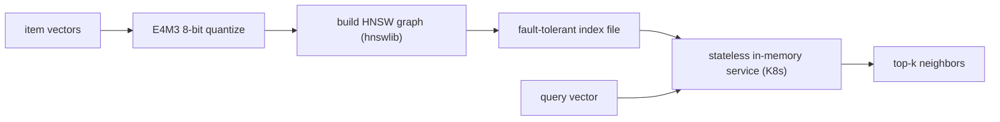
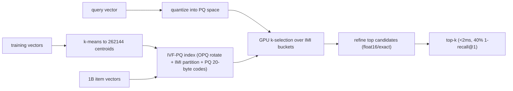
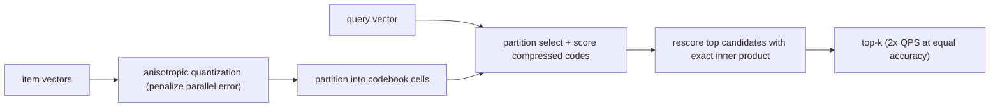
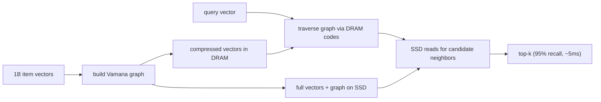
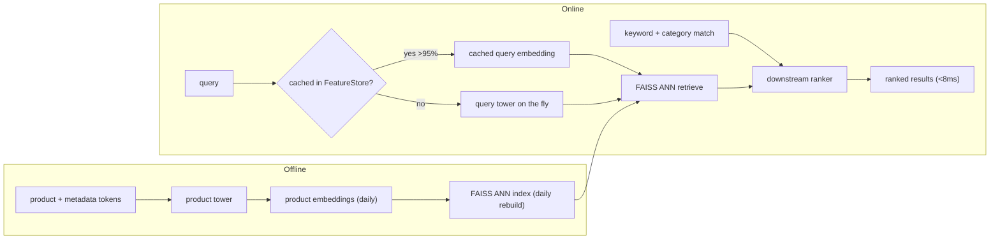
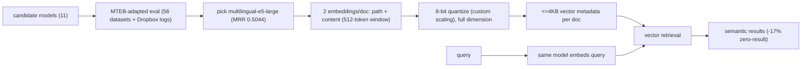
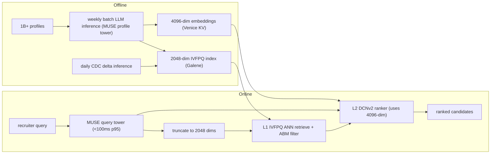

## Semantic search and embeddings

### Spotify: Voyager, an HNSW nearest-neighbor library ([source](https://engineering.atspotify.com/2023/10/introducing-voyager-spotifys-new-nearest-neighbor-search-library))

Spotify built Voyager as the successor to Annoy, a nearest-neighbor library powering recommendation features like Discover Weekly and Home without live ML inference. It wraps hnswlib (the HNSW graph algorithm) and reports more than 10x Annoy's speed at equal recall, or up to 50% more accuracy at equal speed. Vectors are compressed with E4M3 8-bit floats for up to 4x less memory than Annoy, and indexes deploy as in-memory, stateless Kubernetes services with fault-tolerant, corruption-checked index files. It ships Python and Java bindings with identical interfaces so the same index serves both the data-science and JVM-backend sides.

**Interview questions this design invites**
- Why replace Annoy's random-projection trees with an HNSW graph, and what changes in the recall-vs-memory curve?
- How does E4M3 8-bit quantization affect recall, and why quantize at all if HNSW already stores full graphs?
- Why run stateless in-memory index services on Kubernetes instead of a vector database?
- How do you keep the index fresh when a stateless service holds it entirely in RAM?
- What breaks if Python and Java bindings drift in their distance math?
- How do you tune HNSW ef and M for a latency-vs-cost target per recommendation surface?

**Tricks and gotchas**
- E4M3 8-bit floats cut memory roughly 4x versus Annoy but the quantization is lossy, so recall must be measured after compression, not before.
- Stateless in-memory serving trades zero database maintenance for a full re-load of the index on every deploy or scale-up.
- Corruption detection on index files matters because a single bad byte in a memory-mapped graph can silently poison neighbor results.
- Identical Python and Java bindings avoid the classic bug where offline eval and online serving compute distances differently.

**Common mistakes and how to fix them**
- Assuming HNSW is memory-cheap: the graph plus vectors is RAM-heavy, so quantize (E4M3) and budget RAM per index copy.
- Picking one ef for all traffic: expose ef per query class so precision-sensitive surfaces can pay more latency.
- Treating the index as durable state: it is a stateless artifact rebuilt from vectors, so keep the source vectors as the system of record.

### Vespa: billion-scale hybrid HNSW plus inverted-file search ([source](https://blog.vespa.ai/vespa-hybrid-billion-scale-vector-search/))

Vespa's HNSW-IF design splits 1 billion 100-dimensional int8 vectors into two tiers: about 20% are chosen as centroids and indexed with in-memory HNSW (max-links-per-node 18) on high-RAM nodes, while the other 80% live in a disk-backed inverted index that maps each centroid to a posting list of nearby vector IDs (each vector associated with its 12 closest centroids). A query first retrieves centroids from HNSW in 2-3ms, gathers candidate IDs via a dotProduct multivalued operator weighted by transitive closeness, then a second phase pages the actual vectors from SSD and rescores at full precision (tested to depth 4000). The result is 90% recall@10 just under 50ms end to end, at roughly $6,000/month, with full CRUD for incremental updates.

**Interview questions this design invites**
- Why split into an in-memory centroid graph plus a disk-backed posting list instead of one flat HNSW?
- How does associating each vector with its 12 closest centroids affect recall versus storage?
- Why does the second-phase rescore need full-precision vectors paged from SSD if the first phase already ranked candidates?
- What happens to recall when you delete many centroids, and why is deleting non-centroids cheaper?
- How do you pick the rescore depth (why 4000) against the 50ms budget?
- How does int8 vector storage change the recall and memory math versus float32?

**Tricks and gotchas**
- Deleting centroids degrades recall because posting lists lose their routing anchors; deleting non-centroids barely matters.
- Transitive closeness scoring prunes candidates before any SSD read, so disk I/O is the real budget, not compute.
- Storing only vector IDs (not vectors) in posting lists avoids duplicating vector data across the 12 centroid associations.
- Multi-version embedder models multiply storage linearly, so a model upgrade is a storage-and-cost event, not just a re-embed.

**Common mistakes and how to fix them**
- Putting all billion vectors in RAM: only the centroid tier needs memory, so push the 80% majority to SSD-backed posting lists.
- Skipping the full-precision rescore: int8 first-phase scores are approximate, so page real vectors and rescore the shortlist.
- Ignoring cluster drift on updates: incremental upserts work, but periodic re-clustering keeps posting lists balanced.

### Meta: Faiss, GPU-accelerated billion-scale similarity search ([source](https://engineering.fb.com/2017/03/29/data-infrastructure/faiss-a-library-for-efficient-similarity-search/))

Faiss is Meta's C++/Python library for approximate nearest-neighbor search over billion-vector datasets, built around composite IVF-PQ indexes (notation like OPQ20_80,IMI2x14,PQ20): OPQ rotates vectors so quantization is more effective, IMI (inverted multi-index) partitions the space into buckets to shrink the search set, and PQ compresses each vector into a 20-byte code by quantizing subspaces independently. On Deep1B (1B vectors) it hits 40% 1-recall@1 in under 2ms per query (about 500 QPS single-core), roughly 8.5x faster than the prior state of the art. GPU kernels add 5-10x over CPU (20x+ on P100) via a register-resident k-selection kernel and float16 storage, and building the index meant k-means clustering 67M 120-dim vectors to 262,144 centroids in 139 minutes on four GPUs.

**Interview questions this design invites**
- What does each stage of OPQ, IMI, and PQ contribute, and why compose them rather than use HNSW?
- Why does product quantization split a vector into subspaces, and how does that set the memory-vs-recall knob?
- When does GPU acceleration pay off, and what is the k-selection kernel doing that a naive sort cannot?
- How do you choose the number of centroids (why 262,144) relative to dataset size?
- What is 1-recall@1 measuring, and why report it instead of recall@10?
- How does float16 storage and compute affect accuracy versus the memory saved?

**Tricks and gotchas**
- PQ codes are lossy, so IVF-PQ needs a refine/rescore step on the top candidates to recover precision.
- OPQ's rotation before quantization is what makes PQ subspaces roughly independent; skipping it hurts recall.
- GPU k-selection keeps all state in registers to avoid memory round-trips, which is why it approaches peak bandwidth.
- Training k-means can stream vectors to GPU without fitting the whole training set in memory, so training scale is not bounded by GPU RAM.

**Common mistakes and how to fix them**
- Storing full float32 vectors at billion scale: use PQ codes (about 20-30 bytes/vector) to fit in a fixed RAM budget.
- Under-training the coarse quantizer: too few centroids makes buckets huge and search slow, so scale centroids with N.
- Trusting compressed distances alone: keep a refine stage that rescores the shortlist with higher precision.

### Google Research: ScaNN, anisotropic vector quantization ([source](https://research.google/blog/announcing-scann-efficient-vector-similarity-search/))

ScaNN targets maximum inner product search (MIPS) for two-tower retrieval, where queries and items map to a shared space and you want the highest inner products. Its core idea is anisotropic vector quantization: instead of minimizing average reconstruction error uniformly, it penalizes quantization error parallel to the original vector, accepting worse reconstruction of low inner products in exchange for preserving the high ones that actually determine ranking. The pipeline partitions vectors into codebook cells, scores candidates using the compressed codes, then rescores the top candidates with exact inner products. On glove-100-angular it beat eleven tuned libraries, serving roughly twice the QPS at a given accuracy.

**Interview questions this design invites**
- Why is minimizing average quantization error the wrong objective for MIPS ranking?
- What does penalizing parallel (versus orthogonal) error do to the preserved inner products?
- How does the partition-score-rescore pipeline trade recall against QPS at each stage?
- Why does MIPS (inner product) behave differently from Euclidean nearest neighbor for quantization?
- How would you tune the number of partitions and rescore depth for a latency target?
- What does the ann-benchmarks glove-100 result tell you, and where might it not transfer to your data?

**Tricks and gotchas**
- The loss is directional: parallel error hurts high-inner-product items most, so the quantizer is tuned to the ranking goal, not reconstruction fidelity.
- Compressed scoring is approximate, so the exact rescore of the shortlist is what recovers top-k precision.
- Benchmark wins are dataset-specific (glove-100-angular); the anisotropic advantage depends on your embedding distribution.

**Common mistakes and how to fix them**
- Reusing a Euclidean-tuned quantizer for inner-product search: switch the loss to penalize parallel error for MIPS.
- Trusting compressed scores as final: add an exact-inner-product rescore over the top candidates.
- Over-fitting parameters to one benchmark: retune partitions and rescore depth on your own labeled queries.

### Microsoft Research: DiskANN, SSD-backed billion-vector ANN ([source](https://www.microsoft.com/en-us/research/project/project-akupara-approximate-nearest-neighbor-search-for-large-scale-semantic-search/))

DiskANN indexes up to a billion vectors on a single machine at 95% search accuracy with about 5ms latency by pairing a Vamana graph with hybrid SSD-plus-DRAM storage, fitting 5-10x more points per machine than DRAM-only ANN systems. The streaming variant, FreshDiskANN, indexes over a billion points on a workstation with an SSD and limited memory while sustaining thousands of concurrent real-time inserts, deletes, and searches per second. The design keeps a compressed representation resident in DRAM to route graph traversal and reads full-precision vectors from SSD only for the candidates that need exact scoring, so a commodity box handles what previously needed a cluster.

**Interview questions this design invites**
- Why does SSD-backed storage let one machine hold 5-10x more vectors than a DRAM-only index?
- What role does the DRAM-resident compressed representation play during graph traversal?
- How does the Vamana graph differ from HNSW, and why choose it for a disk-backed layout?
- How does FreshDiskANN support concurrent inserts and deletes without a full rebuild?
- What sets the roughly 5ms latency floor, and how do SSD reads factor into it?
- How would you shard DiskANN across machines if the corpus outgrew one SSD?

**Tricks and gotchas**
- SSD random-read latency, not compute, dominates the query budget, so minimizing per-query SSD reads is the whole game.
- Keeping compressed vectors in DRAM to route traversal means full vectors are read only for final candidates, cutting I/O.
- Streaming inserts and deletes need careful graph maintenance so recall does not decay as the graph churns.

**Common mistakes and how to fix them**
- Assuming billion-scale ANN needs a cluster: a single SSD-backed box can serve it at 95% recall, so right-size the hardware.
- Reading full vectors during traversal: route with DRAM-resident compressed codes and hit SSD only for candidates.
- Treating a graph index as static: use a streaming design (FreshDiskANN) when inserts and deletes are continuous.

### Instacart: ITEMS two-tower search over FAISS ([source](https://company.instacart.com/how-its-made/how-instacart-uses-embeddings-to-improve-search-relevance))

Instacart's ITEMS (Instacart Transformer-based Embedding Model for Search) is a two-tower bi-encoder that maps queries and products into a shared space, so a product embedding is fixed regardless of query and can be precomputed. Positive pairs come from post-search cart-adds, trained with in-batch negatives plus self-adversarial reweighting, and a cascade scheme warms up on noisier data then fine-tunes on stricter conversion signals; product inputs concatenate metadata with special tokens ([PN], [PBN], [PCS], [PAS]) and multi-task heads predict brand and category to cluster the space. Serving precomputes product embeddings daily into a FAISS ANN index and caches embeddings for over 95% of queries in a FeatureStore (computing novel queries on the fly) to hold sub-8ms latency. EBR complements keyword and category matching for long or ambiguous queries and lifted cart-adds-per-search 4.1% in A/B tests.

**Interview questions this design invites**
- Why does a bi-encoder let you precompute product embeddings, and what does that buy at serving time?
- How do in-batch negatives with self-adversarial reweighting shape what the model learns?
- Why cache embeddings for 95% of queries, and how do you keep the long tail under the 8ms budget?
- Why rebuild the FAISS index daily instead of streaming upserts, and when would that break?
- What do the multi-task brand/category heads add over the main retrieval objective?
- Why does EBR help most on long or ambiguous queries versus short exact ones?

**Tricks and gotchas**
- Bi-encoder embeddings are query-independent, which is exactly what makes daily precomputation and caching possible.
- More training data hurt past a noise threshold, so the cascade warms up on noisy pairs then fine-tunes on clean conversions.
- Special tokens that structure product metadata ([PN]/[PBN]/[PCS]/[PAS]) feed the tower more signal than raw text.
- Human eval tracked relevance better than raw clickthrough because CTR carries popularity bias.

**Common mistakes and how to fix them**
- Dumping all logged pairs into training: filter by conversion quality, since noisy pairs past a threshold degrade the model.
- Computing every query embedding live: cache the frequent 95% and only compute the novel tail to hold latency.
- Using EBR alone: fuse it with keyword and category matching and feed a downstream ranker for final ordering.

### Dropbox: selecting an embedding model via MTEB ([source](https://dropbox.tech/machine-learning/selecting-model-semantic-search-dropbox-ai))

Facing over a trillion documents and a keyword system that missed synonyms and multilingual queries, Dropbox ran a model-selection study rather than jumping to an index. They adapted the MTEB benchmark (8 task types, 56 datasets) with in-house inference adapters, per-document multi-embedding (overlapping chunks), 32-to-8-bit precision experiments, and custom datasets built from anonymized search logs. Testing 11 models across English, Japanese, Spanish, Korean, and German, multilingual-e5-large won (English MRR 0.5044 vs 0.3299 runner-up). A 4KB per-document metadata cap drove the serving shape: two embeddings per document (path and content), 8-bit quantization with a custom scaling scheme, a 512-token content window, and full dimensionality kept to minimize cosine-similarity error. Rollout cut zero-result sessions 17%.

**Interview questions this design invites**
- Why start with a model-selection benchmark instead of picking an index first?
- How do you adapt a public benchmark like MTEB to your own multilingual, domain-specific corpus?
- Why embed path and content separately rather than one embedding per document?
- What does the 4KB per-document metadata cap force in the dimension and precision choices?
- Why keep full dimensionality but drop to 8-bit precision, rather than truncating dimensions?
- How do you build labeled eval data from anonymized search logs without leaking user content?

**Tricks and gotchas**
- The storage cap (4KB/doc) is the real design constraint: it sets how many embeddings, what dimension, and what precision you can afford.
- Full dimension plus 8-bit precision was chosen to bound cosine-similarity error; truncating dimension would have cost more recall.
- Multilingual retrieval is a distinct axis: the winner beat English-only models by a wide MRR margin on non-English queries.
- Custom scaling for 8-bit quantization matters because a naive linear scale can blow up similarity error on outlier dims.

**Common mistakes and how to fix them**
- Picking the top MTEB leaderboard model blindly: re-rank candidates on your own domain and languages before committing.
- Embedding whole documents: chunk with overlap or split path and content so long docs do not wash out the signal.
- Truncating dimension to save space first: try precision reduction (8-bit) with careful scaling, which kept recall here.

### LinkedIn: two-stage retrieval plus ranker with Matryoshka embeddings ([source](https://www.linkedin.com/blog/engineering/ai/semantic-search-for-ai-agents-at-scale-retrieval-and-ranking-for-linkedins-hiring-assistant))

LinkedIn's Hiring Assistant searches 1B+ member profiles in two stages: an L1 embedding retrieval scans precomputed profile vectors with IVFPQ ANN (returning hundreds of candidates, post-filtered by attribute-based matching), then an L2 DCNv2 learning-to-rank stage rescores for recruiter engagement. The MUSE embedding model is a dual-tower Siamese encoder trained with a Matryoshka-equipped InfoNCE loss, producing nested vectors truncatable at different sizes: 2048 dims for fast ANN retrieval and the full 4096 dims for ranking, with coarse signals (title, seniority, location) in the low dimensions and fine qualification reasoning in the high ones. A weekly batch layer runs full LLM inference over all profiles to build the IVFPQ index and a Venice key-value store, a daily speed layer uses change-data-capture delta inference for freshness, and a single query LLM call embeds in under 100ms at p95.

**Interview questions this design invites**
- Why split retrieval (L1) from ranking (L2), and what does each stage optimize for?
- How do Matryoshka embeddings let one model serve 2048 dims for search and 4096 dims for ranking?
- Why use a smaller dimension for ANN retrieval but the full dimension for the ranker?
- How does the batch-plus-speed-layer (lambda-style) design keep a 1B-profile index fresh?
- Why does a DCNv2 ranker with Hadamard crossing beat cosine similarity for final ordering?
- How does attribute-based filtering combine with ANN without breaking recall?

**Tricks and gotchas**
- Matryoshka nesting means the 2048-dim retrieval vector is a prefix of the 4096-dim ranking vector, so one training run serves both, no separate models.
- The ranker reuses the same embeddings as its strongest feature group, so retrieval quality directly transfers to engagement prediction.
- Inline ABM filtering skips distance math for excluded profiles, saving compute inside the ANN scan.
- A weekly full rebuild plus daily CDC delta inference balances index cost against freshness for slowly-changing profiles.

**Common mistakes and how to fix them**
- Training separate models per dimension: use a Matryoshka loss so one encoder yields all truncation levels.
- Ranking on retrieval scores alone: add an L2 learned ranker with feature crossing for the top candidates.
- Rebuilding a billion-vector index for every update: keep a batch base index and layer CDC delta inference for freshness.

_Not reachable: Faire (Beyond BM25 and dense embeddings) - redirected to a login wall on the single fetch attempt._
