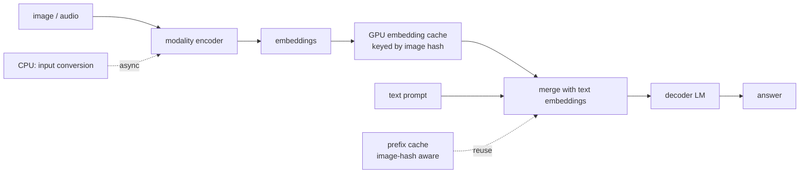
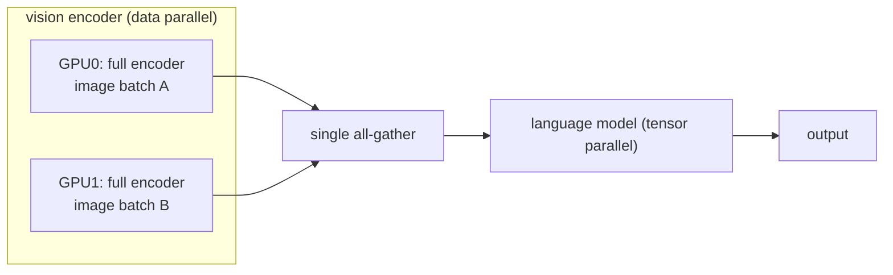
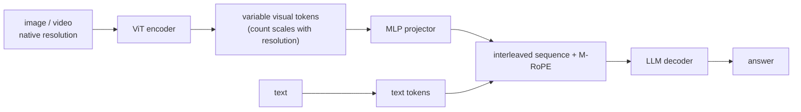
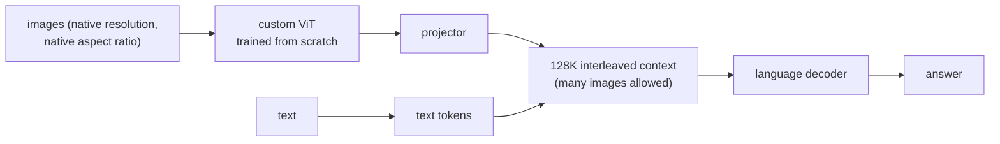
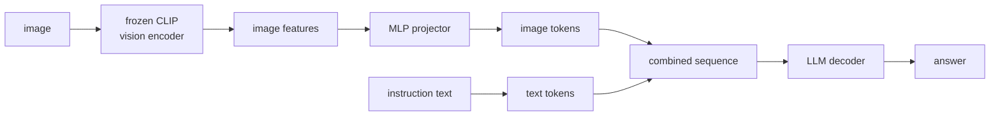
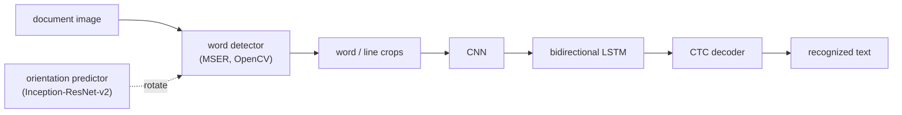
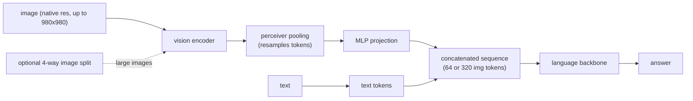
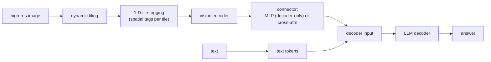

## Multimodal serving

### Red Hat (vLLM): encoder caching and per-image prefix caching in vLLM V1 ([source](https://developers.redhat.com/articles/2025/02/27/vllm-v1-accelerating-multimodal-inference-large-language-models))

vLLM V1 keeps the decoder-only backbone but adds a dedicated encoder path: an image or audio clip is turned into embeddings by its encoder, then those embeddings are merged with text embeddings and fed to the decoder. Three optimizations attack the multimodal cost: multimodal embeddings are computed once and cached on the GPU (with an encoder-aware scheduler that tracks embedding positions so cached data is reused instead of recomputed), prefix caching folds an image hash into the cache key so identical placeholder tokens for different images no longer collide, and input processing is split so a CPU process handles raw-data conversion while a separate GPU process runs the forward pass without stalling. This matters because a single image can explode into thousands of embeddings (Pixtral yields 4,096 for a 1024x1024 image). Offline on 4 H100s, V1 delivers roughly 40 percent higher throughput than V0, with much larger gains on repeated requests once caching is on.

**Interview questions this design invites**
- Why does a placeholder-token prefix cache produce wrong answers for multimodal input, and how does an image hash fix it?
- What do you cache: raw image bytes, encoder output embeddings, or decoder KV, and why?
- How does the encoder-aware scheduler know which cached embeddings belong to which request position?
- What breaks if CPU input conversion and the GPU forward pass are not decoupled?
- When does encoder caching help little or nothing (unique images every request)?
- How do you size the GPU embedding cache against KV-cache memory pressure?

**Tricks and gotchas**
- Prefix caching on multimodal input silently corrupts results unless the cache key includes image content, because placeholder tokens are identical across different images.
- A single high-resolution image can become thousands of embeddings, so encoder output caching is a memory decision, not just a speed one.
- The CPU-to-GPU handoff is a real stall source; async pipelining is what recovers the throughput.

**Common mistakes and how to fix them**
- Assuming text prefix caching just works for images. Fix: key the cache on image hash plus position, not token IDs alone.
- Recomputing encoder output on every turn of a multi-turn chat about one image. Fix: cache encoder embeddings on-GPU and reuse across turns.
- Benchmarking only single requests. Fix: measure repeated-image and high-QPS traffic where the caching wins actually show up.

### AMD (ROCm): batch-level data parallelism for vision encoders in vLLM ([source](https://rocm.blogs.amd.com/software-tools-optimization/vllm-dp-vision/README.html))

Standard tensor parallelism (TP) shards every weight matrix, including the vision encoder, and pays an all-reduce after every transformer block. But vision encoders are tiny relative to the language model (0.2 to 2.3 percent of parameters), so sharding them buys almost no compute while incurring 58 to 126 synchronization points per forward pass. The fix, enabled with `--mm-encoder-tp-mode data`, runs the vision encoder in data-parallel mode: each GPU holds a full copy of the encoder weights and processes a different batch of images independently, with a single all-gather at the end instead of per-layer all-reduces, while the language model keeps using TP. On 8 AMD MI300X GPUs this gave up to plus 43.6 percent throughput on step3 and plus 44.9 percent on InternVL3.5-241B, with the largest wins at medium-to-high resolution (512 to 1024 px) and deeper encoders; a model with a shallow 0.2 percent encoder (Qwen3-VL-235B) gained only about 6 percent.

**Interview questions this design invites**
- Why is tensor parallelism a poor fit for a component that is 1 percent of the parameters?
- What is the communication cost difference between per-layer all-reduce and one final all-gather?
- When would you NOT switch the encoder to data parallelism (memory, very shallow encoder)?
- How does mixing DP encoder and TP decoder affect where images sit in memory before the decoder reads them?
- Why do deeper encoders and higher resolution amplify the win?
- What determines the crossover point where DP stops helping?

**Tricks and gotchas**
- Data parallelism replicates encoder weights on every GPU, so you trade memory for eliminated per-layer sync.
- The win scales with encoder depth and image resolution; a shallow encoder barely moves.
- Batch composition matters: gains were largest at 1 to 3 images per request at medium-high resolution.

**Common mistakes and how to fix them**
- Applying one parallelism strategy uniformly across encoder and decoder. Fix: pick TP vs DP per component by its parameter share and sync cost.
- Assuming sharding always speeds things up. Fix: for tiny modules, sharding adds communication without compute benefit.
- Ignoring resolution when benchmarking. Fix: test across resolutions and image counts, since the benefit is workload-dependent.

### Alibaba (Qwen): Qwen2-VL, native dynamic resolution and variable visual tokens ([source](https://arxiv.org/abs/2409.12191))

Qwen2-VL's central idea is Naive Dynamic Resolution: instead of forcing every image to a fixed input size, it processes images at varying resolutions into different numbers of visual tokens, so a small image becomes few tokens and a large one becomes many. An MLP projector maps vision features into the language embedding space, and Multimodal Rotary Position Embedding (M-RoPE) encodes position jointly across text, image, and video in one unified paradigm, letting the same pipeline handle stills and video. The series probes scaling laws at 2B, 8B, and 72B parameters; the 72B variant reaches results comparable to GPT-4o and Claude 3.5 Sonnet across multimodal benchmarks and beats other generalist models.

**Interview questions this design invites**
- What does variable token count per image buy you over a fixed budget, and what does it cost in batching?
- Why does joint text/image/video position encoding (M-RoPE) matter for video?
- How do you bound worst-case cost if token count grows with resolution?
- How does dynamic resolution interact with KV-cache sizing and prefill latency?
- What changes when you extend the same pipeline from images to video frames?
- How would you cap the token count for a huge image without discarding needed detail?

**Tricks and gotchas**
- Variable token count means requests are heterogeneous in size, which complicates continuous batching and memory planning.
- Dynamic resolution is a quality-cost knob: it lets small images be cheap but does not by itself cap large-image blowup.
- Video reuses the image pipeline, so per-frame token counts multiply fast across a clip.

**Common mistakes and how to fix them**
- Always maxing resolution. Fix: let token count scale with the image so easy inputs stay cheap.
- Forgetting position encoding across modalities. Fix: use a unified scheme (M-RoPE) so image and video positions are consistent with text.
- Assuming fixed-size batching still applies. Fix: plan batching and KV memory for variable-length visual token blocks.

### Mistral AI: Pixtral 12B, a from-scratch ViT ingesting native resolution ([source](https://arxiv.org/abs/2410.07073))

Pixtral 12B pairs a vision encoder trained from scratch with a projector and a language decoder. The encoder ingests images at their natural resolution and aspect ratio rather than resizing to a square, which lets the user trade off how many tokens each image is allowed to become, and it can hold any number of images inside a 128K-token context window. Despite 12B parameters it beats similar-size open models (Llama-3.2 11B, Qwen2-VL 7B) and even outperforms the much larger Llama-3.2 90B while being 7x smaller. The team also released MM-MT-Bench, an open benchmark for evaluating vision-language models in practical scenarios, and shipped the model under Apache 2.0.

**Interview questions this design invites**
- Why train a vision encoder from scratch instead of reusing a frozen CLIP ViT?
- What does a flexible per-image token budget let a serving system do at request time?
- How does a 128K context change the multi-image cost story versus a fixed image cap?
- How can a 12B model beat a 90B one; what does that imply about connector and encoder quality?
- Why ship an accompanying benchmark (MM-MT-Bench) with the model?
- How do native aspect ratios affect the encoder's positional handling?

**Tricks and gotchas**
- Native-resolution ingestion avoids crop/resize artifacts but makes token count image-dependent, so cost varies per request.
- A big context window enables many images but each image still lands in prefill and KV, so total cost stacks.
- A flexible token budget is a serving lever only if the API actually exposes it per request.

**Common mistakes and how to fix them**
- Forcing images to a fixed square. Fix: preserve native resolution and aspect ratio to keep detail for OCR-style tasks.
- Treating a 128K window as free capacity for images. Fix: track that each image's tokens hit prefill and KV memory.
- Equating parameter count with capability. Fix: measure on task benchmarks; a smaller model with a better encoder can win.

### Microsoft (LLaVA): an MLP projector bridging frozen CLIP to an LLM ([source](https://arxiv.org/abs/2304.08485))

LLaVA connects a frozen CLIP vision encoder to a language model through a lightweight MLP projector, so the image becomes a block of tokens the LLM reads alongside the text. Its signature contribution is data, not just architecture: it uses language-only GPT-4 to generate multimodal instruction-following examples, the first attempt to carry instruction tuning from the language domain into vision-language with machine-generated data. On a synthetic multimodal instruction-following dataset LLaVA reaches 85.1 percent of GPT-4's relative score, and fine-tuned on Science QA it hits a then-state-of-the-art 92.53 percent, while showing chat behaviors reminiscent of multimodal GPT-4 on unseen images. It was an oral at NeurIPS 2023 with data, model, and code released.

**Interview questions this design invites**
- Why freeze the CLIP encoder and train only the projector plus LLM?
- What does an MLP projector actually learn to do between feature space and token space?
- How do you generate multimodal instruction data from a text-only model, and what are the risks?
- Why is a fixed 336px CLIP encoder both simple and a cost ceiling for detail?
- How does the projector choice (MLP vs cross-attention) trade off token count and quality?
- What eval would you trust beyond a synthetic instruction-following score?

**Tricks and gotchas**
- A frozen encoder makes training cheap but locks resolution and image-token count at the encoder's fixed size.
- The MLP projector is small, so most of the multimodal quality rides on encoder features and instruction data.
- GPT-4-generated instruction data can inherit hallucinations, since the text model never saw the images.

**Common mistakes and how to fix them**
- Overweighting architecture and underweighting data. Fix: invest in instruction-tuning data quality, which drove LLaVA's gains.
- Expecting fine detail from a 336px fixed encoder. Fix: use a higher-resolution or tiling encoder for OCR-heavy tasks.
- Trusting synthetic instruction scores alone. Fix: also evaluate grounding and task-specific accuracy on real images.

### Dropbox: a productionized deep-learning OCR pipeline ([source](https://dropbox.tech/machine-learning/creating-a-modern-ocr-pipeline-using-computer-vision-and-deep-learning))

Dropbox split OCR into two stages: a word detector using Maximally Stable Extremal Regions (via OpenCV) to find text regions across thresholds and group them into words and lines, then a word deep net that runs each word crop through a CNN, feeds the visual features to a bidirectional LSTM, and decodes text with Connectionist Temporal Classification. They could not get enough labeled data, so they built a synthetic generator (word corpora including Project Gutenberg, roughly 2,000 fonts weighted by real-world frequency, plus geometric and photometric transforms), produced over 10 million synthetic examples, then fine-tuned on about 20,000 real word images to reach mid-90s accuracy. It shipped behind an abstraction layer wrapping both the new model and a legacy commercial engine, gated by the Stormcrow experiment framework and run shadow-mode until parity, then deployed as a CPU service isolated with LXC, cgroups, namespaces, and seccomp, later adding an Inception-ResNet-v2 orientation predictor for rotated pages.

**Interview questions this design invites**
- Why split detection and recognition into two models instead of one end-to-end network?
- Why is CTC the right decoder for variable-length word images?
- How do you build a training set when real labeled OCR data is scarce?
- What does shadow deployment against a legacy engine buy you before cutover?
- Why jail a CPU OCR service with LXC/seccomp; what is the threat model for untrusted uploads?
- How do you detect and correct page orientation before recognition?

**Tricks and gotchas**
- Synthetic data must match real font frequency and photometric variation, or the model overfits to clean renders.
- A tiny real fine-tuning set (about 20K images) on top of 10M synthetic examples is what closes the accuracy gap.
- Different PDF renderers disagree, so cross-renderer testing (e.g. Apple Preview) is needed to avoid silent corruption.

**Common mistakes and how to fix them**
- Training only on real images. Fix: generate synthetic data at scale, then fine-tune on a small real set.
- Cutting straight over from a legacy system. Fix: run shadow mode and confirm parity before switching traffic.
- Running untrusted document uploads in a shared process. Fix: isolate the CPU OCR service with jails, cgroups, and seccomp.

### Hugging Face (Idefics2): encoder plus perceiver pooling plus MLP projection ([source](https://huggingface.co/blog/idefics2))

Idefics2 is an 8B vision-language model built as a three-stage pipeline: vision encoder, then learned Perceiver pooling that resamples the image tokens, then an MLP projection into the language backbone before concatenation with text. It preserves native resolution and aspect ratio up to 980x980 using the NaViT strategy instead of fixed square crops, and optionally splits very large images into 4 sub-images, yielding either 64 or 320 tokens per image depending on mode. The big change from Idefics1 is dropping gated cross-attention for the simpler pool-then-project approach, which, combined with better backbones and stronger OCR training data, let a model 10x smaller (8B vs 80B) jump in performance: 43.5 percent MMMU, 51.6 percent MathVista, 73.0 percent TextVQA, 74.0 percent DocVQA, rivaling models 4 to 34x larger.

**Interview questions this design invites**
- Why replace gated cross-attention with perceiver pooling plus MLP; what is the tradeoff?
- How does resampling to a fixed 64 or 320 tokens bound cost regardless of input size?
- What does the NaViT native-resolution strategy fix versus square cropping?
- When do you enable 4-way image splitting, and what does it cost in tokens?
- How can an 8B model match models 34x larger; what carried the gains?
- Why does OCR performance depend heavily on training-data quality here?

**Tricks and gotchas**
- Perceiver pooling caps image tokens at a fixed count, which bounds cost but can lose detail on dense images.
- Sub-image splitting recovers detail but multiplies token count (up to 320), so it is a per-request decision.
- Simpler connectors can beat fancier ones when backbones and data improve, so do not assume cross-attention is superior.

**Common mistakes and how to fix them**
- Cropping images to a square. Fix: keep native resolution and aspect ratio (NaViT) to preserve information.
- Always splitting large images. Fix: split only when the task needs fine detail, since it raises token count sharply.
- Assuming a heavier connector always wins. Fix: benchmark; pool-then-project matched cross-attention with better data.

### NVIDIA (NVLM): comparing MLP vs cross-attention connectors, with tile-tagging for OCR ([source](https://research.nvidia.com/labs/adlr/NVLM-1/))

NVLM runs a head-to-head comparison of decoder-only multimodal LLMs (LLaVA-style, image tokens spliced into the sequence via an MLP) against cross-attention-based models (Flamingo-style), then designs an architecture that borrows strengths of both to improve training efficiency and reasoning. Its key serving idea is a 1-D tile-tagging design for tile-based dynamic high-resolution images, which tags each tile so the model knows the spatial layout, sharply improving OCR and multimodal reasoning. The released NVLM-D-72B posts state-of-the-art OCRBench and VQAv2 and matches or beats GPT-4o on MathVista, ChartQA, and DocVQA. Notably, after multimodal training the model actually improves on text-only math and coding by 4.3 average points rather than regressing.

**Interview questions this design invites**
- What are the training-efficiency and quality tradeoffs between MLP splicing and cross-attention connectors?
- Why does tiling a high-resolution image need explicit tile tags for OCR to work?
- How does tile-tagging encode spatial layout that the raw tiles lose?
- Why might multimodal training improve, not degrade, text-only math and coding?
- How do you decide tile count per image against the token-budget cost?
- What would you measure to pick a connector for an OCR-heavy product?

**Tricks and gotchas**
- Tiling recovers fine detail but scrambles spatial order unless each tile carries a position tag.
- Decoder-only vs cross-attention is a real tradeoff, not a settled choice; the right pick depends on efficiency and task mix.
- Multimodal training done well can lift text-only skills, so do not assume it always taxes language ability.

**Common mistakes and how to fix them**
- Tiling without tagging. Fix: add tile-position tags so the model can reconstruct layout for OCR and charts.
- Picking a connector by fashion. Fix: compare MLP and cross-attention on your training-efficiency and reasoning targets.
- Fearing multimodal training will hurt text skills. Fix: measure; a good recipe can improve text-only benchmarks.

_Not reachable: none_
