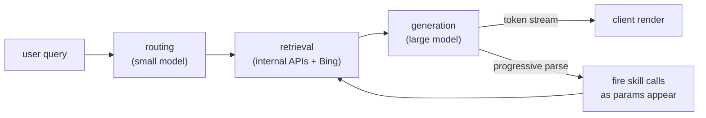
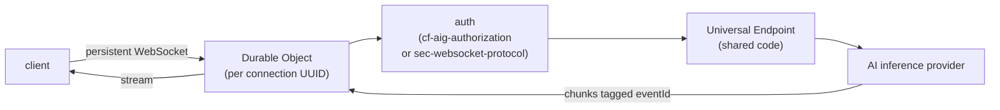
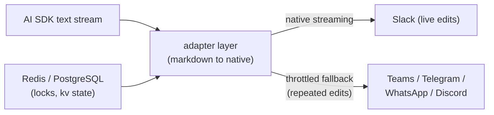
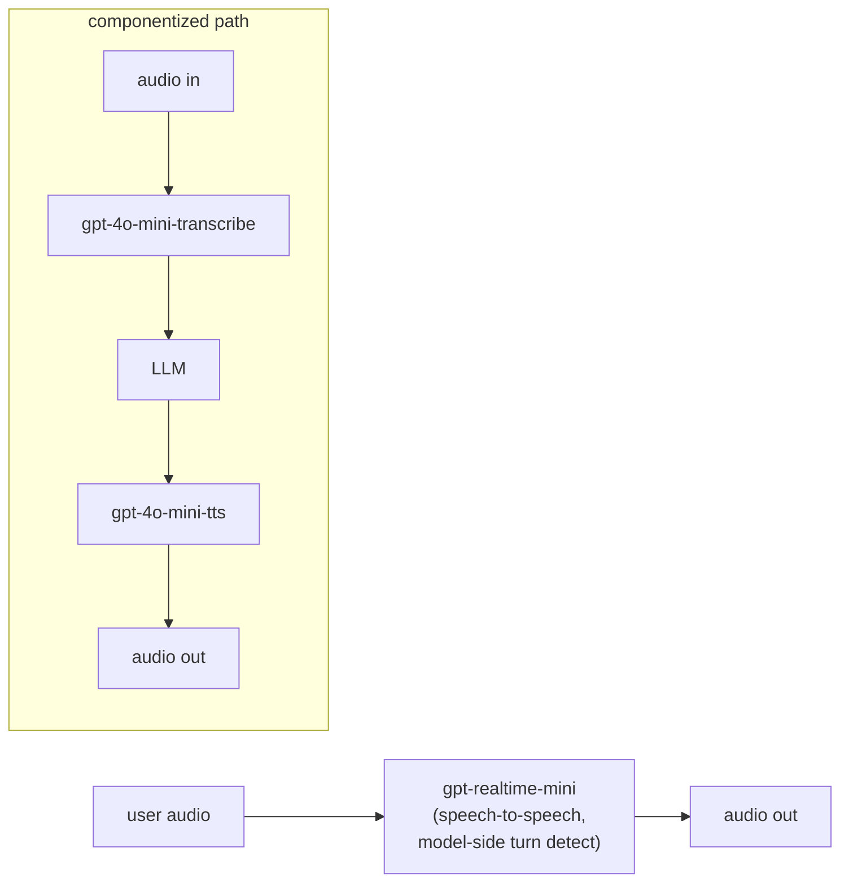
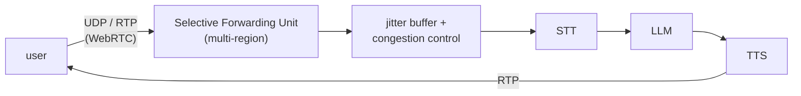
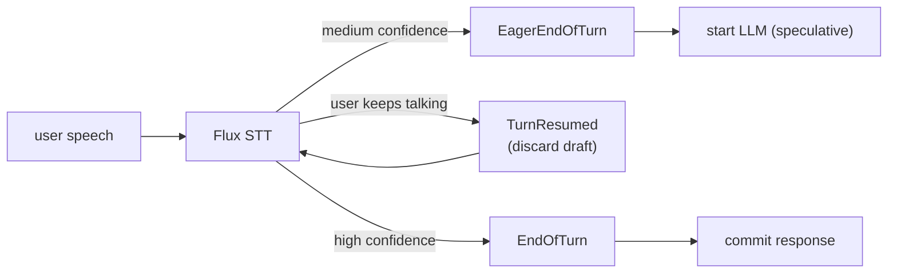
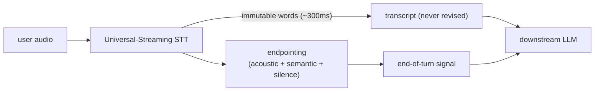
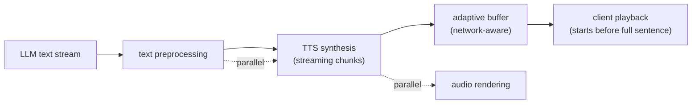

## Realtime streaming chat

### LinkedIn: end-to-end streaming generative AI assistant with progressive parsing ([source](https://www.linkedin.com/blog/engineering/generative-ai/musings-on-building-a-generative-ai-product))

LinkedIn built their assistant on a three-step RAG pattern: a routing step classifies the query and picks an agent, a retrieval step calls internal RPC APIs (wrapped as LLM-friendly "skills") plus external services like Bing, and a generation step synthesizes the answer. They cut perceived latency with end-to-end token streaming and progressive parsing, firing downstream API calls the moment their parameters appear in the LLM output rather than waiting for the full response. They used small models for routing and retrieval and bigger models for generation, and preferred YAML over JSON in schemas to save tokens. Quality was the hard part: one month to reach 80 percent, four more months to pass 95 percent, backed by a layered eval pipeline with linguist annotation of about 500 daily conversations.

**Interview questions this design invites**
- Why route with a small model and generate with a big one instead of one model for both?
- How does progressive parsing of the LLM output reduce end-to-end latency, and what breaks if the partial parse is wrong?
- How do you expose proprietary internal APIs to an LLM safely as "skills"?
- Why did quality take four extra months when 80 percent came in one, and what does that say about eval-driven development?
- How would you detect and bound hallucination in a chat product at scale?
- Chain-of-thought adds hidden reasoning tokens the user never sees; how do you plan capacity for that?

**Tricks and gotchas**
- Progressive parsing means you fire side-effecting API calls before the model has finished; a later token can contradict an early one.
- Defensive parsing matters: initial LLM format-error rate was about 10 percent, driven to roughly 0.01 percent with hardening.
- YAML instead of JSON for schemas measurably cuts token cost on high-volume prompts.
- Reasoning tokens are invisible latency; time-to-first-token can look fine while total generation balloons.

**Common mistakes and how to fix them**
- Waiting for the full LLM response before acting: parse and dispatch incrementally instead.
- One giant model for every stage: split routing/retrieval (cheap, fast) from generation (expensive, high quality).
- Trusting LLM output format: add tolerant parsing and repair, not strict schema rejection.
- Treating eval as an afterthought: stand up human plus model-based eval early or the last 15 percent of quality never lands.

### Cloudflare: Durable Objects for persistent WebSockets and auth in AI Gateway ([source](https://blog.cloudflare.com/do-it-again/))

Cloudflare added a WebSocket API to AI Gateway so clients hold a single persistent connection for many inference requests instead of reopening HTTP connections, backed by Durable Objects that reuse the existing Universal Endpoint code. Because WebSocket traffic is asynchronous and multiple streaming inferences can be in flight at once, they tag every message with an eventId so the client can attribute each chunk to the right request. Auth runs either through Cloudflare API tokens in a cf-aig-authorization header or, for browsers that cannot set custom headers, through the sec-websocket-protocol header. Each connection gets a UUID, and streaming requests send initial metadata, then live chunks, then a completion message, at the scale of 3-plus billion daily logs.

**Interview questions this design invites**
- Why multiplex many inference requests over one WebSocket instead of one connection per request?
- How does eventId solve response attribution when several streams share a duplex socket?
- Why do browsers need the sec-websocket-protocol header trick for auth?
- What does a Durable Object give you that a stateless Worker does not for a long-lived connection?
- How do you clean up a Durable Object when a client disconnects mid-stream?
- How would you rate-limit or bill per-request when everything rides one socket?

**Tricks and gotchas**
- Async duplex sockets make responses ambiguous without an explicit correlation id on every message.
- Browsers cannot set arbitrary headers on a WebSocket handshake, so auth has to ride the subprotocol field.
- Reusing the HTTP Universal Endpoint code inside the Durable Object avoids a divergent second code path.
- A single persistent connection concentrates state, so connection lifecycle and cleanup become the reliability surface.

**Common mistakes and how to fix them**
- Assuming ordered request/response like HTTP: add an eventId and demultiplex on the client.
- Opening a new connection per inference: reuse one persistent socket to cut handshake overhead.
- Forgetting browser header limits: fall back to sec-websocket-protocol for the token.
- Leaking connection state: pin state to a Durable Object with a UUID and tear it down on close.

### Vercel: Chat SDK for cross-platform agent streaming ([source](https://vercel.com/blog/chat-sdk-brings-agents-to-your-users))

Vercel's Chat SDK is a TypeScript library that runs one agent codebase across Slack, Teams, Google Chat, Discord, Telegram, WhatsApp, GitHub, and Linear. It pipes AI SDK text streams straight into each platform through adapters: Slack renders formatting natively in real time, while platforms without live streaming use a throttled fallback that repeatedly edits the message, running streamed text through each adapter's markdown-to-native converter at every intermediate edit. The adapter layer also normalizes channel and user names, link previews, referenced posts, and image context, and it handles platform limits like WhatsApp's 24-hour messaging window. State persists in Redis or PostgreSQL, supporting distributed locks and key-value cache across bot instances.

**Interview questions this design invites**
- Why is a throttled edit-loop fallback needed when a platform lacks native streaming?
- What are the tradeoffs of re-editing one message repeatedly versus appending new messages?
- How do you keep one agent codebase portable across platforms with different formatting models?
- Why put distributed locks in front of shared bot state, and what race do they prevent?
- How does a 24-hour messaging window (WhatsApp) change how you queue outbound tokens?
- Where does session memory live so a conversation survives across bot instances?

**Tricks and gotchas**
- The throttled fallback re-runs markdown-to-native conversion at each intermediate edit, so conversion cost is paid many times per message.
- Rapid message edits can hit platform rate limits; throttling is a correctness constraint, not just polish.
- Different platforms have different native format targets (Block Kit, GFM, code blocks), so one output has many renders.
- Distributed locks are required because multiple instances may touch the same conversation state.

**Common mistakes and how to fix them**
- Assuming every platform streams like Slack: detect capability and fall back to throttled edits.
- Editing on every token: throttle the edit rate to stay under platform limits.
- Keeping bot state in process memory: move to Redis or PostgreSQL so instances share it.
- Ignoring platform send windows: buffer and respect constraints like the 24-hour window.

### OpenAI: realtime speech-to-speech and audio model snapshots for voice ([source](https://developers.openai.com/blog/updates-audio-models))

OpenAI shipped updated audio model snapshots aimed at production voice apps: gpt-realtime-mini for native speech-to-speech over the Realtime API, gpt-audio-mini for speech-to-speech in Chat Completions, plus a mini TTS and a mini transcribe model. The realtime model improved instruction-following by 18.6 percent and tool-calling accuracy by 12.9 percent, the TTS model dropped word error rates by about 35 percent, and the transcribe model cut hallucinations by roughly 90 percent versus Whisper v2 in noisy audio and during silence. Turn detection is handled model-side in the speech-to-speech path rather than by an external endpointer, and pricing stayed flat so existing integrations can migrate by snapshot.

**Interview questions this design invites**
- When do you pick native speech-to-speech over a componentized STT plus LLM plus TTS pipeline?
- What does model-side turn detection buy you versus a separate endpointing model?
- Why do transcription hallucinations spike during silence or background noise, and how do you measure it?
- How do you evaluate instruction-following and tool-calling accuracy for a voice model specifically?
- What is the migration risk of pinning to a dated model snapshot versus a floating alias?
- How does a unified speech-to-speech model change your latency budget versus a three-stage pipeline?

**Tricks and gotchas**
- Native speech-to-speech folds turn detection into the model, removing a tunable external endpointer you might want control over.
- Transcription models hallucinate words during silence; a 90 percent reduction still is not zero.
- Snapshot-pinned models keep behavior stable but require deliberate migration to get gains.
- Speech-to-speech and componentized paths have different debuggability; you cannot inspect an intermediate transcript in the fused model.

**Common mistakes and how to fix them**
- Reaching for a componentized pipeline by default: use native speech-to-speech when you need lowest latency and do not need the intermediate transcript.
- Ignoring silence handling: pick a transcribe model hardened against hallucination in noise, and gate on confidence.
- Floating on an unpinned model: pin a snapshot and test before migrating.
- Assuming tool calls work in voice: measure tool-calling accuracy separately, since it lags text.

### LiveKit: WebRTC over WebSockets for realtime voice agents ([source](https://livekit.com/blog/why-webrtc-beats-websockets-for-voice-ai-agents))

LiveKit argues WebSockets are the wrong transport for voice because they run on TCP, which guarantees ordered delivery by retransmitting lost packets, causing head-of-line blocking: audio that arrived fine sits buffered and unplayed until the gap is filled, and a 200ms retransmit stall destroys conversational flow. WebRTC instead uses UDP with RTP, favoring timing over perfect reliability, so a single lost 20ms frame is barely noticeable. WebRTC also ships adaptive jitter buffers, media-aware congestion control (like Google Congestion Control) that lowers bitrate before loss occurs, built-in echo cancellation and noise suppression, and NAT traversal via ICE, STUN, and TURN. A Selective Forwarding Unit routes media without decoding, and multi-region SFUs let users hit the nearest node to trim latency across the STT, LLM, and TTS pipeline.

**Interview questions this design invites**
- What is head-of-line blocking and why does it hurt voice more than text?
- Why is dropping a 20ms audio frame better than a 200ms retransmit stall?
- What does WebRTC give you out of the box that you would otherwise build (jitter buffer, echo cancel, congestion control)?
- What is an SFU and why forward media without decoding?
- Why keep WebSockets for signaling even when media rides WebRTC?
- How does multi-region SFU placement change the end-to-end latency budget?

**Tricks and gotchas**
- TCP reliability is a liability for audio: retransmission stalls the whole stream, not just the lost frame.
- Congestion control that reacts to loss is too late; WebRTC predicts congestion and lowers bitrate first.
- NAT traversal (ICE/STUN/TURN) is non-trivial and is a reason people wrongly default to WebSockets.
- An SFU forwards without transcoding, so it scales far better than a decode-re-encode mixer.

**Common mistakes and how to fix them**
- Defaulting to WebSockets for audio: use WebRTC/UDP so packet loss does not stall playback.
- Building your own jitter buffer and echo cancellation: use the WebRTC media pipeline that already has them.
- Transcoding media at the server: use an SFU to forward without decoding.
- Ignoring geography: deploy multi-region SFUs so users connect to the nearest node.

### Deepgram: eager end-of-turn to overlap the LLM with speech ([source](https://developers.deepgram.com/docs/flux/voice-agent-eager-eot))

Deepgram's Flux fires an EagerEndOfTurn event when it reaches moderate confidence that the user has stopped speaking, letting the agent start LLM generation on a medium-confidence transcript instead of waiting for the high-confidence EndOfTurn, which can shave hundreds of milliseconds off response time. Two thresholds tune the behavior: eager_eot_threshold triggers speculation earlier at the risk of false starts, and eot_threshold governs the reliable finalization. If the user keeps talking after the eager event, a TurnResumed event cancels the speculation, and the agent discards the draft response and waits for the next turn. The tradeoff is roughly 50 to 70 percent more LLM calls in exchange for lower latency.

**Interview questions this design invites**
- Why start the LLM before you are sure the user finished speaking?
- What happens to the speculative response when TurnResumed fires?
- How do eager_eot_threshold and eot_threshold trade speed against false starts?
- What is the cost of speculation (50 to 70 percent more LLM calls) and when is it worth it?
- How do you make LLM calls cancellable so a discarded draft frees resources?
- How does this interact with barge-in, where the user interrupts the agent?

**Tricks and gotchas**
- Eager triggering is speculation: some fraction of LLM calls are thrown away when the user resumes.
- Lowering the eager threshold cuts latency but raises false-start rate; the two thresholds must be tuned together.
- Discarded drafts still cost tokens and slots, so the LLM call must be genuinely cancelable.
- Overlapping generation with speech only helps if downstream (TTS) can also start and cancel cleanly.

**Common mistakes and how to fix them**
- Waiting for high-confidence end-of-turn before starting: start eagerly on medium confidence and cancel if wrong.
- Firing eager too aggressively: raise eager_eot_threshold if false starts hurt quality.
- Not canceling speculative work: wire TurnResumed to abort the LLM call and free the slot.
- Ignoring the extra LLM spend: budget for 50 to 70 percent more calls before enabling it.

### AssemblyAI: Universal-Streaming immutable transcripts with semantic endpointing ([source](https://www.assemblyai.com/blog/introducing-universal-streaming))

AssemblyAI's Universal-Streaming is a speech-to-text model built for voice agents that emits immutable transcripts in about 300ms: every word is final on first emission and never revised, unlike traditional streaming that emits changeable partials then finals. They report 307ms latency versus a competitor's 516ms, 91 percent word accuracy, and 21 percent fewer errors on alphanumeric data like confirmation codes. Endpointing combines acoustic and semantic features with traditional silence detection rather than relying on silence alone, so the agent detects true end-of-turn without awkward pauses. The service scales from 5 to 50,000-plus concurrent streams, prices at 0.15 dollars per hour of session duration, and drops into LiveKit, Pipecat, Daily, and Vapi.

**Interview questions this design invites**
- Why do immutable transcripts simplify a downstream LLM pipeline versus revisable partials?
- What is lost by never revising a word, and how do you handle a genuine mistake?
- Why combine acoustic and semantic features with silence for endpointing instead of silence alone?
- How does pricing by session duration rather than audio length change capacity planning?
- What does 300ms latency buy you in an interactive voice loop?
- How do you validate 91 percent accuracy on hard cases like alphanumeric confirmation codes?

**Tricks and gotchas**
- Immutable means the model must be confident on first emission; there is no take-back if it is wrong.
- Silence-only endpointing produces awkward pauses; semantic features detect end-of-turn earlier and more naturally.
- Latency numbers are competitive claims (307ms vs 516ms); measure on your own audio.
- Billing on session duration, not audio length, means idle-but-open streams still cost money.

**Common mistakes and how to fix them**
- Reprocessing revisable partials downstream: use immutable transcripts so the LLM never re-reads changed text.
- Endpointing on silence alone: add acoustic plus semantic signals to cut false and late turn detection.
- Assuming accuracy is uniform: test alphanumeric and domain-specific inputs separately.
- Leaving streams open idle: close sessions promptly since billing tracks session duration.

### ElevenLabs: low-latency streaming TTS pipelines for conversational AI ([source](https://elevenlabs.io/blog/enhancing-conversational-ai-latency-with-efficient-tts-pipelines))

ElevenLabs frames low latency as the defining feature of good conversational AI and argues you should stream audio during generation rather than synthesizing a whole response first, so users hear speech before the full sentence is synthesized. They recommend adaptive buffering that adjusts preload to network conditions to avoid gaps and stalls, and parallelizing text preprocessing, synthesis, and audio rendering rather than running them in series. They also advise matching the TTS model to the use case instead of always deploying the heaviest model, trading unnecessary complexity for responsiveness where quality allows.

**Interview questions this design invites**
- Why stream TTS audio chunks instead of synthesizing the full response first?
- What is time-to-first-byte for TTS and why does it dominate perceived latency?
- How does adaptive buffering trade off stall risk against latency?
- When is a lighter TTS model the right call over the highest-quality one?
- How do you parallelize preprocessing, synthesis, and rendering without audio artifacts?
- How does TTS latency compose with STT and LLM latency in the full voice loop?

**Tricks and gotchas**
- Too little buffer causes gaps on jitter; too much buffer adds latency, so buffering must adapt to the network.
- Streaming TTS lets playback begin before the sentence is done, but chunk boundaries can create audible seams.
- Always using the heaviest model needlessly inflates latency; match model to use case.
- Serial preprocess-then-synthesize-then-render wastes time; overlap the stages.

**Common mistakes and how to fix them**
- Synthesizing the whole utterance before playback: stream chunks so users hear the first words immediately.
- Fixed buffer sizes: use adaptive buffering that tracks network conditions.
- Defaulting to the biggest TTS model: pick the lightest model that meets the quality bar.
- Running the pipeline serially: parallelize preprocessing, synthesis, and rendering.

_Not reachable: none_
