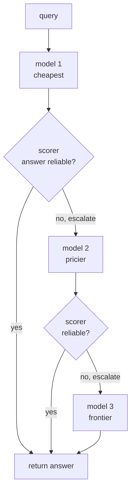
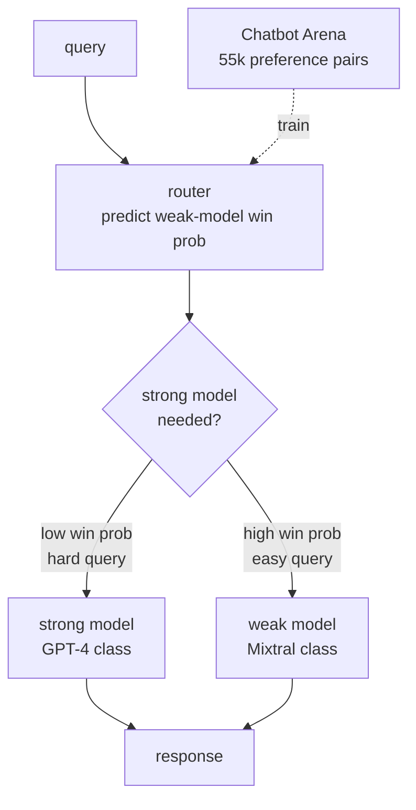
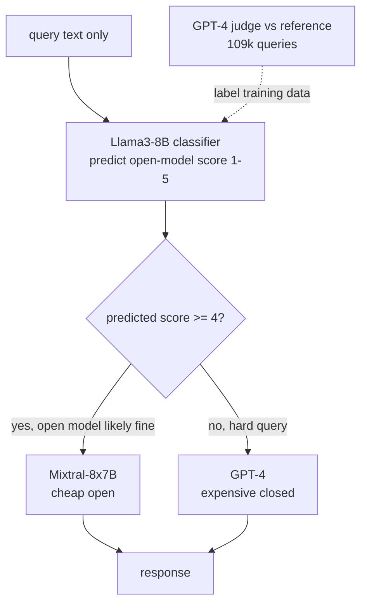
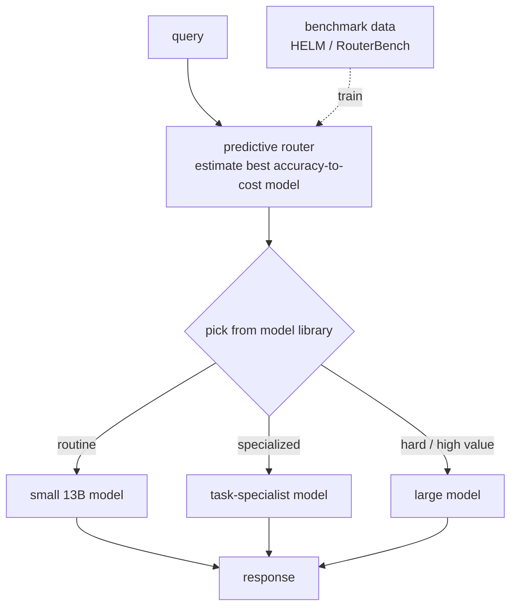
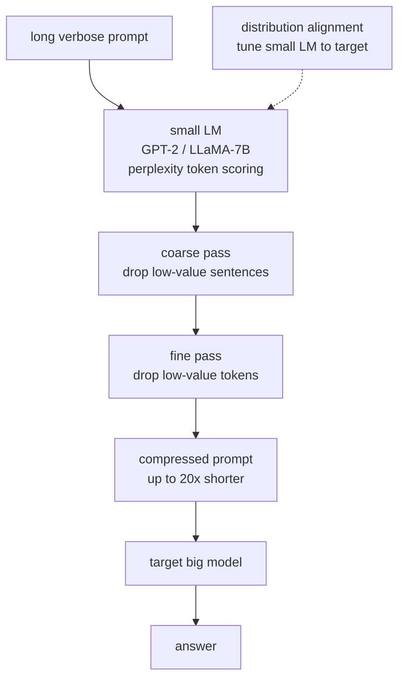
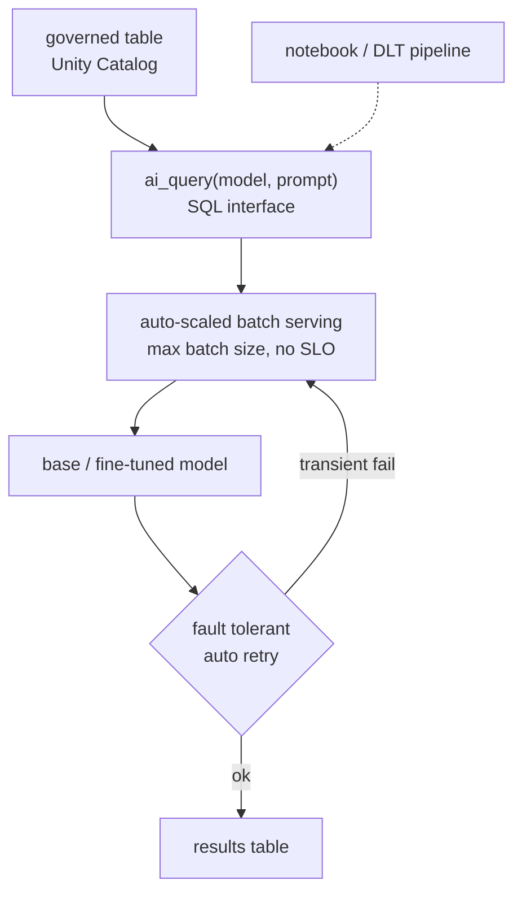
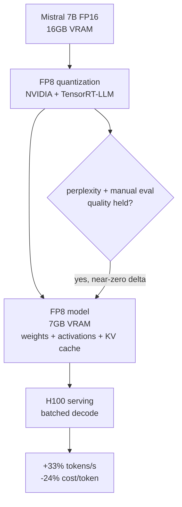
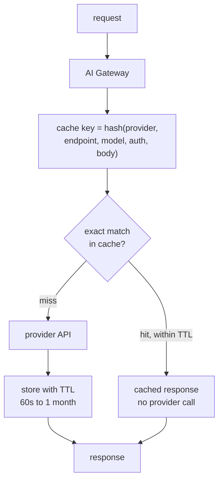

## Cost optimization and model routing

### Stanford: FrugalGPT, an LLM cascade that defers to pricier models only when the cheap answer looks unreliable ([source](https://arxiv.org/abs/2305.05176))

FrugalGPT tackles the fact that LLM APIs vary in price by up to two orders of magnitude, so paying frontier rates on every query wastes money on the easy majority. It instantiates an LLM cascade: queries hit a chain of models ordered cheap to expensive, and a learned scorer judges whether the current model's answer is reliable enough to return or whether to escalate. By learning which model combinations to use per query, it matches GPT-4 quality at up to 98% lower cost, or lifts accuracy 4% over GPT-4 at the same spend. The scorer, trained to predict answer reliability, is the load-bearing piece: it lets the system stop as soon as a cheap model is trustworthy.

**Interview questions this design invites**
- How do you train the reliability scorer, and what labels does it need?
- What happens to end-to-end latency when a query walks the whole cascade?
- How do you order the models in the chain, and does order affect cost?
- How is the accept/escalate threshold calibrated, and how often re-calibrated?
- What tasks make the scorer trustworthy versus where does it break down?
- How do you keep the scorer's own cost from eating the savings?

**Tricks and gotchas**
- The scorer looks at an actual generated answer, unlike a router that decides blind, so it can catch the cheap model's own mistakes.
- A miscalibrated cutoff is the killer: too eager to accept quietly drops quality, too eager to escalate pays for multiple models on everything.
- Verifiable tasks (does the SQL run, does code compile) give a much cleaner escalation signal than open-ended generation.
- Savings depend on the price gap between cascade stages, so pair a genuinely cheap first stage with an expensive last one.

**Common mistakes and how to fix them**
- Reporting only cost while quality silently regresses on the hard tail: track quality per bucket, not just aggregate spend.
- Using model-reported confidence (log-probs) as if it were calibrated truth: prefer a trained scorer or a real verifier where you have ground truth.
- Setting one global threshold and never revisiting it as traffic drifts: re-check on held-out data periodically.

### LMSYS: RouteLLM, a preference-data router that splits traffic between a strong and a weak model ([source](https://www.lmsys.org/blog/2024-07-01-routellm/))

RouteLLM is an open framework that routes each query to either a cheap weak model or an expensive strong one, deciding before any generation. It trains routers on 55k human preference comparisons from Chatbot Arena, learning to predict which model would win on a given prompt and sending only the queries the weak model would likely lose to the strong model. Four router flavors were built: a similarity-weighted Elo ranker, a matrix-factorization model, a BERT classifier, and a causal-LLM classifier. On MT Bench it hits 95% of GPT-4 quality while making GPT-4 calls on only 14% of traffic (about 85% cost cut in the headline case), and the routers transfer to unseen model pairs like Claude 3 Opus and Llama 3 8B without retraining.

**Interview questions this design invites**
- Router versus cascade: why decide blind here instead of scoring an answer first?
- How does a preference-trained router generalize to model pairs it never saw?
- Where do you set the routing threshold, and what curve do you sweep to pick it?
- Which of the four router architectures would you ship, and why?
- What does the router cost per call, and how do you keep it from eating savings?
- How do you detect when the router mis-routes newly-hard queries?

**Tricks and gotchas**
- A router decides once, blind, before seeing any answer, so it cannot know it was wrong; that is exactly what a cascade fixes.
- Preference data lets the router learn transferable "hard versus easy" structure, so it survives model swaps without retraining.
- The router must be strictly cheaper than the models it gates; never make a frontier call just to route.
- Cost savings are quality-conditional: quoting the cost cut without the paired quality number is meaningless.

**Common mistakes and how to fix them**
- Training on stale traffic and never re-sweeping: traffic drift moves the frontier, so re-measure and alert on per-bucket quality.
- Optimizing the router purely for cost so it dumps hard queries on the weak model: load the eval set with the hard tail so this shows as a regression.
- Assuming one benchmark's savings transfer everywhere (MT Bench cut differs from MMLU): measure on your own traffic distribution.

### Anyscale: a fine-tuned complexity classifier routing between an open and a closed model ([source](https://www.anyscale.com/blog/building-an-llm-router-for-high-quality-and-cost-effective-responses))

Anyscale built a router that sends each query to either Mixtral-8x7B (cheap, open) or GPT-4 (expensive, closed) based on predicted difficulty, hitting baseline quality with up to a 70% cost cut on MT Bench. The router is a causal-LLM classifier fine-tuned from Llama3-8B, and a key finding was that plain binary labels gave too weak a training signal, so they trained a 5-way classifier predicting how well the open model would score on a query (1 low to 5 high). Queries the open model is predicted to handle well (score at or above 4) go to Mixtral; the rest go to GPT-4. Training labels came from an LLM-as-a-judge pipeline where GPT-4 graded Mixtral responses against its own reference answers across 109,101 queries.

**Interview questions this design invites**
- Why did binary labels fail, and how does a 5-way score fix the signal?
- What are the risks of labeling training data with an LLM-as-a-judge?
- How do you pick the score cutoff between open and closed models?
- The classifier sees query text only: what quality does that leave on the table?
- How would you keep the Llama3-8B router cheaper than the models it gates?
- How do you monitor for the router mis-scoring newly-hard queries?

**Tricks and gotchas**
- A finer-grained score (1 to 5) carries more gradient than a hard easy/hard bit, giving a more robust router.
- The judge is GPT-4 grading against its own answers, so its blind spots become the router's blind spots.
- The score cutoff is a cost/quality knob: raising it sends more traffic to the cheap model and trades quality for savings.
- A fine-tuned small model beats a giant general one on this narrow routing task at a fraction of the cost.

**Common mistakes and how to fix them**
- Trusting judge labels as ground truth: spot-check against human labels, especially on the hard tail.
- Freezing the cutoff and never re-sweeping as traffic drifts: re-measure the frontier and alert per bucket.
- Assuming the 70% MT Bench cut transfers to every workload (GSM8K numbers differ): validate on your own traffic.

### IBM Research: a predictive best-value router across a library of models ([source](https://research.ibm.com/blog/LLM-routers))

IBM built a real-time router that acts as an "air traffic controller" for an ensemble of models, predicting before inference which one gives the best accuracy-to-cost ratio for a query and dispatching there. The routing algorithm is trained on public benchmark data to learn each model's strengths and weaknesses, so it can send routine work to small cheap models and reserve large models for hard, high-value queries without running several models at once. On HELM and RouterBench, an 11-model ensemble behind the router beat every individual model operating alone and even slightly edged GPT-4 on some tasks. The result is up to 85% inference cost reduction, roughly 5 cents saved per query, exploiting the fact that some 13B models beat Llama-2 70B on specific tasks.

**Interview questions this design invites**
- How do you route across many models rather than a simple strong/weak pair?
- Why can a benchmark-trained router beat every single model in the ensemble?
- How do you keep an 11-model library evaluated and from silently drifting?
- What does "best value" mean, and how do you weigh price against accuracy?
- How does routing on benchmark data generalize to live production queries?
- How do you add or retire a model from the library without retraining everything?

**Tricks and gotchas**
- Specialization beats size on narrow tasks: a well-matched 13B model can outscore a 70B general model, which is what the router monetizes.
- Predicting best-value before inference avoids the cost of racing models, unlike a cascade that pays for a first call.
- More models means more surfaces to evaluate and keep from drifting; the operational cost is real.
- Training on benchmarks risks a gap with production traffic; the benchmark distribution may not match live intent.

**Common mistakes and how to fix them**
- Assuming benchmark-trained routing holds on live traffic: shadow-evaluate a sample and monitor per-model quality.
- Ignoring model drift across a big library: schedule periodic re-evaluation of each model's strengths.
- Chasing headline cost cuts without a per-query quality floor: track cost per successful request, not raw spend.

### Microsoft Research: LLMLingua, prompt compression that strips low-information tokens ([source](https://www.microsoft.com/en-us/research/blog/llmlingua-innovating-llm-efficiency-with-prompt-compression/))

LLMLingua cuts the input-token bill by removing unimportant tokens from a prompt before it reaches the big model, using a small LM (GPT-2 small or LLaMA-7B) to score token importance by perplexity. It works in two stages: a coarse pass drops whole low-value sentences, then a fine pass compresses remaining tokens individually while preserving coherence, with a distribution-alignment step that instruction-tunes the small model to match the target LLM's patterns. On reasoning benchmarks (GSM8K, BBH) it reaches up to 20x compression with about a 1.5-point performance loss and 20 to 30% lower latency. It ships integrated into LlamaIndex for RAG.

**Interview questions this design invites**
- When does prompt compression pay off, given the small-LM pass has its own cost?
- How do you keep compression from dropping the one load-bearing token?
- Why a two-stage coarse-then-fine approach instead of one pass?
- How do you set and gate the compression ratio against a quality bar?
- On which tasks would you refuse to compress at all?
- How does distribution alignment help the compressed prompt survive a model swap?

**Tricks and gotchas**
- Compression only pays when input tokens dominate and context is long and redundant; on short prompts the small-LM pass is pure overhead.
- It is lossy: aggressive ratios can remove the exact detail the answer hinged on.
- Back off on exact extraction, legal, and code where every token matters.
- Trimming (send top 3 chunks not top 20) is the blunt safe move to try before compression.

**Common mistakes and how to fix them**
- Applying one fixed ratio everywhere: gate the ratio behind the same quality eval as any other lever.
- Compressing output-heavy workloads where input is not the cost driver: profile where the money goes first.
- Ignoring the compressor model's own token cost in the savings math: net it out before claiming a win.

### Databricks: governed batch LLM inference over warehouse data via ai_query ([source](https://www.databricks.com/blog/introducing-simple-fast-and-scalable-batch-llm-inference-mosaic-ai-model-serving))

Databricks added batch LLM inference to Mosaic AI Model Serving so teams can run models over millions or billions of tokens directly where governed data lives, with no data movement. The interface is a single SQL function, ai_query, callable from notebooks, SQL editors, or scheduled Delta Live Tables pipelines, so analysts run bulk inference without standing up serving infrastructure. Governance flows through Unity Catalog for lineage and security, and the platform auto-scales to the workload, batches whole datasets instead of row-by-row, and adds fault tolerance with automatic retries. This is the batch-versus-online cost lever: bulk work with no latency SLO runs at maximum batch size for far less than interactive pricing.

**Interview questions this design invites**
- Which traffic is truly offline and belongs on a batch endpoint, not the sync one?
- Why does batching whole datasets cost less per token than online serving?
- How does keeping inference next to governed data reduce compliance risk?
- What latency do you trade away for the batch discount, and when is that acceptable?
- How does auto-scaling plus retries change the cost and reliability profile?
- How would you decide batch API versus saturated self-host for a bulk job?

**Tricks and gotchas**
- A lot of "LLM bill" is bulk work accidentally sitting on the interactive endpoint; spotting it is the design win.
- No tail-latency constraint means the GPU can run at max batch size, which online serving never achieves.
- Keeping data in place avoids export/compliance overhead that would otherwise erode the savings.
- Auto-retry matters at scale: a single transient failure in a billion-token job should not restart everything.

**Common mistakes and how to fix them**
- Running summarization/classification backfills on the online endpoint at online prices: move them to batch.
- Assuming batch means unbounded delay: right-size the job so results land inside the business deadline.
- Skipping governance on bulk jobs over sensitive tables: route through Unity Catalog for lineage and access control.

### Baseten: FP8 quantization for cheaper, faster self-hosted inference ([source](https://www.baseten.co/blog/33-faster-llm-inference-with-fp8-quantization/))

Baseten quantized Mistral 7B to FP8 (8-bit float) using an NVIDIA library compatible with TensorRT-LLM, targeting H100 and Ada/Hopper GPUs that support the format natively. FP8 halves parameter width from 16-bit to 8-bit, dropping VRAM from 16GB to 7GB and, unlike the INT8 they tried before, keeps enough dynamic range to quantize weights, activations, and KV cache without hurting quality. Versus FP16 on H100 they measured a 33% gain in output tokens per second, 31% higher total throughput, 8.5% lower time to first token, and 24% lower cost per million tokens. Quality held: perplexity matched FP16 (near-zero delta) and manual side-by-side across recall, coding, and creative writing showed only minor stylistic variation. This is a self-hosting-only lever; it changes tokens-per-GPU, not per-token API pricing.

**Interview questions this design invites**
- Why does FP8 speed up decode, and why is decode bandwidth-bound?
- Why did FP8 beat INT8 for this workload despite the same bit width?
- How do you validate that quantization did not silently degrade quality?
- Why is this lever useless on a per-token API and only real when self-hosting?
- At what QPS does fixed GPU cost beat per-token API pricing?
- Why does FP8 help more on long input sequences with heavy prefill?

**Tricks and gotchas**
- FP8's wider dynamic range versus INT8 is what lets you quantize activations and KV cache, not just weights.
- Gains depend on batch size and sequence length; the headline number is one operating point (batch 32, 80/100 tokens).
- Perplexity parity plus manual eval catches regressions a single metric would miss.
- The lever only exists for models you host; on an API your levers are routing, caching, compression, right-sizing.

**Common mistakes and how to fix them**
- Quoting a throughput gain from one batch/sequence config as if universal: report the operating point and sweep it.
- Shipping a quantized model on perplexity alone: add manual side-by-side on real task categories.
- Self-hosting below the QPS where fixed GPU cost pays off: stay on the API until volume justifies idle-GPU cost.

### Cloudflare: AI Gateway response caching to skip billable provider calls ([source](https://developers.cloudflare.com/ai-gateway/features/caching/))

Cloudflare AI Gateway sits in front of provider APIs and serves identical requests from cache instead of re-hitting the origin, cutting both latency and the number of paid provider calls. The cache key is a hash of provider, endpoint, model, auth headers, and the full request body, so it is exact-match: any variation creates a new entry. Three per-request headers give control: cf-aig-skip-cache bypasses the cache, cf-aig-cache-ttl sets expiry from 60 seconds to a month, and cf-aig-cache-key customizes what counts as identical. It covers text and image responses today, with semantic caching noted as planned to lift hit rates beyond exact match. The cache is volatile, so two simultaneous identical requests may not both hit.

**Interview questions this design invites**
- Why does an exact-match cache rarely fire on free-text prompts?
- What goes into the cache key, and why include auth headers and full body?
- How would you extend this to a semantic cache, and what new risk appears?
- How do you choose a TTL, and which content should never be cached?
- Why is caching scoped or personalized responses into a shared cache dangerous?
- How do concurrent identical requests interact with a volatile cache?

**Tricks and gotchas**
- Exact-match is zero-risk but low hit rate; the real hit rate lives in paraphrases a semantic cache would catch.
- Including the full request body and params in the key means one trivial difference misses the cache entirely.
- TTL is the staleness control: cache stable content (policies, definitions), TTL things that move.
- Never share-cache personalized or tenant-scoped answers; that is a data leak, not a cost win.

**Common mistakes and how to fix them**
- Expecting big savings from exact-match on free text: layer a tuned semantic cache for paraphrase hits.
- Caching volatile facts without a TTL: set expiry so moved facts do not serve stale.
- Sharing a cache across users/tenants for scoped answers: scope the cache key or skip caching those requests.

_Not reachable: none_
