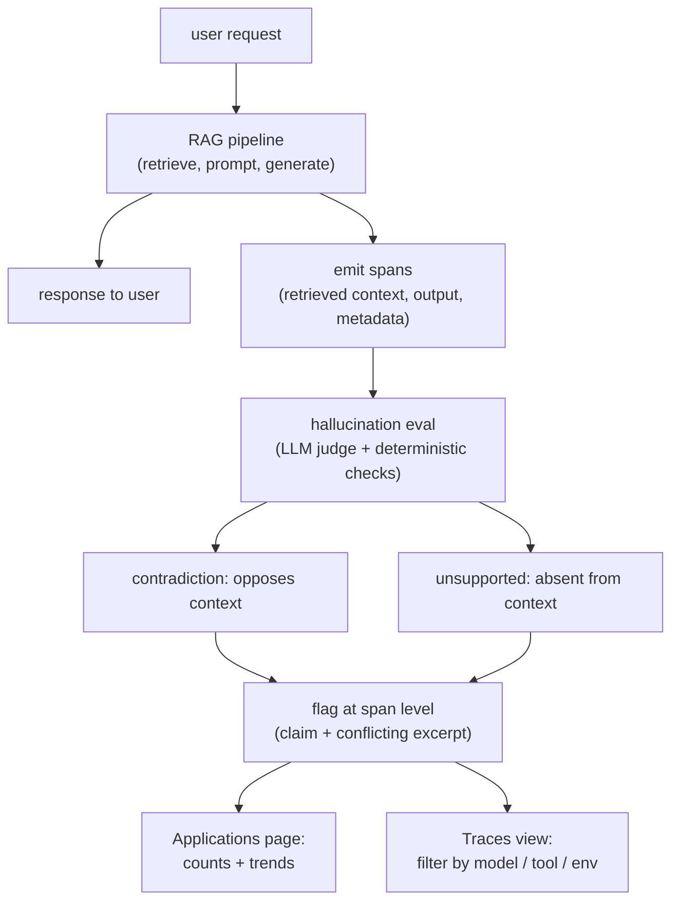
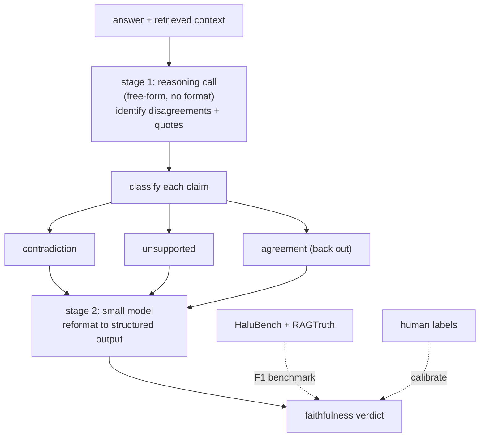
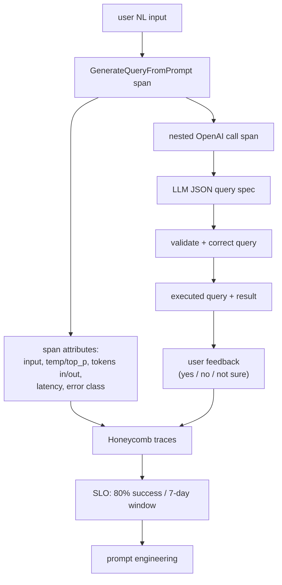
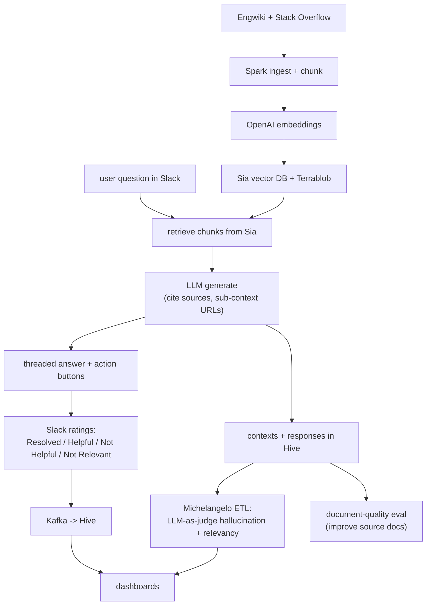
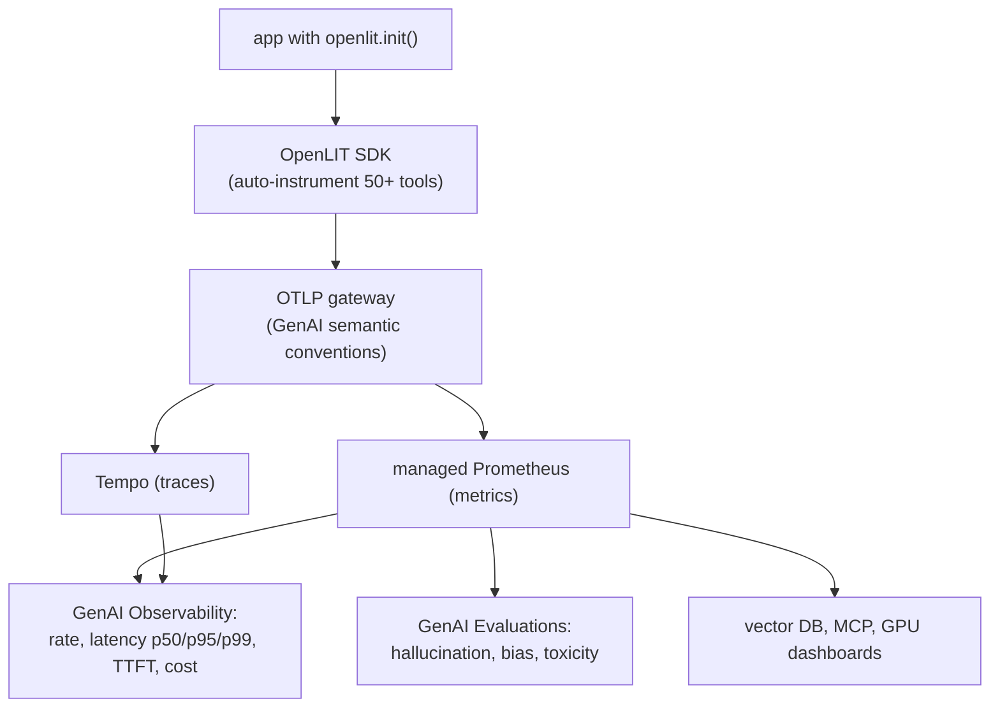
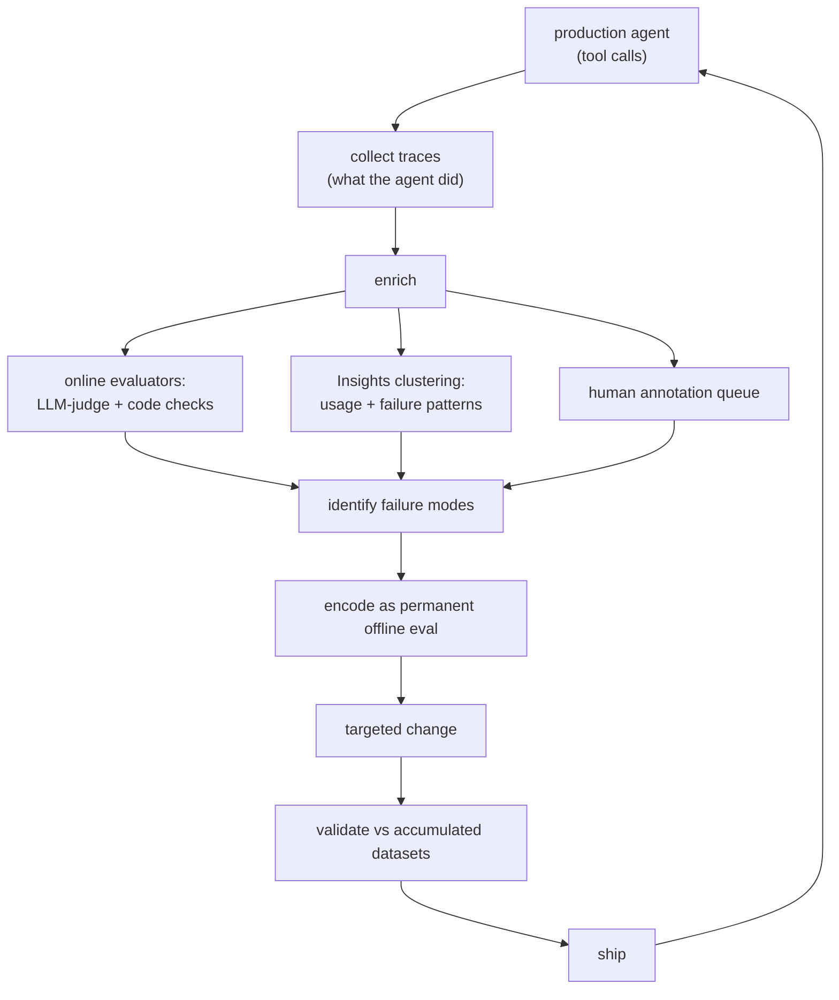
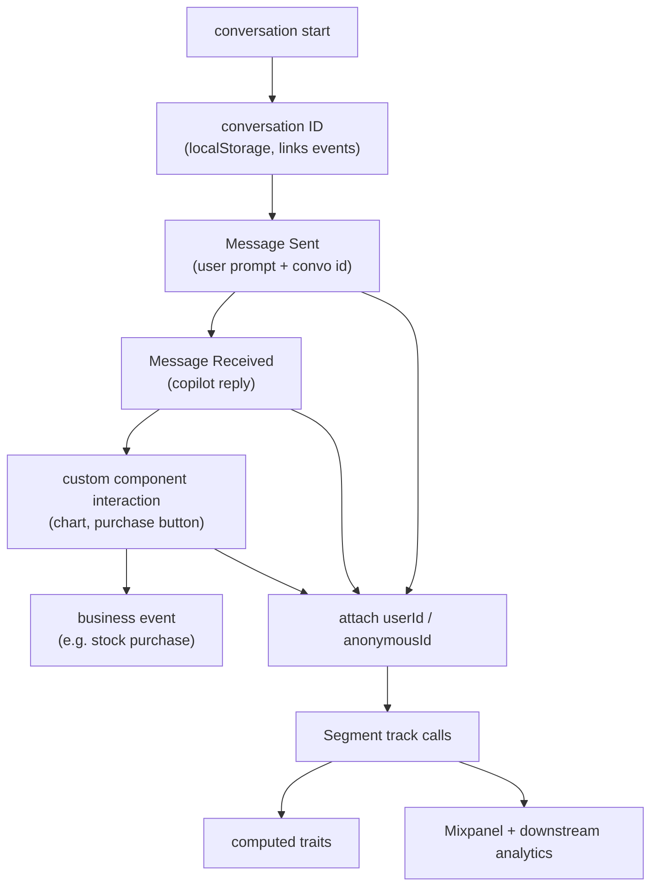

## Production monitoring and observability

### Datadog: hallucination detection for production RAG apps ([source](https://www.datadoghq.com/blog/llm-observability-hallucination-detection/))

Datadog ships hallucination detection as an out-of-the-box evaluation in LLM Observability. It compares a generated response against the retrieved context and flags two categories at the span level: contradictions (claims that oppose the context) and unsupported claims (facts not grounded in the context). The detector blends an LLM-as-a-judge with deterministic non-AI checks for higher accuracy, and surfaces the specific hallucinated claim, the conflicting source excerpt, and the request metadata so an on-call engineer can jump straight to the offending span. Aggregate counts and trends live on an Applications page, while the Traces view lets teams filter by model, tool call, and environment.

**Interview questions this design invites**
- Why distinguish contradiction from unsupported claim, and how does each map to a different fix?
- Why check against retrieved context rather than against ground truth or the open world?
- Where do the deterministic non-AI checks help that an LLM judge alone would miss?
- How do you avoid the judge itself hallucinating a false positive?
- What span fields must be logged at serving time for this eval to be possible later?
- How would you alert on a hallucination spike versus a single flagged event?

**Tricks and gotchas**
- The retrieved context must be captured verbatim on the span, or the grounding check is impossible after the fact.
- "Unsupported" is not the same as "false": an answer can be true yet ungrounded, which the system still flags.
- Running the eval on every request doubles cost, so it is sampled and runs async off the serving path.
- Quoting the exact hallucinated claim (not the whole answer) is what makes triage fast on long outputs.

**Common mistakes and how to fix them**
- Treating any judge disagreement as a bug rather than calibrating the judge against human labels first.
- Alerting on single events instead of trending the ungrounded rate and alerting on the delta.
- Logging only the final answer and dropping the context, so root cause is unrecoverable; log context per span.
- Assuming a factually correct answer is grounded; score entailment against context, not truth.

### Datadog: benchmarking an LLM-as-a-judge faithfulness detector ([source](https://www.datadoghq.com/blog/ai/llm-hallucination-detection/))

This companion writeup details how Datadog built and validated the judge. They chose a black-box LLM-as-judge (works with any model provider, avoids the cost of perturbation methods) and leaned on the principle that LLMs are better at guided summarization than complex reasoning. The rubric asks the judge to identify disagreement claims, extract supporting quotes from both context and answer, and classify each as contradiction, unsupported, or agreement (so it can back out of a false flag). Two-stage prompting splits free-form reasoning from a second smaller-model call that reformats into structured output, avoiding the accuracy hit of strict format enforcement. On HaluBench and RAGTruth their GPT-4o approach scored 0.810 F1 on both, beating baselines including Patronus Lynx 8B, with the smallest F1 drop between the two benchmarks.

**Interview questions this design invites**
- Why split reasoning and formatting into two calls instead of one structured-output prompt?
- Why frame the task as guided summarization with quote extraction rather than open reasoning?
- What does adding an explicit "agreement" class buy you over a binary supported/unsupported?
- How do you interpret an 0.810 F1: is it good enough to alert on, and against what baseline?
- HaluBench is partly synthetic and RAGTruth is human-labeled; why does the gap between them matter?
- How would you keep the judge calibrated as production traffic drifts from the benchmark?

**Tricks and gotchas**
- Strict structured-output constraints degrade reasoning quality, so reasoning runs unconstrained and formatting is a separate cheap pass.
- Extracting supporting quotes keeps the judge grounded in actual text and reduces invented rationales.
- Synthetic benchmark scores overstate real-world performance; the human-labeled RAGTruth gap is the honest number.
- Black-box judging generalizes across providers but forfeits token-probability signals a white-box method could use.

**Common mistakes and how to fix them**
- Trusting one benchmark's F1; report performance on both synthetic and human-labeled sets and watch the drop.
- Forcing one giant structured prompt and blaming the model for weak reasoning; separate the stages.
- Shipping the judge without a "back out" path, so it over-flags; let it reclassify to agreement on reflection.
- Assuming the judge is a fixed instrument; re-benchmark and recalibrate as the domain shifts.

### Honeycomb: observability-driven Query Assistant ([source](https://www.honeycomb.io/blog/improving-llms-production-observability))

Honeycomb wraps their natural-language Query Assistant LLM calls in OpenTelemetry spans, one span around the query-generation function with a nested span for the OpenAI call, adding the instrumentation in roughly one line. Each span carries the user's natural-language input, prompt config (temperature, top_p), schema column count, the raw LLM JSON output, the corrected executed query, thumbs feedback, split input/output token counts, latency, and every error class (API failures, JSON parse errors, query validation failures). They mine this telemetry to spot malformed queries and schema truncation from token limits, and track an SLO of 80 percent success over seven-day windows to guide prompt engineering.

**Interview questions this design invites**
- What is the minimum set of span attributes needed to debug a bad NL-to-query generation?
- Why log both the raw LLM output and the corrected executed query separately?
- How do you define "success" for an SLO when there is no ground-truth label on production queries?
- How do error classes (parse vs validation vs API) change where you look for a regression?
- Why is schema column count worth logging as a span attribute?
- How do thumbs feedback and the SLO interact, given feedback is sparse and self-selected?

**Tricks and gotchas**
- Splitting input and output token counts is what lets you catch schema truncation from a context limit.
- The corrected query differs from the raw LLM output; logging only one hides either model errors or fixup logic.
- A seven-day SLO window smooths daily noise but can lag a fast regression; pair it with alerting on error rates.
- One-line span creation is cheap only if you resist logging full verbatim prompts everywhere at scale.

**Common mistakes and how to fix them**
- Logging just latency and status and missing the input/output payloads needed to reproduce a failure.
- Reading thumbs as an accuracy percentage; treat explicit feedback as directional and cross-check with the SLO.
- Ignoring error taxonomy and lumping all failures together; separate parse, validation, and API errors.
- Setting an SLO with no path from breach to action; wire the signal back into prompt iteration.

### Uber: Genie Gen AI on-call copilot ([source](https://www.uber.com/us/en/blog/genie-ubers-gen-ai-on-call-copilot/))

Genie is a Slack-deployed RAG copilot answering engineering on-call questions across 154 channels; it has handled over 70,000 questions at a 48.9 percent helpfulness rate. It ingests internal wikis and Stack Overflow via Spark, embeds chunks with an OpenAI model into Uber's Sia vector store plus Terrablob, retrieves per query, and generates with explicit source-citation instructions and sub-context sections carrying source URLs to curb hallucination. Slack buttons (Resolved, Helpful, Not Helpful, Not Relevant) stream feedback through Kafka into Hive for dashboards, and a separate Michelangelo ETL pipeline runs LLM-as-a-judge hallucination and relevancy evals over stored contexts and responses, plus a document-quality workflow that suggests source-doc improvements.

**Interview questions this design invites**
- Why does Genie stream feedback through Kafka to Hive rather than scoring inline on the serving path?
- What does the four-way rating scheme (Resolved / Helpful / Not Helpful / Not Relevant) capture that thumbs cannot?
- Why run hallucination and relevancy evals in a separate ETL instead of at request time?
- How does a document-quality workflow improve RAG answers without touching the model?
- What does a 48.9 percent helpfulness rate actually tell you, and how would you raise it?
- Why require source-URL citations in the prompt, and how do you verify the model obeyed?

**Tricks and gotchas**
- Storing contexts and responses in Hive is what makes a later offline judge eval possible; without it the eval has no input.
- Retrieval quality is capped by source-doc quality, so a doc-improvement loop is part of the eval, not a side project.
- Slack ratings are self-selected; helpfulness rate is directional, not a clean accuracy metric.
- Sub-context URL injection curbs but does not eliminate hallucination; the judge eval still runs downstream.

**Common mistakes and how to fix them**
- Blocking the user request on eval; decouple via streaming feedback and an async ETL judge pipeline.
- Blaming the model for wrong answers when the source docs are stale; add a document-quality feedback loop.
- Treating a single helpfulness number as the whole story; join it with hallucination and relevancy evals.
- Prompting for citations but never checking them; verify cited sources against the retrieved context.

### Grafana Labs: LLM production dashboards with OpenLIT and OpenTelemetry ([source](https://grafana.com/blog/ai-observability-llms-in-production/))

Grafana Cloud provides AI observability by auto-instrumenting GenAI calls with the OpenLIT SDK, which emits OpenTelemetry traces and metrics following GenAI semantic conventions. An OTLP gateway routes data to managed Prometheus (metrics) and Tempo (traces). The GenAI Observability dashboard tracks request rate, latency percentiles, time-to-first-token, and total and average cost per request via metrics like gen_ai_usage_cost_USD_sum; a GenAI Evaluations dashboard summarizes hallucination, bias, and toxicity flags; further dashboards cover vector DB ops, MCP server health, and GPU. Onboarding is minimal: install the integration, pip install OpenLIT, call openlit.init(), export OTLP credentials, and run.

**Interview questions this design invites**
- Why standardize on GenAI semantic conventions rather than ad-hoc span attributes?
- Why report latency percentiles (p50/p95/p99) and TTFT instead of a mean response time?
- How is per-request cost derived from span attributes, and why is it a first-class dashboard?
- What is the split of responsibility between Prometheus metrics and Tempo traces here?
- Why might a "better" model that doubles TTFT or triples cost still be a regression?
- How would you extend auto-instrumentation to a framework OpenLIT does not cover?

**Tricks and gotchas**
- Mean latency hides the tail; users feel p95/p99 and TTFT in a streaming UI, so track those.
- Auto-instrumentation is low-effort but you still choose sampling and retention, or log volume explodes.
- Cost and tokens are span attributes, not a separate billing system; derive dashboards from the trace.
- Semantic conventions are what let traces flow into an existing OTel stack without a bespoke schema.

**Common mistakes and how to fix them**
- Watching mean latency and missing a tail regression; chart percentiles and TTFT separately.
- Judging a model swap on answer quality alone; add cost and latency to the comparison before shipping.
- Emitting custom span names that break dashboards; follow GenAI semantic conventions from the start.
- Instrumenting everything at full fidelity; sample and truncate, keeping full detail only on flagged traces.

### LangChain: the agent improvement loop starting with a trace ([source](https://www.langchain.com/blog/traces-start-agent-improvement-loop))

LangChain frames systematic agent improvement as a loop anchored on production traces: collect traces, enrich them, find failure patterns, make targeted changes, validate offline, ship, repeat. The premise is that code says what an agent is allowed to do while traces show what it actually did. Enrichment combines automated online evaluators (LLM-as-judge for qualitative dimensions, code checks for deterministic behavior) and Insights clustering that surfaces unexpected usage, with human annotation queues for the nuanced failures automated scoring misses. Every encoded failure mode becomes a permanent offline eval, so updated agents run against accumulated datasets before shipping to prevent regressions; online evals watch live drift while offline evals validate fixes.

**Interview questions this design invites**
- Why are traces, not code, the starting point for improving an agent?
- What belongs to an LLM-judge online eval versus a deterministic code check?
- How does clustering (Insights) find failures you did not think to write an eval for?
- Why must every production failure become a permanent offline eval?
- Where do human annotation queues add signal that automated evaluators cannot?
- How do online and offline evals divide the work of catching drift versus validating a fix?

**Tricks and gotchas**
- An agent trace must capture every tool call with args, result, and error, or step-level failures are invisible.
- Offline evals only prevent regressions if failures are added permanently, not fixed and forgotten.
- LLM-judge online evals carry the usual biases; pair with code checks for anything deterministic.
- Clustering surfaces unknown-unknowns, but someone still has to triage clusters into named failure modes.

**Common mistakes and how to fix them**
- Debugging from code alone; read the trace to see what the agent actually did under real inputs.
- Fixing a failure without encoding an eval, so it silently regresses later; add it to the permanent suite.
- Relying only on automated scoring in a specialized domain; route nuanced cases to human annotation.
- Validating a change only online; run it against accumulated offline datasets before shipping.

### Twilio Segment: instrumenting user insights for an AI copilot ([source](https://www.twilio.com/en-us/blog/insights/ai/instrumenting-user-insights-for-your-ai-copilot/))

Twilio Segment instruments its AI copilot with the Node.js SDK against a standardized "AI Copilot spec" that captures the full interaction journey into product analytics. A conversation-start generates a conversation ID (persisted in localStorage) linking all events; user prompts become "Message Sent" events, model replies become "Message Received", and interactions with custom UI components (charts, purchase buttons) log component type and properties, translating UI actions into business events like a stock purchase. Every track call carries a userId or anonymousId for cross-session and cross-device attribution, and the data feeds computed traits and downstream tools like Mixpanel for engagement analysis.

**Interview questions this design invites**
- Why standardize on an "AI Copilot spec" of events rather than ad-hoc logging per feature?
- What does a conversation ID buy you over per-message events alone?
- How do implicit engagement signals (component clicks, business events) complement explicit feedback?
- Why attach userId or anonymousId to every event, and what does it enable downstream?
- How would you turn these product-analytics events into a quality signal for the copilot?
- What is the boundary between product analytics here and an LLM trace/observability store?

**Tricks and gotchas**
- A stable conversation ID in localStorage is what stitches multi-message, multi-component sessions together.
- Component and business events are dense implicit signals; they are more honest than sparse thumbs.
- Product-analytics events capture engagement but not grounding or faithfulness; they are not a hallucination check.
- Identity on every call (userId or anonymousId) is required for cross-device attribution, easy to forget client-side.

**Common mistakes and how to fix them**
- Logging messages but not linking them; generate and persist a conversation ID to reconstruct sessions.
- Tracking only explicit feedback; capture implicit engagement (edits, component clicks, retries) which is denser.
- Dropping identity on client-side events; always attach userId or anonymousId for attribution.
- Confusing product analytics with LLM observability; pair engagement events with grounding and judge signals.

_Not reachable: none_
