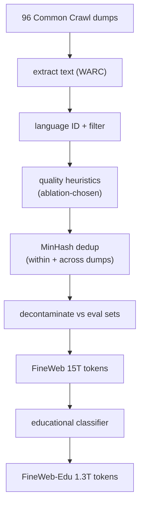
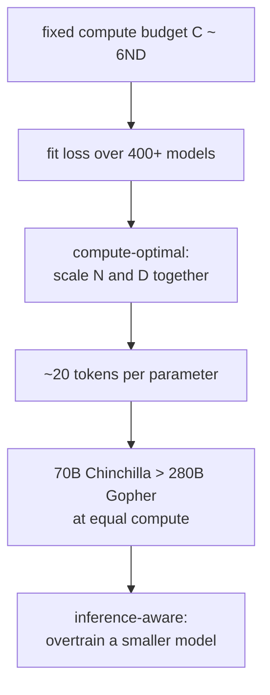
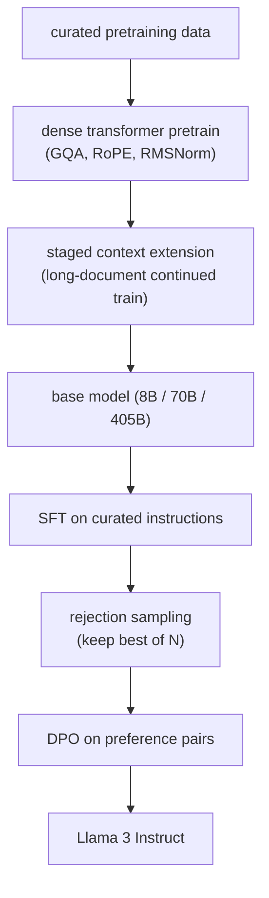
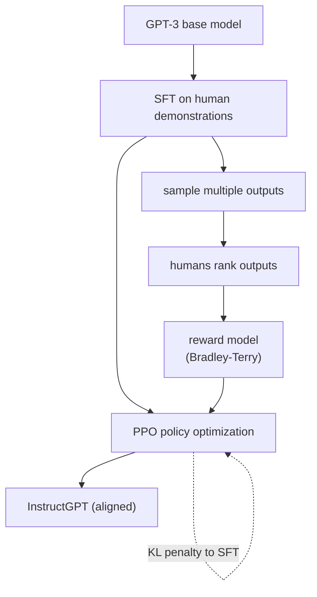
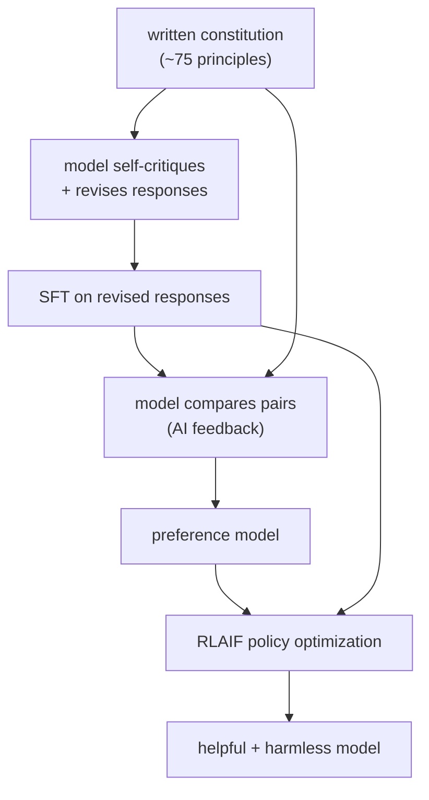
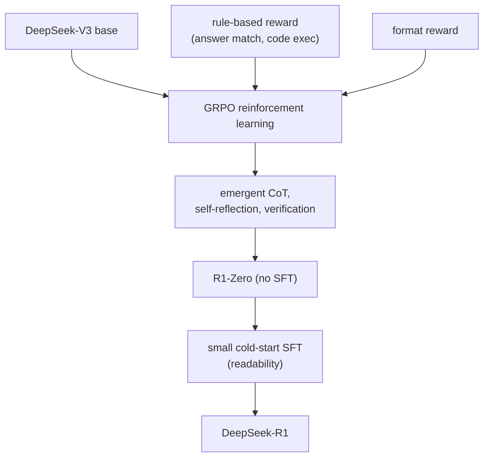
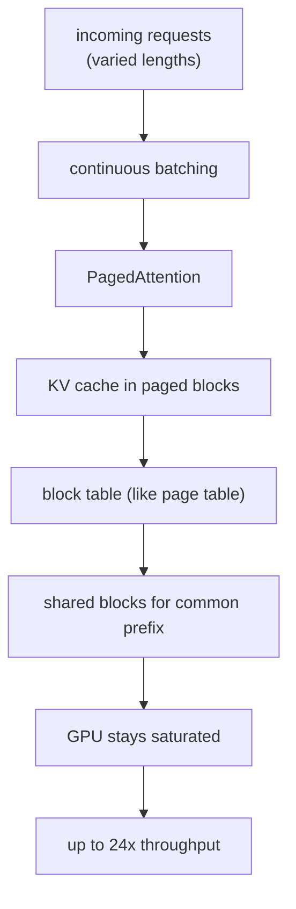
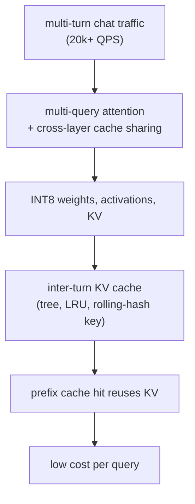

## LLM lifecycle

### Hugging Face: FineWeb, a decontaminated open pretraining corpus ([source](https://huggingface.co/spaces/HuggingFaceFW/blogpost-fineweb-v1))

FineWeb turns 96 Common Crawl snapshots into a 15-trillion-token English pretraining set that trains better models than prior open corpora. The recipe is a pipeline, not a dataset: text extraction from WARC, language identification, a small set of quality heuristics chosen by ablation out of fifty-plus candidates, and aggressive MinHash deduplication both within and across dumps. FineWeb-Edu goes further, training a classifier to keep only the most educational text (1.3T tokens), which sharply lifts knowledge and reasoning benchmarks like MMLU and ARC. The whole curation codebase and the ablation models were released, so the data recipe is as reproducible as a model.

**Interview questions this design invites**
- Why does deduplication improve a model rather than just shrink the dataset?
- How do you pick a small set of quality filters instead of stacking fifty?
- What is training-set decontamination and why is it non-negotiable before you report a benchmark?
- Why does an educational-quality classifier beat raw web text on reasoning benchmarks?
- How does keep rate (a small fraction of raw Common Crawl) change your token budget and pretrain plan?

**Tricks and gotchas**
- Dedup cuts memorization and eval leakage, so it improves generalization per token, not just storage.
- Filters must be validated on downstream benchmarks via ablation, not chosen because they look reasonable.
- Cross-dump dedup matters as much as within-dump; the same page recurs across snapshots.
- FineWeb-Edu shows a learned filter can beat volume: fewer, better tokens win on hard benchmarks.

**Common mistakes and how to fix them**
- Reporting a benchmark score without decontaminating; fix by removing eval-overlapping documents first and reporting the check.
- Treating "more tokens" as strictly better; fix by ablating quality filters and measuring downstream, not corpus size.
- Skipping cross-document dedup; fix with MinHash/LSH across the whole corpus.
- Assuming the web is usable as-is; fix by budgeting for a heavy pipeline that keeps a small fraction.

### Google DeepMind: Chinchilla and the compute-optimal split ([source](https://arxiv.org/abs/2203.15556))

Chinchilla asked, for a fixed compute budget, how to split it between model size and training tokens. Training over 400 models from 70M to 16B parameters and fitting the loss surface, the answer was that size and tokens should scale roughly equally, about 20 tokens per parameter, and that the models of the day were badly undertrained. The proof point: a 70B Chinchilla trained on 1.4T tokens beat the 280B Gopher at the same compute, and is cheaper to serve. The lesson reshaped how everyone sizes a pretrain, and later work refined it for the inference-heavy regime where you overtrain a smaller model on purpose.

**Interview questions this design invites**
- Given a compute budget, how do you choose model size versus number of training tokens?
- Why were pre-Chinchilla models undertrained, and what did that cost?
- When do you deliberately violate Chinchilla-optimal, and why?
- How does planning to serve billions of tokens change the optimal model size?
- What does the C ~ 6ND approximation let you estimate on the whiteboard?

**Tricks and gotchas**
- Chinchilla-optimal minimizes training compute, not lifetime cost; serving shifts the optimum smaller.
- The 20-tokens-per-parameter rule is a fast whiteboard sanity check for any proposed pretrain.
- A smaller, well-trained model can beat a larger undertrained one and is cheaper forever.
- The scaling law has irreducible loss (the E term); more scale has diminishing, not unlimited, returns.

**Common mistakes and how to fix them**
- Making the model bigger to improve it; fix by scaling tokens alongside parameters to stay compute-optimal.
- Ignoring inference cost when sizing; fix by overtraining a smaller model if you will serve at scale.
- Quoting scaling laws as exact; fix by treating them as fitted trends with an irreducible floor.
- Under-budgeting data; fix by computing the token target from the parameter count before committing compute.

### Meta: the Llama 3 herd, an end-to-end open recipe ([source](https://ai.meta.com/research/publications/the-llama-3-herd-of-models/))

Llama 3 documents the whole lifecycle for 8B, 70B, and 405B models: careful pre-processing and curation of pretraining data, a scaled dense-transformer pretrain, a staged context-length extension near the end of pretraining, and a deliberately simple post-training loop of SFT plus rejection sampling plus DPO rather than complex online RL. The team's stated levers are data, scale, and managing complexity, and the choice of DPO over PPO is explicitly about stability and scalability. It is the closest thing to a public reference for building a strong open base and instruct model together.

**Interview questions this design invites**
- Why extend context in a staged step near the end of pretraining rather than pretraining long from the start?
- Why did Meta choose SFT plus DPO over PPO-based RLHF?
- What does rejection sampling add between SFT and DPO?
- How do data curation choices differ between the pretraining and post-training corpora?
- What makes a 405B pretrain a lab-scale decision most teams should not copy?

**Tricks and gotchas**
- Context extension is a late-stage continued-training step, not a from-scratch long pretrain; it is far cheaper.
- Rejection sampling (best-of-N against a reward signal) generates strong SFT-style data before DPO.
- DPO trades some ceiling for stability and scalability versus online PPO.
- Post-training data quality assurance is treated as rigorously as pretraining data curation.

**Common mistakes and how to fix them**
- Assuming you must run online RL for alignment; fix by starting with the simpler SFT-plus-DPO recipe.
- Pretraining at long context throughout; fix with a staged extension to save compute.
- Copying the 405B plan on a startup budget; fix by adapting an open Llama base via mid- and post-training.
- Curating only pretraining data; fix by applying equal QA to the post-training set.

### OpenAI: InstructGPT and the RLHF three-stage recipe ([source](https://openai.com/index/instruction-following/))

InstructGPT is the canonical demonstration that alignment, not scale, is what makes a base model useful. The recipe is three stages: supervised fine-tuning on human-written demonstrations, a reward model trained on human rankings of model outputs under a Bradley-Terry objective, and PPO reinforcement learning that optimizes the policy against that reward with a KL penalty back to the SFT model. The headline result is that a 1.3B InstructGPT is preferred by humans over the 175B GPT-3 on instruction following, at a hundredth of the parameters, because the base model already had the capability and only needed to be pointed at human intent.

**Interview questions this design invites**
- Why does a 1.3B aligned model beat a 175B base on instruction following?
- What is the reward model learning, and why train it on rankings rather than absolute scores?
- What does the KL penalty to the SFT model prevent?
- Where does RLHF introduce sycophancy or an alignment tax, and how do you measure it?
- When would you replace this pipeline with DPO?

**Tricks and gotchas**
- The base model already holds the capability; RLHF elicits and directs it, it does not add knowledge.
- Ranking comparisons are easier and more reliable for humans than absolute quality scores.
- The KL leash stops the policy from drifting off-distribution and reward-hacking.
- Reward models are themselves gameable; they need their own red-teaming.

**Common mistakes and how to fix them**
- Believing alignment needs a bigger model; fix by investing in SFT plus preference data instead.
- Removing or under-weighting the KL term; fix by tuning it so the policy stays near the reference.
- Trusting the reward model blindly; fix by auditing it for hackable shortcuts and sycophancy.
- Measuring only helpfulness; fix by tracking false-refusal and safety as co-equal gates.

### Anthropic: Constitutional AI, alignment from AI feedback ([source](https://www.anthropic.com/research/constitutional-ai-harmlessness-from-ai-feedback))

Constitutional AI replaces most human harm labels with AI feedback against a short written constitution (roughly 75 principles). In the supervised phase the model critiques and revises its own responses to be more harmless, then fine-tunes on the revisions; in the RL phase a preference model trained on AI comparisons drives RLAIF. The payoff is a Pareto improvement: the resulting model is both more helpful and more harmless than plain RLHF, and it engages with adversarial prompts by explaining objections instead of giving evasive non-answers, all while shrinking the human-labeling bottleneck.

**Interview questions this design invites**
- How does RLAIF cut the human-labeling cost of RLHF?
- What moves from a bottleneck of labelers to a bottleneck of constitution design?
- Why can a constitution-driven model be both more helpful and more harmless than RLHF?
- How do you keep AI feedback from amplifying the base model's own biases?
- Where does human oversight still enter a mostly-AI-feedback pipeline?

**Tricks and gotchas**
- The self-critique-and-revise loop generates alignment training data with almost no human labels.
- Explaining an objection beats a flat refusal; it is both safer and more helpful.
- The constitution is a small, auditable artifact, easier to inspect than millions of labels.
- AI feedback inherits the labeler model's blind spots; the constitution must actively counter them.

**Common mistakes and how to fix them**
- Assuming safety requires armies of human labelers; fix with AI feedback against explicit principles.
- Writing a vague constitution; fix by making principles concrete enough to drive consistent critiques.
- Over-refusing to look safe; fix by rewarding engaged, explained objections over evasive non-answers.
- Trusting AI feedback uncritically; fix by auditing it against a human gold set and the constitution.

### DeepSeek: R1 and reinforcement learning from verifiable rewards ([source](https://arxiv.org/abs/2501.12948))

DeepSeek-R1 shows that reasoning can be grown by reinforcement learning with rule-based rewards rather than human preference labels. R1-Zero starts from a base model and skips SFT entirely, using GRPO (Group Relative Policy Optimization) with rewards from answer-matching and code execution plus a format reward. Chain-of-thought, self-reflection, verification, and "aha" self-corrections emerge from the RL alone, lifting AIME 2024 pass@1 from 15.6 to 71.0 percent. The full R1 adds a small cold-start SFT for readability, but the core lesson is that where a reward is verifiable, RL can teach reasoning without preference data.

**Interview questions this design invites**
- When can you replace a preference reward model with a rule-based verifier?
- What tasks have verifiable rewards, and what do you do when they do not?
- How does chain-of-thought emerge from RL without being explicitly supervised?
- Why add a small cold-start SFT to R1-Zero rather than shipping the pure-RL model?
- How does GRPO differ from PPO in what it needs?

**Tricks and gotchas**
- A checker (unit tests, a math verifier) is a cheaper, harder-to-hack reward than a learned preference model.
- Reasoning behaviors can be incentivized, not just imitated, when the reward is verifiable.
- Pure RL can hurt readability and language mixing; a light SFT fixes presentation without losing the gains.
- Verifiable rewards only cover verifiable tasks; open-ended quality still needs preference methods.

**Common mistakes and how to fix them**
- Using a preference model where a checker exists; fix by rewarding verifiable correctness directly.
- Assuming you always need SFT before RL; fix by trying rule-based RL from the base for reasoning.
- Applying verifiable-reward RL to subjective tasks; fix by reserving it for math, code, and checkable outputs.
- Shipping raw pure-RL outputs; fix with a small cold-start SFT for readability and format.

### vLLM: PagedAttention for high-throughput serving ([source](https://blog.vllm.ai/2023/06/20/vllm.html))

vLLM attacks the real serving bottleneck: the KV cache. Naive serving over-reserves contiguous memory for each sequence and wastes 60 to 80 percent of it to fragmentation, capping batch size and throughput. PagedAttention borrows OS virtual-memory paging, storing the KV cache in non-contiguous blocks with a lookup table, which drives near-zero waste and lets sequences share cache (for a common prompt) cheaply. Combined with continuous batching, it delivers up to 24x the throughput of naive HuggingFace serving with no model change, which is why it became a default inference engine.

**Interview questions this design invites**
- Why is LLM decoding memory-bandwidth bound rather than compute bound?
- How does KV-cache fragmentation cap batch size and throughput?
- What does paging the KV cache borrow from operating systems, and what does it buy?
- How does continuous batching differ from static batching, and why does it help variable-length traffic?
- When does prompt/prefix sharing across requests pay off?

**Tricks and gotchas**
- The KV cache, not FLOPs, is the serving bottleneck; shrink and manage it and throughput follows.
- Non-contiguous paged blocks kill the over-reservation waste of contiguous allocation.
- Continuous batching keeps the GPU full when requests finish at different times.
- Shared KV blocks make a common system prompt nearly free across concurrent requests.

**Common mistakes and how to fix them**
- Sizing serving by FLOPs; fix by budgeting KV-cache memory and bandwidth first.
- Using static batching for chat; fix with continuous batching for variable-length requests.
- Allocating contiguous per-sequence KV memory; fix with paged blocks to remove fragmentation.
- Recomputing a shared system prompt per request; fix by sharing or caching its KV.

### Character.AI: serving 20k+ QPS chat at low cost ([source](https://blog.character.ai/optimizing-ai-inference-at-character-ai-2/))

Character.AI serves conversational traffic at over 20,000 queries per second, so inference cost is the business. Their stack stacks KV-cache reductions: multi-query attention and cross-layer cache sharing shrink the cache at the source, INT8 quantization of weights, activations, and the KV cache cuts memory and speeds decoding, and a tree-structured inter-turn cache with an LRU policy, indexed by a rolling hash of prefix tokens, reuses KV across turns of a multi-turn chat that share a prefix. The result is a cost per query low enough to run a consumer chat product at scale.

**Interview questions this design invites**
- Why does multi-query attention shrink the KV cache, and what does it cost in quality?
- How does an inter-turn KV cache exploit the structure of a multi-turn conversation?
- What are the risks of INT8-quantizing the KV cache, not just the weights?
- How do you key and evict a prefix cache across many concurrent conversations?
- How do you eval-gate an aggressive serving optimization so quality does not regress?

**Tricks and gotchas**
- MQA and cross-layer sharing cut the KV cache multiplicatively, the biggest single serving lever.
- Multi-turn chats share long prefixes; caching their KV across turns avoids recomputation.
- A rolling-hash prefix key with an LRU tree makes cache reuse cheap to index at scale.
- Quantizing the KV cache, not just weights, is where much of the memory win comes from.

**Common mistakes and how to fix them**
- Ignoring conversation structure; fix by caching KV across turns keyed on the shared prefix.
- Quantizing only weights; fix by also quantizing activations and the KV cache under an eval gate.
- Using full multi-head attention at this QPS; fix with MQA/GQA to shrink the cache.
- Shipping a compression without a quality check; fix by gating on the full eval suite, not a spot check.
