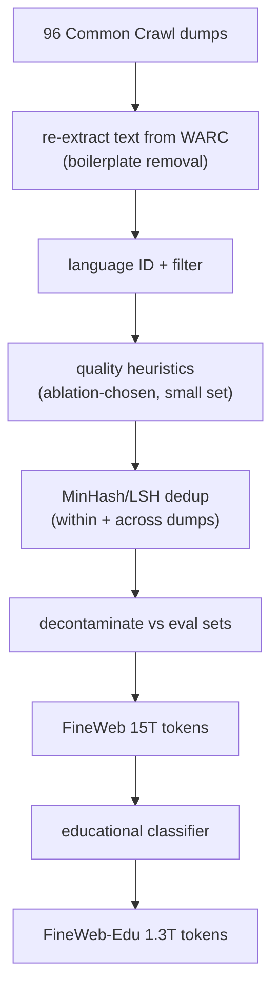
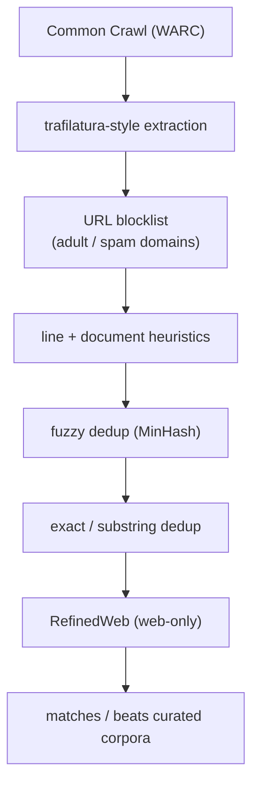
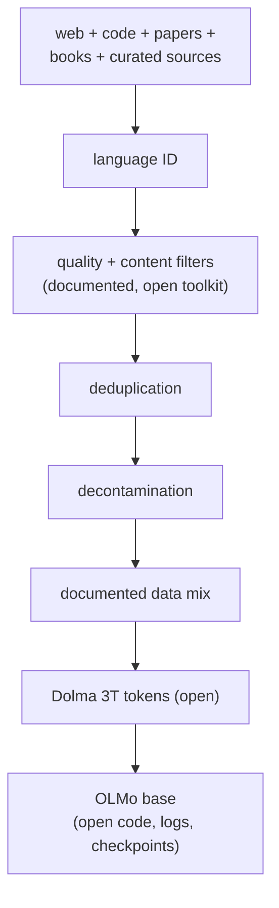
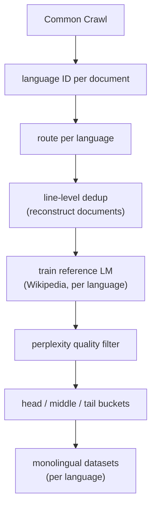
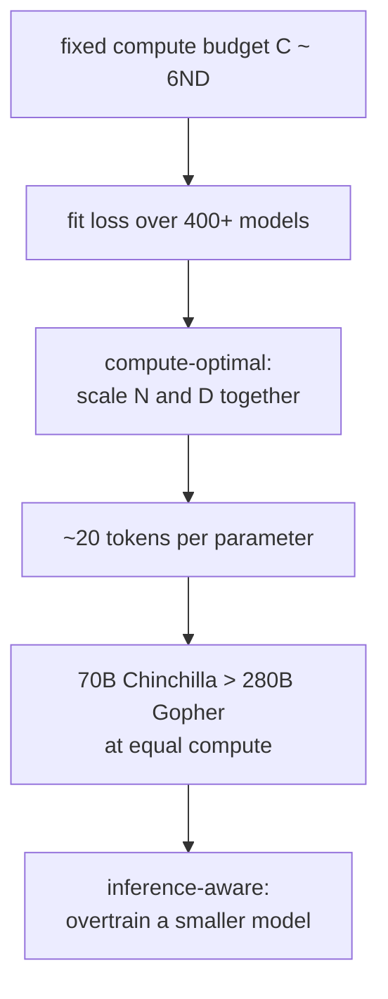
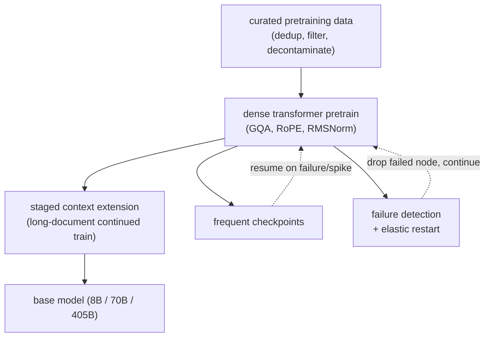
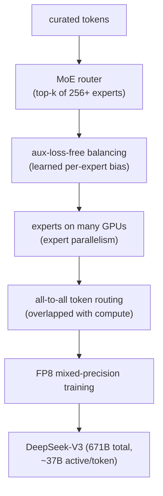
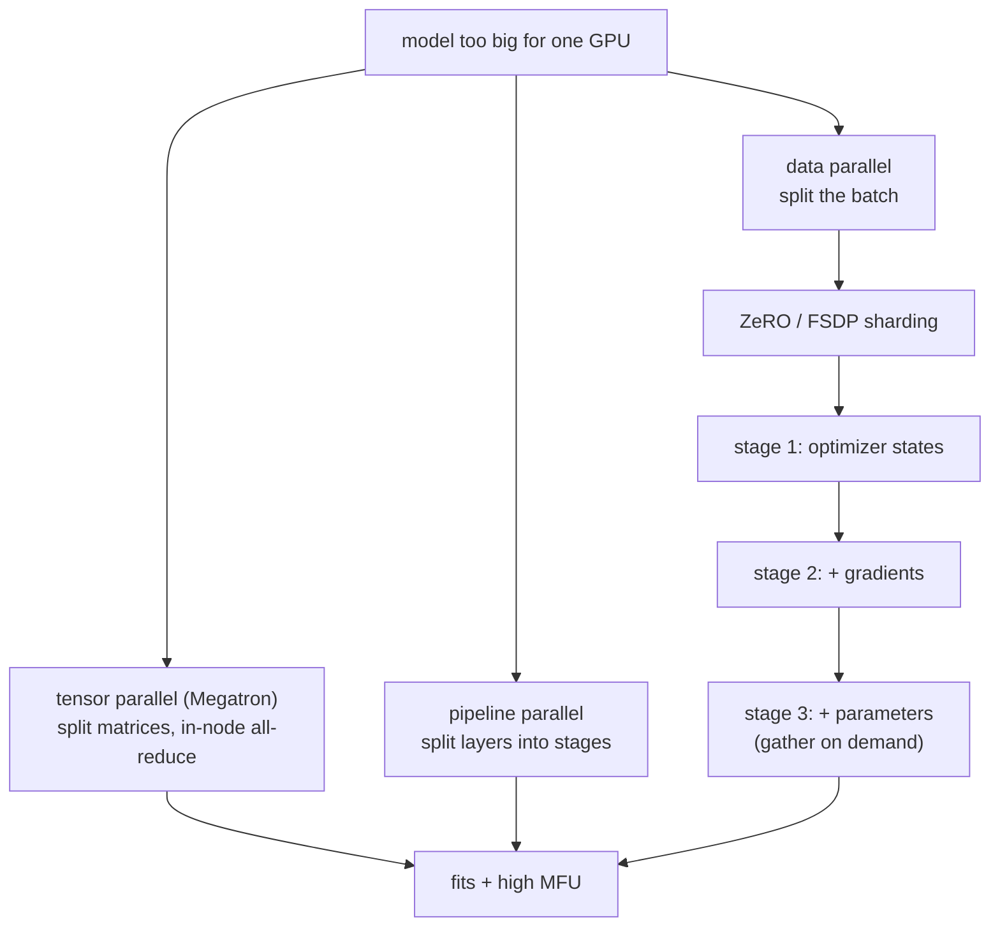

## Data curation and pretraining

### Hugging Face: FineWeb, a filtered and deduplicated open web corpus ([source](https://huggingface.co/spaces/HuggingFaceFW/blogpost-fineweb-v1))

FineWeb turns 96 Common Crawl snapshots into a 15-trillion-token English pretraining set that trains better models than prior open corpora, and it releases the pipeline, not just the data. The recipe: re-extract text from WARC (not the lossy WET plaintext), language-identify, apply a small set of quality heuristics chosen by ablation out of fifty-plus candidates, and run aggressive MinHash deduplication both within and across dumps. FineWeb-Edu adds a learned classifier that keeps only the most educational text (1.3T tokens), which sharply lifts knowledge and reasoning benchmarks like MMLU and ARC. The lesson is that fewer, better tokens beat more tokens, and that the data recipe can be as reproducible as a model.

**Interview questions this design invites**
- Why re-extract from WARC instead of using the pre-extracted WET plaintext?
- How do you pick a small set of quality filters instead of stacking fifty?
- Why does MinHash dedup across dumps matter as much as within a dump?
- Why can an educational-quality classifier beat raw web text on reasoning benchmarks?
- How does a single-digit keep rate change your token budget and pretrain plan?

**Tricks and gotchas**
- Extraction quality is upstream of every filter; bad extraction inflates duplicate counts and poisons quality scores.
- Filters are validated on downstream benchmarks by ablation, not chosen because they look reasonable.
- Dedup is not monotonic: per-dump plus a measured global pass beat maximal global dedup in their ablations.
- FineWeb-Edu shows a learned filter can beat volume; fewer better tokens win on hard benchmarks.

**Common mistakes and how to fix them**
- Using WET plaintext as-is; fix by re-extracting from WARC with boilerplate removal.
- Reporting a benchmark without decontamination; fix by removing eval-overlapping documents and reporting the rate.
- Treating more tokens as strictly better; fix by ablating quality filters against downstream evals.
- Maximizing dedup aggressiveness; fix by tuning it on evals since over-dedup can lower scores.

### TII: RefinedWeb, web data only outperforming curated corpora ([source](https://arxiv.org/abs/2306.01116))

RefinedWeb (the data behind Falcon) makes a sharp claim: with careful enough processing, filtered and deduplicated web data *alone*, with no curated corpora like books or Wikipedia, can match or beat curated datasets for pretraining. The pipeline leans on strong WARC extraction (trafilatura-style), URL-level blocklists, line and document heuristics, and a heavy deduplication stack combining exact and fuzzy (MinHash) removal at large scale. The takeaway for a candidate is that the curated-versus-web-data debate is largely a processing-quality debate: web data is not inherently worse, it is inherently dirtier, and enough cleaning closes the gap.

**Interview questions this design invites**
- What has to be true about your processing for web-only data to beat curated corpora?
- Why put URL-level blocklists before content filtering?
- How do exact and fuzzy dedup complement each other in one pipeline?
- When would you still add curated sources despite RefinedWeb's result?
- What are the risks of relying entirely on web data (bias, coverage, licensing)?

**Tricks and gotchas**
- The curated-versus-web debate is mostly a processing-quality debate; clean web data is not inherently worse.
- Extraction is the load-bearing step; the whole claim rests on getting article text out of messy HTML.
- Combining exact and fuzzy dedup catches both identical copies and near-duplicates that differ by an edit.
- URL blocklists cheaply remove whole classes of bad content before expensive per-document filtering.

**Common mistakes and how to fix them**
- Assuming you must mix in books and Wikipedia; fix by processing web data hard enough first, then decide.
- Doing only exact dedup; fix by adding MinHash fuzzy dedup for near-duplicates.
- Filtering content before dropping known-bad domains; fix by blocklisting URLs up front to save work.
- Underinvesting in extraction; fix by treating HTML-to-text quality as the top-of-funnel priority.

### Ai2: Dolma and OLMo, a fully reproducible open pipeline ([source](https://arxiv.org/abs/2402.00159))

Dolma is a 3-trillion-token open corpus released with its full curation toolkit, and OLMo is the base model trained on it with training code, logs, and checkpoints all public. Together they are the reference for a *reproducible* pretrain: not just open weights, but an open data recipe you can rerun and audit. The pipeline is the standard funnel (source, language ID, quality and content filtering, deduplication, decontamination, mixing) but the contribution is documenting and open-sourcing every step, which turns data curation from a proprietary dark art into something a researcher can study and modify. The tradeoff Ai2 accepts is that fully open data is a legal and safety commitment: everything you include is inspectable, so licensing and content decisions are on the record.

**Interview questions this design invites**
- What does reproducibility of a pretrain require beyond open weights?
- Why is a fully open corpus a legal and safety commitment, not just a nice-to-have?
- How would you version a data recipe so a model artifact pins its exact data?
- What can you study with open data plus logs that you cannot with weights alone?
- Where do content and licensing decisions become visible in an open pipeline?

**Tricks and gotchas**
- Reproducibility needs the data snapshot, mixture weights, tokenizer, and code, not just the checkpoint.
- Open data exposes every licensing and content choice, so the bar for what you include is higher.
- An open toolkit lets others rerun ablations, which is how curation becomes a science rather than folklore.
- Publishing logs and intermediate checkpoints enables debugging a regression to a specific data or step.

**Common mistakes and how to fix them**
- Calling a model open when only the weights ship; fix by releasing the data recipe and training code too.
- Failing to version the data with the model; fix by pinning a data snapshot and mixture per artifact.
- Ignoring licensing until publication; fix by auditing licenses as documents enter the corpus.
- Treating curation as unshareable; fix by open-sourcing the toolkit so results are reproducible.

### Meta: CCNet, a per-language crawl pipeline ([source](https://arxiv.org/abs/1911.00359))

CCNet is the template for turning multilingual Common Crawl into usable monolingual datasets, and its two ideas show up everywhere. First, it deduplicates at the paragraph/line level and reconstructs documents, so it can drop boilerplate lines (menus, repeated notices) while keeping the good ones, rather than only dropping whole duplicate documents. Second, it filters quality with a language-model perplexity score: train a small LM on a trusted reference (Wikipedia) for each language, and keep web text that the LM finds unsurprising, which correlates with being well-formed text in that language. Everything runs per language, which is what makes non-English and low-resource languages tractable instead of drowned out by English.

**Interview questions this design invites**
- Why deduplicate at the line level instead of the document level?
- How does a language-model perplexity score act as a quality filter?
- Why run the whole pipeline per language rather than once globally?
- What goes wrong for low-resource languages in an English-dominated global pipeline?
- How do perplexity buckets (head/middle/tail) let you trade quality for quantity?

**Tricks and gotchas**
- Line-level dedup removes recurring boilerplate while keeping the unique body of a page.
- Perplexity against a trusted reference is a cheap, language-agnostic quality proxy.
- Per-language routing prevents high-resource languages from setting thresholds that starve others.
- The head/middle/tail perplexity buckets are a knob for the quality-versus-volume tradeoff per language.

**Common mistakes and how to fix them**
- Document-level dedup only; fix with line-level dedup to strip boilerplate without dropping good pages.
- One global quality threshold; fix by filtering per language with a per-language reference model.
- Ignoring fertility and coverage for low-resource languages; fix by routing and tuning per language.
- Treating perplexity as truth; fix by calibrating buckets against downstream quality, not just the score.

### Google DeepMind: Chinchilla and the compute-optimal split ([source](https://arxiv.org/abs/2203.15556))

Chinchilla asked, for a fixed compute budget, how to split it between model size and training tokens. Training over 400 models from 70M to 16B parameters and fitting the loss surface, the answer was that size and tokens should scale roughly equally, about 20 tokens per parameter, and that the models of the day were badly undertrained. The proof point: a 70B Chinchilla trained on 1.4T tokens beat the 280B Gopher at equal compute and is cheaper to serve. This is the calculation that sizes a pretrain from the budget, and later work refined it for the inference-heavy regime where you overtrain a smaller model on purpose.

**Interview questions this design invites**
- Given a compute budget, how do you choose model size versus number of training tokens?
- Why were pre-Chinchilla models undertrained, and what did that cost?
- When do you deliberately violate Chinchilla-optimal, and why?
- How does planning to serve billions of tokens change the optimal size?
- What does the C ~ 6ND approximation let you estimate on a whiteboard?

**Tricks and gotchas**
- Chinchilla-optimal minimizes training compute, not lifetime cost; serving shifts the optimum smaller.
- The 20-tokens-per-parameter rule is a fast sanity check for any proposed pretrain.
- A smaller, well-trained model can beat a larger undertrained one and is cheaper forever.
- The scaling law has an irreducible loss term E; more scale has diminishing, not unlimited, returns.

**Common mistakes and how to fix them**
- Making the model bigger to improve it; fix by scaling tokens alongside parameters.
- Ignoring inference cost when sizing; fix by overtraining a smaller model if you serve at scale.
- Quoting scaling laws as exact; fix by treating them as fitted trends with an irreducible floor.
- Under-budgeting data; fix by computing the token target from the parameter count before committing compute.

### Meta: the Llama 3 herd, an end-to-end build with failure recovery ([source](https://ai.meta.com/research/publications/the-llama-3-herd-of-models/))

Llama 3 documents the full build for 8B, 70B, and 405B models: careful pre-processing and curation of pretraining data, a scaled dense-transformer pretrain, a staged context-length extension near the end of pretraining, and, crucially for this topic, the systems that keep a cluster-scale run alive. The report is candid that at their scale interruptions are frequent, so automated failure detection, checkpointing, and elastic restart are core parts of the training system, not afterthoughts. The stated levers are data quality, scale, and managing complexity. It is the closest public reference for building a strong open base while actually surviving weeks on thousands of GPUs.

**Interview questions this design invites**
- Why extend context in a staged step near the end of pretraining rather than pretraining long throughout?
- At thousands of GPUs for weeks, what fails, and how does the run survive it?
- How do you size the checkpoint interval against the mean time between failures?
- What makes a 405B pretrain a lab-scale decision most teams should not copy?
- How does the data curation for pretraining differ from the later post-training data?

**Tricks and gotchas**
- Context extension is a late-stage continued-training step, far cheaper than pretraining long from the start.
- Frequent interruptions are expected at cluster scale; automated restart is designed in, not bolted on.
- The checkpoint interval trades I/O cost against the work lost per failure.
- Data quality assurance is treated as a first-class lever alongside scale, not a preprocessing step.

**Common mistakes and how to fix them**
- Pretraining at long context throughout; fix with a staged extension to save compute.
- Treating the run as a single uninterrupted job; fix with checkpointing and elastic restart for failures.
- Copying the 405B plan on a startup budget; fix by adapting an open Llama base via mid- and post-training.
- Under-checkpointing; fix by sizing the interval so expected lost work is acceptable given the failure rate.

### DeepSeek: V3, a frontier MoE trained on a constrained budget ([source](https://arxiv.org/abs/2412.19437))

DeepSeek-V3 is a 671-billion-parameter mixture-of-experts model with only about 37B parameters active per token, trained at frontier quality on a notably constrained compute budget. Two systems ideas carry it. First, FP8 mixed-precision training halves the bytes moved for activations and communication versus bf16, which is a large win when interconnect is the bottleneck. Second, auxiliary-loss-free load balancing nudges the router toward balance with a learned per-expert bias instead of an auxiliary loss, avoiding the gradient interference that the classic balancing loss introduces. Together with expert parallelism and careful all-to-all overlap, they make a frontier MoE affordable to train, and the small active-parameter count makes it affordable to serve.

**Interview questions this design invites**
- How does MoE decouple total parameters (capacity) from per-token FLOPs (cost)?
- What is routing collapse, and how does aux-loss-free balancing prevent it without an auxiliary loss?
- Why does FP8 training help most when interconnect, not compute, is the bottleneck?
- What extra communication does expert parallelism add, and how do you hide it?
- Why is MoE a memory-and-systems win rather than a free lunch?

**Tricks and gotchas**
- MoE buys a large model at a small model's active FLOPs, but you still hold every expert in VRAM.
- Aux-loss-free balancing avoids the gradient interference the classic load-balancing loss adds.
- FP8 cuts activation and communication bytes, which is the real bottleneck at scale, not FLOPs.
- All-to-all routing traffic must overlap with compute or it wrecks model-FLOPs utilization.

**Common mistakes and how to fix them**
- Assuming MoE is free capacity; fix by budgeting VRAM for all experts and the routing all-to-all.
- Relying only on an auxiliary loss for balance; fix by considering a bias-based aux-loss-free scheme.
- Training MoE in bf16 when interconnect-bound; fix by moving to FP8 to cut communication bytes.
- Placing experts without overlapping all-to-all; fix by scheduling routing traffic behind compute.

### NVIDIA and Microsoft: Megatron-LM, ZeRO, and FSDP, the parallelism stack ([source](https://arxiv.org/abs/1909.08053))

A frontier model does not fit on one GPU, so three complementary techniques share it. Megatron-LM introduced **tensor parallelism**: split each weight matrix across GPUs so a layer too large for one device still does its matmul, at the cost of high-bandwidth all-reduce inside every layer, which pins it within a node. **ZeRO** (DeepSpeed) attacks the other memory wall: plain data parallelism replicates the 16-bytes-per-parameter Adam footprint on every GPU, so ZeRO partitions the optimizer states, then gradients, then parameters across data-parallel ranks in three stages, gathering shards on demand. **PyTorch FSDP** is the native-PyTorch realization of that ZeRO-3-style full sharding. Stacked (tensor within a node, pipeline and data across nodes, sharding on top), they make a model far larger than one GPU's memory trainable, and the whole game is keeping model-FLOPs utilization high against interconnect limits.

**Interview questions this design invites**
- Why is tensor parallelism kept within a node while data and pipeline parallelism span nodes?
- What does each ZeRO stage shard, and how does per-GPU memory change?
- Where does the pipeline bubble come from, and how do micro-batches shrink it?
- How are FSDP and ZeRO-3 related, and what do they cost in communication?
- What is model-FLOPs utilization, and what drags it below 100 percent?

**Tricks and gotchas**
- Tensor parallelism needs the fastest links (NVLink) because it all-reduces inside every layer.
- ZeRO partitions instead of replicating the 16-bytes-per-parameter Adam footprint across DP ranks.
- The pipeline bubble is (p-1)/(m+p-1); many micro-batches make it small.
- The real ceiling is interconnect and memory bandwidth, so the parallelism plan targets MFU, not FLOPs.

**Common mistakes and how to fix them**
- Putting tensor parallelism across the slow network; fix by keeping TP in-node and DP/PP across nodes.
- Relying on data parallelism alone for a huge model; fix with ZeRO/FSDP sharding to break the memory wall.
- Running pipelines with too few micro-batches; fix by raising m to shrink the bubble.
- Optimizing for FLOPs; fix by profiling MFU and attacking communication, stalls, and bubbles.
</content>
