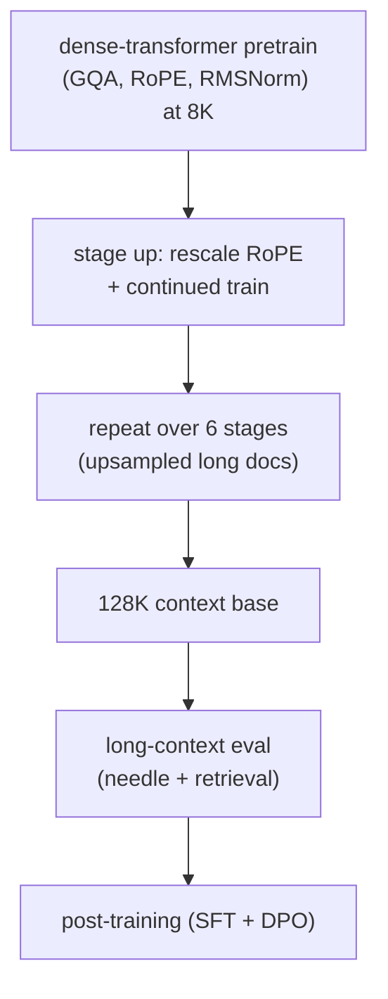
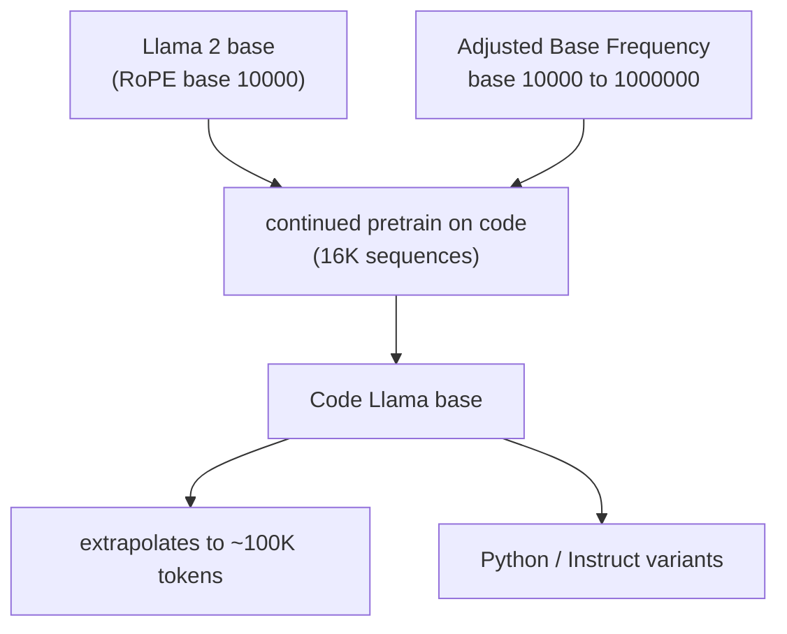
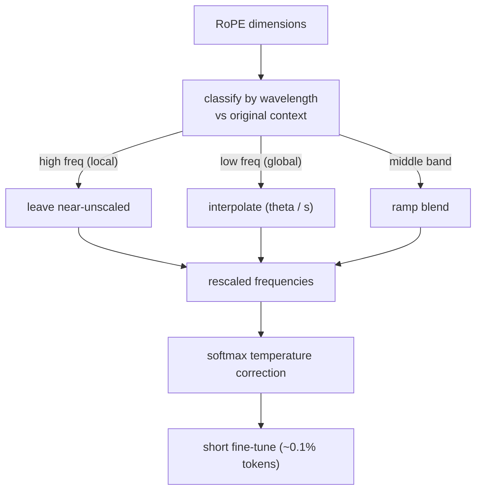
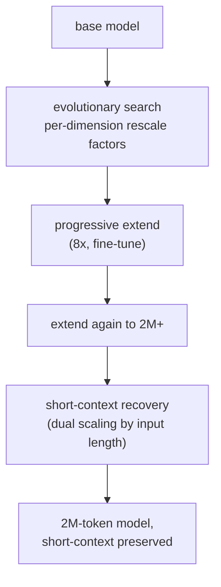
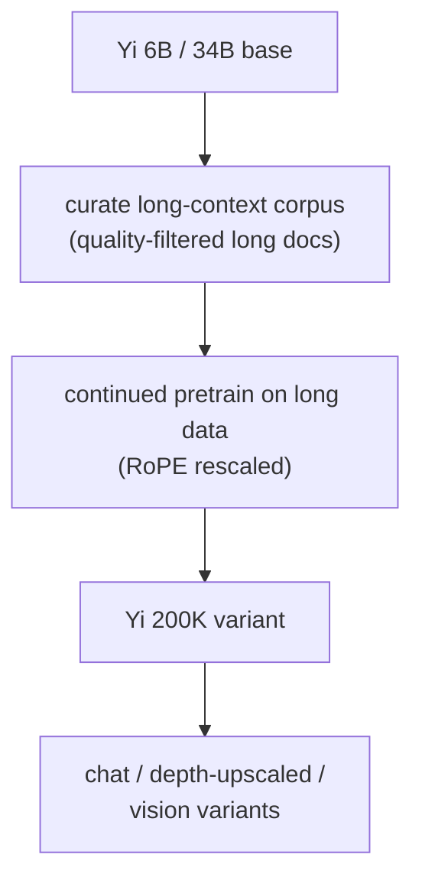
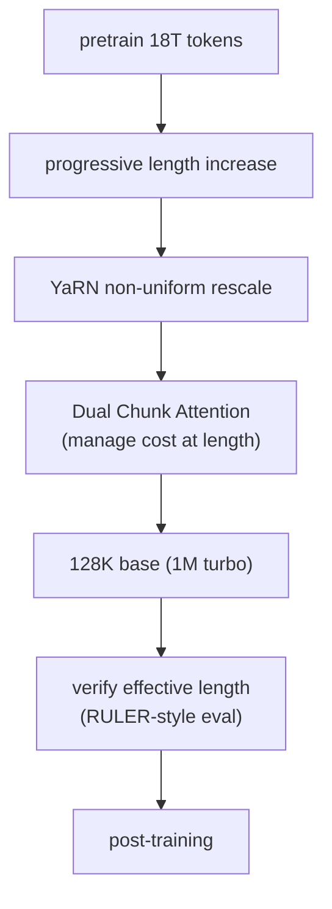
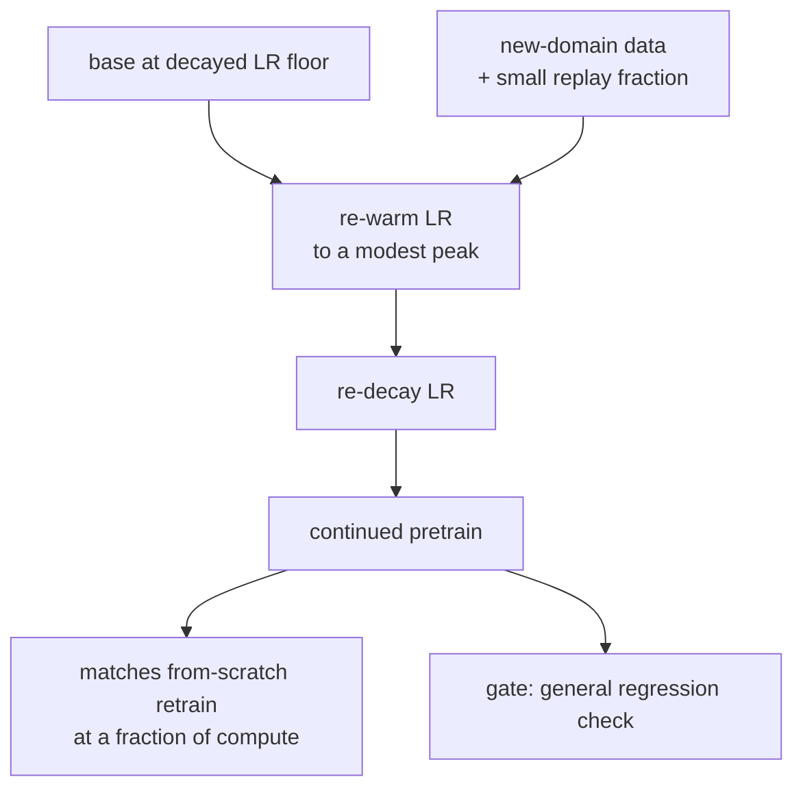

## Continued pretraining and long-context adaptation

### Meta: Llama 3 staged context extension ([source](https://ai.meta.com/research/publications/the-llama-3-herd-of-models/))

Llama 3 extends its context window from an 8K pretraining length to 128K, not in one long-context pretrain but in six incremental stages late in pretraining, letting the model consolidate each length before the next. The extension rides on RoPE plus grouped-query attention (a small KV-head count that keeps the cache affordable at length), and it sits after the main pretrain and before post-training, so the aligned model inherits a base that already reads long. The stated levers across the whole herd are data, scale, and managing complexity, and staged extension is the length instance of that philosophy: many cheap short-to-longer steps beat one expensive giant-length run.

**Interview questions this design invites**
- Why extend context in stages near the end of pretraining rather than pretraining long from the start?
- What role does grouped-query attention play in making a 128K base serveable?
- Why extend on the base rather than after alignment?
- How do you upsample long documents so each stage actually exercises the new length?
- What eval convinces you the 128K is real and not just configured?

**Tricks and gotchas**
- Staged extension is cheaper (short sequences early) and more stable than one long-length run.
- Extension is a late-stage continued-training step, a tiny fraction of the pretrain compute.
- GQA shrinks the KV cache so the long window fits in VRAM at a usable batch size.
- Extending before post-training keeps the aligned behavior from being disturbed by the length change.

**Common mistakes and how to fix them**
- Pretraining at long context throughout; fix with a staged extension to save compute.
- Jumping straight to 128K; fix by increasing length in stages so each consolidates.
- Ignoring KV-cache growth; fix with grouped-query attention and paging at the target length.
- Trusting the config length; fix by gating on a long-context retrieval eval before shipping.

### Meta: Code Llama, domain continued pretraining with base-frequency scaling ([source](https://arxiv.org/abs/2308.12950))

Code Llama continues pretraining Llama 2 on a code-heavy corpus, so it is both a domain adaptation (general base to code) and a length extension in one phase. The length lever is an Adjusted Base Frequency: it raises the RoPE base from 10000 to 1000000, which is a non-uniform rescaling that scales the low-frequency dimensions far more than the high-frequency ones. Trained on 16K-token sequences, the model then generalizes to inputs up to 100K tokens, showing that a larger base frequency both stabilizes training at the trained length and extrapolates beyond it. It is the cleanest production example that "raise the base" is a real, cheap alternative to compressing positions.

**Interview questions this design invites**
- Why does raising the RoPE base extend context, and why is it non-uniform across dimensions?
- How is training on 16K sequences consistent with generalizing to 100K tokens?
- What does the code domain gain, and what general ability might it lose?
- When would you prefer base-frequency scaling over linear position interpolation?
- How do you keep a code-specialized base from forgetting natural language?

**Tricks and gotchas**
- Scaling the base is mathematically a non-uniform frequency rescale: low frequencies move most, local resolution is spared.
- A larger base both trains stably at length and extrapolates past the trained window.
- Continued pretraining on code is a domain shift, so general-language ability needs replay or a general variant.
- The 16K-train, 100K-test gap is the extrapolation ABF buys, not a claim of unlimited reach.

**Common mistakes and how to fix them**
- Compressing positions when raising the base would preserve resolution; fix by trying ABF for RoPE bases.
- Assuming the trained length caps the usable length; fix by measuring extrapolation, but verify with a real eval.
- Forgetting general language during code adaptation; fix with a general-data replay fraction.
- Treating a bigger base as free; fix by re-tuning the schedule, since the frequency change perturbs training.

### Nous Research: YaRN, non-uniform scaling plus attention temperature ([source](https://arxiv.org/abs/2309.00071))

YaRN is the principled answer to "uniform interpolation blurs short-range resolution." It classifies each RoPE dimension by its wavelength relative to the original context: low-frequency (long-wavelength) dimensions get interpolated, high-frequency (short-wavelength) ones are left essentially unscaled to preserve local ordering, and a ramp blends the middle band. It then adds a softmax temperature correction to counter the attention-entropy shift a longer sequence causes. The result extends context (64K, 128K, and beyond) with far less quality loss than linear interpolation, and it does so at roughly 0.1 percent of the original pretraining tokens, which is why YaRN became the default aggressive-extension recipe.

**Interview questions this design invites**
- Why interpolate low frequencies but spare high frequencies?
- What is the attention-temperature correction fixing, and why does length change entropy?
- How does YaRN differ from linear position interpolation, precisely?
- Why can YaRN extend at 0.1 percent of pretraining tokens?
- What breaks if you set the ramp bands or temperature wrong?

**Tricks and gotchas**
- High-frequency dimensions carry local ordering; blurring them is what hurts short-context quality.
- The temperature correction rescales attention logits to keep entropy sane at long length.
- Wavelength (not raw index) is the right variable for deciding what to interpolate.
- The extension is so cheap because frequencies encode relative position; the model adapts, it does not relearn.

**Common mistakes and how to fix them**
- Calling uniform interpolation YaRN; fix by stating YaRN is non-uniform plus a temperature term.
- Interpolating all frequencies; fix by sparing the high-frequency (local) dimensions.
- Dropping the attention-temperature term; fix by including it, since long sequences shift entropy.
- Over-fine-tuning; fix by using the small token budget YaRN needs, not a full pretrain.

### Microsoft: LongRoPE, searched rescaling to millions of tokens ([source](https://arxiv.org/abs/2402.13753))

LongRoPE pushes extension past 2 million tokens by refusing to hand-design the frequency schedule. It runs an evolutionary search over per-dimension rescale factors (a superset of YaRN's ramp, since every dimension gets its own factor), extends progressively (reach an intermediate length, fine-tune, extend again), and adds a short-context recovery step that swaps back to a smaller scaling for short inputs so the extended model does not regress on ordinary text. The lesson it makes explicit: the optimal rescaling is both non-uniform and input-length dependent, which is why the most aggressive extensions search the factors and switch them by input length rather than derive a single closed form.

**Interview questions this design invites**
- Why search per-dimension rescale factors instead of using a closed-form schedule?
- What does progressive extension buy over a single giant-length step?
- Why is a short-context recovery / dual-scaling step necessary?
- How does LongRoPE generalize YaRN's ramp?
- What is the cost of the search, and when is it worth it?

**Tricks and gotchas**
- Per-dimension search is a superset of YaRN; the ramp is one parameterization the search can beat.
- Progressive extension consolidates each length, keeping the far extension stable.
- Dual scaling by input length is what stops the 2M model from regressing at 2K.
- Optimal rescaling is input-length dependent, not one fixed vector.

**Common mistakes and how to fix them**
- Using one rescale for all input lengths; fix with length-dependent (dual) scaling.
- Extending to millions in one jump; fix by progressing through intermediate lengths.
- Assuming a closed form is optimal; fix by searching the factors when reach is extreme.
- Ignoring short-context regression; fix by adding a recovery step and testing short prompts.

### 01.AI: Yi, long-context adaptation driven by data quality ([source](https://arxiv.org/abs/2403.04652))

Yi ships 6B and 34B bilingual bases and extends them into 200K-token long-context variants through continued pretraining on long data. The paper's framing is notable: it credits the gains primarily to data-engineering (the quality and curation of the long corpus) rather than to a novel positional trick. That is the practitioner's counterweight to the frequency-scaling literature, a reminder that once the RoPE rescaling is reasonable, the binding constraint on a real 200K model is having enough genuinely long, high-quality documents to train on, not the exact interpolation formula.

**Interview questions this design invites**
- Why can data quality matter more than the positional-scaling method for long context?
- What makes a long-document corpus hard to curate at 200K length?
- How do you avoid packing unrelated short documents to fake long context?
- Where does synthetic long-context data fit alongside natural long documents?
- How do you validate a 200K claim beyond perplexity?

**Tricks and gotchas**
- Once rescaling is adequate, long-data quantity and quality become the binding constraint.
- Real long-range dependencies (one long document) teach the window; concatenated shorts do not.
- Bilingual bases need long data in both languages or the long-context skill is uneven.
- Data-engineering, not a clever formula, is often the actual lever behind a strong long-context release.

**Common mistakes and how to fix them**
- Chasing the perfect interpolation while ignoring the corpus; fix by investing in long-data curation.
- Packing random shorts to reach length; fix with genuine long documents and targeted synthetic tasks.
- Reporting long-context perplexity only; fix by adding retrieval and aggregation evals.
- Assuming one language's long data transfers; fix by curating long data per language.

### Alibaba: Qwen2.5, progressive length with YaRN and Dual Chunk Attention ([source](https://arxiv.org/abs/2412.15115))

Qwen2.5 pretrains on 18 trillion tokens and reaches long context by combining several of the levers above: a progressive length increase during training, YaRN-style non-uniform frequency scaling, and Dual Chunk Attention, reaching 128K on the open models (and up to 1M on the turbo variant). It is the current production example of stacking mechanisms rather than betting on one: staged length for stable training, YaRN for the frequency rescale, and a chunked-attention scheme to manage the cost at extreme length. The report is candid that configured length and effective length differ, which is why a RULER-style eval is the right gate.

**Interview questions this design invites**
- Why stack progressive length, YaRN, and Dual Chunk Attention instead of one mechanism?
- What does chunked attention buy at extreme length, and what does it trade?
- Why distinguish configured length from effective length?
- How does progressive length stabilize training toward 128K?
- What eval separates a real 128K model from a 128K config?

**Tricks and gotchas**
- Real systems stack levers: staged length for stability, YaRN for rescale, chunking for cost.
- Chunked attention bounds the quadratic cost that a full 128K window otherwise pays.
- Configured length overstates effective length; the gap is the thing to measure.
- Progressive length makes the far extension trainable without a giant-length run.

**Common mistakes and how to fix them**
- Betting on a single mechanism; fix by combining staged length, non-uniform rescale, and cost-bounded attention.
- Advertising the configured length; fix by reporting effective length from a RULER-style eval.
- Paying full quadratic attention at 128K; fix with a chunked or windowed attention scheme.
- One-shot extension to the max length; fix with a progressive schedule.

### Mila and collaborators: simple, scalable continued pretraining ([source](https://arxiv.org/abs/2403.08763))

This study answers the practical question DAPT hinges on: how do you resume pretraining on new data without either stalling or catastrophically forgetting? The recipe is three ingredients: re-warm the learning rate from the base's decayed floor to a modest peak, re-decay it, and replay a small fraction of the original-distribution data. With those, continued pretraining matches a full from-scratch retrain on the combined data at a fraction of the compute, and the paper quantifies how the re-warm peak and replay fraction trade off forgetting against new-domain learning. It is the schedule most continued-pretraining runs should copy.

**Interview questions this design invites**
- Why must you re-warm the learning rate rather than resume at the decayed floor?
- Why is the re-warm peak lower than the original pretraining peak?
- How large a replay fraction do you need, and what does it trade off?
- How can continued pretraining match a from-scratch retrain, and when does it not?
- What do you measure before and after to detect forgetting?

**Tricks and gotchas**
- Resuming at the decayed floor stalls; resuming at the original peak forgets. The modest peak is the balance.
- Even a small replay fraction (a few percent) sharply cuts forgetting for little slowdown.
- Re-warm then re-decay is the shape; it is not a constant learning rate.
- The method makes continued pretraining a real substitute for retraining, at a fraction of the cost.

**Common mistakes and how to fix them**
- Resuming at the base's final learning rate; fix by re-warming to a modest peak.
- Re-warming to the original peak; fix by lowering it to protect converged weights.
- Skipping replay; fix by mixing in a small fraction of original-distribution data.
- Asserting no forgetting; fix by running the full general suite before and after as a gate.
