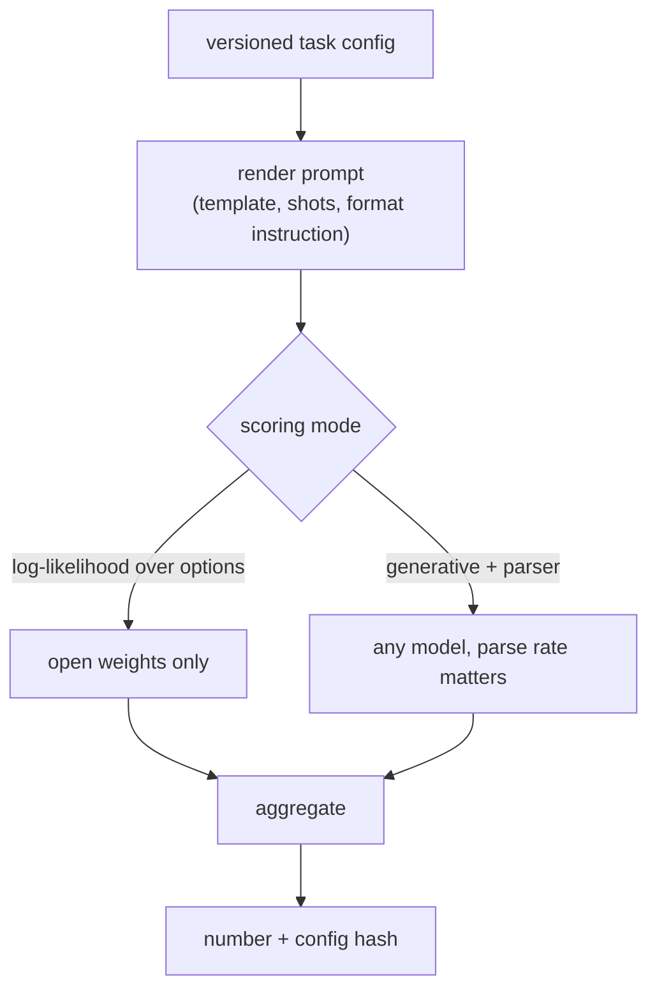
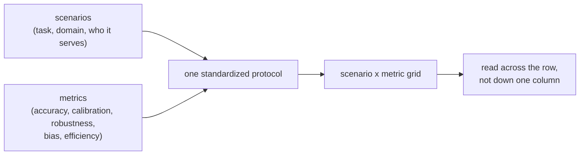
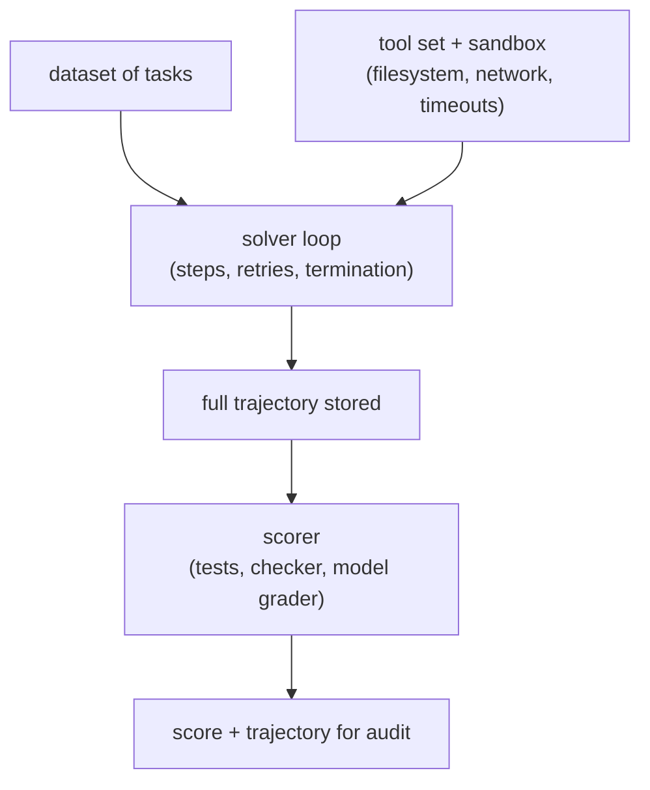
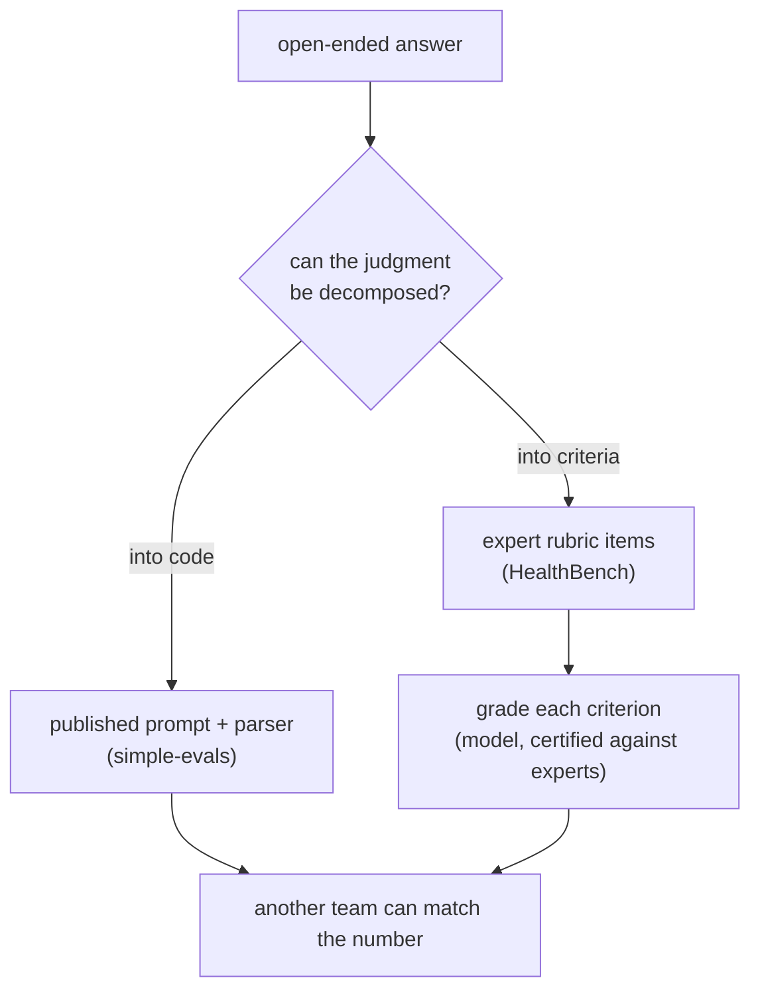
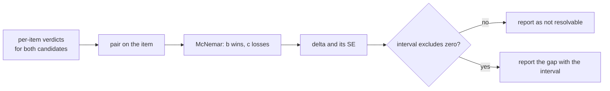
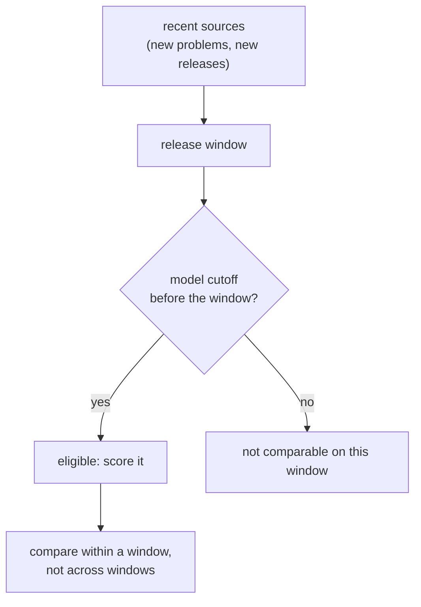
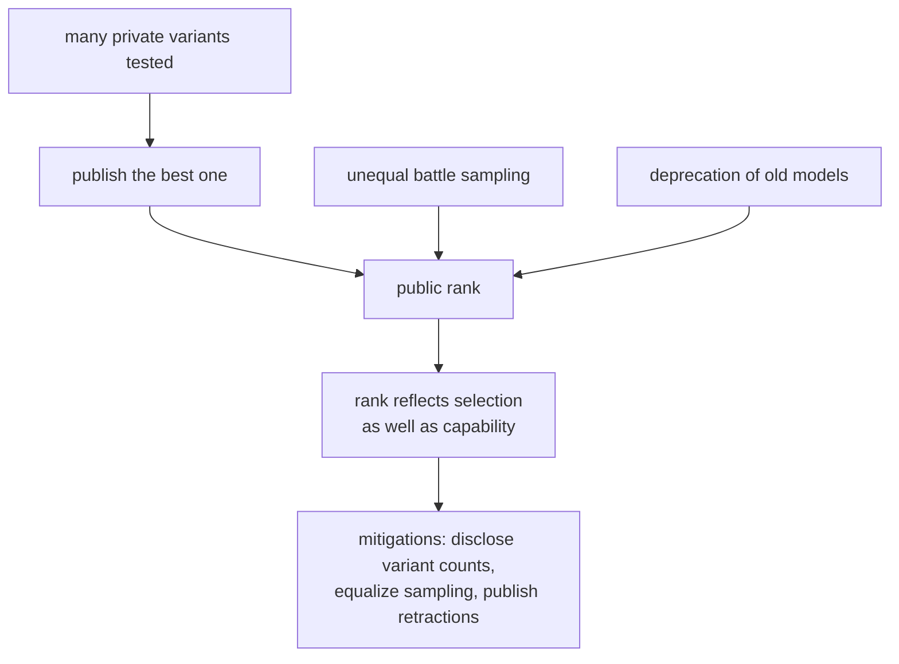
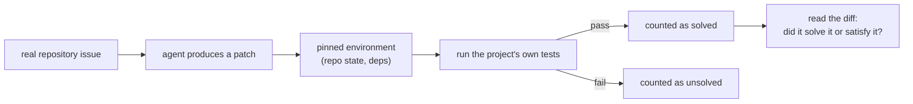
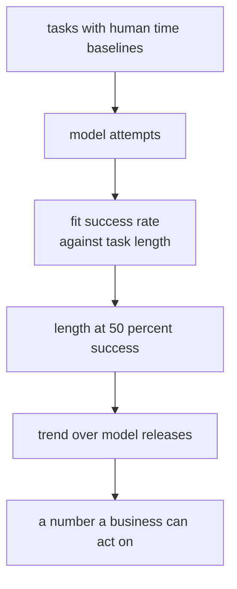

## Benchmarking a model

### EleutherAI: the LM Evaluation Harness, and why two labs disagree ([source](https://arxiv.org/abs/2405.14782))

The harness maintainers wrote down what years of running other people's benchmarks taught them: the number is produced by the protocol, and almost nobody publishes enough of the protocol to reproduce it. Their answer is a versioned task config that pins prompt rendering, few-shot construction, the scoring mode (log-likelihood over choices versus generative), and the answer parser, plus the discipline of storing the rendered string rather than the template. The headline observation is that formatting alone can move a model between near-random and competent on the same items, which reframes benchmark disagreement as a protocol diff rather than a model result.

**Interview questions this design invites**
- Why does a chat template change a benchmark score at all, and by how much?
- When is log-likelihood scoring available, and when must you use generative scoring?
- What do you store so that a scoring change does not require re-running the models?
- How do you compare a number you produced against one published in a paper?
- Which knobs must be identical across candidates, and which may vary?

**Tricks and gotchas**
- Render from the model's own chat template; a hand-written prompt silently changes the task.
- Pin the few-shot pool by seed, not just the shot count, because order matters too.
- Store the rendered prompt and the raw completion, so a parser fix is not a model re-run.
- Report the parse-failure rate; a score without it quietly includes extraction errors.

**Common mistakes and how to fix them**
- Comparing two numbers from different harness versions; fix by pinning the version and the task config hash in the report.
- Mixing scoring modes across candidates; fix by choosing one per benchmark and reporting which.
- Treating a disagreement as a model finding; fix by diffing the protocols first, which usually ends the argument.
- Leaving max output tokens at a default; fix by setting it from the observed length distribution and reporting the truncation rate.

### Stanford CRFM: HELM, the report as the artifact ([source](https://crfm.stanford.edu/helm/))

HELM's argument is that a single accuracy number is not a measurement of a model, it is a projection of one. The design answer is a matrix: many scenarios crossed with many metrics (accuracy, calibration, robustness, fairness, bias, toxicity, efficiency), all run under one standardized protocol so cells are comparable. What it buys is that a model cannot be summarized by its best cell, and what it costs is real money per full run, which is why most teams borrow the shape rather than the whole suite.

**Interview questions this design invites**
- What does a multi-metric report catch that a leaderboard rank cannot?
- How would you choose scenarios for a product rather than for a paper?
- Which metrics are cheap to add once the runs exist, and which need new items?
- How do you keep a matrix report from being ignored in favour of one number?
- What does efficiency belong in the same grid as accuracy?

**Tricks and gotchas**
- Most of the cost is generation, so adding a metric computed from stored completions is nearly free.
- A grid makes headroom visible: a saturated scenario cannot separate two candidates.
- Weighting the cells is a product decision and should be written down before the run, not after.
- Publishing the protocol next to the grid is what makes an external number comparable.

**Common mistakes and how to fix them**
- Collapsing the grid to an index that hides the movement; fix by normalizing explicitly, weighting on purpose, and dropping saturated scenarios.
- Running every scenario because the suite has them; fix by selecting for the decision the number drives.
- Comparing your cells against published cells from a different protocol; fix by re-running the baseline yourself.
- Adding metrics that nobody will act on; fix by naming the decision each metric changes.

### UK AI Security Institute: Inspect, standardizing the environment ([source](https://inspect.aisi.org.uk/))

For an agent, most of the variance is not in the model. It is in the loop: how many steps are allowed, which tools exist, what the sandbox permits, how errors are surfaced back, and when the episode is declared over. Inspect is the argument that this scaffolding is part of the instrument and therefore has to be specified and shared. The framework fixes the solver loop, the tool interface and the sandbox, so two agent scores differ because of the agents rather than because one had a more forgiving environment.

**Interview questions this design invites**
- Which parts of an agent score belong to the model and which to the scaffold?
- How do you keep a step limit from being the thing your benchmark actually measures?
- What must the sandbox forbid for a coding benchmark to mean anything?
- How do you audit an agent result after the fact?
- What is the right way to report an agent number so someone else can match it?

**Tricks and gotchas**
- Store the whole trajectory, not just the verdict; agent failures are only legible in the trace.
- A step or token limit is a protocol parameter and belongs in the report next to the score.
- Network access inside the sandbox can turn a reasoning benchmark into a retrieval benchmark.
- Tool error messages are part of the prompt, so their wording changes behaviour.

**Common mistakes and how to fix them**
- Comparing agents built on different scaffolds; fix by holding the loop and tools fixed and varying only the model.
- Trusting a passing rate with no trajectory review; fix by reading twenty passing runs before publishing.
- Letting the sandbox reach the internet; fix by denying network by default and allowlisting per task.
- Treating a timeout as a wrong answer without saying so; fix by reporting timeouts as their own category.

### OpenAI: simple-evals and HealthBench, two halves of one argument ([source](https://github.com/openai/simple-evals))

These two artifacts make opposite bets that fit together. simple-evals publishes prompts and parsers as small readable code on the position that a protocol nobody can replicate is not a measurement, and deliberately keeps coverage narrow so that the code stays legible. [HealthBench](https://openai.com/index/healthbench/) goes the other way on an open-ended domain: instead of a holistic judge score, physicians write per-item rubric criteria, each nearly binary, and the score is the weighted sum of criteria met. The common thread is that reproducibility comes from decomposing the judgment, either into code or into criteria.

**Interview questions this design invites**
- Why does a rubric of near-binary criteria reproduce better than a holistic score?
- Who writes the criteria, and what does that cost?
- How would you certify the model that grades the criteria?
- When is publishing the parser more valuable than publishing the dataset?
- What kind of task cannot be decomposed this way?

**Tricks and gotchas**
- Near-binary criteria are what models and humans actually agree on; holistic scores are where they diverge.
- Criteria weights encode a domain judgment, so they belong with the domain expert, not the engineer.
- A published parser lets an outsider reproduce the number without your infrastructure.
- Narrow, readable evals get run; large opaque suites get cited.

**Common mistakes and how to fix them**
- Asking a judge for a 1 to 10 score; fix by asking for a list of criteria met.
- Writing rubrics without domain experts; fix by budgeting expert time as the main cost of the benchmark.
- Treating the grading model as neutral infrastructure; fix by certifying it and pinning its version.
- Publishing scores without the prompts; fix by shipping the harness code alongside.

### Anthropic: adding error bars, and what a score actually is ([source](https://arxiv.org/abs/2411.00640))

The argument is that eval reporting borrowed the vocabulary of measurement without the statistics. A benchmark score is an estimate from a finite sample of questions, so it has a standard error, and the questions are usually not independent. The practical recommendations are the ones to be able to recite: report standard errors, compare candidates paired on the same items rather than as two independent proportions, account for clustered items, and resample across seeds where generation is stochastic. The consequence is uncomfortable and correct: many published gaps on small suites are not resolvable at all.

**Interview questions this design invites**
- How many items do you need to call a 2-point gap?
- Why is a paired comparison stronger than comparing two proportions?
- What are clustered items and how do they change the interval?
- How many seeds do you run on a reasoning benchmark, and why?
- What do you report when the interval includes zero?

**Tricks and gotchas**
- Pairing needs per-item verdicts from both candidates, which means the run store is a prerequisite.
- On a 200-item suite the 95 percent half-width is around 7 points, which is larger than most claimed gaps.
- Single-run swings on reasoning suites routinely exceed the effect being claimed; seeds are not optional there.
- A grid of models by benchmarks needs false-discovery control, or something will look significant.

**Common mistakes and how to fix them**
- Reporting a gap without an interval; fix by making the interval a required field of the report card.
- Comparing unpaired proportions; fix by using McNemar on the paired verdicts.
- Adding items until the gap becomes significant; fix by sizing before the run from the effect you need to resolve.
- Ignoring item clustering; fix by clustering the standard error at the group level.

### LiveBench and LiveCodeBench: contamination handled by construction ([source](https://arxiv.org/abs/2406.19314))

Both benchmarks accept that contamination detection is weak and change the construction instead. [LiveBench](https://arxiv.org/abs/2406.19314) refreshes items on a schedule from recent sources so that a model's training cutoff sits before the questions exist. [LiveCodeBench](https://arxiv.org/abs/2403.07974) does the same for code by scoring only problems published inside a release window after the model's cutoff. The design cost is comparability: two windows are two benchmarks, so a time series across windows is not a like-for-like trend.

**Interview questions this design invites**
- Why is a time gate stronger evidence than deduplication?
- What breaks when you compare scores from two different windows?
- How do you handle a model whose cutoff is unknown or misreported?
- What is a functional twin, and when is it worth building one instead?
- Which contamination types does a time gate still not catch?

**Tricks and gotchas**
- The cutoff is a claim by the provider, so treat it as an input with error, not a fact.
- Distillation from a contaminated teacher passes a time gate; the twin is what catches that family.
- Automatic refresh means the benchmark ages out, so pin the window in any reported number.
- A time-gated suite is usually smaller, so its interval is wider; size before you claim a gap.

**Common mistakes and how to fix them**
- Quoting a live benchmark score without its window; fix by making the window part of the score's identity.
- Assuming a fresh benchmark is contamination-free forever; fix by re-checking as models train on the new data.
- Using it as the only eval; fix by pairing it with a private internal set for the capabilities you care about.
- Concluding contamination from a single drop; fix by comparing difficulty-matched pre-cutoff and post-cutoff slices.

### Cohere Labs and LMArena: auditing the board itself ([source](https://arxiv.org/abs/2504.20879))

[The Leaderboard Illusion](https://arxiv.org/abs/2504.20879) is a teardown of a measurement system rather than of a model. Its claims are structural: private variants tested before release plus the freedom to publish only the best result creates a selection effect, and unequal sampling and deprecation change who is measured against whom. [LMArena's response](https://lmarena.ai/blog/our-response/) disputes parts of it, and both are worth reading together, because the useful skill in an interview is being able to say precisely which properties of a board can be gamed and which cannot.

**Interview questions this design invites**
- What is selection leakage, and how does it apply to a public board?
- Why does the number of unpublished variants change the meaning of a rank?
- What would you require from a board before trusting it for a procurement decision?
- How do human preference scores differ from capability measurements?
- What is the internal version of this failure, inside your own team?

**Tricks and gotchas**
- The same effect happens privately: choosing a checkpoint by looking at the test set many times is selection leakage.
- A sealed slice with a logged query budget is the internal control that bounds it.
- Preference boards measure aggregate taste, which is a real signal but not the same as task capability.
- Read the operator's reply with the audit; a one-sided reading is the trap here.

**Common mistakes and how to fix them**
- Citing a rank as a capability claim; fix by naming the construct the board measures.
- Treating your own leaderboard climb as progress; fix by holding out a slice you look at once.
- Comparing models measured on different battle volumes; fix by reporting intervals, which widen for the rarely sampled.
- Ignoring deprecation; fix by pinning the comparison set when you quote a historical rank.

### Princeton NLP: SWE-bench, an executable benchmark ([source](https://arxiv.org/abs/2310.06770))

SWE-bench takes real issues from real repositories and scores a proposed patch with the project's own test suite. That single decision replaces a judge with an executor, which is why it became the reference for agent claims: the verifier is ground truth on the tested behaviour, and it is only gameable by overfitting to the tests. Its weaknesses are equally instructive, and the later work on rigorous agentic benchmarks documents them: environments drift, some tests are too weak to reject a wrong patch, and some tasks are underspecified in ways that make them unsolvable rather than hard.

**Interview questions this design invites**
- Why is an executable verifier stronger than a model judge here?
- How can a patch pass the tests and still be wrong?
- What has to be pinned for a repository benchmark to be reproducible in a year?
- Why do the Verified and full variants report different numbers?
- What does pass@k mean on this benchmark, and what does the user actually get?

**Tricks and gotchas**
- Environment pinning is most of the engineering: dependency drift silently changes the score.
- A weak test suite accepts an incorrect patch, so a passing rate needs a trajectory and diff audit.
- Retrieval of the right files is a large share of the difficulty and is often the real thing being measured.
- Report which variant and which harness; the numbers are not interchangeable.

**Common mistakes and how to fix them**
- Quoting a resolved rate without the scaffold; fix by reporting the agent, the tools and the step budget together.
- Assuming test pass equals correct; fix by sampling passing diffs for review.
- Comparing against a number from a different harness version; fix by re-running the baseline.
- Reporting pass@k as reliability; fix by reporting pass^k when the user gets one attempt.

### METR: task length as the capability axis ([source](https://metr.org/blog/2025-03-19-measuring-ai-ability-to-complete-long-tasks/))

METR's move is to change the unit rather than the suite. Instead of a percentage on a benchmark, they measure the length of task, in human time, that a model can complete with some success rate, calibrated against human baselines on the same tasks. The result is a number a non-specialist can act on, and a trend line whose units do not change when the benchmark saturates. The cost is that human baselines are expensive to collect and the tasks have to be genuinely comparable across the range.

**Interview questions this design invites**
- What does a time-denominated capability number let you decide that a percentage does not?
- How do you collect human baselines without biasing them?
- Why does this axis survive benchmark saturation?
- What are the failure modes of comparing tasks across very different lengths?
- How would you build a small internal version of this for your own product?

**Tricks and gotchas**
- Reporting the length at a stated success rate keeps the number honest; the rate is part of the unit.
- Human baselines drift with tooling, so they are re-collected, not reused forever.
- Long tasks have high variance, so the intervals here are wide and must be shown.
- The axis makes cost comparisons natural: tokens and dollars per completed task of a given length.

**Common mistakes and how to fix them**
- Quoting a length without the success rate; fix by writing both, always together.
- Assuming the trend extrapolates; fix by treating it as a measurement, not a forecast.
- Using tasks the humans found trivially automatable; fix by sampling tasks from real work.
- Ignoring variance across runs; fix by multiple attempts per task with intervals.
