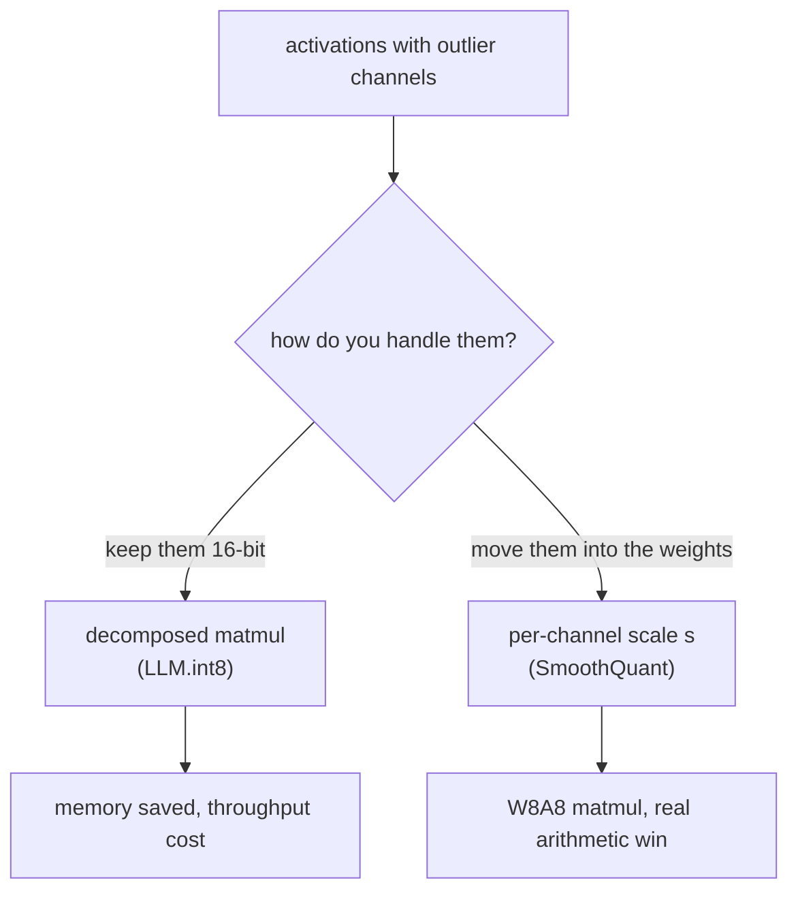
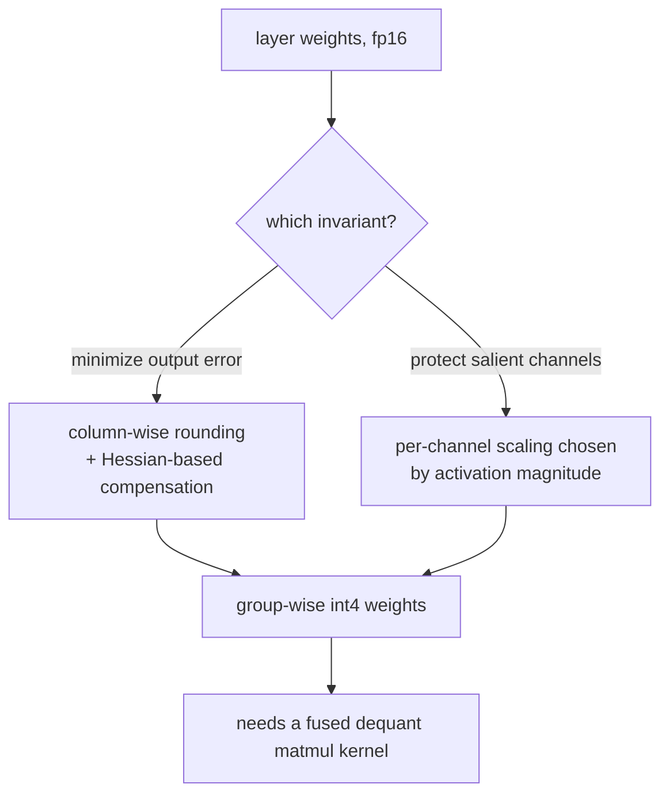
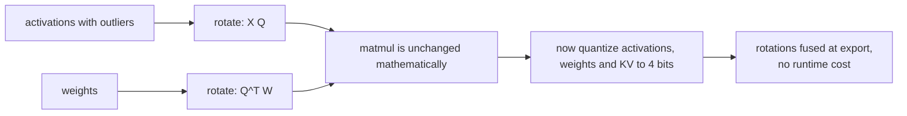
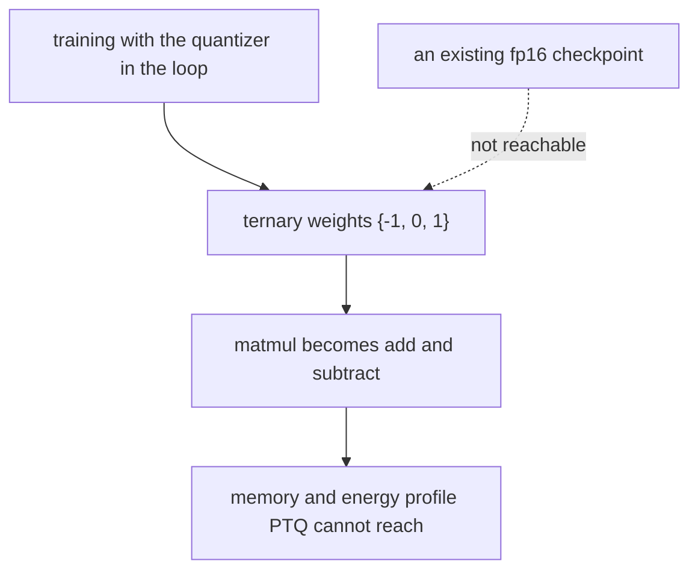
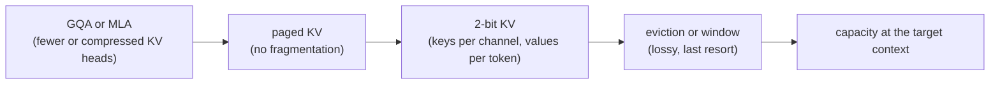
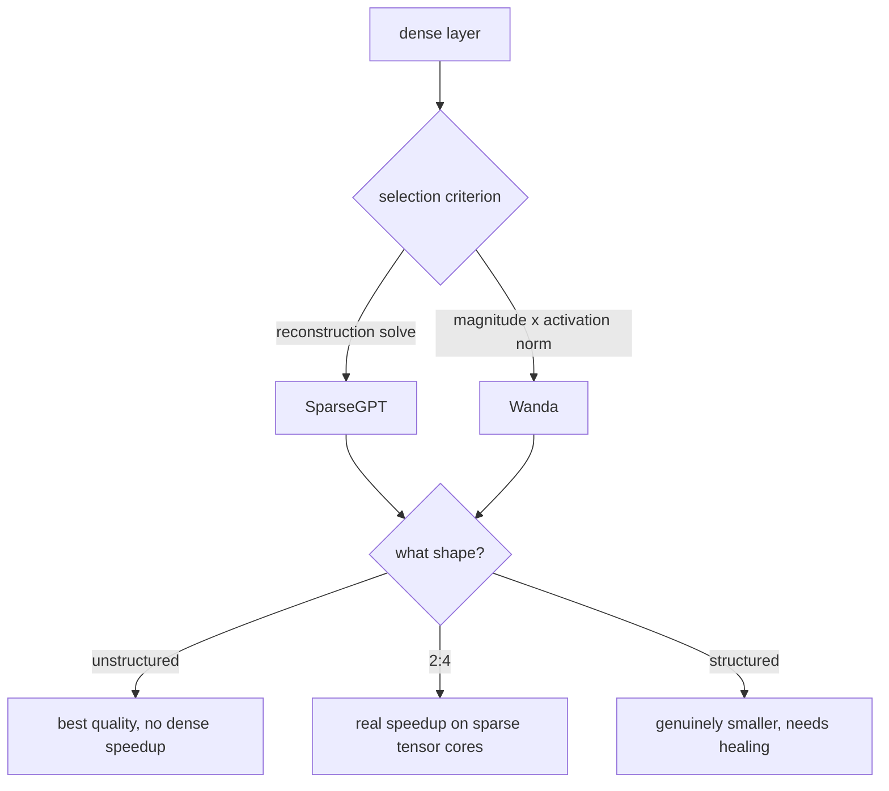
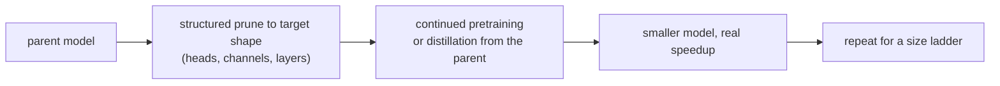
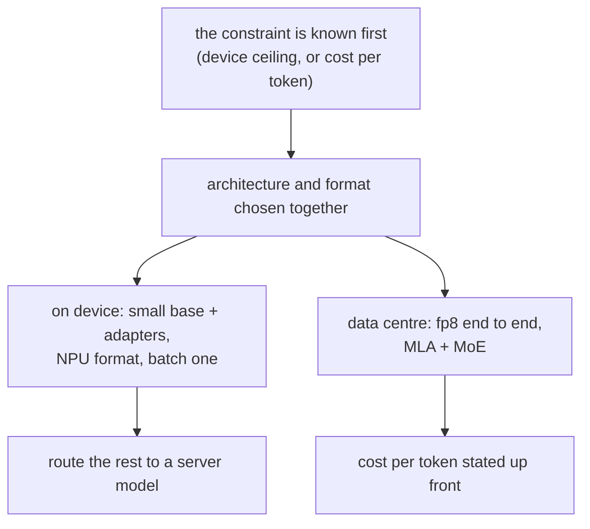
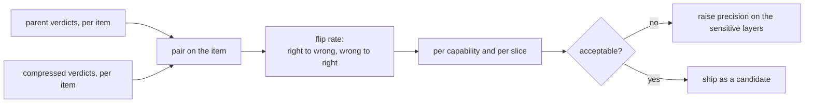

## Model compression

### LLM.int8() and SmoothQuant: the outlier problem, then the way around it ([source](https://arxiv.org/abs/2208.07339))

[LLM.int8()](https://arxiv.org/abs/2208.07339) is the paper that named the obstacle. Past a few billion parameters, a small number of activation channels carry values orders of magnitude larger than everything else and are functionally important, so a single int8 scale wide enough to represent them destroys the resolution of the rest. Its fix is a mixed decomposition: the outlier channels go through a 16-bit matmul, everything else through int8. [SmoothQuant](https://arxiv.org/abs/2211.10438) then makes the difficulty someone else's problem: a per-channel scaling migrates the outlier magnitude from the activations into the weights, where uniform quantization tolerates it, which is what makes fully 8-bit weight-and-activation serving practical.

**Interview questions this design invites**
- Why do outliers appear at scale, and why can you not just clip them?
- What does LLM.int8() cost in throughput, and why?
- Where does SmoothQuant's difficulty go, and why can the weights absorb it?
- What does a weight-only method buy that a W8A8 method does not, and vice versa?
- How do you choose the migration strength in practice?

**Tricks and gotchas**
- Weight-only buys bytes read; activation and compute quantization buys arithmetic. Only the second helps at large batch.
- The migration strength is a calibration decision: too much and the weights become the hard side.
- The decomposed path is a real kernel cost, so measure end to end rather than trusting the format.
- Both need a calibration set that looks like production traffic, not like a benchmark.

**Common mistakes and how to fix them**
- Clipping outliers to fit the range; fix by keeping them in higher precision or migrating them.
- Calibrating on public benchmark text; fix by sampling real traffic, with the distribution you actually serve.
- Quoting an int8 speedup measured at batch one for a high-batch service; fix by measuring at the serving batch size.
- Assuming W8A8 is always available; fix by checking the kernel support of your serving stack first.

### GPTQ and AWQ: two answers to 4-bit weights ([source](https://arxiv.org/abs/2210.17323))

[GPTQ](https://arxiv.org/abs/2210.17323) treats quantization as an error-compensation problem: quantize the weights of a layer column by column, and after each step adjust the remaining weights using second-order information so the layer's output error stays small. [AWQ](https://arxiv.org/abs/2306.00978) makes a different bet: not all weights matter equally, and the ones that matter are identified by the magnitude of the activations they multiply, so scale those channels to protect them and quantize the rest normally. The two arrive at similar quality by different routes, and AWQ's simpler kernels are a large part of why it is the more deployed of the two.

**Interview questions this design invites**
- What is actually being minimized in GPTQ, and what is the calibration set for?
- Why does activation magnitude identify important weights in AWQ?
- What is group size and why is 4-bit really about 4.125 bits?
- When does weight-only 4-bit stop paying, and why?
- What breaks first when the calibration set is mismatched to your traffic?

**Tricks and gotchas**
- Group size is the accuracy-versus-size knob: 128 is the usual compromise, and it is where the extra 0.125 bits come from.
- Keep embeddings, the output projection and the first and last blocks at higher precision by default.
- Calibration mismatch shows up as a specific capability hole, not as a uniform accuracy drop.
- An unfused dequantize-then-matmul path can be net slower than fp16; verify the kernel, not the format.

**Common mistakes and how to fix them**
- Reporting 4-bit memory savings without the group overhead; fix by quoting effective bits per weight.
- Quantizing every layer uniformly; fix by measuring per-layer sensitivity and raising the sensitive ones.
- Accepting on one aggregate benchmark; fix by a paired per-capability comparison against the parent.
- Assuming a speedup at high batch; fix by measuring, since the weight read is already amortized there.

### QuaRot and SpinQuant: rotate the outliers away ([source](https://arxiv.org/abs/2404.00456))

The rotation family attacks the outlier problem at its root instead of routing around it. Multiplying activations and weights by a matched pair of orthogonal matrices leaves the layer's function unchanged, but it spreads the outlier energy across channels so that no channel is extreme any more. [QuaRot](https://arxiv.org/abs/2404.00456) uses fixed Hadamard-style rotations fused into the surrounding weights at export, so serving pays nothing extra. [SpinQuant](https://arxiv.org/abs/2405.16406) learns the rotation instead, buying back the accuracy a fixed rotation leaves behind. This family is what made 4-bit activations and a 4-bit KV cache viable, not just 4-bit weights.

**Interview questions this design invites**
- Why does an orthogonal rotation leave the layer's output unchanged?
- Why does rotating make the distribution easier to quantize?
- What has to be fused at export, and what happens if it is not?
- Why does this family unlock activation and KV quantization rather than just weights?
- When is learning the rotation worth the extra training step?

**Tricks and gotchas**
- The rotation must be fused into neighbouring weights, or you pay a matmul per layer at serving time.
- Residual and normalization placement decides where a rotation can legally be inserted.
- This composes with weight-only methods rather than replacing them.
- The KV cache is often the real prize here, because it is what grows with context.

**Common mistakes and how to fix them**
- Adding rotations as runtime ops; fix by fusing them at export and verifying the graph.
- Expecting a fixed rotation to match a learned one; fix by measuring, and by budgeting the training step if the gap matters.
- Applying 4-bit activations without checking kernel support; fix by asserting the numeric path at startup.
- Treating rotation as a replacement for mixed precision; fix by keeping the usual sensitive layers higher.

### Microsoft Research: BitNet b1.58, when the format has to be trained in ([source](https://arxiv.org/abs/2402.17764))

BitNet's claim is that ternary weights, from the set of minus one, zero and one, can match full-precision quality at scale if the quantizer is present during training rather than applied afterwards. The consequence is architectural: matmuls become additions, which changes what hardware is worth building, and the memory and energy profile is unlike anything post-training quantization can reach. The equally important consequence for an interview answer is the constraint: this is not a lever you can apply to an existing checkpoint, so it belongs in the model design conversation, not the deployment one.

**Interview questions this design invites**
- Why can a trained-in quantizer reach a bit width post-training methods cannot?
- What changes about the hardware story when multiplies become additions?
- What would you need to adopt this, and why is that usually prohibitive?
- Where does the quality claim come from, and what would you check first?
- How does this relate to QAT on an existing model?

**Tricks and gotchas**
- Trained-in quantization is the general escape hatch below 4 bits; BitNet is its extreme point.
- The win is memory bandwidth and energy, so it shows up most at low batch and on constrained hardware.
- Kernel and hardware support decide whether the theoretical win is realizable today.
- Quoted quality is at specific scales; check that the comparison is against a same-token-budget baseline.

**Common mistakes and how to fix them**
- Proposing it as a compression step for a model you already have; fix by naming it as a pretraining decision.
- Assuming the arithmetic win transfers to any GPU; fix by checking for kernels that exploit ternary weights.
- Comparing against an fp16 model trained on different data; fix by insisting on matched budgets.
- Treating QAT and this as the same thing; fix by separating "simulate the quantizer" from "design for the format".

### KIVI: the cache is the other half of the budget ([source](https://arxiv.org/abs/2402.02750))

Once contexts get long, the KV cache rivals or exceeds the weights, and quantizing weights alone stops helping. KIVI's contribution is the asymmetry: keys are quantized per channel and values per token, because their distributions differ, and this asymmetric choice is what lets 2 bits work with no tuning. The ordering discipline around it matters as much as the method: architectural reduction (GQA or MLA) first, then paging, then quantization, and only then eviction or windowing, because each step after the first discards information the previous one preserved.

**Interview questions this design invites**
- Why do keys and values want different quantization granularity?
- Where does KV quantization sit relative to GQA and paging, and why that order?
- How much of the cache can you quantize before retrieval-style tasks degrade?
- What does 2-bit KV do to long-context recall specifically?
- How would you measure whether the cache or the weights is your binding constraint?

**Tricks and gotchas**
- Keep a small recent window in higher precision; the newest tokens are the most sensitive.
- Compute the two terms of the memory budget before choosing a lever; the answer is often not the weights.
- Quantized KV interacts with prefix caching, so validate cache-hit paths as well as fresh requests.
- Long-context evals, not short prompts, are what expose KV quantization damage.

**Common mistakes and how to fix them**
- Quantizing the cache before fixing its shape; fix by adopting GQA or MLA first.
- Using one granularity for keys and values; fix by following the per-channel and per-token split.
- Validating on short prompts; fix by evaluating at the context length you actually serve.
- Jumping to eviction because it is easy; fix by exhausting the lossless and near-lossless steps first.

### SparseGPT and Wanda: one-shot pruning, and the case against complexity ([source](https://arxiv.org/abs/2301.00774))

[SparseGPT](https://arxiv.org/abs/2301.00774) showed that a large model can be pruned to 50 percent sparsity in one shot, with no retraining, by solving a layer-wise reconstruction problem. [Wanda](https://arxiv.org/abs/2306.11695) then reached comparable quality with a criterion that takes a line to state: score each weight by its magnitude times the norm of the input activations it multiplies, and remove the lowest per output row. Reading them as a pair is the point: the second result says most of the benefit came from being activation-aware, not from the solve, which is the kind of finding worth reproducing before adopting anything complicated.

**Interview questions this design invites**
- Why is magnitude alone a weak criterion, and what does the activation norm add?
- Which sparsity shapes actually make inference faster, and on what hardware?
- Why does unstructured 50 percent sparsity often buy nothing in production?
- What does a healing run recover, and when is it required?
- How would you decide between pruning and quantization for the same target?

**Tricks and gotchas**
- Quote the shape with the number: 50 percent unstructured, 2:4, and structured are three different results.
- 2:4 is the shape most current accelerators reward, and it is measurably worse than unstructured at the same ratio.
- Pruning composes badly with aggressive quantization; re-evaluate after each lever rather than at the end.
- Calibration data matters here too, since the criterion depends on activations.

**Common mistakes and how to fix them**
- Reporting a sparsity percentage with no shape; fix by naming the pattern and the kernel that exploits it.
- Expecting speedups on dense kernels; fix by targeting a sparsity-accelerated path or accepting memory savings only.
- Composing pruning and quantization untested; fix by evaluating the combination, not the parts.
- Choosing the complicated method by default; fix by running the simple criterion first as the baseline.

### Sheared LLaMA and Minitron: prune to a shape, then distill ([source](https://arxiv.org/abs/2310.06694))

Both take the position that a smaller model is best obtained from a larger one rather than trained from scratch. [Sheared LLaMA](https://arxiv.org/abs/2310.06694) prunes structurally to a target architecture and then continues pretraining with a dynamic data mixture to recover. [Minitron](https://arxiv.org/abs/2407.14679) turns the same idea into a ladder: one parent, several sizes, each recovered by distillation from the parent, at a small fraction of the tokens a from-scratch run would need. The shared lesson is that structured pruning is the only pruning shape that produces a genuinely smaller model, and that the healing run is part of the method rather than an optional extra.

**Interview questions this design invites**
- Why does structured pruning need a healing run when unstructured pruning does not?
- What is the difference between removing width and removing depth?
- Why is distilling from the parent better than continuing to pretrain on raw data?
- How much recovery budget should you plan for a 2x size reduction?
- When would you train from scratch instead?

**Tricks and gotchas**
- Width degrades gracefully; depth buys more latency per unit removed but damages multi-step reasoning disproportionately.
- The parent is a teacher you already own, which makes distillation the cheapest recovery signal available.
- One parent and a ladder amortizes the parent's cost across every deployment size.
- Layer-importance estimates from a small calibration run are usually enough to choose what to remove.

**Common mistakes and how to fix them**
- Skipping the healing run and concluding pruning does not work; fix by budgeting the recovery tokens up front.
- Cutting depth to hit a latency target; fix by checking multi-step tasks specifically, where depth cuts hurt most.
- Recovering on generic web data; fix by distilling from the parent on a mixture close to the target use.
- Treating the pruned model as the same model; fix by re-running the whole acceptance suite, since it is a new candidate.

### Apple and DeepSeek: designing for the format instead of compressing afterwards ([source](https://arxiv.org/abs/2407.21075))

These two are the same lesson at opposite ends of the hardware range. [Apple's foundation models](https://arxiv.org/abs/2407.21075) are built for a hard device ceiling shared with the operating system, a short list of formats the NPU runs fast, and batch one: the shipped pattern is a small model, quantized to the device's format, with task adapters over one resident base and a server model for everything else. [DeepSeek-V3](https://arxiv.org/abs/2412.19437) makes the same move at the other extreme, using fp8 through training and serving with an architecture (latent attention, sparse experts) chosen so the cheap format is viable in the first place. Neither is compression applied to a finished model; both are cost decisions made before the weights exist.

**Interview questions this design invites**
- What does designing for a format buy that post-training quantization cannot?
- Why are adapters over one resident base the right on-device shape?
- What decides which requests stay on device and which go to the server?
- How do latent attention and sparse experts change the compression conversation?
- What would you have to give up to adopt fp8 training?

**Tricks and gotchas**
- On device the ceiling is shared with the OS and other apps, so the usable budget is well below the device total.
- Adapters let one resident base serve many features without paying for many models.
- Architecture beats compression when you still control the architecture: MLA shrinks the cache structurally and MoE keeps per-token compute down.
- An explicit cost per token is what makes an architecture claim checkable.

**Common mistakes and how to fix them**
- Planning an on-device model against total device memory; fix by budgeting against what the OS actually leaves free.
- Treating the routing boundary as a fallback; fix by designing it as a product decision with its own quality bar.
- Assuming fp8 training is a serving decision; fix by placing it in the model design conversation.
- Comparing a designed-for-cheap model against a compressed one without matching tokens; fix by stating both budgets.

### Microsoft Research India: accuracy is not the acceptance test ([source](https://arxiv.org/abs/2407.09141))

This paper is the one to bring to any conversation about shipping a compressed model. Two checkpoints can score identically on a benchmark and disagree on a large fraction of individual answers, because a mean over items hides a redistribution underneath it. The proposed instrument is flip rate: the share of items where the compressed model changes the parent's verdict, measured per capability. It converts acceptance from "did the average hold" into "how much of the behaviour moved", which is the question a product owner is actually asking.

**Interview questions this design invites**
- How can two models with the same accuracy behave very differently?
- What is flip rate, and why measure it in both directions?
- Why is the comparison paired, and what do you have to store to do it?
- How would you set a flip-rate threshold for a product?
- Which slices deserve their own threshold?

**Tricks and gotchas**
- Keep per-item verdicts from the parent; without them there is no paired comparison later.
- Report both directions: a compressed model that fixes items is still a behaviour change users will notice.
- Slice by capability, since damage concentrates rather than spreading evenly.
- Pair this with a small human review of flipped items; the aggregate number does not say which flips matter.

**Common mistakes and how to fix them**
- Accepting on a benchmark delta inside the noise; fix by measuring flips, which are far more sensitive.
- Measuring only net accuracy change; fix by reporting both flip directions separately.
- Testing on public benchmarks only; fix by including production-shaped traffic in the acceptance set.
- Shipping a compressed model as an update to the same model; fix by treating it as a new candidate with a full acceptance run.
