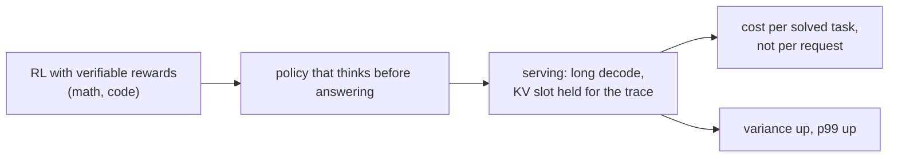
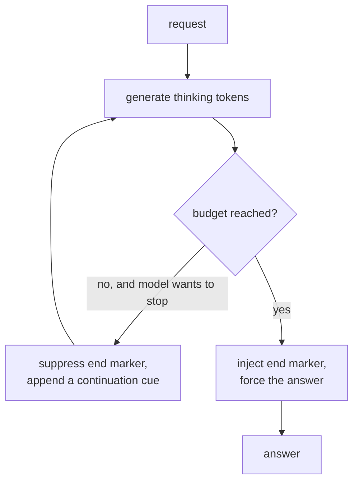
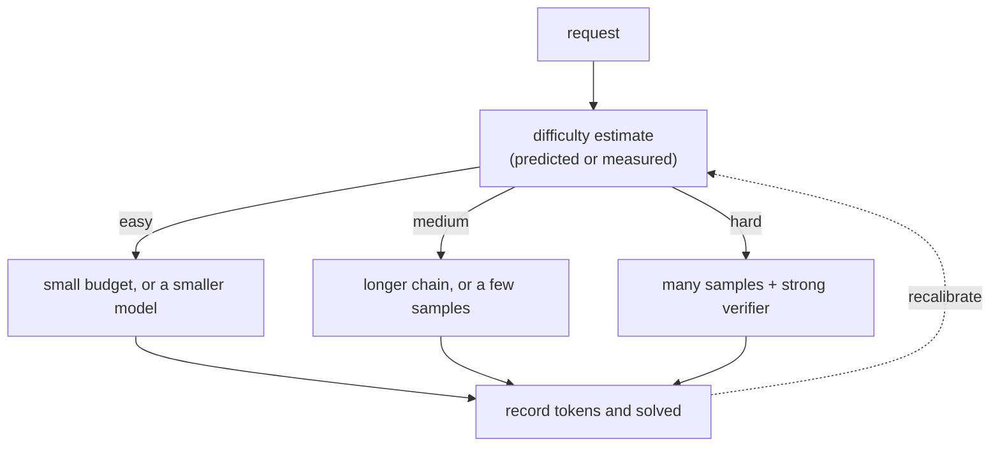
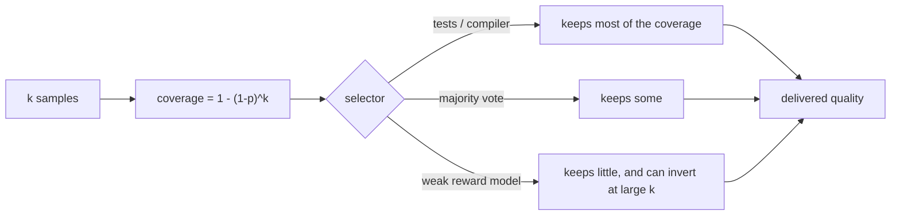
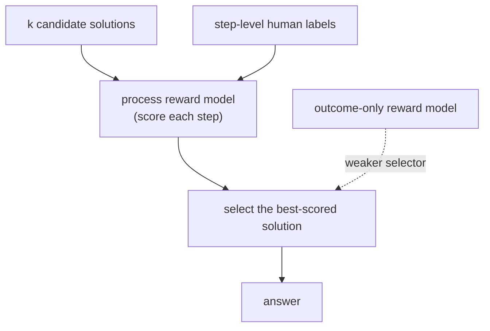
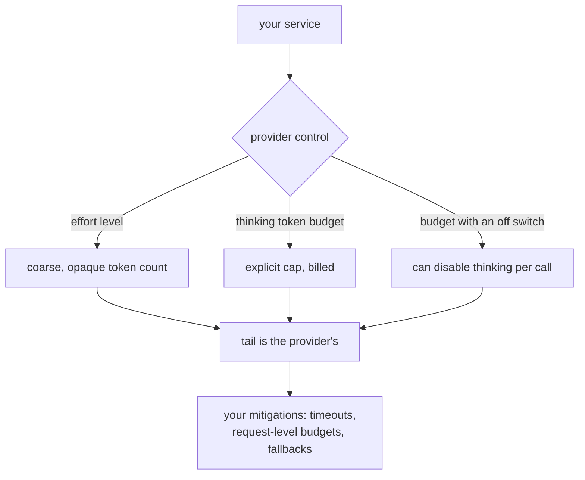
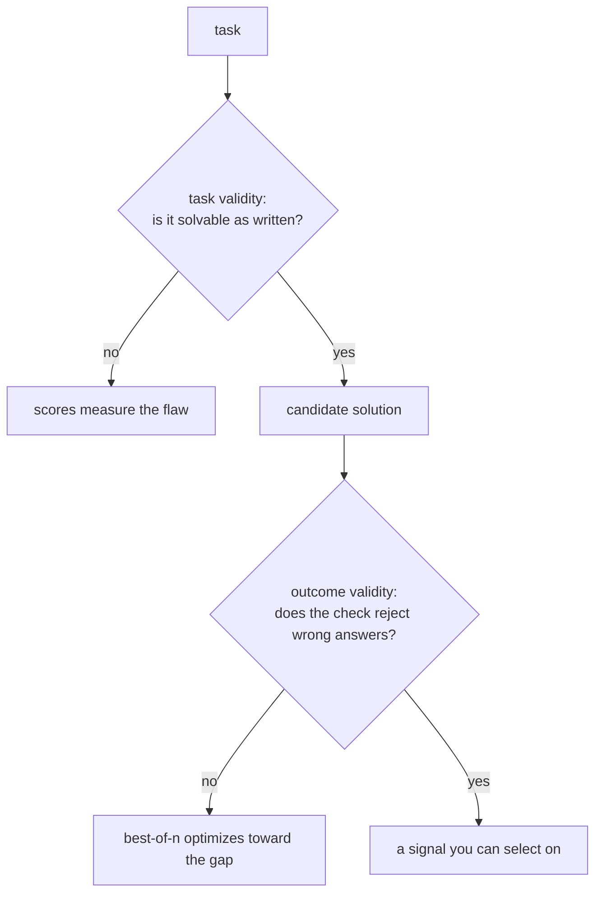

## Reasoning and test-time compute

### DeepSeek: R1, reasoning as a training decision you then have to serve ([source](https://arxiv.org/abs/2501.12948))

R1's method is reinforcement learning against rewards that a program can check, so correctness on math and code drives the update rather than a learned preference model. The result is a model that produces long thinking traces before answering, and the serving consequence is the part an interview cares about: the trace is generated, so it is decode, so it is pure memory-bandwidth work that holds a KV slot for its whole length. A model like this changes your cost model from tokens per answer to tokens per solved task, and it moves your p99 more than your p50.

**Interview questions this design invites**
- Why does verifiable reward avoid the failure modes of a learned reward model?
- What does a long thinking trace do to batch occupancy and to the tail?
- Which tasks does this training approach not help, and why?
- How would you decide whether to serve a reasoning model or add a verifier around a cheaper one?
- What changes in your capacity plan when average output length triples?

**Tricks and gotchas**
- Trace length is workload, not a setting: measure the distribution, not the mean, before planning capacity.
- The trace is bandwidth-bound decode, which is exactly what speculative decoding accelerates.
- Distilling from long traces transfers the length as well as the skill, so the student inherits the cost.
- Verifiable-reward training only exists where a checker exists, which is the same constraint as serving-side verification.

**Common mistakes and how to fix them**
- Planning capacity from mean output length; fix by planning from the length distribution and the cap hit rate.
- Comparing a reasoning model to a non-reasoning one on score alone; fix by reporting the cost and latency frontier.
- Assuming thinking helps everywhere; fix by measuring per task type, since recall and extraction do not benefit.
- Letting traces run unbounded; fix with a hard cap and a forced answer at the boundary.

### Stanford and collaborators: s1, the budget as a prompt-level knob ([source](https://arxiv.org/abs/2501.19393))

s1's result is that you do not need a large training program to get a budget knob. Fine-tuning on a small curated set (about a thousand examples) plus budget forcing at decode time, suppressing the end-of-thinking marker to make the model continue or injecting it to make it stop, produces controllable test-time compute. The value in a system design conversation is that it separates two things people conflate: having a model that can think, and having a mechanism to decide how much it thinks on this request.

**Interview questions this design invites**
- What is budget forcing, and why does it work at all?
- When does forcing a longer budget stop helping, and what does it look like when it hurts?
- How does this differ from a provider effort parameter in what you can control and observe?
- What selection do you pair it with, and why is majority vote the usual choice?
- What would you measure to set the budget per request class?

**Tricks and gotchas**
- Forcing a budget a model was not trained for degrades output; the knob is not free at either end.
- Suppression and injection are decode-time interventions, so they compose with any serving stack you control.
- The end of a forced trace is where malformed answers appear; always parse and validate the final segment.
- A small curated training set is a real result: the data quality, not the volume, is what carried it.

**Common mistakes and how to fix them**
- Turning the budget up as a general quality knob; fix by measuring per task type where it actually pays.
- Truncating instead of forcing; fix by injecting the end marker so the model produces an answer.
- Assuming the budget transfers across models; fix by re-calibrating per model and per prompt style.
- Reporting the average gain; fix by reporting the distribution, since gains concentrate on hard items.

### Google DeepMind and UC Berkeley: allocate by difficulty ([source](https://arxiv.org/abs/2408.03314))

This paper asks the budget question properly: given a fixed inference budget, how should it be spent, and when is spending it better than using a larger model. The answer is that the optimal strategy depends on the difficulty of the item, that adaptive allocation beats any fixed setting, and that for easier problems extra test-time compute can substitute for a larger model while for the hardest ones it cannot. In a design conversation this is the result that turns "should we enable thinking" into "what is our allocation policy".

**Interview questions this design invites**
- When does test-time compute substitute for a larger model, and when does it not?
- How do you estimate difficulty without a difficulty classifier?
- Why does adaptive allocation beat a fixed budget at the same total spend?
- What is the right objective: accuracy per dollar, or solved tasks per dollar?
- How would you evaluate the allocation policy itself?

**Tricks and gotchas**
- A cheap attempt plus a verifier measures difficulty instead of predicting it, and is usually the better classifier.
- Sequential and parallel spend trade differently: one costs latency, the other costs tokens.
- The policy needs an outcome log per request or it cannot be recalibrated.
- Budget policy composes with model routing; the underrated cell is a small model given room to think.

**Common mistakes and how to fix them**
- One global effort setting; fix with per-class allocation driven by measured outcomes.
- Estimating difficulty with a model nobody evaluated; fix by evaluating the classifier as its own component.
- Optimizing accuracy per request; fix by optimizing cost per solved task, which is what the business pays for.
- Ignoring latency when choosing parallel over sequential; fix by treating the p99 target as a hard constraint.

### Stanford: Large Language Monkeys, coverage is not delivered quality ([source](https://arxiv.org/abs/2407.21787))

The paper's finding is that coverage, the probability that at least one of k samples is correct, keeps rising with k across orders of magnitude, often far beyond where single-sample accuracy plateaus. The second half is the one people forget: that coverage is only realizable if something can pick the right sample. With an executable verifier you keep most of it; with a weak selector you keep a fraction. This is the cleanest statement of why best-of-n is a systems decision about verification rather than a sampling trick.

**Interview questions this design invites**
- Derive pass@k, and say what it assumes about sample independence.
- Why can delivered quality fall as k grows when the selector is a learned reward model?
- What is the cheapest verifier available for a given task, and how would you test it?
- When is sampling more worth it than thinking longer?
- How would you report the result of a best-of-n experiment honestly?

**Tricks and gotchas**
- Delivered quality is roughly coverage times selector accuracy; both numbers belong in the report.
- Samples are not independent at low temperature, so measured coverage can fall short of the formula.
- Sandbox capacity, not model cost, is often the real constraint on k.
- Best-of-n against a learned reward is optimization against the verifier, which is why quality can peak and then fall.

**Common mistakes and how to fix them**
- Quoting pass@k as a product metric; fix by quoting what the selector actually delivers.
- Using majority vote on tasks where the model is confidently wrong; fix by using an executable check where one exists.
- Raising k without watching for reward hacking; fix by plotting delivered quality against k, not just coverage.
- Ignoring the tail cost of k parallel generations; fix by measuring the p99 of the slowest sample, which is what the user waits for.

### OpenAI: Let's Verify Step by Step, the verifier as a first-class component ([source](https://arxiv.org/abs/2305.20050))

The result is that supervising the reasoning process, with a label per step, produces a far stronger selector than supervising only the final outcome, and the process reward model then works as the selector in best-of-n. The design lesson generalizes past math: the quality of your selector is what converts sampling into answers, so the verifier deserves the same engineering attention as the generator. The cost is equally real, since a step-level model is expensive to label and its inference can rival the generation it is grading.

**Interview questions this design invites**
- Why does process supervision beat outcome supervision as a selector?
- What does step-level labelling cost, and how would you reduce it?
- When does verification cost more than generation, and what do you do then?
- How is a process reward model gamed, and how would you detect it?
- Where does this generalize outside math and code?

**Tricks and gotchas**
- The verifier is part of the serving cost, so include it in the cost per solved task.
- A reward model is gameable in both forms; process supervision makes it subtler, not impossible.
- Executable checks dominate learned scores wherever they exist, so reach for them first.
- Keep the step scores for debugging: they explain why a wrong sample was chosen.

**Common mistakes and how to fix them**
- Treating the selector as free; fix by pricing verification into the request.
- Using an uncertified judge as the accept test; fix by certifying it against labels and pinning its version.
- Assuming a strong selector transfers across domains; fix by re-measuring on your own tasks.
- Reporting selection accuracy on the training distribution; fix by holding out items the selector never scored.

### OpenAI, Anthropic and Google: the effort knob as a product surface ([source](https://platform.openai.com/docs/guides/reasoning))

All three providers expose the same idea in different shapes: [OpenAI's reasoning guide](https://platform.openai.com/docs/guides/reasoning) documents an effort setting, [Anthropic's extended thinking](https://docs.anthropic.com/en/docs/build-with-claude/extended-thinking) exposes a thinking-token budget, and [Google's Gemini thinking docs](https://ai.google.dev/gemini-api/docs/thinking) expose a budget that can be set to zero. For a caller these are the whole control surface: you choose a level, you pay for tokens you may not be able to inspect, and the tail behaviour is the provider's to manage. Knowing the three shapes and what each hides is a common interview question for anyone building on APIs rather than serving their own models.

**Interview questions this design invites**
- What can you control through an effort parameter, and what can you not?
- How do you enforce a latency SLO on top of a provider you do not schedule?
- How do you compare two providers whose budget knobs have different units?
- What do you log per request to make the cost auditable later?
- When is self-hosting worth it purely for tail control?

**Tricks and gotchas**
- Thinking tokens are billed and often not returned, so the cost is visible and the content is not.
- Two effort settings of one model are two candidates for evaluation purposes.
- A client-side timeout without a server-side budget wastes the tokens already generated.
- Cache and reuse where possible: prefix caching helps the prompt, never the unique trace.

**Common mistakes and how to fix them**
- Assuming an effort level maps to a fixed token count; fix by measuring the distribution per task type.
- Setting one effort level globally; fix with per-class settings driven by measured outcomes.
- Comparing providers on price per token; fix by comparing cost per solved task at equal quality.
- Retrying on timeout without a cap; fix with a budget for the whole request, retries included.

### UIUC and collaborators: your verifier is a benchmark and it can be wrong ([source](https://arxiv.org/abs/2507.02825))

This paper audits agentic benchmarks and finds two distinct failures: task validity, where a task cannot be solved as specified, and outcome validity, where the checker accepts a solution that is not correct. Both matter directly to a reasoning stack, because the same checker that scores a benchmark is often the verifier that selects among samples in production. If it accepts wrong answers, best-of-n is optimizing towards them, and the measured gain is partly an artifact of the checker.

**Interview questions this design invites**
- What is the difference between task validity and outcome validity?
- How would you audit a test suite that you are also using as a production verifier?
- What does a weak verifier do to a best-of-n system specifically?
- How many trajectories would you read before trusting an agent number?
- How do you keep a verifier from being gamed by the generator over time?

**Tricks and gotchas**
- The production verifier and the benchmark checker are usually the same code, so a benchmark audit is also a system audit.
- Adversarial review beats sampling: ask what a wrong answer that passes would look like, then look for it.
- Add negative tests to the verifier itself, so it is shown to reject known-bad solutions.
- Track acceptance rate over time; a rising rate with flat quality is the signature of gaming.

**Common mistakes and how to fix them**
- Trusting a passing rate with no trajectory review; fix by reading twenty passing runs before publishing.
- Using the same checker to both select and evaluate; fix by holding out an independent evaluation check.
- Assuming a test suite that passes for humans is strong enough for an optimizer; fix by adding negative cases.
- Reporting an agent gain without auditing the verifier; fix by stating the verifier's own error rate next to the gain.
