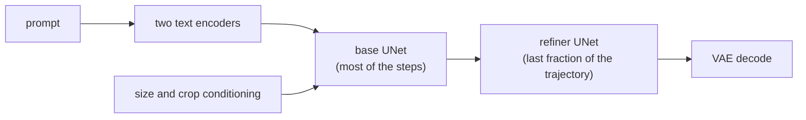
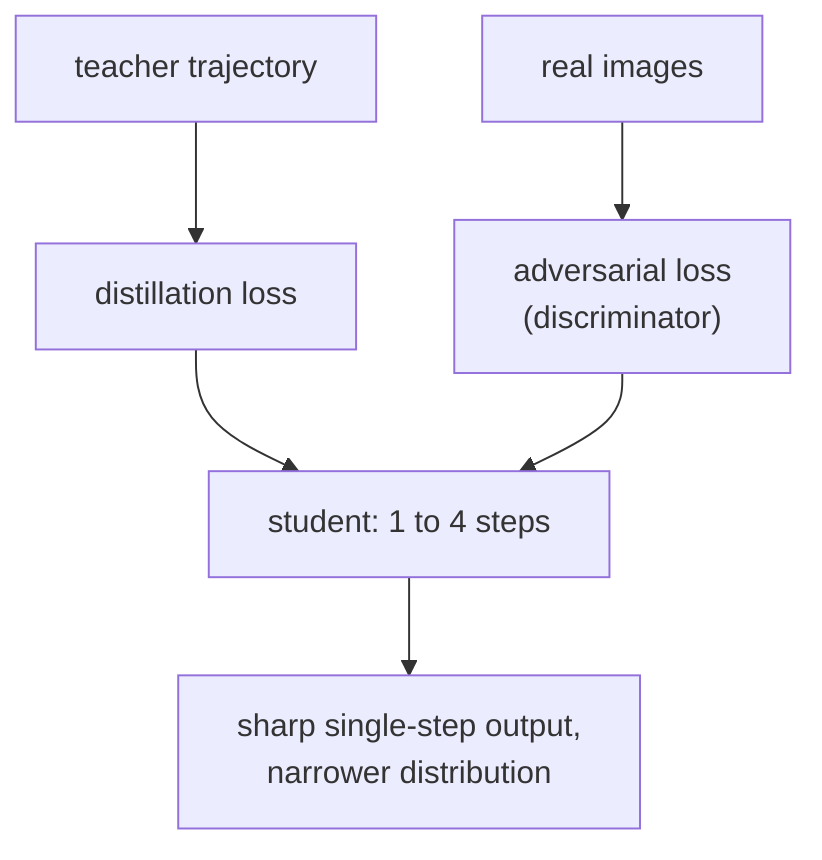
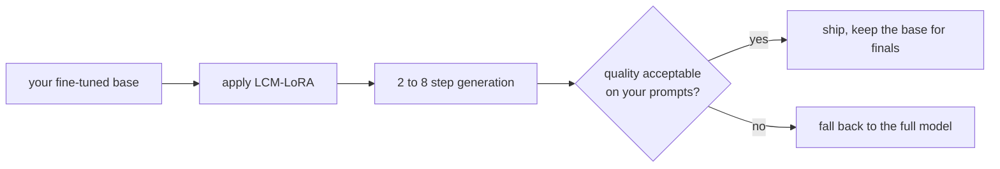
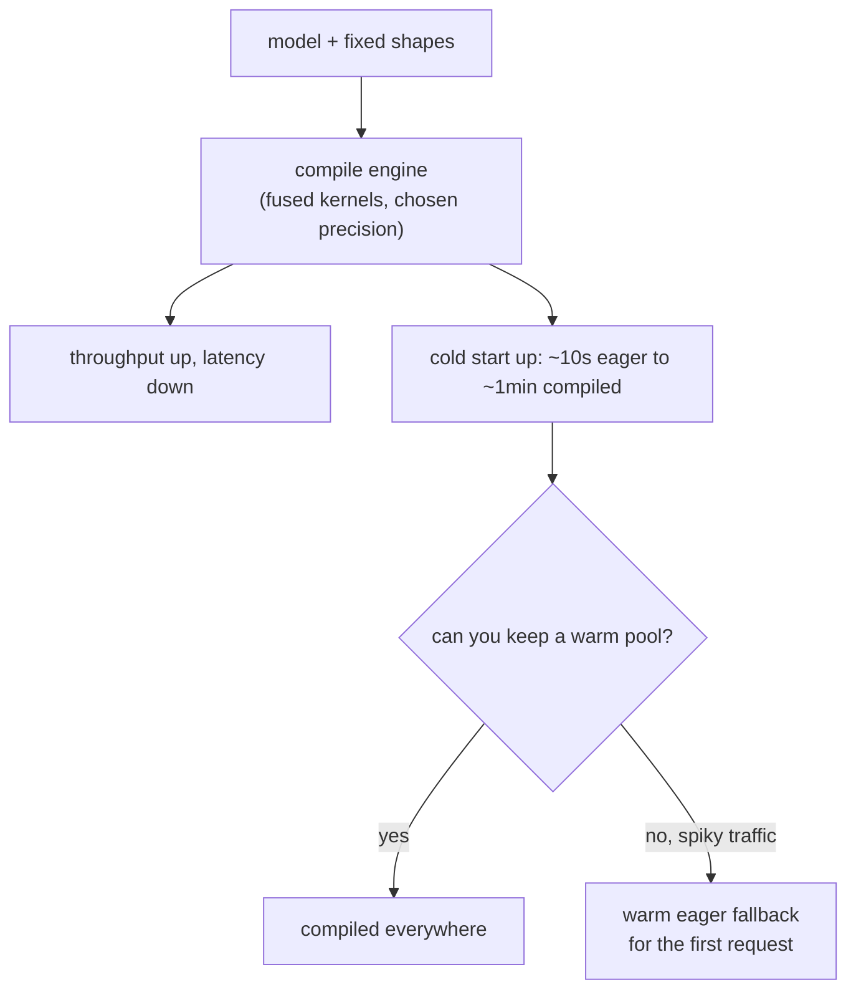
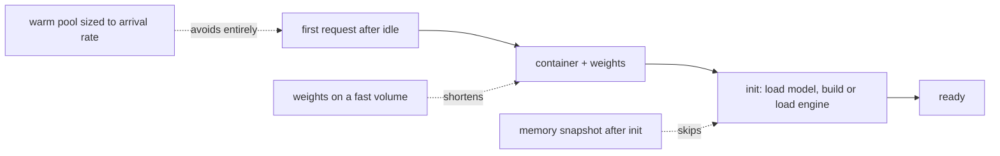
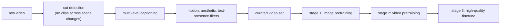
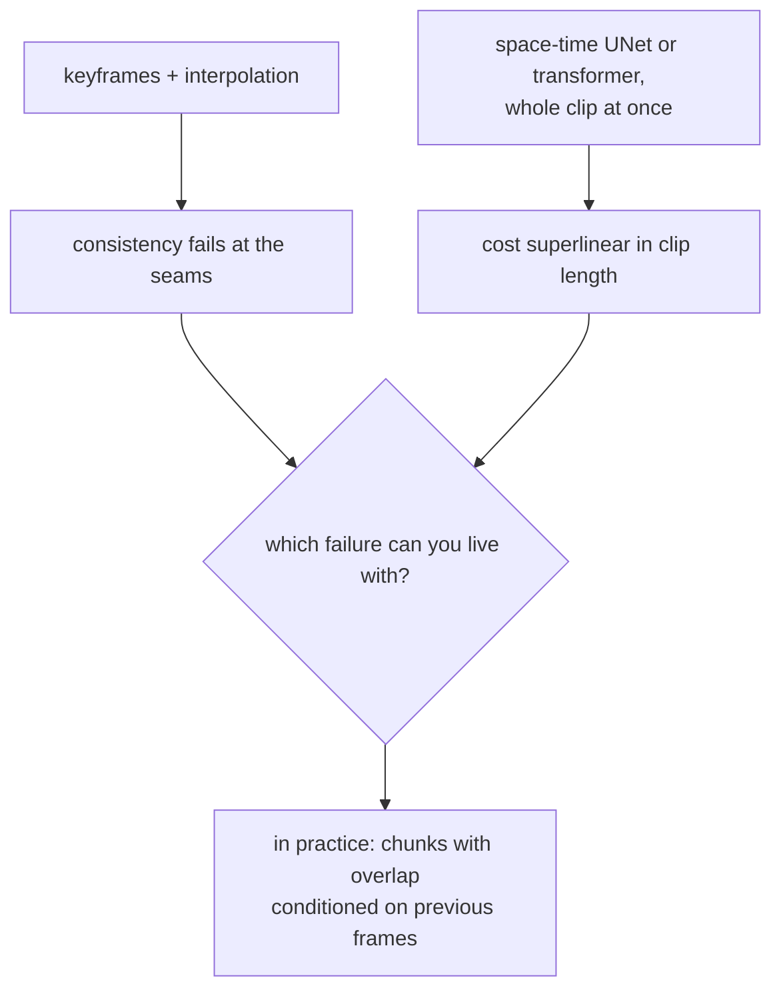

## Image and video generation serving

### Stability AI: SDXL, a bigger base and a refiner stage ([source](https://arxiv.org/abs/2307.01952))

SDXL is the design most open image generation still inherits. It scales the UNet, adds a second text encoder, conditions on the original image size and crop parameters so the model stops producing accidentally cropped compositions, and adds a separate refiner model that runs on the last part of the trajectory to clean up detail. For serving, the interesting part is that the refiner is a second model in the path: the pipeline is two loaded checkpoints and two sets of weights in memory, and the refiner's share of the step budget is a tunable that most deployments never tune.

**Interview questions this design invites**
- Why condition on the original image size and crop, and what artifact does it remove?
- What does the refiner cost you in memory, and when would you drop it?
- How would you split the step budget between base and refiner?
- Why two text encoders, and what would you lose with one?
- Where does 1024px generation get its affordability from?

**Tricks and gotchas**
- The refiner is optional at serving time: dropping it frees memory and some latency, and costs fine detail.
- Size and crop conditioning is a data-side fix expressed as an input, which is worth knowing as a pattern.
- Two checkpoints resident means the memory plan is for both, plus the VAE and the text encoders.
- Most of the latency is still the base loop, so tune steps before you tune the refiner split.

**Common mistakes and how to fix them**
- Budgeting memory for one model; fix by counting base, refiner, VAE and text encoders together.
- Assuming the refiner is what makes SDXL good; fix by ablating it, since the base carries most of the quality.
- Serving at a resolution the model was not conditioned for; fix by using the conditioning inputs as intended.
- Quoting SDXL latency without saying whether the refiner ran; fix by reporting the full pipeline.

### Stability AI: adversarial diffusion distillation, one step that stays sharp ([source](https://arxiv.org/abs/2311.17042))

ADD is the answer to the fact that pure distillation to one step produces soft images. It combines a distillation loss against the teacher's trajectory with an adversarial loss from a discriminator on real images, so the student is pushed both toward the teacher's behaviour and toward realism. The result, SDXL-Turbo, generates in one to four steps, which changes the product: generation becomes interactive at typing speed rather than a request you wait on. The tradeoff is the one every distillation makes, and this paper is unusually direct about it: diversity falls.

**Interview questions this design invites**
- Why does one-step distillation without a discriminator produce soft images?
- What exactly is lost when a model goes from 30 steps to 1, and how would you measure it?
- When is a narrow output distribution acceptable, and when is it fatal?
- How would you route between a distilled and a full model in one product?
- What does interactive generation change about the product design?

**Tricks and gotchas**
- Diversity loss shows up on the tail of prompts, not on demo prompts, so the acceptance set has to include hard compositions.
- One-step generation makes guidance moot, which removes the factor of two as well.
- Keep both models resident if you route: the distilled path for drafts, the full path for the final render.
- Latency low enough to run per keystroke changes the UI, and the UI change is usually the point.

**Common mistakes and how to fix them**
- Accepting a distilled model on a handful of prompts; fix with a paired preference test over a broad set.
- Reporting the speedup without the diversity cost; fix by reporting both, since an interviewer will ask.
- Using a distilled model for a creative tool; fix by routing, or by accepting narrower outputs deliberately.
- Assuming distillation transfers to every base; fix by re-running the acceptance test per checkpoint.

### Latent consistency models and LCM-LoRA: distillation as an adapter ([source](https://arxiv.org/abs/2310.04378))

[LCM](https://arxiv.org/abs/2310.04378) applies consistency distillation in the latent space, reaching high-quality generation in two to eight steps. [LCM-LoRA](https://arxiv.org/abs/2311.05556) is the part that mattered operationally: the distillation is packaged as a LoRA adapter, so it can be applied to an existing fine-tuned checkpoint without redoing the distillation. That turned few-step generation from a research result into something a team could adopt in an afternoon, and it is the clearest example in this topic of packaging deciding adoption.

**Interview questions this design invites**
- Why can a LoRA carry a distillation, and what does that say about what distillation changes?
- How would you evaluate it against your own fine-tune rather than against the reference base?
- What happens when you stack a style LoRA and an acceleration LoRA?
- What is the memory and swap cost of adapters at serving time?
- When would you distill properly instead of using the adapter?

**Tricks and gotchas**
- Adapters compose imperfectly: a style LoRA plus an acceleration LoRA can interact, so test the combination you will ship.
- Quality varies by base checkpoint, so the result on the reference model is not your result.
- Adapter swapping is cheap enough to do per request, which lets one resident base serve many styles.
- Few-step models often want a different guidance setting, sometimes none at all.

**Common mistakes and how to fix them**
- Trusting the reference benchmark; fix by evaluating on your own base and prompt distribution.
- Holding one full model per style; fix with one base plus adapters.
- Leaving guidance at the old setting; fix by re-tuning it for the few-step regime.
- Treating adapter composition as free; fix by testing the exact stack you serve.

### NVIDIA and Baseten: compiled engines, and the cold start they cost ([source](https://www.baseten.co/blog/40-faster-stable-diffusion-xl-inference-with-nvidia-tensorrt/))

Diffusion is the friendly case for ahead-of-time compilation: shapes are fixed from the start, there is no growing KV cache, and the same graph runs every step. [Baseten's writeup](https://www.baseten.co/blog/40-faster-stable-diffusion-xl-inference-with-nvidia-tensorrt/) reports roughly 40 percent faster SDXL inference with TensorRT on H100, sub-two-second latency at 30 steps, and the part worth remembering: cold start goes from about ten seconds to roughly a minute, because the engine has to be loaded and the shapes are baked in. [NVIDIA's own post](https://developer.nvidia.com/blog/generate-stunning-images-with-stable-diffusion-xl-on-the-nvidia-ai-inference-platform/) walks the same optimization stack, and [the video version](https://developer.nvidia.com/blog/optimizing-transformer-based-diffusion-models-for-video-generation-with-nvidia-tensorrt/) does it where attention spans space and time.

**Interview questions this design invites**
- Why is diffusion easier to compile ahead of time than LLM decode?
- What does a compiled engine cost you operationally?
- How many engines do you need if the product exposes three resolutions and two batch sizes?
- How would you serve spiky traffic that must scale to zero?
- Where would you measure to prove the speedup is real for your workload?

**Tricks and gotchas**
- One engine per shape: resolutions and batch sizes multiply, and each engine is a build artifact to version.
- Throughput and latency answer different questions; benchmark both, and at your real batch size.
- A warm eager replica behind the compiled pool absorbs the first request after idle.
- Precision changes hide inside compilation, so include them in the acceptance test rather than assuming parity.

**Common mistakes and how to fix them**
- Adopting compilation without measuring cold start; fix by measuring it as a first-class number.
- Building an engine per shape by hand; fix by generating them in CI and versioning them with the model.
- Comparing compiled latency to eager throughput; fix by comparing like for like.
- Assuming quality is unchanged; fix with a paired preference test after any precision change.

### Modal: cold start as the product problem ([source](https://modal.com/docs/guide/cold-start))

Modal's cold-start guide is the operational counterpart to the compilation decision, from a platform whose whole business is that problem. The techniques generalize: keep the container image small, load weights from a fast shared volume rather than pulling them at start, snapshot memory after initialization so the expensive setup happens once, and keep a small warm pool sized to the arrival rate rather than to peak. For a generation service where weights are several gigabytes and the engine build is minutes, these decide whether the cost floor is zero or one always-on GPU.

**Interview questions this design invites**
- What are the components of a cold start for a generation service, in seconds?
- Which of them can be removed entirely, and which only shortened?
- How would you size a warm pool from an arrival-rate distribution?
- What does scale-to-zero cost the user, and when is that acceptable?
- How does this interact with the decision to compile?

**Tricks and gotchas**
- Weight loading usually dominates image pull, so a fast volume beats a smaller image.
- Snapshotting after initialization turns a per-start cost into a one-time cost.
- Warm-pool sizing is a queueing problem, not a guess: the arrival rate and the start time set it.
- Cold start and p99 are the same conversation once traffic is spiky.

**Common mistakes and how to fix them**
- Optimizing the container image while the weights dominate; fix by measuring the phases separately.
- Sizing a warm pool for peak; fix by sizing for the arrival rate and letting the queue absorb bursts.
- Ignoring cold start until launch; fix by making it a tracked metric from the first deployment.
- Treating scale-to-zero as free; fix by pricing the first-request latency it imposes.

### Stability AI: Stable Video Diffusion, where the paper is mostly about data ([source](https://arxiv.org/abs/2311.15127))

The notable thing about the SVD report is its ordering: most of it is the video data pipeline, not the architecture. Cut detection to avoid training across scene boundaries, captioning at multiple levels, optical-flow filtering to drop static clips, aesthetic and text-presence filters, then a three-stage recipe of image pretraining, video pretraining on the curated set, and high-quality fine-tuning. For an interview, this is the evidence for the claim that in video generation the data pipeline is the system.

**Interview questions this design invites**
- Why does cut detection matter before anything else?
- What does a static-clip filter protect the model from learning?
- Why start from an image model rather than training video from scratch?
- What would you measure to know the curation worked?
- Where do the licensing questions sit in this pipeline?

**Tricks and gotchas**
- Training across a scene change teaches the model to hallucinate cuts, which is a visible artifact.
- Motion filtering by optical flow removes both static clips and camera-shake noise.
- Image pretraining first is what makes the video stage affordable.
- Curation decisions are more reproducible than architecture ones, which is why the report spends its pages there.

**Common mistakes and how to fix them**
- Scraping video and training; fix by budgeting the curation pipeline as the main work.
- Ignoring caption quality; fix by captioning at several granularities and measuring prompt adherence later.
- Treating licensing as a later problem; fix by naming it as a constraint on the source list.
- Comparing video models without stating clip length and resolution; fix by quoting both with every number.

### Google and Meta: whole-clip generation, and the scale it takes ([source](https://arxiv.org/abs/2401.12945))

[Lumiere](https://arxiv.org/abs/2401.12945) makes one architectural argument: generate the entire clip in a single pass through a space-time network, rather than producing distant keyframes and interpolating between them, because the interpolation seam is where temporal consistency fails. [Movie Gen](https://arxiv.org/abs/2410.13720) is the other end of the same problem, a family of media models with the training and inference scale stated, which is what makes it citable when someone asks what a production video system actually costs. Together they set the expectation for the topic: video generation is minutes of GPU time per clip and belongs in a queue.

**Interview questions this design invites**
- Why does keyframe interpolation produce inconsistency, and where does it show?
- What makes cost superlinear in clip length?
- How would you generate a clip longer than the model's native window?
- Why is quality worse further from the conditioning frame?
- What is the right latency contract for a video feature?

**Tricks and gotchas**
- Chunked generation with overlap is the practical compromise, and its quality decays with distance from the conditioning frame.
- Quote a clip-length limit rather than implying unbounded generation.
- A low-resolution, low-frame-rate preview tier is how these products stay affordable.
- Cost per second of output video is the metric; cost per request means nothing here.

**Common mistakes and how to fix them**
- Serving video from a request-response endpoint; fix with a queued job and a progress channel.
- Promising arbitrary length; fix by exposing the chunking and its quality decay honestly.
- Comparing clips at different resolutions and frame rates; fix by fixing both before measuring.
- Budgeting video like images; fix by pricing per second of output at the target resolution.
