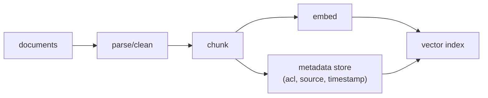
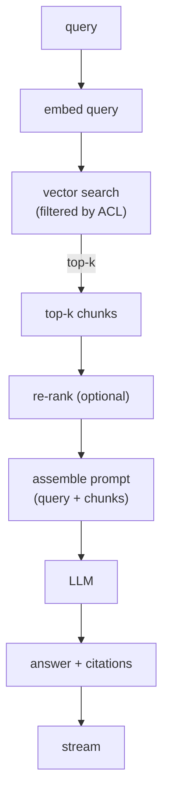

# 01 - RAG serving

> **Interviewer:** "Design a system that answers employee questions over our
> internal knowledge base: wikis, tickets, design docs, roughly 50 million
> documents. Answers must cite their sources and stay current as docs change."

This is the most common LLM system design question right now, and the most
common place candidates go shallow. The trap is to draw "embed, retrieve,
generate" in thirty seconds and then have nothing left to say. The signal is in
retrieval quality, freshness, and how you know it works.

## 1. Clarify and scope

- **Who asks and how often?** Internal tool, say 10k employees, peak maybe 20
  queries per second. Not web scale, but not a demo either.
- **Latency budget?** Interactive chat. Streaming first token under ~1.5s is the
  target; full answer in a few seconds.
- **Freshness?** Docs change daily. A new doc should be answerable within
  minutes to an hour, not next week.
- **Quality bar?** Answers must be grounded in retrieved docs and cite them.
  Abstaining ("I could not find this") is better than confidently wrong.
- **Corpus:** 50M docs, mixed formats, heavily skewed length distribution
  (one-line tickets next to 80-page design docs).

## 2. Requirements

**Functional**
- Retrieve relevant passages for a query
- Generate a grounded answer with citations
- Abstain when retrieval is weak
- Keep the index current as documents change

**Non-functional**
- p99 first-token latency under ~1.5s
- ~20 QPS sustained, headroom to 100
- Freshness under 1 hour
- Cost per query low enough for unlimited internal use
- Access control: a user must not retrieve docs they cannot read

The non-functional requirement that quietly dominates here is **access
control**, because it constrains retrieval. Get it wrong and the system leaks.
Flag it early.

## 3. High-level data flow

Two paths. Keep them separate.

### Offline (write) path

Runs on ingest and on change. A document update re-chunks and re-embeds only the
changed document, and upserts into the index. This is what buys you freshness.

### Online (read) path

## 4. Deep dives

### Chunking is a real design decision, not a default

Naive fixed-size chunking (say 512 tokens) splits mid-sentence and mid-table and
destroys retrieval quality. Better options, in increasing sophistication:

- **Recursive / structural chunking:** split on document structure (headings,
  paragraphs, code blocks) first, then size-cap.
- **Overlap:** a sliding window with overlap so an answer spanning a boundary is
  still retrievable in one chunk.
- **Contextual chunking:** prepend a short doc/section summary to each chunk so a
  standalone chunk still carries context ("This is from the Q3 billing design
  doc, section on refunds: ...").

Chunk size trades recall against precision and prompt cost. Smaller chunks
retrieve more precisely but you need more of them; larger chunks carry more
context but dilute the embedding. State the tradeoff; pick a default (say
structural chunks capped at ~500 tokens with ~50 token overlap) and move on.

### The embedding service

The query and every chunk go through an **embedding model**, a text encoder that
maps text to a vector. Key decisions:

- **Model choice:** dimension (384 to 1536 typical), domain fit, and cost. A
  larger embedding dimension improves recall slightly but costs more storage and
  search time. For 50M chunks, dimension drives your index memory budget
  directly.
- **It is its own service.** The encoder is a transformer stack like the
  generator, just used to produce a pooled vector rather than to generate text.
  It needs its own batching and autoscaling on the write path (bulk embedding 50M
  chunks) and the read path (one query embedding per request, latency-sensitive).
- **Cache query embeddings.** Repeated and near-repeated queries are common
  internally.

If the interviewer wants to go deeper on the encoder, this is the moment to
ground the discussion in a real encoder-stack architecture rather than a box
labeled "embedder." See the link at the end.

### Vector index at 50M scale

Exact nearest-neighbor over 50M vectors per query is too slow. Use an
**approximate** index (HNSW or IVF-PQ):

- **HNSW:** great recall and latency, higher memory.
- **IVF-PQ:** compresses vectors (product quantization), much lower memory, some
  recall loss. At 50M+ this is often the pragmatic choice.

Shard the index and replicate for QPS. **Filter by ACL inside the search**, not
after, or you both leak and waste recall (post-filtering can empty your top-k).

### Re-ranking

Vector search optimizes for cheap recall. A **cross-encoder re-ranker** then
scores the top ~50 candidates jointly with the query and keeps the best ~5. It is
expensive per pair but only runs on a small candidate set, and it meaningfully
lifts answer quality. Worth mentioning as the standard precision lever; make it
optional behind a latency budget.

### Prompt assembly and the generator

Assemble: system instructions + the retrieved chunks (with source IDs) + the
query. Two things to get right:

- **Citations:** instruct the model to cite chunk IDs, and verify the cited
  chunks actually exist in the prompt before returning. This is cheap insurance
  against fabricated citations.
- **Context budget:** you cannot stuff 50 chunks in. Re-ranking plus a token
  budget keeps the prompt tight. More context is not free; it raises latency and
  cost and can *lower* quality by burying the relevant passage (the
  "lost in the middle" effect).

The generator itself is a standard decoder LLM. Its serving cost is the subject
of [topic 02](02-long-context-and-kv-cache.md); for RAG specifically, note that
long retrieved contexts make the **prefill** large, so prefill cost matters more
here than in short-prompt chat.

## 5. Bottlenecks and scaling

| Bottleneck | First sign | Fix | Tradeoff |
|---|---|---|---|
| Query embedding latency | p99 creeps up | Cache; smaller encoder | Slight recall loss |
| Vector search at scale | Search dominates latency | IVF-PQ, sharding | Recall vs memory |
| Prefill cost (long context) | Cost per query high | Re-rank harder, fewer chunks | Recall vs cost |
| Generator throughput | Queue backs up | Continuous batching, replicas | Cost |
| Re-index lag | Stale answers | Incremental upsert on change | Write-path complexity |

## 6. Failure modes, safety, eval

- **Hallucination / weak grounding:** abstain when the top re-rank score is below
  a threshold. Verify citations point to real retrieved chunks.
- **Prompt injection from documents:** the corpus is not fully trusted (a wiki
  page can contain "ignore previous instructions"). Treat retrieved text as data,
  not instructions; this is a real and underrated RAG attack surface.
- **Access control:** enforce at retrieval, tested. The scariest RAG bug is a
  correct, well-cited answer sourced from a doc the user should never see.
- **Eval:** build a retrieval eval (recall@k against labeled query-doc pairs) and
  an answer eval (groundedness and correctness, often LLM-as-judge plus a human
  sample). Retrieval recall is usually the ceiling on end-to-end quality, so
  measure it separately. Wire both into a regression gate before any change to
  chunking, embedding, or prompt ships.

## 7. Likely follow-ups

- "Recall is low. Where do you look first?" Chunking and the embedding model,
  before the generator.
- "How do you handle a 200-page PDF?" Structural chunking, parent-child
  retrieval (retrieve small, expand to the surrounding section for context).
- "Cut cost by half." Smaller generator, fewer chunks via harder re-ranking,
  prefix-cache the system prompt, quantize.
- "Tables and images?" Multimodal embedding or a parse-to-text step; flag it as a
  data-prep problem, not a model problem.

---

## Trace the architectures

RAG is retrieval plus generation, and the retrieval half is a **search problem**,
not a model. You embed your documents into vectors, store them in a vector index,
and at query time run an approximate **k-nearest-neighbor (KNN / ANN)** lookup to
pull the most similar chunks out of the knowledge base. Nothing "reasons" during
retrieval; it is vector search over an index (the HNSW / IVF-PQ index from the
"Vector index at 50M scale" section above).

Two **separate** neural models bracket that search, and the only architecture
worth opening lives in those two:

- **The embedding model** turns each chunk and each query into the vectors that
  KNN searches over. It is usually an **encoder-only** transformer (the
  sentence-transformers lineage); its whole job is text in, one vector out. This
  is the only place an "encoder" enters RAG.
  [open MiniLM-L6 live](https://www.neurarch.com/?import=https://raw.githubusercontent.com/neurarch-ai/awesome-llm-model-zoo/main/architectures/all-minilm-l6/model.json).
  Trace how the stack pools its hidden states into a single vector, and note the
  embedding dimension: that number drives your whole index memory budget.

  

- **The generator (a separate, decoder-only LLM with GQA attention):**
  [open Llama-3 8B live](https://www.neurarch.com/?import=https://raw.githubusercontent.com/neurarch-ai/awesome-llm-model-zoo/main/architectures/llama3-8b/model.json).
  Note the grouped-query attention; that is what keeps its KV cache affordable
  when you feed it long retrieved contexts. Topic 02 picks this apart.

  

The full pipeline, then: the embedding model builds the vectors, KNN / ANN search
over the index retrieves the relevant chunks from the knowledge base, and the
generator writes the grounded answer. The two diagrams above are the two models;
the retrieval between them is the vector-search layer, not a model.

These are validated reference graphs, not screenshots: real dimensions,
shape-checked end to end. Browse all 87 in the
[Model Zoo](https://github.com/neurarch-ai/awesome-llm-model-zoo) or the
[gallery](https://neurarch-ai.github.io/awesome-llm-model-zoo). Built by
[Neurarch](https://www.neurarch.com).
