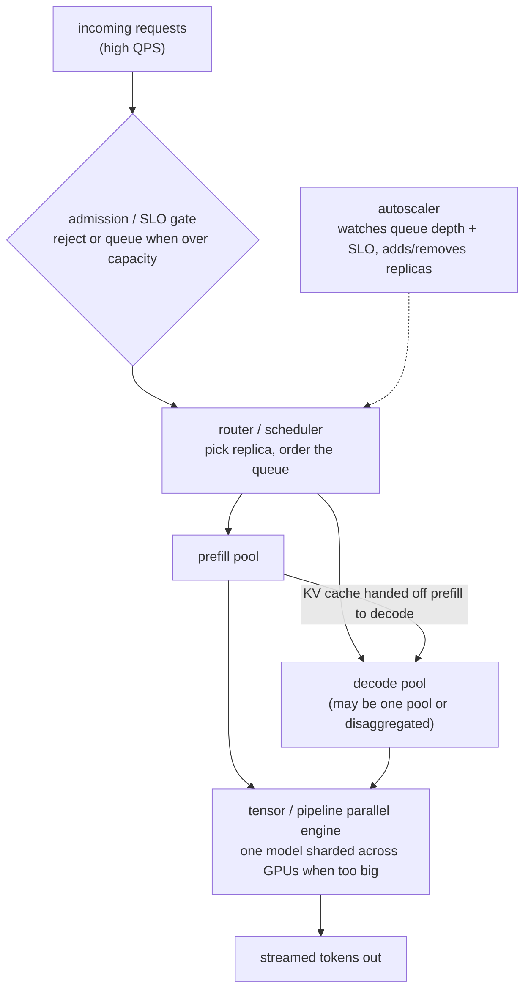

# 04 - LLM inference serving at scale

> **Interviewer:** "We are serving an LLM behind an API at high QPS. Maximize
> throughput per GPU while holding p99 latency under control. Walk me through the
> serving stack: scheduling, batching, parallelism, the lot."

This is the operations side of [topic 02](02-long-context-and-kv-cache.md). That
topic explained why decode is memory-bandwidth bound and what the KV cache costs.
This one is about turning that cost model into a serving system that keeps a fleet
of GPUs busy without blowing the tail latency. The whole game is packing as many
tokens as possible into each GPU step while still hitting your SLO, and those two
goals pull against each other.

## 1. Clarify and scope

- **What is the SLO, exactly?** Throughput per GPU and p99 latency trade off
  directly. Ask for the latency target and whether it is on first token (TTFT) or
  per output token (TPOT, the inter-token gap). They are different knobs.
- **Workload shape?** Long prompts and short answers (RAG, classification) are
  prefill-heavy. Short prompts and long answers (code, agents) are decode-heavy.
  This decides where the bottleneck is and how you split your fleet.
- **One model or many?** A single model at high QPS is a batching and scheduling
  problem. Many models or many fine-tunes adds a routing and placement problem.
- **Does the model fit on one GPU?** If yes, you replicate. If no, you need
  tensor or pipeline parallelism before you can serve at all.
- **Traffic profile?** Steady, spiky, or bursty? This decides how aggressive
  autoscaling has to be and how much cold-start pain you will eat.

## 2. Requirements

**Functional**
- Accept requests at high QPS, run prefill then decode, stream tokens back
- Serve models that may be too large for a single GPU
- Support a mix of prompt and output lengths in the same fleet

**Non-functional**
- Maximize throughput per GPU (tokens/sec/GPU is the cost metric)
- Hold p99 TTFT and p99 TPOT under the SLO, especially under load
- Degrade gracefully when overloaded rather than collapsing every request
- Scale with traffic without paying for idle GPUs or eating cold starts on spikes

## 3. The serving stack

The interesting decisions are all about which requests run together, where prefill
and decode live, and how a model bigger than one GPU is split.

## 4. Deep dives

### Continuous (in-flight) batching, the deeper version

Topic 02 introduced continuous batching as the single biggest throughput win.
Here is the mechanism in the detail an interviewer wants.

Static batching waits for a fixed batch to fill, runs them all to completion, then
starts the next batch. The problem: requests in a batch finish at different times
(one generates 10 tokens, another generates 800), so the whole batch is held
hostage by its longest member and the GPU sits half-idle as members complete.

Continuous batching schedules at the **token step**, not the request. After every
decode step the scheduler retires finished sequences and admits waiting ones into
the freed slots, so the batch composition changes every iteration. The GPU stays
saturated because a finished sequence is replaced immediately instead of stalling
the batch. This is why it is the first thing to reach for.

The subtlety is mixing prefill and decode in the same engine. A new request needs
a prefill pass (compute-heavy, processes the whole prompt) while existing requests
need decode steps (one token each). If you run a big prefill, every in-flight
decode stalls for that step, and you get a TPOT spike that shows up directly in
p99. The fix is **chunked prefill**: break a long prompt's prefill into smaller
chunks and interleave them with ongoing decode steps, so a single huge prompt
cannot freeze the decode stream. This is the lever that keeps inter-token latency
smooth under mixed load.

### Prefill vs decode, and disaggregating the two

Prefill and decode have opposite hardware appetites:

- **Prefill** is compute-bound. It is processing thousands of prompt tokens in
  parallel, so it wants raw FLOPs and it does not run very long.
- **Decode** is memory-bandwidth bound. Each step reads the whole model and the
  whole KV cache to emit one token, so it wants bandwidth and it runs for as many
  steps as there are output tokens.

When both run on the same GPU, they interfere. Prefill bursts cause TPOT spikes,
and decode keeps a sequence resident for a long time, fragmenting the schedule.

**Disaggregated serving** puts prefill and decode in separate pools, often on
separate GPUs. A request does its prefill in the prefill pool, the resulting KV
cache is transferred to a decode worker, and decode runs there. Benefits: you can
size and scale each pool independently (decode-heavy traffic gets more decode
GPUs), you can pick different parallelism for each, and prefill bursts stop
poisoning decode latency. The cost is the **KV cache transfer** between pools,
which needs fast interconnect (NVLink or a fast fabric) or it eats the win. This
is an advanced pattern; naming it and naming its cost (the cache hand-off) is the
signal. For a single small model at moderate QPS, one pool with chunked prefill is
simpler and usually enough; disaggregate when prefill and decode SLOs genuinely
conflict.

### Speculative decoding

Decode is the expensive phase and it is sequential: one token per forward pass,
each pass reading the entire model from memory. Speculative decoding breaks the
one-token-per-pass limit.

A small, cheap **draft model** generates several candidate tokens fast. The large
**target model** then verifies all of them in a single parallel forward pass
(verification is one pass over k tokens, which is cheap because the model read is
amortized across k positions). It accepts draft tokens through a verification rule
(rejection sampling) that is provably equivalent to sampling from the target model
itself, and falls back to a target-model token at the first rejection. When the
draft is usually right, you get several tokens per expensive target-model step
instead of one.

Key properties to state:

- **The output distribution is preserved.** Done correctly (rejection sampling on
  the verification), speculative decoding produces exactly what the target model
  would have. It is a latency optimization, not a quality trade.
- **The win depends on acceptance rate.** A good draft model on predictable text
  accepts a high fraction and you get a real multiple on tokens per step. A bad
  draft, or hard-to-predict output, and you waste draft compute for little gain.
- **Variants worth naming:** a separate small draft model, or self-speculation
  where the model predicts several tokens ahead from its own hidden states
  (Medusa-style heads), which avoids hosting a second model.

It helps latency most when you are decode-bound and not already memory-saturated
by huge batches. At very high batch sizes the GPU is already busy and the
verification overhead can eat the benefit, so it shines most for latency-sensitive
lower-batch serving.

### Tensor parallelism vs pipeline parallelism

When a model does not fit on one GPU (weights plus KV cache exceed memory), you
shard it. Two axes, and you should know the difference cold.

**Tensor parallelism (TP)** splits each layer's matrices across GPUs. Every GPU
holds a slice of every layer and they compute one layer cooperatively, exchanging
activations with an all-reduce at each layer boundary. Because that communication
happens on every layer for every token, TP needs very fast interconnect (NVLink
within a node) and is normally kept inside a single node. TP reduces per-GPU
memory and can cut latency for a single request, at the cost of constant
cross-GPU traffic.

**Pipeline parallelism (PP)** splits the model by layers: GPU 0 holds layers 1 to
N, GPU 1 holds N+1 to 2N, and so on. Activations pass from one stage to the next.
Communication is only at stage boundaries (much less than TP), so PP tolerates
slower links and stretches across nodes. The catch is the **pipeline bubble**:
naively, later stages sit idle waiting for earlier ones, which hurts latency for a
single request. You hide the bubble by keeping many microbatches in flight, which
is fine for throughput serving but does not help single-request latency.

Rule of thumb to say out loud: **TP within a node for latency and to make the
model fit, PP across nodes for scale when you run out of GPUs in a node, and
replicate whole copies for throughput once a single copy fits.** Real fleets
combine all three.

**Expert parallelism** is the MoE-specific axis. A mixture-of-experts model (see
the per-token cost argument in topic 02) has many feed-forward experts but routes
each token to a few. The experts are too numerous to fit per GPU, so you shard
**experts across GPUs** and route tokens to whichever GPU holds the chosen expert.
This adds an all-to-all communication step (tokens flying to their experts and
results coming back) and a load-balance problem: if routing is skewed, some
expert GPUs are hot and others idle. This is why a large MoE forces both expert
sharding and attention to load balancing, not just plain TP.

### KV-cache offload

The KV cache is usually the binding memory constraint at high concurrency (topic
02 has the size formula; do not rederive it here). When GPU memory for the cache
runs out you have three moves beyond paging and quantization:

- **Offload to CPU RAM or NVMe.** Move the KV cache of less-active or paused
  sequences off the GPU and bring it back when the sequence resumes. Trades the
  PCIe/NVMe bandwidth for GPU memory. Good for many concurrent but bursty
  sessions; risky on the hot path because the transfer adds latency.
- **Recompute instead of store.** For an evicted sequence, throw away its cache
  and re-run prefill when it resumes. Cheaper in memory, costs compute. Sometimes
  recompute is faster than fetching a huge cache back over a slow link.
- **Prefix caching across requests** (topic 02): shared system prompts and shared
  documents keep one copy of the prefix cache, which is the cleanest offload of
  all because it removes work entirely rather than relocating it.

The decision is the usual memory-versus-bandwidth-versus-compute triangle.
Profile which one you are short on.

### Request scheduling and SLO-aware admission

At high QPS you cannot run everything immediately, so the scheduler decides order
and the admission gate decides what even enters.

- **Queueing and ordering.** Short requests should not sit behind a 100k-token
  prefill. Schedulers can prioritize by predicted cost, cap the number of
  concurrent prefills, and reserve KV-cache budget so admitting a new sequence
  cannot OOM the ones already running.
- **SLO-aware admission.** When the system is saturated, admitting more work makes
  **every** request miss its SLO. It is better to shed load: reject or queue new
  requests (with a clear 429-style signal and retry hint) so the in-flight ones
  still hit their latency target. Graceful degradation beats uniform collapse.
- **Fairness and priority.** Separate queues or token budgets per tenant or
  priority class stop one heavy user from starving everyone. Tie this back to the
  plan-tier idea: a paying tier can get a reserved slice of capacity.

The headline: under overload, controlled rejection protects p99 for everyone
admitted. Trying to serve all of it is how the tail explodes.

### Autoscaling and cold starts

Throughput per GPU only matters if you are not paying for idle GPUs, so you scale
with traffic. The wrinkle that bites LLM serving is the **cold start**: spinning
up a new replica means scheduling a GPU node, pulling a multi-gigabyte model,
loading weights into VRAM, and warming the engine. That can take minutes, which is
useless for a traffic spike that arrives in seconds.

Mitigations to mention:

- **Scale on a leading signal**, not lagging CPU. Queue depth or wait time
  predicts SLO violation before latency actually breaks.
- **Keep a warm buffer.** A small number of pre-warmed idle replicas absorb spikes
  while new ones boot. You pay for a little idle capacity to protect the tail.
- **Speed the cold start.** Cache the model image on the node, stream weights
  rather than copying then loading, snapshot a warmed process. These cut the boot
  from minutes toward tens of seconds.
- **Scale to zero only for cold paths.** Fine for a rarely used model where some
  latency on the first request is acceptable, never for the hot path.

### Quantization for throughput

Covered as a memory lever in topic 02; the serving angle is throughput. Lower
precision weights mean fewer bytes read per decode step, and since decode is
bandwidth-bound, **less data moved is directly more tokens per second**. 8-bit is
a routine, low-risk win on modern kernels; 4-bit weight quantization pushes
further and is common for fitting bigger models on fewer GPUs. KV-cache
quantization additionally lets you hold more concurrent sequences, which raises
the batch size continuous batching can sustain, which raises throughput again. The
non-negotiable: every precision drop goes behind a quality eval before it ships,
never on assumption.

## 5. Bottlenecks and scaling

| Bottleneck | Cause | Fix |
|---|---|---|
| Low GPU utilization | Static batching, idle slots | Continuous (in-flight) batching |
| TPOT spikes under mixed load | Long prefill stalls in-flight decode | Chunked prefill, disaggregate prefill/decode |
| KV cache OOM at high concurrency | Many long sequences in GPU memory | Paged cache, KV quantization, offload to CPU/NVMe |
| Model does not fit on one GPU | Weights + cache exceed VRAM | Tensor parallel (in node), pipeline parallel (across nodes) |
| MoE expert imbalance | Skewed routing, hot expert GPUs | Expert parallelism + load-balancing loss / capacity factor |
| Decode latency floor | One token per sequential forward pass | Speculative decoding (draft + verify) |
| Tail latency under overload | Admitting more than capacity | SLO-aware admission, shed/queue load |
| Spike latency | Cold-start boot time on new replicas | Warm buffer, leading-signal autoscale, fast weight load |
| Memory bandwidth on decode | Full-precision weight reads per step | Weight + KV quantization |

## 6. Failure modes, safety, and eval

- **Cascading overload.** When saturated, naive systems admit everything and miss
  every SLO, then retries pile on and it spirals. The admission gate plus
  backpressure (429 with retry hint) is the circuit breaker. Bring this up
  unprompted; it is the mark of someone who has been paged.
- **KV-cache OOM mid-decode.** A new admission consumes cache the running
  sequences needed. Reserve cache budget per admitted sequence so the scheduler
  never overcommits memory.
- **Disaggregation transfer stall.** If the prefill-to-decode KV hand-off rides a
  slow link, it becomes the bottleneck it was meant to remove. Size the
  interconnect or do not disaggregate.
- **Speculative decoding silent quality drift.** Only safe if verification
  preserves the target distribution. A buggy accept rule degrades quality
  invisibly. Verify output parity, not just speed.
- **Quantization regression.** Always gate a precision change behind an eval set;
  measure, never assume.
- **Eval for serving.** Track tokens/sec/GPU (the cost number), p50/p99 TTFT and
  TPOT (the SLO numbers), goodput (requests that met SLO, not just requests
  served), and cost per million tokens. Load-test at and beyond peak QPS so you
  see the overload behavior before production does.

## 7. Likely follow-ups

- "Why does a long prefill hurt other requests' latency?" It occupies a full
  GPU step, stalling every in-flight decode; chunked prefill interleaves it.
- "TP or PP, when?" TP within a node (fast interconnect, helps single-request
  latency and fits the model); PP across nodes (less communication, scales out,
  but has a pipeline bubble); replicate whole copies for throughput once one copy
  fits.
- "When does speculative decoding stop helping?" At very large batch sizes the GPU
  is already saturated, so the verification overhead can outweigh the saved steps;
  it wins most for lower-batch latency-sensitive serving.
- "How do you hold p99 under a traffic spike?" Leading-signal autoscaling plus a
  warm replica buffer, and SLO-aware admission so the spike sheds load instead of
  breaking everyone.
- "Estimate GPUs for X QPS." Get tokens/sec/GPU from a load test, multiply out the
  expected token volume, add headroom for spikes and the warm buffer. Show you
  reason from a measured number, not a guess.

---

## Seen in production

Real systems that ship the patterns above. Each is a first-party engineering
writeup; read them for what an interview answer skips: who the system serves,
the product design, the eval bar, and the deployment shape.

- **Anyscale** [How continuous batching enables 23x throughput in LLM inference](https://www.anyscale.com/blog/continuous-batching-llm-inference): Iteration-level scheduling plus PagedAttention beat static batching up to 23x. *(deployment)*
- **Character.AI** [Optimizing AI Inference at Character.AI](https://blog.character.ai/optimizing-ai-inference-at-character-ai/): MQA, cross-layer KV sharing, and int8 quant cut serving cost 13.5x. *(deployment)*
- **LinkedIn** [Accelerating LLM inference with speculative decoding](https://www.linkedin.com/blog/engineering/ai/accelerating-llm-inference-with-speculative-decoding-lessons-from-linkedins-hiring-assistant): N-gram speculative decoding gave 4x throughput and 66% lower P90 latency. *(eval bar)*
- **Baseten** [How we built BEI: high-throughput embedding, reranker, classifier inference](https://www.baseten.co/blog/how-we-built-bei-high-throughput-embedding-inference/): Batching, backpressure, FP8, and TensorRT-LLM for 2x higher-throughput serving. *(deployment)*

- **NVIDIA** [NVIDIA Dynamo: a low-latency distributed inference framework](https://developer.nvidia.com/blog/introducing-nvidia-dynamo-a-low-latency-distributed-inference-framework-for-scaling-reasoning-ai-models/): Disaggregated serving with prefill and decode separation and routing. *(deployment)*
- **Together AI** [ATLAS: runtime-learning speculative decoding](https://www.together.ai/blog/adaptive-learning-speculator-system-atlas): Speculative decoding that adapts to live traffic for large speedups. *(product design)*
- **Fireworks AI** [FireOptimizer: customizing latency and quality](https://fireworks.ai/blog/fireoptimizer): Adaptive speculative decoding and per-workload config tuning. *(product design)*
- **Modal** [High-performance LLM inference](https://modal.com/docs/guide/high-performance-llm-inference): Engine choice, quantization, CUDA graphs, and snapshots for throughput. *(deployment)*
- **Databricks** [LLM inference performance engineering: best practices](https://www.databricks.com/blog/llm-inference-performance-engineering-best-practices): Prefill and decode, batching, hardware selection, and latency metrics. *(eval bar)*
- **Google** [Fast inference from transformers via speculative decoding](https://arxiv.org/abs/2211.17192): Draft-then-verify decoding: 2-3x speedup with identical outputs. *(product design)*
- **Baseten** [The Baseten inference stack](https://www.baseten.co/resources/guide/the-baseten-inference-stack/): Multi-cloud autoscaling, routing, custom kernels, and speculation. *(deployment)*

More production case studies: the [Evidently AI ML system design database](https://www.evidentlyai.com/ml-system-design) (800 case studies from 150+
companies) is the broadest curated index; this section pulls the ones that map
directly onto this topic.

---
## Trace the architectures

Every lever here bottoms out in the model's real shape: how many KV heads decode
has to read, how wide each layer is for tensor parallelism, how many experts there
are to shard. Those are exactly the numbers that get miscopied. Open these as
structured reference graphs and read the real dimensions off them instead of
trusting a blog's recollection.

- **GQA baseline for single-GPU serving (Llama-3 8B):**
  [open it live](https://www.neurarch.com/?import=https://raw.githubusercontent.com/neurarch-ai/awesome-llm-model-zoo/main/architectures/llama3-8b/model.json).
  Find the attention block and read the query-head to KV-head ratio: that ratio is
  how much KV cache each decode step has to move, which sets how many concurrent
  sequences one GPU can batch.

  

- **Large MoE, the case for expert parallelism (gpt-oss-120b):**
  [open it live](https://www.neurarch.com/?import=https://raw.githubusercontent.com/neurarch-ai/awesome-llm-model-zoo/main/architectures/gpt-oss-120b/model.json).
  Trace the expert routing and the layer widths: this is the concrete case for
  expert parallelism on the feed-forward experts and tensor parallelism on the
  dense matrices. (It is a sparse MoE, so its active parameters per token are a
  fraction of the 120B total, which is how it can run on a single high-memory GPU;
  the genuinely-cannot-fit case is a dense or very large model like the 671B
  DeepSeek-V3 in topic 02.)

  

A useful pre-interview exercise: open gpt-oss-120b, count the experts and the
hidden width, and work out how you would split it across, say, 8 GPUs (which axis
shards what, where the communication lands). The graphs are validated reference
graphs at real dimensions, shape-checked end to end, not screenshots. All 87 are
in the
[Model Zoo](https://github.com/neurarch-ai/awesome-llm-model-zoo)
([gallery](https://neurarch-ai.github.io/awesome-llm-model-zoo)). Built by
[Neurarch](https://www.neurarch.com).
