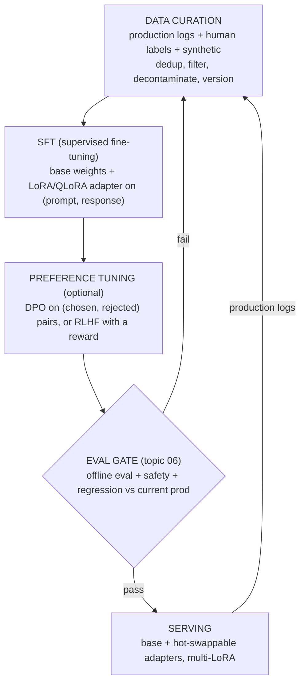

# 05 - Fine-tuning and post-training pipeline

> **Interviewer:** "Our base model is not good enough at our domain task. Design
> the pipeline to adapt it, get it into production safely, and keep it improving
> over time."

This question looks like it is about training. It is really about judgment. The
strongest answer spends its first minute arguing that you probably should not
fine-tune yet, then designs the pipeline anyway, with an eval gate that decides
whether the new model ever sees a user. Candidates who reach for a training run
on the first sentence lose the plot; the ones who treat fine-tuning as the last
lever, not the first, win it.

## 1. Clarify and scope

- **What does "not good enough" mean concretely?** Wrong facts, wrong format,
  wrong tone, or missing skills? Each points at a different fix. Facts often want
  retrieval, not training. Format and tone often want better prompts or a small
  SFT pass. A genuinely missing skill is the real fine-tuning case.
- **Do we have data, and who labels it?** Fine-tuning is a data problem wearing a
  compute costume. If there is no clean labeled set and no path to one, the
  pipeline does not start.
- **How fast does the domain change?** If the knowledge churns weekly, baking it
  into weights is a treadmill; retrieval keeps it fresh. If the behavior is
  stable, training amortizes.
- **Latency, cost, and hosting?** Self-hosted open weights make fine-tuning and
  adapter serving cheap and controllable. A closed API limits you to whatever
  tuning the vendor exposes.
- **What is the quality floor and how will we measure it?** No eval, no
  promotion. Settle this before anything trains. See
  [topic 06](../topics/06-evaluation-system.md).

## 2. Decide: prompt, retrieve, or train (in that order)

Say this part out loud, because the honest ordering is the signal:

- **Prompt engineering first.** Few-shot examples, a sharper system prompt, output
  schemas, and decomposition fix a surprising share of "the model is bad at our
  task" complaints. It is free, instant to iterate, and it is your baseline. You
  cannot tell whether fine-tuning helped if you never tuned the prompt.
- **Retrieval (RAG) next, when the gap is knowledge.** If the model lacks *facts*
  (your docs, your catalog, your tickets), put the facts in context instead of in
  the weights. RAG updates the instant a document changes, cites sources, and
  never needs a training run. See [topic 01](../topics/01-rag-serving.md) for the
  serving side. The decision rule: **RAG teaches the model what it does not know;
  fine-tuning teaches it how to behave.**
- **Fine-tuning last, when the gap is behavior or skill.** A consistent output
  format, a domain tone, a reasoning pattern, a structured-extraction skill the
  base model fumbles, or shaving the long few-shot prompt down to a short one for
  cost. Fine-tuning is also how you bake in a *style* RAG cannot inject.

The trap to name: fine-tuning to teach facts. It is expensive, it goes stale, it
hallucinates confidently between the facts you taught, and it has to be redone
when the facts move. Reach for retrieval there. The two compose well: tune for
behavior, retrieve for knowledge, on the same base.

## 3. Requirements

**Functional**
- Curate a high-quality task dataset and keep it versioned
- Supervised fine-tune a base model into a task model
- Optionally apply preference optimization to align tone and choices
- Gate every candidate behind an eval before it can be promoted
- Serve the adapted model, ideally many task variants, cheaply
- Feed production interactions back into the next dataset (the flywheel)

**Non-functional**
- Reproducibility: a model version pins its data, base, and hyperparameters
- Cost control: tune and serve without a full-fine-tune budget per task
- Safety: a promotion cannot regress quality or safety silently
- Rollback: a bad model is reverted in one step, not retrained away

## 4. The pipeline

The loop at the bottom is the part most candidates forget and the part that
actually compounds: production output becomes tomorrow's training data.

## 5. Deep dives

### Data curation is the whole game

A small, clean dataset beats a large, noisy one, and it is not close. The model
imitates exactly what you show it, including the mistakes. The work:

- **Quality over quantity.** A few thousand carefully curated examples often
  outperform tens of thousands of scraped ones for SFT. The classic open
  instruction-tuning result was that aggressive filtering down to a small,
  high-quality set was what worked; treat the exact count as illustrative and
  earn your own number on your task.
- **Deduplicate and balance.** Near-duplicates waste capacity and skew the model
  toward whatever is over-represented. Balance across the skills you care about.
- **Decontaminate.** Make sure your eval set has not leaked into training, or your
  eval numbers are fiction. This is the single most common way teams fool
  themselves.
- **Format consistency.** One prompt template, one response shape. The model
  learns the template as hard as the content.
- **Synthetic data, used carefully.** A stronger model can generate or augment
  examples, but unfiltered synthetic data drifts toward the generator's biases and
  can collapse diversity. Filter it through the same quality and dedup gates as
  human data, and keep a human-labeled core.

Version the dataset like code. A model artifact should name the exact data
snapshot it came from, or you cannot reproduce or debug it.

### Supervised fine-tuning (SFT)

SFT is plain next-token prediction on `(prompt, ideal response)` pairs: show the
model the input and the output you wish it had produced, and train it to produce
that. It is the workhorse and usually the only training step you actually need.
It teaches format, tone, and task-specific behavior directly.

Watch for **catastrophic forgetting** (over-training on a narrow set degrades
general ability), so keep learning rates modest, epochs few (often one to three),
and mix in some general data if breadth matters. This is also an argument for
parameter-efficient methods below: a small adapter perturbs the base less than a
full re-train.

### Parameter-efficient tuning: LoRA and QLoRA

Full fine-tuning updates every weight in the model, which means optimizer state
and gradients for billions of parameters, multiple copies of the model in GPU
memory, and a fresh full-size checkpoint per task. You rarely need it.

**LoRA (low-rank adaptation)** freezes the base weights and learns a small pair
of low-rank matrices that adjust each target weight matrix. The insight: the
*change* a task needs is low-rank, so you can represent it with a tiny fraction
of the parameters (often well under 1% of the model). You train and store only
the adapter. The base never moves.

**QLoRA** goes further: quantize the frozen base to 4-bit to slash its memory
footprint, then train the LoRA adapter on top in higher precision. This is what
lets people fine-tune a model in the billions of parameters on a single
commodity GPU. The base is quantized only to *hold* it cheaply; the learned
adapter carries the precision that matters.

Why this matters beyond cost: because the adapter is small and the base is
untouched, you can keep many adapters for one base model and swap them, which is
the serving win below. Full fine-tuning throws that away by producing a whole new
model per task.

When *is* full fine-tuning justified? A large dataset, a big behavior shift from
the base, or a need to change the model deeply (not just nudge it). For the
"adapt a base model to our domain task" prompt, LoRA or QLoRA is almost always
the right call, and saying so plainly is the senior answer.

### Preference optimization: DPO and RLHF

SFT teaches the model to imitate good answers. It does not teach it to *prefer*
one acceptable answer over another, or to avoid a tempting-but-wrong style.
Preference tuning does, by training on comparisons: "response A is better than
response B for this prompt."

- **RLHF (reinforcement learning from human feedback)** trains a separate reward
  model on human preference comparisons, then optimizes the policy against that
  reward (commonly with PPO) while a KL penalty keeps it from drifting too far
  from the SFT model. Powerful and general, but it is a complex, unstable,
  multi-model pipeline: you are training and serving a reward model and running RL.
- **DPO (direct preference optimization)** skips the separate reward model and the
  RL loop. It optimizes the policy directly on `(chosen, rejected)` pairs with a
  simple classification-style loss that is mathematically tied to the same
  objective. Far simpler and more stable to run, which is why it is the common
  first choice now.

When to use which: reach for preference tuning only after SFT, and only when you
have a real quality axis SFT cannot capture (helpfulness, tone, refusing the
wrong thing, picking the better of two valid answers). Start with DPO for its
simplicity. Reserve full RLHF for when you need a reusable reward signal or the
extra control justifies the operational weight. And be honest in the interview:
many domain tasks are solved by good SFT alone and never need this step. Proposing
RLHF for a format-and-tone problem is over-engineering.

### The eval gate before promotion

This is the load-bearing component, and it deserves its own topic
([topic 06](../topics/06-evaluation-system.md)). The rule: **a candidate model
does not reach users until it beats the current production model on a held-out
eval.** Minimum gates:

- **Task quality** on a labeled held-out set the model never trained on.
- **Regression check** against the current production model, not just an absolute
  bar. New does not mean better.
- **Safety and refusal** behavior, especially after preference tuning, which can
  shift what the model is willing to say.
- **No contamination**: confirm the eval set is disjoint from training data.

Automate it so every candidate runs the same gate, and store the result with the
model version. Promotion is a decision the gate makes, not a human hunch.

### The data flywheel

The pipeline is a loop, not a line. Production is your richest source of training
data, because it is real distribution, not guessed distribution:

1. Log production inputs and outputs (with consent and privacy handling).
2. Mine them for failures: thumbs-down, escalations, corrections, retries, low
   confidence, cases that hit a fallback.
3. Have humans label or fix the hard ones; those become gold SFT examples, and the
   "model output vs human correction" pairs become preference data for free.
4. Fold them into the next dataset version and retrain.
5. Gate, promote, repeat.

Each turn of this loop targets exactly where the current model is weakest, which
is why a mediocre first model plus a tight flywheel beats a great first model with
no feedback path. Mention privacy, consent, and PII scrubbing on the logging step
unprompted; it is both a legal and a trust requirement.

### Serving many adapters cheaply (multi-LoRA)

Here is where the LoRA choice pays off operationally. Because every task adapter
shares the same frozen base, you load the base into GPU memory **once** and keep
many small adapters resident alongside it. At request time you route to the right
adapter and run base-plus-adapter. This is **multi-LoRA serving** (the idea behind
serving stacks that batch requests across different adapters against one base).

The economics: instead of N full model copies for N tasks, you pay for one base
plus N tiny adapters. You can even batch requests that use *different* adapters
together against the shared base. Compare that with full fine-tuning, where each
task is a separate multi-gigabyte model that needs its own memory and its own
serving slot. For a product with many domains or many customers, multi-LoRA is the
difference between affordable and not.

Swapping adapters is also your fast rollback and your A/B mechanism: promote a new
adapter, route a slice of traffic to it, revert by pointing the route back. No
redeploy of the base.

## 6. Bottlenecks and scaling

| Bottleneck | Cause | Fix |
|---|---|---|
| Data quality | Noisy, duplicated, contaminated examples | Curate, dedup, decontaminate, version; quality over quantity |
| Training memory / cost | Full fine-tune of a large model | LoRA / QLoRA; quantize the frozen base |
| Catastrophic forgetting | Over-training on a narrow set | Fewer epochs, modest LR, mix in general data, small adapters |
| Eval is the gate but slow | Full eval per candidate | Tiered eval: fast smoke set per run, full gate before promotion (topic 06) |
| Serving many tasks | One full model per task | Multi-LoRA: shared base, hot-swappable adapters |
| Stale knowledge baked in weights | Fine-tuned facts that move | Move facts to retrieval (topic 01); tune only behavior |
| Flywheel drift | Synthetic / self-generated data loops | Keep a human-labeled core, filter synthetic through the same gates |

## 7. Failure modes, safety, and eval

- **Fine-tuning the wrong problem.** Training to fix a knowledge gap that retrieval
  should own. The most common and most expensive mistake; revisit section 2.
- **Eval set contamination.** Training data leaks into the eval, numbers look
  great, production disappoints. Decontaminate and verify disjointness every run.
- **Catastrophic forgetting.** The model gets better at the task and worse at
  everything else. The regression gate catches it; modest training avoids it.
- **Preference tuning over-steers.** DPO/RLHF can make the model sycophantic,
  evasive, or over-refusing. Always re-run safety and quality eval after this step,
  not just task accuracy.
- **Flywheel feedback loops.** Training on the model's own unfiltered output
  narrows diversity over time (model collapse risk). Keep humans in the labeling
  path and filter synthetic data hard.
- **Silent promotion regressions.** Without a gate that compares to current
  production, "newer" quietly ships "worse." Gate on relative improvement, keep
  one-step rollback.
- **Privacy in the logs.** Production logs are training gold and a liability.
  Scrub PII, honor consent, and gate retention.

## 8. Likely follow-ups

- "Should we fine-tune or just use RAG?" Behavior and skill, fine-tune; facts and
  freshness, retrieve. They compose. Lead with this; it is the whole question.
- "Why not full fine-tuning?" Cost, memory, a fresh full model per task, and you
  lose cheap multi-adapter serving. LoRA gets ~the same task quality at a fraction
  of the parameters touched.
- "DPO or RLHF?" Start with DPO (simpler, more stable, no separate reward model).
  RLHF when you need a reusable reward signal or finer control, and only after SFT.
- "How do you know the new model is better?" The eval gate: beats current
  production on a held-out, decontaminated set, plus a safety pass, before any user
  sees it (topic 06).
- "How does it keep improving?" The flywheel: mine production failures, label them,
  fold into the next dataset, gate, promote, repeat.
- "How do you serve ten domain variants affordably?" One frozen base, ten LoRA
  adapters, multi-LoRA serving, batched across adapters.

---

## Seen in production

Real systems that ship the patterns above. Each is a first-party engineering
writeup; read them for what an interview answer skips: who the system serves,
the product design, the eval bar, and the deployment shape.

- **Grammarly** [CoEdIT: state-of-the-art text editing with fewer parameters](https://www.grammarly.com/blog/engineering/coedit-text-editing/): Dense task-specific instruction tuning beats generalist LLMs at 12x to 60x fewer params. *(product design)*
- **Anyscale** [Fine-Tuning LLMs: LoRA or Full-Parameter?](https://www.anyscale.com/blog/fine-tuning-llms-lora-or-full-parameter-an-in-depth-analysis-with-llama-2): LoRA versus full fine-tune accuracy tradeoffs, broken down per task type. *(eval bar)*
- **Anyscale** [Direct Preference Optimization with Synthetic Data](https://www.anyscale.com/blog/direct-preference-optimization-with-synthetic-data): Iterative DPO: synthetic prefs, async reference model, judge-aligned eval. *(deployment)*
- **Hugging Face** [Preference Tuning LLMs with Direct Preference Optimization Methods](https://huggingface.co/blog/pref-tuning): Empirical DPO versus IPO versus KTO; the beta parameter drives outcomes. *(eval bar)*
- **Databricks** [A Practical Guide to LLM Fine Tuning](https://www.databricks.com/blog/llm-fine-tuning): End-to-end lifecycle: metrics, data quality, LoRA-first, and retrain cadence. *(deployment)*

- **Shopify** [Flow generation through natural language: an agentic modeling approach](https://shopify.engineering/fine-tuning-agent-shopify-flow): A fine-tuned Qwen3-32B agent with a weekly LLM-judge retraining flywheel. *(product design)*
- **Shopify** [Leveraging multimodal LLMs for the global catalogue](https://shopify.engineering/leveraging-multimodal-llms): Fine-tunes small VLMs for catalogue extraction at 40M inferences per day. *(deployment)*
- **Meta** [How to fine-tune: focus on effective datasets](https://ai.meta.com/blog/how-to-fine-tune-llms-peft-dataset-curation/): Data-curation rules for SFT and PEFT; quality over quantity. *(product design)*
- **GitHub** [Building a faster, smarter Copilot with a custom model](https://github.blog/ai-and-ml/github-copilot/the-road-to-better-completions-building-a-faster-smarter-github-copilot-with-a-new-custom-model/): A mid-training plus SFT (fill-in-middle) plus RL pipeline. *(deployment)*
- **Replit** [Replit Code v1.5 on Hugging Face](https://replit.com/blog/replit-code-v1_5): Trained and fine-tuned a code model on Replit user code. *(product design)*
- **Grab** [A custom vision LLM to improve document processing](https://engineering.grab.com/custom-vision-llm-at-grab): LoRA then full fine-tune of Qwen2-VL for OCR and key-info extraction. *(who it serves)*
- **Nubank** [Fine-Tuning Transaction User Models](https://building.nubank.com/fine-tuning-transaction-user-models/): SFT of transaction foundation models with joint fusion. *(product design)*

More production case studies: the [Evidently AI ML system design database](https://www.evidentlyai.com/ml-system-design) (800 case studies from 150+
companies) is the broadest curated index; this section pulls the ones that map
directly onto this topic.

---
## Trace the architectures

When you fine-tune, it helps to see what you are actually touching. LoRA adapts a
small fraction of the parameters in these stacks, and "a small fraction" is
abstract until you open the graph and find the specific weight matrices the
adapter rides on. The attention projections and the FFN matrices are where the
learned low-rank update lives; the rest of the model is frozen. Open one and read
the real dimensions to see how little of the network an adapter actually moves.

- **A common open base to fine-tune (Llama-3 8B):**
  [open it live](https://www.neurarch.com/?import=https://raw.githubusercontent.com/neurarch-ai/awesome-llm-model-zoo/main/architectures/llama3-8b/model.json).
  Find the attention query/key/value/output projections and the FFN matrices in a
  block: those are the weights a LoRA adapter targets. Everything else stays
  frozen, which is why one base can host many adapters at once.

  

- **Another standard fine-tune target (Mistral 7B):**
  [open it live](https://www.neurarch.com/?import=https://raw.githubusercontent.com/neurarch-ai/awesome-llm-model-zoo/main/architectures/mistral-7b/model.json).
  Trace the same projection-and-FFN structure here, then picture the QLoRA setup:
  this whole base held in 4-bit while a tiny higher-precision adapter learns on
  top.

  

These are validated reference graphs at real dimensions, shape-checked end to
end, not screenshots. All 87 architectures live in the
[Model Zoo](https://github.com/neurarch-ai/awesome-llm-model-zoo)
([gallery](https://neurarch-ai.github.io/awesome-llm-model-zoo)). Built by
[Neurarch](https://www.neurarch.com).
