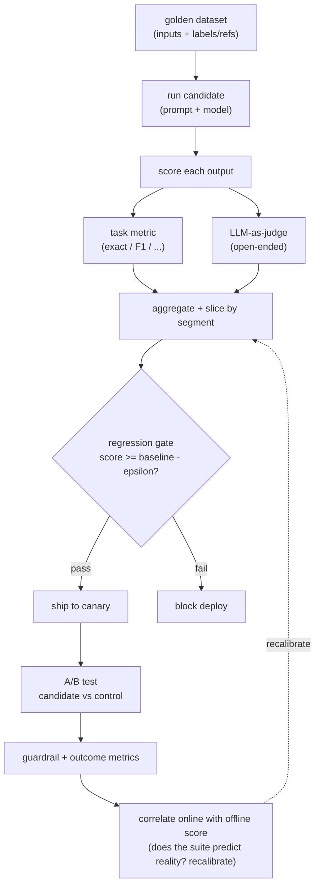

# 06 - LLM evaluation system

> **Interviewer:** "You shipped an LLM feature. A teammate wants to tweak the
> prompt and bump to a newer model next week. How do you know the feature works
> today, and how do you stop that change from silently making it worse?"

This is the question that separates people who have shipped LLM features from
people who have only demoed them. "It works, look at these examples" is not an
answer, it is a vibe. The whole topic hinges on turning a fuzzy "is the output
good" into something you can measure, repeat, and gate a deploy on.

## 1. Clarify and scope

- **What is the task?** A closed task with a checkable answer (classification,
  extraction, SQL generation) is worlds easier to evaluate than an open one
  (summaries, chat, "is this a good explanation"). Ask which you have, because it
  decides whether you can use exact metrics or need a judge.
- **Is there a ground truth?** Sometimes there is a correct label, sometimes only
  a human preference. This changes the whole eval design.
- **What does a failure cost?** A wrong extraction in a billing pipeline is
  expensive, a slightly worse tone in a chat reply is not. This sets how tight the
  gate needs to be.
- **What is the change cadence?** Prompts edited daily and models swapped monthly
  need a cheap automated gate, not a quarterly human study.
- **What is the eval budget?** Every judged example costs a model call. The eval
  itself has a bill, and at high cadence it is not small.

## 2. Requirements

**Functional**
- A repeatable offline suite that scores a candidate (prompt + model + config)
  against a fixed dataset
- A way to score open-ended outputs where no exact answer exists
- A regression gate that blocks a deploy when quality drops
- Online measurement that confirms the offline number actually predicts real
  user outcomes

**Non-functional**
- Deterministic and versioned: same candidate plus same dataset gives the same
  score, and the dataset itself is version-controlled
- Cheap and fast enough to run on every change, not once a quarter
- Trustworthy: the metric must correlate with what users actually care about, or
  it is worse than nothing because it gives false confidence

## 3. The eval flow

Two loops. An offline loop that gates the deploy, and an online loop that checks
the offline loop was telling the truth.

The two things an interviewer probes: **how you score open-ended outputs without
fooling yourself**, and **how the gate is actually wired into the deploy path** so
a regression cannot ship by accident.

## 4. Deep dives

### Offline suites and golden datasets

The foundation is a fixed set of inputs with expected outcomes, the golden
dataset, that you run every candidate against. Get this right and everything else
is easier.

- **Coverage over volume.** A few hundred well-chosen cases beat ten thousand
  random ones. You want the common paths, the known-hard cases, and one row for
  every bug you have ever fixed (a regression case so it never comes back).
- **Slice it.** A single average hides regressions. Score per segment (language,
  document length, customer tier, query type) so a change that helps the average
  while tanking one segment gets caught.
- **Version it.** The dataset lives in source control. A score is only comparable
  against another score on the exact same dataset version.
- **Keep a held-out set.** If you tune prompts against the eval set you start
  fitting to it. Keep a slice you do not look at during iteration.

### Task metrics versus LLM-as-judge

There are two ways to score an output, and you pick per task.

**Task metrics** apply when the answer is checkable: exact match, F1 on extracted
fields, pass/fail on a unit test for generated code, retrieval recall, numeric
tolerance. These are cheap, deterministic, and unfoolable. Use them wherever the
task allows. The art is reframing a task to expose a checkable metric: instead of
judging a free-text answer, ask the model for a structured field you can compare
exactly.

**LLM-as-judge** applies when quality is genuinely subjective: is this summary
faithful, is this reply helpful, is answer A better than answer B. You prompt a
capable model to score or rank outputs against a rubric. It scales where humans
cannot, but it has sharp, well-documented failure modes you must name:

- **Position bias.** Judges favor whichever answer is shown first (or sometimes
  last) in a pairwise comparison. Mitigation: run both orderings and average, or
  randomize position and track the swap rate.
- **Verbosity bias.** Judges reward longer, more confident-sounding answers even
  when they are not better. Control for length, or instruct the rubric to penalize
  padding.
- **Self-preference bias.** A judge tends to prefer outputs from its own model
  family. Mitigation: use a different model family as judge than the one you are
  evaluating where you can.
- **Calibration.** Raw judge scores on a 1 to 10 scale are not meaningful in
  absolute terms and bunch up in the middle. Pairwise comparison (A vs B) is far
  more reliable than absolute scoring, and binary pass/fail against a sharp rubric
  beats a fuzzy 1 to 10.
- **The judge must itself be validated.** This is the point most candidates miss.
  An LLM judge is a measurement instrument, and an uncalibrated instrument lies.
  Before you trust it, collect a few hundred human labels and check that the judge
  agrees with humans (report the agreement rate, for example Cohen's kappa). If
  the judge does not match humans, fix the rubric before you gate anything on it.
  A judge you have not validated against human labels is just a second opinion you
  have no reason to believe.

### Online evaluation

Offline tells you a candidate is probably better. Online tells you it actually is,
on real traffic. The two disagree more often than people expect, which is exactly
why both loops exist.

- **A/B test.** Route a slice of traffic to the candidate, the rest to the
  control, and compare. The real outcome metrics are behavioral: task completion,
  user edits to the output, thumbs up or down, follow-up "that is wrong" messages,
  escalation rate. These are what you actually care about and cannot measure
  offline.
- **Guardrail metrics.** Even if the target metric improves, watch the metrics
  that must not regress: latency, cost per request, refusal rate, error rate. A
  candidate that lifts quality but doubles latency or cost may not be a win.
- **Online to offline correlation.** The most valuable thing the online loop
  produces is a check on the offline loop. If the candidate that won offline loses
  online, your offline suite is not measuring what matters, and you fix the suite.
  Over time you want offline score to be a trustworthy predictor of online
  outcome, so most changes can ship on the cheap offline gate alone and only the
  uncertain ones need a full A/B test.

### Regression gates in the deploy path

An eval that someone runs manually when they remember is not a gate. Wire it in.

- The offline suite runs automatically on any change to a prompt, model id, or
  inference config, the same way unit tests run on a code change.
- It compares the candidate score to the current production baseline and **fails
  the build if the score drops more than a small tolerance** (the tolerance
  absorbs judge noise, set it from the judge's measured variance, not by guessing).
- Treat prompts and model ids as versioned artifacts. A model swap is a code change
  and goes through the same gate, because a "drop-in newer model" is exactly the
  kind of change that silently regresses one segment.
- Gate per slice, not just on the average, so a regression hidden inside one
  segment still blocks.
- After the gate passes, ship to a canary and let the online loop confirm before
  full rollout.

### Evaluating RAG

A RAG answer can be wrong for two completely different reasons, and you must
measure them separately or you cannot tell which half to fix (see
[topic 01](01-rag-serving.md)).

- **Retrieval quality.** Did the right documents come back? Measure recall and
  precision at k against labeled relevant documents. If recall is low, no amount
  of prompt tuning saves you, the evidence was never in the context.
- **Answer groundedness (faithfulness).** Given the retrieved context, is the
  answer actually supported by it, or did the model invent something? This is a
  judge task: check each claim in the answer against the provided context. A high
  groundedness score with low retrieval recall means the model is faithfully
  answering from the wrong documents.
- **Answer relevance.** Does the answer address the question, separate from whether
  it is grounded. Splitting these three lets you localize a failure to retrieval,
  grounding, or the generation prompt.

### Evaluating agents

Agents need end-to-end and step-level metrics both (see
[topic 03](03-agent-orchestration.md)).

- **End-to-end task success** on a labeled set of tasks is the metric that
  matters: did the ticket actually get resolved correctly. Everything else is
  diagnostic.
- **Step-level metrics** localize failures: was the right tool chosen, were the
  arguments valid, did the plan match intent. A run can succeed by luck with bad
  steps, or fail late after good steps, and step metrics tell you which.
- **Trajectory cost.** Success at ten times the steps is not success. Track steps,
  tokens, and dollars per task alongside the success rate.

### The cost of eval

Eval is not free and a senior answer says so. Every judged example is a model
call, so a thousand-row suite with a pairwise judge run in both orderings is a few
thousand judge calls per candidate, and that recurs on every prompt edit. Ways to
keep it sane: use cheap deterministic task metrics wherever the task allows and
reserve the judge for the genuinely open cases; use a smaller, cheaper, validated
judge model rather than the most expensive one; cache judge results for unchanged
output pairs; run the full suite on the gate but a small smoke subset on every
local iteration. The judge is a full model with its own latency and bill, so size
it deliberately.

## 5. Bottlenecks and scaling

| Bottleneck | Cause | Fix |
|---|---|---|
| Eval cost per change | Judge call on every row, every candidate | Task metrics where possible, cheaper judge, cache judged pairs, smoke subset for local iteration |
| Slow gate | Large suite run serially | Parallelize judge calls, run smoke subset on iteration and full suite on the gate |
| Untrustworthy score | Judge not validated against humans | Collect human labels, measure judge-human agreement, fix the rubric before gating |
| Average hides regressions | Single aggregate metric | Slice by segment, gate per slice |
| Offline disagrees with online | Suite measures the wrong thing | Use online A/B as ground truth, recalibrate the offline suite to it |
| Stale dataset | Real traffic drifts from the golden set | Periodically sample production, label, and refresh the suite |

## 6. Failure modes

- **Gaming the metric (Goodhart).** Once a metric is a target it stops being a
  good metric. Optimizing hard against an LLM judge produces outputs that the judge
  loves and users do not (often longer and more confident). Mitigation: keep the
  online behavioral metrics as the real ground truth, keep a held-out set, and
  watch for the offline-online gap widening.
- **Judge drift.** The judge is a hosted model that can change under you, or its
  prompt gets edited, and yesterday's scores stop being comparable to today's.
  Pin the judge model version, version the judge prompt, and keep a fixed
  calibration set you re-score to detect drift.
- **Contaminated test sets.** If your eval cases (or near-duplicates) leaked into a
  model's training data, the model looks great on them and fails in production.
  This is a real risk with public benchmarks, which is why a private,
  freshly-sampled golden set beats a famous public one for gating your own feature.
- **Tuning on the eval set.** Iterating prompts against the same set you score on
  fits the set, not the task. Keep a held-out slice you never look at during
  development.
- **A single number.** "Quality is 87%" with no slices, no confidence interval,
  and no dataset version is not measurement, it is a press release. Always report
  the spread and the segments.

## 7. Likely follow-ups

- "How do you evaluate something with no ground truth, like a summary?" Pairwise
  LLM-as-judge against a control, with a validated judge, position-bias control,
  and the online edit/thumbs rate as the real check.
- "Your judge says the new prompt is better but users complain. What happened?"
  Either the judge is uncalibrated (validate it against human labels) or it is
  being gamed (verbosity or self-preference), and the online behavioral metric is
  the tiebreaker.
- "How do you gate a model upgrade?" Treat the model id as a versioned artifact,
  run the full offline suite per slice, block on any segment regression beyond
  tolerance, then canary with an A/B before full rollout.
- "How much should eval cost?" Enough to run on every change cheaply. Quantify it:
  rows times judge calls per row times judge price, then drive it down with task
  metrics, caching, and a right-sized judge.
- "How do you know your eval is any good?" Online-offline correlation. The suite
  earns trust only when its verdict reliably predicts the A/B outcome.

---

## Seen in production

Real systems that ship the patterns above. Each is a first-party engineering
writeup; read them for what an interview answer skips: who the system serves,
the product design, the eval bar, and the deployment shape.

- **DoorDash** [A Simulation and Evaluation Flywheel to Develop LLM Chatbots at Scale](https://careersatdoordash.com/blog/doordash-simulation-evaluation-flywheel-to-develop-llm-chatbots-at-scale/): Simulated multi-turn conversations graded by an LLM judge calibrated to humans before release. *(eval bar)*
- **DoorDash** [How DoorDash leverages LLMs to evaluate search result pages](https://careersatdoordash.com/blog/doordash-llms-to-evaluate-search-result-pages/): AutoEval: fine-tuned LLM raters with a human in the loop for whole-page relevance. *(eval bar)*
- **Thomson Reuters** [Efficiently evaluating LLMs for legal tasks](https://legal.thomsonreuters.com/blog/evaluating-llms-legal-tasks/): Three-stage gate: public benchmarks, semi-automated task eval, then human A/B. *(eval bar)*
- **Uber** [uReview: scalable, trustworthy GenAI for code review](https://www.uber.com/us/en/blog/ureview/): An LLM grader scores generated comments; confidence thresholds gate what gets posted. *(deployment)*
- **Uber** [From Predictive to Generative: how Michelangelo accelerates Uber AI](https://www.uber.com/blog/from-predictive-to-generative-ai/): Michelangelo's eval framework compares models, prompts, and fine-tunes across iterations. *(deployment)*

- **Discord** [Developing Rapidly with Generative AI](https://discord.com/blog/developing-rapidly-with-generative-ai): A critic-LLM AI-assisted eval of prompts before A/B rollout. *(eval bar)*
- **Honeycomb** [So we shipped an AI product. Did it work?](https://www.honeycomb.io/blog/we-shipped-ai-product): Post-launch product eval via activation and adoption metrics. *(eval bar)*
- **GitHub** [How we evaluate AI models and LLMs for GitHub Copilot](https://github.blog/ai-and-ml/generative-ai/how-we-evaluate-models-for-github-copilot/): 4000+ offline tests plus manual and safety gates before deploy. *(eval bar)*
- **Spotify** [Better experiments with LLM evals: a funnel, not a fork](https://engineering.atspotify.com/2026/5/better-experiments-with-llm-evals-a-funnel-not-a-fork): Offline evals calibrated against online A/B as a funnel. *(deployment)*
- **Spotify** [Profile-aware LLM-as-a-Judge for Podcasts](https://research.atspotify.com/2025/9/profile-aware-llm-as-a-judge-for-podcasts-a-better-middle-ground-between): An LLM judge bridging offline metrics and costly A/B tests. *(eval bar)*
- **Booking.com** [LLM Evaluation: practical tips at Booking.com](https://booking.ai/llm-evaluation-practical-tips-at-booking-com-1b038a0d6662): LLM-as-judge plus golden datasets for production monitoring. *(eval bar)*

More production case studies: the [Evidently AI ML system design database](https://www.evidentlyai.com/ml-system-design) (800 case studies from 150+
companies) is the broadest curated index; this section pulls the ones that map
directly onto this topic.

---
## Trace the architectures

Eval is mostly process, not architecture, with one exception that costs real
money: the LLM-as-judge is itself a full model with its own latency and per-call
bill, and a thousand-row suite judged in both orderings on every prompt edit adds
up fast. Before you pick a judge, it helps to see exactly what you are paying for
per judgment.

- **A capable open model of the kind you would run as a judge (Qwen3-8B):**
  [open it live](https://www.neurarch.com/?import=https://raw.githubusercontent.com/neurarch-ai/awesome-llm-model-zoo/main/architectures/qwen3-8b/model.json).
  Trace its attention and FFN to see where the per-token cost of a single judgment
  goes, then multiply by your suite size and cadence to size the eval bill
  honestly. The judge is not free infrastructure, it is a model you run.

  

These are validated reference graphs at real dimensions, shape-checked end to
end, not screenshots. All 87 architectures live in the
[Model Zoo](https://github.com/neurarch-ai/awesome-llm-model-zoo)
([gallery](https://neurarch-ai.github.io/awesome-llm-model-zoo)). Built by
[Neurarch](https://www.neurarch.com).
