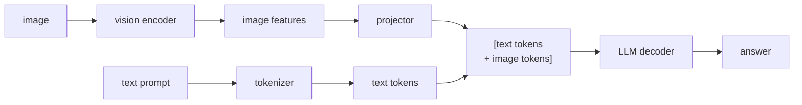
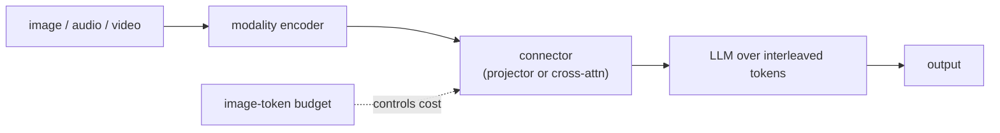

# 09 - Multimodal serving

> **Interviewer:** "Design a service that answers questions about images: the user
> uploads a photo and asks something about it, and a vision-language model
> responds. Serve it efficiently at scale."

Multimodal looks like "just add images," but the serving economics are different
in a way that catches people out: an image does not cost one token, it costs many,
and those tokens land in the most expensive part of the pipeline. The signal here
is whether you understand the vision-language architecture and can reason about
the image-token budget and the heterogeneous workload.

## 1. Clarify and scope

- **Which modalities?** Images only, or also documents, video, audio? Each adds a
  preprocessing path. Start with images.
- **Image properties?** Resolution and count per request. High-resolution and
  multi-image requests cost far more tokens, which drives the whole cost model.
- **Task?** Visual question answering, captioning, OCR-heavy document
  understanding? OCR-style tasks need high resolution, which is expensive.
- **Latency and scale?** Interactive (first token fast) vs batch enrichment.
- **Quality bar?** How much detail must the model recover from the image? This
  decides resolution and therefore cost.

## 2. Requirements

**Functional**
- Accept an image plus a text prompt, return a grounded text answer
- Preprocess and encode images
- Combine image and text in one model call
- Stream the response

**Non-functional**
- Bounded cost per request despite the image-token blowup
- p99 first-token latency target for interactive use
- Throughput that handles a mixed stream of text-only and image requests
- Graceful handling of oversized or malformed images

## 3. The architecture (say this clearly)

A vision-language model is three parts wired in sequence:

1. **Vision encoder** (a ViT-style model) turns the image into a grid of feature
   vectors.
2. **Projector / connector** maps those features into the language model's token
   embedding space, producing a block of "image tokens."
3. **LLM decoder** consumes the image tokens and the text tokens together as one
   sequence and generates the answer.

The key realization: from the decoder's point of view, an image becomes a chunk of
tokens spliced into the sequence at the image's placeholder position (alongside the
text tokens, not necessarily at the front). That is why image cost is token cost.

## 4. Deep dives

### The image-token budget is the whole cost story

A single image expands into many tokens (often hundreds, sometimes over a
thousand for high resolution). Those tokens go into **prefill** and into the
**KV cache** ([topic 02](02-long-context-and-kv-cache.md)), which means:

- First-token latency rises because prefill is larger.
- Memory pressure rises because the KV cache now holds the image tokens too.
- Multi-image requests multiply this.

So the central serving lever in multimodal is **controlling the image-token
count**, not anything exotic. Everything below is a way to do that.

### Resolution vs token count

More resolution means more image tokens means more cost. The standard approach for
high-resolution input is **tiling**: split the image into patches, encode each,
and concatenate. It recovers fine detail (good for OCR and dense scenes) but
multiplies the token count. So expose resolution as a quality-cost knob:

- Low resolution / single view for "what is in this picture."
- Tiled high resolution only when the task needs fine detail (reading text,
  inspecting small regions).

Picking resolution per task, instead of always maxing it, is the senior move.

### Heterogeneous serving

The pipeline has two very different workloads, and stapling them into one server
wastes hardware:

- **Image preprocessing and the vision encoder:** a bounded, parallel,
  compute-heavy pass over the image. Batches well, runs once per image.
- **LLM decode:** the autoregressive, memory-bandwidth-bound generation loop
  ([topic 02](02-long-context-and-kv-cache.md)).

Run them as **separate, independently scaled stages**. The vision encoder can
batch images on its own tier while the decoder pool does continuous batching for
generation. A purely text request skips the vision tier entirely, so do not make
every request pay for image infrastructure.

### Caching image embeddings

The same image often appears across requests (a product photo, a re-asked
question about one upload). Cache the **vision encoder output** keyed by an image
hash so a repeated image skips encoding entirely. This is a clean win for
catalogs and multi-turn conversations about one image.

### Other modalities

Audio fits the same shape: an audio encoder turns sound into features that feed
the decoder. The pattern (modality encoder, projector, shared decoder) generalizes,
and the serving lesson is the same: the encoder is a separate batched workload, and
the encoded tokens land in the decoder's prefill and KV cache.

## 5. Bottlenecks and scaling

| Bottleneck | Cause | Fix | Tradeoff |
|---|---|---|---|
| First-token latency | Large prefill from image tokens | Lower resolution; fewer tiles | Less image detail |
| KV-cache memory | Image tokens inflate the cache | Cap resolution; quantize KV cache | Quality / detail |
| Vision encoder throughput | Encoding every image inline | Separate batched encoder tier; cache by image hash | More infra |
| Mixed traffic | Text requests stuck behind image work | Route text-only past the vision tier | Routing complexity |
| Multi-image blowup | Token count multiplies | Limit images per request; downscale | Capability limit |

## 6. Failure modes, safety, eval

- **Oversized / malformed images:** validate, downscale, and cap dimensions
  before encoding so one huge upload cannot blow the token budget or OOM the
  encoder.
- **Image-borne prompt injection:** text rendered inside an image (a sign saying
  "ignore your instructions") can act as an injection vector. Treat image-derived
  content as untrusted, same as retrieved text ([topic 07](07-safety-and-guardrails.md)).
- **Hallucinated detail:** the model describes things not in the image,
  especially at low resolution. Evaluate grounding, and raise resolution for
  detail-sensitive tasks.
- **Eval:** task-specific (VQA accuracy, captioning quality, OCR exactness) plus
  latency and cost per request. Track cost, because the image-token budget makes
  it easy to ship something correct but unaffordable.

## 7. Likely follow-ups

- "Why is an image so expensive?" It becomes hundreds of tokens that hit prefill
  and the KV cache, the priciest part of serving.
- "Cut the cost in half." Lower resolution / fewer tiles, cache vision encoder
  output, route text-only requests away from the vision tier.
- "Support high-resolution document OCR." Tiling for detail, accept the higher
  token count, consider a model trained for dense text.
- "How do you scale the vision encoder and the decoder independently?" Separate
  tiers, each batched for its own workload.

---

## Seen in production

Real systems that ship the patterns above. Each is a first-party engineering
writeup; read them for what an interview answer skips: who the system serves,
the product design, the eval bar, and the deployment shape.

### The shared pipeline

Almost every system below is the same skeleton: a raw modality (image, audio, or
video) runs through a dedicated encoder, a connector reshapes those features into
the language model's embedding space, and the decoder generates over one
interleaved sequence of text and modality tokens. The one number that governs
cost is the image-token budget, because those tokens land in prefill and the KV
cache. The systems differ mostly in the connector and in how many tokens an image
is allowed to become.

### How they differ

| System | Connector | Resolution / image-token budget | Modality | Focus | When it wins | When it breaks / watch out |
|---|---|---|---|---|---|---|
| LLaVA | MLP projector | Fixed (CLIP ViT-L/14 336px) | Vision | Training | Simplest strong baseline; frozen CLIP plus a tiny projector is cheap to train and serve | Fixed low resolution loses fine detail; token count cannot adapt to the task |
| Qwen2-VL | MLP projector | Dynamic native resolution, variable tokens | Vision, video | Training | Inputs vary widely in size and aspect ratio, or include video | Variable token count makes per-request cost and latency hard to bound; big images blow the budget |
| Pixtral 12B | MLP projector (custom ViT) | Native resolution, flexible token budget | Vision | Training | Native-resolution input without fixed preprocessing, on a ViT tuned for it | Custom encoder trained from scratch, no frozen-CLIP shortcut; tokens still grow with resolution |
| Flamingo | Cross-attention (Perceiver + gated) | Fixed, resampled to few tokens | Vision, video | Training | Keeps the decoder token budget tiny and constant; interleaved few-shot over frozen backbones | Resampling to few tokens caps recoverable detail; gated cross-attention adds decoder complexity |
| BLIP-2 | Cross-attention (Q-Former) | Fixed, 32 query tokens | Vision | Training | Cheapest bridge between two frozen models at a fixed, tiny token cost | 32 tokens is a hard detail ceiling; dense or OCR-heavy content is lost |
| Idefics2 | Cross-attention (perceiver resampler) | Fixed, resampled tokens | Vision | Training | Bounded token count with a fully open recipe and data | Resampling caps detail the same way Flamingo does |
| NVLM | Both (MLP vs cross-attn compared) | Tiled with tile-tagging for OCR | Vision | Training + serving | OCR and dense documents that need high resolution; also when weighing connector choices | Tiling multiplies the token count; tile-tagging adds preprocessing complexity |
| Chameleon | Early-fusion (tokenized) | Discrete image tokens in one stream | Vision | Training | One unified transformer over mixed modalities; can generate images as well as read them | Discrete tokenization loses continuous detail; early-fusion training is hard to keep stable |
| Qwen2-Audio | Audio encoder + projector | Audio frames to tokens | Audio | Training | Audio and voice tasks that reuse the same encoder, projector, decoder shape | Long audio inflates the frame-token count the way high resolution inflates image tokens |
| Red Hat (vLLM) | n/a (runtime) | Encoder + prefix caching cut recompute | Vision | Serving | Repeated images and prefixes across requests (catalogs, multi-turn about one upload) | Caching only pays off on repeats; cold, unique images see no gain |
| AMD (ROCm) | n/a (runtime) | Batch-level data parallelism for vision encoders | Vision | Serving | High image volume where the vision encoder tier is the throughput bottleneck | Speeds only the encoder tier; long generations stay decode-bound |

The core dividing line is how the connector treats the image-token budget: projectors pass a variable, resolution-scaled block of tokens so detail scales with cost, resamplers and cross-attention compress to a fixed few so cost is bounded but detail is capped, and early-fusion plus runtime caching are orthogonal takes on that same budget.

### The systems

- **Red Hat (vLLM)** [vLLM V1: accelerating multimodal inference](https://developers.redhat.com/articles/2025/02/27/vllm-v1-accelerating-multimodal-inference-large-language-models): Encoder caching, per-image prefix caching, and async CPU/GPU for faster multimodal serving. *(deployment)*
- **AMD (ROCm)** [Accelerating Multimodal Inference in vLLM](https://rocm.blogs.amd.com/software-tools-optimization/vllm-dp-vision/README.html): Batch-level data parallelism for vision encoders cuts sync overhead. *(deployment)*
- **Alibaba (Qwen)** [Qwen2-VL: enhancing vision-language perception at any resolution](https://arxiv.org/abs/2409.12191): Dynamic resolution turns any image into variable visual tokens, with an MLP projector and M-RoPE. *(product design)*
- **Mistral AI** [Pixtral 12B](https://arxiv.org/abs/2410.07073): A custom ViT trained from scratch ingests native resolution with a flexible image token budget. *(product design)*
- **Microsoft (LLaVA)** [Visual Instruction Tuning](https://arxiv.org/abs/2304.08485): The MLP projector connecting a frozen CLIP vision encoder to the LLM embedding space. *(product design)*

- **Dropbox** [Creating a modern OCR pipeline using CV and deep learning](https://dropbox.tech/machine-learning/creating-a-modern-ocr-pipeline-using-computer-vision-and-deep-learning): Productionizing a deep-learning OCR and document-scan pipeline. *(deployment)*
- **Hugging Face** [Introducing Idefics2: a powerful 8B vision-language model](https://huggingface.co/blog/idefics2): Vision encoder plus projector plus perceiver resampler design choices. *(product design)*
- **NVIDIA** [NVLM: open frontier-class multimodal LLMs](https://research.nvidia.com/labs/adlr/NVLM-1/): Decoder-only vs cross-attention connector tradeoffs, plus tile-tagging for OCR. *(deployment)*
- **DeepMind** [Flamingo: a visual language model for few-shot learning](https://arxiv.org/abs/2204.14198): Bridging frozen vision and language models with interleaved input. *(product design)*
- **Ai2** [Molmo and PixMo: open weights and open data for VLMs](https://arxiv.org/abs/2409.17146): An open VLM family with curated data rivaling proprietary models. *(eval bar)*
- **OpenGVLab** [InternVL 2.5: model, data, and test-time scaling](https://arxiv.org/abs/2412.05271): Scaling an open multimodal model across model, data, and inference-time. *(eval bar)*
- **Alibaba Qwen** [Qwen2-Audio Technical Report](https://arxiv.org/abs/2407.10759): An audio-language model with voice-chat and audio-analysis modes. *(who it serves)*
- **NVIDIA** [Accelerating VLM inference with TensorRT Edge-LLM](https://developer.nvidia.com/blog/accelerating-llm-and-vlm-inference-for-automotive-and-robotics-with-nvidia-tensorrt-edge-llm/): A C++ runtime for low-latency on-device VLM inference on embedded. *(deployment)*
- **Apple** [MM1: methods, analysis, and insights from multimodal LLM pre-training](https://arxiv.org/abs/2403.09611): Ablations on image-token count, connector design, and data mix for building VLMs. *(product design)*
- **Meta** [Chameleon: mixed-modal early-fusion foundation models](https://arxiv.org/abs/2405.09818): A single transformer over interleaved image/text tokens; a stable early-fusion recipe. *(product design)*
- **Roblox** [Running AI Inference at Scale in the Hybrid Cloud](https://about.roblox.com/newsroom/2024/09/running-ai-inference-at-scale-in-the-hybrid-cloud): vLLM, Ray, and a custom feature store serving 250 ML pipelines across hybrid cloud. *(deployment)*
- **Google** [PaLI-X: on scaling up a multilingual vision-language model](https://arxiv.org/abs/2305.18565): Scaling VLM components and task mix advances 25+ vision-language benchmarks. *(eval bar)*
- **Microsoft** [Florence-2: a unified representation for vision tasks](https://arxiv.org/abs/2311.06242): A prompt-based seq2seq VLM unifying caption, detection, grounding, and segmentation. *(product design)*
- **Salesforce** [BLIP-2: bootstrapping with frozen image encoders and LLMs](https://arxiv.org/abs/2301.12597): A lightweight Q-Former projector bridges a frozen vision encoder to a frozen LLM. *(product design)*

More production case studies: the [Evidently AI ML system design database](https://www.evidentlyai.com/ml-system-design) (800 case studies from 150+
companies) is the broadest curated index; this section pulls the ones that map
directly onto this topic.

---
## Trace the architectures

Multimodal is the clearest case for reading a real graph instead of a box diagram:
the projector that bridges the vision encoder and the language model is exactly the
piece casual diagrams hand-wave, and it is where the design lives. Open these and
trace the wiring.

- **A full vision-language model (LLaVA-1.5 7B):**
  [open it live](https://www.neurarch.com/?import=https://raw.githubusercontent.com/neurarch-ai/awesome-llm-model-zoo/main/architectures/llava-1.5-7b/model.json)
  to trace the vision encoder, the projector that maps image features into the
  token space, and the point where image tokens join the text tokens in the
  decoder.

  

- **The vision encoder family (CLIP ViT-B/32):**
  [open it live](https://www.neurarch.com/?import=https://raw.githubusercontent.com/neurarch-ai/awesome-llm-model-zoo/main/architectures/clip-vit-b32/model.json)
  to see how an image becomes a grid of feature vectors. This B/32 graph is
  illustrative of the CLIP-ViT family; LLaVA-1.5 itself uses a larger, higher-
  resolution variant (ViT-L/14 at 336px), which is exactly why its image-token
  count is high. Audio follows the same encoder-then-decoder pattern (see
  whisper-small in the zoo).

  

These are validated reference graphs at real dimensions, shape-checked end to end,
not screenshots. All 92 architectures live in the
[Model Zoo](https://github.com/neurarch-ai/awesome-llm-model-zoo)
([gallery](https://neurarch-ai.github.io/awesome-llm-model-zoo)). Built by
[Neurarch](https://www.neurarch.com).

## Related deep-dive drills

Rapid-fire questions that probe the modeling and systems underneath this topic, from [deep-dives.md](../deep-dives.md):

- [Attention variants and positional encoding](../deep-dives.md#attention-variants-and-positional-encoding)
- [Generative model families](../deep-dives.md#generative-model-families)
- [Inference, quantization, and serving math](../deep-dives.md#inference-quantization-and-serving-math)
- [Commonly asked, commonly missed](../deep-dives.md#commonly-asked-commonly-missed)
