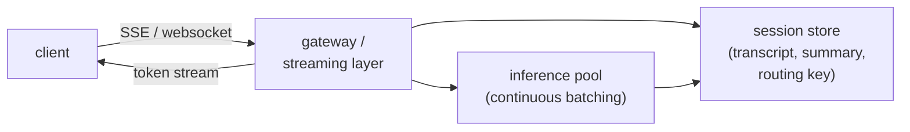

# 10 - Realtime streaming chat

> **Interviewer:** "Design the serving and application layer for a multi-turn
> streaming chat product. I am interested in the transport and state around the
> model: how tokens reach the user, how conversation state is managed, and how the
> system holds up under load and disconnects."

This question is about everything wrapping the model, not the model internals. It
is where backend engineering meets LLM serving: streaming transport, session
state, sticky routing, backpressure, and graceful degradation. The cost model
from [topic 02](02-long-context-and-kv-cache.md) shows up here as a product
problem, because the transcript grows every turn and someone has to pay for it.

## 1. Clarify and scope

- **Conversation length?** A few turns or long sessions? This decides how hard the
  growing-context problem bites.
- **Latency target?** Time-to-first-token is the number users feel in chat. State
  a target (for example under 1 second p95 to first token).
- **Scale and concurrency?** Peak concurrent streams, not just QPS. A streaming
  connection holds a slot for the whole generation, which changes capacity math.
- **Statefulness?** Does the server hold conversation state, or does the client
  send the full transcript each turn? Both are valid; they trade differently.
- **Multi-device / resumable?** Does a session need to survive a reconnect or move
  between devices?

## 2. Requirements

**Functional**
- Stream tokens to the client as they are generated
- Maintain multi-turn conversation context
- Let the user cancel a generation mid-stream
- Handle disconnects and (optionally) resume

**Non-functional**
- Low time-to-first-token at p95
- High concurrent-stream capacity per GPU
- Bounded cost per conversation as it grows
- Graceful degradation under overload rather than hard failures

## 3. High-level data flow

## 4. Deep dives

### Why stream, and how

You stream because **perceived latency** is dominated by time-to-first-token. A
model that takes several seconds to finish feels fast if the first words appear in
well under a second. Two transports:

- **Server-sent events (SSE):** one-way server-to-client, runs over plain HTTP,
  simple, and a natural fit because token output is one-directional. The common
  default.
- **WebSockets:** full duplex. Worth it when you need rich client-to-server
  signaling mid-stream (live interrupts, audio, collaborative state). More
  overhead to operate.

Default to SSE unless you genuinely need duplex.

### Conversation state and the growing-context cost

Every turn, the model must see the conversation so far, and that transcript grows.
Two consequences:

- **Cost grows per turn.** Each turn re-processes the history in prefill, so a long
  chat gets more expensive with every message. This is the cost model of
  [topic 02](02-long-context-and-kv-cache.md) showing up as a product bill.
- **You eventually hit the context limit.**

Mitigations:

- **Prefix caching.** The system prompt and the stable head of the conversation
  repeat every turn, so cache their KV state and reuse it instead of recomputing
  prefill ([topic 02](02-long-context-and-kv-cache.md)). This is the single
  biggest win for multi-turn cost and latency.
- **Summarization / truncation.** Once the history is long, summarize older turns
  or drop the least relevant ones to bound growth. State the tradeoff: you lose
  some fidelity to save cost and stay under the limit.

Where state lives is a design choice: a stateless server (the client sends the
full transcript each turn) is simple and horizontally trivial but moves cost and
trust to the client; a stateful server (a session store holds the transcript)
enables server-side summarization and smaller payloads but needs the routing
below.

### Sticky routing for cache reuse

Prefix caching only helps if the follow-up turn lands on the **same replica** that
holds the cached KV state. So route a session consistently to its replica (a
sticky routing key). Without stickiness, every turn is a cache miss and you pay
full prefill each time. Balance this against load: a hot session must still be
movable, so treat the cache as an optimization, not a hard pin.

### Backpressure and cancellation

A streaming generation holds an inference slot for its entire duration, so freeing
slots promptly is a capacity issue, not just hygiene:

- **Cancellation.** When the user clicks stop, propagate the cancel to the
  inference engine and free the slot immediately. Do not keep generating tokens
  nobody will read.
- **Disconnect detection.** If the client drops mid-stream, detect the closed
  connection and abort generation. Orphaned streams silently eat capacity.
- **Backpressure.** If the client cannot consume tokens as fast as they are
  produced, you need bounded buffering and a policy for a slow consumer.

### Graceful degradation under overload

Concurrent streams are the binding constraint because each holds a slot. When the
inference pool saturates:

- **Queue** with an honest wait, surfaced to the user, rather than hanging.
- **Shed load** with a clear retry signal instead of timing out silently.
- **Fall back** to a smaller, cheaper model to keep the product responsive under
  spikes, accepting a quality dip.

Continuous batching ([topic 02](02-long-context-and-kv-cache.md), topic 04) on the
inference pool is what lets many streams share GPUs in the first place.

## 5. Bottlenecks and scaling

| Bottleneck | Cause | Fix | Tradeoff |
|---|---|---|---|
| Time-to-first-token | Large prefill (long history) | Prefix caching; summarize history | Some fidelity loss |
| Cost per long chat | History reprocessed each turn | Prefix caching; truncate / summarize | Fidelity vs cost |
| Concurrent-stream capacity | Each stream holds a slot | Continuous batching; cancel on disconnect | Infra complexity |
| Cache misses across turns | Non-sticky routing | Session-sticky routing key | Load-balancing flexibility |
| Overload | More streams than slots | Queue, shed, or fall back to a smaller model | Latency or quality dip |

## 6. Failure modes

- **Orphaned generations.** Client disconnects but the server keeps generating,
  burning slots. Detect and abort.
- **Cache stampede on a hot session.** Many turns pinned to one replica overload
  it. Allow migration; treat the cache as best-effort.
- **Unbounded history.** No summarization, so cost and latency climb until the
  context limit errors out mid-conversation. Bound it proactively.
- **Silent overload.** Hanging instead of a clear queue or retry. Degrade
  visibly.

## 7. Likely follow-ups

- "Why does turn five cost more than turn one?" The whole transcript is
  reprocessed in prefill each turn; history grows, so prefill grows.
- "How do you cut multi-turn latency and cost?" Prefix caching plus sticky
  routing so the cache actually hits, plus summarization to bound growth.
- "A user closes the tab mid-generation. What happens?" Detect the dropped
  connection, abort generation, free the slot.
- "Traffic spikes 5x. How does the product stay up?" Continuous batching for
  throughput, queue with honest waits, shed or fall back to a smaller model.

---

## Seen in production

Real systems that ship the patterns above. Each is a first-party engineering
writeup; read them for what an interview answer skips: who the system serves,
the product design, the eval bar, and the deployment shape.

- **LinkedIn** [Musings on building a Generative AI product](https://www.linkedin.com/blog/engineering/generative-ai/musings-on-building-a-generative-ai-product): End-to-end token streaming and progressive parsing to cut perceived latency. *(deployment)*
- **Cloudflare** [Durable Objects for WebSockets and auth in AI Gateway](https://blog.cloudflare.com/do-it-again/): Scaling persistent WebSocket connections for concurrent AI inference streams. *(deployment)*
- **Vercel** [Chat SDK brings agents to your users](https://vercel.com/blog/chat-sdk-brings-agents-to-your-users): Streaming responses cross-platform via native streaming versus a throttled fallback. *(product design)*

- **OpenAI** [Updates for developers building with voice](https://developers.openai.com/blog/updates-audio-models): New audio model snapshots for STT, TTS, and realtime speech-to-speech. *(product design)*
- **LiveKit** [Why WebRTC beats WebSockets for realtime voice AI](https://livekit.com/blog/why-webrtc-beats-websockets-for-voice-ai-agents): WebRTC handles packet loss, jitter, and congestion better than TCP. *(deployment)*
- **LiveKit** [Why you shouldn't build voice agents directly on model APIs](https://livekit.com/blog/real-time-voice-agents-vs-model-apis): Model APIs lack transport, echo cancellation, and turn detection. *(deployment)*
- **Deepgram** [Optimize voice agent latency with eager end of turn](https://developers.deepgram.com/docs/flux/voice-agent-eager-eot): Start the LLM on medium-confidence transcripts to overlap with speech. *(deployment)*
- **AssemblyAI** [Universal-Streaming: ultra-fast speech-to-text for voice agents](https://www.assemblyai.com/blog/introducing-universal-streaming): Immutable streaming transcripts in about 300ms with intelligent endpointing. *(eval bar)*
- **ElevenLabs** [Enhancing conversational AI latency with efficient TTS](https://elevenlabs.io/blog/enhancing-conversational-ai-latency-with-efficient-tts-pipelines): Reducing streaming TTS time-to-first-byte for responsive conversation. *(deployment)*
- **Daily** [Benchmarking LLMs for voice agent use cases](https://www.daily.co/blog/benchmarking-llms-for-voice-agent-use-cases/): An open benchmark for latency, tool calling, and instruction adherence in voice. *(eval bar)*

More production case studies: the [Evidently AI ML system design database](https://www.evidentlyai.com/ml-system-design) (800 case studies from 150+
companies) is the broadest curated index; this section pulls the ones that map
directly onto this topic.

---
## Trace the architectures

The transport and state layer is wrapped around one expensive thing: the decoder
generating tokens. The per-turn cost you are managing comes straight from its
attention block building the KV cache, so it helps to see the actual model the
stream is carrying.

- **The decoder behind the stream (Llama-3 8B):**
  [open it live](https://www.neurarch.com/?import=https://raw.githubusercontent.com/neurarch-ai/awesome-llm-model-zoo/main/architectures/llama3-8b/model.json).
  Find the attention block: that is what builds the KV cache whose reuse (prefix
  caching) and growth (summarization) this whole topic is about. Its grouped-query
  attention keeps the KV cache *memory* small as context grows; the per-turn
  prefill cost (re-reading the transcript each turn) is bounded by prefix caching
  and summarization, not by GQA. Keep the two distinct.

  

This is a validated reference graph at real dimensions, shape-checked end to end,
not a screenshot. All 87 architectures live in the
[Model Zoo](https://github.com/neurarch-ai/awesome-llm-model-zoo)
([gallery](https://neurarch-ai.github.io/awesome-llm-model-zoo)). Built by
[Neurarch](https://www.neurarch.com).
