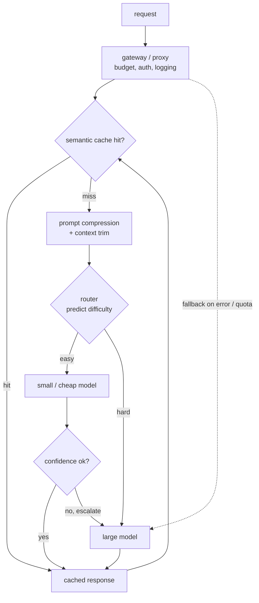

# 11 - Cost optimization and model routing

> **Interviewer:** "Our LLM feature shipped and users love it, but the monthly
> provider bill is now the single biggest line item in the infra budget and finance
> is asking hard questions. The obvious move, downgrade everyone to a cheaper model,
> tanks quality on the hard queries. Walk me through how you would cut the bill
> without users noticing the quality drop."

The core tension is that traffic is not uniform. Most queries are easy (a greeting,
a reformat, a lookup RAG already answered) and do not need your biggest model, while
a small tail is genuinely hard and does, so paying for the frontier model on every
request charges the easy majority the same unit cost as the hard minority. The win
is not one clever trick, it is matching the model and the technique to each query's
difficulty along a quality-cost frontier: cheap paths for easy work, expensive paths
only where they earn their keep. Every deep dive below is one more way to move a
query left on that frontier without dropping below the quality bar.

## 1. Clarify and scope

- **What is the quality bar, and how is it measured?** You cannot trade cost for
  quality without a number for quality. If quality is unmeasured (only vibes, no
  eval set or judge), the first deliverable is measuring it, not routing.
- **Where does the money actually go?** Long-context RAG is input-heavy, agent loops
  and long generations are output-heavy, high-QPS classification is request-heavy.
  The dominant term decides the lever: compression for input, right-sizing for
  output, caching for repeats.
- **Online or batch?** Interactive chat has a latency SLO that caps how much you can
  defer or cascade; a nightly bulk job has no user waiting, so you can batch
  aggressively and take the cheapest path.
- **One task or many?** A single well-defined task (classify sentiment) right-sizes
  to one small model; a surface with mixed intents needs routing across a fleet.
- **How much regression is acceptable, and where?** A 1% drop on easy queries to
  halve cost is usually yes; the same drop on a safety- or revenue-critical path is
  usually no. Get the tolerance per surface.

## 2. Requirements

**Functional**
- Serve each request through the cheapest path that still meets the quality bar
- Route across a fleet of models of different sizes and prices
- Reuse prior work (cache) when a request near-duplicates a past one
- Fall back gracefully when a provider or model is down or over quota

**Non-functional**
- Cut cost per successful request without quality regression where it matters
- Hold the latency SLO: cost tricks that add a round trip must still fit the budget
- Keep routing and caching decisions observable so a silent quality drop is caught
- Make budgets and spend enforceable, per team and per tenant

## 3. High-level data flow

The interesting decisions are all upstream of the model call: cache, prompt length,
and which model the request even reaches.

## 4. Deep dives

### Model routing: send each query to the cheapest model that will answer it well

A router is a small, fast decision made **before** the expensive call: it predicts
how hard the query is and dispatches to the cheapest model likely to answer it well.
**Classifier routers** train a small model (or a regex/heuristic layer) to predict
difficulty or category, then map the class to a model: cheap and easy to reason
about, but they need labeled data for what "hard" means. **Preference routers** learn
from preference data (which model humans preferred on which queries) and route to
the weak model unless the query looks like one the strong model would win, the
RouteLLM framing: predict the cheap model's win probability, pay for the expensive
one only when it is low. The router must be cheap or it eats its own savings (never
another frontier call), and it is itself a model, so it drifts: a router tuned on old
traffic mis-routes when traffic shifts, so monitor post-routing quality per bucket,
not just cost. Its honest limitation is that it decides **once, blind**, before
seeing any answer, so it cannot know it was wrong. That is what cascades fix.

### Cascades and deferral: answer cheap, escalate only when unsure

A cascade runs the cheap model first, **scores its own confidence**, and escalates
to a pricier model only when that confidence is low (the FrugalGPT pattern). Unlike
a router, it looks at an actual answer before deciding to spend more, so it catches
its own mistakes. It lives or dies on the confidence signal, roughly in order of
trustworthiness: a trained **scorer** that predicts whether the cheap answer is
reliable (FrugalGPT trains exactly this); model-reported signals (log-probabilities,
self-consistency, a cheap self-critique); or a **verifier** against ground truth you
happen to have (does the SQL run, does the code compile, does the citation exist).
Verifiable tasks (code, SQL, math, extraction) are the sweet spot: the check is a
real test, so escalation is precise; on open-ended generation the signal is softer
and you accept more escalations. The failure mode is a miscalibrated cutoff: too
eager to accept and quality quietly drops, too eager to escalate and you pay for both
models on everything. Calibrate on held-out data and re-check as traffic shifts.

### Semantic caching: serve near-duplicate requests without a model call

The cheapest LLM call is the one you never make. An **exact cache** keys on the
normalized prompt (plus model and params): zero risk of a wrong answer, but it only
fires on identical inputs, which is rare in free text. A **semantic cache** embeds
the request and serves a stored response when a past request is within a similarity
threshold in embedding space, catching paraphrases ("what's your return policy" vs
"how do I return something") where the real hit rate lives. The mechanics: a small
embedding model, a vector index of past queries, a similarity threshold. That
threshold is the whole game. Too loose and you serve the answer to a *different*
question ("capital of France" returning the cached answer for "capital of Germany");
too tight and the hit rate collapses to exact-match. Tune against labeled should-hit
/ should-not pairs and monitor served-cache-hit quality. Staleness is the other
hazard: cache stable content (definitions, policies), TTL things that move, and never
cache personalized or scoped answers into a shared cache (a data leak, not a cost
win). Prefix caching at the serving layer (shared prompts and documents) is a
related but distinct win owned by [topic 02](02-long-context-and-kv-cache.md); this
is whole-response caching.

### Prompt compression and shorter context

You pay per token, so tokens you did not need to send are money burned. Two moves.
**Context trimming** is the blunt, safe one: send fewer retrieved chunks, drop stale
conversation turns, cut boilerplate. Most RAG prompts over-retrieve, and sending the
top 3 chunks instead of the top 20 is often free quality-wise and directly cheaper;
a good reranker (topic 08) lets you send fewer, better chunks.

**Prompt compression** is the sharper tool: drop low-information tokens while
preserving meaning, the LLMLingua idea. A small model scores tokens by contribution
(often via perplexity under a small LM) and removes the low-value ones, yielding a
shorter prompt the big model still understands, which compresses heavily on verbose,
redundant context. Two cautions: the compression pass costs a cheap small-model
call, so it pays off only when input tokens dominate and context is long and
redundant; and it is lossy, so aggressive compression can drop the one detail the
answer hinged on. Gate the ratio behind the same quality eval as any other lever,
and back off where every token matters (exact extraction, legal, code).

### Right-sizing models per task

The largest cost mistake in most systems is using one frontier model for everything
because it was easiest to wire up, when most of the pipeline does not need it. Match
model size to task: **routing, classification, intent, extraction** go to small
models (a fine-tuned small model often beats a giant general one on a narrow task at
a fraction of the cost); **embeddings** to a small dedicated embedding model, not a
generative call; **reranking** to a small cross-encoder; and only **hard, open-ended
generation and reasoning** goes to the big model, which now sees only the queries
that survived every cheaper stage. The tradeoff is operational: more models to host,
evaluate, and keep from drifting, each one able to silently regress.

### Quantization, FP8, and batching as cost levers

These are throughput-per-GPU levers that matter enormously for cost, but their
mechanics are owned by other topics: quantization and FP8 (fewer bytes per token, so
more tokens per second on bandwidth-bound decode) and continuous batching (packing
requests into each GPU step) live in [topic 04](04-inference-serving-at-scale.md),
the KV-cache math in [topic 02](02-long-context-and-kv-cache.md). What matters
**here** is that they apply to models **you host**, not to per-token API pricing you
cannot change. On an API your levers are routing, caching, compression, and
right-sizing; self-hosting additionally buys quantization and batching, and the real
question is whether the fixed GPU cost beats per-token API cost at your volume: below
some QPS the API wins (no idle GPUs to pay for), above it self-hosting wins.

### Batch vs online for bulk jobs

Not every LLM call has a user waiting. Backfills, nightly summarization,
classification over a warehouse table, offline eval generation, these bulk jobs have
no latency SLO, and that freedom is a cost lever. Provider **batch APIs** trade
latency (results within hours) for a large discount, close to free money if the job
can wait. Self-hosted bulk inference runs at maximum batch size with no tail-latency
constraint on cheap spot capacity, saturating the GPU in a way online serving never
can. The design signal is recognizing which traffic is actually offline: a lot of
"LLM bill" is bulk work accidentally on the interactive endpoint.

### The gateway pattern: one proxy for budgets, fallbacks, and logging

Every request should pass through a single gateway (an LLM proxy) rather than each
service calling providers directly. The gateway is where cost control becomes
enforceable and observable: **budgets and rate limits** per team/tenant/key so one
runaway loop cannot torch the budget and finance can see spend by owner;
**fallbacks** across providers when the primary is down, over quota, or timing out,
so the feature degrades instead of dying; **caching and routing** applied uniformly
instead of per service; and **logging** of every call's tokens, cost, latency, and
model in one place, without which you cannot even find where the money goes. This is
the Uber GenAI Gateway / Cloudflare AI Gateway shape: cost optimization without a
central chokepoint is guesswork.

### Measuring the frontier and setting the threshold

Every lever above has a knob (route threshold, cascade cutoff, cache similarity,
compression ratio) and every knob trades cost against quality, so you set them by
measuring the curve, not guessing. The method: take a representative eval set with a
quality metric, sweep the knob, and at each setting plot quality against cost. That
curve is the quality-cost frontier; pick the point that meets your bar at the lowest
cost, or the knee where more cost stops buying quality. Then hold it under monitoring,
because traffic drift moves the curve: re-sweep periodically and alert on per-bucket
quality, not just aggregate cost. A cost drop with no quality tracking is a silent
quality cut waiting to be discovered.

## 5. Bottlenecks and scaling

| Bottleneck | Cause | Fix |
|---|---|---|
| Frontier model on every request | One big model wired in for simplicity | Router + right-sizing; big model only on the hard tail |
| Router pays for itself and no more | Router as expensive as the models | Sub-ms classifier or tiny model, never a frontier call |
| Low cache hit rate | Exact-match only, free text rarely repeats | Semantic (embedding) cache with tuned threshold |
| Input-token bill dominates | Over-retrieval, verbose context | Rerank + trim, then prompt compression |
| Bulk work at online prices | Offline jobs on the sync endpoint | Route to batch API / saturated self-host |
| Spend invisible until the invoice | Direct provider calls, no chokepoint | Route everything through the gateway |
| Threshold optimal once, wrong later | Traffic drift moves the frontier | Periodic re-sweep + per-bucket quality alerts |

## 6. Failure modes, safety, and eval

- **The router silently degrades quality.** A router tuned on old traffic sends
  newly-hard queries to the small model, quality drops on exactly the queries that
  matter, and cost looks great. This is the signature failure: the dashboard is
  green because it only shows cost. Guard it with per-bucket quality monitoring and
  shadow-evaluating a sample against the big model.
- **The cache serves the wrong answer.** A loose semantic-cache threshold returns a
  near-neighbor's response to a different question, worse than a wrong model call
  because it is confidently, cheaply wrong. Tune on labeled pairs and log cache-served
  responses for audit. Related: caching a moved fact serves stale answers and caching
  scoped answers into a shared cache leaks data; TTL volatile content, never
  share-cache scoped content.
- **Over-compression drops the load-bearing token**, and **cascade miscalibration**
  escalates everything so you pay for two models on every request. Gate compression
  ratio behind eval; monitor escalation rate as a first-class metric.
- **Fallback masks a real outage.** Silent fallback keeps the feature up but hides
  that your primary is failing and can route to a model with different quality/safety
  behavior. Alert on fallback rate.
- **Eval for cost systems.** Track cost per *successful* request (cheap-but-wrong is
  not success), quality per routing bucket, cache hit rate and cache-hit quality,
  escalation rate, and the frontier over time. Load the eval with the hard tail so a
  router that dumps hard queries on the small model shows up as a quality regression,
  not a cost win.

## 7. Likely follow-ups

- "Router or cascade, when?" Router when you must decide before spending (latency
  too tight for a two-model path) and have signal on difficulty; cascade when you
  can afford a cheap call first and the task has a trustworthy confidence or
  verification signal. They compose: route first, cascade within a bucket.
- "The bill dropped 40%, did quality hold?" Unanswerable without per-bucket quality
  tracking. A cost drop with no quality number is a silent regression, not a win.
  Show the frontier, not just the cost line.
- "Where would you start on a system you have never seen?" Put a gateway in front so
  spend is observable, find where the money goes (input vs output vs count), then
  apply the cheapest-to-ship lever for that term: caching for repeats, right-sizing
  for output, trimming/compression for input.
- "Estimate the savings from a router." The fraction of traffic the small model
  handles at bar, times the price gap between small and large, minus the router's
  own cost. Reason from a measured handle-rate, not a hopeful one.

---

## Trace the architectures

Every lever here bottoms out in real model dimensions: how big the "big" model is,
how small the cheap path can be, how wide an embedding you cache on. Those numbers
are what get miscopied. Open these as structured reference graphs and read the real
shapes off them instead of trusting a blog's recollection.

- **The capable generalist you route hard queries to (Llama-3 8B):**
  [open it live](https://www.neurarch.com/?import=https://raw.githubusercontent.com/neurarch-ai/awesome-llm-model-zoo/main/architectures/llama3-8b/model.json).
  The "expensive path" in a router, the escalation target in a cascade: trace the
  layer count and hidden width to feel why you only want it on the hard tail.

  

- **A tiny cheap model for easy paths or the router itself (GPT-2 small):**
  [open it live](https://www.neurarch.com/?import=https://raw.githubusercontent.com/neurarch-ai/awesome-llm-model-zoo/main/architectures/gpt2-small/model.json).
  Compare its width and depth against Llama-3 8B: that gap is the price gap a router
  monetizes, and this size does classification, routing, or first-stage cascade work.

  

- **A sparse MoE block, more capacity per active FLOP (Mixtral block):**
  [open it live](https://www.neurarch.com/?import=https://raw.githubusercontent.com/neurarch-ai/awesome-llm-model-zoo/main/architectures/mixtral-block/model.json).
  Trace the expert routing: only a couple of experts fire per token, so you get
  large-model capacity at a fraction of the active compute, a structural cost lever
  baked into the architecture rather than bolted on at serving time.

  

- **A small embedding model for semantic caching and routing (all-MiniLM-L6):**
  [open it live](https://www.neurarch.com/?import=https://raw.githubusercontent.com/neurarch-ai/awesome-llm-model-zoo/main/architectures/all-minilm-l6/model.json).
  The workhorse behind a semantic cache and an embedding-based router: trace its
  output dimension, the width of every vector in your cache index.

  

These are validated reference graphs at real dimensions, shape-checked end to end,
not screenshots. Browse all in the [Model Zoo](https://github.com/neurarch-ai/awesome-llm-model-zoo)
or the [gallery](https://neurarch-ai.github.io/awesome-llm-model-zoo). Built by
[Neurarch](https://www.neurarch.com).

---

## Seen in production

Real systems that ship the patterns above. Each is a first-party engineering writeup; read them for what an interview answer skips: who the system serves, the product design, the eval bar, and the deployment shape.

### How they differ

The levers below all move a query left on the quality-cost frontier, but they do it at different points in the request and carry different failure modes:

| Approach | How it saves | When it wins | When it breaks / watch out | Quality risk |
|---|---|---|---|---|
| Model routing | Predicts difficulty before the call and dispatches to the cheapest model likely to answer well | Latency too tight for a two-model path, and you have a real difficulty signal | Decides once, blind, before seeing any answer; a router tuned on old traffic drifts as traffic shifts | Newly-hard queries silently routed to the small model, cost looks great while quality drops |
| Cascades / deferral | Runs the cheap model first, scores its own confidence, escalates to a pricier model only when unsure | You can afford a cheap first call and the task has a trustworthy confidence or verification signal (code, SQL, math, extraction) | Miscalibrated cutoff: too eager to escalate and you pay for both models on everything | Too eager to accept and quality quietly drops on the answers kept from the cheap model |
| Semantic caching | Serves a near-duplicate request from a stored response, no model call at all | Repeated or paraphrased queries over stable content (definitions, policies) | Loose threshold serves a different question's answer; stale facts; scoped answers leaked into a shared cache | Confidently, cheaply wrong when a near-neighbor's response is returned for a different question |
| Prompt compression | Drops low-information tokens (LLMLingua) so fewer input tokens are billed | Input tokens dominate and context is long, verbose, and redundant | Costs a cheap small-model pass, so it only pays when input is heavy; the compression is lossy | Aggressive compression drops the one load-bearing token the answer hinged on |
| Right-sizing per task | Matches model size to task, small models for routing, classification, extraction, embeddings, reranking | Narrow, well-defined subtasks where a fine-tuned small model beats a giant general one | More models to host, evaluate, and keep from drifting | Each small model can silently regress on its slice |
| Quantization / FP8 + batching | More tokens per GPU-second (fewer bytes per token) and packing requests into each GPU step | Self-hosted models above some QPS where fixed GPU cost beats per-token API price | Applies only to models you host, not to API per-token pricing; below that QPS the API wins | Low, and the mechanics are owned by topics 02 and 04 |

The core dividing line: routing and cascades pick a cheaper model (before versus after seeing an answer), while caching, compression, and right-sizing make the call itself cheaper instead.

- **Stanford** [FrugalGPT: Using LLMs While Reducing Cost and Improving Performance](https://arxiv.org/abs/2305.05176): An LLM cascade defers to pricier models only when the cheap response scores unreliable. *(eval bar)*
- **LMSYS** [RouteLLM: an open framework for cost-effective LLM routing](https://www.lmsys.org/blog/2024-07-01-routellm/): A preference-data router splits queries between strong and weak models, about 85% cost cut. *(product design)*
- **Anyscale** [Building an LLM Router for High-Quality and Cost-Effective Responses](https://www.anyscale.com/blog/building-an-llm-router-for-high-quality-and-cost-effective-responses): A fine-tuned classifier routes by query complexity between closed and open models. *(eval bar)*
- **IBM Research** [LLM routing for quality, low-cost responses](https://research.ibm.com/blog/LLM-routers): A real-time router sends each query to the best-value model, cutting cost up to 85%. *(product design)*
- **Microsoft Research** [LLMLingua: prompt compression for LLM efficiency](https://www.microsoft.com/en-us/research/blog/llmlingua-innovating-llm-efficiency-with-prompt-compression/): Removes unimportant tokens for up to 20x prompt compression with little loss. *(product design)*
- **Databricks** [Simple, Fast, Scalable Batch LLM Inference](https://www.databricks.com/blog/introducing-simple-fast-and-scalable-batch-llm-inference-mosaic-ai-model-serving): Governed batch inference over large datasets for cost-efficient bulk processing. *(deployment)*
- **Baseten** [33% faster LLM inference with FP8 quantization](https://www.baseten.co/blog/33-faster-llm-inference-with-fp8-quantization/): FP8 quantization gives a 33% throughput gain and 24% lower cost per token. *(deployment)*
- **Cloudflare** [Caching in AI Gateway](https://developers.cloudflare.com/ai-gateway/features/caching/): The gateway serves identical requests from cache, cutting billable provider calls and latency. *(deployment)*
- **Uber** [Uber's GenAI Gateway](https://www.uber.com/blog/genai-gateway/): A unified multi-vendor gateway with usage and budget management across teams, plus fallbacks. *(deployment)*

More production case studies: the [Evidently AI ML system design database](https://www.evidentlyai.com/ml-system-design) (800 case studies from 150+ companies) is the broadest curated index; this section pulls the ones that map onto this topic.

## Related deep-dive drills

Rapid-fire questions that probe the modeling and systems underneath this topic, from [deep-dives.md](../deep-dives.md):

- [Inference, quantization, and serving math](../deep-dives.md#inference-quantization-and-serving-math)
- [Decoding and sampling](../deep-dives.md#decoding-and-sampling)
- [Commonly asked, commonly missed](../deep-dives.md#commonly-asked-commonly-missed)
