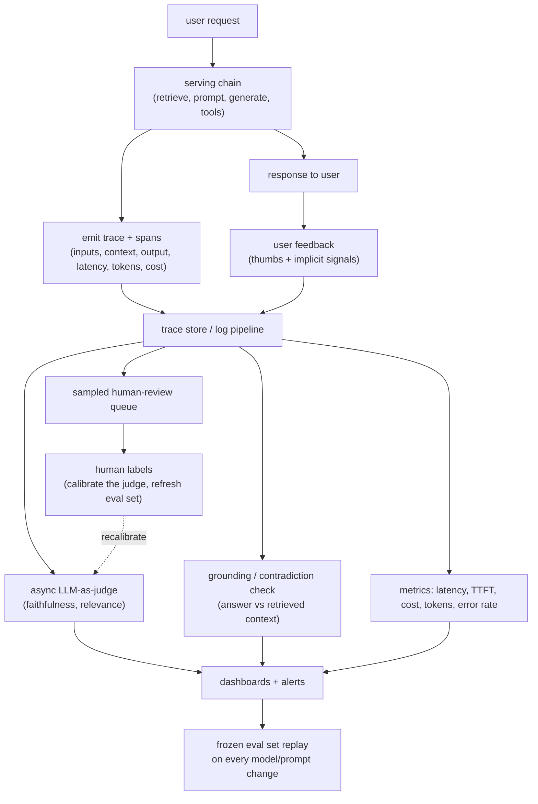

# 12 - Production monitoring and observability

> **Interviewer:** "Your LLM app is live and taking real traffic. There are no
> labels on production requests, nobody grades the answers, and next week someone
> swaps the model and edits the prompt. How do you know it is still working today,
> and how do you catch a hallucination spike or a quality regression after that
> change, before your users catch it for you?"

The trap is that the offline muscle everyone trains, "run the suite, read the
score", does not exist online. Production has no ground truth, so you cannot
compute accuracy the way you did pre-ship. What you can do is instrument every
call into structured traces, proxy quality with cheap automatic checks (an
LLM-as-judge for faithfulness, a grounding check against retrieved context), and
sample real traffic into a human-review queue. The senior framing: evaluation
does not stop at the deploy gate, online it becomes a continuous, sampled,
proxy-driven activity rather than a one-time pass or fail.

## 1. Clarify and scope

- **What kind of app is it?** RAG, an agent with tools, or a single-shot
  completion each log different things and fail differently. RAG lets you check
  grounding against context; an agent needs step-level traces; a classifier can be
  spot-audited cheaply.
- **What is the cost of a bad answer?** A wrong medical or billing answer is a page
  at 3am; a bland chat reply is a weekly dashboard. This sets how much you sample,
  how fast you alert, and whether you block. Ask too whether delayed ground truth
  arrives later (suggestion accepted, ticket reopened, code compiled), free labeled
  data even though it lags.
- **Change cadence and budget?** Prompts edited daily and models swapped monthly
  need automatic regression catching, not a human remembering to look. And judging
  every request with an LLM doubles the bill, so you will sample: clarify how much
  you can spend observing versus serving.

## 2. Requirements

**Functional**
- Capture a full trace per request: the chain, every tool call, inputs, outputs,
  retrieved context, latency, tokens, cost.
- Produce an online quality signal without labels: automatic proxy scores plus a
  sampled human-review queue.
- Detect hallucinations by checking answers against the context they should be
  grounded in; collect explicit and implicit user feedback onto the trace.
- Detect regressions and drift after a model or prompt change automatically, and
  alert on guardrail and safety events in production, not just at ingress.

**Non-functional**
- Low overhead: instrumentation adds no meaningful serving latency; heavy scoring
  runs async off the hot path, sampled on a well-chosen slice, not exhaustive.
- Trustworthy proxies: any automatic score is calibrated against human labels or
  it is a number that lies with confidence.
- Fast to alert: a hallucination spike surfaces in minutes to hours.

## 3. High-level data flow

Serving emits a trace synchronously and cheaply. Everything expensive, the judge,
the grounding check, the safety re-scan, the human sampling, runs asynchronously
off a stream of those traces so it never slows a user's request.

Two things an interviewer listens for: the expensive checks are **asynchronous
and sampled** so they do not tax serving, and human labels loop back to
**calibrate the proxy** rather than being a dead-end audit.

## 4. Deep dives

### What to log: traces, spans, and the full chain

A metric tells you something is wrong; a trace tells you where. Log at the grain
of a distributed trace, one per request, a span per step.

- **Span the whole chain.** For RAG: query rewrite, the retrieval call (with the
  documents and scores), the assembled prompt, the generation, post-processing. For
  an agent: one span per tool call with arguments, result, and error state. The
  retrieved context is the single most valuable field, because without it you
  cannot later ask "was the answer grounded".
- **Capture inputs and outputs verbatim** at each hop, plus per-span latency, token
  counts (prompt and completion split), model id, prompt version, and dollar cost.
  Cost and tokens are span attributes, not a separate system.
- **Stitch on a trace id** so one request fanned across retrieval, reranking, tool
  calls, and generation reconstructs into a single readable timeline. Use
  OpenTelemetry-style spans with GenAI semantic conventions so this flows into the
  stack you already run. Verbatim prompts carry user secrets, so set retention,
  redaction, and access up front.

### Pre-ship eval versus live monitoring

Same discipline at two points in time. Pre-ship eval
([topic 06](06-evaluation-system.md)) runs a **frozen labeled set** through a
candidate and gates the deploy: it has ground truth and answers "is this change
safe to ship". Live monitoring runs on **real, unlabeled traffic** and answers "is
the shipped system still healthy right now". Pre-ship is a gate you pass once;
monitoring is a signal you watch continuously. They connect both ways: bad-looking
production traces get labeled back into the frozen set (so tomorrow's gate catches
today's surprise), and the judge rubric you validated offline is the one you reuse
online.

### Online quality without ground truth

With no labels, you estimate quality from proxies, in increasing cost.

- **LLM-as-judge on sampled traffic.** Run a judge over a sample of traces, scoring
  faithfulness (is the answer supported by the retrieved context), answer relevance
  (does it address the question), and any task rubric. This is the workhorse online
  signal, but it carries every offline bias (position, verbosity, self-preference)
  and is an unvalidated instrument until you prove otherwise.
- **Calibrate the judge against humans.** Before trusting or alerting on a score,
  collect a few hundred human labels on real samples and measure agreement (an
  agreement rate or Cohen's kappa). If the judge disagrees with humans, fix the
  rubric before you page anyone. An unchecked judge is a confident guess.
- **Human-review sampling.** Humans are the ground truth you cannot afford on every
  request, so you sample into a review queue (see section 5). Those labels measure
  real quality on that slice and are the calibration set that keeps the judge
  honest: the judge scales but drifts, humans are truth but do not scale.

### Hallucination detection in production

The most actionable online check, and what this question is really about, is
grounding: does the answer follow from the context actually retrieved.

- **Check against the retrieved context, not the world.** You logged the retrieved
  documents, so you can ask per claim: supported by, contradicted by, or absent
  from the context. An answer asserting facts not in its context is ungrounded even
  if true, because the system had no basis for it.
- **Groundedness and contradiction scoring.** Decompose the answer into atomic
  claims and score each for entailment against the context (an NLI model or cheap
  LLM judge; a low-cost first pass is claim-to-passage similarity, with
  contradiction flagged separately from absence). Trend a per-response groundedness
  score and alert on the delta, not single events.
- **Only when the answer should be grounded.** For RAG and tool-augmented answers
  "supported by context" is the right bar; open creative generation has no context
  to check, so you fall back to the judge and user feedback. Say which regime.

### User-feedback loops

Users are a free, high-volume, but biased signal; name the bias rather than trust
the thumbs.

- **Explicit feedback** (thumbs, rating, "report") is cheap but sparse and skewed:
  a tiny self-selected fraction clicks it, biased to the very angry and very
  pleased. Treat it as directional, not a percentage, and never read no-thumbs as
  satisfied.
- **Implicit signals** are noisier but far denser and more honest: did the user
  accept, copy, edit heavily, immediately rephrase (a retry, usually a failure),
  abandon, or escalate. A high edit or retry rate is a quality alarm with no thumbs
  at all. Attach every signal to the trace, and feed downvoted and heavily-edited
  responses into the review queue and the frozen eval set as the highest-yield
  cases.

### Regression, canary, shadow, and drift after a change

A model swap or prompt edit is exactly when quality silently moves, and the point
of monitoring is to catch it without a human remembering to look.

- **Replay a frozen eval set continuously**, on a schedule and on every model or
  prompt change, so a regression shows against a fixed baseline before it reaches
  most users. This is the bridge from topic 06: the deploy gate now runs forever.
- **Canary.** Route a small slice of live traffic to the candidate and compare its
  proxy scores, feedback, latency, and cost against the control. A regression that
  hides from the offline set still surfaces at 5 percent.
- **Shadow.** Run the candidate on the same requests without showing users its
  output, and diff the two: zero user risk at the cost of double inference, but it
  measures output divergence not user reaction, so pair it with a canary.
- **Drift, two kinds.** Input drift is traffic changing under you (new topics,
  languages, longer documents); track input embeddings against a reference window.
  Output drift is quality decaying with stable inputs (rising ungrounded rate,
  falling judge scores, more retries). Input drift predicts trouble, output drift
  confirms it.

### Guardrails, safety, cost, and latency dashboards

- **Safety monitoring is continuous, not just at ingress.** The guardrails
  ([topic 07](07-safety-and-guardrails.md)) fire on the serving path; log every
  decision as a span attribute and trend the firing rates. A jump in jailbreak
  hits, PII-leak blocks, or refusal rate is an attack, a regression, or an
  over-eager filter degrading good traffic. Sample allowed traffic into a safety
  re-scan too, since the dangerous case is the harmful output no guardrail caught.
- **Cost, latency, tokens, and TTFT are first-class dashboards.** From span
  attributes, build per-model and per-route views of latency percentiles
  (p50/p95/p99, not the mean, which hides the tail), time-to-first-token (what
  users feel in a streaming UI), tokens per request, cost per request and per user,
  and error and timeout rates. These catch the regression quality metrics miss: a
  "drop-in better model" that doubles TTFT or triples cost is a regression even if
  answers improve slightly.

## 5. Bottlenecks and scaling

| Bottleneck | Cause | Fix |
|---|---|---|
| Instrumentation slows serving | Heavy scoring on the request path | Emit trace cheaply and synchronously; run judge, grounding, safety re-scan async off the stream |
| Judging cost | LLM judge on every request doubles the bill | Sample; smaller validated judge; reserve full judging for flagged or low-feedback traces |
| Log volume and cost | Verbatim inputs/outputs on every span at scale | Sample retention, tier storage, redact and truncate, full fidelity only on flagged traces |
| Human review does not scale | Auditing everything is impossible | Stratified, uncertainty-based sampling into the queue, not uniform random |
| Proxy disagrees with reality | Uncalibrated judge | Label a human sample continuously, recalibrate, pin judge and prompt versions; alert on rates and deltas, not single events |

## 6. Failure modes, safety, eval

- **Trusting an uncalibrated judge.** It becomes the metric everyone watches,
  unchecked against a human, so it can be systematically wrong (rewarding verbose,
  confident, ungrounded answers) and you never know. Keep a rolling human sample
  and report judge-human agreement.
- **Sampling that misses the tail.** Uniform random sampling spends the human
  budget on common easy cases and rarely sees the rare failure, so you conclude
  quality is great while a bad slice burns. Stratify and oversample the suspicious.
  And do not read thumbs as an accuracy rate: cross-check the self-selected sliver
  against implicit behavior and the judge before believing a trend.
- **Silent guardrail degradation.** A filter that starts blocking good traffic
  (rising refusal rate) is a regression quality metrics miss, because blocked
  answers never get scored. Monitor refusal and block rates, not just harmful
  output. The observability store is also your largest pool of unredacted user
  data, so redact and gate access or it is the incident.
- **The offline-online gap.** The frozen eval set says healthy while production
  feedback says otherwise, because it went stale. Refresh it from flagged traces.

## 7. Likely follow-ups

- "You have no labels in production. How do you measure quality?" Traces plus a
  sampled LLM-as-judge for faithfulness and relevance, a grounding check against
  retrieved context, and a stratified human sample that both measures truth and
  calibrates the judge.
- "How do you catch a hallucination spike specifically?" Score groundedness per
  response against the logged context, trend the ungrounded rate, and alert on the
  delta after any retrieval or model change, not on single events.
- "The team swaps the model next week. How do you not regress?" Continuous frozen
  eval replay against a fixed baseline, then canary on a traffic slice comparing
  proxy scores, feedback, latency, and cost, with shadow diffing for zero-risk
  output comparison.
- "You cannot judge every request. What do you sample?" Stratify and oversample the
  risky (low or negative feedback, high edit/retry, low judge or retrieval score,
  guardrail near-misses, new input clusters) plus a uniform baseline.

## Trace the architectures

Monitoring is an infrastructure discipline, not a model-architecture one, so there
are few distinct graphs here. The ones that matter are the model you are
monitoring and the small models that power the checks watching it. Tracing them
makes the cost of "observe the system" concrete, because every judge call and
grounding check is itself a model with a bill.

- **The served generation model whose outputs you monitor (Llama-3-8B):**
  [open it live](https://www.neurarch.com/?import=https://raw.githubusercontent.com/neurarch-ai/awesome-llm-model-zoo/main/architectures/llama3-8b/model.json).
  The system under observation. Trace its attention and FFN stack to see where the
  per-token latency and cost you log come from; the TTFT and tokens-per-request on
  your dashboards are properties of this graph.

  

- **A small embedding model for grounding, similarity, and drift checks
  (all-MiniLM-L6):**
  [open it live](https://www.neurarch.com/?import=https://raw.githubusercontent.com/neurarch-ai/awesome-llm-model-zoo/main/architectures/all-minilm-l6/model.json).
  The cheap workhorse behind the checks: similarity between an answer claim and its
  retrieved passage for a first-pass grounding score, and embedding distance for
  input-distribution drift. Trace it to see why it is cheap enough to run on far
  more traffic than the generation model.

  

- **A lightweight classifier for a trained faithfulness or safety detector
  (BERT-base):**
  [open it live](https://www.neurarch.com/?import=https://raw.githubusercontent.com/neurarch-ai/awesome-llm-model-zoo/main/architectures/bert-base/model.json).
  When an LLM judge is too slow or costly on every sampled trace, a small
  fine-tuned encoder classifies contradiction, groundedness, or a safety category
  at a fraction of the cost. Trace its encoder-plus-head shape to see the detector
  you train once and run online at scale.

  

These are validated reference graphs at real dimensions, shape-checked end to end,
not screenshots. Browse all in the
[Model Zoo](https://github.com/neurarch-ai/awesome-llm-model-zoo) or the
[gallery](https://neurarch-ai.github.io/awesome-llm-model-zoo). Built by
[Neurarch](https://www.neurarch.com).

## Seen in production

Real systems that ship the patterns above. Each is a first-party engineering
writeup; read them for what an interview answer skips: who the system serves, the
product design, the eval bar, and the deployment shape.

- **Datadog** [Detect hallucinations in your RAG LLM applications](https://www.datadoghq.com/blog/llm-observability-hallucination-detection/): Flags ungrounded or contradictory outputs against retrieved context in production RAG apps. *(product design)*
- **Datadog** [Detecting hallucinations with LLM-as-a-judge](https://www.datadoghq.com/blog/ai/llm-hallucination-detection/): How they built and benchmarked an LLM-as-judge faithfulness detector. *(eval bar)*
- **Honeycomb** [Improving LLMs in Production With Observability](https://www.honeycomb.io/blog/improving-llms-production-observability): Spans capture input, output, errors, latency, tokens, and user feedback for their Query Assistant. *(deployment)*
- **Uber** [Genie: Uber's Gen AI On-Call Copilot](https://www.uber.com/us/en/blog/genie-ubers-gen-ai-on-call-copilot/): A production copilot streaming user-feedback ratings, hallucination and relevancy evals to dashboards. *(product design)*
- **Grafana Labs** [Monitor LLMs in production with Grafana Cloud, OpenLIT, and OpenTelemetry](https://grafana.com/blog/ai-observability-llms-in-production/): Dashboards for token usage, per-call cost, latency percentiles, and time-to-first-token. *(deployment)*
- **LangChain** [The agent improvement loop starts with a trace](https://www.langchain.com/blog/traces-start-agent-improvement-loop): Collecting and enriching production traces of agent tool calls to find failures and prevent regressions. *(deployment)*
- **Twilio Segment** [Instrumenting User Insights for your AI Copilot](https://www.twilio.com/en-us/blog/insights/ai/instrumenting-user-insights-for-your-ai-copilot/): Instruments prompts, responses, and engagement signals into product analytics for a live copilot. *(product design)*

More production case studies: the [Evidently AI ML system design database](https://www.evidentlyai.com/ml-system-design) (800 case studies from 150+ companies) is the broadest curated index; this section pulls the ones that map onto this topic.
