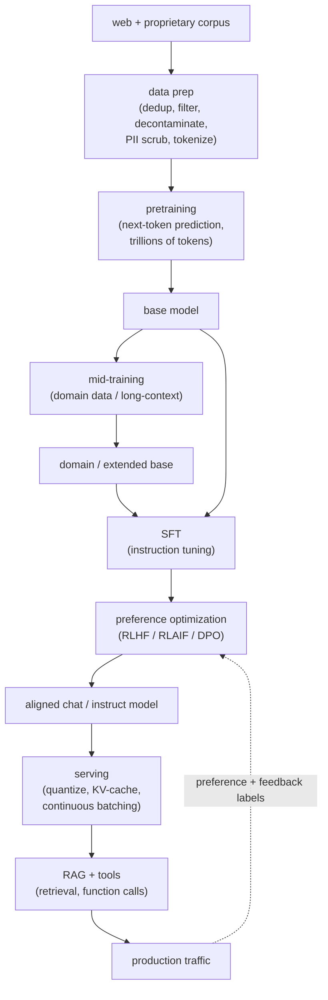
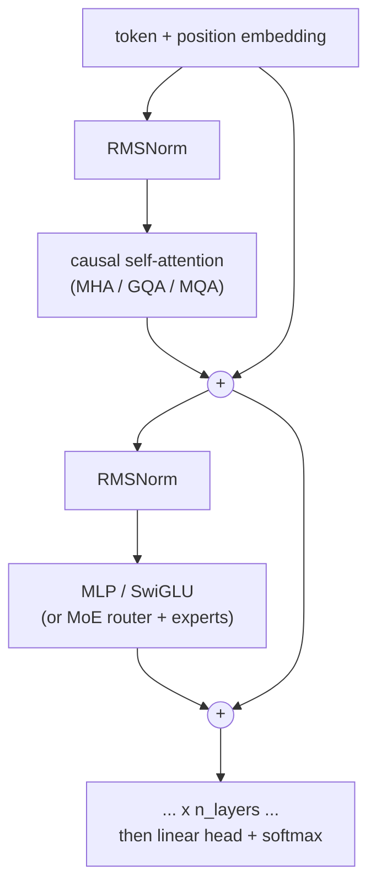
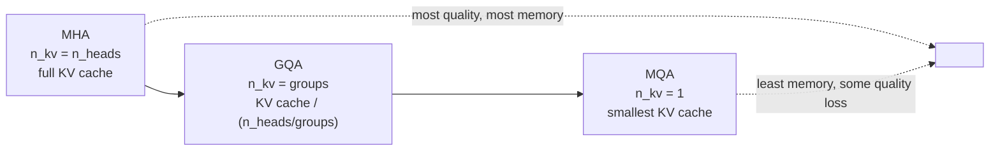
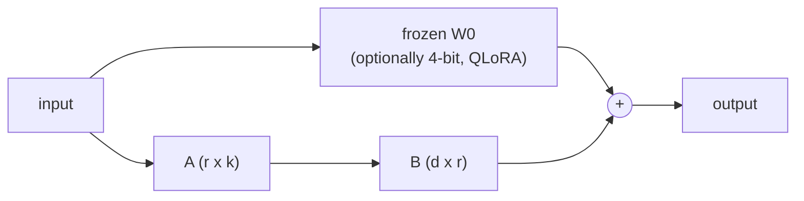
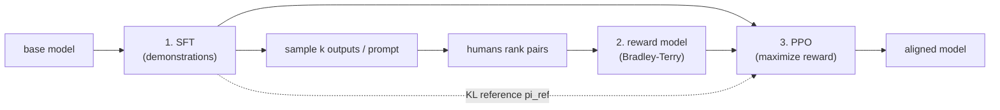
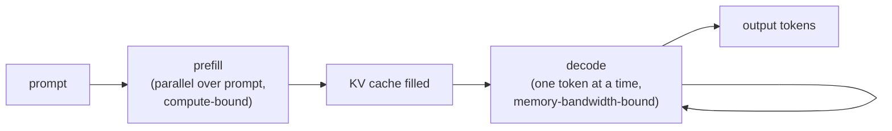
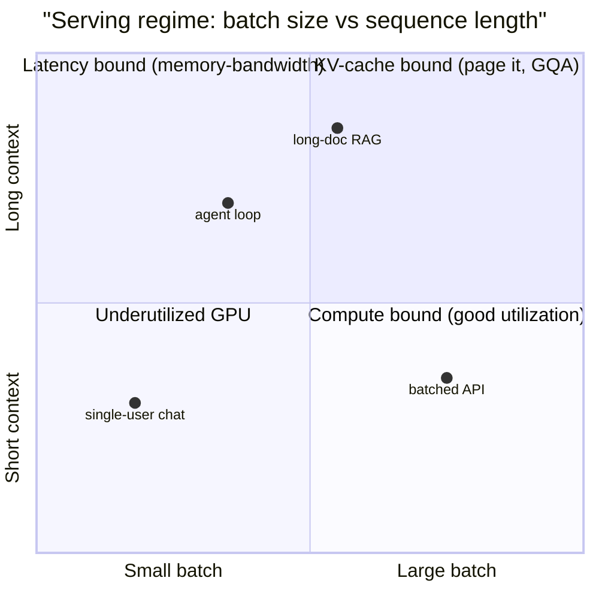
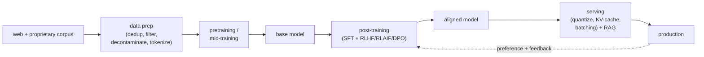

# 13 - LLM lifecycle (data, pretraining, mid-training, post-training, serving)

> **Interviewer:** "Your company wants its own large language model for a
> domain (say legal, or code, or a non-English market). You are not going to
> out-spend a frontier lab on a from-scratch pretrain. Walk me through the whole
> lifecycle: how you source and clean the data, whether you pretrain or adapt,
> how you turn a base model into something that follows instructions safely, and
> how you serve it under a real latency and cost budget. Where does the money go,
> and where does the risk go?"

The trap here is jumping straight to "fine-tune GPT" or "we will pretrain a 70B."
Building with LLMs is five distinct stages, each with its own data, its own
compute profile, its own failure mode, and its own eval. The signal is that you
name the stages, place your problem in the right one (almost never a
from-scratch pretrain), and reason about the two costs that dominate:
**data quality up front** and **inference at scale** on the back end. Pretraining
is the headline number, but for most teams the leverage is in data curation,
post-training, and serving, not in a bigger pretrain run.

The five stages, and the one-line job of each:

1. **Data preparation** - collect, dedup, filter, decontaminate, tokenize. Turns
   the open web plus your proprietary corpus into a clean token stream.
2. **Pretraining** - self-supervised next-token prediction over trillions of
   tokens. The most expensive stage; produces a raw *base model*.
3. **Mid-training** (continued / incremental pretraining) - inject domain data or
   extend the context window on top of an existing base. The cheap way to get a
   domain or long-context base without a full pretrain.
4. **Post-training** - SFT plus preference optimization (RLHF / RLAIF / DPO) turns
   a base model that only completes text into an aligned *chat / instruct model*.
5. **Deployment and inference** - quantize, compile, serve with paged KV cache and
   continuous batching, and bolt on RAG and tools. This is the line item that
   never stops, so it is where unit economics live.

This topic is the map. Each stage has a dedicated chapter that carries the full
depth: data and pretraining (stages 1 to 2) in
[topic 14](14-data-curation-and-pretraining.md), continued pretraining and
long-context (stage 3) in [topic 15](15-continued-pretraining-and-long-context.md),
post-training (stage 4) in [topic 05](05-post-training-pipeline.md), and serving
(stage 5) in [topics 02](02-long-context-and-kv-cache.md) and
[04](04-inference-serving-at-scale.md).

## 1. Clarify and scope

- **Do you actually need to train anything?** The default answer for most
  products is *no*: a hosted frontier model plus RAG plus good prompting clears
  the bar. Push the interviewer to justify owning weights (data residency, cost
  at volume, latency, a capability the API refuses, or a domain the base models
  are weak in). Owning weights is a serving-and-maintenance commitment, not a
  one-time train.
- **Which stage is the real question?** "Train an LLM" almost never means stage 2.
  It usually means stage 4 (make it follow our instructions), sometimes stage 3
  (teach it our domain or a longer context), rarely stage 1-2 (a genuinely new
  base, which only a lab-scale budget justifies). Name the stage before you size
  anything.
- **Data: what do you own that the web does not?** The only durable reason to
  train is proprietary data. Quantify it: how many tokens, how clean, what
  license, how much PII, how fast it changes. If the answer is "a few thousand
  documents," that is a RAG or SFT problem, not a pretrain.
- **Latency, throughput, and cost budget.** Tokens per second per user,
  concurrent users, and dollars per million tokens set the model size and the
  serving stack far more than accuracy does. An interactive chat at p95 under a
  second is a different system than an overnight batch summarizer.
- **Safety and eval bar.** Who gets hurt by a bad output, and how is "good"
  measured? A code assistant, a medical triage helper, and a marketing copy tool
  have completely different alignment and eval requirements, and that decides how
  much post-training and red-teaming you sign up for.

## 2. Requirements

**Functional**
- Produce a base model (or adapt one) that has absorbed the target domain and
  language distribution
- Turn the base model into one that follows instructions, holds a conversation,
  uses tools, and refuses out-of-policy requests
- Support the required context length (short chat vs long-document reasoning)
- Serve completions under an interactive latency budget at production QPS
- Ground answers in fresh or private data (RAG) and cite sources where the
  product needs verifiability

**Non-functional**
- Cost per million tokens low enough to run at product volume, not just a demo
- Reproducible, decontaminated training data with a known license and audit trail
- Retrainable and refreshable as the domain, the policy, and the base model move
- Alignment and safety behavior that holds under adversarial prompting, measured,
  not asserted
- No training-set leakage into eval, and no proprietary or PII data leaking into
  outputs

## 3. High-level data flow

Raw text (web plus your proprietary corpus) is cleaned and tokenized once, feeds
a pretraining or mid-training run that yields a base model, which post-training
turns into an aligned model, which the serving stack quantizes and wraps with
RAG and tools. Human preference data and production feedback loop back into
post-training.

The structural point: the expensive, rare stage (pretraining) is upstream and
shared; the stages you actually iterate on (post-training, serving, RAG) are
downstream and cheap by comparison. Most teams enter the diagram at the base
model, not at the raw web.

## 4. Deep dives

### Stage 1: data preparation (the real moat, and the real work)

Model quality is bounded by data quality long before it is bounded by
architecture. The pipeline is unglamorous and decisive:

- **Sourcing.** Common Crawl and other web dumps for breadth, plus code, books,
  papers, and your proprietary corpus for depth. The web is mostly noise, so the
  filtering ratio is brutal (FineWeb keeps a small fraction of raw Common Crawl).
- **Deduplication.** Near-duplicate removal (MinHash / suffix-array) across and
  within documents. Dedup is one of the highest-leverage steps: it cuts
  memorization, improves generalization per token, and stops eval leakage.
- **Quality filtering.** Heuristic filters (language ID, length, symbol ratios,
  boilerplate) plus a learned quality classifier (FineWeb-Edu trains a classifier
  to keep educational text). The art is a small set of filters that actually
  move downstream benchmarks, not fifty that each look reasonable.
- **Decontamination.** Remove documents that overlap your eval sets, or every
  benchmark number is a lie. This is the single most common integrity failure in
  LLM work and the first thing a sharp interviewer probes.
- **Safety and PII.** Scrub personal data and filter the worst content up front;
  what the model never sees, it cannot regurgitate. Some toxicity is kept
  deliberately so post-training can teach refusal, a tradeoff to state explicitly.
- **Tokenization.** Fit a BPE / SentencePiece vocabulary on the final mix.
  Vocabulary size and multilingual coverage set how many tokens (hence how much
  compute and context) each language costs; non-Latin scripts fragment into more
  tokens.

The mature answer treats data as the product: versioned, decontaminated,
license-audited, with the recipe (Dolma, FineWeb) as reproducible as the model.

### Stage 2: pretraining and the compute-optimal decision

Pretraining is self-supervised next-token prediction: minimize cross-entropy over
the corpus. The design questions are size, data budget, and architecture, not the
objective.

- **Compute-optimal sizing (Chinchilla).** For a fixed compute budget, model size
  and training tokens should scale together; the compute-optimal ratio is roughly
  20 tokens per parameter. A 70B model trained on enough data (Chinchilla) beats a
  280B model (Gopher) at the same compute. State this to show you would not just
  make the model bigger.
- **Inference-aware sizing.** Chinchilla-optimal minimizes *training* compute; if
  you will serve billions of tokens, you deliberately overtrain a *smaller* model
  past its compute-optimal point (Llama, Mistral) so inference is cheap forever.
  The optimum shifts with how much you will serve, not just how much you will
  train.
- **Architecture levers.** Decoder-only transformer is the default; the deltas
  that matter are attention (multi-head vs grouped-query vs sliding-window),
  positional encoding (RoPE, ALiBi) for length generalization, normalization
  placement, and dense vs mixture-of-experts (MoE routes each token to a few
  experts, so DeepSeek-V3 and Mixtral get a large parameter count at a small
  per-token compute).
- **Systems reality.** This is the stage where distributed training dominates:
  data, tensor, pipeline, and expert parallelism; mixed precision (bf16, or FP8 on
  DeepSeek-V3); checkpointing; and tolerating hardware failures over a run that
  lasts weeks. The bottleneck is interconnect and memory, not FLOPs alone.

### Stage 3: mid-training (continued pretraining and long-context)

Between a generic base and a finished product sits the cheapest high-leverage
stage most teams should use and few name:

- **Continued / domain pretraining.** Take an existing base model and keep
  pretraining on a domain corpus (medical, legal, code, a new language). You buy
  most of a domain base for a tiny fraction of a from-scratch pretrain. The risk
  is catastrophic forgetting: mix in general data and keep the learning rate
  modest so the model does not lose its broad ability.
- **Context-length extension.** Base models are pretrained at a fixed window
  (say 4K or 8K); extending to 128K+ is a mid-training step, usually rescaling the
  positional encoding (RoPE scaling / YaRN) plus continued training on long
  documents. Llama 3 extends context this way in a staged fashion near the end of
  pretraining.
- **Data-mix annealing.** Late in training, upweight high-quality and
  domain-relevant data ("annealing" the mix) to sharpen the base before
  post-training. Cheap, and it moves benchmarks measurably.

The interview point: "we would continue-pretrain an open base on our corpus and
extend the context, not pretrain from scratch" is usually the correct,
budget-aware answer.

### Stage 4: post-training (SFT plus preference optimization)

A base model completes text; it does not follow instructions or refuse harm.
Post-training fixes that in two steps:

- **Supervised fine-tuning (SFT).** Fine-tune on curated (instruction, response)
  pairs so the model answers instead of continuing. Quality and diversity of a
  few tens of thousands of examples beat raw volume; this is where instruction
  following, formatting, and tool-call syntax are taught.
- **Preference optimization.** Teach the model *which* good answer humans prefer.
  Classic RLHF (InstructGPT) trains a reward model on human comparisons under a
  Bradley-Terry objective, then optimizes the policy with PPO under a KL penalty
  to the SFT model so it does not drift or reward-hack. DPO skips the separate
  reward model and optimizes preferences directly with a simple classification
  loss, which is more stable and cheaper (Llama 3 uses SFT plus DPO). RLAIF /
  Constitutional AI (Anthropic) replaces most human labels with AI feedback
  against a written constitution, cutting labeling cost.
- **RL from verifiable rewards.** For math, code, and reasoning, the reward can be
  a checker (unit tests, a math verifier) rather than a preference model.
  DeepSeek-R1 shows pure RL with rule-based rewards (GRPO) can grow chain-of-thought
  and self-correction with little or no SFT. This is the current frontier for
  reasoning models.
- **The KL leash.** Every preference method keeps the policy close to the
  reference model (an explicit KL term, or DPO's implicit one). Drop it and the
  model reward-hacks: it games the reward model, gets repetitive, or collapses.
  Naming the KL penalty is a strong signal.

### Stage 5: deployment and inference (where the money actually goes)

Training is a capital cost; inference is the operating cost that runs forever, so
serving is where a product lives or dies on unit economics.

- **The KV cache is the bottleneck, not FLOPs.** Autoregressive decoding is
  memory-bandwidth bound, and the KV cache grows with batch times context and
  quickly dominates VRAM. PagedAttention (vLLM) manages it like OS virtual memory
  to kill fragmentation; grouped-query and multi-query attention shrink it at the
  source (Mistral, Character.AI).
- **Throughput tricks.** Continuous (in-flight) batching keeps the GPU full across
  requests of different lengths; prefix / prompt caching reuses the KV of a shared
  system prompt across turns (Character.AI); speculative decoding drafts with a
  small model and verifies with the big one to cut latency.
- **Compression.** Quantize weights and activations (INT8, INT4, FP8) and distill
  a small student from a big teacher so a cheaper model serves the hot path. State
  the tradeoff: quantization and distillation trade a little quality for a large
  cost and latency win, and must be eval-gated.
- **RAG and tools, not retraining.** For fresh or private facts, retrieve at
  inference and put the passages in context rather than baking them into weights.
  RAG is the fix for hallucination and staleness; retraining is not. Function
  calling and tool use extend the model to actions. This is the layer most
  products build on and the one that changes daily.
- **Serving shape.** Split interactive low-latency traffic (distilled, quantized,
  latency-optimized) from offline batch generation (throughput-optimized, spot or
  cheap capacity), the same real-time-vs-batch split as any ML system.

### Evaluation across the lifecycle

Each stage has a different metric, and using the wrong one is a classic mistake:

- **Pretraining:** perplexity / bits-per-byte on held-out text, plus a suite of
  zero/few-shot benchmarks (MMLU, HellaSwag, GSM8K). Perplexity tracks the
  objective but not usefulness.
- **Post-training:** human preference win rate and LLM-as-judge arenas
  (Chatbot Arena style), instruction-following and safety suites, and
  capability-specific evals (code pass@k, math accuracy). Preference win rate, not
  perplexity, is the target here.
- **Safety:** red-team attack success rate, refusal correctness (refuse the
  harmful, answer the benign), and jailbreak robustness, tracked as release gates.
- **Serving:** latency (p50/p95 time-to-first-token and inter-token), throughput
  (tokens/sec), and cost per million tokens, alongside a quality check that
  quantization did not regress the model.
- **Always: decontamination and leakage.** A benchmark number is meaningless if
  the test set leaked into training. Audit overlap; treat contamination as the
  first thing to rule out, not the last.

### The transformer decoder block (what pretraining optimizes)

Every stage above operates on one repeated unit: a pre-norm decoder block of
(attention, MLP), stacked `n_layers` deep, with a tied or untied output head. Get
this picture straight and the rest of the math has a home.

The forward pass factorizes the sequence probability autoregressively, and
pretraining minimizes the token-averaged negative log-likelihood (cross-entropy):

$$p_{\theta}(x) = \prod_{t=1}^{T} p_{\theta}(x_t \mid x_{\lt t}), \qquad \mathcal{L}(\theta) = -\frac{1}{T}\sum_{t=1}^{T} \log p_{\theta}(x_t \mid x_{\lt t})$$

Report it as **perplexity** (exponentiated loss) or **bits-per-byte** (tokenizer-invariant, so you can compare across vocabularies):

$$\text{PPL} = \exp(\mathcal{L}), \qquad \text{BPB} = \frac{\mathcal{L}}{\ln 2} \cdot \frac{n_{\text{tokens}}}{n_{\text{bytes}}}$$

Interview trap: perplexity is only comparable across models that share a
tokenizer. A model with a bigger vocabulary emits fewer tokens per sentence and
looks better on perplexity while being no better; bits-per-byte removes that
artifact, which is why serious pretraining reports use it.

### Attention variants and the KV-cache math (MHA, MQA, GQA)

*Serving-side deep dives: [topic 02, Long-context and the KV cache](02-long-context-and-kv-cache.md) and [topic 04, Inference serving at scale](04-inference-serving-at-scale.md). This is the lifecycle-level summary.*

Scaled dot-product attention is the same everywhere; what differs is how many
distinct key/value heads you keep, and that single number sets your serving cost:

$$\text{Attn}(Q, K, V) = \text{softmax}\!\left(\frac{Q K^{\top}}{\sqrt{d_{\text{head}}}} + M\right) V$$

where `M` is the causal mask. During autoregressive decoding you cache K and V
for every past token so you never recompute them; that cache is the memory that
dominates serving:

$$M_{\text{kv}} = 2 \cdot b \cdot L \cdot n_{\text{layers}} \cdot n_{\text{kv}} \cdot d_{\text{head}} \cdot p_{\text{bytes}}$$

The `2` is K and V; `n_{\text{kv}}` is the number of key/value heads. That is the
whole game:

GQA cuts the KV cache (and the memory-bandwidth per decoded token) by a factor of
`n_heads / n_kv` while staying close to MHA quality; MQA (`n_kv = 1`) is the
extreme. This is why Llama, Mistral, and almost every production base ship GQA,
not MHA. Worked number: Llama-3-8B has 32 query heads but 8 KV heads, so its KV
cache is 4x smaller than the MHA equivalent, which directly multiplies the batch
size you can fit and therefore the throughput per GPU.

### Pretraining and adaptation math, and where each derivation lives

Three results anchor the build side. This map states each and points to the chapter
that carries the full derivation, so the lifecycle stays readable end to end.

**Scaling laws (Chinchilla).** Training compute is well approximated by
$C \approx 6 N D$ (parameters `N`, tokens `D`), and loss follows a power law
$L(N, D) = E + A / N^{\alpha} + B / D^{\beta}$. Minimizing loss at fixed compute
gives the compute-optimal rule $D_{\text{opt}} \approx 20 N_{\text{opt}}$, which is
*training*-optimal, not *deployment*-optimal: a model you will serve a lot (Llama 3
8B at roughly 1800 tokens per parameter) is trained far past 20 to shrink the
forever-cost of inference. The data pipeline, the compute-optimal sizing decision,
and distributed training (data, tensor, and pipeline parallelism, ZeRO, FSDP) are
[topic 14, Data curation and pretraining](14-data-curation-and-pretraining.md).

**Mixture-of-experts.** Replace the dense MLP with `E` experts and a router that
sends each token to its top-`k`, so capacity grows while per-token FLOPs stay flat:
$y = \sum_{i \in \text{top-k}} g_i(x) E_i(x)$. Load balancing (an auxiliary loss, or
DeepSeek-V3's auxiliary-loss-free bias) is the thing that breaks. Full treatment in
[topic 14](14-data-curation-and-pretraining.md).

**Positional encoding and long context.** RoPE injects position by rotation, so the
query-key dot product depends only on the relative offset `m - n`. Extending the
window is a mid-training problem: linear position interpolation scales all RoPE
frequencies uniformly, YaRN scales them non-uniformly plus a softmax temperature
term, and the cost is quadratic in attention and linear in the KV cache. The
extension mechanisms, catastrophic forgetting, and long-context evaluation are
[topic 15, Continued pretraining and long-context adaptation](15-continued-pretraining-and-long-context.md).

### Parameter-efficient fine-tuning (LoRA and QLoRA)

Full fine-tuning updates all `N` weights and needs optimizer state for all of
them (roughly 12-16 bytes per parameter with Adam), which is why a 70B full SFT
needs a cluster. **LoRA** freezes the base weights and learns a low-rank update:

$$W = W_0 + \Delta W = W_0 + \frac{\alpha}{r} B A, \qquad B \in \mathbb{R}^{d \times r},\ A \in \mathbb{R}^{r \times k},\ r \ll \min(d, k)$$

You train only `r(d + k)` parameters instead of `dk`, often under 1 percent of the
model, and the adapters merge back into `W_0` at inference so there is zero added
latency. **QLoRA** goes further: quantize the frozen base to 4-bit (NF4) and train
the LoRA adapters on top, fitting a 65B fine-tune on a single 48GB GPU.

Decision rule for the interview: RAG for knowledge that changes, LoRA/QLoRA for
behavior and format on a budget, full fine-tuning only when you have the data and
the compute and need to move the base itself. Confusing "teach it facts" (RAG)
with "teach it behavior" (fine-tune) is the single most common LLM-product
mistake.

### The post-training math (SFT, reward model, PPO-RLHF, DPO, GRPO)

*The full post-training pipeline (data curation, LoRA, eval gates, rollout) is [topic 05, Fine-tuning and post-training pipeline](05-post-training-pipeline.md).*

Post-training is where the most interview questions and the most confusion live,
so carry the four equations. **SFT** is just cross-entropy on the completion, with
the prompt tokens masked out of the loss:

$$\mathcal{L}_{\text{SFT}} = -\sum_{t \in \text{completion}} \log \pi_{\theta}(y_t \mid y_{\lt t}, x)$$

**Reward model** learns human preference under Bradley-Terry (the same logistic
model behind Elo), trained on ranked pairs of a chosen `y_w` and rejected `y_l`:

$$\mathcal{L}_{\text{RM}} = -\mathbb{E}_{(x, y_w, y_l)}\Big[\log \sigma\big(r_{\phi}(x, y_w) - r_{\phi}(x, y_l)\big)\Big]$$

**RLHF (PPO)** then maximizes reward while a KL penalty keeps the policy near the
SFT reference so it does not reward-hack or forget language:

$$\max_{\theta}\ \mathbb{E}_{x \sim D,\, y \sim \pi_{\theta}}\big[r_{\phi}(x, y)\big] - \beta\, \text{KL}\big(\pi_{\theta}(\cdot \mid x) \,\|\, \pi_{\text{ref}}(\cdot \mid x)\big)$$

folded into a per-token reward `r_t = r_{\phi} - \beta(\log \pi_{\theta} - \log \pi_{\text{ref}})` and optimized with the PPO clipped surrogate.

**DPO** removes the reward model and the RL loop entirely. The key insight is that
the RLHF-optimal policy has a closed form, `\pi^*(y \mid x) \propto \pi_{\text{ref}}(y \mid x)\,\exp(r(x,y)/\beta)`,
so the reward is an implicit function of the policy, and substituting it into
Bradley-Terry gives a plain classification loss on preference pairs:

$$\mathcal{L}_{\text{DPO}} = -\mathbb{E}_{(x, y_w, y_l)}\left[\log \sigma\!\left(\beta \log \frac{\pi_{\theta}(y_w \mid x)}{\pi_{\text{ref}}(y_w \mid x)} - \beta \log \frac{\pi_{\theta}(y_l \mid x)}{\pi_{\text{ref}}(y_l \mid x)}\right)\right]$$

**GRPO** (DeepSeek) keeps online RL but drops the critic: sample a group of `G`
outputs per prompt, and use the group-normalized reward as the advantage, which
halves memory versus PPO and suits verifiable rewards:

$$\hat{A}_i = \frac{r_i - \text{mean}(r_1, \dots, r_G)}{\text{std}(r_1, \dots, r_G)}$$

| Method | Needs reward model? | Needs online sampling? | Cost / stability | Use when |
|---|---|---|---|---|
| SFT | no | no | cheapest, very stable | teach format and basic instruction following |
| RLHF (PPO) | yes | yes | expensive, finicky | you want a reusable reward model and best-in-class alignment |
| DPO | no (implicit) | no (offline pairs) | cheap, stable | the default preference method for most teams |
| GRPO | no (rule/verifier) | yes | mid, critic-free | verifiable rewards: math, code, reasoning |

Every one of these has a KL leash to `\pi_{\text{ref}}`, explicit (PPO/GRPO) or
implicit (DPO's `\beta`). Naming that leash, and what happens without it (reward
hacking, sycophancy, mode collapse, repetition), is the strongest single signal
you can give on an alignment question.

### The inference math (KV cache, roofline, batching, speculation, quantization)

*Serving at scale is [topic 02](02-long-context-and-kv-cache.md) and [topic 04](04-inference-serving-at-scale.md). This is the lifecycle-level summary.*

Serving splits into two phases with opposite bottlenecks:

Decode is memory-bound because each new token must read all model weights (and the
whole KV cache) from HBM while doing very little arithmetic. The governing quantity
is **arithmetic intensity** (FLOPs per byte moved) versus the hardware's
compute-to-bandwidth ratio; below it you are memory-bound, above it compute-bound:

$$I = \frac{\text{FLOPs}}{\text{bytes moved}}, \qquad t_{\text{decode/token}} \approx \frac{N \cdot p_{\text{bytes}}}{\text{BW}_{\text{HBM}}} \ \text{(batch 1)}$$

The numerator is the full weight read (each parameter fetched once from HBM):
decode is memory-bound, so per-token latency is bytes-moved over bandwidth, not
FLOPs over compute. This is why **batching is free
throughput**: at batch 1 you pay the full weight read to emit one token; at batch
`b` you amortize the same read over `b` tokens, pushing arithmetic intensity up
toward the compute-bound regime until the KV cache eats your VRAM.

Three levers move the memory wall. **PagedAttention** stores the KV cache in
non-contiguous pages (like OS virtual memory) so fragmentation stops wasting 60-80
percent of it. **Speculative decoding** drafts `k` tokens with a small model and
verifies them in one target forward pass; with acceptance rate `\alpha` the
expected accepted tokens per target step is

$$\mathbb{E}[\text{accepted}] = \frac{1 - \alpha^{k+1}}{1 - \alpha}$$

turning several memory-bound steps into one. **Quantization** shrinks both weights
and the KV cache with an affine map, trading precision for bandwidth:

$$x_q = \text{round}\!\left(\frac{x}{s}\right) + z, \qquad s = \frac{x_{\max} - x_{\min}}{2^{n} - 1}$$

FP16 to INT8 halves memory and roughly doubles decode throughput; INT4 quarters
it, with a quality hit you must eval-gate. A useful mental model: a 70B model in
FP16 is 140GB of weights, in INT8 it is 70GB, in INT4 it is 35GB, and that number,
not FLOPs, decides how many GPUs you rent.

## 5. Bottlenecks and scaling

| Bottleneck | First sign | Fix | Tradeoff |
|---|---|---|---|
| Dirty / duplicated data | Model memorizes, benchmarks leak | Aggressive dedup, quality filter, decontaminate | Heavy pipeline, keeps a small fraction of raw web |
| Pretraining compute | Budget cannot reach compute-optimal | Adapt an open base (mid-training), not from scratch | Give up frontier ceiling; inherit base's flaws |
| Catastrophic forgetting | Domain tune loses general ability | Mix in general data, modest LR, LoRA adapters | Slower domain gain, more tuning |
| Context length | Long docs overrun the window | RoPE scaling / YaRN plus long-context continued train | More memory and compute per token |
| Preference reward hacking | Repetitive, gamed, sycophantic outputs | KL penalty to reference; DPO; verifiable rewards | Less aggressive optimization |
| KV cache / VRAM at serve | OOM or low batch under load | PagedAttention, GQA/MQA, quantization | Engineering complexity, small quality hit |
| Inference cost at scale | Cost per token blows the budget | Distill, quantize, continuous batch, prompt cache | Quality regression risk, must eval-gate |
| Hallucination / staleness | Confident wrong or outdated facts | RAG with fresh retrieval, citations | Retrieval infra, latency, context budget |

## 6. Failure modes, safety, eval

- **Benchmark contamination.** Eval data leaks into pretraining and every number
  is inflated. Deduplicate eval against train, report contamination checks, and
  distrust any headline score without them.
- **Catastrophic forgetting in mid-training.** Domain adaptation silently erodes
  general reasoning and instruction-following. Replay general data, keep the
  learning rate modest, and re-run the full eval suite, not just the domain slice.
- **Reward hacking and sycophancy.** The policy games the reward model: verbose,
  agreeable, confidently wrong. Keep the KL leash, red-team the reward model, and
  measure sycophancy directly.
- **Alignment tax.** Heavy safety tuning can dull capability and over-refuse
  benign requests. Track the false-refusal rate as carefully as the harmful-answer
  rate; both are release gates.
- **Hallucination.** The model fabricates facts fluently. RAG with grounding and
  citations, calibrated abstention, and eval on faithfulness, not just fluency,
  are the defenses; retraining is not.
- **Jailbreaks and prompt injection.** Adversarial prompts (and, with tools,
  injected instructions from retrieved content) route around safety training.
  Assume evasion is constant; layer input/output filtering, isolate tool inputs,
  and red-team continuously.
- **Quantization / distillation regression.** A compressed model looks fine on
  perplexity but drops on a hard capability. Gate every compression step on the
  full eval suite, not a spot check.
- **PII and data leakage.** The model regurgitates training data or leaks private
  context across users. Scrub PII up front, dedup to cut memorization, and isolate
  per-user context at serve time.

## 7. Likely follow-ups

- "Should you pretrain from scratch?" Almost never. Justify owning weights (data,
  cost, latency, refusal, a weak domain), then adapt an open base via mid-training
  and post-training. From-scratch pretrain is a lab-budget decision.
- "How big a model and how much data?" Chinchilla says scale them together, about
  20 tokens per parameter for compute-optimal training; but if you serve at scale,
  overtrain a smaller model past that point so inference stays cheap.
- "RAG or fine-tuning for our private knowledge?" RAG for facts that change or must
  be cited; fine-tuning for behavior, format, tone, and skills. They compose:
  fine-tune the behavior, retrieve the facts. Do not fine-tune to memorize a
  changing database.
- "SFT vs RLHF vs DPO vs RL-from-verifiable-rewards?" SFT teaches the format and
  basic instruction following; preference methods teach which answer humans prefer.
  DPO is the cheap stable default; PPO-style RLHF when you need a reward model;
  verifiable rewards (RL) for math/code/reasoning where a checker exists.
- "Why is inference the expensive part?" Decoding is memory-bandwidth bound and
  the KV cache dominates VRAM, so throughput, not FLOPs, is the limit. Paged KV,
  GQA, continuous batching, quantization, and prompt caching are the levers.
- "How do you know it is safe?" Red-team attack success rate, false-refusal rate,
  jailbreak robustness, and a held-out safety suite as release gates, plus
  decontaminated capability evals so the numbers are real.
- "How do you keep it current without retraining monthly?" RAG over a fresh index
  for facts, periodic light post-training for behavior, and reserve a new base or
  mid-training pass for when the capability floor itself must move.

## 8. Tricky interview questions (and how to nail them)

These are the follow-ups that separate a memorized answer from real
understanding. Each has a sharp, defensible response.

- **"DPO has no reward model and no RL loop. So why does it still need a reference
  model, and what is `\beta` doing?"** DPO's loss contains `\log(\pi_\theta / \pi_{\text{ref}})`:
  the reference is the implicit reward's baseline, and `\beta` is the same KL
  temperature as RLHF. Small `\beta` lets the policy move far from the reference
  (more optimization, more drift and degeneration); large `\beta` keeps it close.
  DPO did not remove the KL leash, it absorbed it into the loss.
- **"Your GQA model has the same parameter count as the MHA one. Why is it faster
  at inference but not at training?"** Training is compute-bound and reads weights
  once over a full batch, so fewer KV heads barely helps. Decoding is
  memory-bandwidth-bound and re-reads the KV cache every token, so shrinking it by
  `n_heads / n_kv` is a direct decode speedup. The win is a serving win, not a
  FLOPs win.
- **"Chinchilla says 20 tokens per parameter. Llama 3 8B used about 1800. Who is
  wrong?"** Neither. Chinchilla minimizes training compute for a target loss.
  Llama deliberately overtrains a small model because the objective includes
  inference: a smaller model served billions of times is cheaper forever, so you
  spend extra training FLOPs to save on the recurring bill. Different objective,
  different optimum.
- **"You added RLHF and MMLU dropped. Explain."** The alignment tax: optimizing a
  preference reward can trade away some raw capability, and preference data skews
  toward chatty, hedged answers. Diagnose with a capability suite run before and
  after, check for reward over-optimization (rising reward, falling eval), and
  tighten the KL or add capability data to the SFT mix.
- **"Perplexity improved but users say the model got worse. How?"** Perplexity
  measures next-token fit on some corpus, not helpfulness, instruction-following,
  or safety, and it is not comparable across tokenizers. A base can have great
  perplexity and be useless until post-training; judge post-trained models on
  preference win rate and task evals, not perplexity.
- **"RAG or long context for 50M documents?"** Long context does not scale to 50M
  documents (attention memory and cost, plus lost-in-the-middle recall decay), and
  it reprocesses everything per query. RAG retrieves the few relevant chunks, so
  it is cheaper, fresher, and citable. Long context complements RAG for a big
  single document, it does not replace retrieval over a corpus.
- **"Where exactly does the KL penalty live in PPO-RLHF versus GRPO?"** In classic
  PPO-RLHF it is commonly folded into the per-token reward (`r - \beta \log(\pi/\pi_{\text{ref}})`);
  in GRPO it is added as a separate regularization term at the optimization stage
  with an unbiased KL estimator, and GRPO drops the value/critic network entirely,
  estimating the advantage from group-relative rewards.
- **"Your eval jumped 8 points after a data refresh. First thing you check?"**
  Contamination. A benchmark gain from new data is guilty until proven clean;
  re-run decontamination (n-gram / embedding overlap of eval against train) before
  you believe or ship the number.
- **"Quantize to INT4 or distill to a smaller model for cost?"** Quantization is a
  cheap, near-lossless first move (INT8 almost free, INT4 needs an eval gate) and
  keeps the same architecture. Distillation costs a training run but can beat
  quantization on latency and memory for a fixed quality, and the two compose
  (QLoRA, distill-then-quantize). Start with quantization; distill when the model
  itself is too big for the budget.

## 9. Commonly answered wrong (the traps)

The mistakes that quietly fail a loop even when the candidate sounds fluent:

- **"We will just fine-tune it on our knowledge base."** Fine-tuning teaches
  behavior and style, not a changing set of facts, and it bakes staleness in while
  inviting hallucination. Correct: RAG for the facts, fine-tune only the behavior.
- **"Bigger model, so lower perplexity, so better product."** Perplexity is not
  usefulness and is tokenizer-dependent; product quality comes from post-training,
  data quality, and serving, not raw size. Name the right metric per stage.
- **"RLHF is just fine-tuning on good answers."** That is SFT. RLHF optimizes a
  *preference* signal (which answer is better) under a KL constraint via a reward
  model or an implicit one, which is a different objective that can improve on any
  single demonstration and can also reward-hack.
- **"We will use a 128K context so we do not need retrieval."** Long context is
  expensive per query, recall decays in the middle, and it reprocesses the corpus
  every call. It does not replace an index over many documents.
- **"Inference is cheap, the cost was the training run."** Backwards for anything
  with traffic: training is one-time capital, inference is the forever operating
  cost, and it is memory-bandwidth-bound. The KV cache, batching, and quantization,
  not FLOPs, set the bill.
- **"Our benchmark scores are state of the art."** Meaningless without a
  decontamination claim. The first question a strong interviewer asks is whether
  the eval leaked into training; lead with that, do not wait to be asked.
- **"More data is always better."** Only clean, deduplicated, decontaminated data.
  Duplicates cause memorization and eval leakage, and low-quality web text can
  lower downstream scores; the keep rate after filtering is a small fraction for a
  reason.
- **"We will pretrain our own model."** Almost never the right call: from-scratch
  pretraining is a lab-scale budget, and the leverage for a product is in data,
  post-training, and serving on top of an open base. Justify owning weights before
  proposing to train them.
- **"Add safety tuning and we are done on safety."** Safety is measured, not
  asserted: track attack success rate, false-refusal rate, and jailbreak
  robustness as release gates, and assume adversarial evasion (and prompt
  injection through tools/RAG) is continuous.

---

## Trace the architectures

The lifecycle produces and consumes real graphs. Open each and look at the
structural choice the stage turns on: the decoder block that pretraining
optimizes, the attention variant that decides serving cost, the MoE routing that
buys parameters cheaply.

- **The canonical base decoder (GPT-2 small):**
  [open it live](https://www.neurarch.com/?import=https://raw.githubusercontent.com/neurarch-ai/awesome-llm-model-zoo/main/architectures/gpt2-small/model.json).
  Trace the stack of decoder blocks to the tied output head: this is the shape
  pretraining optimizes with next-token prediction, the base every later stage
  starts from.

  

- **A modern production base (Llama 3 8B):**
  [open it live](https://www.neurarch.com/?import=https://raw.githubusercontent.com/neurarch-ai/awesome-llm-model-zoo/main/architectures/llama3-8b/model.json).
  Trace grouped-query attention, RoPE, and RMSNorm: the deltas over GPT-2 that
  make a model cheap to serve and able to extend context, the base behind the
  Llama 3 case below.

  

- **Efficient attention for serving (Mistral 7B):**
  [open it live](https://www.neurarch.com/?import=https://raw.githubusercontent.com/neurarch-ai/awesome-llm-model-zoo/main/architectures/mistral-7b/model.json).
  Trace grouped-query plus sliding-window attention: the design that shrinks the
  KV cache so inference stays cheap at long context, the serving-cost lever.

  

- **A fully open base (OLMo 7B):**
  [open it live](https://www.neurarch.com/?import=https://raw.githubusercontent.com/neurarch-ai/awesome-llm-model-zoo/main/architectures/olmo-7b/model.json).
  Trace the base trained on the open Dolma corpus: the model whose data pipeline
  (stage 1) is public end to end, the reference for a reproducible pretrain.

  

- **Mixture-of-experts at frontier scale (DeepSeek-V3):**
  [open it live](https://www.neurarch.com/?import=https://raw.githubusercontent.com/neurarch-ai/awesome-llm-model-zoo/main/architectures/deepseek-v3/model.json).
  Trace the MoE routing: a large total parameter count at a small per-token
  compute, the architecture that makes a frontier base affordable to train and
  serve.

  

- **A modern multilingual base (Qwen3 8B):**
  [open it live](https://www.neurarch.com/?import=https://raw.githubusercontent.com/neurarch-ai/awesome-llm-model-zoo/main/architectures/qwen3-8b/model.json).
  Trace a current base tuned for multilingual and reasoning use, the kind of open
  model most teams would mid-train and post-train rather than pretrain from
  scratch.

  

These are validated reference graphs at real dimensions, shape-checked end to end,
not screenshots. Browse all in the
[Model Zoo](https://github.com/neurarch-ai/awesome-llm-model-zoo) or the
[gallery](https://neurarch-ai.github.io/awesome-llm-model-zoo). Built by
[Neurarch](https://www.neurarch.com).

## Seen in production

Real writeups that document a stage of the lifecycle in the open. Each is a
first-party source; read them for what an interview answer skips: the data
recipe, the training decisions, the eval bar, and the serving economics.

### The shared pipeline

Under the lifecycle framing, these systems are the same skeleton at different
stages. Raw text is cleaned and tokenized, a pretraining or mid-training run
yields a base model, post-training (SFT plus preference optimization) aligns it,
and a serving stack quantizes and wraps it for production, with human and
production feedback looping back into post-training.

### How they differ

| System | Stage | Method | Key lever | When it wins | Watch out | Metric it moves |
|---|---|---|---|---|---|---|
| Hugging Face FineWeb | data prep | filter + dedup 96 Common Crawl dumps to 15T tokens | learned quality classifier (FineWeb-Edu) | open pretrain data that beats prior public sets | keeps a small fraction; decontamination critical | downstream benchmark score per token |
| Ai2 Dolma / OLMo | data prep + open base | 3T-token open corpus, fully documented pipeline | reproducibility end to end | studying data curation, a truly open base | open data is a legal and safety commitment | corpus quality, reproducibility |
| Google DeepMind Chinchilla | pretraining | compute-optimal scaling study (400+ models) | ~20 tokens per parameter | fixed compute budget, sizing decision | optimal for training, not inference | loss at fixed compute |
| Meta Llama 3 | full lifecycle | data + scale + SFT + rejection sampling + DPO | staged context extension, simple post-train | a strong open base plus instruct model | 405B pretrain is lab-scale | benchmark suite, human win rate |
| Mistral 7B | pretraining + serving | GQA + sliding-window attention | small KV cache at long context | efficient inference on a small model | 7B ceiling on hard tasks | tokens/sec, quality per FLOP |
| OpenAI InstructGPT | post-training | RLHF: reward model + PPO under KL | human preference as reward | making a base model follow instructions | reward hacking without KL leash | preference win rate |
| Anthropic Constitutional AI | post-training | RLAIF against a written constitution | AI feedback replaces human labels | scaling alignment without armies of labelers | constitution design is the new bottleneck | harmlessness + helpfulness |
| DeepSeek-R1 | post-training (reasoning) | pure RL with rule-based rewards (GRPO) | verifiable reward, minimal SFT | math/code/reasoning with a checker | reward only where verifiable | reasoning benchmark (AIME, MATH) |
| vLLM | serving | PagedAttention + continuous batching | KV cache as OS-style paging | high-throughput cheap serving | engineering complexity | throughput (up to 24x), cost/token |
| Character.AI | serving | INT8 + MQA + prefix / inter-turn KV cache | aggressive KV-cache reduction | serving 20k+ QPS chat cheaply | quality vs quantization tradeoff | cost per query, tokens/sec |

The dividing line is which stage the writeup is about: data prep and pretraining
buy the capability ceiling, post-training decides whether the model is usable and
safe, and serving decides whether the unit economics work. A complete answer
places its problem on exactly one of these and reasons about the cost there.

### The systems

- **Hugging Face** [FineWeb: decanting the web for the finest text data at scale](https://huggingface.co/spaces/HuggingFaceFW/blogpost-fineweb-v1): a 15T-token open pretraining set from 96 Common Crawl dumps, with the filtering and deduplication recipe documented and ablated. *(data recipe)*
- **Ai2** [Dolma: an Open Corpus of Three Trillion Tokens for Language Model Pretraining Research](https://arxiv.org/abs/2402.00159): a fully open 3T-token corpus and toolkit, the data behind the open OLMo base model. *(data recipe)*
- **Google DeepMind** [Training Compute-Optimal Large Language Models (Chinchilla)](https://arxiv.org/abs/2203.15556): 400+ models show model size and tokens should scale together, about 20 tokens per parameter; a 70B Chinchilla beats a 280B Gopher at equal compute. *(training decision)*
- **Meta** [The Llama 3 Herd of Models](https://ai.meta.com/research/publications/the-llama-3-herd-of-models/): an end-to-end open recipe, careful data curation, staged context extension, and a simple SFT plus rejection-sampling plus DPO post-train. *(full lifecycle)*
- **Mistral** [Mistral 7B](https://mistral.ai/news/announcing-mistral-7b/): grouped-query plus sliding-window attention shrink the KV cache, so a 7B model serves long context cheaply and beats larger models. *(architecture + serving)*
- **OpenAI** [Aligning language models to follow instructions (InstructGPT)](https://openai.com/index/instruction-following/): RLHF with a reward model and PPO under a KL penalty makes a 1.3B model preferred over 175B GPT-3 on instruction following. *(post-training)*
- **Anthropic** [Constitutional AI: Harmlessness from AI Feedback](https://www.anthropic.com/research/constitutional-ai-harmlessness-from-ai-feedback): RLAIF against a short written constitution replaces most human harm labels and is both more helpful and more harmless than plain RLHF. *(post-training)*
- **DeepSeek** [DeepSeek-R1: Incentivizing Reasoning Capability in LLMs via Reinforcement Learning](https://arxiv.org/abs/2501.12948): pure RL with rule-based rewards (GRPO) grows chain-of-thought and self-correction with little or no SFT. *(post-training, reasoning)*
- **vLLM** [Easy, Fast, and Cheap LLM Serving with PagedAttention](https://blog.vllm.ai/2023/06/20/vllm.html): paging the KV cache like OS virtual memory plus continuous batching delivers up to 24x higher throughput than naive serving. *(serving)*
- **Character.AI** [Optimizing AI Inference at Character.AI](https://blog.character.ai/optimizing-ai-inference-at-character-ai-2/): INT8, multi-query attention, and a tree-structured inter-turn KV cache serve 20k+ queries per second at a fraction of the cost. *(serving)*

More production case studies: the [Evidently AI ML system design database](https://www.evidentlyai.com/ml-system-design) (800 case studies from 150+ companies) is the broadest curated index; this section pulls the ones that map onto this topic.

## Further reading

Aman Chadha's primers are the most thorough open notes on the mechanics behind
each stage, worth reading alongside the first-party writeups above:

- [Policy / preference optimization (RLHF, PPO, DPO, GRPO)](https://aman.ai/primers/ai/preference-optimization/)
- [Model acceleration (attention variants, KV cache, speculative decoding)](https://aman.ai/primers/ai/model-acceleration/)
- [Model compression (quantization, LoRA / QLoRA, pruning)](https://aman.ai/primers/ai/model-compression/)
- [Knowledge distillation](https://aman.ai/primers/ai/knowledge-distillation/)
- [DeepSeek-R1 (RL from verifiable rewards)](https://aman.ai/primers/ai/deepseek-R1/)

## Related deep-dive drills

Rapid-fire questions that probe the modeling and systems underneath this topic, from [deep-dives.md](../deep-dives.md):

- [Training, fine-tuning, and overfitting](../deep-dives.md#training-fine-tuning-and-overfitting)
- [Alignment, objectives, and KL divergence](../deep-dives.md#alignment-objectives-and-kl-divergence)
- [Scaling: rooflines, parallelism, and the arithmetic of large models](../deep-dives.md#scaling-rooflines-parallelism-and-the-arithmetic-of-large-models)
- [Distillation, pruning, and model compression](../deep-dives.md#distillation-pruning-and-model-compression)
- [Commonly asked, commonly missed](../deep-dives.md#commonly-asked-commonly-missed)
