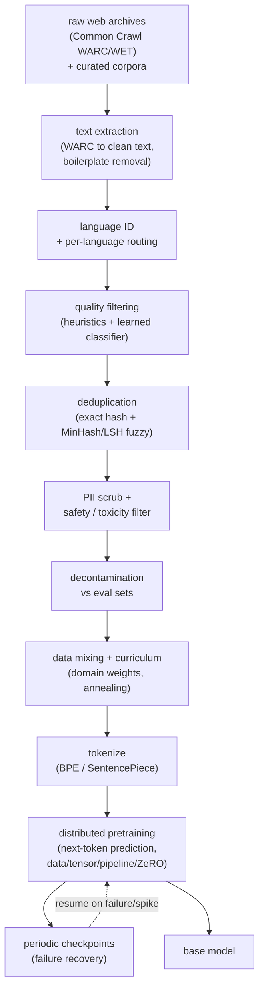
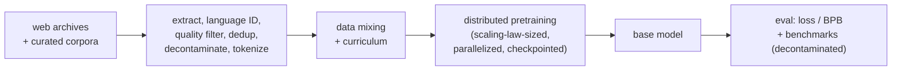

# 14 - Data curation and pretraining (web-scale data to a base model)

> **Interviewer:** "Forget adapting an open model for a minute. A frontier lab has
> handed you the budget to build a base model from scratch: thousands of GPUs, a
> few months, and the whole open web plus some licensed corpora. Walk me through
> how you turn a petabyte of raw Common Crawl into a clean token stream, how you
> decide the model size and token budget, and how you actually run the training
> job across a cluster without the loss diverging or the run dying every six
> hours. Where does quality come from, and where does the money go?"

This is the build side of [topic 13](../topics/13-llm-lifecycle.md): its stages 1
and 2, opened up and gone through slowly. The trap is to treat it as a training
question and jump to "decoder-only transformer, next-token loss, done." The
capability ceiling of the finished model is set upstream of the optimizer, in the
data pipeline, and the training run itself lives or dies on systems engineering,
not on the objective. The strongest answer spends most of its time on two things
the weak answer skips: **how the data gets clean** (extraction, dedup, quality
filtering, decontamination, tokenization, mixing) and **how the run stays alive**
(parallelism, memory sharding, checkpointing, loss-spike recovery). The objective
itself is one line. Everything expensive and everything that separates a good base
model from a mediocre one is around it.

Say the shape out loud before diving in: model quality is bounded by data quality
long before it is bounded by architecture, the compute-optimal split of a fixed
budget between parameters and tokens is a solved calculation (Chinchilla), and the
run is a distributed-systems problem where interconnect bandwidth and failure
recovery, not raw FLOPs, are the real constraints.

## 1. Clarify and scope

- **Are we genuinely pretraining from scratch, or continue-pretraining?** From
  scratch is a lab-scale decision justified only by a new language, a new modality,
  a new tokenizer, or a capability the open bases genuinely lack. If an open base
  in the target distribution exists, mid-training on it is almost always the right
  call (that is [topic 13](../topics/13-llm-lifecycle.md), stage 3). Assume the
  interviewer really does want stage 1 to 2, and say why you would normally push
  back.
- **What is the compute budget, in GPU-hours or FLOPs?** This single number sets
  the model size and the token budget through the scaling laws before any
  architecture talk. A budget also implies a cluster size and therefore a
  parallelism strategy. Pin it down first.
- **What data do we have rights to, and in what languages?** Web crawl for breadth,
  plus code, books, papers, math, and any licensed or proprietary corpus for depth.
  License and PII exposure decide what you can keep. Language mix decides tokenizer
  design and the data-mixing weights.
- **What is the target: a general base, or a domain or multilingual base?** A
  code-heavy base, a multilingual base, and a general English base have different
  data mixes, different tokenizer vocabularies, and different eval suites. The
  mixture is a design choice, not a default.
- **How will we know it worked, and how do we avoid fooling ourselves?** The
  pretraining metric is loss or bits-per-byte plus a benchmark suite, but the
  load-bearing requirement is decontamination: if the eval leaked into training,
  every number is fiction. Settle the eval and the contamination check before the
  first token is trained.

## 2. Requirements

**Functional**
- Ingest web crawl plus curated corpora and produce a clean, deduplicated,
  decontaminated, tokenized token stream, versioned and license-audited.
- Fit a tokenizer sized for the target language mix and vocabulary budget.
- Decide model size and token budget from the compute budget via scaling laws.
- Train a decoder-only base model to a target loss with next-token prediction.
- Extend context length near the end of training if long-context is a target.
- Produce a raw base model plus its full training and data provenance.

**Non-functional**
- Reproducibility: the model artifact pins its data snapshot, mixture weights,
  tokenizer, and hyperparameters. The recipe is as reproducible as the weights
  (the Dolma and FineWeb standard).
- Decontamination and no eval leakage, audited and reported, not asserted.
- Fault tolerance: a multi-week run survives GPU failures, network partitions, and
  loss spikes without losing more than a checkpoint interval of work.
- Cost control: high model-FLOPs utilization (MFU), so the cluster is not idling on
  communication or stalls.
- License and PII compliance: what the model never sees, it cannot regurgitate.

## 3. High-level data flow

Raw web archives and curated corpora flow through a filtering funnel that keeps a
small fraction, get tokenized once into a fixed mixture, and feed a distributed
pretraining loop that emits periodic checkpoints and a final base model. The keep
rate is brutal: web crawl is mostly boilerplate, spam, and near-duplicates, so a
pipeline that keeps single-digit percentages of the raw bytes is normal and
correct.

The structural point: the pipeline is a funnel with an ordering that matters, and
the training loop is a fault-tolerant system with a checkpoint feedback edge, not a
single `.fit()` call. Most of the engineering, and most of the ways to get a worse
model, live in the top two-thirds of this diagram, before the optimizer ever runs.

## 4. Deep dives

### Web crawl and text extraction

The web arrives as WARC (raw HTTP responses) or WET (pre-extracted plaintext)
archives from Common Crawl. WET is convenient but lossy: its generic extraction
keeps navigation, boilerplate, and cookie banners. Serious pipelines (FineWeb,
RefinedWeb) re-extract from WARC with a purpose-built HTML-to-text extractor
(trafilatura-style) that strips boilerplate while keeping article body text, then
apply URL-level blocklists for adult and spam domains before anything else runs.

- **Extraction quality is upstream of everything.** Garbage extraction (menus,
  ads, repeated footers) poisons every downstream filter and inflates duplicate
  counts. RefinedWeb's central claim is that careful extraction plus filtering plus
  dedup of web data *alone*, with no curated corpora, can match or beat curated
  datasets. Extraction is where that starts.
- **Language identification and routing.** A fastText-style language classifier
  tags each document; you keep the target languages above a confidence threshold.
  This is also where a multilingual build splits into per-language streams so
  filters and dedup can be tuned per language (CCNet's design).
- **Line-level versus document-level.** CCNet operates at the paragraph/line level
  and reconstructs documents, which lets it drop boilerplate lines while keeping
  good ones. Document-level filtering is coarser but simpler. State the tradeoff.

### Deduplication: exact, fuzzy, MinHash and LSH

Deduplication is one of the two highest-leverage steps in the whole pipeline (the
other is quality filtering). Duplicates hurt in three concrete ways: they waste
training compute on repeated tokens, they drive memorization (a document seen many
times is more likely to be regurgitated verbatim), and they are the main vector for
eval leakage (a benchmark passage that recurs across dumps).

**Exact dedup** removes byte-identical or hash-identical documents and is cheap: a
hash set, or a suffix-array pass to kill exact substring repeats. It catches the
easy cases and nothing else.

**Fuzzy (near-duplicate) dedup** is the hard, important part, because the web is
full of documents that differ by a timestamp, a header, or one edited paragraph.
The standard tool is **MinHash with LSH**. The idea, in three steps:

- Represent each document as a set of `n`-gram shingles. Two near-identical
  documents share most shingles. The overlap is the Jaccard similarity:

$$J(A, B) = \frac{\lvert A \cap B \rvert}{\lvert A \cup B \rvert}$$

- A **MinHash** signature approximates `J` cheaply. Apply `k` independent hash
  functions to the shingle set and keep the minimum under each. The probability
  that two documents share a given min-hash equals their Jaccard similarity, so the
  fraction of matching signature entries estimates `J` without ever comparing the
  full sets:

$$\Pr[\min h(A) = \min h(B)] = J(A, B)$$

- **LSH banding** turns the estimate into a scalable candidate search. Split the
  `k`-entry signature into `b` bands of `r` rows each. Two documents become a
  candidate pair if they match in at least one whole band. The probability of that
  is a tunable S-curve in `J`:

$$\Pr[\text{candidate}] = 1 - \left(1 - J^{r}\right)^{b}$$

Picking `b` and `r` sets the similarity threshold where the S-curve turns on: raise
`r` to demand higher similarity, raise `b` to catch more pairs. This is what lets
you find near-duplicates across trillions of tokens without the quadratic all-pairs
comparison. FineWeb applies MinHash both within and across the 96 Common Crawl
dumps, and the across-dump pass matters as much as within, because the same page
recurs across snapshots.

The subtle decision: **how aggressive to be.** Global dedup across every dump can
over-remove, stripping legitimately common text (licenses, quotes) and even hurting
downstream scores in some ablations. FineWeb found per-dump dedup plus a measured
global pass beat naive maximal global dedup. Dedup is a knob you ablate on
downstream benchmarks, not a "more is better" switch.

### Quality filtering: heuristics versus learned classifiers

After dedup, most of what remains is still low quality: SEO spam, keyword salad,
truncated pages, machine-generated filler. Two families of filter, used together:

- **Heuristic filters** are cheap, interpretable rules: document length bounds,
  mean word length, ratio of symbols to words, fraction of lines ending in
  punctuation, fraction of duplicate lines, stop-word presence, bullet-point ratio.
  These come from Gopher and C4 (C4's famous rules: drop pages without terminal
  punctuation, drop "lorem ipsum", drop pages with curly braces to remove code from
  a prose corpus). The art, as FineWeb documents, is choosing a *small* set that
  actually moves downstream benchmarks out of fifty-plus candidates, validated by
  ablation, not stacking every reasonable-sounding rule.
- **Learned quality classifiers** score a document by resemblance to a reference of
  known-good text. The original GPT-3/CCNet move trained a classifier to
  distinguish Common Crawl from a curated reference (Wikipedia, books).
  **FineWeb-Edu** goes further and trains a classifier to keep *educational* text,
  scored by a strong LLM, and shows that keeping the top-scoring 1.3T tokens sharply
  lifts knowledge and reasoning benchmarks (MMLU, ARC) over the unfiltered 15T set.
  Fewer, better tokens beat more tokens on hard benchmarks.

The tradeoff to name: heuristics are transparent and cheap but blunt; a classifier
is powerful but bakes in the biases of its reference set and can quietly narrow
diversity (filter too hard toward "educational" and you may lose valid registers of
text). You validate both on downstream evals, not on how clean the samples look.

### Decontamination against eval sets

This is the integrity step, and the single most common way LLM teams fool
themselves. If a benchmark's questions or passages sit in the training data, the
model memorizes them and the score is a lie. Decontamination removes training
documents that overlap the eval sets:

- **n-gram overlap.** Flag and drop training documents that share a long exact
  n-gram (say 13-gram or 50-token span) with any eval example. Cheap and standard.
- **Fuzzy / embedding overlap.** Catch paraphrased contamination that exact n-grams
  miss, at higher cost.
- **Report the check.** The mature move is to publish the contamination rate you
  found and removed. Any headline benchmark number without a decontamination claim
  is suspect, and a sharp interviewer probes this first, not last.

Lead with decontamination unprompted. "Our eval is decontaminated against the
training set by n-gram overlap, and here is the overlap we found and dropped" is a
senior signal. Waiting to be asked is a junior one.

### Tokenizer training: BPE, SentencePiece, and vocab-size tradeoffs

The tokenizer is fit *before* pretraining, on a representative sample of the final
mixture, and it is a decision you cannot cheaply undo: changing the vocabulary
means retraining from scratch. Two dominant algorithms:

- **Byte-Pair Encoding (BPE).** Start from bytes (or characters) and greedily merge
  the most frequent adjacent pair, repeatedly, until you reach the target vocab
  size. Byte-level BPE (GPT-2 onward) starts from raw bytes so it can represent any
  string with no out-of-vocabulary token ever, which is why it is the default for
  general models.
- **SentencePiece.** A tokenizer framework (BPE or unigram-LM) that treats input as
  a raw stream including whitespace (encoding spaces as a meta-symbol), so it is
  reversible and language-independent, with no reliance on whitespace pretokenizing.
  This is what makes it the default for multilingual and non-whitespace-delimited
  languages (Japanese, Chinese).

**Vocabulary size is the real tradeoff.** A larger vocabulary means each token
carries more text, so a sequence is fewer tokens, so training and inference cost per
document drops and effective context stretches. But a larger vocabulary means a
bigger embedding matrix and output softmax (parameters and compute that scale with
vocab), rarer tokens that are undertrained, and worse fallback on unseen strings.
The **fertility** (tokens per word) is the metric that matters, especially across
languages: a tokenizer fit mostly on English fragments other scripts into many more
tokens, so those languages cost more compute and more context for the same content.
Modern bases run 32K to 256K vocab; multilingual and code-heavy models push higher
to keep fertility down. Report fertility per language, not just vocab size.

Interview trap connecting to [topic 13](../topics/13-llm-lifecycle.md): perplexity
is only comparable across models that share a tokenizer, because a bigger vocabulary
emits fewer tokens per sentence and flatters perplexity while being no better.
Bits-per-byte removes the artifact, which is why serious pretraining reports use it.

### Data mixing and curriculum

The corpus is not one pile; it is web, code, books, papers, math, and multilingual
text, each with a chosen weight. The mixture is a first-class hyperparameter:

- **Domain weights.** You upsample high-value, scarce domains (code, math, papers)
  above their natural web frequency and downsample the noisy majority (raw web).
  The weights are tuned by training small proxy models on candidate mixes and
  reading downstream evals, because the right mix is empirical, not obvious.
- **Epoching high-value data.** Scarce high-quality data (say books, or a domain
  corpus) may be repeated a few times while abundant web text is seen once.
  Repetition helps up to a point, then drives memorization; a few epochs on curated
  data is usually safe, many is not.
- **Curriculum and annealing.** Late in training, upweight the highest-quality and
  most on-target data ("annealing" the mixture) and decay the learning rate into it.
  This cheaply sharpens the base before post-training and is a documented Llama 3
  and OLMo-style move. The mirror image, starting on easier or broader data and
  narrowing, is the curriculum idea.

State the mixture as a set of weights you would ablate, and mention that the mix
also encodes your safety and license posture (how much toxic text you keep for
post-training to teach refusal, versus scrub up front).

### The pretraining objective

With clean tokens in hand, the objective is the one simple part. A decoder-only
transformer factorizes the sequence probability autoregressively and minimizes the
token-averaged negative log-likelihood (cross-entropy) of the next token:

$$p_{\theta}(x) = \prod_{t=1}^{T} p_{\theta}(x_t \mid x_{\lt t}), \qquad \mathcal{L}(\theta) = -\frac{1}{T}\sum_{t=1}^{T} \log p_{\theta}(x_t \mid x_{\lt t})$$

Report it as **perplexity** (exponentiated loss) or, to compare across tokenizers,
**bits-per-byte**:

$$\text{PPL} = \exp(\mathcal{L}), \qquad \text{BPB} = \frac{\mathcal{L}}{\ln 2} \cdot \frac{n_{\text{tokens}}}{n_{\text{bytes}}}$$

Documents are packed into fixed-length sequences (with document-boundary masking so
attention does not bleed across unrelated documents), and training is a single pass
(or few) over the token budget. That is the whole objective. Everything hard is the
data feeding it and the systems running it.

### Architecture choices: dense versus MoE

The base is a pre-norm decoder-only transformer; the deltas that matter, reused from
[topic 13](../topics/13-llm-lifecycle.md):

- **Attention variant.** Grouped-query attention (GQA) is the default: it keeps
  `n_kv` key/value heads fewer than the `n_heads` query heads, shrinking the KV
  cache by `n_heads / n_kv` at serve time for near-MHA quality. This is a training
  decision with a serving payoff, so you commit to it in pretraining.
- **Positional encoding.** RoPE is the default and is what makes late-stage context
  extension cheap (rescale frequencies plus a short long-document continued-train,
  YaRN-style), rather than pretraining long from the start.
- **Normalization and activation.** Pre-norm RMSNorm plus SwiGLU MLPs are the modern
  defaults for training stability and quality.
- **Dense versus mixture-of-experts.** MoE replaces the dense MLP with `E` experts
  and a router that sends each token to its top-`k`, so total parameters (capacity)
  grow while per-token FLOPs (cost) stay flat:

$$g(x) = \text{softmax}(x W_g), \qquad y = \sum_{i \in \text{top-k}(g)} g_i(x) E_i(x)$$

The failure mode is routing collapse (all tokens pile onto a few experts), so MoE
needs load balancing. Classic designs add an auxiliary loss pushing the token
fraction `f_i` and mean gate mass `P_i` per expert toward uniform:

$$\mathcal{L}_{\text{aux}} = \lambda E \sum_{i=1}^{E} f_i P_i$$

DeepSeek-V3 (671B total, about 37B active per token) instead uses
auxiliary-loss-free balancing, nudging routing with a learned per-expert bias so the
aux loss's gradient interference disappears. MoE buys a bigger model at a small
model's per-token FLOPs, but you still pay to hold every expert in VRAM and to route
tokens across devices, so it is a memory-and-systems win, not a free lunch, and it
makes the distributed-training story below harder (expert parallelism, all-to-all
communication).

### Scaling-law-driven compute allocation

Before choosing model size, you spend the budget on paper. Training FLOPs are well
approximated by a constant times parameters times tokens, and the achievable loss
follows a power law in both (Chinchilla):

$$C \approx 6 N D, \qquad L(N, D) = E + \frac{A}{N^{\alpha}} + \frac{B}{D^{\beta}}$$

Here `N` is non-embedding parameters, `D` is training tokens, and `E` is the
irreducible loss (the entropy of text you can never beat). Minimizing `L` subject to
the fixed compute `C` gives the Chinchilla result: `N` and `D` should grow together,
`D_{\text{opt}} \approx 20 N_{\text{opt}}`. This is the calculation that sizes the
run: a 7B model at compute-optimal wants about 140B tokens and roughly
`6 \times 7 \times 10^{9} \times 1.4 \times 10^{11} \approx 6 \times 10^{21}` FLOPs.

The senior caveat: Chinchilla is *training*-optimal, not *deployment*-optimal. If
you will serve the model billions of times, you deliberately overtrain a *smaller*
model far past 20 tokens per parameter (Llama 3 8B saw roughly 15T tokens, near 1800
tokens per parameter) so the forever-cost of inference drops. State which cost you
minimize before quoting a ratio. The whiteboard version: pick the size your serving
budget can afford to run, then train it as long as your training budget and the
diminishing-returns curve allow.

### Distributed training: data, tensor, pipeline parallelism, ZeRO and FSDP

This is the stage where the problem becomes systems, not modeling. A frontier model
does not fit on one GPU (weights, gradients, and optimizer state together), and even
if it did, one GPU would take centuries. You shard along several axes at once (3D or
4D parallelism):

- **Data parallelism (DP).** Replicate the model, split the batch across replicas,
  all-reduce gradients each step. Simple and scales throughput, but every replica
  holds a full copy of the model and optimizer state, which is the memory wall ZeRO
  attacks.
- **Tensor parallelism (TP).** Split individual weight matrices across GPUs (each
  does part of every matmul), so a layer too big for one GPU fits (Megatron-LM's
  contribution). It needs high-bandwidth all-reduce *inside* every layer, so it is
  kept within a node (NVLink), not across the slower network.
- **Pipeline parallelism (PP).** Split the layers into stages on different GPUs and
  stream micro-batches through like an assembly line. The cost is the **pipeline
  bubble**, idle time while the pipe fills and drains, whose fraction with `p` stages
  and `m` micro-batches is:

$$\text{bubble fraction} = \frac{p - 1}{m + p - 1}$$

so you use many micro-batches (`m \gg p`) to keep the bubble small.

- **Expert parallelism (EP).** For MoE, place different experts on different GPUs;
  routing becomes an all-to-all that shuffles tokens to their experts and back. This
  is the extra communication MoE pays for its parameter efficiency.

Stacked on top is **memory sharding**. Plain data parallelism replicates the
16-bytes-per-parameter memory footprint of mixed-precision Adam (2 bytes fp16
weights, 2 bytes fp16 gradients, and 12 bytes of fp32 master weights plus Adam
moments) on every GPU. **ZeRO** (DeepSpeed) partitions that footprint instead of
replicating it, in three stages:

- **ZeRO-1** shards the optimizer states (the 12 bytes) across DP ranks.
- **ZeRO-2** additionally shards the gradients (2 bytes).
- **ZeRO-3** additionally shards the parameters (2 bytes), gathering each layer's
  weights on demand for its forward and backward pass.

Per-GPU memory drops toward `16 \Psi / N_d` for `N_d` data-parallel ranks, trading
memory for extra communication to gather shards. **PyTorch FSDP** (Fully Sharded
Data Parallel) is the same idea (equivalent to ZeRO-3) as a native PyTorch API:
shard parameters, gradients, and optimizer state across ranks, all-gather a unit's
parameters just before use, and free them right after. This is how a model far
larger than one GPU's memory trains on commodity data-parparallel clusters. Mixed
precision (bf16, or FP8 on DeepSeek-V3) roughly halves the activation and
communication bytes on top.

The bottleneck across all of this is **interconnect and memory bandwidth, not
FLOPs**. The metric is **model-FLOPs utilization (MFU)**: achieved throughput over
the hardware's peak. A well-tuned frontier run lands in the 30 to 50 percent MFU
range; the gap to 100 percent is communication, pipeline bubbles, and stalls. Your
parallelism plan is chosen to keep MFU high: TP within a node where bandwidth is
highest, PP and DP across nodes, ZeRO/FSDP to fit memory, EP only if MoE forces it.

### Checkpointing and failure recovery

A multi-week run on thousands of GPUs *will* hit hardware failures (a GPU falls off,
a node dies, the network partitions) and *will* hit training instabilities. The run
is a fault-tolerant system:

- **Checkpoint frequently and cheaply.** Write model, optimizer, and data-loader
  state at a fixed interval, sized so the expected wasted work on a failure (mean
  time between failures times the fraction lost) is acceptable. Asynchronous and
  sharded checkpoint writes keep the checkpoint from stalling training. The
  data-loader position matters: resume must not re-feed or skip tokens.
- **Detect and recover from loss spikes.** Loss occasionally spikes (a bad batch,
  numerical instability, an unlucky init interaction). The standard recovery is to
  roll back to the last good checkpoint, skip or reshuffle the offending data
  batches, and optionally lower the learning rate or tighten gradient clipping
  through the rough patch. Bake this into the training harness; it is routine at
  scale, not an incident.
- **Elastic and redundant training.** Large runs use elastic schedulers that can
  drop a failed node and continue on the survivors, or hold hot spares. The Llama 3
  writeup documents exactly this: at their cluster scale, interruptions are frequent
  enough that automated detection and restart is a core part of the system, not an
  afterthought.

Naming failure recovery unprompted is a strong senior signal. Candidates who
describe pretraining as "call the training loop for three weeks" have never run one.

### When to use which

The pipeline and the run present competing options at almost every stage; the two
tables below say when each earns its cost. First the data and tokenizer choices that
set the capability ceiling:

| Option | Reach for it when | Cost / skip it when |
|---|---|---|
| Heuristic quality filters | You want cheap, interpretable rules and an audit trail on any corpus | Blunt at the margin; keep only the few rules that move downstream evals, do not stack fifty |
| Learned quality classifier (FineWeb-Edu style) | You have a known-good reference and want fewer, higher-value tokens that lift MMLU and ARC | Bakes in reference bias and can narrow diversity; skip when the reference is narrow or you cannot ablate it |
| Exact hash / substring dedup | Always, as the cheap first pass that kills byte-identical documents | Catches only identical copies, never sufficient alone against timestamp or header near-duplicates |
| MinHash plus LSH fuzzy dedup | The corpus spans trillions of tokens with cross-dump near-duplicates you cannot all-pairs compare | Maximal global dedup over-removes valid common text; tune `b` and `r` and ablate the aggressiveness |
| Decontamination against eval sets | Always, before the first token, reporting the overlap you dropped | Never skip; embedding overlap catches paraphrase at higher cost, exact n-gram is the cheap floor |
| Larger tokenizer vocabulary | A multilingual or code-heavy mix where high fertility inflates tokens per word | Grows the embedding and softmax params, undertrains rare tokens; skip for a narrow English base |

Then the architecture and systems choices that set the size and decide feasibility:

| Option | Reach for it when | Cost / skip it when |
|---|---|---|
| Dense transformer | Serving VRAM is tight and you want the simplest parallelism and predictable per-token cost | Capacity is capped at the FLOPs you pay per token; skip when you need more parameters than that budget allows |
| Mixture-of-experts | You want frontier capacity at a small active per-token FLOP count on a constrained compute budget | Every expert still sits in VRAM and routing adds all-to-all traffic; skip when serving memory or systems complexity binds |
| Grouped-query attention (over MHA / MQA) | You commit at pretraining to a cheap KV cache at serve time with near-MHA quality | A slight quality gap versus full MHA; push to MQA only if the serving budget needs an even smaller cache |
| Chinchilla-optimal sizing | A fixed training budget and you are minimizing training compute for a target loss | Training-optimal ignores inference; overtrain a smaller model past 20 tokens per parameter when you will serve it billions of times |
| FP8 precision (over bf16) | A frontier-scale run where halving activation and communication bytes buys throughput (DeepSeek-V3) | Numerical fragility needs careful scaling; stay on bf16 with fp32 master weights when stability matters more than speed |
| Parallelism and sharding (TP / PP / EP, ZeRO / FSDP) | The model or its optimizer state does not fit one GPU | Every axis adds communication that lowers MFU; keep tensor parallel in-node, reach for expert parallelism only if MoE forces it |

## 5. Bottlenecks and scaling

| Bottleneck | First sign | Fix | Tradeoff |
|---|---|---|---|
| Dirty / boilerplate extraction | Duplicate counts explode, filters misfire | Re-extract from WARC, boilerplate removal, URL blocklists | Heavier pipeline than using WET plaintext |
| Near-duplicates | Memorization, eval leakage, wasted tokens | MinHash/LSH fuzzy dedup within and across dumps | Over-dedup can strip valid common text; ablate it |
| Low-quality web text | Benchmarks flat despite more tokens | Heuristic filters plus a learned quality classifier | Classifier bakes in reference bias, can narrow diversity |
| Eval contamination | Benchmark jumps after a data refresh | n-gram / embedding decontamination, report the rate | Some real gains removed; integrity over score |
| Tokenizer fertility | A language costs 3x the tokens per word | Fit vocab on the true mix, size vocab per fertility | Bigger embedding/softmax params and compute |
| Compute allocation | Budget cannot reach compute-optimal | Chinchilla split; overtrain smaller if serving-heavy | Give up training-optimal for inference savings |
| Memory wall | OOM before the model fits one GPU | Tensor parallel, ZeRO/FSDP sharding, activation checkpointing | Extra communication, lower MFU |
| Interconnect / bubbles | Low MFU, GPUs waiting | TP in-node, many micro-batches for PP, overlap comms | Complex parallelism plan to tune |
| Hardware failures | Run dies every few hours | Frequent sharded checkpoints, elastic restart | Checkpoint I/O cost, storage |
| Loss spikes | Loss diverges mid-run | Roll back, skip batches, clip gradients, lower LR | Lost steps, manual or automated intervention |

## 6. Failure modes, safety, eval

- **Benchmark contamination.** Eval leaks into pretraining and every number is
  inflated. Deduplicate and decontaminate eval against train, report the overlap,
  and distrust any headline score without a contamination claim. The first integrity
  question, not the last.
- **Over-aggressive dedup or filtering.** Strip too hard and you remove valid text,
  narrow diversity, and can *lower* downstream scores. Dedup aggressiveness and
  filter thresholds are ablated on evals, not maxed out.
- **Tokenizer regret.** A vocabulary fit on the wrong mix (English-heavy for a
  multilingual model, or too small) fragments target languages and cannot be fixed
  without retraining. Fit the tokenizer on the real final mixture and check
  per-language fertility before committing.
- **Loss divergence and spikes.** Bad init, too-high learning rate, numerical
  instability, or a poisoned batch make the loss blow up. Defenses: warmup, gradient
  clipping, careful init, bf16 with fp32 master weights, and checkpoint rollback
  with batch skipping.
- **Throughput collapse (low MFU).** A parallelism plan that puts tensor parallelism
  across the slow network, or pipelines with too few micro-batches, leaves GPUs idle
  and burns the budget. Profile MFU; keep high-bandwidth communication in-node.
- **Silent data poisoning and PII.** Web crawl carries PII, copyrighted text, and
  adversarially injected content. Scrub PII up front (what the model never sees it
  cannot leak), respect licenses, and keep provenance so you can audit what went in.
- **Memorization of rare duplicated data.** A document seen many times (a leaked
  credential, a copyrighted passage) is regurgitated verbatim. Dedup is the primary
  defense; it is a privacy and legal control, not just an efficiency one.
- **Non-reproducibility.** If the data snapshot, mixture weights, and tokenizer are
  not versioned with the model, you cannot debug a regression or reproduce a result.
  Treat the data recipe as an artifact (the Dolma / FineWeb standard).

## 7. Likely follow-ups

- "Should you pretrain from scratch at all?" Almost never, outside a lab: a new
  language, modality, or tokenizer, or a genuine capability gap justifies it.
  Otherwise continue-pretrain an open base. Name why you would push back before
  designing the run.
- "How much of raw Common Crawl survives the pipeline?" A small fraction, single
  digits of the raw bytes after extraction, language ID, quality filtering, and
  dedup. The keep rate being brutal is the point, not a bug.
- "Exact or fuzzy dedup, and how does fuzzy scale?" Both. Exact for identical
  documents, MinHash plus LSH for near-duplicates, which finds candidate pairs in
  near-linear time by banding signatures instead of comparing all pairs.
- "Heuristic filters or a learned classifier?" Both, validated by ablation on
  downstream evals. Heuristics are cheap and transparent, a classifier
  (FineWeb-Edu-style) is powerful but bakes in reference bias. Fewer better tokens
  can beat more tokens.
- "How do you size the model and the data?" Chinchilla: scale parameters and tokens
  together at about 20 tokens per parameter for training-optimal, but overtrain a
  smaller model past that if you will serve it at scale.
- "How do you fit a model that does not fit on one GPU?" Tensor parallelism to split
  matrices, pipeline parallelism to split layers, ZeRO or FSDP to shard optimizer
  state, gradients, and parameters across data-parallel ranks, and activation
  checkpointing to trade compute for memory.
- "How does the run survive three weeks on thousands of GPUs?" Frequent sharded
  checkpoints, elastic restart on node failure, and loss-spike recovery by rollback
  and batch skipping. Failure tolerance is a core part of the system.
- "How do you avoid fooling yourself on the eval?" Decontaminate the training set
  against the eval by n-gram and embedding overlap, and report the rate you removed.
  Lead with this unprompted.

## 8. Tricky interview questions (and how to nail them)

These separate a memorized answer from real understanding. Each has a sharp,
defensible response.

- **"MinHash estimates Jaccard similarity. Why do you also need LSH, and what do `b`
  and `r` actually control?"** MinHash gives you a cheap similarity *estimate*
  between any two documents, but you still cannot afford all-pairs comparison at
  trillions of tokens. LSH banding (`b` bands of `r` rows) turns the signature into
  a hash key so only likely-similar documents ever get compared, and the S-curve
  `1 - (1 - J^{r})^{b}` sets the threshold: raise `r` to demand higher similarity
  before a pair is a candidate, raise `b` to catch more pairs at that similarity. You
  tune them to place the S-curve's knee at your target duplicate threshold.
- **"You deduplicated harder and the downstream benchmark got worse. How?"**
  Over-dedup strips legitimately repeated text (common phrasings, licenses, quoted
  references, canonical explanations) that the model benefits from seeing, and can
  reduce the effective size of high-quality domains. Dedup is not monotonic in
  quality; FineWeb found per-dump plus a measured global pass beat maximal global
  dedup. Ablate it on evals rather than maximizing it.
- **"Chinchilla says 20 tokens per parameter, but you trained a 7B on 15T tokens
  (2000x). Justify it."** Chinchilla minimizes *training* compute for a target loss.
  A model you will serve billions of times has a second, larger cost, inference, that
  Chinchilla ignores. Spending extra training FLOPs to overtrain a smaller model
  lowers the per-token serving cost forever, so the deployment-optimal size is
  smaller and more-trained than the training-optimal one. Different objective,
  different optimum.
- **"Your multilingual model is great in English and weak in Thai despite plenty of
  Thai data. First thing you check?"** Tokenizer fertility. A vocabulary fit
  English-heavy fragments Thai into many more tokens per word, so the same content
  costs more tokens, more compute, and more of the context window, and rare Thai
  tokens are undertrained. Check tokens-per-word per language; if Thai fertility is
  high, the tokenizer, not the data volume, is the bug, and it needs a refit (which
  means a retrain).
- **"Perplexity on your held-out set beats a competitor's. Are you better?"** Not
  necessarily, and not from perplexity alone. Perplexity is only comparable across
  models that share a tokenizer, because a larger vocabulary emits fewer tokens per
  sentence and flatters perplexity. Compare on bits-per-byte (tokenizer-invariant)
  and on downstream benchmarks, and confirm both eval sets are decontaminated.
- **"Where does the KL... no. Where does the pipeline bubble come from, and how do
  you shrink it without buying GPUs?"** Pipeline parallelism splits layers into
  stages, so at the start of a step the later stages sit idle waiting for the first
  micro-batch to reach them, and at the end the early stages idle while the pipe
  drains. The bubble fraction is `(p - 1) / (m + p - 1)`, so you shrink it by
  increasing the number of micro-batches `m` relative to stages `p` (and with
  interleaved / 1F1B schedules), not by adding hardware.
- **"Your loss spiked at step 40k. Walk me through recovery."** Roll back to the last
  good checkpoint before the spike, identify and skip (or reshuffle) the data batches
  around the spike since a poisoned or pathological batch is a common trigger,
  optionally lower the learning rate or tighten gradient clipping through the rough
  region, then resume. Confirm the data-loader resumes at the right position so you
  neither repeat nor skip tokens. This is routine tooling at scale, not an incident.
- **"ZeRO-3 and FSDP shard the same three things. Why is data parallelism alone not
  enough, and what does sharding cost?"** Plain data parallelism replicates the full
  16-bytes-per-parameter optimizer footprint on every GPU, so the model is capped by
  a single GPU's memory no matter how many you add. ZeRO-3 and FSDP partition the
  optimizer states, gradients, and parameters across the data-parallel ranks and
  gather each layer's shard only when needed, so per-GPU memory falls toward
  `16\Psi / N_d`. The cost is extra all-gather and reduce-scatter communication every
  step, which is why you overlap it with compute and keep it on fast links to protect
  MFU.

## 9. Commonly answered wrong (the traps)

The mistakes that quietly fail a loop even when the candidate sounds fluent:

- **"We will just train on all of Common Crawl."** Raw crawl is mostly boilerplate,
  spam, and near-duplicates; training on it directly gives a worse model than
  training on a filtered small fraction. The keep rate is single digits for a reason.
  Extraction, filtering, and dedup are the work, not a preprocessing footnote.
- **"More tokens always help."** Only clean, deduplicated, decontaminated tokens.
  Duplicates cause memorization and eval leakage, low-quality text lowers downstream
  scores, and past the token budget your compute buys, extra tokens hit diminishing
  returns against the irreducible loss. Quality and mixture beat raw count.
- **"Deduplication is just to save disk space."** It saves compute, but its real
  value is cutting memorization (a privacy and copyright control) and closing the
  main eval-leakage vector. It changes model quality per token, not just storage.
- **"Decontamination is a nice-to-have."** It is the integrity of every number you
  report. Skip it and your benchmarks are fiction. Lead with the decontamination
  claim; a strong interviewer asks about leakage first.
- **"Bigger vocabulary is strictly better because sequences get shorter."** It also
  grows the embedding and softmax parameters and compute, undertrains rare tokens,
  and makes perplexity incomparable across tokenizers. Vocab size is a fertility
  tradeoff tuned to the language mix, not a free win.
- **"Chinchilla-optimal is the right size."** Only if you are minimizing training
  compute. If you will serve the model at scale, deployment-optimal is a smaller
  model overtrained past 20 tokens per parameter so inference stays cheap. State
  which cost you are minimizing.
- **"Pretraining is a big `.fit()` call."** It is a distributed-systems problem:
  multi-axis parallelism to fit and feed the model, MFU to not waste the cluster, and
  checkpointing plus elastic restart plus loss-spike recovery to survive weeks on
  failing hardware. The objective is one line; the systems are the job.
- **"The bottleneck is FLOPs, so buy faster GPUs."** At scale the bottleneck is
  interconnect and memory bandwidth: tensor-parallel all-reduces, pipeline bubbles,
  ZeRO/FSDP gather traffic, and MoE all-to-all. Faster compute you cannot feed does
  nothing; the parallelism plan and the network decide MFU.

---

## Trace the architectures

Data curation and pretraining produce one artifact: a base model graph. Open a few
and read the structural choices these stages commit to, the decoder block the
next-token loss optimizes, the attention variant that fixes serving cost, the MoE
routing that buys parameters cheaply, and the tokenizer-driven embedding and output
head at the ends.

- **The canonical base decoder (GPT-2 small):**
  [open it live](https://www.neurarch.com/?import=https://raw.githubusercontent.com/neurarch-ai/awesome-llm-model-zoo/main/architectures/gpt2-small/model.json).
  Trace the token and position embeddings into the stack of decoder blocks and back
  out through the tied output head: the byte-level BPE vocabulary sets the size of
  the embedding and softmax at the two ends, and the stack in the middle is what
  next-token prediction optimizes.

  

- **A fully open base with a public data pipeline (OLMo 7B):**
  [open it live](https://www.neurarch.com/?import=https://raw.githubusercontent.com/neurarch-ai/awesome-llm-model-zoo/main/architectures/olmo-7b/model.json).
  This is the base whose stage-1 data recipe (Dolma) is open end to end, the
  reference for a reproducible pretrain where the data is as documented as the
  weights.

  

- **A modern production base (Llama 3 8B):**
  [open it live](https://www.neurarch.com/?import=https://raw.githubusercontent.com/neurarch-ai/awesome-llm-model-zoo/main/architectures/llama3-8b/model.json).
  Trace grouped-query attention, RoPE, and RMSNorm: the choices committed at
  pretraining that make the model cheap to serve and able to extend context
  late in training.

  

- **Efficient attention for serving (Mistral 7B):**
  [open it live](https://www.neurarch.com/?import=https://raw.githubusercontent.com/neurarch-ai/awesome-llm-model-zoo/main/architectures/mistral-7b/model.json).
  Trace grouped-query plus sliding-window attention: a pretraining-time decision that
  shrinks the KV cache so inference stays cheap at long context.

  

- **Mixture-of-experts at frontier scale (DeepSeek-V3):**
  [open it live](https://www.neurarch.com/?import=https://raw.githubusercontent.com/neurarch-ai/awesome-llm-model-zoo/main/architectures/deepseek-v3/model.json).
  Trace the MoE routing: a large total parameter count at a small per-token compute,
  the architecture that makes a frontier base trainable (with FP8 and expert
  parallelism) and affordable to serve.

  

- **A modern multilingual base (Qwen3 8B):**
  [open it live](https://www.neurarch.com/?import=https://raw.githubusercontent.com/neurarch-ai/awesome-llm-model-zoo/main/architectures/qwen3-8b/model.json).
  A current base where tokenizer and data-mix choices for multilingual coverage show
  up directly in the vocabulary size at the embedding and output head.

  

These are validated reference graphs at real dimensions, shape-checked end to end,
not screenshots. Browse all in the
[Model Zoo](https://github.com/neurarch-ai/awesome-llm-model-zoo) or the
[gallery](https://neurarch-ai.github.io/awesome-llm-model-zoo). Built by
[Neurarch](https://www.neurarch.com).

## Seen in production

Real writeups that document the data pipeline or the pretraining run in the open.
Each is a first-party source; read them for what an interview answer skips: the
exact filtering recipe, the dedup design, the scaling decision, and the systems that
keep a multi-week run alive.

### The shared pipeline

Under the build-side framing, these systems are the same funnel plus the same
training loop at different points. Raw web archives and curated corpora are
extracted, language-filtered, quality-filtered, deduplicated, decontaminated, mixed,
and tokenized into a clean token stream, which a distributed next-token-prediction
run (sized by scaling laws, sharded across parallelism axes, checkpointed for
failure recovery) turns into a base model. The systems diverge on how aggressive the
filtering is, whether the data is fully open, and how the run is parallelized.

### How they differ

| System | Layer | Method | Key lever | When it wins | Watch out | Metric it moves |
|---|---|---|---|---|---|---|
| Hugging Face FineWeb | data prep | filter + MinHash dedup 96 Common Crawl dumps to 15T tokens | ablation-chosen filters + educational classifier (FineWeb-Edu) | open pretrain data that beats prior public sets | keeps a small fraction; decontamination critical | downstream benchmark per token |
| TII RefinedWeb | data prep | web-only, careful extraction + dedup for Falcon | web data alone can match curated corpora | proving you do not need curated sources | extraction and dedup must be very strong | benchmark parity with curated data |
| Ai2 Dolma / OLMo | data prep + open base | 3T-token open corpus, fully documented toolkit | reproducibility end to end | studying curation, a truly open base | open data is a legal and safety commitment | corpus quality, reproducibility |
| EleutherAI The Pile | data prep | 22 curated diverse domains, 800GB | domain diversity over raw web scale | a diverse, documented pre-crawl-era corpus | older; not web-scale-filtered | domain coverage, diversity |
| Google C4 (T5) | data prep | heuristic-cleaned Common Crawl | simple, reproducible heuristic filters | a clean baseline web corpus | heuristics only, no learned filter | clean-token yield |
| Meta CCNet | data prep | line-level dedup + LM-perplexity quality per language | multilingual, per-language pipeline | non-English and low-resource languages | line-level reconstruction complexity | monolingual dataset quality |
| Google SentencePiece | tokenizer | language-independent subword (BPE / unigram) | reversible, whitespace-as-token | multilingual and non-whitespace languages | vocab-size fertility tradeoff | tokens per word (fertility) |
| DeepMind Chinchilla | pretraining | compute-optimal scaling study (400+ models) | about 20 tokens per parameter | fixed compute budget, sizing decision | optimal for training, not inference | loss at fixed compute |
| Meta Llama 3 | full build | curation + dense pretrain + staged context extension | scale + data quality + elastic training | a strong open base at 8B to 405B | 405B pretrain is lab-scale | benchmark suite, human win rate |
| DeepSeek-V3 | pretraining (MoE) | 671B MoE, FP8 training, aux-loss-free balancing | big capacity at small active compute | frontier scale on a constrained budget | expert parallelism, all-to-all traffic | quality per active FLOP |
| NVIDIA Megatron-LM | systems | tensor (+ pipeline) parallelism | split matrices across GPUs | a layer too big for one GPU | in-node bandwidth needed for TP | trainable model size, MFU |
| Microsoft ZeRO / PyTorch FSDP | systems | shard optimizer state, gradients, parameters | partition instead of replicate | fitting a huge model on DP clusters | extra gather/scatter communication | max model size per GPU memory |

The dividing line is which layer the writeup is about: the data pipeline sets the
capability ceiling, the tokenizer sets the token economy, the scaling decision sets
the size, and the systems layer decides whether the run is even feasible and at what
MFU. A complete answer places its problem on one of these and reasons about the cost
there.

### The systems

- **Hugging Face** [FineWeb: decanting the web for the finest text data at scale](https://huggingface.co/spaces/HuggingFaceFW/blogpost-fineweb-v1): a 15T-token open pretraining set from 96 Common Crawl dumps, with ablation-chosen filters, MinHash dedup within and across dumps, and the FineWeb-Edu educational classifier, all documented and reproducible. *(data recipe)*
- **TII** [The RefinedWeb Dataset for Falcon LLM: Outperforming Curated Corpora with Web Data, and Web Data Only](https://arxiv.org/abs/2306.01116): careful WARC extraction plus filtering plus dedup shows properly processed web data alone can match or beat curated corpora. *(data recipe)*
- **Ai2** [Dolma: an Open Corpus of Three Trillion Tokens for Language Model Pretraining Research](https://arxiv.org/abs/2402.00159): a fully open 3T-token corpus and curation toolkit, the data behind the open OLMo base. *(data recipe)*
- **Ai2** [OLMo: Accelerating the Science of Language Models](https://arxiv.org/abs/2402.00838): a base model released with its data, training code, and logs end to end, the reference for a reproducible pretrain. *(full build)*
- **EleutherAI** [The Pile: An 800GB Dataset of Diverse Text for Language Modeling](https://arxiv.org/abs/2101.00027): 22 curated domains combined for diversity, an early argument that mixture and domain coverage, not just web scale, drive quality. *(data recipe)*
- **Google** [Exploring the Limits of Transfer Learning with a Unified Text-to-Text Transformer (C4)](https://arxiv.org/abs/1910.10683): the C4 corpus, Common Crawl cleaned with simple reproducible heuristic filters, a canonical clean-web baseline. *(data recipe)*
- **Meta** [CCNet: Extracting High Quality Monolingual Datasets from Web Crawl Data](https://arxiv.org/abs/1911.00359): line-level deduplication plus a language-model perplexity quality filter, run per language, the template for multilingual crawl curation. *(data recipe)*
- **Google** [SentencePiece: A simple and language independent subword tokenizer and detokenizer for Neural Text Processing](https://arxiv.org/abs/1808.06226): a reversible, language-independent subword tokenizer (BPE or unigram) that treats whitespace as a token, the default for multilingual models. *(tokenizer)*
- **Google DeepMind** [Training Compute-Optimal Large Language Models (Chinchilla)](https://arxiv.org/abs/2203.15556): 400+ models show parameters and tokens should scale together, about 20 tokens per parameter; a 70B Chinchilla beats a 280B Gopher at equal compute. *(scaling decision)*
- **Meta** [The Llama 3 Herd of Models](https://ai.meta.com/research/publications/the-llama-3-herd-of-models/): an end-to-end open recipe, careful data curation, a scaled dense pretrain, staged context extension, and the elastic-training and failure-recovery systems that keep a cluster-scale run alive. *(full build)*
- **DeepSeek** [DeepSeek-V3 Technical Report](https://arxiv.org/abs/2412.19437): a 671B-parameter MoE (about 37B active per token) trained with FP8 and auxiliary-loss-free load balancing, frontier scale on a constrained compute budget. *(pretraining, MoE)*
- **NVIDIA** [Megatron-LM: Training Multi-Billion Parameter Language Models Using Model Parallelism](https://arxiv.org/abs/1909.08053): tensor (and later pipeline) parallelism splits weight matrices across GPUs so a layer too large for one device still trains. *(systems)*
- **Microsoft** [ZeRO: Memory Optimizations Toward Training Trillion Parameter Models](https://arxiv.org/abs/1910.02054): partition optimizer states, gradients, and parameters across data-parallel ranks instead of replicating them, cutting per-GPU memory toward a fraction of the full footprint. *(systems)*
- **Meta** [PyTorch FSDP: Experiences on Scaling Fully Sharded Data Parallel](https://arxiv.org/abs/2304.11277): the native-PyTorch realization of ZeRO-3-style sharding, all-gathering a unit's parameters just before use and freeing them right after. *(systems)*

More production case studies: the [Evidently AI ML system design database](https://www.evidentlyai.com/ml-system-design) (800 case studies from 150+ companies) is the broadest curated index; this section pulls the ones that map onto this topic.

## Related deep-dive drills

Rapid-fire questions that probe the modeling and systems underneath this topic, from [deep-dives.md](../deep-dives.md):

- [Scaling: rooflines, parallelism, and the arithmetic of large models](../deep-dives.md#scaling-rooflines-parallelism-and-the-arithmetic-of-large-models)
- [Distillation, pruning, and model compression](../deep-dives.md#distillation-pruning-and-model-compression)
- [Training, fine-tuning, and overfitting](../deep-dives.md#training-fine-tuning-and-overfitting)
- [Commonly asked, commonly missed](../deep-dives.md#commonly-asked-commonly-missed)
</content>
</invoke>
