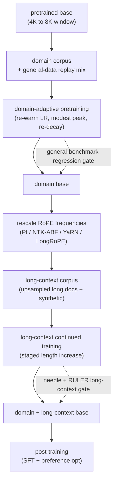
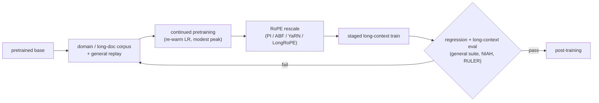

# 15 - Continued pretraining and long-context adaptation

> **Interviewer:** "You have a strong open base model. Your product needs it to
> know a specialized domain (say clinical notes, or a large private codebase) and
> to read documents far longer than the 8K window it was pretrained at, maybe 128K
> tokens. You are not going to pretrain from scratch. Walk me through how you adapt
> the base: how you keep pretraining it on your domain without wrecking its general
> ability, how you push the context window out by more than an order of magnitude,
> what data you feed each step, and how you prove the long context actually works
> and is not just a bigger number in the config. Where does it break?"

This is build-side stage 3: you already have a base model, you do not yet have an
aligned chat model, and you sit in the cheap high-leverage gap between them. The
trap is to treat it as "just keep training" or "just set `max_position_embeddings`
to 128000." Both silently destroy the model. Continued pretraining is a controlled
re-entry into an optimization that already converged, and long-context extension is
a surgical rescaling of the positional encoding plus a targeted continued-training
run, not a config edit. The signal is that you name the two independent axes
(domain and length), reason about catastrophic forgetting and the learning-rate
schedule on the domain axis, reason about positional-encoding rescaling and
attention cost on the length axis, and gate both on an eval that a naive setup
would pass while being broken.

The two adaptations, and the one-line job of each:

1. **Continued / domain-adaptive pretraining (DAPT)** - keep running the
   self-supervised next-token objective on a domain corpus so the base absorbs a
   vocabulary, style, and factual prior the general web underweights. Buys most of
   a domain base for a fraction of a from-scratch pretrain. The risk is forgetting.
2. **Long-context adaptation** - rescale the positional encoding (RoPE frequencies)
   and continue-train on long documents so the model attends coherently across
   128K+ tokens instead of the 4K to 8K it was pretrained at. The risk is quadratic
   attention cost, a linear KV-cache blowup, and recall that decays in the middle.

They are separable. You can do either alone or both in one continued-pretraining
phase, and Llama 3, Code Llama, Yi, and Qwen2.5 each blend them differently.

## 1. Clarify and scope

- **Domain, length, or both?** These are independent knobs with different failure
  modes. "The model is weak on our legal text" is a domain problem (DAPT, data
  mixing). "The model truncates our 200-page contracts" is a length problem (RoPE
  scaling, long-context data). Do not solve one with the tool for the other:
  extending context does not teach a domain, and domain tuning does not lengthen
  the window.
- **How long is long, really?** The honest question behind a 128K ask is what
  fraction of queries actually need it. If the p95 document is 20K tokens, extend
  to 32K and serve it cheaply rather than paying quadratic attention for a 128K
  window almost no request fills. Long context and retrieval (RAG) compose: extend
  for the single big document, retrieve over a corpus.
- **What domain data do you own, and how much?** DAPT wants billions of tokens of
  reasonably clean in-domain text to move the base without just memorizing. A few
  thousand documents is an SFT or RAG problem, not continued pretraining. Quantify
  tokens, cleanliness, license, and how fast the domain drifts.
- **What is the general-ability floor you must not drop below?** Continued
  pretraining trades some breadth for depth. Fix the regression bar up front (MMLU,
  GSM8K, instruction following) so you can detect catastrophic forgetting, not just
  celebrate the domain gain.
- **Where does this sit in the pipeline?** Stage 3 runs on the base, before
  post-training. The output is an adapted base that SFT and preference optimization
  then turn into a chat model. Extending context after alignment is possible but
  harder, because you risk disturbing the aligned behavior, so most recipes extend
  on the base.

## 2. Requirements

**Functional**
- Continue pretraining an existing base on a domain corpus so it absorbs domain
  vocabulary, style, and factual priors without a from-scratch run
- Extend the usable context window by an order of magnitude or more, with coherent
  attention and retrieval across the full length
- Preserve general capability and short-context quality within a stated tolerance
- Produce an adapted base that post-training can align, pinned to its exact data
  and hyperparameters for reproducibility
- Prove the long context works on a discriminating eval, not just a passing
  needle-in-a-haystack toy

**Non-functional**
- Cost a small fraction of a from-scratch pretrain (typically well under a few
  percent of the base's original token budget)
- No catastrophic forgetting: general benchmarks stay within tolerance, measured
  before and after, not asserted
- No short-context regression from the length extension (the model that reads 128K
  must still be sharp at 2K)
- Serveable at the target length under a real VRAM budget, since the KV cache grows
  linearly with context and attention compute grows quadratically

## 3. High-level data flow

A pretrained base enters two continued-pretraining passes that share the
next-token objective but differ in data and positional-encoding setup: a
domain-adaptive pass over a replay-mixed domain corpus, and a long-context pass
over upsampled long documents with rescaled RoPE. The adapted base then flows into
post-training. Evals gate each pass.

The structural point: both passes are the same objective the base was pretrained
with, re-entered under a carefully lowered learning-rate schedule with a changed
data mix and, for the length pass, a changed positional encoding. Nothing here is a
new loss function. The art is entirely in the schedule, the mix, and the rescaling.

## 4. Deep dives

### Continued / domain-adaptive pretraining (DAPT)

Domain-adaptive pretraining keeps the self-supervised objective and swaps the
corpus: instead of the broad web, you feed medical text, legal filings, a private
codebase, or a new language, so the base shifts its prior toward the domain's
distribution. The canonical result (Gururangan et al., "Don't Stop Pretraining")
is that a second phase of in-domain pretraining lifts downstream domain tasks
across biomedical, CS, news, and reviews, and that task-adaptive pretraining on the
task's own unlabeled text stacks on top of it.

- **When it beats SFT or RAG.** DAPT is the right tool when the gap is a broad
  distributional shift the base underrepresents (a specialized register, a
  low-resource language, a large body of proprietary text), not a fixed set of
  facts (RAG) or a narrow behavior (SFT). It shifts the base's whole prior, which
  is exactly what a new domain or language needs and what a few instruction pairs
  cannot do.
- **Token budget.** You want enough in-domain tokens to move the prior without
  simply memorizing. This is billions of tokens for a real domain, not thousands of
  documents. Below that scale, the model overfits the small set and forgets more
  than it learns, so reach for retrieval or a small SFT instead.
- **It is still pretraining.** Same next-token cross-entropy, same data-quality
  discipline (dedup, decontaminate against your evals, filter). The difference from
  stage 2 is only the corpus and the schedule, which is why the mistakes carry over:
  contamination inflates your domain benchmark exactly as it inflates a from-scratch
  one.

### Catastrophic forgetting and replay / data mixing

The central risk of DAPT is catastrophic forgetting: optimize hard on a narrow
domain and the model's general reasoning, instruction-following, and even fluency
outside the domain quietly erode. The weights that encoded broad ability drift to
fit the new distribution.

- **Replay is the primary defense.** Mix a meaningful fraction of general
  (original-distribution) data back into the domain corpus so the gradient never
  fully forgets the old objective. A common recipe is a domain-heavy mix with a
  substantial minority of replayed general tokens; the Mila continual-pretraining
  work shows even a small replay fraction (a few percent) sharply cuts forgetting
  while barely slowing domain gain.
- **Why replay works.** Forgetting is the optimizer overwriting old minima because
  nothing in the current batch rewards keeping them. Interleaving general data keeps
  those minima under gradient pressure, so the model holds two distributions at once
  rather than trading one for the other.
- **Adapters as an alternative.** LoRA / QLoRA freeze the base and learn a low-rank
  domain delta, so the general weights literally cannot move and forgetting is
  bounded by construction. The tradeoff is a lower ceiling on how much domain the
  adapter can absorb versus full continued pretraining; for a large distributional
  shift you want full continued pretraining with replay, for a lighter nudge an
  adapter is safer and cheaper.
- **Measure it, do not assume it.** Run the full general-eval suite before and
  after, not just the domain slice. A DAPT run that lifts the domain benchmark and
  drops MMLU by several points is usually a net loss for a product, and you only see
  it if you gate on the regression.

### Learning-rate re-warmup and annealing

The base model finished its pretraining schedule at a near-zero, fully decayed
learning rate. If you resume continued pretraining at that floor, gradients are too
small to learn the new domain; if you resume at the original peak, you blow away the
converged weights and forget everything. The fix is a deliberate re-warmup then
re-decay, with a peak well below the original.

- **Re-warmup.** Ramp the learning rate back up from the base's final value over a
  short warmup, because the optimizer needs non-trivial step sizes to move into the
  domain, but ramping too fast or too high spikes the loss and destroys prior
  knowledge. The Mila work ("Simple and Scalable Strategies to Continually
  Pre-train") shows re-warming plus re-decaying plus replay lets continued
  pretraining match a full from-scratch retrain at a fraction of the compute.
- **Modest peak.** The re-warm peak is a fraction of the original pretraining peak,
  because you are perturbing a converged model, not exploring from random init. Too
  high forgets, too low stalls; this single hyperparameter is the main forgetting
  versus learning tradeoff.
- **Annealing the mix.** Late in a continued-pretraining run, upweight the highest
  quality and most domain-relevant data as the learning rate decays to zero (the
  "annealing" phase). Cheap, and it sharpens the base measurably right before
  post-training, the same trick frontier pretrains use at the tail of the main run.

### Context-window extension mechanisms

Modern bases use RoPE (rotary position embeddings): each dimension pair `i` is
rotated by an angle proportional to position times a per-dimension frequency
`theta_i = base^(-2i/d)`, so the query-key dot product depends only on the relative
offset. RoPE is what makes context extension cheap, because you can rescale those
frequencies without retraining from scratch. Four mechanisms, from crudest to most
refined:

- **Linear position interpolation (Chen et al. 2023).** Divide every frequency
  uniformly by the length ratio `s = L_new / L_orig`, equivalently compress the
  position indices so a position of 128K maps into the 8K range the model already
  understands. A short continued-training run (on the order of a thousand steps)
  recovers quality. Crucially this is *uniform* scaling of all frequencies. Naive
  extrapolation (just feeding longer positions with no rescaling) instead fails
  catastrophically, because the model has never seen those large rotation angles.
- **NTK-aware / ABF (theta-base scaling).** Instead of scaling positions, scale the
  RoPE *base* itself (Adjusted Base Frequency), for example from 10000 up to 500000
  or 1000000 as Code Llama does. Because the frequency is `base^(-2i/d)`, raising
  the base scales the low-frequency (long-wavelength) dimensions much more than the
  high-frequency ones, so it is a *non-uniform* interpolation that preserves local
  resolution better than uniform PI, with less or no fine-tuning.
- **YaRN (non-uniform scaling plus attention temperature).** YaRN makes the
  non-uniformity explicit and principled. It classifies each RoPE dimension by how
  many full rotations it completes across the original context (its wavelength
  relative to `L_orig`): low-frequency dimensions with long wavelengths get
  interpolated (divided by `s`), high-frequency dimensions with short wavelengths
  are left essentially unscaled so local ordering is preserved, and a ramp blends
  the middle band. YaRN then adds a softmax *temperature* correction to counter the
  entropy change from a longer sequence. The payoff is context extension with far
  less quality loss than uniform interpolation, at roughly 0.1 percent of the
  original pretraining tokens.
- **LongRoPE.** Rather than a hand-designed frequency schedule, LongRoPE searches
  per-dimension rescale factors with an evolutionary search, extends progressively
  (for example 8x, fine-tune, then again to reach 2M+ tokens), and adds a
  short-context recovery step that swaps back to a smaller scaling for short inputs
  so the extended model does not regress on ordinary-length text. The lesson: the
  optimal rescaling is non-uniform *and* input-length dependent, which is why the
  most aggressive extensions search it rather than derive it.

The interview framing: uniform interpolation is the baseline that works but blurs
short-range resolution; every improvement (NTK-ABF, YaRN, LongRoPE) is a way to
scale low frequencies while sparing high frequencies, because the high-frequency
dimensions carry the local ordering the model must keep sharp.

#### The math that separates the extension methods

RoPE assigns dimension pair `i` (of `d` per head) the frequency and per-position
angle

$$\theta_i = b^{-2i/d}, \qquad \phi_i(m) = m \cdot \theta_i, \qquad i = 0, 1, \dots, \tfrac{d}{2}-1$$

with base `b` (commonly 10000). Let the length scale be `s = L_{\text{new}} / L_{\text{orig}}`.

**Linear position interpolation** rescales every frequency uniformly (equivalently, compresses positions by `s`):

$$\theta_i^{\text{PI}} = \frac{\theta_i}{s}, \qquad \phi_i(m) = \frac{m}{s} \cdot \theta_i \quad (\text{same factor for all } i)$$

**NTK-aware / ABF** rescales the base instead, which scales each dimension by a different, `i`-dependent amount (low frequencies shrink much more than high):

$$b' = b \cdot s^{d/(d-2)}, \qquad \theta_i^{\text{ABF}} = (b')^{-2i/d} = \theta_i \cdot s^{-2i/(d-2)}$$

**YaRN** interpolates only the low-frequency dimensions and leaves high-frequency ones alone, via a per-dimension ramp `\gamma_i \in [0, 1]` keyed on the wavelength ratio `r_i = L_{\text{orig}} \theta_i / (2\pi)`:

$$\theta_i^{\text{YaRN}} = \gamma_i \cdot \theta_i + (1 - \gamma_i)\cdot \frac{\theta_i}{s}$$

where `\gamma_i = 1` keeps a high-frequency dimension unscaled and `\gamma_i = 0` fully interpolates a low-frequency one. YaRN adds a softmax temperature `t` on the attention logits to correct the entropy shift at long length:

$$\text{Attn} = \text{softmax}\left(\frac{q^{\top} k}{t \sqrt{d}}\right), \qquad \frac{1}{\sqrt{t}} = 0.1 \ln s + 1$$

**LongRoPE** generalizes YaRN to a searched, fully per-dimension rescale vector `\lambda_i` found by evolutionary search rather than a closed form:

$$\theta_i^{\text{LongRoPE}} = \frac{\theta_i}{\lambda_i}, \qquad \lbrace \lambda_i \rbrace = \arg\min_{\lambda} \ \text{PPL}\big(\text{model}_\lambda, \ \text{long text}\big)$$

The single idea under all four: keep high-frequency (local) dimensions near their
original angles and interpolate the low-frequency (global) ones, because the model
must still tell position `m` from `m+1` while learning to reach position `m+100000`.

### Long-context data curation

Rescaling RoPE only tells the model how to represent long positions; continued
training on genuinely long inputs is what teaches it to *use* them. The data is the
hard part, because natural long documents are rare and short-document packing does
not exercise long-range dependencies.

- **Upsample long documents.** The web is dominated by short pages, so a naive mix
  gives the model almost no gradient signal past a few thousand tokens. Upsample
  books, long code files, legal and scientific documents, and multi-document
  concatenations so a real fraction of every batch actually spans the target length.
- **Do not just pack random short docs.** Concatenating unrelated short documents to
  fill a 128K window teaches the model that distant tokens are irrelevant, the exact
  opposite of what you want. Long-range dependencies must be *real* (a single long
  document, or related documents), so the attention across the window carries signal.
- **Synthetic long-context data.** Because natural long-range supervision is scarce,
  teams synthesize it: insert facts early and query them late, build multi-document
  question-answer chains, aggregate or track state across a long span. This directly
  targets the retrieval and aggregation skills the evals below test, and it is how a
  model learns to attend across the window rather than just tolerate its length.
- **Staged length.** Rather than jump straight to 128K, increase the training length
  in stages (Llama 3 extends from 8K to 128K in six increments), letting the model
  consolidate each length before the next. This is cheaper (shorter sequences early)
  and more stable than one giant-length run.

### The memory and compute cost of long context

Long context is not free, and the cost has two distinct shapes that a strong answer
separates:

- **Attention is quadratic in length.** Self-attention computes an `L x L` score
  matrix, so both compute and (naively) memory scale as `L^2`. FlashAttention makes
  the *memory* linear by never materializing the full matrix, but the *compute*
  stays quadratic, so an 8x longer prefill is roughly 64x the attention FLOPs. This
  is why prefill on a 128K prompt is expensive even before you decode a token.
- **The KV cache is linear in length.** During decoding you cache K and V for every
  past token, so cache memory grows linearly with context: `M_kv = 2 * n_layers *
  n_kv * d_head * L * b * bytes`. At 128K this dominates VRAM and caps batch size,
  which is why grouped-query attention (small `n_kv`), KV quantization, and paging
  matter far more at long context than at short.
- **The two combine badly.** Prefill pays quadratic attention compute; decode pays
  linear KV-cache bandwidth and memory. A 128K-context product can be prefill-bound
  on long prompts and KV-bound on batch size at the same time, which is why long
  context is a serving-systems problem, not just a modeling one. Sliding-window
  attention (Mistral) and related sparsity trade some global reach for a bounded
  cost.

### Long-context evaluation (needle-in-a-haystack, RULER)

The most common integrity failure in long-context work is declaring victory on a
weak eval. A model can pass the easy test and be broken on anything real.

- **Needle-in-a-haystack (NIAH).** Hide a single fact ("the needle") at a random
  depth in a long filler context ("the haystack") and ask the model to retrieve it.
  It is a useful smoke test and a good way to visualize *where* in the window recall
  fails, but it is single-hop retrieval of a verbatim fact, which is the easiest
  possible long-context task. Passing NIAH proves the model can find one thing, not
  that it can reason over the window.
- **RULER.** NVIDIA's RULER extends NIAH into categories that actually stress long
  context: multiple needles, multi-hop tracing (variable chains), aggregation over
  the span, and long-context question answering. Its finding is blunt: most models
  that claim 32K+ degrade sharply well before their advertised length, so the
  *effective* context is much shorter than the configured one. RULER is how you
  distinguish a real 128K model from a 128K config with 16K of real capability.
- **Lost in the middle.** Recall is not uniform across the window: models attend
  best to the beginning and end and worst to the middle, so a fact buried at 50
  percent depth is the hardest to retrieve. NIAH visualizes this as a recall map;
  RULER penalizes it in aggregate. Any long-context claim must report recall as a
  function of depth, not a single averaged number.
- **Keep perplexity honest too.** Long-context perplexity on held-out long documents
  is a cheap continuous signal during training, but it saturates: a model can have
  fine long-context perplexity and still fail RULER, because next-token loss is
  dominated by local prediction. Gate on the retrieval and aggregation evals, not on
  perplexity alone.

### When to use which

The two independent axes each offer competing tools; picking the wrong one wastes the
run. First, how to close a capability gap (the adaptation axis):

| Option | Reach for it when | Cost / skip it when |
|---|---|---|
| Full continued pretraining (DAPT) with replay | A broad distributional shift (a domain or language) with billions of in-domain tokens | Forgetting risk needs replay and a modest re-warm peak; skip below billions of tokens or you memorize and forget |
| LoRA / QLoRA adapters | A lighter domain nudge where you must bound forgetting by construction and keep cost low | A lower ceiling on how much domain it absorbs; skip for a large distributional shift that wants full DAPT |
| SFT | The gap is a narrow behavior or format needing thousands of examples | Teaches format, not a broad prior; skip when the gap is a whole domain or language |
| RAG / retrieval | The gap is a fixed set of facts or a corpus you retrieve chunks from | Does not shift the base's prior; skip when the model needs a new register or style, not facts |
| From-scratch pretrain | No open base in the target distribution exists at all | Lab-scale cost; almost never justified when an adaptable base exists (see topic 14) |
| General-data replay mix | Any full continued-pretraining run where general benchmarks must not regress | A few percent already cuts forgetting sharply; skip only if you accept a measured breadth loss |

Then, how to push the window out (the length axis), from crudest to most refined:

| Option | Reach for it when | Cost / skip it when |
|---|---|---|
| Naive extrapolation (raise max position) | Never; listed only to reject it | Fails catastrophically past the trained window, the config number is not the capability |
| Linear position interpolation (PI) | A simple baseline extension with a short continued-train run | Uniform scaling blurs high-frequency local resolution and hurts short prompts |
| NTK-aware / ABF (raise the RoPE base) | Moderate extension with little or no fine-tuning (Code Llama, base 10000 to 1e6) | A hand-tuned base, less principled than YaRN for aggressive targets |
| YaRN | Aggressive extension to 128K+ at roughly 0.1 percent of pretraining tokens with minimal short-context loss | Temperature and ramp need tuning, more moving parts than PI |
| LongRoPE | Extreme length (2M+) where a searched, length-dependent rescale is worth the cost | Evolutionary search cost plus a short-context recovery step to avoid regression |
| ALiBi | You want train-short-test-long extrapolation with no RoPE rescaling at all | Not a RoPE model and some quality cost; skip when your base already ships RoPE |

## 5. Bottlenecks and scaling

| Bottleneck | First sign | Fix | Tradeoff |
|---|---|---|---|
| Catastrophic forgetting | Domain benchmark up, general benchmarks down | Replay general data, modest re-warm peak, or LoRA | Slower domain gain, more tuning of the mix |
| Learning rate at resume | Loss stalls (too low) or spikes and forgets (too high) | Re-warm from the base's floor to a modest peak, re-decay | One more schedule to tune per run |
| Naive context extrapolation | Quality collapses past the trained window | Rescale RoPE (PI, NTK-ABF, YaRN, LongRoPE) plus continued train | Rescaling can blur short-range resolution |
| Short-context regression | 2K-token quality drops after extending to 128K | Non-uniform scaling (YaRN), or dual-scaling recovery (LongRoPE) | More complex schedule, per-length behavior |
| Long-doc data scarcity | Model tolerates length but cannot use it | Upsample long docs, add synthetic long-range tasks | Data engineering, synthetic-data quality risk |
| Quadratic attention (prefill) | Long prompts dominate latency and FLOPs | FlashAttention (linear memory), sliding window, chunking | Sparsity trades global reach for cost |
| KV-cache blowup (decode) | OOM or tiny batch at long context | GQA/MQA, KV quantization, paged attention | Small quality hit, engineering complexity |
| Lost in the middle | Mid-context facts missed while ends are fine | Synthetic mid-depth training data, position-aware eval | No full fix, must measure recall by depth |

## 6. Failure modes, safety, eval

- **Catastrophic forgetting.** The single most common DAPT failure: the model gains
  the domain and loses general reasoning and instruction-following. Replay general
  data, keep the re-warm peak modest, and gate on the full eval suite, not the
  domain slice.
- **Naive extrapolation / config-only extension.** Setting the max position to 128K
  without rescaling RoPE and without long-context training produces a model that
  emits garbage past its real window. The config number is not the capability; the
  eval is.
- **Short-context regression from extension.** Uniform interpolation crowds
  high-frequency dimensions and degrades adjacent-token discrimination, so the
  extended model gets worse at ordinary short prompts. Test short and long context
  after every extension, not just long.
- **Lost in the middle.** Recall decays toward the center of the window, so a model
  that passes an end-anchored needle test still misses mid-document facts. Report
  recall as a function of depth.
- **Weak-eval self-deception.** Passing needle-in-a-haystack and declaring a 128K
  model. NIAH is single-hop retrieval; RULER's multi-hop, aggregation, and
  multi-needle tasks reveal the effective context is far shorter. Gate on RULER-style
  evals.
- **KV-cache and prefill blowup.** A working long-context model that cannot be
  served: the KV cache OOMs the batch and quadratic prefill dominates latency.
  Budget KV memory and prefill compute at the target length before shipping the
  length.
- **Contamination, again.** Domain continued pretraining can pull your eval sets
  into training just as a from-scratch pretrain can. Decontaminate the domain and
  long-context corpora against the domain and long-context evals, and report it.
- **Synthetic-data drift.** Synthetic long-context data generated by another model
  can bake that model's biases and artifacts into your base. Filter it through the
  same quality gates as natural data and keep a natural-document core.

## 7. Likely follow-ups

- "Continued pretraining or just SFT?" DAPT when the gap is a broad distributional
  shift (a domain, a language) needing billions of tokens; SFT when the gap is a
  narrow behavior or format needing thousands of examples. They compose: DAPT the
  base, then SFT and align it.
- "How do you extend context without a from-scratch long pretrain?" Rescale RoPE
  frequencies (position interpolation, NTK-ABF, YaRN, or LongRoPE) and continue-train
  briefly on upsampled long documents, staging the length up. Extending is a
  late-stage continued-training step, cheap relative to pretraining.
- "Uniform interpolation or YaRN?" Uniform PI is the simple baseline but blurs
  short-range resolution; YaRN scales low frequencies while sparing high ones and
  adds an attention-temperature correction, so it extends further with less quality
  loss. Use YaRN or NTK-ABF for aggressive extension.
- "How do you prove the long context works?" Needle-in-a-haystack as a smoke test
  and recall map, then RULER for multi-hop, aggregation, and multi-needle tasks, and
  report recall by depth to catch lost-in-the-middle. Perplexity alone is not enough.
- "Long context or RAG for our documents?" Long context for a single big document
  you must reason over whole; RAG for a corpus you retrieve chunks from. Long context
  is quadratic in prefill and linear in KV cache, so it does not scale to a whole
  corpus. They compose.
- "How do you keep general ability during DAPT?" Replay a fraction of general data,
  keep the learning-rate re-warm modest, consider LoRA to bound the change, and gate
  on the full general-eval suite before promoting the adapted base.

## 8. Tricky interview questions (and how to nail them)

These separate a memorized answer from real understanding. Each has a sharp,
defensible response.

- **"Why re-warm the learning rate for continued pretraining instead of just
  resuming?"** The base finished at a fully decayed, near-zero learning rate;
  resuming there gives gradients too small to learn the new domain, so the run
  stalls. But resuming at the original peak blows away the converged weights and
  forgets everything. You re-warm from the floor up to a *modest* peak (a fraction
  of the original), then re-decay. The re-warm peak is the main forgetting versus
  learning knob.
- **"Why does naive linear interpolation hurt short-context quality?"** Uniform PI
  divides every RoPE frequency by `s`, including the high-frequency dimensions that
  encode local ordering. Compressing those crowds adjacent positions together, so
  the model loses resolution between nearby tokens and gets worse at short prompts.
  YaRN fixes it by leaving high-frequency dimensions near-unscaled and interpolating
  only the low-frequency ones.
- **"The needle test passes at 128K but RULER fails. What happened?"**
  Needle-in-a-haystack is single-hop retrieval of one verbatim fact, the easiest
  long-context task, and it is often anchored near an edge where recall is best.
  RULER adds multi-hop variable tracing, aggregation over the span, and multiple
  needles, which require actually reasoning across the window. Passing NIAH but
  failing RULER means the *effective* context is far shorter than the configured
  128K, usually with lost-in-the-middle decay.
- **"You extended to 128K and long-context perplexity looks great, but users say it
  cannot find things. Why?"** Perplexity is dominated by local next-token
  prediction, so it saturates and stays low even when long-range retrieval is
  broken. Perplexity measures fluency at length, not use of the context. Gate on
  retrieval and aggregation evals (RULER), and report recall as a function of depth.
- **"Why not just set `max_position_embeddings` to 128000?"** That changes a config,
  not the model. Without rescaling RoPE frequencies the model sees rotation angles
  it never trained on and produces garbage past its real window, and without
  long-context continued training it never learns to attend across the new length.
  Extension is a rescale plus a training run, not an edit.
- **"How much data does context extension actually take?"** Far less than
  pretraining: YaRN reaches long context at roughly 0.1 percent of the original
  pretraining tokens, and position interpolation recovers quality in about a
  thousand fine-tuning steps. The frequencies encode relative position cheaply, so
  the model mostly needs to *adapt* to the rescaled angles, not relearn language.
- **"Your DAPT lifted the domain benchmark but the model got dumber generally.
  Diagnose."** Catastrophic forgetting from too aggressive a domain fit: too high a
  learning-rate peak, too little general-data replay, or too many epochs on a narrow
  set. Fix by adding a replay fraction of general data, lowering the re-warm peak,
  and re-running the full general suite as a gate, not just the domain slice.
- **"Extending context made the model worse at 2K prompts. Is that expected, and can
  you avoid it?"** Expected under uniform interpolation, because it compresses the
  local frequencies that short prompts rely on. Avoid it with non-uniform scaling
  (YaRN spares high frequencies) or with a length-dependent scaling that reverts to
  the original frequencies for short inputs (LongRoPE's short-context recovery / dual
  scaling).

## 9. Commonly answered wrong (the traps)

The mistakes that quietly fail a loop even when the candidate sounds fluent:

- **"To get a domain model, just fine-tune on our documents."** SFT on a few
  thousand documents teaches format and narrow behavior, not a broad domain prior,
  and it overfits and forgets. A real domain shift wants continued pretraining on
  billions of tokens with replay, or retrieval for the facts.
- **"To get long context, raise the max position setting."** A config edit with no
  RoPE rescaling and no long-context training produces garbage past the real window.
  The advertised length is not the capability.
- **"YaRN is just linear interpolation."** No. Uniform position interpolation
  (Chen et al. 2023) scales every frequency by the same factor. YaRN is
  *non-uniform*: it interpolates low-frequency (long-wavelength) dimensions, leaves
  high-frequency (short-wavelength) ones near-unscaled, and adds a softmax
  temperature correction. Conflating them is the classic error.
- **"Continued pretraining is free, just keep training."** It is a controlled
  re-entry into a converged optimization. Resume wrong (no re-warm, or too high a
  peak, or no replay) and you either stall or catastrophically forget. The schedule
  and the mix are the whole game.
- **"Our model passes the needle test, so 128K works."** Needle-in-a-haystack is
  single-hop retrieval and often edge-anchored. RULER's multi-hop, aggregation, and
  multi-needle tasks routinely fail on models that pass NIAH, because the effective
  context is shorter than the configured one.
- **"Long context replaces retrieval."** Long context is quadratic in prefill
  compute and linear in KV cache, recall decays in the middle, and it reprocesses
  everything per query. It handles one big document; it does not scale to a corpus.
  RAG retrieves the few relevant chunks. They compose.
- **"Pack the batch with any documents to hit 128K."** Concatenating unrelated short
  documents teaches the model that distant tokens are irrelevant, defeating the
  point. Long-range dependencies in training data must be real (a single long
  document or related documents) or synthetic and targeted.
- **"General benchmarks did not drop, so there was no forgetting."** Only if you ran
  them. Forgetting is silent and shows up outside the domain slice, so the claim is
  meaningless without a before-and-after general-eval gate. Measure it, do not assert
  it.

---

## Trace the architectures

Context extension lives in the positional encoding, and "rescale RoPE" is abstract
until you open a graph and see where position actually enters the block. Open each
and look at what carries and constrains length.

- **A base built to extend (Llama 3 8B):**
  [open it live](https://www.neurarch.com/?import=https://raw.githubusercontent.com/neurarch-ai/awesome-llm-model-zoo/main/architectures/llama3-8b/model.json).
  Trace RoPE feeding the attention scores and grouped-query attention shrinking the
  KV heads: the first is the frequency schedule you rescale to reach 128K, the second
  is what keeps the KV cache affordable once you get there.

  

- **Sliding-window attention as a long-context lever (Mistral 7B):**
  [open it live](https://www.neurarch.com/?import=https://raw.githubusercontent.com/neurarch-ai/awesome-llm-model-zoo/main/architectures/mistral-7b/model.json).
  Trace grouped-query plus sliding-window attention: a bounded-window design that
  caps the quadratic attention and KV growth long context otherwise pays, trading
  some global reach for cost.

  

- **A modern multilingual base most teams would adapt (Qwen3 8B):**
  [open it live](https://www.neurarch.com/?import=https://raw.githubusercontent.com/neurarch-ai/awesome-llm-model-zoo/main/architectures/qwen3-8b/model.json).
  Trace the RoPE-plus-GQA stack on a current open base: the shape you would
  continue-pretrain for a domain and extend for length rather than pretrain from
  scratch.

  

- **Learned absolute position, the design that cannot extend (GPT-2 small):**
  [open it live](https://www.neurarch.com/?import=https://raw.githubusercontent.com/neurarch-ai/awesome-llm-model-zoo/main/architectures/gpt2-small/model.json).
  Trace the learned positional embedding table: a fixed-size lookup with no notion of
  positions beyond its length, which is exactly why relative schemes like RoPE and
  ALiBi, not learned absolute tables, are what make cheap context extension possible.

  

These are validated reference graphs at real dimensions, shape-checked end to end,
not screenshots. Browse all in the
[Model Zoo](https://github.com/neurarch-ai/awesome-llm-model-zoo) or the
[gallery](https://neurarch-ai.github.io/awesome-llm-model-zoo). Built by
[Neurarch](https://www.neurarch.com).

## Related deep-dive drills

Rapid-fire questions that probe the modeling and systems underneath this topic, from [deep-dives.md](../deep-dives.md):

- [Training, fine-tuning, and overfitting](../deep-dives.md#training-fine-tuning-and-overfitting)
- [Scaling: rooflines, parallelism, and the arithmetic of large models](../deep-dives.md#scaling-rooflines-parallelism-and-the-arithmetic-of-large-models)
- [Normalization and attention variants](../deep-dives.md#normalization-and-attention-variants)
- [Commonly asked, commonly missed](../deep-dives.md#commonly-asked-commonly-missed)

## Seen in production

Real writeups that document domain continued pretraining or long-context extension
in the open. Each is a first-party source; read them for what an interview answer
skips: the data mix, the schedule, the rescaling recipe, and the eval that proved
the length real.

### The shared pipeline

Under one framing, these systems are the same stage-3 skeleton: take a pretrained
base, continue the next-token objective on a domain or long-document corpus under a
lowered, re-warmed learning rate, rescale the positional encoding when the goal is
length, and gate on a domain-regression or long-context eval before post-training.
What differs is which axis they push (domain versus length) and how they rescale
RoPE.

### How they differ

| System | Axis | Extension mechanism | Reach | Key lever | Watch out |
|---|---|---|---|---|---|
| Meta Llama 3 | length | RoPE rescale + staged continued train | 8K to 128K in 6 stages | late-pretrain staged extension | 405B pretrain is lab-scale |
| Meta Code Llama | domain + length | ABF (base 10000 to 1e6) on 16K seqs | up to 100K | continued pretrain from a general base | code domain narrows general ability |
| 01.AI Yi | length | continued pretrain on long data | to 200K | lightweight long-context adaptation | long-data quality is the constraint |
| Nous YaRN | length | non-uniform freq scale + attn temperature | 64K to 128K+ | ~0.1% of pretrain tokens | temperature and ramp must be tuned |
| Microsoft LongRoPE | length | evolutionary per-dim search + progressive | beyond 2M tokens | searched non-uniform rescale + short recovery | search cost, short-context recovery needed |
| Alibaba Qwen2.5 | domain + length | progressive length + YaRN + DCA | to 128K (1M turbo) | staged length with non-uniform scaling | effective length below configured, verify |

### The systems

- **Meta** [The Llama 3 Herd of Models](https://ai.meta.com/research/publications/the-llama-3-herd-of-models/): extends the context window from 8K to 128K in six incremental stages late in pretraining, a staged continued-training extension rather than a from-scratch long pretrain. *(length)*
- **Meta** [Code Llama: Open Foundation Models for Code](https://arxiv.org/abs/2308.12950): continued pretraining of Llama 2 on code with an Adjusted Base Frequency (RoPE base raised from 10000 to 1000000), trained on 16K sequences and generalizing to inputs up to 100K tokens. *(domain + length)*
- **01.AI** [Yi: Open Foundation Models by 01.AI](https://arxiv.org/abs/2403.04652): 6B and 34B bilingual bases extended into 200K-token long-context variants via continued pretraining on long data, with the paper crediting data quality over architecture. *(length)*
- **Nous Research** [YaRN: Efficient Context Window Extension of Large Language Models](https://arxiv.org/abs/2309.00071): non-uniform (wavelength-dependent) RoPE frequency scaling plus a softmax attention-temperature correction extends context at roughly 0.1 percent of the original pretraining tokens, far cheaper than uniform interpolation. *(length)*
- **Microsoft** [LongRoPE: Extending LLM Context Window Beyond 2 Million Tokens](https://arxiv.org/abs/2402.13753): evolutionary search over per-dimension RoPE rescale factors plus progressive extension and a short-context recovery step reaches 2M+ tokens. *(length)*
- **Meta** [Extending Context Window of Large Language Models via Positional Interpolation](https://arxiv.org/abs/2306.15595): linear position interpolation uniformly down-scales position indices into the trained range, extending LLaMA to 32K with about a thousand fine-tuning steps, where naive extrapolation fails catastrophically. *(length)*
- **Ai2** [Don't Stop Pretraining: Adapt Language Models to Domains and Tasks](https://arxiv.org/abs/2004.10964): domain-adaptive and task-adaptive continued pretraining lift downstream tasks across four domains, the canonical evidence that a second in-domain pretraining phase pays off. *(domain)*
- **Mila** [Simple and Scalable Strategies to Continually Pre-train Large Language Models](https://arxiv.org/abs/2403.08763): learning-rate re-warming plus re-decaying plus a small replay fraction lets continued pretraining match a full from-scratch retrain at a fraction of the compute, and quantifies the forgetting-versus-learning tradeoff. *(domain)*
- **Alibaba** [Qwen2.5 Technical Report](https://arxiv.org/abs/2412.15115): pretrained on 18T tokens with long-context adaptation via progressive length increase, YaRN-style scaling, and Dual Chunk Attention, reaching 128K (up to 1M on the turbo variant). *(domain + length)*
- **NVIDIA** [RULER: What's the Real Context Size of Your Long-Context Language Models?](https://arxiv.org/abs/2404.06654): a synthetic benchmark with multi-hop tracing, aggregation, and multi-needle tasks shows most models that claim 32K+ degrade sharply well before their advertised length, so effective context is much shorter than configured. *(evaluation)*
- **Meta** [Train Short, Test Long: Attention with Linear Biases Enables Input Length Extrapolation (ALiBi)](https://arxiv.org/abs/2108.12409): a linear distance penalty on attention scores lets a model trained short extrapolate to longer inputs without retraining, an alternative to RoPE rescaling at some quality cost. *(length)*

More production case studies: the [Evidently AI ML system design database](https://www.evidentlyai.com/ml-system-design) (800 case studies from 150+ companies) is the broadest curated index; this section pulls the ones that map onto this topic.
