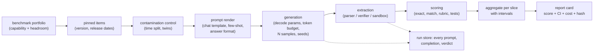

# 16 - Benchmarking a model

> **Interviewer:** "We are choosing between three candidate models and we also
> fine-tuned our own. Walk me through the whole evaluation pipeline. How do you know
> the numbers mean anything?"

This is the model-level twin of [topic 06](06-evaluation-system.md). That one gates a
*feature*; this one produces a defensible number for a *model*. The follow-ups are
always the same three: why does your number differ from the published one, how do
you know a 2-point gap is real, and how do you know the model has not already seen
the test set. All three are systems questions, not metric questions.

The book edition of this topic, with worked figures and a runnable statistics
reference, is [book/benchmark-eval/](../book/benchmark-eval/).

## 1. Clarify and scope

- **What decision does the number drive?** Model selection, training telemetry, a
  release gate, or an external claim. That sets the required rigor and the audience.
- **Which capabilities matter?** Benchmark selection is where most of the error
  comes from; a portfolio that does not match the workload measures the wrong thing
  precisely.
- **Open weights or API?** Decides whether log-probability scoring is available,
  whether you can pin a revision, and whether you control the serving stack.
- **Variable test-time compute?** If candidates have a thinking budget, quality is a
  curve against spend, not a scalar, and a single number silently rewards whoever
  thought longest.
- **What difference must be resolvable?** "We need to call a 2-point gap" constrains
  the design more than anything else, because it is a sample-size statement.

## 2. Requirements

**Functional.** Rank a mixed set of candidates on a capability portfolio; track our
own checkpoints on the same protocol; produce numbers someone outside the team can
reproduce.

**Non-functional.** Resolve differences of about 2 points; control contamination;
report cost alongside quality; complete a full grid overnight so it can run per
candidate rather than per quarter.

**Two consequences to state early.**

1. **The score is an estimate produced by a protocol, so the protocol is part of the
   result.** The reported artifact is a number, an interval, and a protocol hash
   pinning harness commit, prompt template, model revision, decode parameters, and
   sample count.
2. **Published numbers are not comparable to yours, so re-run every baseline
   yourself.** One harness, one protocol, all candidates, including the baseline you
   think you already know.

## 3. The pipeline

The stage nobody plans for is the run store. Keeping raw completions is what lets
you re-score with a fixed parser instead of re-running the models, which separates a
scoring change from a model change for free.

## 4. Deep dives

### The knobs that move the number more than the model does

| Knob | Typical swing | What to do |
|---|---|---|
| Chat template, system prompt | Large, up to near-chance | Render from the model's own template; store the rendered string |
| Few-shot count and order | Several points | Fix per benchmark; fix the shot pool by seed |
| Scoring mode (log-likelihood vs generative) | Large | Choose per benchmark, report which, never mix across candidates |
| Length normalization | Several points | Report which; keep identical across candidates |
| Answer-format instruction and parser | Several points, one-directional | Standardize; measure the parse-failure rate |
| Max output tokens | Very large on reasoning suites | Set from the observed length distribution; report truncation rate |
| Temperature, samples, seeds | Double digits on small suites | One decode policy for all candidates; multiple seeds |
| Serving stack, precision, provider | Enough to flip close calls | Pin engine version and container digest; provider is part of candidate identity |

The canonical treatment is the LM Evaluation Harness maintainers' write-up, which
documents prompt formatting alone moving a model between near-random and competent
on the same items. The practical consequence: **when someone's number does not match
yours, the prior is protocol difference, not model difference.**

### Contamination

Five kinds, and deduplication catches one: verbatim, near-duplicate, format leakage
(the model learned the test's shape, nothing was duplicated), distillation from a
contaminated teacher, and **selection leakage** (nothing entered training; you chose
checkpoints by looking at the test set).

Detection that you can actually run without the training corpus: score post-cutoff
items against difficulty-matched pre-cutoff ones, use a time-gated benchmark
(LiveBench, a LiveCodeBench release window), run membership-inference statistics
such as Min-K% against a reference distribution of text the model could not have
seen, and best of all build a **functional twin**, a benchmark rebuilt to the same
spec with new items. A large drop on the twin is the contamination signature.

Prevention: time-gated live benchmarks, a private internal set, procedurally
generated items with a verifier, and a **sealed slice with a logged query budget**
so selection leakage is bounded and auditable.

### Item validity

A leak-free benchmark still lies if the items are broken. Re-annotation of MMLU
found a single-digit-percent error rate; adversarially filtered commonsense sets
show similar problems; agentic benchmarks have been shown to accept incorrect
solutions because their test suites are too weak. Cheap audits worth running: the
no-question baseline for any multiple-choice set (anything meaningfully above chance
is a red flag), and a manual review of 20 passing agent trajectories before
publishing any agentic number.

### Scoring

Prefer executable checks, then answer matching, then rubrics, then judges.

- **Answer matching** (free-form generation plus equivalence-aware comparison)
  measures the same construct as multiple choice without the option-pattern
  shortcut. Its equivalence step is a pipeline component with its own error rate,
  and no comparison finer than that rate is supportable.
- **Rubric grading** decomposes an open-ended judgment into per-item criteria with
  weights, each nearly binary, which is what models and humans actually agree on.
- **pass@k versus pass^k.** pass@k is coverage, the right metric when something
  downstream verifies and selects. pass^k is reliability, all $k$ attempts
  succeeding, and it decays geometrically: a 90 percent agent is about 43 percent at
  $k=8$. Confusing them is the most common technical mistake in agent evaluation.

### Certifying and correcting an autorater

Once a model grades your benchmark it is part of the instrument. Certify it against
a few hundred expert labels oversampled near the decision boundary, report agreement
and swap consistency, probe it with degenerate inputs (empty, constant, padded, and
an answer containing an instruction aimed at the grader), and pin its version.

Then **correct rather than trust**. Prediction-powered inference keeps the cheap
judge on all $N$ items and a human-labeled subset of size $n$, and rectifies:

$$\hat{\theta}_{\text{PPI}} = \frac{1}{N}\sum_{i=1}^{N} f(X_i) + \frac{1}{n}\sum_{j=1}^{n}\bigl(Y_j - f(X_j)\bigr)$$

The second term is an unbiased estimate of the judge's systematic error, so the
result is unbiased regardless of judge quality, and a better judge buys a tighter
interval rather than a different answer.

### Statistics

A score is an estimate: $\text{SE} = \sqrt{\hat p(1-\hat p)/n}$.

| Items | Example | 95% half-width at $\hat p = 0.5$ |
|---|---|---|
| 30 | competition math sets | about 18 points |
| 198 | GPQA Diamond | about 7 points |
| 500 | SWE-bench Verified | about 4.4 points |
| 2,000 | large aggregate suites | about 2.2 points |

Compare **paired**: with $b$ items A wins and $c$ items B wins,
$\hat\Delta = (b-c)/n$ and $\text{SE} \approx \sqrt{b+c}/n$, which is McNemar's
test. Sizing follows: $n \gtrsim d \cdot 7.85/\delta^2$, so calling a 2-point gap at
10 percent discordance needs on the order of 2,000 items. Add clustered errors for
grouped items, multiple seeds on reasoning suites (single-run swings there routinely
exceed the effect being claimed), and false-discovery control across a
model-by-benchmark grid.

Report cost with quality. Two effort settings of one model are two candidates, and
the reportable unit is a point on a frontier: score, interval, output tokens,
dollars, latency.

## 5. Bottlenecks and scaling

| Bottleneck | First sign | Fix |
|---|---|---|
| Agentic episode cost | The bill is dominated by a few suites | Cache on the protocol hash; stage a smoke subset before the full grid |
| Provider rate limits | Wall clock, not compute, sets the runtime | Shard by item; run providers in parallel |
| Stale cache after a template change | A null result that looks real | Key the cache on the full protocol hash plus item id plus sample index |
| Container drift on code suites | Agentic scores move with no model change | Pin images by digest; log retry counts |
| Small-suite noise | Rankings flip between runs | More seeds, report spread, retire saturated benchmarks |

## 6. Failure modes

- **A suspiciously good number** is contamination, a broken item, or a protocol bug
  until proven otherwise.
- **Truncation scored as failure**: a reasoning model cut off mid-derivation loses
  points for a reason unrelated to ability.
- **Selection leakage**: the reported number is a maximum over many looks.
- **Judge bias in a headline number**: fine for ranking two candidates, wrong as an
  absolute claim.
- **An index that hides the movement**: normalize, weight explicitly, drop saturated
  components, and bootstrap the rank, not just the score.

## 7. Likely follow-ups

- "Your number is 12 points below the model card. Debug it." Ordered checklist, then
  re-run every candidate under your protocol.
- "The new model is 3 points ahead on 400 items. Ship?" Compute it paired; be
  willing to say not distinguishable and give the item count that would settle it.
- "How do you evaluate a model that thinks?" Budget is part of candidate identity;
  report a curve, track truncation, state the decode policy.
- "We deduplicated the training data, so contamination is handled." Name the four
  kinds dedup misses plus selection leakage, and offer a runnable black-box test.
- "Can we just use MMLU?" Saturation, multiple-choice shortcuts, label errors.

## Seen in production

### The shared pipeline

Pinned items, a standardized harness, raw outputs retained, and a report that
carries its protocol. Everyone converges here; the divergence is in what they
standardize and what they treat as the threat.

### How they differ

| System | Standardizes | Threat it designs against |
|---|---|---|
| LM Evaluation Harness (EleutherAI) | Prompt rendering and versioned task configs | Irreproducibility |
| HELM (Stanford CRFM) | A multi-scenario, multi-metric reporting matrix | A single number misleading |
| Inspect (UK AI Security Institute) | The agent loop and tool sandbox | Uncontrolled environments |
| simple-evals (OpenAI) | Legible prompts and parsers | Protocols nobody can replicate |
| HealthBench (OpenAI) | Per-item expert rubric criteria | Holistic scores that do not reproduce |
| Anthropic eval-statistics practice | The analysis | Claiming gaps inside the noise |
| LMArena | Human pairwise preference at scale | Task metrics missing aggregate taste |
| LiveBench, LiveCodeBench | Item recency | Contamination |
| METR | Task length with human baselines | Capability numbers with no business meaning |

### The systems

- **EleutherAI** [Lessons from the Trenches on Reproducible Evaluation of Language Models](https://arxiv.org/abs/2405.14782)
- **Stanford CRFM** [HELM](https://crfm.stanford.edu/helm/)
- **UK AI Security Institute** [Inspect](https://inspect.aisi.org.uk/)
- **OpenAI** [simple-evals](https://github.com/openai/simple-evals) and [HealthBench](https://openai.com/index/healthbench/)
- **Anthropic** [Adding Error Bars to Evals](https://arxiv.org/abs/2411.00640)
- **Cohere Labs and collaborators** [The Leaderboard Illusion](https://arxiv.org/abs/2504.20879), with [LMArena's response](https://lmarena.ai/blog/our-response/)
- **METR** [Measuring AI Ability to Complete Long Software Tasks](https://metr.org/blog/2025-03-19-measuring-ai-ability-to-complete-long-tasks/)
- **LiveBench** [paper](https://arxiv.org/abs/2406.19314) and **LiveCodeBench** [paper](https://arxiv.org/abs/2403.07974)
- **UIUC and collaborators** [Establishing Best Practices for Building Rigorous Agentic Benchmarks](https://arxiv.org/abs/2507.02825)
- **Princeton NLP** [SWE-bench](https://arxiv.org/abs/2310.06770)
- **Thinking Machines Lab** [Defeating Nondeterminism in LLM Inference](https://thinkingmachines.ai/blog/defeating-nondeterminism-in-llm-inference/)

## Trace the architectures

- **The model under test, at real dimensions (Llama 3 8B):**
  [open it live](https://www.neurarch.com/?import=https://raw.githubusercontent.com/neurarch-ai/awesome-llm-model-zoo/main/architectures/llama3-8b/model.json).
  Useful here because the protocol questions are architectural: which tokenizer and
  chat template the harness must render, whether log-probability scoring is even
  available, and how long a generation the KV budget supports before your
  output-token cap starts truncating answers.

  

- **The autorater you would actually run (Qwen3-8B):**
  [open it live](https://www.neurarch.com/?import=https://raw.githubusercontent.com/neurarch-ai/awesome-llm-model-zoo/main/architectures/qwen3-8b/model.json).
  Trace its per-token cost, multiply by suite size times orderings times cadence,
  and the grader stops being free infrastructure and becomes a budget line you can
  size against the human-labeling budget that PPI trades it off with.

  

These are validated reference graphs at real dimensions, shape-checked end to end,
not screenshots. All 92 architectures live in the
[Model Zoo](https://github.com/neurarch-ai/awesome-llm-model-zoo)
([gallery](https://neurarch-ai.github.io/awesome-llm-model-zoo)). Built by
[Neurarch](https://www.neurarch.com).

## Related deep-dive drills

Rapid-fire questions that probe the modeling and systems underneath this topic, from [deep-dives.md](../deep-dives.md):

- [Decoding and sampling](../deep-dives.md#decoding-and-sampling)
- [Training, fine-tuning, and overfitting](../deep-dives.md#training-fine-tuning-and-overfitting)
- [Commonly asked, commonly missed](../deep-dives.md#commonly-asked-commonly-missed)
