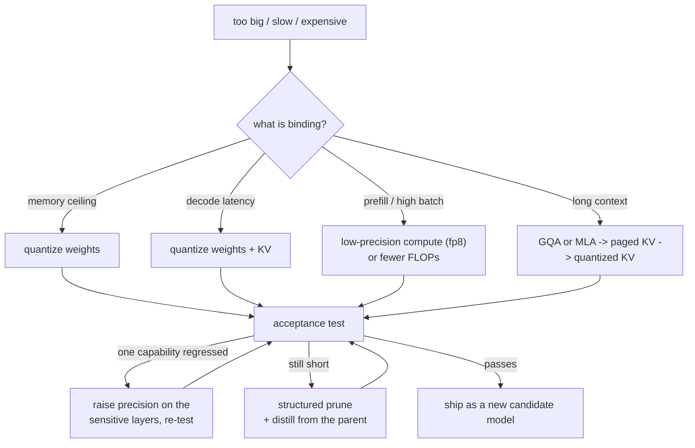

# 17 - Model compression

> **Interviewer:** "This model is too big and too slow for where we need to run it.
> Make it fit, and tell me what it costs us."

There is a wrong answer that sounds right ("quantize to 4-bit, it is basically
free") and a right answer that is three sentences longer: which resource is
actually binding, which lever moves that resource on *your* hardware, and how you
prove the quality you gave up is quality you can afford.

The book edition, with worked figures and a runnable planner, is
[book/model-compression/](../book/model-compression/).

## 1. Clarify and scope

- **What is binding?** A memory ceiling, decode latency, prefill or high-batch
  throughput, and long-context cost are four different problems with four different
  answers.
- **What is the serving shape?** Batch one interactive or large batches. That
  decides whether you are memory-bandwidth bound or compute bound.
- **How long are the contexts?** Past a few thousand tokens the KV cache starts to
  rival the weights, and compressing weights while ignoring KV solves the wrong half.
- **Can we retrain?** Post-training only, a healing budget of billions of tokens, or
  a real training run. This splits the method space in half.
- **Which capabilities cannot move?** "No regression" is not a bar. Compression
  damage is never uniform.
- **What does the target accelerate?** int4 weight-only, fp8 compute, 2:4 sparsity,
  and an on-device NPU's supported formats are four different answers.

## 2. Requirements

**Functional.** Fit the target, hold the named capabilities, and ship an artifact
someone can serve with the runtime you actually deploy.

**Non-functional.** Measured (not predicted) latency and memory on target hardware
at production batch and context; a paired quality comparison against the
uncompressed baseline; a rollback artifact kept warm.

**Two consequences to state early.**

1. **Compression is a hardware question wearing an algorithm's clothes.** A format
   the accelerator does not accelerate is a memory technique, not a speed technique.
2. **Top-line accuracy is the wrong acceptance test.** Compression scatters behavior
   rather than shifting it, so two models can score the same and disagree on a large
   fraction of items. Report a **flip rate**.

## 3. Where the bytes and microseconds go

$$\text{bytes} \approx \underbrace{N b_w}_{\text{weights}} + \underbrace{2 L h_{kv} d_h s B b_{kv}}_{\text{KV cache}} + \text{activations}$$

- **Prefill** processes the prompt at once, reusing each weight across many tokens:
  compute bound, time tracks FLOPs.
- **Decode** produces one token at a time: memory-bandwidth bound, time tracks bytes
  read, so halving weight bytes nearly halves decode latency at small batch.

## 4. Deep dives

### Quantization

Symmetric uniform quantization is
$s = \max|w| / (2^{b-1}-1)$, $q = \text{round}(w/s)$, and everything interesting is
in three choices: **what** you quantize (weights only, weights plus activations, or
the KV cache), **granularity** (per tensor, per channel, or group-wise, which is what
makes 4-bit viable and why "4-bit" is really about 4.125 bits at group 128), and
**where the error goes**.

The difficulty is outliers: a few activation channels carry values orders of
magnitude larger than the rest and are functionally important, so a scale wide
enough for them starves everything else. Four families of fix:

| Family | Idea | Representative |
|---|---|---|
| Keep outliers high precision | Decompose the matmul | LLM.int8() |
| Move the difficulty to weights | Per-channel scaling migrates outliers | SmoothQuant |
| Protect salient weights | Scale channels chosen by activation magnitude | AWQ |
| Compensate the error | Layer-wise second-order rounding | GPTQ |
| Rotate outliers away | Orthogonal rotation, fused at export | QuaRot, SpinQuant |

The rotation family is what unlocked 4-bit *activations* and KV, not just weights.
For long contexts, quantize the cache asymmetrically (keys per channel, values per
token), and remember the order of operations: architectural KV reduction (GQA, MLA)
first, then paging, then quantization, then eviction or windowing last.

**PTQ, QAT, and QLoRA are three different things.** PTQ produces a serving artifact
in hours from a calibration set. QAT simulates the quantizer during training and is
what you escalate to below 4 bits, usually with a distillation loss. QLoRA quantizes
a base in order to fine-tune cheaply; it is not a serving quantization.

### Pruning

Whether removing weights buys anything depends on the *shape*:

| Shape | Quality at 50 percent | Speed | Memory |
|---|---|---|---|
| Unstructured | Best | None on dense kernels | Only with sparse storage |
| 2:4 semi-structured | Worse than unstructured | Real, on sparse tensor cores | About half |
| Structured (heads, channels, layers) | Needs a healing run | Real everywhere | A genuinely smaller model |

Selection criteria matter: magnitude alone is weak, and the activation-aware score
$S_{ij} = |W_{ij}|\cdot\lVert X_j\rVert_2$ (Wanda) is competitive with
reconstruction-based one-shot pruning (SparseGPT) at almost no cost. For structured
pruning, width degrades gracefully while depth buys more latency per unit removed
and damages multi-step behavior disproportionately. The production recipe when you
have no pretraining budget: **prune the parent to the target shape, then distill the
parent into it** (Sheared LLaMA, Minitron).

### Distillation

Soft targets carry the teacher's relative preferences over wrong answers, which is a
far denser signal per token than hard labels. Offline (teacher-scored corpus),
sequence-level, and on-policy (student generates, teacher scores) differ in whether
the student ever sees its own mistakes; on-policy is strongest and makes the teacher
part of your training infrastructure. Two side effects: a student distilled from
long reasoning traces inherits their length, and it inherits the teacher's
contamination, which no cleaning of your corpus can undo.

### Serving a compressed model

- **The win depends on batch size.** Weight-only quantization buys bandwidth, not
  arithmetic: over 3x at batch one and closer to 1.15x at batch 64 for the same
  change.
- **Kernel support is the real constraint.** An unfused dequantize-then-matmul path
  can be net slower. Assert the numeric path at startup, because several stacks fall
  back to higher precision silently.
- **Mixed precision by layer is the standard fix.** Embeddings, the output
  projection, the first and last blocks, and norms stay higher; per-layer
  sensitivity decides the rest.
- **On-device is a different problem**: a hard memory ceiling shared with the OS, a
  short list of fast formats, and batch one. The shipped pattern is a small distilled
  student, quantized to the NPU's format, with task adapters over one resident base
  and a server model for the rest.

## 5. Bottlenecks and scaling

| Bottleneck | First sign | Fix |
|---|---|---|
| Dequantization overhead | Quantized model slower than expected at low batch | Fused kernel for your shape and runtime |
| Win evaporates at production batch | Great in the harness, flat in production | fp8 compute or a smaller model |
| KV dominates at long context | Memory grows with traffic despite quantized weights | Quantized plus paged KV, or a GQA / MLA model |
| One capability regressed | Average holds; JSON validity or long-context recall drops | Per-layer sensitivity, raise precision there |
| Adapters degrade on the quantized base | Adapter works on fp16, not on int4 | Train or validate adapters against the served artifact |

## 6. Failure modes

- **Calibration set mismatched to serving traffic**: fine on public benchmarks,
  degraded on your workload, and the public numbers exonerate the artifact.
- **Silent precision fallback**: no speedup, no error, a confusing week.
- **Sparsity quoted without a shape**: "50 percent pruned" that nobody can reproduce
  as a speedup.
- **Skipping the healing run** after structured pruning and blaming pruning.
- **Composing levers without re-evaluating**: pruning and quantization damage the
  same outlier-sensitive paths, so two levers that each cost a point can cost four.

## 7. Likely follow-ups

- "int4 is 4x cheaper, right?" Bytes yes, FLOPs no, and the win shrinks with batch.
- "50 percent sparse is 2x faster?" Only if the shape is one the hardware can skip.
- "Accuracy held, so it was free?" Report the flip rate.
- "Can we PTQ to 2 bits since 1.58-bit models exist?" Those are trained that way.
- "Which order: prune, distill, quantize?" Prune, heal or distill, then quantize,
  and evaluate the composition.
- "A compressed 70B or a native 8B?" Run both through the same acceptance test; the
  third option (distill the parent into the small model) usually beats both.

## Seen in production

### The shared pipeline

Pick the lever that moves the binding resource, keep a small set of layers at higher
precision, and gate on a paired comparison against the uncompressed model.

### How they differ

| Approach | Primary constraint | Retraining |
|---|---|---|
| Weight-only int4 (GPTQ, AWQ lineage) | Fit and decode latency | None |
| Activation and compute quantization (SmoothQuant, fp8) | Throughput per dollar | None to light |
| Rotation-based low-bit (QuaRot, SpinQuant) | 4-bit activations and KV | None, or learned rotations |
| Train-time ternary (BitNet) | Extreme efficiency | Full pretraining |
| One-shot pruning (SparseGPT, Wanda) | Memory or a sparsity-accelerated target | None |
| Prune plus distill (Minitron, Sheared LLaMA) | A size ladder from one parent | Billions of tokens |
| On-device stacks (Apple Intelligence) | A hard device ceiling and fixed formats | Yes, in model design |
| fp8 end to end (DeepSeek-V3) | Cost across the lifecycle | Designed in |

### The systems

- **LLM.int8()** [8-bit Matrix Multiplication for Transformers at Scale](https://arxiv.org/abs/2208.07339): Keep the outlier channels in 16-bit and the rest in int8. The paper that defined the problem every method below is working around. *(deployment)*
- **SmoothQuant** [Accurate and efficient post-training quantization for LLMs](https://arxiv.org/abs/2211.10438): Migrate the activation outliers into the weights so both sides can be 8-bit, which is what makes W8A8 serving practical. *(deployment)*
- **GPTQ** [Accurate post-training quantization for generative pretrained transformers](https://arxiv.org/abs/2210.17323): Layer-wise second-order rounding that compensates its own error, the first credible one-shot path to 3 and 4 bits. *(deployment)*
- **AWQ** [Activation-aware weight quantization](https://arxiv.org/abs/2306.00978): Protect the salient weight channels, identified from activations rather than from weight magnitude. The most deployed weight-only method. *(deployment)*
- **QuaRot** [Outlier-free 4-bit inference in rotated LLMs](https://arxiv.org/abs/2404.00456): An orthogonal rotation fused at export removes the outliers instead of working around them, which is what unlocked 4-bit activations and KV. *(deployment)*
- **SpinQuant** [LLM quantization with learned rotations](https://arxiv.org/abs/2405.16406): Learn the rotation rather than fixing it, trading a short training step for the accuracy the fixed rotation leaves behind. *(deployment)*
- **Microsoft Research** [The Era of 1-bit LLMs](https://arxiv.org/abs/2402.17764): Ternary weights trained from scratch. The frontier of the format axis, and a reminder that it is not a post-training option. *(training decision)*
- **KIVI** [Asymmetric 2-bit KV cache quantization](https://arxiv.org/abs/2402.02750): Keys quantized per channel, values per token, with no tuning. The asymmetry is the finding. *(deployment)*
- **SparseGPT** [Massive language models can be accurately pruned in one shot](https://arxiv.org/abs/2301.00774): Reconstruction-based one-shot pruning to 50 percent with no retraining. *(deployment)*
- **Wanda** [A simple and effective pruning approach for LLMs](https://arxiv.org/abs/2306.11695): The same result from weight magnitude times input activation norm, with no solve at all. Read it as the argument against complexity in this area. *(deployment)*
- **Princeton** [Sheared LLaMA](https://arxiv.org/abs/2310.06694): Structured pruning to a target shape followed by continued pretraining, a smaller model derived from a parent instead of trained from scratch. *(training decision)*
- **NVIDIA** [Compact Language Models via Pruning and Knowledge Distillation](https://arxiv.org/abs/2407.14679): Minitron. One parent, a size ladder, and the distillation budget each rung actually costs. *(training decision)*
- **Google DeepMind** [On-Policy Distillation of Language Models](https://arxiv.org/abs/2306.13649): The student generates and the teacher scores, so it learns on its own mistakes rather than on the teacher's transcript. *(training decision)*
- **Apple** [Apple Intelligence Foundation Language Models](https://arxiv.org/abs/2407.21075): A hard device ceiling, a short list of fast formats, and task adapters over one resident base. The shipped on-device pattern. *(deployment)*
- **DeepSeek** [DeepSeek-V3 Technical Report](https://arxiv.org/abs/2412.19437): fp8 end to end by design rather than compression applied afterwards, with the training cost stated. *(training decision)*
- **Microsoft Research India** [Accuracy is Not All You Need](https://arxiv.org/abs/2407.09141): Two models at equal benchmark accuracy can disagree on half of their answers. Flip rate is the acceptance test. *(eval bar)*
- **Red Hat AI and vLLM** [llm-compressor](https://github.com/vllm-project/llm-compressor): The path from a recipe to a served checkpoint, which is where kernel support stops being theoretical. *(systems)*
- **llama.cpp** [the GGUF ecosystem](https://github.com/ggml-org/llama.cpp): Quantization formats as a distribution channel, and the reason a k-quant name is the first thing a local deployment argues about. *(systems)*

## Trace the architectures

- **A dense model where the arithmetic is concrete (Llama 3 8B):**
  [open it live](https://www.neurarch.com/?import=https://raw.githubusercontent.com/neurarch-ai/awesome-llm-model-zoo/main/architectures/llama3-8b/model.json).
  Read off layer count, KV head count, and head dimension, then plug them into the
  weight and KV formulas above. That is the whole memory plan, and it is the fastest
  way to see why a long context makes the cache rival the weights.

  

- **Where architecture beats compression (DeepSeek-V3):**
  [open it live](https://www.neurarch.com/?import=https://raw.githubusercontent.com/neurarch-ai/awesome-llm-model-zoo/main/architectures/deepseek-v3/model.json).
  Latent attention shrinks the KV cache structurally and the MoE layers mean most
  parameters do not run per token, which is the point that compression is what you
  do after the architecture is fixed.

  

These are validated reference graphs at real dimensions, shape-checked end to end,
not screenshots. All 92 architectures live in the
[Model Zoo](https://github.com/neurarch-ai/awesome-llm-model-zoo)
([gallery](https://neurarch-ai.github.io/awesome-llm-model-zoo)). Built by
[Neurarch](https://www.neurarch.com).

## Related deep-dive drills

Rapid-fire questions that probe the modeling and systems underneath this topic, from [deep-dives.md](../deep-dives.md):

- [Distillation, pruning, and model compression](../deep-dives.md#distillation-pruning-and-model-compression)
- [Inference, quantization, and serving math](../deep-dives.md#inference-quantization-and-serving-math)
- [Scaling: rooflines, parallelism, and the arithmetic of large models](../deep-dives.md#scaling-rooflines-parallelism-and-the-arithmetic-of-large-models)
