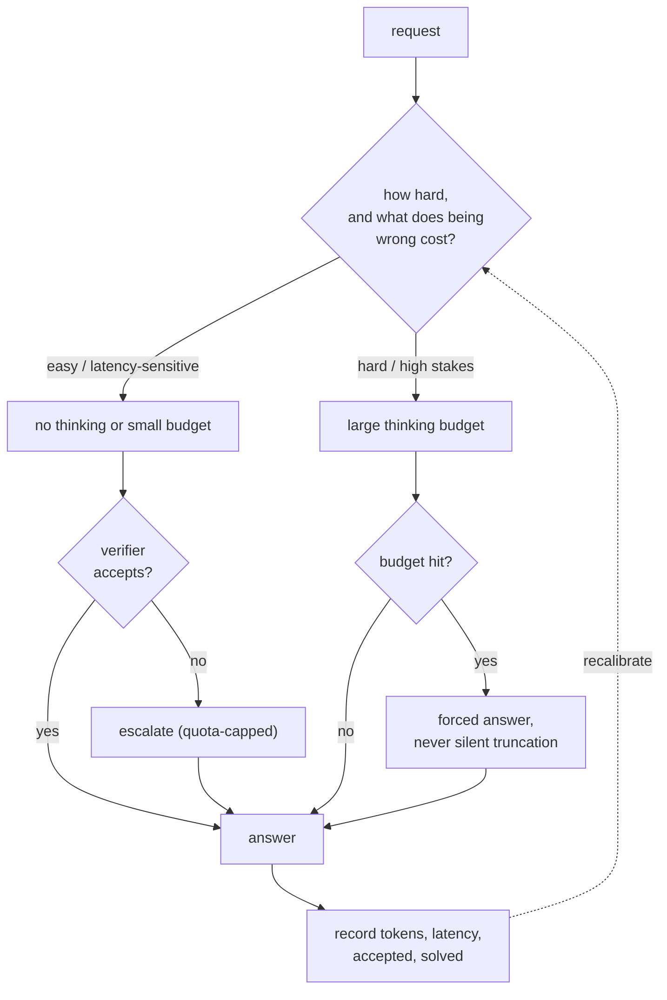

# 18 - Reasoning models and test-time compute

> **Interviewer:** "We switched to a reasoning model. Quality went up, but p99
> latency is unpredictable and the bill tripled. What do you do?"

A model that thinks before answering turns output length from a roughly fixed cost
into a heavy-tailed random variable, and every downstream property (latency tail, KV
pressure, queueing, cost per request, autoscaling) inherits that tail. It is also an
allocation problem: thinking is a quality axis you can buy per request, so the design
question is not "reasoning on or off" but "which requests get how much."

[Topic 05](05-post-training-pipeline.md) covers how these models are made (RLHF,
GRPO, verifiable rewards). This one covers serving one. The book edition, with a
runnable queueing and cost model, is [book/reasoning-serving/](../book/reasoning-serving/).

## 1. Clarify and scope

- **Is there a verifier?** Thinking pays off most where something can check the
  answer, because parallel sampling is useless without a way to select.
- **Is the latency budget a mean or a tail?** A p50 target and a p99 target are
  almost different products once output length is a distribution.
- **Does the user see the thinking?** A progress signal changes perceived latency
  without changing the real one.
- **Do we log outcomes per request?** Without "was it solved," you can compare
  policies on price but not on value.
- **Do we operate the fleet?** If so, thinking tokens hold KV slots and the queueing
  behavior becomes your problem rather than the provider's.
- **Is thinking actually better on this task?** It is not uniformly better, and the
  comparison must be cost-matched.

## 2. Requirements

**Functional.** Serve a mixed workload under a latency promise, allocate a thinking
budget per request, and account for whether each request was solved.

**Non-functional.** Bound the tail, cap cost per request, and report **cost per
solved task** alongside p95 or p99. Neither metric alone ranks a policy: cost per
request is minimized by failing faster, accuracy by spending without limit.

**Two consequences to state early.**

1. **Output length is a random variable, so capacity planning moves from means to
   tails.** Queueing delay depends on the second moment of service time.
2. **Thinking is a purchasable quality axis, so the design is a router with a spend
   dimension**, and the governing metric has a solved-task denominator.

## 3. The decision flow

## 4. Deep dives

### Sequential versus parallel spend

**Sequential** (one longer chain) needs no extra machinery and costs latency, since
tokens are produced serially. **Parallel** (k samples) costs tokens and little
latency, and is worthless without a selector: repeated sampling raises **coverage**,
the chance that at least one sample is right, and only a verifier converts that into
delivered quality. Allocating adaptively by difficulty beats a fixed setting.

Where thinking does not help: factual recall (the fix is retrieval), formatting and
extraction (shallow mappings, and long chains add drift), latency-bound interactive
surfaces, and anything with no checkable signal and no rubric.

### The tail

For service time $S$ at utilization $\rho$, queueing delay grows as

$$E[W] = \frac{\rho}{1-\rho} \cdot \frac{E[S]\,(1 + C^{2})}{2}, \qquad C^{2} = \frac{\text{Var}(S)}{E[S]^{2}}$$

so two workloads with the same mean and different tails have very different p99s,
and the thinking workload always has the fatter tail. On top of the queueing effect
there is a structural one: long generations hold KV slots, the effective batch
collapses, and short requests queue behind them (head-of-line blocking).

Controls, in the order to reach for them: a **hard budget cap** with a **forced
answer** at the boundary (silent truncation returns malformed output and evaluates as
a wrong answer), **separate queues by budget class**, **length prediction** to
restore approximate shortest-job-first, **preemption** at scale, and **admission
control** that downgrades rather than queues under overload.

### Allocation

Three policies, and the arithmetic that chooses between them:

$$C_{\text{cascade}} = c_{\text{short}} + c_{\text{verify}} + (1-a)\,c_{\text{long}} \quad\text{beats}\quad c_{\text{long}} \iff a \gt \frac{c_{\text{short}} + c_{\text{verify}}}{c_{\text{long}}}$$

At a short path around a tenth the cost of the long one, the threshold is near 15
percent: if the cheap path handles even one request in five, cascading wins. And a
cascade has a property the others do not, since escalated requests effectively get
two attempts, so its solve rate can **exceed** always-thinking.

A cheap attempt plus a verifier is also a better difficulty classifier than any
difficulty classifier, because it measures what you care about rather than
predicting it. Use prediction when there is no verifier or when escalation latency
is unacceptable. Model routing composes with budget routing, and the underrated cell
is a small model given room to think with a verifier to catch its mistakes.

### Verification

| Verifier | Signal | Gameable |
|---|---|---|
| Execution (tests, compiler, SQL run) | Ground truth on the tested behavior | Only by overfitting the tests |
| Symbolic or schema check | Exact, for the property checked | Rarely |
| Self-consistency (majority vote) | Agreement, not correctness | Cannot distinguish confident wrongness |
| Outcome reward model | Learned score on the answer | Yes, the classic reward-hacking target |
| Process reward model | Score per step | Yes, more subtly |
| Rubric judge | A model's opinion | Yes: verbosity, self-preference, injection |

Delivered quality is coverage times selector accuracy, so a 0.98 coverage with a 0.6
selector delivers about 0.6: **pass@k is what you can buy, the verifier decides how
much you keep.** Best-of-n against a learned reward is optimization *against* the
verifier, which is why quality can peak and then fall as k grows.

### Serving

Continuous batching matters more and delivers less (slot turnover is the scarce
resource). Prefix caching helps the prompt, not the unique trace. Speculative
decoding attacks exactly the right phase, since thinking is pure bandwidth-bound
decode. Disaggregating prefill and decode becomes more attractive as the decode
phase lengthens. Capacity planning carries three numbers: $E[S]$, $C^2$, and the
budget-cap hit rate.

## 5. Bottlenecks and scaling

| Bottleneck | First sign | Fix |
|---|---|---|
| Slots held by long generations | Effective batch far below configured | Budget caps, budget-class queues, preemption |
| p99 blowup at moderate load | Mean fine, tail terrible | Lower utilization, separate queues, predict length |
| KV pressure from traces | Preemption or OOM under load | Paged and quantized KV, shorter budgets |
| Verification cost exceeds generation | Cost per solved task rises even as quality does | Cheaper verifier, verify only escalations |
| Escalation storm | Traffic shifts, the long path saturates | Cap the escalation rate; shed or downgrade |
| No outcome logging | Policies cannot be compared at all | Log solved-or-not before optimizing anything |

## 6. Failure modes

- **Silent truncation at the budget cap** returns malformed answers and scores as
  wrong reasoning.
- **Cost per request as the headline**: minimized by failing faster.
- **pass@k quoted as reliability**: the user gets one attempt, so the metric is
  pass^k, and a 90 percent agent is about 43 percent at $k=8$.
- **Uncertified judge as the accept test**: converts a quality problem into a silent
  one.
- **Benchmarking a reasoning model against a non-reasoning one on score alone**: the
  comparison must be cost-matched.

## 7. Likely follow-ups

- "Why did p99 get so much worse than the mean?" Second moment plus head-of-line
  blocking.
- "How do you set the budget?" The measured accuracy-versus-budget curve, capped at
  the knee, with the cap-hit rate monitored.
- "Best-of-16 is worse than best-of-4. How?" Optimization pressure against an
  imperfect verifier.
- "How do you schedule without knowing job length?" Predict a length class or
  partition by budget class; FIFO is optimal for nothing here.
- "Just add GPUs?" The most expensive lever, because variance forces you far below
  saturation.

## Seen in production

### The shared pipeline

A budget knob, a policy that decides who gets how much, and something that tells you
whether the answer was right.

### How they differ

| Approach | Budget control | Selection | Watch out |
|---|---|---|---|
| Provider effort parameter | An effort or thinking-token setting | None built in | Little visibility into the tail |
| Self-hosted with a scheduler | Hard caps plus queue policy | Whatever you build | Real serving engineering |
| Prompt-level budget forcing | Suppress or inject the end-of-thinking marker | Usually self-consistency | Forcing a budget the model was not trained for degrades output |
| Best-of-n with an executor | Fixed k, parallel | Tests, compiler, SQL | Sandbox capacity; weak tests accept wrong answers |
| Cascade with a checker | Cheap path then escalate | Executor or certified judge | Escalation storms |
| Process-supervised selection | Fixed k, parallel | Step-level reward model | Verification can cost more than generation |

### The systems

- **DeepSeek** [DeepSeek-R1](https://arxiv.org/abs/2501.12948)
- **Stanford and collaborators** [s1: Simple test-time scaling](https://arxiv.org/abs/2501.19393)
- **Google DeepMind and UC Berkeley** [Scaling LLM Test-Time Compute Optimally](https://arxiv.org/abs/2408.03314)
- **Stanford** [Large Language Monkeys](https://arxiv.org/abs/2407.21787)
- **OpenAI** [Let's Verify Step by Step](https://arxiv.org/abs/2305.20050) and the [reasoning guide](https://platform.openai.com/docs/guides/reasoning)
- **Anthropic** [extended thinking](https://docs.anthropic.com/en/docs/build-with-claude/extended-thinking)
- **Google** [thinking in the Gemini API](https://ai.google.dev/gemini-api/docs/thinking)
- **METR** [Measuring AI Ability to Complete Long Software Tasks](https://metr.org/blog/2025-03-19-measuring-ai-ability-to-complete-long-tasks/)
- **UIUC and collaborators** [Establishing Best Practices for Building Rigorous Agentic Benchmarks](https://arxiv.org/abs/2507.02825)

## Trace the architectures

- **A reasoning-capable open model (Qwen3-8B):**
  [open it live](https://www.neurarch.com/?import=https://raw.githubusercontent.com/neurarch-ai/awesome-llm-model-zoo/main/architectures/qwen3-8b/model.json).
  Its KV geometry is what turns a 10,000-token thinking trace into occupied memory:
  multiply layers by KV heads by head dimension to get bytes per token, then by the
  budget you were about to grant, and the slot-occupancy problem becomes a number.

  

- **Where the architecture makes long thinking affordable (DeepSeek-V3):**
  [open it live](https://www.neurarch.com/?import=https://raw.githubusercontent.com/neurarch-ai/awesome-llm-model-zoo/main/architectures/deepseek-v3/model.json).
  Latent attention compresses the KV cache structurally and sparse expert routing
  keeps per-token compute down, which is why the architecture family behind the
  open reasoning models looks the way it does.

  

These are validated reference graphs at real dimensions, shape-checked end to end,
not screenshots. All 92 architectures live in the
[Model Zoo](https://github.com/neurarch-ai/awesome-llm-model-zoo)
([gallery](https://neurarch-ai.github.io/awesome-llm-model-zoo)). Built by
[Neurarch](https://www.neurarch.com).

## Related deep-dive drills

Rapid-fire questions that probe the modeling and systems underneath this topic, from [deep-dives.md](../deep-dives.md):

- [Reasoning and test-time compute](../deep-dives.md#reasoning-and-test-time-compute)
- [Decoding and sampling](../deep-dives.md#decoding-and-sampling)
- [Inference, quantization, and serving math](../deep-dives.md#inference-quantization-and-serving-math)
