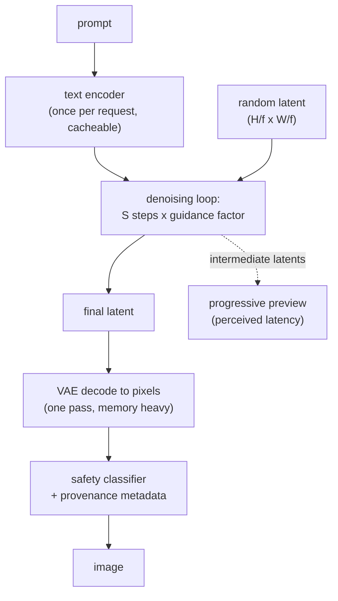

# 19 - Image and video generation serving

**The question, as an interviewer poses it:** "Our image generation feature costs
about eight cents an image and p95 is twelve seconds. Make it cheaper and faster
without the outputs getting visibly worse."

This is the one production LLM-adjacent system whose cost model is not the KV cache,
and candidates who have only served language models answer it wrong. There is no
autoregressive loop, no KV cache, and no per-token billing. There is one number:
**how many times you run the denoiser**. Every lever in this topic is a way to reduce
that number, to make each evaluation cheaper, or to stop paying for evaluations
whose output nobody looks at.

## 1. Clarify and scope

- **What is being generated, and at what resolution?** A 512px thumbnail, a 1024px
  hero image and a five-second video differ by two orders of magnitude in cost. Assume
  1024x1024 images, with a video path added later.
- **Interactive or batch?** A user waiting on a spinner and a nightly catalogue job
  are different systems: the first is a latency problem with a step budget, the second
  is a throughput problem with a queue. Assume interactive, with p95 under 3 seconds.
- **How many images per request?** Most products generate a grid of four so the user
  can choose. That is a batch of four in one denoising pass, not four requests, and it
  changes the arithmetic completely.
- **Who owns the model?** A fine-tuned open checkpoint you serve, or a provider API.
  The first gives you every lever below; the second gives you a size or quality
  parameter and nothing else. Assume self-hosted open weights.
- **What are the safety and provenance requirements?** Input prompt filtering, output
  classification, likeness and trademark policy, and whether generated assets have to
  carry provenance metadata. These are latency and cost items, not afterthoughts.
- **What counts as "not visibly worse"?** This has to be operationalized before you
  optimize, or every change will be argued about forever. Assume a paired human
  preference test on a fixed prompt set, with a stated acceptance bar.

## 2. Requirements

**Functional**

- Text-to-image at 1024x1024, four variants per request.
- Optional image-to-image and inpainting on the same serving path.
- Style adapters (LoRA) selectable per request.
- A video path, five seconds at 24 fps, run as a queued job rather than interactively.

**Non-functional**

- p95 under 3 seconds for a four-image grid, p99 under 6.
- Cost per generated image under 2 cents at target utilization.
- Safety classification on every output before it is returned.
- Provenance metadata attached to every asset.

**Out of scope**

- Training or fine-tuning the base model.
- Model quality research: this is a serving design, and the quality bar is a gate on
  changes rather than a target to move.

## 3. The cost model (say this first)

A diffusion model generates by starting from noise and running a denoiser network
repeatedly. Nothing else about the system matters until this is on the board:

$$
N_{\text{FE}} = S \cdot c, \qquad c = \begin{cases} 2 & \text{with classifier-free guidance} \\ 1 & \text{without} \end{cases}
$$

$$
\text{latency} \approx t_{\text{text}} + N_{\text{FE}} \cdot t_{\text{step}} + t_{\text{decode}} + t_{\text{safety}}
$$

$S$ is the sampler's step count and $N_{\text{FE}}$ the number of forward
evaluations of the denoiser, which is the unit you are actually buying. Classifier-free
guidance runs the model twice per step, once conditioned on the prompt and once
unconditioned, so **turning on guidance doubles the cost of every image**, which is
the first thing many candidates do not know.

The denoiser does not run on pixels. A latent diffusion model encodes the image into
a latent grid with a downsampling factor $f$ (commonly 8), so a 1024x1024 image is a
128x128 latent, and $t_{\text{step}}$ scales with the area of that latent rather than
of the image:

$$
\text{latent side} = \frac{\text{image side}}{f}, \qquad t_{\text{step}} \propto (\text{latent side})^{2} \text{ for a UNet}
$$

For a transformer denoiser the latent is patched into tokens, so a 128x128 latent at
patch size 2 is 4,096 tokens and attention is quadratic in that:

$$
\text{tokens} = \left(\frac{\text{latent side}}{\text{patch}}\right)^{2} = \left(\frac{128}{2}\right)^{2} = 4096
$$

**Worked example.** 30 steps with guidance is 60 forward evaluations. At 1024x1024
on a current data-centre GPU with a compiled engine, that is roughly two seconds of
denoising, plus VAE decode, plus a safety pass. Four variants batch into the same 60
evaluations, so the grid costs barely more than one image, which is why products
offer a grid. Halving the steps halves the wall clock. Turning guidance off halves it
again, but changes the output, so the real lever is a model distilled to need neither.

## 4. Deep dives

### Steps: the sampler is the first lever, and it is free

The original formulation needed on the order of a thousand steps. Deterministic
samplers (DDIM) cut that to tens by treating denoising as an ODE to integrate, and
higher-order solvers reach comparable quality at 20 to 30. This is a pure inference
change: same weights, same outputs distribution, fewer evaluations.

| Sampler family | Typical steps | Why |
|---|---|---|
| Ancestral DDPM | hundreds | Follows the training-time noise schedule literally |
| DDIM and friends | 30 to 50 | Deterministic, non-Markovian, skips steps consistently |
| Higher-order ODE solvers | 20 to 30 | Fewer, better-placed evaluations for the same trajectory |
| Distilled model | 1 to 8 | The step reduction is trained in, see below |

The other half of the same lever is guidance. Guidance strength trades diversity for
prompt adherence, and the doubled cost per step is real, so a guidance-distilled model
that has the effect baked into the weights is worth more than any sampler change.

### Distillation: buying steps back

Getting below roughly twenty steps means changing the model. Four families, and an
interviewer expects you to know what each gives up:

| Method | Steps | Idea | What it costs |
|---|---|---|---|
| [Progressive distillation](https://arxiv.org/abs/2202.00512) | halving each round | A student learns to take two teacher steps at once, repeatedly | Several training rounds, quality erodes at the low end |
| [Consistency models](https://arxiv.org/abs/2303.01469) | 1 to 4 | Train a map from any point on the trajectory straight to its endpoint | Sample diversity, and fine detail |
| [Latent consistency](https://arxiv.org/abs/2310.04378), [LCM-LoRA](https://arxiv.org/abs/2311.05556) | 2 to 8 | The same in latent space, and packaged as an adapter | Some prompt adherence; the LoRA form is the reason it spread |
| [Adversarial diffusion distillation](https://arxiv.org/abs/2311.17042) | 1 to 4 | Add a discriminator so single-step output stays sharp | Training complexity, and diversity again |
| [Rectified flow](https://arxiv.org/abs/2309.06380), [flow matching](https://arxiv.org/abs/2210.02747) | few | Straighten the trajectory so a coarse integrator suffices | An objective decision made at training time, not a serving one |

The pattern to state out loud: **every one of these trades diversity for speed.** A
four-step model produces a narrower range of images from the same prompt, which is
usually fine for a product with a fixed style and wrong for a creative tool. Keep both
paths and route: distilled for the first draft grid, full model for the final render.

### Architecture: where the latent lives, and what the denoiser is

- **Latent diffusion** ([LDM](https://arxiv.org/abs/2112.10752),
  [SDXL](https://arxiv.org/abs/2307.01952)) puts the diffusion process in a compressed
  latent space and uses a VAE to get back to pixels. The 8x downsample is what makes
  1024px generation affordable at all, and the VAE decode is a separate, memory-heavy
  pass that people forget to budget.
- **UNet or transformer.** The convolutional UNet was the default; the
  [DiT](https://arxiv.org/abs/2212.09748) line replaced it with a transformer over
  latent patches, which scales more predictably and is what current systems
  ([SD3](https://arxiv.org/abs/2403.03206), the video models) are built on. For
  serving, the difference is that a transformer denoiser has the quadratic attention
  cost you already know how to reason about, and the same optimizations apply.
- **Text conditioning** is a cross-attention (or joint attention) on the text encoder
  output. It runs once per request and its result is cacheable, which is worth doing
  for repeated or templated prompts.

### Serving: this workload is not an LLM

| Property | LLM decode | Diffusion |
|---|---|---|
| Shape | Grows token by token | Fixed from the start |
| State | KV cache grows with sequence | None between steps beyond the latent |
| Batching | Continuous, requests join and leave | Static, same step count for the whole batch |
| Bound by | Memory bandwidth | Compute, mostly |
| Failure under load | Cache pressure, preemption | Queueing, and memory spikes at VAE decode |

The consequences are concrete. Fixed shapes make this the easy case for compiled
engines: ahead-of-time compilation with a fixed resolution and batch size is where the
large speedups live. But compiling ties you to those shapes, so supporting many
resolutions means many engines, and **cold start becomes the dominant operational
problem**: a compiled engine can take a minute or more to load against roughly ten
seconds for an uncompiled one, which decides whether you can autoscale to zero.

Four more serving decisions that come up:

- **Adapters.** Style LoRAs are small and swappable, so keep one base resident and
  swap adapters per request rather than holding one model per style. Adapter swapping
  is cheap; a second base model is not.
- **VAE decode.** One pass, but its activation memory scales with output pixels and it
  is a common out-of-memory source at high resolution. Tiled decode trades a little
  seam risk for a bounded footprint.
- **Progressive preview.** Decoding an intermediate latent every few steps and
  streaming it changes perceived latency far more than shaving a step does. It costs
  extra VAE passes, so decode a small preview rather than a full-resolution one.
- **Safety is a second model in the path.** Prompt classification before, output
  classification after, and both count against the latency budget. Run the output
  classifier on the decoded preview when you can, so a rejection does not pay for the
  full decode.

### Video: the same model with one more axis

Video generation multiplies the cost by frames. A five-second clip at 24 fps is 120
frames, and the denoiser now runs over a spatio-temporal latent, so a single
generation is minutes rather than seconds on the same hardware.

- **It is a batch workload.** Treat it as a queued job with a progress channel, not a
  request-response endpoint. Every product that tried the opposite ended up building
  the queue anyway.
- **Temporal consistency is the whole difficulty.** Per-frame generation flickers;
  the fix is 3D (space plus time) attention or temporal layers, which is what makes
  the cost superlinear in clip length ([Video LDM](https://arxiv.org/abs/2304.08818),
  [Stable Video Diffusion](https://arxiv.org/abs/2311.15127),
  [Lumiere](https://arxiv.org/abs/2401.12945),
  [Movie Gen](https://arxiv.org/abs/2410.13720)).
- **Length is generated in chunks** with overlap and conditioning on previous frames,
  so quality degrades with distance from the conditioning frame. Quote clip length
  limits, not an unbounded capability.
- **The economics are different.** At minutes of GPU time per clip, cost per second
  of output video is the metric, and a preview tier at low resolution and frame rate
  is how products stay affordable.

## 5. Bottlenecks and scaling

In the order they bite:

1. **Denoiser evaluations.** Steps times guidance. Attack this first, with a better
   sampler, then a distilled model.
2. **GPU memory at decode.** The VAE pass, not the denoising loop, is what sets peak
   memory at high resolution.
3. **Cold start and engine load.** Decides whether scale-to-zero is possible, and
   therefore the cost floor of a spiky workload.
4. **Queueing.** Generation times are long and highly variable, so the same
   head-of-line blocking that hurts reasoning models hurts here: separate queues for
   image and video, and admission control that degrades resolution rather than
   queueing indefinitely.
5. **Storage and egress.** Generated assets are large and often kept. At volume this
   line is a real fraction of the bill and nobody plans for it.

## 6. Failure modes, safety, eval

- **FID is not the product metric.** It measures distribution distance on a dataset
  and is nearly useless for "did this prompt produce a good image". Use paired human
  preference on a fixed prompt set, plus a prompt-adherence check.
- **Prompt adherence needs its own measurement.** Automatic proxies (a VQA model asked
  whether the requested object is present, or an image-text similarity score) are
  cheap and correlate well enough to gate a change.
- **A distilled model regresses quietly.** It will look fine on the demo prompts and
  narrow on the tail, so the acceptance test is a paired comparison across a prompt
  set that includes hard compositions, text rendering and unusual styles.
- **Safety has four separate surfaces**: prompt filtering, output classification,
  policy on likeness and trademarks, and provenance metadata on the asset. They fail
  differently and need separate tests.
- **Determinism matters more than people expect.** Seeded generation lets a user
  reproduce an image and lets you diff two model versions on identical inputs. Losing
  it to a kernel or scheduler change turns every quality investigation into an
  argument.

## 7. Likely follow-ups

- **"Why did turning off guidance make it twice as fast?"** Because guidance is two
  forward evaluations per step, one conditioned and one not, and the cost unit is
  evaluations rather than steps.
- **"You dropped from 30 steps to 4. What did you give up?"** Diversity, mostly, plus
  some fine detail and prompt adherence at the extremes. Show the paired preference
  result on a hard prompt set, not on the demo prompts.
- **"Why is video not just images in a loop?"** Because independent frames flicker,
  so the model attends across time, which makes the cost superlinear in length and
  makes chunked generation with conditioning the standard approach.
- **"Where does the memory go at 2048px?"** The VAE decode, not the denoiser. Tiled
  decode bounds it.
- **"Can you autoscale this to zero?"** Only if cold start fits your latency budget,
  which usually means keeping an uncompiled fallback warm or accepting a queue on the
  first request after idle.
- **"How would you serve fifty style LoRAs?"** One resident base, adapters swapped per
  request, batched by adapter where the queue allows.

## Seen in production

Real writeups from teams that serve or build these models. The papers here are
first-party technical reports from the labs that shipped the systems, and the
engineering posts are where the serving numbers live.

### The shared pipeline

Text encode once, denoise for as few evaluations as you can get away with, decode
once, classify, attach provenance. Everyone converges on that shape. The divergence
is in how they buy back steps and what they compile.

### How they differ

| System | Buys speed with | Gives up |
|---|---|---|
| SDXL | A larger base plus a refiner stage | Cost per image, in exchange for quality at 1024px |
| SDXL-Turbo (ADD) | Adversarial distillation to 1 to 4 steps | Diversity, and some prompt adherence |
| LCM and LCM-LoRA | Consistency distillation, shipped as an adapter | Some detail, in exchange for being drop-in |
| Stable Diffusion 3 | A rectified-flow transformer, straighter trajectories | An architecture change, not a serving switch |
| Compiled engines (TensorRT) | Fixed shapes and fused kernels | Cold start, and one engine per shape |
| Stable Video Diffusion, Movie Gen | Spatio-temporal attention | Interactive latency: these are batch jobs |

### The systems

- **Stability AI** [SDXL: improving latent diffusion models for high-resolution image synthesis](https://arxiv.org/abs/2307.01952): The base-plus-refiner design and the conditioning tricks behind most open image generation. *(product design)*
- **Stability AI** [Adversarial diffusion distillation](https://arxiv.org/abs/2311.17042): SDXL-Turbo, single-step generation with a discriminator keeping it sharp, and the clearest statement of the diversity tradeoff. *(training decision)*
- **Stability AI** [Scaling rectified flow transformers for high-resolution image synthesis](https://arxiv.org/abs/2403.03206): SD3, the move to a flow-matching objective and a transformer denoiser, with the ablations that justified it. *(training decision)*
- **Stability AI** [Stable Video Diffusion](https://arxiv.org/abs/2311.15127): More detail on video data curation than on the architecture, which is the honest ordering for this problem. *(data recipe)*
- **Meta** [Movie Gen](https://arxiv.org/abs/2410.13720): A cast of media foundation models, with the training and inference scale stated. *(product design)*
- **Meta** [Emu](https://arxiv.org/abs/2309.15807): Quality-tuning on a couple of thousand hand-picked images beats another scrape, the counter-argument to scale in generation. *(data recipe)*
- **Google** [Lumiere](https://arxiv.org/abs/2401.12945): A space-time architecture that generates the whole clip at once rather than keyframes plus interpolation. *(product design)*
- **OpenAI** [Consistency models](https://arxiv.org/abs/2303.01469): The one-step formulation the whole distillation line descends from. *(training decision)*
- **Baseten** [40 percent faster SDXL inference with TensorRT](https://www.baseten.co/blog/40-faster-stable-diffusion-xl-inference-with-nvidia-tensorrt/): The compiled-engine tradeoff with numbers, including the cold-start cost that decides whether you can scale to zero. *(deployment)*
- **Baseten** [How to benchmark image generation models](https://www.baseten.co/blog/how-to-benchmark-image-generation-models-like-stable-diffusion-xl/): What to measure, and why throughput and latency answer different questions here. *(eval bar)*
- **NVIDIA** [Generating images with SDXL on the NVIDIA AI inference platform](https://developer.nvidia.com/blog/generate-stunning-images-with-stable-diffusion-xl-on-the-nvidia-ai-inference-platform/): The optimization stack for a fixed-shape workload, end to end. *(deployment)*
- **NVIDIA** [Optimizing transformer-based diffusion models for video generation](https://developer.nvidia.com/blog/optimizing-transformer-based-diffusion-models-for-video-generation-with-nvidia-tensorrt/): The same, one axis up, where the attention cost over space and time dominates. *(deployment)*
- **Modal** [Cold start performance](https://modal.com/docs/guide/cold-start): The operational half of the compiled-engine decision, from a platform whose whole product is that problem. *(systems)*
- **Hugging Face** [LCM-LoRA](https://huggingface.co/blog/lcm_lora): Step distillation packaged as an adapter, which is why few-step generation spread as fast as it did. *(deployment)*

## Trace the architectures

- **The denoiser, as a graph ([diffusion UNet](https://www.neurarch.com/?import=https://raw.githubusercontent.com/neurarch-ai/awesome-llm-model-zoo/main/architectures/diffusion-unet/model.json)):**
  open it live and trace where the timestep and text conditioning enter, and what the
  down and up paths cost. The thing to notice is that this whole graph runs once per
  forward evaluation, which is the number the cost model is about.
- **The transformer denoiser ([DiT-XL/2](https://www.neurarch.com/?import=https://raw.githubusercontent.com/neurarch-ai/awesome-llm-model-zoo/main/architectures/dit-xl2/model.json)):**
  the latent is patched into tokens, so the attention arithmetic you already know
  applies directly. Multiply the token count by the step count to see why a 2048px
  generation is not twice a 1024px one.
- **The text encoder ([CLIP ViT-B/32](https://www.neurarch.com/?import=https://raw.githubusercontent.com/neurarch-ai/awesome-llm-model-zoo/main/architectures/clip-vit-b32/model.json)):**
  it runs once per request and its output is cacheable, which is the cheapest
  optimization in the whole pipeline.

These are validated reference graphs at real dimensions, shape-checked end to end,
not screenshots. All 92 architectures live in the
[Model Zoo](https://github.com/neurarch-ai/awesome-llm-model-zoo)
([gallery](https://neurarch-ai.github.io/awesome-llm-model-zoo)). Built by
[Neurarch](https://www.neurarch.com).

## Related deep-dive drills

Rapid-fire questions that probe the modeling underneath this topic, from
[deep-dives.md](../deep-dives.md):

- [Generative model families](../deep-dives.md#generative-model-families)
- [Decoding and sampling](../deep-dives.md#decoding-and-sampling)
- [Inference, quantization, and serving math](../deep-dives.md#inference-quantization-and-serving-math)
- [Commonly asked, commonly missed](../deep-dives.md#commonly-asked-commonly-missed)
